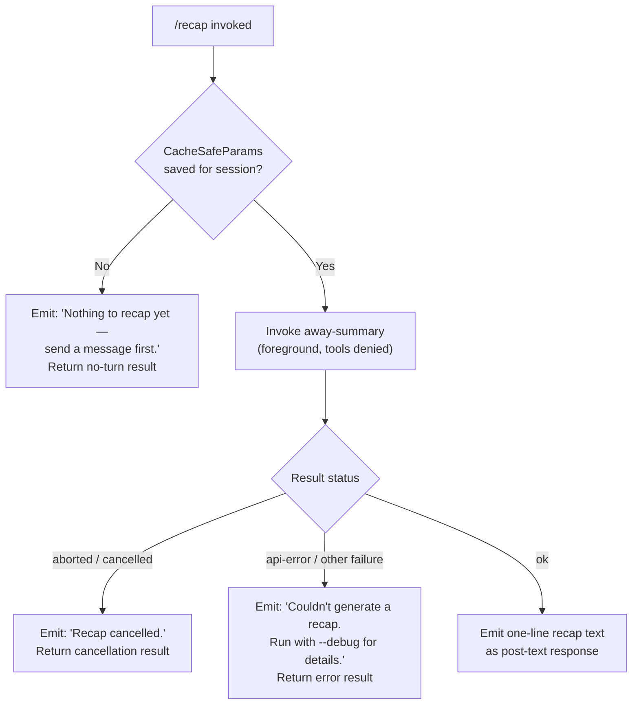

# `/recap`

> Analysis basis: CC v2.1.168 bundle.js (AST extraction + Claude interpretation)
> Minimum version: v2.1.168

---

## Overview

The `/recap` command generates a concise one-line summary of the current session on demand. It invokes the session's "away summary" mechanism (normally used for background compaction) as a synchronous foreground request, then prints the resulting recap text as a post-text response. When no conversation turns have occurred yet, or when the operation is cancelled or fails, it emits a short diagnostic message instead.

---

## Registration

| Field | Value |
|---|---|
| type | `local` |
| name | `recap` |
| description | `Generate a one-line session recap now` |
| loc_byte | `13009043` |
| loc_byte_end | `13009259` |
| loc_line | `9627` |
| supportsNonInteractive | `false` |
| thinClientDispatch | `post-text` |
| load_inline | `true` |
| load_ident | `jFf` |
| arbor_handler.name | `jFf` |
| arbor_handler.fqn | `claude-2.1.168::jFf` |
| arbor_handler.kind | `AsyncFunction` |
| arbor_handler.resolution_path | `load_ident` |
| arbor_handler.n_hits | `0` |

Analysis basis: CC v2.1.168 bundle.js:+13009043

---

## Input Branching

The command execution has four distinct outcome paths based on the session state and the result of the away-summary call, requiring a Mermaid flowchart.



Analysis basis: CC v2.1.168 bundle.js:+13008793, +13008885, +13008943, +5488713, +5488771

---

## Behavioral Spec

### Handler Entry — `recapCommandHandler` (`jFf`)

The handler is an `AsyncFunction` resolved via the `load_ident` path. It is inlined as `load: () => Promise.resolve({ call: jFf })` in the registration object.

```
async function recapCommandHandler(context):
    result = await awayOrRecapSummary(context)
    return result
```

Analysis basis: CC v2.1.168 bundle.js:+13008651

---

### Away-Summary Dispatcher — `awaySummaryDispatcher` (`oz8`)

This is the primary orchestration function called by the handler. It checks whether a cached-safe parameter snapshot exists for the current session, then either returns a "no-turn" sentinel or proceeds to call the model.

```
async function awaySummaryDispatcher(context):
    params = getCacheSafeParams(context)   // reads saved snapshot

    if params is null or undefined:
        log("[awaySummary] no CacheSafeParams saved, skipping")
        return { status: "no-turn" }

    // Register an abort listener so that if the parent signal fires,
    // the inner request is also aborted.
    context.signal.addEventListener("abort", () => innerAbortController.abort())

    summaryResult = await runSummaryQuery(params, context)

    // Find the last message in the result
    lastMessage = summaryResult.messages.find(...)

    if summaryResult.status === "aborted":
        return { text: "Recap cancelled.", status: "aborted" }

    if summaryResult.status === "api-error" or other non-ok:
        return { text: "Couldn't generate a recap. Run with --debug for details.", status: "error" }

    recapText = extractRecapLine(lastMessage)
    return { text: recapText, status: "ok" }
```

Analysis basis: CC v2.1.168 bundle.js:+5488692, +5488711, +5488713, +5488771, +5488808, +5488827, +5488839, +5489231, +5489320, +5489381

---

### Permission Gate — Tool Denial

Within the summary query call, any tool-use request is intercepted and denied with a static reason string. This prevents the recap from side-effecting the filesystem or executing subagents.

```
function toolPermissionGate(toolRequest):
    return { decision: "deny", reason: "Away summary cannot use tools" }
```

Analysis basis: CC v2.1.168 bundle.js:+5489004, +5489019

---

### Summary Query Executor — `runSummaryQuery` (`EG`)

This is the core model-call function that drives the away-summary agent loop. It constructs a lightweight agent invocation tagged `away_summary`, passes the cached safe parameters, and streams the model response.

```
async function runSummaryQuery(cacheSafeParams, context):
    startTime = Date.now()

    sessionState = getAppState()

    // Build query options:
    //   - thread tag: "away_summary"
    //   - tool use: disabled (deny gate applied above)
    //   - model: inherits from session
    //   - abort signal: inner controller

    agentResult = await invokeAgentLoop(
        params    = cacheSafeParams,
        threadTag = "away_summary",
        toolGate  = toolPermissionGate,
        signal    = innerAbortController.signal
    )

    return agentResult
```

Analysis basis: CC v2.1.168 bundle.js:+5488886, +5489087, +10942012, +10942226, +10942244

---

### Result Text Extraction — `flatMapMessages` (`kN9`)

After the agent loop returns, the result messages are flat-mapped to extract the final assistant text content.

```
function extractRecapLine(messages):
    lines = messages.flatMap(msg => getTextContent(msg))
    return lines.join(", ").trim()
```

Analysis basis: CC v2.1.168 bundle.js:+5489248, +5489337, +5489547

---

### Outcome Constants

The following string literals control the user-visible output at the three terminal branches:

| Condition | User-visible message |
|---|---|
| No session turns yet | `"Nothing to recap yet — send a message first."` (bundle.js:+13008793) |
| User cancelled recap | `"Recap cancelled."` (bundle.js:+13008885) |
| API or model error | `"Couldn't generate a recap. Run with --debug for details."` (bundle.js:+13008943) |

Analysis basis: CC v2.1.168 bundle.js:+13008793, +13008885, +13008943

---

## State & Side Effects

| Item | Detail |
|---|---|
| Telemetry | `tengu_feature_ok` (bundle.js:+1010950), `tengu_feature_sad` (bundle.js:+1011093), `tengu_feature_bad` (bundle.js:+1011012), `tengu_query_error` (bundle.js:+10909182), `tengu_auto_compact_succeeded` (bundle.js:+10897498), `tengu_auto_compact_rapid_refill_breaker` (bundle.js:+10897035), `tengu_fork_agent_query` (bundle.js:+10943867), `tengu_forked_agent_default_turns_exceeded` (bundle.js:+10943424) |
| Hook registration | The inner query loop registers a `NPA.register` hook via `j9` (bundle.js:+60369); no persistent hook is added for `/recap` itself |
| appState changes | `getAppState` / `setAppState` called inside the agent loop (`bN8`); recap does not mutate session-level appState directly |
| Abort propagation | Parent abort signal is bridged to an inner `AbortController`; on abort the result is tagged `"aborted"` (bundle.js:+5488808, +5488827, +5488839) |
| thinClientDispatch | `post-text` — the result text is appended to the conversation view after the command returns |
| Sound | None observed in depth-2 traversal |
| Non-interactive support | `supportsNonInteractive: false` — command is blocked in `--print` / piped mode |

---

## Version History

| Version | Change |
|---|---|
| v2.1.168 | Initial analysis |

---

## Common Mistakes

1. **Running `/recap` before sending any messages** — The command checks for a `CacheSafeParams` snapshot that is only written after the first conversation turn. If none exists the command silently returns `"Nothing to recap yet — send a message first."` with no model call made.
2. **Expecting a multi-sentence summary** — The command description and the away-summary mechanism both target a *one-line* recap. Callers should not rely on structured or multi-paragraph output.
3. **Using in non-interactive mode** — `supportsNonInteractive: false` means `/recap` is unavailable in `--print` / piped / headless sessions; the CLI will reject the command before the handler runs.
4. **Assuming tool output is included** — The tool-denial gate blocks all tool invocations inside the recap query. The recap is derived purely from conversation history visible to the model at call time, without any live tool results.
5. **Treating a cancelled recap as an error** — The `"Recap cancelled."` message signals a user-initiated abort (e.g. Ctrl-C), not a failure; integrations should distinguish this from the `"Couldn't generate a recap."` error path.

---

## Appendix — Identifier Mapping

> For bundle debugging only. Identifiers change across versions.

| Identifier | Role |
|---|---|
| `jFf` | `recapCommandHandler` — async entry point for `/recap`; resolved via `load_ident` |
| `oz8` | `awaySummaryDispatcher` — checks CacheSafeParams, orchestrates the summary query |
| `GAH` | Helper called at start of `awaySummaryDispatcher` (exact role not determined at depth-2) |
| `v` | `buildQueryMessage` — constructs the message object passed to the agent loop |
| `snK` | Sub-helper of `buildQueryMessage`; calls `KI`, `M0A`, `IPA` |
| `IPA` | Content-type formatter; calls `edK`, `HcK` |
| `H` | Bootstrap/context fetch utility; reads `qA`, calls `Y3`, `mj_`, `lHH`, `uj`, `H9`, `t75`, `o6` |
| `mj_` | String parser: splits, trims, indexOf, slice on raw input |
| `lHH` | Set membership check via `o74.has` |
| `uj` | String replace helper |
| `H9` | Compound string transform: calls `m6H`, `s9`, `FJ` |
| `o6` | Output writer: calls `l`, `J6` |
| `RH` | JSON serialiser wrapper (`JSON.stringify`) |
| `G4` | Path/filename normaliser: calls `K0A`, replace, at, lastIndexOf, slice |
| `K0A` | Array map over path segments (`inK.map`) |
| `EUH` | Write emitter: calls `nWA` |
| `nWA` | Direct stream writer (`H.write`) |
| `_iK` | Transcript/log file manager: handles mkdir, appendFile, rename, unlink, byte-length checks |
| `npH` | Debounced write scheduler: uses `clearTimeout`, `setTimeout`, `setImmediate`, push/join queues |
| `YKH` | Log-file path builder: calls `r76`, `IHH.join`, `t8`, `R6` |
| `d6` | Directory existence check helper |
| `B76` | EISDIR error guard |
| `$0A` | Path join with `R6` |
| `ll8` | File rotation helper: stat, endsWith `.txt`, rename, unlink |
| `HiK` | Async append-to-log function: mkdir, appendFile, rotate |
| `j9` | Hook registrar (`NPA.register`) |
| `EG` | `runSummaryQuery` — core agent-loop runner for the away summary |
| `bN8` | Session-state loader/saver: calls `getAppState`, `setAppState`, `MfH`, `jjH`, `tj9` |
| `Kb` | Token/cache key builder: calls `lq`, `TY9` |
| `MfH` | Model-params serialiser: `Db`, `_.load`, `H.dump` |
| `jjH` | Session-state merger helper |
| `tj9` | Turn-counter or timing helper |
| `M` | Message-store accessor: calls `xbH`, `PF8`, `L.get`, `v`, `L.values`, `$`, `cDA` |
| `Dy8` | State-diff or patch helper |
| `WS` | Random-bytes generator (`Mw8.randomBytes`, 8 bytes, hex) |
| `xN8` | Thread-tag resolver (produces `"main"` or `"away_summary"`) |
| `A9H` | Agent-loop bootstrap: calls `r4`, `vbH` |
| `r4` | Hook-registry setup (`j9`) |
| `vbH` | Message filter by provider prefix `"ant"`: calls `Eu8`, `Cu8`, `Tdf` |
| `Xp` | Agent turn orchestrator: calls `ADf`, `zD8`, `SH`, `CH` |
| `ADf` | Full agent query loop (large function — stream start/end, tool execution, compact, refusal fallback, etc.) |
| `zD8` | Subagent-exit cleanup: clears `Im`, `Hx_`, `QG6` maps |
| `SH` | Success logger: calls `l`, `J6` |
| `CH` | Error/cancellation logger: calls `l`, `J6` |
| `_h6` | "Avoid prompts" feature-flag check (`POf.has`) |
| `I9H` | Inter-turn context packer |
| `Hh8` | Heuristic turn-end detector |
| `rCq` | Feature-flag re-check after turn |
| `D` | Force-exit handler: calls `IJ`, `process.exit`, `z.abort` |
| `IJ` | Exit-code resolver |
| `z` | Abort-and-cleanup coordinator: calls `SH`, `CH`, `uh`, `sp` |
| `QfH` | Message-queue flusher: calls `fJ`, `$w7`, `H.filter`, `L.has`, `H.push` |
| `fJ` | Queue drain helper |
| `$w7` | Message finder (`H.find`) |
| `L` | Pending-request tracker: `q.add`, `f.finally`, `q.delete` |
| `l` | Structured logger (base) |
| `JDf` | Forked-agent query wrapper: calls `l`, `J6`; emits `tengu_fork_agent_query` |
| `J6` | Log/event emitter |
| `u8` | UI renderer bootstrap: calls `P`, `qy.randomUUID`, `X` |
| `P` | Terminal render loop: calls `OK.fromText`, `J`, `j`, `H.onChange`, `z.setOffset`, `Y`, `h.slice`, `w`, `EOA`, `C.execute` |
| `J` | Writer helper (`w`) |
| `j` | Process-kill helper: `A.values`, `S.kill` |
| `Y` | Supervisor/render update: manages timers, `E.stop/start/updateConfig`, `TUK`, `V.start` |
| `h` | Background-worker sweep: respawn, retire, low-memory handling |
| `w` | Worker-spawn/kill manager: `A.get/set/values`, `b.kill`, `YQ.spawn`, `B.dispose` |
| `EOA` | Vim-mode operator registry: operator, operatorCount, operatorFind, etc. |
| `C` | Command executor: `b6K`, `k.enqueue`, `Jj.randomUUID`, `R6` |
| `X` | IPC socket reader: `Buffer.concat`, `J.indexOf`, `w.off`, `X5`, `w.setTimeout`, `J.subarray`, `o$5` |
| `X5` | Socket-end handler: `H.end`, `RH` |
| `o$5` | Full IPC protocol handler (ping, nudge, lease, dispatch, reply, kill, resize, attach, snapshot, etc.) |
| `GH` | String coercion wrapper (`String`) |
| `kN9` | Recap-text extractor: `H.flatMap` over result messages |
| `Y3` | URL or header builder |
| `t75` | Timeout constant consumer (5000 ms) |
| `EG` | (see `runSummaryQuery` above) |
| `_` | Generic iterator/array temp |
| `q` | Generic accumulator/temp |
| `A` | Generic array temp (also: `f.toLowerCase` context) |

---

Note: index built via Arbor fallback; some signals (telemetry, literals) may be missing — see arbor-fallback.js.