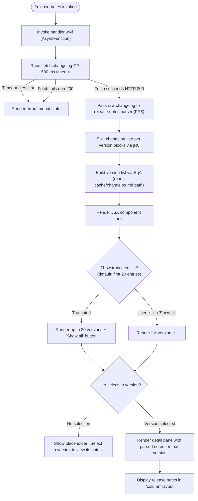

# `/release-notes`

> Analysis basis: CC v2.1.168 bundle.js (AST extraction + Claude interpretation)
> Minimum version: v2.1.168

---

## Overview

The `/release-notes` command opens an interactive, paginated release-notes viewer within the Claude Code CLI. It fetches or reads a local changelog, parses it into per-version entries, and renders a two-column JSX UI where the user selects a version from a list to see its notes. The initial display is limited to a configurable number of recent versions, with a "Show all" expansion affordance.

---

## Registration

| Field | Value |
|---|---|
| type | `local-jsx` |
| name | `release-notes` |
| description | `View release notes` |
| module_id | `soq` |
| load_inline | `true` |
| loc_byte | `12029459` |
| loc_byte_end | `12029600` |
| loc_line | `8321` |
| arbor_handler.name | `wNf` |
| arbor_handler.fqn | `claude-2.1.168::wNf` |
| arbor_handler.kind | `AsyncFunction` |
| arbor_handler.resolution_path | `module_id` |
| arbor_handler.n_hits | `0` |

Analysis basis: CC v2.1.168 bundle.js:+12029459

---

## Input Branching

The command has 4+ distinct branches: initial fetch/load of changelog, parsing of version entries, display truncation vs. full list, and version selection for detail rendering.



Analysis basis: CC v2.1.168 bundle.js:+12027715 (handler entry), +12027765 (Promise.race), +12027751 (500 ms timeout), +12028032 (20-entry limit), +12028105 ("Show all"), +12028747 ("Select a version to view its notes."), +12028680 ("column")

---

## Behavioral Spec

### 1. Handler Entry and Timeout Race

The primary async handler (`wNf`) starts by constructing a timeout promise that rejects after **500 milliseconds** (Analysis basis: CC v2.1.168 bundle.js:+12027751). It then races this timeout against the actual changelog fetch via `Promise.race`. If the timeout wins, a `Timeout` error is thrown (Analysis basis: CC v2.1.168 bundle.js:+12027739).

```
async function releaseNotesHandler(context):
    timeoutPromise = new Promise((_, reject) =>
        setTimeout(() => reject(new Error("Timeout")), 500)
    )
    result = await Promise.race([fetchChangelog(context), timeoutPromise])
    if result is error:
        return renderErrorState(result)
    return renderReleaseNotesUI(result)
```

Analysis basis: CC v2.1.168 bundle.js:+12027715, +12027733, +12027765

---

### 2. Changelog Fetching (fetchChangelog / FqA)

The fetch helper (`FqA`) resolves the local changelog path using a path-join utility (`BqA`) that constructs a path to `changelog.md` under a `cache` directory (Analysis basis: CC v2.1.168 bundle.js:+12024354, +12024362). It also calls into the async-store context (`V9`) and records `Date.now()` for latency tracking. On HTTP response code **200** the body is returned; otherwise, an error path is taken (Analysis basis: CC v2.1.168 bundle.js:+12024669).

```
async function fetchChangelog(context):
    basePath = buildChangelogPath()          // joins "cache" + "changelog.md"
    store    = getAsyncStore()               // V9 → eNL.getStore
    startMs  = Date.now()
    response = await networkGet(basePath)
    if response.status != 200:
        throw new Error("non-200 response")
    return response.body
```

Analysis basis: CC v2.1.168 bundle.js:+12024600, +12024645, +12024711, +12024723, +12024734, +12024784, +12024795

---

### 3. Changelog Path Resolution (buildChangelogPath / BqA)

Joins a base directory (derived from the module path via `DR6.dirname`) with the string `"cache"` and `"changelog.md"`, then passes the result through the timestamp helper `t8`.

```
function buildChangelogPath():
    baseDir  = path.dirname(currentModulePath)
    fullPath = path.join(baseDir, "cache", "changelog.md")
    return withTimestampMetadata(fullPath)    // t8
```

Analysis basis: CC v2.1.168 bundle.js:+12024340, +12024349, +12024354, +12024362

---

### 4. Changelog Parsing (parseChangelog / FR8)

The parser (`FR8`) receives the raw changelog text and delegates to the line-splitting helper (`jR6`). It then filters the resulting entries via `K.filter`, passes entries through the error-reporting helper (`hH`/`AA`), and returns a keyed object where each key is a version string.

```
function parseChangelog(rawText):
    rawEntries = splitChangelogLines(rawText)     // jR6
    keys       = Object.keys(rawEntries)
    filtered   = keys.filter(isValidEntry)        // K.filter
    for each entry in filtered:
        try:
            parsed[entry] = normalizeEntry(entry) // hH, AA
        catch err:
            logError(err)
    return parsed
```

Analysis basis: CC v2.1.168 bundle.js:+12025678, +12025695, +12025709, +12025736, +12025809, +12025907, +12025910

---

### 5. Line-Level Splitting (splitChangelogLines / jR6)

Splits raw changelog text on newlines, trims each line, and separates the version header from the body using a `" - "` separator string (Analysis basis: CC v2.1.168 bundle.js:+12025170). Lines that match a version header produce `{version, body}` objects; continuation lines are accumulated under the current version. Entries are additionally sliced and trimmed (Analysis basis: CC v2.1.168 bundle.js:+12025205, +12025228).

```
function splitChangelogLines(rawText):
    lines   = rawText.split("\n")
    entries = {}
    current = null
    for line in lines:
        trimmed = line.trim()
        if trimmed is version-header:
            [version, body] = splitOnSeparator(trimmed, " - ")  // d1
            current = version
            entries[version] = body.trim()
        else if current != null:
            entries[current] += "\n" + trimmed
    return entries
```

Analysis basis: CC v2.1.168 bundle.js:+12025039, +12025088, +12025165, +12025170, +12025205, +12025228, +12025356

---

### 6. Alternate Changelog Retrieval Path (wR6)

A secondary retrieval path (`wR6`) also calls `BqA` (path resolution) and `V9` (async store), suggesting a fallback or cache-read variant that bypasses the network fetch. This path is invoked from the main handler as a parallel option.

```
async function alternateChangelogRetrieval(context):
    path  = buildChangelogPath()    // BqA
    store = getAsyncStore()         // V9
    return readLocalCache(path)
```

Analysis basis: CC v2.1.168 bundle.js:+12027808, +12024889, +12024911

---

### 7. JSX Render Component (aoq)

The top-level JSX component (`aoq`) receives the parsed changelog map and renders a two-pane interface. It initialises with a list of versions sourced from `roq.c` and limits the initial display to **20** entries (Analysis basis: CC v2.1.168 bundle.js:+12028032). When `showAll` state is false, only the first 20 are shown alongside a **"Show all"** button (Analysis basis: CC v2.1.168 bundle.js:+12028105). It delegates truncated list rendering to `ooq` and per-version item rendering to `gqA`. Selection state is tracked via `A.find` to identify the currently selected version (Analysis basis: CC v2.1.168 bundle.js:+12028348). When no version is selected, the placeholder text **"Select a version to view its notes."** is displayed (Analysis basis: CC v2.1.168 bundle.js:+12028747). The detail pane uses a `"column"` layout string (Analysis basis: CC v2.1.168 bundle.js:+12028680). A React memo-cache sentinel `"react.memo_cache_sentinel"` is present (Analysis basis: CC v2.1.168 bundle.js:+12028606), indicating use of the React compiler's memo cache.

```
function ReleaseNotesComponent(changelogMap):
    [selectedVersion, setSelectedVersion] = useState(null)
    [showAll, setShowAll]                 = useState(false)

    allVersions = roq.c                           // version list source
    displayed   = showAll
                    ? allVersions
                    : allVersions.slice(0, 20)     // truncate to 20

    truncatedList = renderTruncatedList(displayed) // ooq
    versionItems  = displayed.map(renderVersionItem) // gqA

    if not showAll:
        footer = renderShowAllButton("Show all", () => setShowAll(true))

    detailPane = selectedVersion != null
        ? renderDetail(changelogMap[selectedVersion], layout="column")
        : renderPlaceholder("Select a version to view its notes.")

    return layout([versionItems, footer?, detailPane])
```

Analysis basis: CC v2.1.168 bundle.js:+12028026, +12028032, +12028105, +12028188, +12028203, +12028306, +12028308, +12028348, +12028410, +12028428, +12028595, +12028606, +12028680, +12028747

---

### 8. Truncated List Renderer (ooq)

`ooq` receives the list, calls `H.slice` on it (Analysis basis: CC v2.1.168 bundle.js:+12027590), then calls `cw` and `gqA` to produce the list JSX items.

```
function renderTruncatedList(versions):
    sliced = versions.slice(0, limit)
    items  = sliced.map(v => renderVersionItem(v))  // gqA
    return wrapList(items)                           // cw
```

Analysis basis: CC v2.1.168 bundle.js:+12027590, +12027615, +12027643

---

### 9. Version Item Renderer (gqA)

Maps a single version entry through `_.map` to produce JSX list items.

```
function renderVersionItem(versionEntry):
    return _.map(versionEntry, itemProps => <VersionItem {...itemProps} />)
```

Analysis basis: CC v2.1.168 bundle.js:+12027515

---

### 10. Bootstrap Fetch Utility (bootstrapFetch / H used in call-graph root)

A generic HTTP bootstrap helper (identifier `H` in the call-graph) logs `"[Bootstrap] Fetching"` at entry (Analysis basis: CC v2.1.168 bundle.js:+15797658), sets headers `Content-Type: application/json` and `User-Agent` (Analysis basis: CC v2.1.168 bundle.js:+15797743, +15797758, +15797777), and applies a **5000 ms** outer timeout (Analysis basis: CC v2.1.168 bundle.js:+15797859). On parse failure it emits the event `"api_bootstrap_fetch"` / `"parse_failed"` (Analysis basis: CC v2.1.168 bundle.js:+15797980, +15798002). On success it logs `"[Bootstrap] Fetch ok"` (Analysis basis: CC v2.1.168 bundle.js:+15798032).

```
async function bootstrapFetch(url, options):
    log("[Bootstrap] Fetching", url)
    headers = {
        "Content-Type": "application/json",
        "User-Agent":   <user-agent-string>
    }
    response = await fetchWithTimeout(url, headers, timeoutMs=5000)
    if response is parse-error:
        emitTelemetry("api_bootstrap_fetch", {result: "parse_failed"})
        throw error
    log("[Bootstrap] Fetch ok")
    return response
```

Analysis basis: CC v2.1.168 bundle.js:+15797656, +15797658, +15797743, +15797758, +15797777, +15797859, +15797980, +15798002, +15798032

---

## State & Side Effects

| Item | Detail |
|---|---|
| Telemetry: `tengu_feature_sad` | Emitted on feature-error path reached via `o6 → l` (bundle.js:+1011093) |
| Telemetry: `tengu_config_lock_contention` | Emitted when config-file lock acquisition is slow (bundle.js:+3265592) |
| Telemetry: `tengu_config_stale_write` | Emitted when a stale config write is detected (bundle.js:+3265728) |
| Telemetry: `tengu_config_parse_error` | Emitted on failure to parse config JSON (bundle.js:+3268167) |
| Telemetry: `tengu_config_auth_loss_prevented` | Emitted when a write that would erase auth credentials is blocked (bundle.js:+3266071) |
| Hook registration | `j9 → NPA.register` — registers a cleanup/hook handler (bundle.js:+60369) |
| File I/O side effects | `HiK` performs `mkdir`, `appendFile`, file rotation (`ll8` rename/unlink), and atomic writes (`O$6` open/write/fsync/rename) for log/config persistence |
| Config safety guard | Refuses to write `~/.claude.json` if the in-memory cache has auth but the re-read file does not, preventing auth loss (bundle.js:+3265919, +3262613) |
| Config backup | Keeps up to **5** numbered `.backup.*` files; rotates on every config write (bundle.js:+3266522, +3266389) |
| Max backup age | Config backup lock timeout: **60000 ms** (bundle.js:+3266273) |
| React memo cache | `"react.memo_cache_sentinel"` present in JSX component (bundle.js:+12028606); component uses React compiler memoisation |
| Timeout (handler) | `/release-notes` handler times out after **500 ms** if changelog fetch stalls (bundle.js:+12027751) |
| appState changes | No direct appState mutation observed in depth-2 traversal |
| Sound | <!-- TODO: not found in depth-2 traversal; needs --depth 4 --> |

---

## Version History

| Version | Change |
|---|---|
| v2.1.168 | Initial analysis — `local-jsx` command rendering interactive two-pane changelog viewer with 500 ms fetch timeout, 20-entry default list, "Show all" expansion, and per-version detail pane |

---

## Common Mistakes

1. **Expecting instant display**: The handler races against a 500 ms timeout. On slow file systems or when the cache is cold, the command may time out before the changelog loads. Running `/release-notes` again after the cache is warm should succeed.
2. **Missing `changelog.md`**: The path `cache/changelog.md` is resolved relative to the module's directory. If the file is absent (e.g., after a partial install), the fetch will fail with a non-200 equivalent and no versions will be listed.
3. **Assuming all versions are visible by default**: Only the **20** most-recent versions are shown initially. Older entries require clicking the **"Show all"** button.
4. **Conflating this with a network-only call**: The secondary retrieval path (`wR6`) reads the local cache first; a network call is only made if the cache path fails. Firewall rules blocking outbound traffic should not prevent the command from working once the cache is populated.
5. **Editing `~/.claude.json` while Claude Code is running**: The config write-safety guard (`tengu_config_auth_loss_prevented`) will block writes that would remove auth fields, which can cause confusing silent failures if concurrent edits remove the auth section.

---

## Appendix — Identifier Mapping

> For bundle debugging only. Identifiers change across versions.

| Identifier | Role |
|---|---|
| `wNf` | Primary async handler for `/release-notes` (Arbor-resolved, `module_id` path) |
| `aoq` | Top-level JSX render component for the release-notes UI |
| `ooq` | Truncated version-list renderer (slices list, delegates to `gqA`) |
| `gqA` | Per-version item renderer (maps entry to JSX list item) |
| `FqA` | Changelog fetch helper (resolves path, performs HTTP GET, checks status 200) |
| `wR6` | Alternate/fallback changelog retrieval (local cache read path) |
| `FR8` | Changelog text parser (splits, filters, normalises per-version entries) |
| `jR6` | Line-level changelog splitter (newline split, header detection, `" - "` separator) |
| `BqA` | Changelog path builder (`cache/changelog.md` join) |
| `V9` | Async-store context accessor (`eNL.getStore`) |
| `X8` | Config persistence orchestrator (calls `sP_`, `LwH`, `aP_`) |
| `sP_` | Config save-with-lock implementation (lock, read, diff, write, backup) |
| `LwH` | Config file reader with backup logic (`readFileSync`, `mkdirSync`, `readdirStringSync`, `copyFileSync`) |
| `aP_` | Config atomic-write helper (uses `O$6` for safe rename) |
| `O$6` | Atomic file write utility (`openSync`, `writeFileSync`, `fchmodSync`, `fsyncSync`, `renameSync`) |
| `HiK` | Log/config append helper (`mkdir`, `appendFile`, rotation) |
| `ll8` | File rotation helper (`stat`, `rename`, `unlink`, `.txt` extension handling) |
| `_iK` | Logging write pipeline (coordinates `npH`, `YKH`, `HiK`, `ll8`, `B76`, `$0A`) |
| `npH` | Log write scheduler (uses `clearTimeout`/`setTimeout`/`setImmediate`, join buffers) |
| `YKH` | Log entry formatter (`r76`, `IHH.join`, `t8`, `R6`) |
| `B76` | Log path helper (calls `V8`) |
| `$0A` | Log directory join helper (`IHH.join`, `R6`) |
| `j9` | Hook/cleanup registration (`NPA.register`) |
| `hH` | Entry error reporter (`AA`, `_6`, `$q`, `DG4`, `PFH.push`, `pr.logError`) |
| `AA` | Error constructor wrapper (`Error`, `String`) |
| `DG4` | Circular error-history buffer (`Rc6.shift`, `Rc6.push`) |
| `FJ` | Markdown formatter (calls `s9`, `_G`) |
| `s9` | Inline text styler (trim, toLowerCase, replace, model-tier detection: opusplan / sonnet / haiku / opus / best) |
| `_G` | Block-level Markdown renderer (`GA`, `g6H`, `gYH`, `jdH`, `bT`, `z2`, `lM`, `MA`, `N5`, `CI`) |
| `H9` | Document-level Markdown processor (`m6H`, `s9`, `FJ`) |
| `m6H` | Heading/block parser (`Q0`, `aqH`, `yA`, `qB`) |
| `qB` | Block-element renderer (handles `anthropic.` prefix, `nt6`, `YdH`, `cP1`, `eqL`, `h4H`) |
| `h4H` | Allowed-tag checker (`y4H.includes`) |
| `CI` | Inline code/mark renderer (`lM`, `N5`) |
| `bT` | Bold/emphasis renderer (`lM`, `N5`, `MA`) |
| `lP1` | List-item renderer (calls `bT`) |
| `lM` | Markdown leaf renderer (`MA`) |
| `DdH` | Deleted/strikethrough renderer (`N5`) |
| `NH8` | Language-keyword checker (`AKL.includes`) |
| `wdH` | Whitespace renderer (`_6`) |
| `G4` | Path-segment extractor (`K0A`, `H.replace`, `q.at`, `A.lastIndexOf`, `A.slice`) |
| `K0A` | Path-map builder (`inK.map`) |
| `RH` | JSON serialiser wrapper (`JSON.stringify`) |
| `EUH` | Output writer (`nWA`) |
| `nWA` | Stream write helper (`H.write`) |
| `v` | Core utility / value helper (branching on `debug`, `NUH`, `snK`, `RH`, `G4`, etc.) |
| `snK` | Sub-utility (`KI`, `M0A`, `IPA`) |
| `IPA` | Initialiser (`edK`, `HcK`) |
| `mj_` | Version-string parser (`split`, `trim`, `indexOf`, `slice`) |
| `lHH` | Feature-flag lookup (`o74.has`) |
| `uj` | String replacement helper (`H.replace`) |
| `Y3` | <!-- TODO: not found in depth-2 traversal; needs --depth 4 --> |
| `cw` | JSX list wrapper utility |
| `d6` | Path/directory utility |
| `t75` | <!-- TODO: not found in depth-2 traversal; needs --depth 4 --> |
| `o6` | Feature telemetry gate (`l`, `J6`; emits `tengu_feature_sad`) |
| `J6` | Inner feature reporter (`hm6`) |
| `hm6` | Low-level feature event emitter |
| `dlH` | <!-- TODO: not found in depth-2 traversal; needs --depth 4 --> |
| `Vo1` | Object-entries iterator wrapper |
| `qK8` | Timestamp / staleness checker (`Date.now`) |
| `aj6` | <!-- TODO: not found in depth-2 traversal; needs --depth 4 --> |
| `tP_` | Backup path builder (`dD.join`, `t8`) |
| `R21` | Config merge helper (`QM_`, `Object.assign`) |
| `V8` | Filesystem existence / stat helper |
| `xJ` | <!-- TODO: not found in depth-2 traversal; needs --depth 4 --> |
| `Q0` | Block-type discriminator |
| `aqH` | Attribute parser |
| `Y2` | Character-class lookup (`R4H`) |
| `DLK` | Debounced logger (`Yo`, `Date.now`, `V9`, `YC6`, `RH`) |
| `d1` | String index/slice splitter (`H.indexOf`, `H.slice`) |
| `BR8` | <!-- TODO: not found in depth-2 traversal; needs --depth 4 --> |
| `U_` | <!-- TODO: not found in depth-2 traversal; needs --depth 4 --> |
| `$q` | Telemetry mode resolver (`dRA`; handles `"essential-traffic"`, `"no-telemetry"`, `"default"`) |
| `dRA` | Telemetry string resolver (`_6`) |
| `_6` | String coercion utility (`String`) |
| `f` | Session/connection manager (`A.close`, `q.close`, `L`) |
| `L` | Connection-set manager (`q.add`, `f.finally`, `q.delete`) |
| `P` | Text editor component (`OK.fromText`, `H.onChange`, `z.setOffset`, `C.execute`, etc.) |

---

Note: index built via Arbor fallback; some signals (telemetry, literals) may be missing — see arbor-fallback.js.