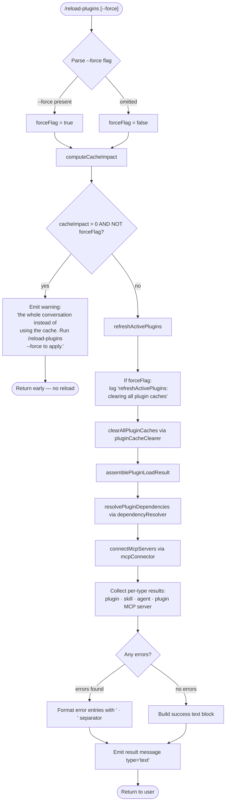

# `/reload-plugins`

> Analysis basis: CC v2.1.168 bundle.js (AST extraction + Claude interpretation)
> Minimum version: v2.1.168

---

## Overview

`/reload-plugins` triggers an in-process refresh of all active plugins (MCP servers, skills, agents, and LSP servers) without requiring a full session restart. It discovers pending configuration changes, re-evaluates plugin load order and dependency constraints, reconnects affected MCP clients, and reports each plugin's resulting status. When cache invalidation would discard active conversation context, the command warns the user unless `--force` is supplied.

---

## Registration

| Field | Value |
|---|---|
| type | `local` |
| name | `reload-plugins` |
| description | `Activate pending plugin changes in the current session` |
| argumentHint | `[--force]` |
| supportsNonInteractive | `false` |
| thinClientDispatch | `control-request` |
| module_id | `k9K` |
| load_inline | `true` |
| loc_byte | `12606313` |
| loc_byte_end | `12606557` |
| loc_line | `9056` |
| arbor_handler.name | `Zbf` |
| arbor_handler.fqn | `claude-2.1.168::Zbf` |
| arbor_handler.kind | `AsyncFunction` |
| arbor_handler.resolution_path | `module_id` |
| arbor_handler.n_hits | `0` |

Analysis basis: CC v2.1.168 bundle.js:+12606313

---

## Input Branching

The handler has four distinct logical branches driven by the `--force` flag, cache-impact detection, plugin type, and final status composition.



Analysis basis: CC v2.1.168 bundle.js:+12605011 through +12605818

---

## Behavioral Spec

### 1. Argument Parsing

```
function parseReloadPluginsArgs(rawArgs):
    trimmed = rawArgs.trim()                      # H.trim at +12605397
    forceFlag = trimmed.includes("--force")       # literal "--force" at +12605433
    flagName  = "force"                           # literal "force"  at +12605448
    return { forceFlag }
```

Analysis basis: CC v2.1.168 bundle.js:+12605397, +12605433

---

### 2. Cache-Impact Check

Before performing any reload the handler invokes `computeCacheImpact` (bundle identifier `v9K`) to determine how many cached conversation tokens would be invalidated.

```
async function computeCacheImpact(appState):
    pluginMap  = appState.pluginRegistry          # _.has check at +12604079
    activeKeys = appState.activePluginSet          # A.has check at +12604118
    impact     = calculateDependencyTokenCost(pluginMap, activeKeys)  # nN at +12604162
    normalizeImpactValue(impact)                  # Ns at +12604168
    enrichWithCapabilityFlags(impact)             # yD at +12604189
    return impact
```

Telemetry event `tengu_reload_plugins_cache_impact` is fired here.
Analysis basis: CC v2.1.168 bundle.js:+12605465, +12604305

If `cacheImpact > 0` and `--force` was not supplied, the command returns a warning string that ends with the literal phrase `"…the whole conversation instead of using the cache. Run /reload-plugins --force to apply."` (fragment at +12604896) and **does not proceed** with the reload.

---

### 3. Plugin Cache Clearing (`refreshActivePlugins`)

When the reload proceeds, `refreshActivePlugins` (bundle identifier `N$H`) is called. With `--force`, it first logs `"refreshActivePlugins: clearing all plugin caches"` (literal at +12601983) and invokes the cache-clearing subsystem.

```
async function refreshActivePlugins(forceFlag, appState):
    if forceFlag:
        logDebug("refreshActivePlugins: clearing all plugin caches")
        clearSkillIndexCache()             # mm → H.clearSkillIndexCache at +13191724
        clearInstalledPluginsCache()       # ck6 → logs "Cleared installed plugins cache" at +10042111
        clearSettingsCache()               # vm → tv8.clear at +9984707
    pluginLoadResult = assemblePluginLoad(appState)   # a$ at +12602041
    return pluginLoadResult
```

Analysis basis: CC v2.1.168 bundle.js:+12601981, +12602041

---

### 4. Plugin Load Assembly (`assemblePluginLoad`)

`assemblePluginLoad` (bundle identifier `a$`) orchestrates parallel resolution of all plugin sources.

```
async function assemblePluginLoad(appState):
    # Parallel load: marketplace + local + MCP config
    [marketplacePlugins, mcpConfig] = await Promise.all([
        loadMarketplacePlugins(),          # S9f at +10008094
        loadMcpConfiguration(),            # resolves project/user/local/enterprise scopes
    ])
    # Resolve cross-plugin dependencies
    resolvedGraph = resolveDependencies(marketplacePlugins, mcpConfig)  # vk at +10008187
    # Apply to session
    applyToSession(resolvedGraph, appState)   # oS_ at +10008198
    clearSessionCache(appState)               # vm at +10008204
    return resolvedGraph
```

The MCP configuration loader (`ZP`) searches the following scopes and files in priority order:
- `projectSettings` → `.mcp.json` in CWD ancestry
- `userSettings` → user-level config
- `localSettings` → local overrides
- `policySettings` / `enterprise`

Literals: `"projectSettings"` at +6842119, `"userSettings"` at +6842142, `"localSettings"` at +6842163, `".mcp.json"` at +6842379.

Analysis basis: CC v2.1.168 bundle.js:+10008181, +6842070

---

### 5. MCP Server Reconnection

After the plugin graph is resolved, `pluginReconnector` (bundle identifier `Rp9`) drives MCP server lifecycle management.

```
async function pluginReconnector(resolvedGraph, appState):
    # Stop servers that are no longer in config
    for each removed server in diff(appState.activeMcpServers, resolvedGraph):
        server.close()

    # Restart / connect changed servers
    pluginLoadResults = await connectAllServers(resolvedGraph)    # SS_ / CS_ at +5351885
    partialFailures   = collectPartialFailures(pluginLoadResults) # literal "plugin_load_partial_failures" at +5353071

    if allFailed(pluginLoadResults):
        telemetry("plugin_load_total_failure")    # literal at +5353002
    else:
        telemetry("plugin_load_all")              # literal at +5352984

    if cwdChangedDuringLoad():
        logWarn("assemblePluginLoadResult: originalCwd changed mid-scan; skipping side-effects (stale early-kick)")
        # literal at +5353137
        return early

    applyLoadResult(pluginLoadResults, appState)
    return pluginLoadResults
```

Analysis basis: CC v2.1.168 bundle.js:+12604029, +5351885

---

### 6. Per-Plugin-Type Connection (`connectAllServers`)

Connection logic (`hS_`) handles four plugin type categories, each with its own failure taxonomy.

```
async function connectAllServers(graph):
    results = []
    for each entry in graph:
        type = entry.type    # one of: "plugin" | "skill" | "agent" | "plugin MCP server"
                             # literals at +12605127, +12605158, +12605186, +12605218
        try:
            conn = await connectSingleServer(entry)   # xbH at +10451026
            results.push({ type, status: "connected" })
        catch err:
            tag = classifyError(err)
                # possible tags: "mcp-config-invalid", "mcpb-download-failed",
                # "mcpb-extract-failed", "mcpb-invalid-manifest",
                # "plugin-not-found", "marketplace-blocked-by-policy",
                # "hook-load-failed", "lsp-config-invalid",
                # "lsp-server-start-failed", "lsp-server-crashed",
                # "dependency-unsatisfied", "dependency-version-unsatisfied",
                # "needs-auth", "failed"
            results.push({ type, status: "error", tag })
    return results
```

Analysis basis: CC v2.1.168 bundle.js:+5332742, +10451026, +10452265

---

### 7. Result Formatting and Output

```
function formatReloadResult(results, forceFlag):
    errorLines = []
    for each r in results where r.status == "error":
        errorLines.push(r.type + " · " + r.tag)   # separator " · " literal at +12605245

    if errorLines is non-empty:
        return { type: "error", text: errorLines.join("\n") }
                                   # literal "error" at +12605300
    else:
        return { type: "text",  text: buildSuccessSummary(results) }
                                   # literal "text" at +12605375
```

Analysis basis: CC v2.1.168 bundle.js:+12605245, +12605300, +12605375

---

### 8. LSP Manager Side-Channel

The handler also signals the LSP manager subsystem (identifier `Tbf`) to re-evaluate any LSP server registrations that may have changed during the plugin reload.

```
function notifyLspManager(resolvedGraph):
    lspEntries = resolvedGraph.filter(e => e.source == "lsp-manager")
                                # literal "lsp-manager" at +12603504
    for entry in lspEntries:
        if entry.id.startsWith("plugin:"):   # literal "plugin:" at +12603539
            reloadLspServer(entry)
```

Analysis basis: CC v2.1.168 bundle.js:+12602659, +12603504

---

### 9. Hook/Agent Notification

After MCP reconnection, the agent notification path (identifier `_AH`) is called to propagate updated plugin state to any active agent or hook contexts.

```
function notifyAgentContexts(resolvedGraph, appState):
    for each hook in resolvedGraph where type == "hook":   # literal "hook" at +12605992
        rebuildHookEntry(hook)
    for each lsp in resolvedGraph where type == "plugin LSP server":
                                   # literal "plugin LSP server" at +12606051
        rebuildLspEntry(lsp)
    emitToAppState(appState, resolvedGraph)
```

Analysis basis: CC v2.1.168 bundle.js:+12605818, +12605992, +12606051

---

## State & Side Effects

| Item | Detail |
|---|---|
| Telemetry | `tengu_reload_plugins_cache_impact` (+12604305); `tengu_plugin_state_file_error` (+10042290); `tengu_mcp_list_changed` (+15977342); `tengu_daemon_config_reload` (+16212414); `tengu_skill_file_changed` (+14200517); `plugin_load_all` (+5352984); `plugin_load_total_failure` (+5353002); `plugin_load_partial_failures` (+5353071) |
| Cache clears (--force) | Skill index cache, installed-plugins cache, settings disk cache cleared synchronously before reload |
| MCP server lifecycle | Stopped servers removed; changed/new servers reconnected via `connectAllServers`; `applyMcpUpdate` dispatched to session state |
| AppState changes | Plugin registry, active MCP client map, and LSP server registrations updated in-place; `Nm.emit` fires a change event (+12603089) |
| Dependency graph | Cross-plugin dependency constraints re-evaluated; `dependency-unsatisfied` / `dependency-version-unsatisfied` errors surfaced per plugin |
| CWD guard | If the working directory changes during the scan, side-effects are skipped entirely (stale-kick guard, literal at +5353137) |
| Non-interactive | `supportsNonInteractive: false` — command is blocked in non-interactive mode |
| Dispatch | `thinClientDispatch: "control-request"` — thin clients forward this command as a control-plane request |

---

## Version History

| Version | Change |
|---|---|
| v2.1.168 | Initial analysis |

---

## Common Mistakes

1. **Forgetting `--force` after a settings change that grows the context**: Without `--force`, the command aborts if the reload would invalidate cached conversation tokens. Users must explicitly acknowledge this trade-off.
2. **Running in non-interactive mode**: `supportsNonInteractive` is `false`; attempting to invoke `/reload-plugins` in a piped/scripted session will produce no output and the reload will not execute.
3. **Expecting immediate MCP reconnection for `"failed"` / `"needs-auth"` servers**: Servers tagged `"failed"` are subject to a 15-minute retry backoff (literal at +10452081); a config change is needed to force an immediate retry.
4. **Working-directory sensitivity**: If the project CWD changes between issuing the command and plugin scan completion, the reload side-effects are silently dropped; re-issue the command from the correct directory.
5. **Confusing partial and total failure reporting**: `plugin_load_total_failure` fires only when every plugin fails; `plugin_load_partial_failures` fires for mixed results. Individual plugin errors are still surfaced in the output with the `" · "` separator.

---

## Appendix — Identifier Mapping

> For bundle debugging only. Identifiers change across versions.

| Identifier | Role |
|---|---|
| `Zbf` | Main async handler for `/reload-plugins` (arbor_handler) |
| `eP` | Entry-point dispatcher called from `Zbf` |
| `oL` | Control-flow wrapper (calls `uTH`) |
| `uTH` | Low-level dispatch helper |
| `Ti` | Argument hint / option parser setup (calls `b8`) |
| `b8` | Option definition builder |
| `v9K` | Cache-impact computation orchestrator |
| `nN` | Token-cost calculator for plugin dependency set |
| `sC_` | Dependency token normalizer |
| `tNH` | String-to-value coercer for token counts |
| `aC_` | Numeric clamp helper (`auto:` prefix parser) |
| `Ns` | Capability flag enrichment for cache impact |
| `LO7` | Array-vs-scalar capability resolver |
| `D6` | Tool-search availability checker |
| `yD` | Output-token accessor |
| `I9K` | AppState accessor bridge |
| `Vbf` | Argument string splitter |
| `N$H` | `refreshActivePlugins` — master plugin refresh orchestrator |
| `mNq` | Debug-log helper used inside `N$H` |
| `a$` | `assemblePluginLoad` — parallel load coordinator |
| `S9f` | Marketplace plugin loader |
| `A0` | Plugin load sub-step (calls `jp6`, `LY`, `fPA`) |
| `Fb_` | Plugin root enumerator |
| `hH` | Error-logging utility |
| `vk` | Dependency resolution entry point |
| `mm` | Skill index cache clearer |
| `EbH` | Lazy-load helper for dependency resolver |
| `u06` | Settings cache accessor |
| `vm` | Session/settings cache clearer (`tv8.clear`) |
| `Rp9` | MCP server reconnection orchestrator |
| `SS_` | Plugin load result assembler |
| `CS_` | MCP connection state machine |
| `hS_` | Per-plugin connection loop with `Promise.allSettled` |
| `bs` | MCP configuration merger |
| `ZP` | MCP config file loader (project/user/local/enterprise scopes) |
| `_PH` | Per-scope MCP config parser |
| `ED8` | Error-detail extractor for MCP failures |
| `Qj` | Policy settings filter |
| `kY` | Approved/pending server classifier |
| `w` | Background-session process manager |
| `D` | Process-exit controller |
| `kk` | MCP server restart helper |
| `Zj7` | Server registry diff / update applier |
| `y` | Away-summary/context throttle helper |
| `Y` | MCP supervisor update dispatcher |
| `k` | Chokidar file-watcher wrapper |
| `Rs` | Plugin manifest reader |
| `ZF` | File-extension checker (`.mcpb` / `.dxt`) |
| `Yx_` | Plugin manifest file parser |
| `Wm9` | HTTP/download plugin source handler |
| `E06` | MCPB archive extractor |
| `SRH` | LSP config reader |
| `Mg7` | LSP manifest validator |
| `fg7` | Path-safety checker for LSP files |
| `$` | Conversation context reducer |
| `DLK` | Daemon status reporter |
| `$T8` | LSP extension-conflict detector |
| `M` | MCP server state manager (calls `xbH`, `PF8`, `cDA`) |
| `xbH` | Single MCP server connection executor |
| `PF8` | Connection-result applier (`applyMcpUpdate`) |
| `cDA` | Remote MCP retry coordinator |
| `Tbf` | LSP manager notifier |
| `Ebf` | Hook notifier |
| `f$H` | Plugin registry updater (reads/writes plugin state sets) |
| `Ek` | Known-marketplaces loader |
| `R5` | `known_marketplaces.json` reader |
| `zI8` | Marketplace path builder |
| `OyH` | Plugin entry parser |
| `x8` | Plugin descriptor validator |
| `vn6` | URL-type source classifier |
| `kd` | Plugin descriptor constructor |
| `UZ` | Managed-scope guard |
| `oA` | Source-string parser (includes/split) |
| `p2` | Plugin URL resolver |
| `gj9` | URL fragment extractor |
| `XW6` | Source-pattern matcher |
| `O38` | Plugin-type dispatcher |
| `Qj9` | Git-source handler |
| `dj9` | File/directory source handler |
| `meL` | GitHub/npm source handler |
| `e_H` | Source-entry validator |
| `lj9` | Composite source resolver |
| `Ps` | Plugin disk reader (`.claude-plugin/marketplace.json`) |
| `Fk6` | Plugin marketplace file locator |
| `ss_` | Settings safe-parse wrapper |
| `fE` | Plugin install state reader |
| `bS_` | Plugin cache file reader |
| `dGf` | Plugin cache presence checker |
| `h06` | Full plugin-installation and wiring orchestrator |
| `tW` | Plugin type-guard helper |
| `Az8` | Source normalizer before install |
| `d$6` | Local-path `./` prefix checker |
| `z` | Daemon/process state store |
| `SH` | Success-path logger |
| `CH` | Error-path logger |
| `uh` | User-notification emitter |
| `sp` | Graceful-shutdown race helper |
| `u6` | AsyncLocalStorage context accessor |
| `pc6` | Context store reader |
| `gZ` | Installed-plugin disk loader |
| `es_` | Plugin state file reader (`readFileSync`) |
| `Ht_` | Plugin state entry transformer |
| `ck6` | Plugin cache invalidator (logs "Cleared installed plugins cache") |
| `J` | MCP background-process set |
| `W` | Plugin slot registry map |
| `nV6` | Plugin slot updater |
| `mN` | Source-name normalizer |
| `Xk` | Plugin enablement checker |
| `p38` | Semver validation wrapper (`Il.valid/coerce/satisfies`) |
| `T` | Active-plugin tracking set |
| `oJ9` | Dependency-graph cycle detector |
| `gV` | Flag-settings reader |
| `P` | Terminal input/plugin supervisor |
| `j` | Worker-process registry |
| `h` | Background-worker sweeper |
| `EOA` | Vim-mode state machine |
| `C` | Queue executor |
| `S` | File-system stat helper |
| `VUK` | Realpath/stat checker |
| `D35` | Memory-mapped file writer |
| `m` | Output write-debouncer |
| `TE9` | Tool-execution queue |
| `U` | Interval manager |
| `o_` | Settings-file writer |
| `eO` | Native module loader |
| `___` | Platform loader bootstrap |
| `oP` | Settings branch reader |
| `e6_` | Flag timestamp recorder |
| `IZH` | Native-module resolution helper |
| `O$6` | Atomic file writer (temp→rename) |
| `LY` | Cache-map clearer (`Dp6.clear`, `_Q8.clear`) |
| `hl6` | Settings file read/write with mkdir |
| `qu` | Settings path builder |
| `gU` | Platform-specific native loader |
| `k06` | Plugin directory path validator |
| `d` | Conversation-turn state machine |
| `X` | TCP/socket read buffer |
| `g26` | Token-budget checker |
| `B$8` | Hard token-limit enforcer |
| `XRK` | Boolean coercion helper |
| `g` | Terminal renderer / spinner |
| `THH` | Permission-set membership checker |
| `l_H` | Permission-filter helper |
| `zH` | Process-exit guard set |
| `jH` | MCP client registry |
| `qH` | Active MCP client descriptor |
| `z8` | MCP error logger |
| `Z8` | MCP status code classifier |
| `L8` | MCP cleanup handler |
| `dhq` | MCP SDK connect/reconnect loop |
| `I6` | Input-stream decoder |
| `Au` | Keyboard shortcut binder |
| `tz9` | VS Code extension gate |
| `PmK` | CCD-session gate |
| `bH` | Notification accumulator |
| `XH` | Pending-request map |
| `CW6` | Semver range validator |
| `Xy_` | Version-string sanitizer |
| `sO8` | Git subprocess wrapper |
| `WS_` | Git command executor |
| `V06` | Git path resolver |
| `eO8` | Tag-resolution via `ls-remote` |
| `V97` | Git output parser |
| `R8` | Async-context runner |
| `tO8` | Git ref normalizer |
| `y06` | Plugin install/update runner |
| `QaH` | Plugin download + extract coordinator |
| `Kz8` | Post-install plugin loader |
| `$AH` | Content hash builder (SHA-256) |
| `Tk` | Plugin path builder |
| `g38` | `package.json` / lockfile scanner |
| `VF` | Error string formatter |
| `_XH` | Plugin path resolver variant |
| `_z8` | Cleanup helper for failed installs |
| `VS_` | Installed-plugin list updater |
| `Q` | Process-kill helper with timeout |
| `b4H` | Shell-output trimmer |
| `n` | MCP update applicator |
| `AF` | Async-iterable mapper |
| `L16` | Tool-version integer parser |
| `lk8` | Plugin SDK version parser |
| `r` | Voice/audio session controller |
| `HH` | Voice recording state machine |
| `bbH` | MCP tool-list update handler |
| `BH` | Keyboard/input event handler |
| `k8` | Keypress dispatch router |
| `t` | Voice max-duration enforcer |
| `$H` | Message-queue writer |
| `s` | Notification manager |
| `xH` | Tool-result renderer |
| `QH` | Message-history trimmer |
| `wH` | Feature-flag reader |
| `mg` | Feature-flag cache accessor |
| `R6` | React-like state signal |
| `ZH` | Feature-flag composite reader |
| `s$` | Feature-flag individual accessor |
| `vH` | Hook/LSP entry list builder |
| `V` | Plugin hook entry constructor |
| `MH` | MCP tools-list refresh handler |
| `h97` | Plugin source pre-validator |
| `c` | Context-file (DS6/dgq) manager |
| `DS6` | Context file reader |
| `dgq` | Context file unlinker |
| `a` | MCP update batch applier |
| `G` | MCP client startup coordinator |
| `Pk` | Plugin name lowercase checker |
| `l$` | String-to-display-value mapper |
| `h4` | OTEL metrics attribute builder |
| `LyH` | OTEL resource attribute assembler |
| `QL6` | OTEL event attribute builder |
| `nQ8` | OTEL event emitter |
| `iQ8` | OTEL sequence recorder |
| `KH` | Focus-gain voice trigger |
| `_AH` | Hook/agent context notifier |

---

Note: index built via Arbor fallback; some signals (telemetry, literals) may be missing — see arbor-fallback.js.