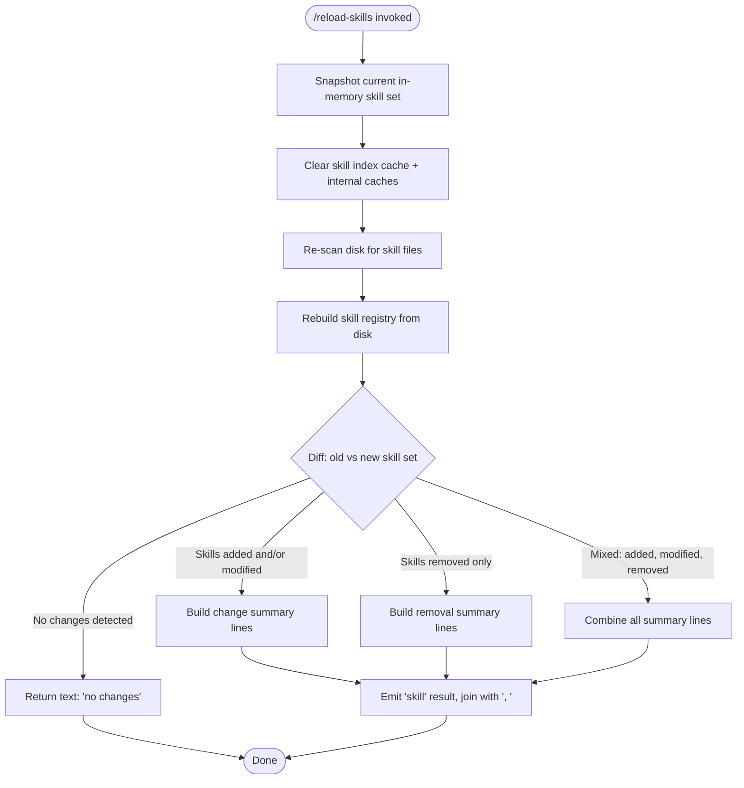

```markdown
---
type: feature-spec
feature: "reload-skills"
cc_version: "2.1.168"
updated: "2026-06-11"
tags: ["reload-skills", "commands", "slash-commands"]
source: "bundle-analysis"
bundle_verified: true
analysis_basis: "CC v2.1.168 bundle.js (AST extraction + Claude interpretation)"
author: "ryujaeuk <ryujaeuk@gmail.com>"
repository: "https://github.com/MyLittleLuckyDog/cc-gnothi"
license: "AGPL-3.0-only"
---

# `/reload-skills`

> Analysis basis: CC v2.1.168 bundle.js (AST extraction + Claude interpretation)
> Minimum version: v2.1.168

---

## Overview

`/reload-skills` rescans the disk for skill files that have been added or modified since the current session started, clears all relevant skill and index caches, rebuilds the in-memory skill registry, and reports a summary of changed, added, or removed skills back to the user. It is designed to be invoked without restarting the Claude Code process, making it useful during iterative skill authoring.

---

## Registration

| Field | Value |
|---|---|
| type | `local` |
| name | `reload-skills` |
| description | `Pick up skills added or changed on disk during this session` |
| loc_byte | `12607107` |
| loc_byte_end | `12607324` |
| loc_line | `9056` |
| supportsNonInteractive | `true` |
| thinClientDispatch | `post-text` |
| module_id | `S9K` |
| load_inline | `true` |
| arbor_handler.name | `vbf` |
| arbor_handler.fqn | `claude-2.1.168::vbf` |
| arbor_handler.kind | `AsyncFunction` |
| arbor_handler.resolution_path | `module_id` |
| arbor_handler.n_hits | `0` |

Analysis basis: CC v2.1.168 bundle.js:+12607107

---

## Input Branching

The handler produces one of four distinct output states depending on what changed on disk relative to the in-memory registry, warranting a Mermaid flowchart.



Analysis basis: CC v2.1.168 bundle.js:+12606658, +12606752, +12606791, +12606908, +12606921

---

## Behavioral Spec

### 1. Handler Entry — `reloadSkillsHandler` (`vbf`)

The primary handler is the async function `vbf`, resolved via `module_id` → `S9K`.

```
async function reloadSkillsHandler(context):
    # Step 1: Capture current skill snapshot from app state
    oldSkillSet = getAppStateSkills(context)         # calls u6 → pc6

    # Step 2: Invalidate all skill-related caches
    clearSkillIndexCache()                            # calls vk → mm → H.clearSkillIndexCache
    clearInternalCache()                              # calls vm → tv8.clear

    # Step 3: Re-scan disk and rebuild skill registry
    newSkillSet = reloadSkillsFromDisk(context)      # calls vk → LI8, JNq, EbH

    # Step 4: Emit a reload event to any registered listeners
    emitReloadEvent(eventBus)                         # calls Nm.emit

    # Step 5: Compute diff between old and new skill sets
    added   = newSkillSet.filter(s => NOT oldSkillSet.has(s))
    removed = oldSkillSet.filter(s => NOT newSkillSet.has(s))
    changed = newSkillSet.filter(s => oldSkillSet.has(s) AND isModified(s))

    # Step 6: Build result text
    summaryLines = []

    for each skill in (added ∪ changed):
        summaryLines.push(formatSkillLine(skill))    # calls K.has, K → L.map, f.padEnd(40)

    for each skill in removed:
        summaryLines.push(formatRemovedLine(skill))  # calls O.push → b8

    if summaryLines is empty:
        return { type: "text", content: "no changes" }
    else:
        return { type: "skill", content: summaryLines.join(", ") }
```

Analysis basis: CC v2.1.168 bundle.js:+12606629, +12606642, +12606658, +12606678, +12606683, +12606716, +12606736, +12606752, +12606791, +12606840, +12606908, +12606921, +12606946, +12607003

---

### 2. App-State Skill Snapshot — `getAppStateSkills` (`u6`)

Retrieves the current in-memory skill set from the application state store before any cache invalidation occurs.

```
function getAppStateSkills(context):
    store = getStore(storeModule)        # calls pc6 → mc6.getStore
    skills = store.getSkills()           # calls pc6 → BQ
    watcherState = getWatcher()          # calls u6 → W_ → tv
    return skills
```

Analysis basis: CC v2.1.168 bundle.js:+1021187, +1021208, +1021238, +1021257, +42153

---

### 3. Skill Index Cache Clearing — `clearSkillCaches` (`vk` / `mm`)

Performs a two-layer cache invalidation: first clears the skill index cache held by the skill subsystem, then resolves any pending promises related to the index.

```
async function clearSkillCaches():
    # Layer 1: resolve/reset pending index promise
    await Promise.resolve()              # calls mm → Promise.resolve
    rebuildSkillContext()                # calls mm → c1A
    skillRegistry.clearSkillIndexCache() # calls mm → H.clearSkillIndexCache

    # Layer 2: clear secondary watchers / loader cache
    loadAndIndexSkills()                 # calls vk → LI8
    notifySkillObservers()              # calls vk → JNq
    rebuildExternalIndex()              # calls vk → EbH → fy6
```

Analysis basis: CC v2.1.168 bundle.js:+13191671, +13191702, +13191724, +13191771, +13191776, +13191782, +13191788

---

### 4. Skill Index Fetch / Bootstrap — `fetchSkillIndex` (`H`)

When rebuilding the skill registry, the subsystem may fetch or bootstrap a remote skill index. This sub-function is called indirectly by `H.clearSkillIndexCache` and `H` itself.

```
async function fetchSkillIndex(skillPath):
    log("debug", "[Bootstrap] Fetching", skillPath)   # lit: "debug", "[Bootstrap] Fetching"

    headers = {
        "Content-Type": "application/json",           # lit at +15797743, +15797758
        "User-Agent":   getUserAgentString()           # lit at +15797777
    }

    # Normalize skill path
    normalizedPath = normalizeSkillPath(skillPath)     # calls v → NUH, snK, H.includes, RH
                                                        # → _.toUpperCase, G4, H.trim, iy, EUH, _iK

    # Parse skill manifest lines
    parsed = parseSkillManifest(normalizedPath)        # calls mj_ → _.split, q.trim
                                                        # → q.indexOf, q.slice
                                                        # numeric bounds: 1, 0 (+2979477, +2979502)

    # Check cache
    cached = skillCache.get(normalizedPath)            # calls qA.get
    if cached:
        return cached

    response = await fetch(normalizedPath, { headers, timeout: 5000 })  # lit: 5000 at +15797859
    if NOT response.ok:
        emitTelemetry("api_bootstrap_fetch", { status: "parse_failed" }) # lit at +15797980, +15798002
        return null

    log("[Bootstrap] Fetch ok")                        # lit at +15798032
    result = parseResponse(response)                   # calls Y3
    return result
```

Analysis basis: CC v2.1.168 bundle.js:+15797656, +15797658, +15797694, +15797743, +15797758, +15797777, +15797790, +15797798, +15797829, +15797841, +15797844, +15797859, +15797868, +15797977, +15797980, +15798002, +15798032

---

### 5. Internal Map Cache Clear — `clearInternalCache` (`vm`)

Clears a secondary internal map that caches resolved skill paths or watcher handles.

```
function clearInternalCache():
    internalCacheMap.clear()    # calls vm → tv8.clear
```

Analysis basis: CC v2.1.168 bundle.js:+12606683, +9984707

---

### 6. Background Session / File Watcher Management — `manageFileWatcher` (`L`, `f`, `A`)

During reload, any active background file-watching sessions are properly closed and re-registered to avoid double-watching reloaded skill files.

```
async function manageFileWatcher(skillPaths):
    for each path in skillPaths:
        session = activeWatchers.add(path)             # calls L → q.add
        try:
            watcher = openWatcher(path)                # calls A → f.toLowerCase (normalise)
        finally:
            watcher.close()                            # calls f → A.close
            session.close()                            # calls f → q.close
            rebuild(session)                           # calls f → L (recurse/rebuild)
            activeWatchers.delete(path)                # calls L → q.delete

    # Format watcher summary line (40-char padded columns)
    line = skillName.padEnd(40) + "  " + status       # lit: 40 at +16223773, "  " at +16221802
    if session.stopped:
        line += "stopped"                              # lit at +16233806
        line += "background session"                  # lit at +16233849
```

Analysis basis: CC v2.1.168 bundle.js:+16202979, +16202988, +16203002, +16208971, +16208981, +16209121, +16221768, +16221781, +16221802, +16223699, +16223773, +16233806, +16233844, +16233849

---

### 7. External Index Rebuild — `rebuildExternalIndex` (`EbH` / `fy6`)

Rebuilds the external skill index by consulting a registry map for any known skill providers.

```
async function rebuildExternalIndex():
    for each provider in skillProviderRegistry:       # calls EbH → fy6
        entry = providerMap.get(provider)              # calls fy6 → RI8.get
        if entry:
            rebuildProviderIndex(entry)                # calls fy6 → Ky6
```

Analysis basis: CC v2.1.168 bundle.js:+13191788, +10187818, +10188158, +10188166

---

### 8. Skill Path Parsing — `parseSkillManifest` (`mj_`)

Parses individual skill manifest lines into structured records.

```
function parseSkillManifest(raw):
    lines = raw.split(separator)         # calls mj_ → _.split
    results = []
    for each line in lines:
        trimmed = line.trim()            # calls mj_ → q.trim
        sep_idx = trimmed.indexOf(key, 1) # calls mj_ → q.indexOf  (offset 1 at +2979477)
        if sep_idx >= 0:                 # (0 at +2979502)
            value = trimmed.slice(sep_idx)
            results.push(value)
    return results
```

Analysis basis: CC v2.1.168 bundle.js:+2979391, +2979430, +2979454, +2979494, +2979477, +2979502

---

### 9. Result Formatting

The handler formats its return value as a plain text message.

```
function buildResult(summaryLines):
    if summaryLines.length == 0:
        return { type: "text", content: "no changes" }   # lit at +12606921, +12606946
    else:
        return { type: "skill",                           # lit at +12607003
                 content: summaryLines.join(", ") }       # lit: ", " at +12606915
```

Analysis basis: CC v2.1.168 bundle.js:+12606908, +12606921, +12606946, +12607003

---

## State & Side Effects

| Item | Detail |
|---|---|
| Telemetry | `tengu_feature_sad` (emitted from sub-function `o6` → `l`; bundle.js:+1011093) |
| Skill index cache | Cleared unconditionally on every invocation (via `H.clearSkillIndexCache`, bundle.js:+13191724) |
| Internal path cache | `tv8.clear()` called on every invocation (bundle.js:+9984707) |
| Event emission | `Nm.emit` fires a reload event to all registered listeners (bundle.js:+12606736) |
| File watchers | Existing background sessions are closed and re-opened for the new skill file set (bundle.js:+16202979–16203002) |
| External skill index | Provider registry map is consulted and rebuilt (bundle.js:+10188158, +10188166) |
| Return value | Plain text object: `{ type: "text", "no changes" }` or `{ type: "skill", <summary> }` |
| Non-interactive support | `supportsNonInteractive: true` — safe to call from scripts |
| Thin-client dispatch | `post-text` — result posted as text in thin-client mode |

---

## Version History

| Version | Change |
|---|---|
| v2.1.168 | Initial analysis |

---

## Common Mistakes

1. **Expecting immediate effect on the active conversation context**: `/reload-skills` updates the in-memory registry and clears caches, but any currently-running agent turn already has a snapshot of the old skill set. Invoke the command between turns.
2. **Assuming it reloads remote or URL-based skills without network**: The bootstrap fetch path has a 5000 ms timeout and will silently return `null` on failure; skills relying on remote index files may not reload cleanly in offline environments.
3. **Calling it before saving skill files**: The command scans what is currently on disk. Unsaved editor buffers will not be picked up.
4. **Interpreting "no changes" as an error**: This is the normal success response when the disk state matches the in-memory state exactly.
5. **Expecting a structured list output**: The result is a comma-joined single string, not a structured JSON array — downstream parsing should split on `", "`.

---

## Appendix — Identifier Mapping

> For bundle debugging only. Identifiers change across versions.

| Identifier | Role |
|---|---|
| `vbf` | Primary handler — `reloadSkillsHandler` (AsyncFunction, module S9K) |
| `u6` | App-state skill snapshot retriever |
| `pc6` | Store accessor helper (calls `mc6.getStore` and `BQ`) |
| `BQ` | Skill list getter from store |
| `W_` | File-watcher state accessor |
| `tv` | Watcher state value resolver |
| `vk` | Skill cache clearing orchestrator |
| `mm` | Skill index cache reset (calls `Promise.resolve`, `c1A`, `H.clearSkillIndexCache`) |
| `H` | Skill registry / index subsystem object |
| `v` | Skill path normalizer |
| `Y3` | Response parser for bootstrap fetch |
| `mj_` | Skill manifest line parser |
| `lHH` | Set membership checker (`o74.has`) |
| `uj` | String replace helper for skill paths |
| `H9` | Composite skill path builder (calls `m6H`, `s9`, `FJ`) |
| `o6` | Telemetry emitter sub-function (emits `tengu_feature_sad`) |
| `LI8` | Skill loader / indexer (called during cache rebuild) |
| `JNq` | Skill observer notifier |
| `EbH` | External skill index rebuilder |
| `fy6` | Provider index rebuild worker |
| `Ky6` | Provider index entry processor |
| `vm` | Internal map cache cleaner (calls `tv8.clear`) |
| `L` | File-watcher session manager (add/delete/map) |
| `f` | Individual watcher session handle (close/finally) |
| `A` | Watcher file handle (close/toLowerCase) |
| `K` | Skill summary line formatter (padEnd, map) |
| `O` | Result line accumulator (push/join) |
| `b8` | Summary line builder utility |
| `KJ` | Secondary init call at handler entry |
| `Nm` | Event bus (emit reload event) |
| `NUH` | Path normalization sub-step |
| `snK` | Path normalization sub-step |
| `RH` | Path normalization sub-step |
| `G4` | Path normalization sub-step |
| `iy` | Path normalization sub-step |
| `EUH` | Path normalization sub-step |
| `_iK` | Path normalization sub-step |
| `m6H` | Composite path builder sub-step |
| `s9` | Composite path builder sub-step |
| `FJ` | Composite path builder sub-step |
| `RI8` | Provider registry map |
| `tv8` | Internal skill path/watcher cache map |
| `mc6` | Store module |
| `o74` | Set used for membership checks |
| `qA` | Skill index cache map |
| `c1A` | Skill context rebuilder |
```