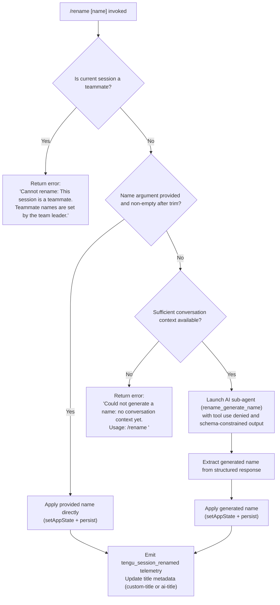

# `/rename`

> Analysis basis: CC v2.1.168 bundle.js (AST extraction + Claude interpretation)
> Minimum version: v2.1.168

---

## Overview

The `/rename` command sets the display name of the current Claude Code conversation session. It accepts an optional inline name argument; when no argument is provided and sufficient conversation context exists, it invokes an AI sub-agent to generate a name automatically. The command also supports the alias `/name`.

---

## Registration

| Field | Value |
|---|---|
| type | `local-jsx` |
| name | `rename` |
| description | `Rename the current conversation` |
| argumentHint | `[name]` |
| immediate | `true` |
| aliases | `["name"]` |
| module_id | `faq` |
| load_inline | `true` |
| loc_byte | `12035344` |
| loc_byte_end | `12035543` |
| loc_line | `8341` |
| arbor_handler.name | `GNf` |
| arbor_handler.fqn | `claude-2.1.168::GNf` |
| arbor_handler.kind | `AsyncFunction` |
| arbor_handler.resolution_path | `module_id` |
| arbor_handler.n_hits | `0` |

Analysis basis: CC v2.1.168 bundle.js:+12035344

---

## Input Branching

Four distinct paths exist based on session state and the presence of an inline name argument. A Mermaid flowchart is used.



Analysis basis: CC v2.1.168 bundle.js:+12034370, +12034488, +12034508, +12034607, +12034719, +12034847

---

## Behavioral Spec

### Top-Level Handler (`GNf`)

```
async function renameCommandHandler(userInput, appContext):
    input = userInput (argument passed after "/rename")
    sessionContext = getCurrentSession(appContext)

    -- Branch 1: Teammate guard
    if sessionContext.isTeammate:
        return errorMessage("Cannot rename: This session is a teammate. ...")

    trimmedInput = input.trim()

    -- Branch 2: Explicit name supplied
    if trimmedInput is non-empty:
        applyRename(trimmedInput, source="custom-title", appContext)
        return

    -- Branch 3: No name — check for context
    conversationMessages = getConversationHistory(appContext)
    if conversationMessages is empty or insufficient:
        return errorMessage("Could not generate a name: no conversation context yet. ...")

    -- Branch 4: AI name generation
    generatedName = await runNameGenerationSubagent(conversationMessages, appContext)
    applyRename(generatedName, source="ai-title", appContext)
```

Analysis basis: CC v2.1.168 bundle.js:+12035040, +12035056, +12035098

---

### Teammate Guard (`cR8` inner check)

```
function checkTeammateGuard(session):
    if session.type == "teammate":
        return { error: "Cannot rename: This session is a teammate. Teammate names are set by the team leader." }
    return null
```

Analysis basis: CC v2.1.168 bundle.js:+12034488, +12034508

---

### Name Application (`applyRename` — involves `_.setAppState`, session persistence)

```
function applyRename(name, source, appContext):
    -- Update in-memory app state
    appContext.setAppState({ sessionTitle: name })

    -- Persist title to session file system record
    -- source is either "custom-title" (user-supplied) or "ai-title" (generated)
    writeSessionTitle(name, source)

    -- Emit rename event for observers (e.g., UI title bar refresh)
    emitSessionRenamedEvent(name, source)

    -- Record telemetry
    emit("tengu_session_renamed")
```

Analysis basis: CC v2.1.168 bundle.js:+12034847, +13234268, +13234432, +13234360

---

### AI Name Generation Sub-agent (`WNf` / session fork)

```
async function runNameGenerationSubagent(conversationHistory, appContext):
    -- Record full-session fork telemetry
    emit("tengu_rename_full_session_fork")

    -- Build a constrained agent context:
    --   • tool use set to "deny" (no tool calls allowed)
    --   • system note: "Session name generation cannot use tools"
    --   • sub-agent type tagged as "rename" / "rename_generate_name"
    --   • output schema constrained to json_schema with a "name" field

    subagentConfig = {
        toolPolicy: "deny",
        systemNote: "Session name generation cannot use tools",
        outputSchema: { type: "json_schema", shape: { name: string } },
        agentTag: "rename_generate_name",
        messages: compactConversationHistory(conversationHistory)
    }

    response = await forkAndRunSubagent(subagentConfig, appContext)

    -- Extract plain text "name" field from structured response
    extractedName = parseStructuredOutput(response).name
    return extractedName.trim()
```

Analysis basis: CC v2.1.168 bundle.js:+12033196, +12032638, +12032653, +12032732, +12032756, +12033568, +12032979, +12032301

---

### Session Persistence and Title Metadata (`_R` / `He` / `Q$H`)

```
function writeSessionTitle(name, titleKind):
    -- titleKind: "custom-title" | "ai-title"
    -- Determines which metadata key is written to the session log file.
    -- Uses append-based log format; directory is created if absent.
    -- Log entry uses fixed-size encoding (384/448 byte records observed).

    ensureDirectoryExists(sessionLogDir)
    appendTitleRecord(sessionLogDir, { kind: titleKind, value: name })
```

Analysis basis: CC v2.1.168 bundle.js:+13234247, +13234256, +13234268, +13234432, +13233315, +13233342, +13233386

---

### Conversation Name Extraction Utility (`aj`)

```
function deriveBaseNameFromPath(sessionPath):
    -- Used for fallback display name before rename
    baseName = path.basename(sessionPath)
    return formatDisplayName(baseName)
```

Analysis basis: CC v2.1.168 bundle.js:+12034893, +4166490, +4166512

---

## State & Side Effects

| Item | Detail |
|---|---|
| Telemetry: `tengu_rename_full_session_fork` | Fired when AI sub-agent is launched to generate a name (bundle.js:+12033196) |
| Telemetry: `tengu_session_renamed` | Fired after every successful rename (custom or AI-generated) (bundle.js:+13234360) |
| Telemetry: `tengu_agent_name_set` | Fired when an agent name is set in a multi-agent context (bundle.js:+13237388) |
| Telemetry: `tengu_fork_agent_query` | Fired during sub-agent query execution (bundle.js:+10943867) |
| Telemetry: `tengu_forked_agent_default_turns_exceeded` | Fired if sub-agent hits its default turn limit (bundle.js:+10943424) |
| `appState` changes | `sessionTitle` is updated via `setAppState` (bundle.js:+12034847) |
| Session log write | Title record appended to session log file with kind `"custom-title"` or `"ai-title"` (bundle.js:+13233315) |
| Tool policy override | Sub-agent for name generation runs with tool use set to `"deny"` (bundle.js:+12032638) |
| Event emission | Session rename event emitted via `Ob6.emit` for UI subscribers (bundle.js:+13234347) |
| Sound | <!-- TODO: not found in depth-2 traversal; needs --depth 4 --> |

---

## Version History

| Version | Change |
|---|---|
| v2.1.168 | Initial analysis |

---

## Common Mistakes

1. **Calling `/rename` with no argument before any conversation exists.** The command will return `"Could not generate a name: no conversation context yet. Usage: /rename <name>"` — supply a name explicitly instead of relying on AI generation in a new session.
2. **Attempting to rename a teammate session.** The command blocks renaming of teammate sessions entirely; the error `"Cannot rename: This session is a teammate. Teammate names are set by the team leader."` is returned immediately.
3. **Expecting tool use during AI name generation.** The sub-agent invoked by `/rename` runs under a strict `"deny"` tool policy; no tools are available to it regardless of the session's normal tool configuration.
4. **Assuming the alias `/name` behaves differently.** The `name` alias is registered identically and routes to the same handler with no behavioral differences.
5. **Providing whitespace-only input.** The argument is trimmed before evaluation; a string of spaces is treated the same as omitting the argument, triggering the AI generation path (or the no-context error).

---

## Appendix — Identifier Mapping

> For bundle debugging only. Identifiers change across versions.

| Identifier | Role |
|---|---|
| `GNf` | Top-level async handler for `/rename` command (Arbor-resolved) |
| `cR8` | Core rename logic: teammate guard, argument parsing, branching |
| `dR8` | Pre-handler setup / session context resolution |
| `WNf` | AI name generation sub-agent orchestrator |
| `C96` | Sub-agent query runner / session fork coordinator |
| `EG` | Forked-agent execution loop |
| `bN8` | App state accessor/mutator during sub-agent run |
| `abH` | Session persistence and title metadata writer |
| `_R` | Title record append to session log |
| `He` | Alternative title write path (ai-title) |
| `Q$H` | Low-level log file append with mkdir-on-demand |
| `lMH` | Agent name set path (multi-agent context) |
| `aj` | Derive display name from session file path (basename) |
| `KS` | Tool schema / sub-agent configuration builder |
| `ME` | Message normalisation for sub-agent context |
| `aI8` | Conversation history serialiser for sub-agent input |
| `Oe_` | Sub-agent output deserialization |
| `EzK` | Main query execution engine (streaming) |
| `gR8` | Structured output (json_schema) response parser |
| `JM` | Session store getter |
| `qG` | Async storage (AsyncLocalStorage) getter |
| `H_A` | Timeout / abort-signal setup for sub-agent |
| `Laq` | Response text extraction helper |
| `eR` | String trim utility for extracted text |
| `GH` | String coercion utility |
| `YjH` | File-watching / job-state manager for session files |
| `Dh8` | Object key inspection for app state diff |
| `D6` | Session context loader |
| `cq8` | Session cache lookup / warm-start |
| `hP_` | New session initialiser |
| `uP_` | Existing session state restorer |
| `C6` | Session file reader with watch setup |
| `LwH` | Config file reader (readFileSync path) |
| `hVL` | File watcher registration for session config |
| `v` | Conversation history formatter / redactor |
| `snK` | History serialisation helper |
| `IPA` | Individual message encoder |
| `RH` | JSON stringify utility |
| `G4` | File extension / basename utility |
| `_iK` | Append-file writer with debounce |
| `npH` | Debounced write scheduler (setTimeout/setImmediate) |
| `YKH` | Write path resolver |
| `ll8` | Atomic file rename helper (stat → rename → unlink) |
| `HiK` | mkdir + appendFile persistence handler |
| `j9` | Shutdown hook registrar |
| `NE` | Session existence check |
| `H9` | Model alias resolver |
| `s9` | Model string normaliser (trim, lowercase, alias expand) |
| `m6H` | Model configuration builder |
| `qB` | Model string parser |
| `D2` | Prompt / model options assembler |
| `MA` | Provider tag resolver |
| `DM_` | Auth / key prefix classifier |
| `FJ` | Model fallback selector |
| `_G` | Model capability checker |
| `u8` | Input text-editor component (JSX) |
| `P` | Text editor core (offset, onChange) |
| `X` | Byte-stream reader |
| `WS` | Random session ID generator |
| `xbH` | MCP connection manager |
| `M` | MCP server map iterator |
| `PF8` | MCP connection result applier |
| `cDA` | MCP reconnect scheduler |
| `wk8` | MCP OAuth authenticate tool |
| `jk8` | MCP OAuth complete-auth tool |
| `phq` | MCP connection initiator |
| `Ze_` | MCP connection state renderer |
| `hhq` | MCP connection event handler |
| `BD8` | MCP tool-call dispatcher |
| `mD8` | MCP response formatter |
| `M8` | MCP debug logger |
| `v7` | MCP error logger |
| `sl` | MCP server config merger |
| `kk` | MCP config key normaliser |
| `r4` | Shutdown hook registration |
| `R6` | React rendering helper |
| `tv` | React element factory |
| `Ky` | Ink component (style) |
| `TM` | Ink Text component |
| `W_` | Ink Box component |
| `Zv` | Ink render wrapper |
| `lMH` | Agent name persistence (multi-agent) |
| `ed` | Conversation state file read/write |
| `pz6` | Session metadata file accessor |
| `oL` | UI notification component |
| `uTH` | Notification renderer |
| `YjH` | Watch-job state manager |
| `e9` | File-stat + cache invalidation for watched files |
| `zf` | Atomic write helper (randomBytes temp file) |
| `XY` | Atomic write implementation (writeFile → rename) |
| `fz` | File-change event debouncer |
| `hH` | Error logger with ring buffer |
| `AA` | Error formatter |
| `_6` | String coercion utility |
| `$q` | Essential-traffic filter |
| `DG4` | Debug log ring buffer manager |