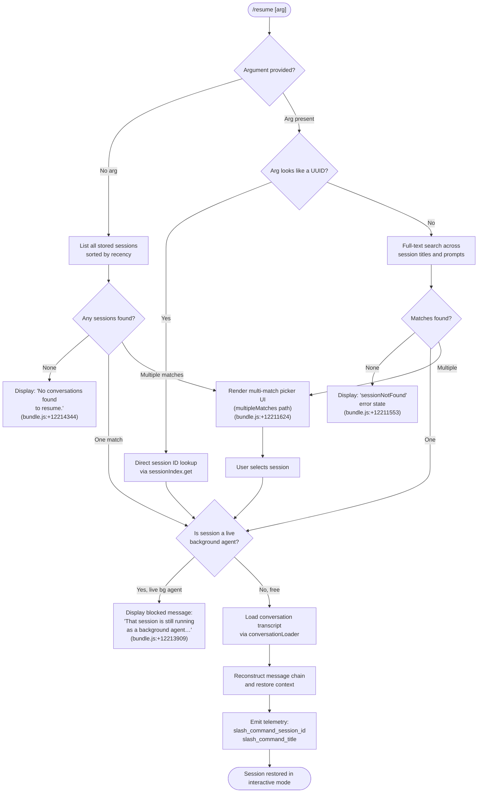

# `/resume`

> Analysis basis: CC v2.1.168 bundle.js (AST extraction + Claude interpretation)
> Minimum version: v2.1.168

---

## Overview

`/resume` (alias: `/continue`) allows the user to pick up a previous conversation from Claude Code's local conversation store. Given an optional conversation ID or search term, it locates the matching session, checks whether that session is still alive as a background agent, and—if the session is free—restores it into the current interactive context. Telemetry events `slash_command_session_id` and `slash_command_title` are emitted on successful resolution.

---

## Registration

| Field | Value |
|---|---|
| type | `local-jsx` |
| name | `resume` |
| description | `Resume a previous conversation` |
| argumentHint | `[conversation id or search term]` |
| aliases | `["continue"]` |
| module_id | `deq` |
| load_inline | `true` |
| loc_byte | `12215307` |
| loc_byte_end | `12215504` |
| loc_line | `8529` |
| arbor_handler.name | `hyf` |
| arbor_handler.fqn | `claude-2.1.168::hyf` |
| arbor_handler.kind | `AsyncFunction` |
| arbor_handler.resolution_path | `module_id` |
| arbor_handler.n_hits | `0` |

Analysis basis: CC v2.1.168 bundle.js:+12215307

---

## Input Branching

Five distinct paths exist depending on the argument supplied and the state of the target session — a Mermaid flowchart is required.



---

## Behavioral Spec

### Handler Entry Point (`hyf`)

The async handler `hyf` is reached via the `module_id`-based load path (`deq`). It is the primary orchestrator for the `/resume` command.

Analysis basis: CC v2.1.168 bundle.js:+12213899

```
async function resumeCommandHandler(userInput, appContext):
    # 1. Enumerate all stored sessions
    sessionList = await listAllStoredSessions(appContext)   # via AMH / A.listAllSessions

    # 2. Filter out non-interactive sessions (only 'interactive' mode eligible)
    #    Constant: "interactive" (bundle.js:+9042555)
    candidates = sessionList.filter(s => s.mode == "interactive")

    # 3. Resolve target session from user input
    target = resolveTarget(userInput, candidates)

    # 4. Guard: live background agent check
    if isLiveBackgroundAgent(target):
        displayError(BLOCKED_MESSAGE)   # "That session is still running…" (bundle.js:+12213909)
        return

    # 5. No sessions at all
    if candidates.isEmpty():
        displayMessage("No conversations found to resume.")  # (bundle.js:+12214344)
        return

    # 6. Load and restore the session
    transcript = await loadConversationTranscript(target)   # via _MH / Mi / L3K chain
    reconstructedContext = buildContext(transcript)
    attachToInteractiveSession(reconstructedContext, appContext)

    # 7. Emit telemetry
    emit("slash_command_session_id", target.id)   # (bundle.js:+12214605)
    emit("slash_command_title", target.title)     # (bundle.js:+12214829)
```

### Session Enumeration and Live-Agent Guard (`AMH`)

`AMH` wraps `A.listAllLiveSessions` (bundle.js:+9042464) and `Promise.resolve` to produce the candidate list. A session with mode `"interactive"` (bundle.js:+9042555) is a resumable conversation.

Analysis basis: CC v2.1.168 bundle.js:+12213899

```
async function enumerateSessions(context):
    liveSessions = await context.listAllLiveSessions()
    return Promise.resolve(liveSessions)
```

### Background-Agent Block (`hyf` inline guard)

When the resolved session is currently running as a background agent, the handler short-circuits with a user-visible message rather than attempting to resume. The sentinel string is `"That session is still running as a background agent. Open \`claude agents\` to attach to it, or stop it there first to resume here."` (bundle.js:+12213909).

```
function checkBackgroundAgentBlock(session):
    if session.isLiveBackgroundAgent:
        renderErrorMessage(BLOCKED_MSG)
        return SKIP   # literal "skip" (bundle.js:+12214112)
    return CONTINUE
```

### Argument Resolution (`Qeq` → filter + `S$`)

The raw input string is split, trimmed, and matched against session metadata. UUID-shaped inputs are dispatched directly; free-text inputs use a case-insensitive scan over titles and last-prompt excerpts.

Analysis basis: CC v2.1.168 bundle.js:+12213795

```
function resolveTarget(rawInput, sessions):
    if rawInput is empty:
        return interactivePicker(sessions)   # multi-match UI

    normalized = rawInput.trim().toLowerCase()

    # UUID path — exact match
    if looksLikeUUID(normalized):
        match = sessions.find(s => s.id == normalized)
        if not match: return SESSION_NOT_FOUND   # "sessionNotFound" (bundle.js:+12211553)
        return match

    # Search path
    matches = sessions.filter(s =>
        s.title.toLowerCase().includes(normalized) or
        s.lastPrompt.toLowerCase().includes(normalized)
    )

    if matches.length == 0: return SESSION_NOT_FOUND
    if matches.length == 1: return matches[0]
    return multiMatchPicker(matches)   # "multipleMatches" (bundle.js:+12211624)
```

### Transcript Loading and Context Reconstruction (`_MH` / `Mi` / `L3K`)

Once a target session is selected, the transcript file is located via the worktree-aware path resolver (`_MH`, bundle.js:+12214266), and the full message chain is reconstructed by `Mi` (bundle.js:+12214730) calling into `L3K` (the conversation-loader sub-graph).

Analysis basis: CC v2.1.168 bundle.js:+12214266

```
async function loadAndReconstructSession(sessionId, workdir):
    # Locate transcript file
    transcriptPath = resolveTranscriptPath(sessionId, workdir)  # _MH

    # Parse and sort message chain
    rawMessages = parseTranscriptFile(transcriptPath)           # L3K / Jdf sub-graph
    chain = sortByTimestamp(rawMessages)

    # Apply any compact-boundary summaries
    chain = applyCompactBoundaries(chain)   # "compact_boundary" (bundle.js:+10780670)

    return chain
```

### No-Match / Multiple-Match UI (`Feq`)

`Feq` (bundle.js:+12214879) renders the final UI state. It calls `j6.bold` (bundle.js:+12211588) to format the session picker or error message.

```
function renderResultUI(matchState, sessions):
    switch matchState:
        case SESSION_NOT_FOUND:
            render bold error label "sessionNotFound"
        case MULTIPLE_MATCHES:
            render interactive list of sessions (bold titles)
        case NO_SESSIONS:
            render plain message "No conversations found to resume."
```

---

## State & Side Effects

| Item | Detail |
|---|---|
| Telemetry: `slash_command_session_id` | Fired on successful session resolution (bundle.js:+12214605) |
| Telemetry: `slash_command_title` | Fired alongside session ID on successful restore (bundle.js:+12214829) |
| Telemetry: `tengu_worktree_detection` | Fired during worktree path resolution for transcript location (bundle.js:+9033371) |
| Telemetry: `tengu_transcript_phantom_parent` | May fire during transcript chain reconstruction if a parent UUID is missing (bundle.js:+13245518) |
| Telemetry: `tengu_transcript_parent_cycle` | Fires if a cycle is detected in the parent-UUID chain (bundle.js:+13249320) |
| Telemetry: `tengu_chain_parent_cycle` | Chain-level cycle guard (bundle.js:+13227009) |
| Telemetry: `tengu_chain_timestamp_fallback` | Fires when a message timestamp must be synthesised (bundle.js:+13227158) |
| Telemetry: `tengu_chain_parallel_tr_recovered` | Fires when a parallel transcript branch is recovered (bundle.js:+13229024) |
| Telemetry: `tengu_relink_walk_broken` | Fires when a transcript relink walk encounters a broken link (bundle.js:+13226519) |
| Telemetry: `tengu_feature_ok` / `tengu_feature_bad` / `tengu_feature_sad` | Feature-level outcome events emitted by the `o6` / `CH` / `SH` subgraph (bundle.js:+1010950, +1011012, +1011093) |
| appState changes | Active session context replaced with the restored conversation; existing draft input cleared |
| Hook registration | `j9` → `NPA.register` (bundle.js:+60369): registers process-exit handler for clean shutdown during resume |
| File I/O | Transcript file read via `wL.readFile` / `PR.openSync` / `PR.readSync`; potential `.txt` rename via `ll8` (bundle.js:+205500) |
| Sound | None identified in depth-2 traversal |

---

## Version History

| Version | Change |
|---|---|
| v2.1.168 | Initial analysis |

---

## Common Mistakes

1. **Passing a partial UUID** — The resolver treats any UUID-shaped string as an exact match. A truncated UUID will fail with `sessionNotFound` rather than falling back to a fuzzy search.
2. **Trying to resume a live background agent** — The command will display the blocked-message and exit rather than attaching. Use `/agents` to attach to or stop the background agent first.
3. **Using `/resume` in non-interactive mode** — Only sessions recorded with mode `"interactive"` appear in the candidate list; headless/background sessions are filtered out before the picker is shown.
4. **Expecting resume to merge two open sessions** — `/resume` replaces the current context; it does not merge concurrent conversations.
5. **Relying on title search across compacted sessions** — After `/compact`, only the summary and last-prompt metadata are stored; earlier turn content is not searchable via the title-match path.

---

## Appendix — Identifier Mapping

> For bundle debugging only. Identifiers change across versions.

| Identifier | Role |
|---|---|
| `hyf` | Primary async handler for `/resume` (Arbor-resolved entry point) |
| `Qeq` | Argument-parsing and session-filter function |
| `AMH` | Session enumeration wrapper (`listAllLiveSessions`) |
| `hH` | Conversation context loader / restorer |
| `_MH` | Transcript path resolver (worktree-aware) |
| `Mi` | Session reconstructor; orchestrates chain building |
| `L3K` | Conversation-file loader; reads and parses transcript files |
| `LMH` | Full conversation state builder (maps raw transcript to structured state) |
| `r1H` | Low-level transcript parser and message-chain assembler |
| `Jdf` | Binary transcript file parser |
| `jdf` | Secondary binary transcript parser (alternate format) |
| `Xdf` | Synchronous transcript-chunk reader |
| `p$K` | Transcript index / session-map manager |
| `Hdf` | Parent-UUID relink walker |
| `KMH` | Chain timestamp resolver and compaction handler |
| `Kdf` | Conversation-record sorter and deduplicator |
| `_df` | Chain shift/sort utility |
| `H3K` | Chain value mapper |
| `qdf` | NaN-safe numeric validator used in chain sorting |
| `GZH` | JSONL parse dispatcher (dispatches to `RZ4`, `SZ4`, `hZ4`) |
| `RZ4` | JSONL record parser (user/assistant turns) |
| `SZ4` | JSONL record parser (system/attachment turns) |
| `hZ4` | JSONL record parser (metadata turns) |
| `i86` | Session state accessor / getter map |
| `K3K` | Session initialiser (calls `r1H` + `Object.assign`) |
| `Pdf` | Session file-path resolver |
| `AMA` | Aggregate message assembler |
| `wMA` | Message-content normaliser |
| `SR6` | Raw-content parser (text, command-args, bash-input) |
| `n86` | Message-list mapper |
| `JMA` | Content-type filter (image, document) |
| `Ldf` | Array/trim content validator |
| `fdf` | Array `some`-predicate content validator |
| `Vu8` | Session-map getter |
| `Nu8` | Session-map value enumerator |
| `Zu8` | Date-parse utility for session timestamps |
| `Feq` | Result UI renderer (no-match / multi-match states) |
| `RC8` | Session display formatter |
| `Yb6` | Session list renderer |
| `IuH` | Session-entry detail builder |
| `vdf` | Individual session-record content formatter |
| `BF` | Session-ID format validator (regex test) |
| `Et` | Base UI element factory |
| `S$` | UI display helper (shared with result render) |
| `W_` | Terminal output writer |
| `snK` | Conversation-state side-effect handler |
| `IPA` | State-change applicator |
| `_iK` | Session-file write / append coordinator |
| `HiK` | Transcript append worker |
| `ll8` | Transcript file rotate / rename handler |
| `$0A` | Transcript path join helper |
| `B76` | File-write error classifier |
| `YKH` | Transcript buffer flush |
| `npH` | Async write-queue (setTimeout / setImmediate loop) |
| `EUH` | Conversation write dispatcher |
| `nWA` | Low-level file write wrapper |
| `G4` | Conversation ID / path formatter |
| `K0A` | Path segment mapper |
| `j9` | Process-exit hook registrar |
| `lHH` | Session-set membership check |
| `uj` | String sanitiser (replace) |
| `mj_` | Argument token splitter |
| `H9` | Message-format selector |
| `m6H` | Model / provider metadata resolver |
| `qB` | Provider-specific model-id builder |
| `s9` | Model-string normaliser |
| `FJ` | Format selector dispatcher |
| `_G` | Format-path router |
| `o6` | Feature-outcome reporter |
| `J6` | Low-level feature event emitter |
| `DLK` | Daemon status writer |
| `YC6` | Status-file path builder |
| `Yo` | Conversation-format helper |
| `b4H` | Title trimmer |
| `hm6` | Base event emitter primitive |
| `jO` | Path normaliser (NFC) |
| `DG4` | Error-log ring-buffer manager |
| `dRA` | Telemetry-mode resolver |
| `$q` | Telemetry gate |
| `AA` | Error formatter |
| `GH` | String coercion wrapper |
| `C_` | Main conversation context runner |
| `YZH` | Child-process / subprocess manager |
| `Feq` | (see above — result UI renderer) |
| `X$H` | Session-picker state holder |

---

Note: index built via Arbor fallback; some signals (telemetry, literals) may be missing — see arbor-fallback.js.