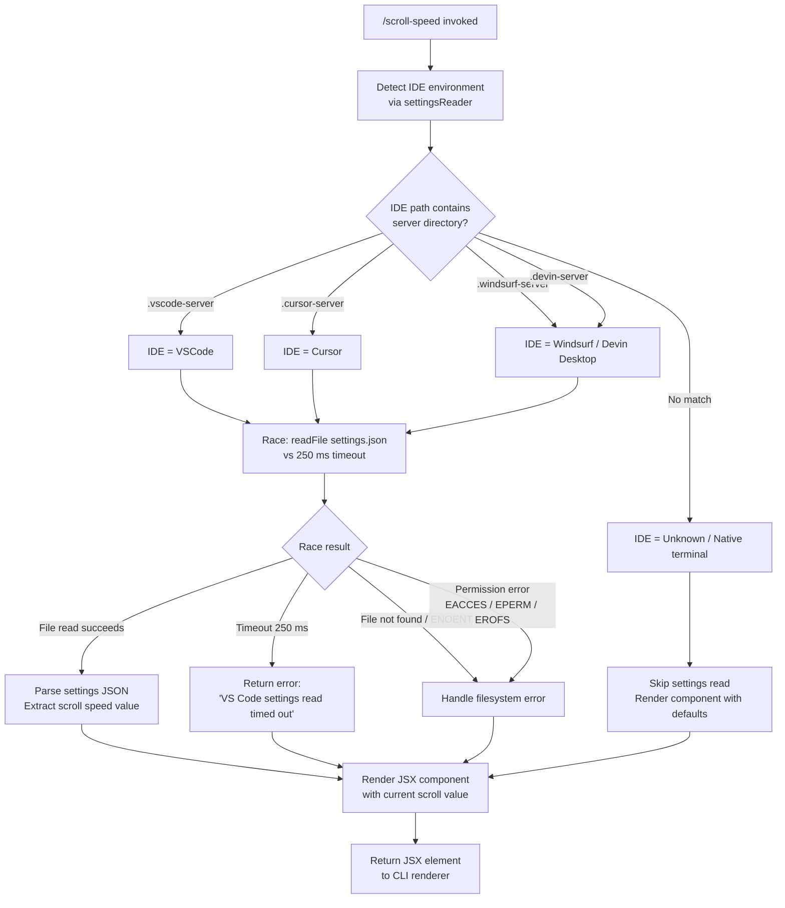

```markdown
---
type: feature-spec
feature: "scroll-speed"
cc_version: "2.1.168"
updated: "2026-06-11"
tags: ["scroll-speed", "commands", "slash-commands"]
source: "bundle-analysis"
bundle_verified: true
analysis_basis: "CC v2.1.168 bundle.js (AST extraction + Claude interpretation)"
author: "ryujaeuk <ryujaeuk@gmail.com>"
repository: "https://github.com/MyLittleLuckyDog/cc-gnothi"
license: "AGPL-3.0-only"
---

# `/scroll-speed`

> Analysis basis: CC v2.1.168 bundle.js (AST extraction + Claude interpretation)
> Minimum version: v2.1.168

---

## Overview

`/scroll-speed` is a local JSX command that adjusts the mouse wheel scroll speed within the Claude Code terminal UI. It achieves this by detecting the host IDE environment (VS Code, Cursor, Windsurf/Devin Desktop), reading the relevant editor's `settings.json` file, and rendering a JSX component that reflects or modifies the scroll configuration. A timeout guard of 250 ms is applied when reading VS Code settings to prevent hangs.

---

## Registration

| Field | Value |
|---|---|
| type | `local-jsx` |
| name | `scroll-speed` |
| description | Adjust mouse wheel scroll speed |
| loc_byte | `12268044` |
| loc_byte_end | `12268292` |
| loc_line | `8646` |
| module_id | `dHK` |
| load_inline | `true` |
| arbor_handler.name | `Rhf` |
| arbor_handler.fqn | `claude-2.1.168::Rhf` |
| arbor_handler.kind | `AsyncFunction` |
| arbor_handler.resolution_path | `module_id` |
| arbor_handler.n_hits | `0` |

Analysis basis: CC v2.1.168 bundle.js:+12268044

---

## Input Branching

The command has 4+ distinct paths depending on IDE environment detection and settings-read outcome, so a Mermaid flowchart is used.



Analysis basis: CC v2.1.168 bundle.js:+12267807, +12267816, +12267820, +4034805, +4039012

---

## Behavioral Spec

### 1. Main Handler (`Rhf`)

The async handler is the entry point resolved via `module_id → dHK`.

```
async function scrollSpeedHandler(context):
    // Step 1: attempt to read IDE settings with timeout guard
    settingsResult = await Promise.race([
        readIDESettings(),          // resolves with parsed settings or error
        timeoutPromise(250)         // rejects / resolves with timeout sentinel
    ])

    // Step 2: render JSX component
    element = createElement(ScrollSpeedComponent, {
        settingsResult: settingsResult,
        ...context
    })
    return element
```

Analysis basis: CC v2.1.168 bundle.js:+12267807, +12267810, +12267878

---

### 2. Timeout Race (`IL`)

A utility that wraps `setTimeout` and `clearTimeout` inside a `Promise.race` pattern to enforce an upper bound on async operations.

```
function timedPromise(asyncOperation, timeoutMs):
    timeoutHandle = null
    timeoutPromise = new Promise((resolve, reject) =>
        timeoutHandle = setTimeout(() => resolve(TIMEOUT_SENTINEL), timeoutMs)
    )
    return Promise.race([asyncOperation, timeoutPromise])
        .finally(() => clearTimeout(timeoutHandle))
```

- Timeout value: **250 ms** (bundle.js:+12267816)
- Timeout sentinel string: `"VS Code settings read timed out"` (bundle.js:+12267820)

Analysis basis: CC v2.1.168 bundle.js:+2298995, +2299026, +2299073

---

### 3. IDE Settings Reader (`mE_`)

Responsible for determining the host IDE and reading its `settings.json`.

```
async function readIDESettings():
    // Determine IDE type from known server directory markers
    ideKind = detectIDEEnvironment()   // calls Kf8

    if ideKind is UNKNOWN:
        return null

    // Build path to settings.json
    settingsPath = path.join(configDir, "settings.json")

    // Read file as UTF-8
    raw = await fs.readFile(settingsPath, "utf-8")

    // Parse and normalise
    parsed = parseSettingsContent(raw)   // calls S$6 → xl6, Hu, v
    return parsed
```

Analysis basis: CC v2.1.168 bundle.js:+4038932, +4038945, +4038979, +4038991, +4039005, +4039012, +4039039

---

### 4. IDE Environment Detection (`Kf8`)

Checks known server-directory substrings in the active HOME / config path to classify the running IDE.

```
function detectIDEEnvironment(configPath):
    knownMarkers = [
        { substring: ".vscode-server",   display: "VSCode",        key: "vscode"   },
        { substring: ".cursor-server",   display: "Cursor",        key: "cursor"   },
        { substring: ".windsurf-server", display: "Devin Desktop", key: "windsurf" },
        { substring: ".devin-server",    display: "Devin Desktop", key: "windsurf" },
    ]

    for marker in knownMarkers:
        if configPath.includes(marker.substring):
            return marker

    // Secondary check via includes on additional path segments
    return UNKNOWN
```

Known display names: `"VSCode"`, `"Cursor"`, `"Devin Desktop"` (bundle.js:+4039283, +4039311, +4039341)
Known key strings: `"vscode"`, `"cursor"`, `"windsurf"` (bundle.js:+4039268, +4039296, +4039324)
Server path markers: `.vscode-server`, `.cursor-server`, `.windsurf-server`, `.devin-server` (bundle.js:+4034816, +4034846, +4034876, +4034908)

Analysis basis: CC v2.1.168 bundle.js:+4034805, +4034926

---

### 5. Settings Content Normaliser (`S$6`)

Parses the raw UTF-8 string from `settings.json` and normalises the scroll-speed-relevant value before returning it to the handler.

```
function normaliseSettingsContent(rawString):
    // Strip leading/trailing markers if present (Hu)
    stripped = stripWrapper(rawString)   // startsWith / slice checks

    // Parse as structured data
    parsed = parseStructured(stripped)   // calls v (argument parser)

    // Coerce to String for rendering
    return String(parsed)
```

On parse failure the string `"error"` is returned as a sentinel (bundle.js:+1144857).

Analysis basis: CC v2.1.168 bundle.js:+1144754, +1144758, +1144781, +1144838, +1144857

---

### 6. Filesystem Error Handling (`t1` / `V8`)

Filesystem errors arising from `readFile` are classified by error code and handled gracefully rather than surfaced as unhandled rejections.

Handled error codes (bundle.js:+176093–176162):
- `ENOENT` — file not found
- `EACCES` — permission denied
- `EPERM` — operation not permitted
- `ENOTDIR` — path component is not a directory
- `ELOOP` — symbolic link loop
- `EROFS` — read-only filesystem

```
function handleFilesystemError(err):
    if err.code in HANDLED_FS_ERRORS:
        return null    // treat as "no settings available"
    throw err          // re-raise unexpected errors
```

Analysis basis: CC v2.1.168 bundle.js:+176076, +176093, +176107, +176121, +176134, +176149, +176162

---

### 7. Logging / Error Pipeline (`hH`)

A structured logging pipeline collects errors encountered during settings read and routes them to the application's error log.

```
function logPipelineError(context, error):
    formatted = formatError(error)        // AA → Error + String coercion
    record    = buildLogRecord(formatted) // _6 → String
    queue     = getLogQueue()             // $q → dRA
    rotateIfNeeded(queue)                 // DG4 → shift + push
    appendToLog(record)                   // PFH.push
    reportError(record)                   // pr.logError
```

Analysis basis: CC v2.1.168 bundle.js:+1016312, +1016325, +1016571, +1016654, +1016672, +1016712

---

## State & Side Effects

| Item | Detail |
|---|---|
| Telemetry | `tengu_feature_sad` (bundle.js:+1011093) — fired on sad-path / error inside the log utility (`o6` → `l`) |
| Hook registration | None detected at depth ≤ 2 |
| appState changes | None detected at depth ≤ 2 |
| Filesystem I/O | Reads `settings.json` (UTF-8) from IDE config directory (bundle.js:+4038979, +4039012) |
| Timeout guard | 250 ms `setTimeout` / `clearTimeout` pair via `IL` (bundle.js:+12267816) |
| JSX render | Returns a JSX element via `Y4A.createElement` (bundle.js:+12267878) |
| Sound | None detected |

---

## Version History

| Version | Change |
|---|---|
| v2.1.168 | Initial analysis |

---

## Common Mistakes

1. **Expecting instant response in slow-filesystem environments** — the command enforces a hard 250 ms cap on reading `settings.json`. If the IDE config directory is on a network drive or a slow container mount, the command will always return the timeout sentinel rather than the real settings value.
2. **Assuming all IDE environments are supported** — only VS Code, Cursor, and Windsurf/Devin Desktop are detected by server-directory substring matching. Running inside any other IDE or a plain terminal returns no settings; the command still renders but without live scroll-speed data.
3. **Expecting a persistent state change** — `/scroll-speed` renders a JSX UI component; it does not write back to `settings.json`. Any actual scroll-speed change must be performed through the rendered UI or manually in the editor settings.
4. **Confusing the timeout error string with a fatal error** — `"VS Code settings read timed out"` is a display sentinel, not an exception. The JSX component still renders; it simply shows the timeout message in place of a real value.

---

## Appendix — Identifier Mapping

> For bundle debugging only. Identifiers change across versions.

| Identifier | Role |
|---|---|
| `Rhf` | Main async handler for `/scroll-speed` (AsyncFunction, module `dHK`) |
| `IL` | Timeout-race utility (`Promise.race` + `setTimeout` + `clearTimeout`) |
| `mE_` | IDE settings reader (detects IDE, reads `settings.json`) |
| `cBL` | Config-directory resolver called by `mE_` |
| `Kf8` | IDE environment detector (checks `.vscode-server`, `.cursor-server`, etc.) |
| `H` | Path / string helper (bootstrap fetch utility, used across many call sites) |
| `v` | Argument / value parser used in normalisation and elsewhere |
| `Y3` | Sub-utility called from bootstrap fetch path |
| `mj_` | String splitter / trimmer / slicer utility |
| `lHH` | Set membership check helper (`o74.has`) |
| `uj` | String replace utility |
| `H9` | Composite string-processing helper (`m6H`, `s9`, `FJ`) |
| `o6` | Telemetry sad-path reporter (fires `tengu_feature_sad`) |
| `_` | Generic iterable / string operand (context-dependent) |
| `S$6` | Settings content normaliser (`xl6`, `Hu`, `v`, `String`) |
| `Hu` | Prefix-stripping helper (`startsWith` / `slice`) |
| `uE_` | Array type-check helper (`Array.isArray`) |
| `t1` | Filesystem error classifier (routes `ENOENT`, `EACCES`, etc.) |
| `V8` | Error-code constant table used by `t1` |
| `hH` | Structured error-logging pipeline |
| `AA` | Error formatter (`Error` + `String` coercion) |
| `_6` | Log-record builder (`String` coercion) |
| `$q` | Log-queue accessor (calls `dRA`) |
| `dRA` | Log-record constructor (calls `_6`) |
| `DG4` | Log-queue rotation helper (`shift` + `push`) |

---

Note: index built via Arbor fallback; some signals (telemetry, literals) may be missing — see arbor-fallback.js.
```