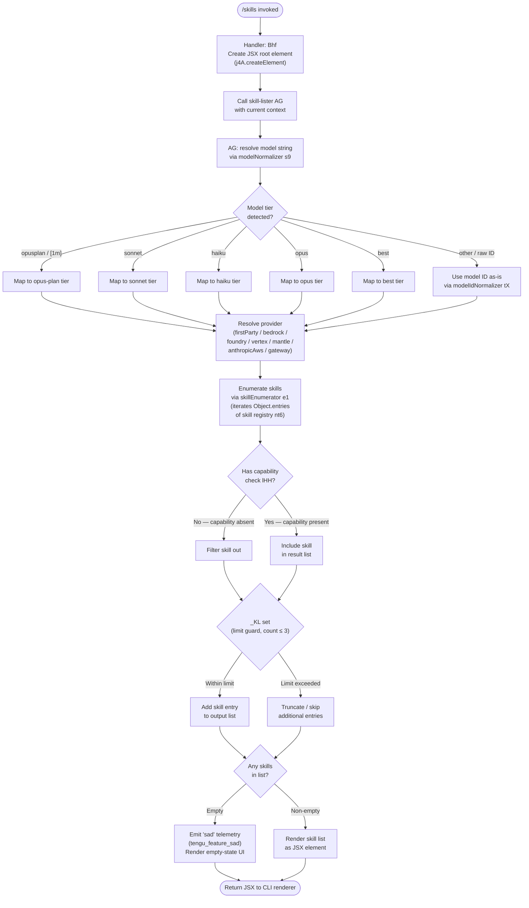

# `/skills`

> Analysis basis: CC v2.1.168 bundle.js (AST extraction + Claude interpretation)
> Minimum version: v2.1.168

---

## Overview

The `/skills` command lists the available skills (capabilities/tools) that Claude Code currently has access to. It is a `local-jsx` command that renders output immediately via a JSX component rather than dispatching a prompt to the agent. The handler resolves the active model context and available skill set, then produces a structured UI element displaying each skill.

---

## Registration

| Field | Value |
|---|---|
| type | `local-jsx` |
| name | `skills` |
| description | `List available skills` |
| immediate | `true` |
| module_id | `K6K` |
| load_inline | `true` |
| loc_byte | `12277769` |
| loc_byte_end | `12277901` |
| loc_line | `8646` |
| arbor_handler.name | `Bhf` |
| arbor_handler.fqn | `claude-2.1.168::Bhf` |
| arbor_handler.kind | `AsyncFunction` |
| arbor_handler.resolution_path | `module_id` |
| arbor_handler.n_hits | `0` |

Analysis basis: CC v2.1.168 bundle.js:+12277769

---

## Input Branching

The command has two primary top-level branches based on the result of the skill-listing helper (`AG`): whether skills are found or not. Within skill resolution there are multiple sub-branches (model-tier mapping, provider detection, skill-category classification). The Mermaid chart below captures the full branching shape.



Analysis basis: CC v2.1.168 bundle.js:+12277584 (handler entry), +2245609 (limit literal `4` — see note below), +2245681 (`_KL` guard), +1011091 (`tengu_feature_sad`)

---

## Behavioral Spec

### Handler — `Bhf` (skillsCommandHandler)

```
async function skillsCommandHandler(context):
    rootElement = createElement(jsxRuntime)          // j4A.createElement
    skillList   = await listSkills(context)          // AG
    return render(rootElement, skillList)
```

Analysis basis: CC v2.1.168 bundle.js:+12277584, +12277658

---

### Skill Listing — `AG` (listSkills)

```
async function listSkills(context):
    normalizedModel = normalizeModelString(context.model)   // s9
    skills          = enumerateSkills(normalizedModel)      // e1
    if _KL.has(skills):                                     // _KL guard
        skills = applyLimit(skills, limitValue=3)           // literal @ +2245694
    return skills
```

Analysis basis: CC v2.1.168 bundle.js:+2245617 (`s9` call), +2245625 (`e1` call), +2245681 (`_KL.has`)

---

### Model String Normalization — `s9` (normalizeModelString)

```
function normalizeModelString(rawModel):
    trimmed = rawModel.trim()                             // H.trim @ +2247412
    lower   = trimmed.toLowerCase()                      // _.toLowerCase @ +2247423

    tier = classifyModelTier(lower)                      // CI @ +2247526
    if tier == "opusplan" or contains "[1m]":
        return opusPlanTier
    if tier == "sonnet":
        return sonnetTier
    if tier == "haiku":
        return haikuTier
    if tier == "opus":
        return opusTier
    if tier == "best":
        return bestTier

    // Fall through: apply string replacements for known raw model IDs
    cleaned = lower.replace(patterns)                    // _.replace @ +2247754
    return cleaned
```

Known model identifier strings matched at this stage include `claude-opus-4-8`, `claude-opus-4-7`, `claude-opus-4-6`, `claude-opus-4-5`, `claude-opus-4-1`, `claude-opus-4-0`, `claude-sonnet-4-6`, `claude-sonnet-4-5`, `claude-sonnet-4-0`, `claude-haiku-4-5`, `claude-3-7-sonnet`, `claude-3-5-sonnet`, `claude-3-5-haiku`, `claude-3-opus`, `claude-3-sonnet`, `claude-3-haiku`.

Analysis basis: CC v2.1.168 bundle.js:+2247412, +2247423, +2247526, +2247534, +2247549, +2247588, +2247627, +2247664, +2244474–+2245363

---

### Provider Resolution — `MA` (resolveProvider)

```
function resolveProvider(modelString):
    if contains "bedrock":   return "bedrock"
    if contains "foundry":   return "foundry"
    if contains "mantle":    return "mantle"
    if contains "vertex":    return "vertex"
    if tier == "firstParty": return "firstParty"
    if tier == "anthropicAws": return "anthropicAws"
    if tier == "gateway":    return "gateway"
    return "firstParty"   // default
```

Analysis basis: CC v2.1.168 bundle.js:+2100912 (`_6` call), +2100952, +2101002, +2101112, +2101160, +2101607, +2101625, +2101645

---

### Skill Enumeration — `e1` (enumerateSkills)

```
function enumerateSkills(normalizedModel):
    registry = buildSkillRegistry()           // nt6 @ +2245456
    results  = []
    for [skillName, skillDef] in Object.entries(registry):   // +2102943
        normalized = normalizeSkillId(skillName)             // tX @ +2245479
            // tX: toLowerCase, includes-check, replace
        if includesCheck(normalized):                        // H.includes @ +2245488
            if modelSupportCheck(skillDef, normalizedModel): // Lc8 @ +2245539
                cleaned = stripPrefix(normalized)            // uj @ +2245543
                results.push({ name: cleaned, def: skillDef })
    return results
```

Analysis basis: CC v2.1.168 bundle.js:+2245456, +2245479, +2245488, +2245499, +2245539, +2245543

---

### Skill ID Normalization — `tX` (normalizeSkillId)

```
function normalizeSkillId(rawId):
    lower = rawId.toLowerCase()                         // H.toLowerCase @ +2244447
    if lower.includes("application-inference-profile"): // H.includes @ +2244463
        return rawId.replace(inferenceProfilePattern)   // H.replace @ +2245411
    return lower
```

The string `"application-inference-profile"` (bundle.js:+2245499) is used to detect and normalize inference-profile skill identifiers.

Analysis basis: CC v2.1.168 bundle.js:+2244447, +2244463, +2245411, +2245499

---

### Bootstrap / Remote Fetch — `H` (bootstrapFetcher)

`listSkills` may trigger a bootstrap fetch for remote skill definitions. Internally this logs `"[Bootstrap] Fetching"` (bundle.js:+15797658) and sets HTTP headers `Content-Type: application/json` (+15797743, +15797758) and `User-Agent` (+15797777). The fetch has a timeout of **5000 ms** (bundle.js:+15797859). On success, `"[Bootstrap] Fetch ok"` is logged (+15798032). On failure the event `"api_bootstrap_fetch"` / status `"parse_failed"` is recorded (+15797980, +15798002).

Analysis basis: CC v2.1.168 bundle.js:+15797658, +15797743, +15797758, +15797777, +15797859, +15797980, +15798002, +15798032

---

### Capability Guard — `lHH` (hasCapability)

```
function hasCapability(capabilityToken):
    return capabilitySet.has(capabilityToken)   // o74.has @ +844383
```

Skills whose capability token is absent from the current capability set are silently filtered out before the list is returned to the renderer.

Analysis basis: CC v2.1.168 bundle.js:+844383, +15797829

---

### Sad-Path / Empty-State

When `listSkills` returns an empty list (no skills available for the current model/provider), the `o6` branch emits the telemetry event `tengu_feature_sad` and renders an empty-state UI element. The literal `"debug"` (bundle.js:+206570) suggests this path may also emit a debug-level log entry.

Analysis basis: CC v2.1.168 bundle.js:+1011091, +1011127, +206570

---

## State & Side Effects

| Item | Detail |
|---|---|
| Telemetry | `tengu_feature_sad` (bundle.js:+1011093) — fired when the resolved skill list is empty |
| Bootstrap fetch | May perform an HTTP GET with `Content-Type: application/json` and a 5 000 ms timeout to fetch remote skill definitions (bundle.js:+15797859) |
| Hook registration | <!-- TODO: not found in depth-2 traversal; needs --depth 4 --> |
| appState changes | No appState mutations observed in the depth-2 call graph |
| Sound | No audio side-effects observed |
| Render | Returns a JSX element immediately (`immediate: true`); no agent turn is started |

---

## Version History

| Version | Change |
|---|---|
| v2.1.168 | Initial analysis |

---

## Common Mistakes

1. **Expecting agent output** — `/skills` is `immediate: true` and `local-jsx`; it never opens an agent turn. If you see no response from the model, that is correct behaviour.
2. **Model-tier mismatch** — Tier keywords (`opusplan`, `sonnet`, `haiku`, `opus`, `best`) are matched against the *lower-cased, trimmed* model string. Passing an unrecognised model alias may cause the command to fall through to the raw-ID path, potentially yielding a different skill set than expected.
3. **Inference-profile IDs** — Skill IDs containing `"application-inference-profile"` undergo additional normalisation; callers should not assume the raw profile ID will appear verbatim in the output list.
4. **Empty list / sad-path** — If the current provider/model combination has no registered skills, the command renders an empty UI without error. Check the `tengu_feature_sad` telemetry to confirm this path was taken.
5. **Bootstrap timeout** — If the remote bootstrap fetch does not complete within 5 000 ms, skill definitions may be incomplete. This is silent from the user's perspective unless the `parse_failed` event is logged.

---

## Appendix — Identifier Mapping

> For bundle debugging only. Identifiers change across versions.

| Identifier | Role |
|---|---|
| `Bhf` | `skillsCommandHandler` — async top-level handler for `/skills`; entry point resolved via module_id `K6K` |
| `AG` | `listSkills` — orchestrates model normalisation and skill enumeration |
| `s9` | `normalizeModelString` — trims, lower-cases, and maps raw model strings to tier tokens |
| `H` | `bootstrapFetcher` — performs remote HTTP fetch for skill/model definitions |
| `v` | `modelStringClassifier` — inner classifier used by `normalizeModelString`; handles tier detection including `"debug"` path |
| `Y3` | `modelCacheReader` — reads cached model data (`qA.get`) |
| `mj_` | `splitAndTrimParser` — splits, trims, and slices model ID strings |
| `lHH` | `hasCapability` — checks capability token against the capability set (`o74.has`) |
| `uj` | `prefixStripper` — removes a leading prefix from skill/model strings via replace |
| `H9` | `modelStringComposer` — composes model identifier strings from parts using `m6H`, `s9`, `FJ` |
| `o6` | `sadPathRenderer` — handles empty-skill sad path; fires `tengu_feature_sad` telemetry |
| `_` | `stringOperand` — generic string value subject to `toLowerCase`, `replace`, `toUpperCase` operations |
| `Y2` | `modelAliasResolver` — resolves model alias tokens via `R4H` |
| `R4H` | `aliasTableLookup` — looks up alias in a table using `_6` |
| `A` | `modelIdLowercaser` — applies `f.toLowerCase` to a model identifier |
| `f` | `connectionCloser` — manages `A.close` / `q.close` lifecycle; also contains `L` |
| `h4H` | `specialTokenChecker` — checks inclusion against `y4H` list |
| `CI` | `modelTierClassifier` — classifies a model string into a tier using `lM` and `N5` |
| `lM` | `tierMapperA` — maps model strings using `MA` |
| `N5` | `tierMapperB` — maps model strings checking `upH`, `TAL`, `B31`, `lt6`, `MA` |
| `DdH` | `tierMapperC` — delegates to `N5` for tier classification |
| `bT` | `tierMapperD` — uses `lM`, `N5`, `MA` for combined tier mapping |
| `MA` | `providerResolver` — resolves provider string (`_6`); returns `bedrock`, `foundry`, `vertex`, etc. |
| `lP1` | `tierMapperE` — delegates to `bT` |
| `NH8` | `allowlistChecker` — checks model token against `AKL` allowlist |
| `wdH` | `stringNormalizer` — normalises strings using `_6` |
| `_6` | `stringConverter` — converts values via `String()` constructor |
| `e1` | `enumerateSkills` — iterates skill registry via `nt6`, `tX`, `Lc8`, `uj` |
| `nt6` | `buildSkillRegistry` — constructs skill registry object; uses `l_` and `Object.entries` |
| `l_` | `registryLoader` — loads the base registry using `gU` |
| `tX` | `normalizeSkillId` — lower-cases and normalises skill IDs; handles inference-profile case |
| `Lc8` | `modelSupportChecker` — determines whether a skill is supported for the resolved model |

---

*Note: index built via Arbor fallback; some signals (telemetry, literals) may be missing — see arbor-fallback.js.*