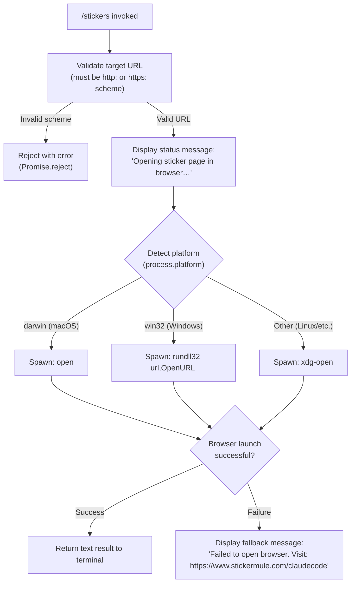

# `/stickers`

> Analysis basis: CC v2.1.160 bundle.js (AST extraction + Claude interpretation)
> Minimum version: v2.1.160

---

## Overview

The `/stickers` command opens the Claude Code sticker ordering page (`https://www.stickermule.com/claudecode`) in the user's default system browser. It is a simple side-effect command with no AI agent involvement — it resolves a URL, attempts a platform-aware browser launch, and returns a status message to the terminal. If the browser launch fails, a fallback message is displayed instructing the user to visit the URL manually.

---

## Registration

| Field | Value |
|---|---|
| type | `local` |
| name | `stickers` |
| description | `Order Claude Code stickers` |
| supportsNonInteractive | `false` |
| module_id | `Zt1` |
| load_inline | `true` |
| loc_byte | `12467616` |
| loc_byte_end | `12467776` |
| loc_line | `8767` |
| arbor_handler.name | `cEf` |
| arbor_handler.fqn | `claude-2.1.160::cEf` |
| arbor_handler.kind | `AsyncFunction` |
| arbor_handler.resolution_path | `module_id` |
| arbor_handler.n_hits | `0` |

Analysis basis: CC v2.1.160 bundle.js:+12467616

---

## Input Branching

The command has 3 distinct execution paths depending on platform and browser-launch outcome, so a Mermaid flowchart is used.



Analysis basis: CC v2.1.160 bundle.js:+12467349, +6749865, +6749915, +6749937, +6750224, +6750240, +6750324, +6750398, +6750405, +12467419, +12467490

---

## Behavioral Spec

### Top-level Handler (`cEf`)

The handler is an `AsyncFunction` resolved via `module_id` → `Zt1` → `cEf`.

```
async function handleStickersCommand():
    targetURL = "https://www.stickermule.com/claudecode"
    await openUrlInBrowser(targetURL)
```

Analysis basis: CC v2.1.160 bundle.js:+12467349, +12467352

---

### URL Validation and Browser Open (`openUrlInBrowser` ← `kK`)

This function validates the URL scheme before proceeding. Only `http:` and `https:` schemes are accepted; any other scheme causes the promise to be rejected immediately.

```
async function openUrlInBrowser(url):
    parsed = parseUrl(url)                  // validateUrlScheme (vL7)
    if parsed.protocol not in ["http:", "https:"]:
        return Promise.reject(new Error("invalid protocol"))

    exitCode = await launchBrowser(url)     // MY: get exit code (0 = success)
    if exitCode != 0:
        // non-zero exit from subprocess — fall through to platform open
        pass
    platform = process.platform
    if platform == "darwin":
        spawnCommand = ["open", url]
    else if platform == "win32":
        spawnCommand = ["rundll32", "url,OpenURL", url]
    else:
        spawnCommand = ["xdg-open", url]

    await spawnAndWait(spawnCommand)        // h8 → v_ pipeline
```

Analysis basis: CC v2.1.160 bundle.js:+12467349, +6749865, +6749915, +6749937, +6750152, +6750165, +6750190, +6750224, +6750240, +6750324, +6750336, +6750398, +6750405

---

### Terminal Output Pipeline (`v_` → `jEH`, `o44`, `SO`, `N`, `G8`, `yH`)

After the browser launch is attempted, the command writes output back to the interactive terminal session. The pipeline:

1. Renders the status text `"Opening sticker page in browser…"` as a `text`-type result (Analysis basis: CC v2.1.160 bundle.js:+12467406, +12467419).
2. On success, returns this message to the CLI renderer.
3. On failure (non-zero exit or spawn error), emits the fallback message `"Failed to open browser. Visit: https://www.stickermule.com/claudecode"` (Analysis basis: CC v2.1.160 bundle.js:+12467490).

```
function buildOutputMessage(launchSucceeded, url):
    if launchSucceeded:
        return { type: "text", content: "Opening sticker page in browser…" }
    else:
        return { type: "text", content: "Failed to open browser. Visit: " + url }
```

The output pipeline itself (`v_`) delegates to a process-runner (`jEH`) that:
- Sets up stdio handling with a 1,000,000-byte buffer limit (Analysis basis: CC v2.1.160 bundle.js:+1050635).
- Applies a concurrency limit of 10 simultaneous subprocesses (Analysis basis: CC v2.1.160 bundle.js:+1050113).
- On forced exit conditions, calls `process.exit` with the reason string `"forced shutdown"` (Analysis basis: CC v2.1.160 bundle.js:+15879880, +15879899).
- Uses an abort controller (`z.abort`) for cancellation (Analysis basis: CC v2.1.160 bundle.js:+15879920).

The error-logging sub-path (`yH`) writes to a debug log with level `"error"` on subprocess failure (Analysis basis: CC v2.1.160 bundle.js:+1051062, +971861).

---

### App State Access (`S6` → `sF6`, `Y_`)

Before rendering output, the handler reads current application state from an async local store (`aF6.getStore`), then queries the current working directory context via `Y_` → `zN`. This provides the execution context for the subprocess environment.

```
function getAppContext():
    store = asyncLocalStorage.getStore()   // sF6 → aF6.getStore
    if store is null:
        return defaultContext()            // Ki fallback
    workingDir = resolveWorkingDir(store)  // Y_ → zN
    return { store, workingDir }
```

Analysis basis: CC v2.1.160 bundle.js:+976326, +976347, +976377, +976396, +41481

---

### Debug Logging (`N`)

A lightweight debug logging call is made during command execution at level `"debug"`. It checks for known error properties (`errno`, `code`) on any caught error objects and formats them accordingly.

```
function logDebugInfo(data):
    if logLevel includes "debug":
        format = data.toUpperCase()        // normalize
        if data.trim() is non-empty:
            writeLog("debug", data)
```

Analysis basis: CC v2.1.160 bundle.js:+204223, +204247, +204265, +204287, +204349, +204372, +173844, +174262

---

## State & Side Effects

| Item | Detail |
|---|---|
| Telemetry | None detected in depth-2 traversal |
| Browser spawn | Spawns a platform-specific subprocess to open a URL: `open` (macOS), `rundll32 url,OpenURL` (Windows), `xdg-open` (Linux/other) |
| Output type | Returns a `text`-type result message to the terminal (Analysis basis: +12467406) |
| Subprocess buffer | 1,000,000-byte stdout/stderr buffer limit (Analysis basis: +1050635) |
| Concurrency limit | Maximum 10 concurrent subprocesses (Analysis basis: +1050113) |
| Forced exit | Calls `process.exit` with `"forced shutdown"` on unrecoverable subprocess state (Analysis basis: +15879880) |
| Abort control | Uses abort controller signal for subprocess cancellation (Analysis basis: +15879920) |
| appState changes | Reads async local store for execution context; no writes detected |
| Sound | None detected |
| Non-interactive | Not supported (`supportsNonInteractive: false`) |

---

## Version History

| Version | Change |
|---|---|
| v2.1.160 | Initial analysis |

---

## Common Mistakes

1. **Running in non-interactive mode**: `/stickers` has `supportsNonInteractive: false`. Invoking it in a non-interactive context (e.g., piped input or scripted CLI usage) will not produce the expected behavior and may silently fail.
2. **Expecting agent output**: This command does not invoke the Claude AI agent. It performs a direct browser-open side effect. Do not expect any AI-generated response.
3. **Firewall or sandboxed environments**: In environments where `open`, `xdg-open`, or `rundll32` is unavailable or blocked, the command will fall through to the fallback message. Users should note the displayed URL (`https://www.stickermule.com/claudecode`) and visit it manually.
4. **URL scheme assumptions**: The URL validation layer rejects any non-`http:`/`https:` scheme. If internal tooling attempts to override the target URL to a `file:` or custom scheme, the command will reject it (Analysis basis: CC v2.1.160 bundle.js:+6749865).

---

## Appendix — Identifier Mapping

> For bundle debugging only. Identifiers change across versions.

| Identifier | Role |
|---|---|
| `cEf` | Top-level async handler for `/stickers` command (Arbor-resolved entry point) |
| `kK` | URL validation and platform-aware browser open orchestrator |
| `vL7` | URL scheme validator (rejects non-http/https protocols, throws Error) |
| `MY` | Browser subprocess exit-code reader |
| `h8` | Output pipeline entry point (bridges browser launch to terminal output) |
| `v_` | Terminal output renderer / subprocess runner coordinator |
| `jEH` | Core process execution engine (manages stdio, buffers, abort signals) |
| `Y` | Forced-exit handler (calls `process.exit` with "forced shutdown") |
| `o44` | String coercion utility for subprocess output (wraps `String()`) |
| `SO` | Terminal session writer / output sink |
| `N` | Debug logger (formats and writes debug-level messages) |
| `G8` | Execution context accessor |
| `yH` | Error log writer for subprocess failures |
| `S6` | App state reader (bridges async local store to command context) |
| `sF6` | Async local store getter (wraps `aF6.getStore`) |
| `Y_` | Working directory resolver |

---

Note: index built via Arbor fallback; some signals (telemetry, literals) may be missing — see arbor-fallback.js.