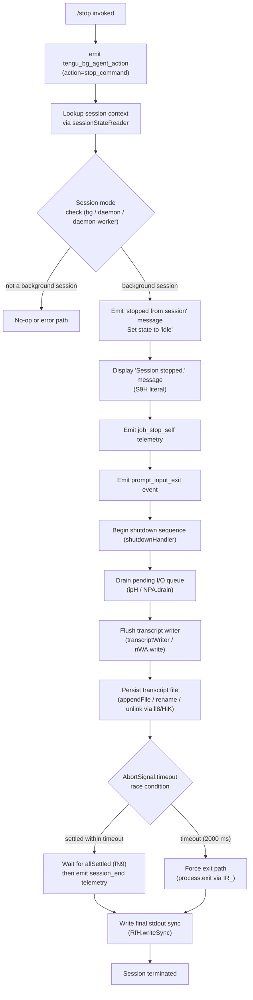

# `/stop`

> Analysis basis: CC v2.1.168 bundle.js (AST extraction + Claude interpretation)
> Minimum version: v2.1.168

---

## Overview

The `/stop` command terminates a running background session gracefully, transitioning it to an idle/stopped state while preserving the session transcript and any associated worktree on disk. It is a `local-jsx` command that executes immediately (`immediate: true`) and emits a `job_stop_self` telemetry action alongside a `prompt_input_exit` event before initiating the full session shutdown sequence.

---

## Registration

| Field | Value |
|---|---|
| type | `local-jsx` |
| name | `stop` |
| description | `Stop this background session; transcript and worktree are kept` |
| loc_byte | `13111723` |
| loc_byte_end | `13111907` |
| loc_line | `9713` |
| immediate | `true` |
| module_id | `_$K` |
| load_inline | `true` |
| arbor_handler.name | `ngf` |
| arbor_handler.fqn | `claude-2.1.168::ngf` |
| arbor_handler.kind | `AsyncFunction` |
| arbor_handler.resolution_path | `module_id` |
| arbor_handler.n_hits | `0` |

Analysis basis: CC v2.1.168 bundle.js:+13111723

---

## Input Branching

The command has more than three distinct execution paths across its handler and shutdown sub-routines.



---

## Behavioral Spec

### 1. Top-Level Handler (`ngf`)

The main handler is the `AsyncFunction` `ngf`, resolved via `module_id → _$K`.

```
async function stopCommandHandler(context):
    emit telemetry event "tengu_bg_agent_action" with payload { action: "stop_command" }
    // Analysis basis: CC v2.1.168 bundle.js:+13111456 and +13110858

    sessionInfo = lookupSessionState(context)
    // Analysis basis: CC v2.1.168 bundle.js:+13111442

    call renderStopUI(context, sessionInfo)
    // Analysis basis: CC v2.1.168 bundle.js:+13111452
```

Analysis basis: CC v2.1.168 bundle.js:+13111442

---

### 2. Session State Reader (`sessionStateReader`)

Called early in the handler to determine the running session's mode.

```
function sessionStateReader(sessionId):
    mode = lookupSessionMode(sessionId)
    // mode is one of: "bg", "daemon", "daemon-worker"
    // Analysis basis: CC v2.1.168 bundle.js literals +2256766, +2256776, +2256790

    entries = readTransientStateEntries(sessionId)
    // Sorts entries by "order" and "stateOrder" fields
    // Analysis basis: CC v2.1.168 bundle.js:+4167418, +4167439

    for each entry:
        if entry.state in ["done","success","failed","failure","stopped"]:
            mark entry as terminal
        // Analysis basis: CC v2.1.168 bundle.js literals +4174295..+4174357

    emit telemetry "tengu_bg_state_read_transient"
    // Analysis basis: CC v2.1.168 bundle.js:+4167839

    return { mode, entries }
```

Analysis basis: CC v2.1.168 bundle.js:+4167418

---

### 3. UI Renderer (`stopUIRenderer` / `Ou8`)

Responsible for rendering the stop UI and orchestrating the stop sequence.

```
async function stopUIRenderer(context, sessionInfo):
    // Render initial React/Ink component showing session context
    render component using inkRenderer (l) and componentFactory (J6)
    // Analysis basis: CC v2.1.168 bundle.js:+13110856, +13110908

    // Fetch session path info
    sessionPath = resolveSessionPath(context)
    // Analysis basis: CC v2.1.168 bundle.js:+13110927

    // Determine session label via lgf
    label = resolveSessionLabel(context)
    // Analysis basis: CC v2.1.168 bundle.js:+13110940

    // Check current job type via sessionJobTypeChecker (J9 → dYH)
    jobType = getJobType(sessionInfo)
    // Expects modes: "bg", "daemon", "daemon-worker"
    // Analysis basis: CC v2.1.168 bundle.js:+13110949

    // Read filesystem state for session
    fsState = readSessionFilesystemState(context)
    // Analysis basis: CC v2.1.168 bundle.js:+13110997

    // Query session result state
    resultState = querySessionResultState(fsState)
    // Calls GN → DjH internally
    // Analysis basis: CC v2.1.168 bundle.js:+13111010

    // Write stop marker to session state file
    writeStopMarker(sessionPath, "stopped from session")
    // Literal "stopped from session": CC v2.1.168 bundle.js:+13111056

    // Transition session to idle
    setSessionState("idle")
    // Literal "idle": CC v2.1.168 bundle.js:+13111085

    // Update filesystem state record
    updateFilesystemRecord(xH8, context)
    // Analysis basis: CC v2.1.168 bundle.js:+13111198

    // Display "Session stopped." message to user
    displayMessage("Session stopped.")
    // Literal: CC v2.1.168 bundle.js:+13111229

    emit telemetry "job_stop_self"
    // Literal: CC v2.1.168 bundle.js:+13111260

    // Emit prompt_input_exit to notify the input system
    emit event "prompt_input_exit"
    // Literal: CC v2.1.168 bundle.js:+13111282

    // Hand off to the full shutdown handler
    await fullShutdownHandler(context)
    // Analysis basis: CC v2.1.168 bundle.js:+13111277
```

Analysis basis: CC v2.1.168 bundle.js:+13110856

---

### 4. Filesystem State Writer (`transcriptPersistenceWriter` / `_iK`)

Handles transcript and session file persistence during shutdown.

```
async function transcriptPersistenceWriter(sessionPath, transcript):
    // Resolve output directory
    outputDir = path.dirname(sessionPath)
    // Analysis basis: CC v2.1.168 bundle.js:+206115

    // Acquire session lock (KI)
    await acquireSessionLock()
    // Analysis basis: CC v2.1.168 bundle.js:+206145

    // Compute write path (d6)
    writePath = computeWritePath(outputDir, sessionPath)
    // Analysis basis: CC v2.1.168 bundle.js:+206160

    // Calculate byte length of transcript content
    byteLen = Buffer.byteLength(transcript)
    // Analysis basis: CC v2.1.168 bundle.js:+206290

    // Run pending flush queue (npH)
    await flushPendingQueue()
    // clearTimeout, setTimeout, setImmediate orchestration
    // Analysis basis: CC v2.1.168 bundle.js:+206082

    // Build final output path ($0A → IHH.join, R6)
    finalPath = buildOutputPath(outputDir, sessionPath)
    // Analysis basis: CC v2.1.168 bundle.js:+206252

    // Rotate/rename transcript file (ll8)
    await rotatePreviousTranscript(writePath)
    // Checks .txt suffix (literal: CC v2.1.168 bundle.js:+205511)
    // Uses slice offset 4 (literal: CC v2.1.168 bundle.js:+205533)
    // Calls ny.stat, ny.rename, ny.unlink
    // Analysis basis: CC v2.1.168 bundle.js:+206284

    // Append transcript content atomically (HiK)
    await appendTranscriptFile(finalPath, transcript, byteLen)
    // ny.mkdir, ny.appendFile, B76, $0A, ll8, Buffer.byteLength, O0A
    // Analysis basis: CC v2.1.168 bundle.js:+206349

    // Register cleanup hooks (j9 → NPA.register)
    registerCleanupHook(finalPath)
    // Analysis basis: CC v2.1.168 bundle.js:+206445
```

Analysis basis: CC v2.1.168 bundle.js:+206082

---

### 5. Full Shutdown Handler (`fullShutdownHandler` / `A9`)

Orchestrates the full process shutdown after the stop action is confirmed.

```
async function fullShutdownHandler(context):
    // Render final summary output (oyH → RfH.writeSync, H.unmount, xC, cL8)
    renderFinalSummary(context)
    // Analysis basis: CC v2.1.168 bundle.js:+5456664

    // Write exit summary (vR_: wT, Cx, R6, AG6, s$)
    writeExitSummary(context)
    // Applies replaceAll for escape sequences ("\\\\" and "\\\"")
    // Analysis basis: CC v2.1.168 bundle.js:+5456670

    // Begin graceful exit sequencer (IR_)
    // clearTimeout, _L.get, process.exit, process.kill, SIGKILL
    // Analysis basis: CC v2.1.168 bundle.js:+5456676

    // Max timeout: 3500 ms for graceful window before hard kill
    // Literal 3500: CC v2.1.168 bundle.js:+5456700
    timeout = Math.max(3500, ...)

    // Unref the timer so it doesn't block the event loop
    JXH.unref()
    // Analysis basis: CC v2.1.168 bundle.js:+5456709

    // Drain I/O queue (ipH → NPA.drain)
    await drainIOQueue()
    // Analysis basis: CC v2.1.168 bundle.js:+5456789

    // Race between graceful shutdown and abort timeout
    result = await Promise.race([
        gracefulShutdownPromise,
        abortTimeoutPromise(2000)   // literal 2000: +5456878
    ])
    // Analysis basis: CC v2.1.168 bundle.js:+5456813

    // Supervisor/heartbeat orchestration (Y → $GH, UfK, T.stop/start)
    // "supervisor" literal: +16211621, "heartbeat" literal: +16210842
    orchestrateSupervisorShutdown()
    // Analysis basis: CC v2.1.168 bundle.js:+5456867

    // Wait for all pending operations (fN9 → Promise.allSettled, Array.from)
    await Promise.allSettled(pendingOperations)
    // Analysis basis: CC v2.1.168 bundle.js:+5456938

    // Emit "session_end" telemetry
    emit telemetry "session_end"
    // Literal: CC v2.1.168 bundle.js:+5457090

    // Emit "tengu_cache_eviction_hint" telemetry
    emit telemetry "tengu_cache_eviction_hint"
    // Analysis basis: CC v2.1.168 bundle.js:+5457052

    // Write final sync message to stdout
    RfH.writeSync(finalMessage)
    // Analysis basis: CC v2.1.168 bundle.js:+5457160

    // Startup profiling report if enabled (V0A → Af6 → qn8)
    if profilingEnabled:
        reportStartupProfiling()
        // "Startup profiling report:" literal: +216307
        emit telemetry "tengu_startup_perf"
        // Analysis basis: CC v2.1.168 bundle.js:+5457014
```

Analysis basis: CC v2.1.168 bundle.js:+5456596

---

### 6. Session Mode Validator (`sessionJobTypeChecker` / `J9` → `dYH`)

Validates that the current context is a background-eligible session before allowing the stop.

```
function sessionJobTypeChecker(context):
    mode = context.jobType
    // Expected values: "bg", "daemon", "daemon-worker"
    // Analysis basis: CC v2.1.168 bundle.js literals +2256766, +2256776, +2256790
    return mode
```

Analysis basis: CC v2.1.168 bundle.js:+13110949, +2256843

---

### 7. Atomic File State Writer (`atomicStateWriter` / `zf` → `XY`)

Atomically updates the session's on-disk state during the stop transition.

```
async function atomicStateWriter(statePath, newState):
    // Generate random suffix using lM_.randomBytes (hex encoding)
    // "hex" literal: CC v2.1.168 bundle.js:+2287921
    tmpPath = statePath + "." + randomBytes(8).toString("hex")

    // Write new state to temp file ("utf8" encoding)
    // "utf8" literal: CC v2.1.168 bundle.js:+2287968
    await c6H.writeFile(tmpPath, JSON.stringify(newState), "utf8")

    // Atomically rename tmp → final
    await c6H.rename(tmpPath, statePath)

    // Handle concurrent write conflicts using Q21 and d21 Sets
    if conflictDetected:
        await c6H.copyFile(...)
        await c6H.unlink(tmpPath)

    // Update in-memory cache entry (R7H.delete via oj)
    invalidateCacheEntry(statePath)
    // Analysis basis: CC v2.1.168 bundle.js:+4167350
```

Analysis basis: CC v2.1.168 bundle.js:+13111022, +4166966

---

## State & Side Effects

| Item | Detail |
|---|---|
| Telemetry: `tengu_bg_agent_action` | Fired at handler entry with `action: "stop_command"` (CC v2.1.168 bundle.js:+13110858) |
| Telemetry: `tengu_bg_state_read_transient` | Fired when reading background session transient state (CC v2.1.168 bundle.js:+4167839) |
| Telemetry: `job_stop_self` | Fired after session is moved to idle state (CC v2.1.168 bundle.js:+13111260) |
| Telemetry: `session_end` | Fired at the conclusion of the shutdown sequence (CC v2.1.168 bundle.js:+5457090) |
| Telemetry: `tengu_cache_eviction_hint` | Fired near end of shutdown (CC v2.1.168 bundle.js:+5457052) |
| Telemetry: `tengu_startup_perf` | Fired if startup profiling is active (CC v2.1.168 bundle.js:+217609) |
| Telemetry: `tengu_scroll_summary` | Fired during final summary render (CC v2.1.168 bundle.js:+5455982) |
| Telemetry: `tengu_daemon_config_reload` | Fired during supervisor reconfiguration (CC v2.1.168 bundle.js:+16212414) |
| Telemetry: `tengu_feature_ok` / `tengu_feature_sad` | Fired by o6/SH success/failure reporting wrappers (CC v2.1.168 bundle.js:+1010950, +1011093) |
| Telemetry: `tengu_pewter_brook` | Fired during UI/fullscreen environment detection (CC v2.1.168 bundle.js:+3446955) |
| Event: `prompt_input_exit` | Emitted to the input subsystem to signal the REPL should not accept new input (CC v2.1.168 bundle.js:+13111282) |
| Session state change | Session status transitioned from active to `"idle"` then to `"stopped"` (CC v2.1.168 bundle.js:+13111085, +13111056) |
| Disk: transcript preserved | Transcript file retained via append + atomic rename; `.txt` rotation applied (CC v2.1.168 bundle.js:+205511) |
| Disk: worktree preserved | Worktree directory is explicitly NOT deleted — matches the command description |
| In-memory cache | State cache entries for the session are invalidated (`R7H.delete`, `R7H.clear`) (CC v2.1.168 bundle.js:+4167643, +4168522) |
| Process exit | `process.exit` called if graceful shutdown exceeds 3500 ms; `process.kill(…, "SIGKILL")` is the last resort (CC v2.1.168 bundle.js:+5454813, +5454838, +5456700) |
| Timer cleanup | `clearTimeout` called at shutdown start; `JXH.unref()` used to prevent timer-hold on event loop (CC v2.1.168 bundle.js:+5456890, +5456709) |
| Hook registration | `NPA.register` called via `j9` to register a cleanup callback (CC v2.1.168 bundle.js:+60369) |
| Sound | <!-- TODO: not found in depth-2 traversal; needs --depth 4 --> |

---

## Version History

| Version | Change |
|---|---|
| v2.1.168 | Initial analysis |

---

## Common Mistakes

1. **Expecting the worktree to be deleted**: `/stop` explicitly keeps the worktree and transcript on disk. Use a separate cleanup command if removal is intended.
2. **Invoking `/stop` in a non-background session**: The command targets `bg`, `daemon`, and `daemon-worker` session modes. Invoking it in a standard foreground REPL session may produce no visible effect or an error.
3. **Assuming instant termination**: The shutdown sequence involves a 3500 ms graceful window before a hard `SIGKILL`. Scripts that poll for process exit immediately after `/stop` may observe the process still running for up to ~3.5 seconds.
4. **Confusing `/stop` with a pause**: Once stopped, the session state is set to `"idle"` and then `"stopped"`. There is no resume path from the `/stop` action; it is a terminal transition for the background session.
5. **Missing the `immediate: true` flag**: Because the registration sets `immediate: true`, the command executes without waiting for the agent turn queue. Code that wraps slash-command invocations and expects queuing behaviour will not observe the normal queuing delay.

---

## Appendix — Identifier Mapping

> For bundle debugging only. Identifiers change across versions.

| Identifier | Role |
|---|---|
| `ngf` | Main stop command handler (AsyncFunction, Arbor-resolved entry point) |
| `Ou8` | Stop UI renderer and session stop sequence orchestrator |
| `H` | Bootstrap/fetch utility (used for session context lookup and HTTP requests) |
| `v` | Session state formatting / log level utility |
| `snK` | Session state sub-handler (calls KI, M0A, IPA) |
| `IPA` | Inner state processor (calls edK, HcK) |
| `RH` | JSON serialization helper |
| `G4` | Path/label construction utility |
| `K0A` | Maps session entries (inK.map) |
| `EUH` | Transcript write dispatcher (calls nWA) |
| `nWA` | Transcript stream writer (H.write) |
| `_iK` | Transcript persistence writer (filesystem I/O orchestrator) |
| `npH` | Pending flush queue manager (clearTimeout/setTimeout/setImmediate) |
| `YKH` | Output path builder (r76, IHH.join, t8, R6) |
| `d6` | Write path resolver |
| `B76` | Error type checker (calls V8) |
| `$0A` | Final output path builder (IHH.join, R6) |
| `ll8` | Transcript file rotation handler (ny.stat, ny.rename, ny.unlink) |
| `HiK` | Atomic append writer (ny.mkdir, ny.appendFile) |
| `j9` | Cleanup hook registrar (NPA.register) |
| `mj_` | String split/trim/slice utility |
| `lHH` | Set membership checker (o74.has) |
| `uj` | String replacement helper |
| `H9` | Session parsing orchestrator (calls m6H, s9, FJ) |
| `m6H` | Session message builder (Q0, aqH, yA, qB) |
| `qB` | Message field processor (trim, map, startsWith, includes) |
| `s9` | Session text normalizer (toLowerCase, replace, h4H, CI, DdH, bT) |
| `Y2` | Model alias resolver (R4H) |
| `h4H` | Model family inclusion checker (y4H.includes) |
| `CI` | Provider matcher (lM, N5) |
| `DdH` | Provider fallback (N5) |
| `bT` | Provider selector (lM, N5, MA) |
| `lP1` | Alias wrapper for bT |
| `lM` | Provider mapping utility (MA) |
| `NH8` | Region/scope inclusion checker (AKL.includes) |
| `wdH` | Configuration override helper (_6) |
| `FJ` | Session field formatter (calls s9, _G) |
| `_G` | Composite field builder (GA, g6H, gYH, jdH, bT, z2, lM, MA, N5, CI) |
| `o6` | Feature flag reporter (l, J6; fires tengu_feature_ok/sad) |
| `SH` | Success feature reporter (l, J6) |
| `J6` | Ink component factory |
| `hm6` | Core render utility |
| `P6` | Session path resolver (hm6) |
| `R6` | Async utility / promise wrapper (tv) |
| `lgf` | Session label resolver |
| `J9` | Job type checker (dYH) |
| `dYH` | Job type enum accessor |
| `e9` | Filesystem session state reader (k2.stat, k2.readFile, R7H, OjH) |
| `h8` | Error code classifier (V8; handles ENOENT) |
| `V8` | Base error classifier (handles EISDIR, ENOENT) |
| `Tf` | Read error wrapper (V8) |
| `U6` | JSON parse wrapper |
| `VY` | Result state query wrapper (GN) |
| `GN` | State normalizer (DjH; maps done/success/failed/stopped) |
| `DjH` | State enum accessor |
| `zf` | Atomic state write dispatcher (XY, y2.join, RH, oj) |
| `XY` | Atomic file writer (randomBytes, writeFile, rename, copyFile, unlink) |
| `oj` | Cache invalidation helper (R7H.delete) |
| `xH8` | Session record updater |
| `S9H` | "Session stopped." message display helper |
| `A9` | Full shutdown handler (process.exit orchestrator) |
| `K` | Active session map iterator |
| `L` | Session lifecycle tracker (q.add/delete, f.finally) |
| `f` | Session connection object (A.close, q.close) |
| `oyH` | Final summary renderer (RfH.writeSync, H.unmount, xC, cL8) |
| `xC` | Output stream finisher |
| `cL8` | Terminal restore writer (Ea.writeSync, escape sequences ESC-7/ESC-8) |
| `vR_` | Exit summary writer (wT, Cx, R6, AG6, s$, replaceAll) |
| `wT` | Terminal width helper |
| `Cx` | Color/style context |
| `AG6` | Worktree path resolver (uR, SO, W_, ND.join, d6, q.statSync) |
| `s$` | Path display formatter (R6, r4) |
| `IR_` | Graceful exit sequencer (clearTimeout, _L.get, process.exit, process.kill/SIGKILL) |
| `ipH` | I/O drain helper (NPA.drain) |
| `Y` | Supervisor/heartbeat orchestrator ($GH, UfK, T.stop/start, E.stop/start) |
| `$GH` | Supervisor state machine (V9, V8, pfA, GH, x9, mfA, Object.keys) |
| `UfK` | Supervisor config mapper (Object.keys, Math.max, bD) |
| `T` | Heartbeat timer (ly6, Y46) |
| `TUK` | Heartbeat config builder (S8H) |
| `fN9` | Pending operations settler (Promise.allSettled, Array.from) |
| `Af6` | Startup profiler (qn8, V0A) |
| `qn8` | Profiling event emitter (y0A, l; tengu_startup_perf) |
| `V0A` | Profiling report writer (I0A, e76.dirname, d6, jOH, G0A, px, k0A, JSON.stringify) |
| `Fz8` | Scroll/summary renderer (wT, sV9, l, aV9, $1) |
| `aV9` | Metrics calculator (Date.now, Math.max, Math.round, Object.assign, rV9) |
| `$1` | Local-agent renderer ($1 → lHH, NW_, qa, v, VW_, l_, kIL, D6) |
| `gz8` | Shutdown race helper (Promise.all/resolve/race, QI, no, H, r8) |
| `r8` | Abort/timeout helper (K, Error, q, setTimeout, clearTimeout, L.unref) |
| `Y3` | Session context accessor |
| `Q0` | Message type constant |
| `aqH` | Message field extractor |

---

Note: index built via Arbor fallback; some signals (telemetry, literals) may be missing — see arbor-fallback.js.