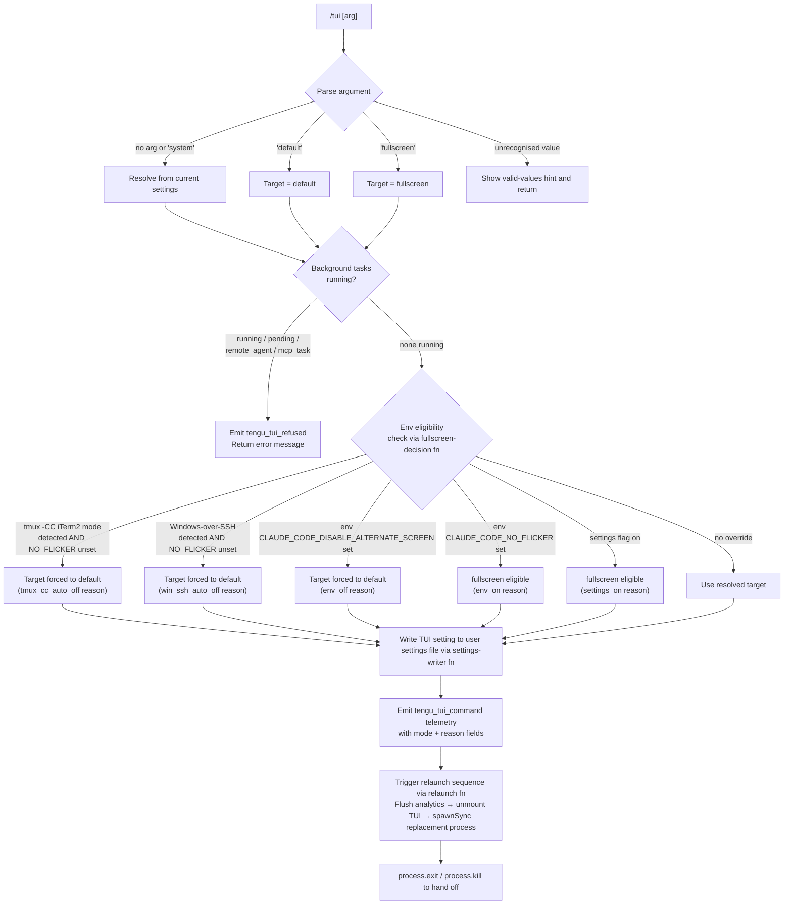

# `/tui`

> Analysis basis: CC v2.1.168 bundle.js (AST extraction + Claude interpretation)
> Minimum version: v2.1.168

---

## Overview

`/tui` switches the terminal UI renderer between `default` and `fullscreen` modes for the current Claude Code session. The command validates the requested mode against environmental constraints (tmux iTerm2 integration, Windows-over-SSH), checks whether background tasks are active before permitting a renderer swap, and, if all guards pass, applies the new renderer setting and triggers a process relaunch so the new TUI mode takes effect.

---

## Registration

| Field | Value |
|---|---|
| type | `local-jsx` |
| name | `tui` |
| description | `Set the terminal UI renderer (default \| fullscreen)` |
| argumentHint | `[default\|fullscreen]` |
| module_id | `t8K` |
| load_inline | `true` |
| loc_byte | `12419441` |
| loc_byte_end | `12419623` |
| loc_line | `8841` |
| arbor_handler.name | `eSf` |
| arbor_handler.fqn | `claude-2.1.168::eSf` |
| arbor_handler.kind | `AsyncFunction` |
| arbor_handler.resolution_path | `module_id` |
| arbor_handler.n_hits | `0` |

Analysis basis: CC v2.1.168 bundle.js:+12419441

---

## Input Branching

The command has more than three distinct decision paths (argument parsing → background-task guard → environment eligibility check → renderer selection and relaunch), so a Mermaid flowchart is used.



Analysis basis: CC v2.1.168 bundle.js:+12417339 – +12419157

---

## Behavioral Spec

### Argument parsing and valid-mode list

```
async function tuiCommandHandler(args, context):
    rawArg = args.trim()

    VALID_MODES = ["default", "fullscreen"]   // from i4A literal set

    if rawArg == "":
        targetMode = "system"   // derive from current settings
    elif rawArg in VALID_MODES:
        targetMode = rawArg
    else:
        return helpText("Valid values: " + VALID_MODES.join(", "))
```

Analysis basis: CC v2.1.168 bundle.js:+12417339, +12417451, +12417497

---

### Background-task guard

The handler inspects all active sessions and sub-agents. If any entry has status `"running"`, `"pending"`, `"remote_agent"`, or `"mcp_task"`, the switch is refused.

```
function backgroundTaskGuard(sessionMap):
    BLOCKING_STATES = ["running", "pending", "remote_agent", "mcp_task"]

    for each session in Object.values(sessionMap):
        if session.status in BLOCKING_STATES:
            emit telemetry("tengu_tui_refused")
            return Error(
                "Cannot switch renderers while background tasks are " +
                "running — wait for them to finish (or stop them via " +
                "/tasks), then run /tui again."
            )
    return OK
```

Analysis basis: CC v2.1.168 bundle.js:+12418006, +12418045, +12418067, +12418088, +12418113, +12418134, +12418175

The literal error message begins with "Cannot switch renderers…" (bundle.js:+12418175).

---

### Background-session informational note

Before performing the renderer switch, the handler unconditionally emits a user-visible notice that background sessions always use the `fullscreen` renderer (for correct scrolling and mouse support) and that the `tui` setting applies only to sessions started directly with `claude`.

Literal text fragment: `"Background sessions always use the fullscreen renderer…"` (bundle.js:+12417649).

Analysis basis: CC v2.1.168 bundle.js:+12417649

---

### Fullscreen-eligibility decision

This is resolved by the fullscreen-decision function (`wwH`) which evaluates a priority-ordered set of signals and returns both the resolved boolean and a reason string. Reason codes found in literals:

| Reason code | Meaning |
|---|---|
| `bg_forced_on` | Background-session override forces fullscreen |
| `env_off` | `CLAUDE_CODE_DISABLE_ALTERNATE_SCREEN` env var is set |
| `env_on` | `CLAUDE_CODE_NO_FLICKER` env var is set |
| `tmux_cc_auto_off` | tmux `-CC` (iTerm2 integration) auto-detected |
| `win_ssh_auto_off` | Windows over SSH (ConPTY) auto-detected |
| `settings_on` | User settings explicitly enable fullscreen |
| `settings_off` | User settings explicitly disable fullscreen |
| `downsell_on` | Fullscreen downsell flag active |
| `gb_on` / `gb_off` | Gradual-rollout gate open / closed |

```
function resolveFullscreenEligibility(envVars, platformInfo, settings):
    if envVars.CLAUDE_CODE_NO_FLICKER:
        return { fullscreen: true,  reason: "env_on" }
    if envVars.CLAUDE_CODE_DISABLE_ALTERNATE_SCREEN:
        return { fullscreen: false, reason: "env_off" }
    if isTmuxCCMode():
        return { fullscreen: false, reason: "tmux_cc_auto_off" }
    if isWindowsOverSSH():
        return { fullscreen: false, reason: "win_ssh_auto_off" }
    if settings.fullscreen == true:
        return { fullscreen: true,  reason: "settings_on" }
    if settings.fullscreen == false:
        return { fullscreen: false, reason: "settings_off" }
    // gradual-rollout / downsell checks …
    return { fullscreen: <gate result>, reason: "gb_on" | "gb_off" | "downsell_on" }
```

Analysis basis: CC v2.1.168 bundle.js:+12418346, +3447275 – +3447652

Environment variable names: `CLAUDE_CODE_NO_FLICKER` (bundle.js:+12415174), `CLAUDE_CODE_DISABLE_ALTERNATE_SCREEN` (bundle.js:+12415199), `CLAUDE_CODE_FORCE_FULLSCREEN_UPSELL` (bundle.js:+12415238).

---

### Settings persistence

After resolving the mode, the handler writes the new value (`"fullscreen"` or `"default"`) to the user settings file through the settings-writer subsystem (`o_` / `hl6` chain). The settings system resolves the target path under `~/.claude/settings.json`.

```
function persistTuiSetting(resolvedMode):
    // resolvedMode is "fullscreen" or "default"
    settingsPath = path.join(homedir(), ".claude", "settings.json")
    writeSetting(settingsPath, key="tui", value=resolvedMode)
```

Analysis basis: CC v2.1.168 bundle.js:+12418362, +1272659, +1272961

---

### Telemetry emission and relaunch

After persisting the setting, two telemetry events are fired and then the relaunch sequence is executed.

```
function emitAndRelaunch(mode, reason, context):
    emit("tengu_tui_command", { mode: mode, reason: reason,
                                 uptime: Math.round(process.uptime()) })

    // Relaunch sequence (relaunchFn / d0H):
    //   1. Flush analytics with timeout 30 000 ms ("flush timeout (relaunch)")
    //   2. Wait for analytics flush with 2 000 ms cleanup timeout
    //   3. Unmount TUI (oyH): write ANSI restore sequences, call H.unmount()
    //   4. Stop scroll-summary interval (_G6 / xR_ / clearInterval)
    //   5. Build argv for replacement process, pass --resume flag
    //   6. Register SIGINT / SIGHUP handlers; clear existing listeners
    //   7. i8K.spawnSync() replacement process with stdio: "inherit"
    //   8. Write relaunch_spawn_error to file via SJ if spawn fails
    //   9. process.exit() or process.kill() to terminate current process
```

Analysis basis: CC v2.1.168 bundle.js:+12418606, +12418697, +12418708, +12418928, +12419056, +12413100, +12413167, +12413229, +12413285, +12413640, +12413726, +12413975

Flush timeout: 30 000 ms (bundle.js:+12413167). Cleanup timeout: 2 000 ms (bundle.js:+12413224). Analytics flush timeout label: `"analytics flush timeout"` (bundle.js:+12413285). Relaunch error label: `"relaunch_spawn_error"` (bundle.js:+12413951).

---

### Terminal-capability detection (`nI`)

The command leverages a terminal-capability probe function during eligibility checks to detect whether the running terminal supports full alternate-screen rendering. Signals tested include:

- JetBrains IDE terminal detection (`l8H.isJetBrainsIdeTerminal`)
- Cursor / VS Code terminal detection (version bounds `1092000`–`1105000`, bundle.js:+3520187/+3520198)
- `xterm.js` detection (bundle.js:+3520231)
- Darwin / win32 platform checks (bundle.js:+3519595/+3519642)
- tmux / screen multiplexer string presence (bundle.js:+3437348/+3437421)

Analysis basis: CC v2.1.168 bundle.js:+12418473, +3519317 – +3520569

---

## State & Side Effects

| Item | Detail |
|---|---|
| Telemetry | `tengu_tui_refused` (emitted when background tasks block the switch, bundle.js:+12418134); `tengu_tui_command` (emitted on successful switch with mode + reason + uptime, bundle.js:+12418606) |
| Settings write | Writes `tui` key (`"fullscreen"` or `"default"`) to `~/.claude/settings.json` |
| Process relaunch | Triggers a full process replacement via `spawnSync` with `--resume` flag; current process exits after spawn |
| TUI unmount | ANSI cursor-save/restore sequences written to stdout; Ink component tree unmounted (`H.unmount`) before relaunch |
| Interval cleared | Scroll-summary interval stopped (`clearInterval`) prior to relaunch |
| Analytics flush | All pending analytics events flushed (up to 30 000 ms) before the process is replaced |
| Signal handlers | Existing `SIGINT`/`SIGHUP` listeners removed; new handlers registered for the relaunch window |
| Error file | On spawn failure, `relaunch_spawn_error` diagnostic written to disk via `SJ` (bundle.js:+12413948) |
| `appState` changes | No direct `appState` mutation found at depth-2; renderer mode is persisted in settings file |
| Sound | None found in traversal |

---

## Version History

| Version | Change |
|---|---|
| v2.1.168 | Initial analysis |

---

## Common Mistakes

1. **Running `/tui` while background tasks are active** — the command will refuse the switch and return the "Cannot switch renderers while background tasks are running" error. Stop or wait for all `/tasks` entries before re-issuing `/tui`.
2. **Expecting the mode change without a relaunch** — `/tui` always triggers a full process replacement; any unsaved in-memory conversation context that has not been flushed will be re-hydrated via `--resume`. Do not expect the mode to change in place.
3. **Overriding environment variables being ignored** — `CLAUDE_CODE_NO_FLICKER` takes precedence over the user setting; if the env var is set, `/tui default` will still resolve to the env-var-governed mode rather than the argument supplied.
4. **Confusing background-session behaviour** — background sessions (daemon workers) always use `fullscreen` regardless of the `tui` setting. The command only affects sessions started directly with `claude`.
5. **Supplying an unsupported mode string** — only `default` and `fullscreen` are valid arguments. Anything else displays a help hint and performs no action.

---

## Appendix — Identifier Mapping

> For bundle debugging only. Identifiers change across versions.

| Identifier | Role |
|---|---|
| `eSf` | Main handler for `/tui` command (AsyncFunction, arbor-resolved) |
| `QR6` | Caller of relaunch function from handler |
| `d0H` | Relaunch / process-replacement orchestrator |
| `iS` | Version-path resolver (locates installed claude binary versions) |
| `mV8` | Version directory scanner |
| `X3` | Array normalisation utility |
| `h5H` | Version path builder (`.local/share/claude/versions`) |
| `V1H` | Binary path builder (`bin` sub-directory) |
| `K08` | Home-directory path helper |
| `Ky` | Configuration accessor used during relaunch |
| `R6` | Wrapper around `tv` (runtime-value helper) |
| `tv` | Generic runtime-value accessor |
| `_G6` | Scroll-summary interval stopper |
| `xR_` | `clearInterval` wrapper |
| `oyH` | TUI unmount routine (writes ANSI sequences, calls `H.unmount`) |
| `cL8` | ANSI alternate-screen restore writer |
| `MIH` | Terminal-version coercer (Ghostty / iTerm2 version gating) |
| `QW` | tmux escape-sequence replacer |
| `Fz8` | Scroll-summary telemetry emitter |
| `aV9` | Scroll-summary metric calculator (Date.now / Math.round) |
| `$1` | Fullscreen-decision resolver (returns mode + reason) |
| `NW_` | Fullscreen reason-code helper |
| `qa` | Auxiliary fullscreen gate checker |
| `VW_` | Windows/platform renderer override checker |
| `l_` | Generic logging/UI helper |
| `kIL` | Fullscreen mode conditional wrapper |
| `D6` | React/Ink rendering dispatcher |
| `IL` | Timeout-with-race utility |
| `vE` | NPA (analytics) registration helper |
| `r4` | Analytics sub-registration |
| `j9` | `NPA.register` caller |
| `ipH` | `NPA.drain` caller (analytics flush) |
| `gz8` | Analytics flush-with-timeout orchestrator |
| `l4A` | Post-relaunch path builder |
| `W_` | `tv` wrapper (path context) |
| `$4` | `tv` wrapper (path context variant) |
| `l8K` | Native library loader (bun:ffi / execve) |
| `fb8` | Argument builder for replacement process argv |
| `vTH` | Argv entry formatter |
| `C6` | Config-watcher / settings-loader |
| `LwH` | Settings file reader with backup support |
| `Hu` | BOM / encoding prefix stripper |
| `No1` | Backup directory scanner |
| `tP_` | Backup path joiner |
| `hVL` | File-watch registration for settings |
| `b_` | Session app-state reader (working_directory / allowed_tools etc.) |
| `ty8` | Session state field extractor (L1 base) |
| `ey8` | Session state field extractor variant |
| `aB` | Bypass-permissions disabler |
| `t$` | App-state getter for effort/model/flags |
| `J9` | Daemon-worker type checker |
| `dYH` | Daemon-worker string constant holder |
| `wwH` | Fullscreen-decision function (returns {fullscreen, reason}) |
| `o_` | Settings-writer (persists key/value to settings.json) |
| `eO` | Settings path resolver |
| `NzH` | Settings directory path builder |
| `Nn6` | Managed-settings path resolver |
| `sV4` | Settings path cache |
| `qu` | `.claude` directory path builder |
| `aV4` | Local settings path builder |
| `kd` | Configuration object factory |
| `___` | Settings load orchestrator |
| `rpA` | Settings merge helper |
| `ipA` | Settings layer accumulator |
| `Id` | Settings cache getter/setter |
| `APA` | `_Q8.get` accessor |
| `ZW` | `structuredClone` wrapper |
| `t8_` | Settings parser and validator |
| `qPA` | `_Q8.set` accessor |
| `lpA` | Inline-SDK settings loader |
| `AC` | Settings schema validator |
| `nKH` | Settings normaliser (joins, coerces field types) |
| `oP` | File content reader with encoding detection |
| `Br` | File reader with line-ending normalisation |
| `g$` | `realpathSync` wrapper |
| `Uc6` | File-not-found handler |
| `Bc6` | Line-ending detector |
| `h8` | Version guard helper |
| `e6_` | Cache timestamp recorder |
| `IZH` | Settings-invalidation checker |
| `O$6` | Atomic file writer (rename + fsync) |
| `RH` | `JSON.stringify` wrapper |
| `LY` | Settings cache clear (Dp6 + _Q8) |
| `hl6` | Settings file write orchestrator |
| `u6` | Async context store accessor |
| `pc6` | `mc6.getStore` + fallback |
| `u6_` | Settings write lock helper |
| `yl6` | Git-ignore check runner |
| `C_` | Git sub-process runner |
| `GZ4` | Path normaliser (handles `~/` prefix) |
| `yuA` | Git-ignore result interpreter |
| `huA` | Settings append helper |
| `gU` | Settings load-from-disk entry point |
| `aE` | Performance mark starter |
| `b9` | Memory-usage sampler |
| `px` | `perf_hooks` dynamic requirer |
| `A__` | Full settings-load pipeline |
| `C8` | Settings load logger (appendFileSync) |
| `H36` | Watched-path set updater |
| `wp6` | Settings load post-processor |
| `nI` | Terminal-capability detector |
| `gJ6` | Terminal-info accessor |
| `nY` | Terminal-name normaliser |
| `G0_` | Alternate-screen support tester |
| `dSL` | Alternate-screen probe details |
| `bz` | Terminal-name comparison helper |
| `cSL` | Terminal-version parser (parseFloat / Math.min) |
| `T0_` | Version threshold constants holder |
| `yu` | React/Ink app renderer |
| `kC` | Ink `render` function wrapper |
| `AZL` | Ink instance creator |
| `_6` | String coercion utility |
| `aL` | `MA` (Ink component) wrapper |
| `D3` | Ink render options builder |
| `_$6` | Display-row calculator |
| `dRA` | Row-count accessor |
| `X9` | Node-version / platform capability checker |
| `Df9` | Node-version gate |
| `sIH` | Colour-support resolver |
| `cC` | Colour-support constants |
| `LP6` | `/proc/version` reader (Linux colour hint) |
| `b7H` | Terminal-colour inclusion checker |
| `$q` | Row-count fallback reader |
| `ILH` | `_6` (string coercion) alias used in X9 context |
| `SJ` | Spawn-error file writer (`GUH.writeFileSync`) |
| `vTH` | Argv token formatter |
| `hH` | Error logger / reporter |
| `v` | HTTP fetch wrapper (bootstrap) |
| `mj_` | HTTP header parser |
| `lHH` | MIME-type checker |
| `uj` | URL replacer |
| `H9` | Response handler |
| `o6` | Logging helpers (l / J6) |
| `J6` | Log-entry emitter |
| `CH` | Warning log helper |
| `SH` | Info log helper |
| `DLK` | Daemon roster entry recorder |
| `Q` | Background-process lifecycle manager |
| `pwA` | Background-process socket connector |
| `dwA` | Background-process full lifecycle runner |
| `D` | Forced-shutdown handler |
| `M` | MCP server connection manager |
| `xbH` | MCP server connector |
| `PF8` | MCP connection result applier |
| `cDA` | MCP configuration reconciler |
| `z` | Daemon stop orchestrator |
| `uh` | Daemon stop signal emitter |
| `sp` | Daemon shutdown race |
| `GH` | String coercion wrapper |
| `lx8` | Background memory check |
| `eX6` | Background session file reader |
| `w` | Background session spawner/manager |
| `V8` | Error-type classifier |
| `B` | Disposable resource holder |
| `L` | Promise-tracking set wrapper |

---

*Note: index built via Arbor fallback; some signals (telemetry, literals) may be missing — see arbor-fallback.js.*