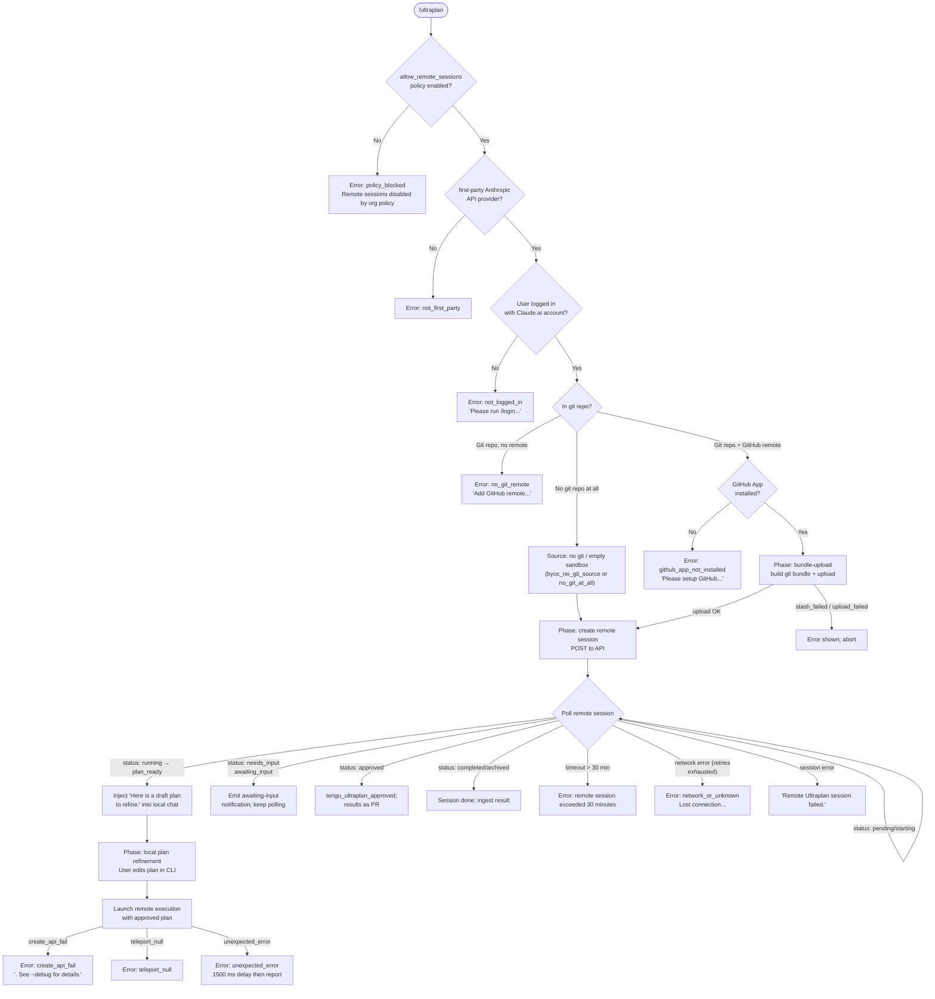

# `/ultraplan`

> Analysis basis: CC v2.1.168 bundle.js (AST extraction + Claude interpretation)
> Minimum version: v2.1.168

---

## Overview

`/ultraplan` launches a remote Claude Code web session that drafts an editable plan for a given task, then streams the result back to the local CLI. The command orchestrates a multi-phase "teleport" pipeline: eligibility checks → environment selection → git bundle upload → remote session creation → polling loop → local plan ingestion. When the remote agent signals `plan_ready`, the draft plan is injected into the local conversation as an editable message prefixed with "Here is a draft plan to refine:".

---

## Registration

| Field | Value |
|---|---|
| type | `local-jsx` |
| name | `ultraplan` |
| description | `Draft an editable plan in Claude Code on the web ( ... ) · See  ...` |
| argumentHint | `<prompt>` |
| load_inline | `true` |
| load_ident | `eyf` |
| loc_byte | `12248501` |
| loc_byte_end | `12248733` |
| loc_line | `8620` |
| arbor_handler.name | `eyf` |
| arbor_handler.kind | `AsyncFunction` |
| arbor_handler.fqn | `claude-2.1.168::eyf` |
| arbor_handler.resolution_path | `load_ident` |
| arbor_handler.n_hits | `1` |

Analysis basis: CC v2.1.168 bundle.js:+12248501

---

## Input Branching

The command has more than three distinct branches (guard checks, precondition failures, environment selection, bundle-upload mode variants, polling states, and plan-ready vs. error outcomes). A flowchart is used.



---

## Behavioral Spec

### 1. Handler Entry Point (`ultraplanHandler`)

Analysis basis: CC v2.1.168 bundle.js:+12246641

```
async function ultraplanHandler(commandInput, appContext):
    # Check allow_remote_sessions policy (literal "allow_remote_sessions")
    if NOT appContext.getAppState().allow_remote_sessions:
        return earlyExit(reason="policy_blocked")

    # Inspect "system" field and current session type
    sessionType = resolveSessionType(appContext)   # calls nv8/lv8/vs_

    # Orphan-cleanup: archive any stale ultraplan session from prior run
    try:
        archiveOrphanedSession(appContext)
    except:
        log.warn("ultraplan: failed to archive orphaned session")

    # Determine trigger source: "slash" (explicit /ultraplan) or embedded keyword
    triggerSource = detectTriggerSource(commandInput)  # "slash" literal at +12246787

    # Dispatch to main launch flow
    result = await launchUltraplan(commandInput.prompt, appContext, triggerSource)

    # Reflect final state back to appContext
    appContext.setAppState(result)
```

### 2. Pre-flight Eligibility Check (`remoteEligibilityCheck`)

Analysis basis: CC v2.1.168 bundle.js:+9143178

```
async function remoteEligibilityCheck(appContext):
    emit telemetry("bg_remote_eligibility_check")

    # Must be first-party Anthropic provider; BYOC path differs
    if provider == "byoc":
        # BYOC path: separate preflight applies
        pass
    if NOT isFirstParty(appContext):
        return failure("not_first_party",
            "Remote sessions are only available on the first-party Anthropic API provider.")

    # Must be logged in with claude.ai account (not API key)
    if NOT hasClaudeAiLogin(appContext):
        return failure("not_logged_in",
            "Please run /login and sign in with your Claude.ai account (not Console).")

    # Must be in a git repository
    if NOT inGitRepo():
        return failure("not_in_git_repo")

    # Must have a GitHub remote
    if NOT hasGitHubRemote():
        return failure("no_git_remote",
            "Background tasks require a GitHub remote. Add one with `git remote add origin REPO_URL`.")

    # GitHub App must be installed
    if NOT checkGithubAppInstalled(appContext):
        return failure("github_app_not_installed")

    return success()
```

### 3. Session Input Detection (`commandPrefixParser` / `nv8`)

Analysis basis: CC v2.1.168 bundle.js:+9951521, +9951749, +9951820

```
function parseUltraplanInput(rawInput):
    # Strip leading "ultraplan" keyword (literal "ultraplan") if present
    # Uses H.startsWith check (vs_ → +9950771) and regex matchAll with "gi" flag (+9951169)
    # Replaces matched prefix with "$1$2" substitution (+9951846)
    # Trims to at most 5 words for branch label generation (+9951869)
    strippedPrompt = rawInput.replace(ultraplanPrefixPattern, "$1$2")
    return strippedPrompt.slice(relevantRange)   # nv8 → H.slice at +9951749
```

### 4. Environment Selection (`teleportEnvironmentSelect` / `Tt` + `Q86`)

Analysis basis: CC v2.1.168 bundle.js:+9018475, +9019395

```
async function selectOrCreateEnvironment(appContext):
    emit "[teleport] phase: env-select"  # literal +9072813
    emit telemetry("teleport_environments_list")

    envList = await fetchEnvironmentList(appContext, timeout=15000)  # 15000 ms +9019113

    defaultEnv = envList.find(e => e.name == "Default")

    if defaultEnv is None:
        # Auto-create default cloud env
        newEnv = await createDefaultCloudEnvironment(appContext)  # Q86 path
        if newEnv fails:
            log.warn("Could not create a cloud environment. Set one up at https://claude.ai/code/onboarding?magic=env-setup")
            return failure("env_create")
        log.info("[teleportToRemote] Auto-created default cloud env")
        return newEnv

    if envList is empty after filter:
        return failure("no_environments", "No environments available for session creation")

    return defaultEnv
```

### 5. Git Bundle Upload (`teleportBundleUpload` / `Li_`)

Analysis basis: CC v2.1.168 bundle.js:+9054498

```
async function uploadGitBundle(appContext):
    emit telemetry("teleport_git_bundle_upload")
    emit "[teleport] phase: bundle-upload"

    if NOT inGitRepo():
        return failure("empty_repo", "Not in a git repository")

    # Attempt to stash uncommitted changes under refs/seed/stash or refs/seed/root
    stashResult = git("stash", "create")
    if stashResult.status != 200:
        return failure("stash_failed")

    # Check for any commits
    revParseResult = git("rev-parse", "--verify", "HEAD")
    if fails:
        return failure("empty_repo", "Repository has no commits yet")

    # Bundle strategy selection:
    #   head           → current HEAD
    #   fallback_head  → HEAD with fallback
    #   squashed       → squashed history
    #   fallback_squashed → squashed with fallback
    bundleFile = createBundle(strategy)  # named "ccr-seed{uuid}.bundle"

    uploadResult = uploadBundleToAPI(bundleFile, sessionId)
    if uploadResult == "failed":
        emit telemetry("teleport_source_decision", outcome="upload_failed")
        return failure("upload_failed")

    emit telemetry("teleport_source_decision", outcome=bundleStrategy)
    cleanup(bundleFile)
    return success(bundleRef)
```

### 6. Remote Session Creation (`teleportSessionCreate` / `pn`)

Analysis basis: CC v2.1.168 bundle.js:+9070978, +9072070

```
async function createRemoteSession(prompt, envId, bundleRef, appContext):
    emit "[teleport] phase: POST-sent"  # +9077800

    # Build request body including:
    #   - permission mode control event (set_permission_mode / user)
    #   - prompt text
    #   - bundle reference or seed bundle
    #   - org UUID header ("x-organization-uuid")
    #   - anthropic-beta: "ccr-byoc-2025-07-29"  # +9070801

    response = await qA.post(sessionCreationEndpoint, body, headers)

    if response.status == 401 or 403:
        return failure("github_repo_access_denied")
    if response.status == 429 or >= 500:
        return failure("create_request_failed")
    if response.status != 201:
        return failure("create_request_failed")

    sessionId = response.data.id
    if NOT sessionId:
        return failure("malformed_response",
            "Server returned a malformed session response (no session id)")

    return sessionId
```

### 7. Remote Session Polling (`remoteSessionPoller` / `wHK`)

Analysis basis: CC v2.1.168 bundle.js:+12230373, +12231693

```
async function pollRemoteSession(sessionId, appContext):
    startTime = Date.now()
    timeout = 1800000  # 30 minutes in ms (+9151704)
    pollInterval = 1000  # ms (+9151697)
    timeoutPendingThreshold = 60000  # 1 minute (+12231693)

    loop:
        if caller requested stop:
            raise "poll stopped by caller"

        elapsed = Date.now() - startTime
        if elapsed > timeout:
            emit telemetry("tengu_ultraplan_failed")
            return failure("remote session exceeded 30 minutes")

        status = await fetchSessionStatus(sessionId)

        switch status:
            case "pending" | "starting":
                if elapsed > timeoutPendingThreshold:
                    emit timeout_pending
                sleep(pollInterval)
                continue

            case "running":
                sleep(pollInterval)
                continue

            case "plan_ready":
                emit telemetry("tengu_ultraplan_plan_ready")
                planText = extractPlanFromSession(sessionId)
                return success(plan=planText, status="plan_ready")

            case "needs_input":
                emit telemetry("tengu_ultraplan_awaiting_input")
                sleep(pollInterval)
                continue

            case "approved":
                emit telemetry("tengu_ultraplan_approved")
                return success(status="approved",
                    message="Results will land as a pull request when the remote session finishes.")

            case "completed" | "archived":
                ingestResult = extractMarkerContent(sessionId)
                return success(status="completed", result=ingestResult)

            case "error":
                emit telemetry("tengu_ultraplan_failed")
                return failure("remote session returned an error")

        on network error (retry exhausted):
            return failure("network_or_unknown",
                "Lost connection to the remote session after repeated retries — the session may still be running")
```

### 8. Plan Injection and Local Refinement (`ultraplanLocalRefinement` / `iyf`)

Analysis basis: CC v2.1.168 bundle.js:+12239847, +12239854

```
function buildLocalRefinementMessage(planText):
    # Prefixes with the literal "Here is a draft plan to refine:" (+12239854)
    parts = []
    parts.push("Here is a draft plan to refine:")
    parts.push(formatPlan(planText))   # nyf → dyf processing
    return parts.join("\n")

function injectPlanIntoConversation(planMessage, appContext):
    # Injects as a user-editable message in the local Claude Code session
    # Labeled "Refine local plan" in UI (literal +12245052)
    # Tagged with kind="plan" (+12245087)
    appContext.conversation.addEditableMessage(planMessage)
```

### 9. Remote Execution Dispatch (`ultraplanRemoteDispatch` / `tyf` + `xR6`)

Analysis basis: CC v2.1.168 bundle.js:+12244293, +12244407

```
async function ultraplanRemoteDispatch(refinedPlan, appContext):
    # Guard: already_polling or already_launching prevents duplicate launches
    if sessionState == "already_polling":
        return earlyExit("already_polling")
    if sessionState == "already_launching":
        return exitWithMessage("ultraplan: already launching. Please wait for the session to start.")
        # literal at +12242744

    # Usage guard: prompt must be non-empty
    if NOT refinedPlan:
        return exitWithMessage("Usage: /ultraplan \\<prompt\\>, or include \"ultraplan\" anywhere in your prompt")
        # literals at +12244204, +12244270

    # Acquire launch lock via pendingSet (L → q.add/q.delete)
    acquireLaunchLock(sessionId)

    try:
        # Re-run eligibility (X9) before actual launch
        eligibility = await remoteEligibilityCheck(appContext)
        if NOT eligibility.ok:
            return failure(eligibility.reason)

        # Create remote session
        remoteSession = await createRemoteSession(refinedPlan, envId, bundleRef, appContext)
        if remoteSession is None:
            emit telemetry("tengu_ultraplan_create_failed")
            return failure("create_api_fail", ". See --debug for details.")

        emit telemetry("tengu_ultraplan_launched")

        # Begin polling
        pollResult = await pollRemoteSession(remoteSession.id, appContext)
        return pollResult

    except unexpected:
        emit telemetry("tengu_ultraplan_failed")
        delay(1500)   # +12245948
        emit telemetry("unexpected_error")
        return failure("Ultraplan hit an unexpected error during launch. Wait for the user's next instructions.")

    finally:
        releaseLaunchLock(sessionId)
```

### 10. Branch / Title Generation (`teleportBranchDetect` / `cr7`)

Analysis basis: CC v2.1.168 bundle.js:+9057869, +9057944

```
async function generateBranchAndTitle(promptText, appContext):
    emit "[teleport] phase: branch-detect"

    # Branch name capped at 75 characters (+9057874)
    # Template: "claude/task/{description}" (+9057880)
    # "{description}" placeholder replaced with sanitized prompt (+9057916)
    rawBranch = "claude/task/" + sanitize(promptText)
    branch = rawBranch.slice(0, 75)

    # Generate structured title via API call using json_schema tool
    # Schema fields: "title", "branch" (+9058104, +9058112)
    title = await callTitleGenerationAPI(promptText, schema={title: string, branch: string})
    emit telemetry("teleport_generate_title")

    return {branch, title}
```

### 11. Remote Session Lifecycle Monitor (`remoteWorkflowMonitor` / `CDq`)

Analysis basis: CC v2.1.168 bundle.js:+9151843, +9152258

```
async function monitorRemoteWorkflow(sessionId, appContext):
    # Lifecycle states tracked:
    #   pending → starting → running → plan_ready / needs_input / approved
    #   completed / archived / error / idle

    # hook events processed:
    #   hook_progress (+9152894)
    #   hook_response (+9152923)
    #   hook_started  (+9153414)
    #   SessionStart  (+9153504)
    #   remote-workflow (+9152357)

    # result extraction looks for "result" marker (+9152711)
    # uses b.lastIndexOf / b.slice for marker-bounded extraction (+9152958, +9153034)

    # Timeout: session max = 1800000 ms (30 min) (+9151704)
    # Poll tick: 1000 ms (+9151697)

    # On "requires_action": delegate to hook handler
    # On "plan_ready": surface plan to local session
    # On "needs_input": emit tengu_ultraplan_awaiting_input
    # If no review output: "no review output — orchestrator may have exited early" (+9154383)
```

---

## State & Side Effects

| Item | Detail |
|---|---|
| Telemetry: `tengu_ultraplan_create_failed` | Fired when the remote session POST fails (bundle.js:+12243917) |
| Telemetry: `tengu_ultraplan_prompt_identifier` | Fired at prompt-identifier resolution time (bundle.js:+12239680) |
| Telemetry: `tengu_ultraplan_launched` | Fired immediately after successful session creation (bundle.js:+12245599) |
| Telemetry: `tengu_ultraplan_timeout_seconds` | Fired when polling timeout threshold is reached (bundle.js:+12239513) |
| Telemetry: `tengu_ultraplan_awaiting_input` | Fired when remote session enters `needs_input` state (bundle.js:+12240157) |
| Telemetry: `tengu_ultraplan_plan_ready` | Fired when `plan_ready` status received (bundle.js:+12240225) |
| Telemetry: `tengu_ultraplan_approved` | Fired when user-approved plan triggers remote execution (bundle.js:+12240633) |
| Telemetry: `tengu_ultraplan_failed` | Fired on any terminal failure path (bundle.js:+12241510) |
| Telemetry: `tengu_ccr_bundle_seed_enabled` | Fired when seed-bundle mode is active (bundle.js:+9143651) |
| Telemetry: `tengu_ccr_bundle_upload` | Fired during git bundle upload phase (bundle.js:+9054820) |
| Telemetry: `tengu_teleport_bundle_mode` | Records which bundle strategy was chosen (bundle.js:+9071205) |
| Telemetry: `tengu_ccr_session_link` | Records session URL/link (bundle.js:+9064753) |
| Telemetry: `tengu_teleport_source_decision` | Records the final source strategy chosen (bundle.js:+9076662) |
| Telemetry: `tengu_config_parse_error` | Fired when config file parse fails (bundle.js:+3268167) |
| Telemetry: `tengu_bg_dispatch_sigkill_escalate` | Fired when background session requires SIGKILL escalation (bundle.js:+16197002) |
| Telemetry: `tengu_bg_low_mem_mb` | Fired when memory is below threshold (bundle.js:+13052200) |
| Telemetry: `tengu_bg_dispatch_low_mem` | Fired when dispatch is blocked by low memory (bundle.js:+16197603) |
| Telemetry: `tengu_bg_spare_enable` | Fired when spare worker pool is enabled (bundle.js:+16198307) |
| Telemetry: `tengu_bg_spare_claim` | Fired when a spare worker is claimed (bundle.js:+16198435) |
| Telemetry: `tengu_bg_spare_claim_fail` | Fired when spare worker claim fails (bundle.js:+16198701) |
| Telemetry: `tengu_bg_sendclaim_failed` | Fired when send-claim to daemon fails (bundle.js:+16176740) |
| Telemetry: `tengu_bg_adopt_sock_unlinked` | Fired when socket file is unlinked during adoption (bundle.js:+13527482) |
| Telemetry: `tengu_feature_ok` / `tengu_feature_bad` | Fired by feature-flag checks during dispatch (bundle.js:+1010950, +1011012) |
| appState read | `_.getAppState()` called at bundle.js:+12246976 to read `allow_remote_sessions`, session state |
| appState write | `_.setAppState()` called at bundle.js:+12247198 to persist launch/polling state |
| Launch lock | Pending-set (`q.add` / `q.delete`) guards against concurrent launches; `already_launching` state emitted as JSX notification |
| File system | Git bundle files (`ccr-seed*.bundle`, `_source_seed.bundle`) created under temp dir and cleaned up via `o86.unlink` / `wL.unlink` / `sv6` |
| File system | Config accessed via `q.readFileSync` / `LwH`; config parse errors emit `tengu_config_parse_error` |
| Network | Outbound `qA.post` to Anthropic API for session creation; `qA.get` for environment listing and status polling |
| API version header | `anthropic-beta: ccr-byoc-2025-07-29` (+9070801); `anthropic-version: 2023-06-01` (+3207786) |
| Hook registration | `j9` → `NPA.register` at bundle.js:+60369; `hVL` installs file-watch hooks (`_K8.watchFile` / `_K8.unwatchFile`) |
| Sound | <!-- TODO: not found in depth-2 traversal; needs --depth 4 --> |
| Remote session timeout | Hard cap: 1800000 ms (30 minutes) (bundle.js:+9151704) |
| Pending-input timeout | 60000 ms before `timeout_pending` is emitted (bundle.js:+12231693) |
| Polling interval | 1000 ms (bundle.js:+9151697) |
| Branch name max length | 75 characters (bundle.js:+9057874) |
| String padding width | 40 characters (bundle.js:+16223773) |
| "Ultraplan" UI label | Literal `"Ultraplan"` used in JSX component title (bundle.js:+12245763) |
| Notification kind | `"task-notification"` for background task events (bundle.js:+12244909) |
| Precondition kind | `"precondition"` for eligibility failure messages (bundle.js:+12244732) |

---

## Version History

| Version | Change |
|---|---|
| v2.1.168 | Initial analysis |

---

## Common Mistakes

1. **Invoking `/ultraplan` without a Claude.ai login**: API-key-only authentication is insufficient. The command explicitly checks for a first-party account session and returns `not_logged_in` with instructions to run `/login`.
2. **No GitHub remote configured**: The teleport pipeline requires a GitHub remote (`remote.origin.url`) to push the git bundle. A local-only repo will fail at the `no_git_remote` gate. Add one with `git remote add origin <REPO_URL>`.
3. **GitHub App not installed**: Even with a GitHub remote, the GitHub App must be installed on the repository's organization/account. The check (`checkGithubAppInstalled`) short-circuits with `github_app_not_installed` if the app is absent.
4. **Repository has no commits**: The bundle upload phase verifies `git rev-parse --verify HEAD`. A brand-new repo with no commits triggers `"Repository has no commits — run git add . && git commit -m \"initial\" then retry"`.
5. **Invoking while a session is already launching**: The `already_launching` guard prevents concurrent `/ultraplan` dispatches. The user sees `"ultraplan: already launching. Please wait for the session to start."` and must wait for the prior session to resolve.
6. **Organization policy blocking remote sessions**: If `allow_remote_sessions` is `false` in the org policy, the command exits immediately with `policy_blocked`. Only an organization admin can enable remote sessions.
7. **Expecting immediate results**: The remote session can take up to 30 minutes. The polling loop runs at 1-second intervals; users should not interrupt the CLI process while waiting for `plan_ready`.

---

## Appendix — Identifier Mapping

> For bundle debugging only. Identifiers change across versions.

| Identifier | Role |
|---|---|
| `eyf` | Main `ultraplanHandler` async entry point (handler resolved via `load_ident`) |
| `nv8` | Input prefix parser — strips "ultraplan" keyword from raw prompt |
| `lv8` | Helper called by input parser for prefix normalization |
| `vs_` | Low-level string scanner used in prefix detection (startsWith / matchAll) |
| `xR6` | Remote dispatch coordinator — orchestrates eligibility → session create → polling |
| `tyf` | Full teleport execution pipeline (plan refinement → remote launch → result ingestion) |
| `mC8` | Launch-lock acquire wrapper |
| `uC8` | Inner lock-state manager |
| `D6` | Pending-set / lock state machine |
| `cyf` | Orphaned-session cleanup function |
| `e2H` | Eligibility check dispatcher |
| `yDq` | Remote eligibility check implementation (`bg_remote_eligibility_check`) |
| `pn` | `teleportToRemote` — full teleport flow (env-select → bundle → POST → poll) |
| `u6` | Access-token resolver |
| `aL` | Organization UUID resolver |
| `B3` | OAuth URL builder |
| `zi_` | API environment base-URL resolver |
| `hH` | Auth-token fetch with error logging |
| `Yu` | Org UUID fetcher |
| `F1` | OAuth endpoint validator |
| `gj` | HTTP client builder (sets `anthropic-version` header) |
| `Li_` | Git bundle upload implementation (`teleport_git_bundle_upload`) |
| `R6` | Telemetry emitter wrapper |
| `v` | Log-level formatter / structured logger |
| `J6` | Low-level logger sink |
| `tR` | Git remote URL extractor (`remote.origin.url` via `git config --get`) |
| `rYq` | Session control-request builder (`set_permission_mode`) |
| `bv6` | Bundle source type classifier |
| `RH` | JSON serializer wrapper |
| `iYq` | Session link emitter (`tengu_ccr_session_link`) |
| `NZ8` | Notification display helper |
| `Tt` | Environment list fetcher (`teleport_environments_list`) |
| `Q86` | Default cloud environment creator (`teleport_default_environment_create`) |
| `GH` | String coercer |
| `$` | Message/content array helper |
| `cr7` | Branch name and title generator (`teleportBranchDetect`) |
| `ph` | GitHub App installation checker |
| `qCH` | GitHub App installation API check (`checkGithubAppInstalled`) |
| `jI` | Default branch resolver (`symbolic-ref --short refs/remotes/origin/HEAD`) |
| `H9` | File-system metadata helper |
| `q6H` | Git remote URL parser / classifier |
| `a` | MCP update / connection state handler |
| `AA` | Error-string extractor |
| `vz` | Axios cancel-token detector |
| `rO` | Generic error reporter |
| `OD` | Claude.ai base URL resolver |
| `y_` | ES-module bootstrap / init helper |
| `xI_` | Environment URL selector (local / staging / prod) |
| `ayf` | Post-launch state updater |
| `JCH` | Remote session lifecycle monitor entry (`remoteWorkflowMonitor`) |
| `Fk` | Random token / ID generator |
| `R86` | Browser/native open helper (`xe.open`) |
| `a2` | Session pending-state initializer |
| `Vo7` | Session status string formatter |
| `CDq` | Inner remote workflow event processor (hook_progress / hook_response / plan_ready) |
| `jv` | Task-event dispatcher (task_started / task_updated) |
| `X1f` | task_started event emitter |
| `j1f` | task_updated event emitter |
| `Gs_` | Task state store updater |
| `P1f` | Local-workflow task start handler |
| `W1f` | Local-workflow task update handler |
| `f9H` | Task status classifier (active / aborted / user_typed) |
| `ryf` | Remote session poller (`pollRemoteSession` / `wHK` dispatch) |
| `wHK` | Polling loop with retry/backoff (`network_or_unknown`, `extract_marker_missing`) |
| `Qyf` | Poller state-machine entry |
| `syf` | Poll result handler |
| `sv6` | Temp bundle file cleanup (`wL.unlink`) |
| `K` | Table/column formatter (`padEnd` at 40 chars) |
| `Dp` | Post-approval remote-execution dispatcher |
| `j9` | Hook registrar (`NPA.register`) |
| `oyf` | Post-dispatch side-effect handler |
| `C6` | Config loader / watcher coordinator |
| `d6` | Config path resolver |
| `nP_` | Config namespace helper |
| `LwH` | Config file reader with backup (`readFileSync`, `copyFileSync`, `mkdirSync`) |
| `U6` | JSON parse wrapper |
| `Hu` | Config key normalizer (startsWith / slice) |
| `V8` | Config schema validator |
| `No1` | Config directory scanner (`readdirStringSync`) |
| `tP_` | Config backup path builder (`dD.join`) |
| `w` | Background session / daemon worker manager |
| `r8` | Process kill helper with timeout |
| `CH` | Feature-flag check (ok path → `tengu_feature_ok`) |
| `SH` | Feature-flag check (bad path → `tengu_feature_bad`) |
| `lx8` | Memory check helper (`cwA.freemem`; `tengu_bg_low_mem_mb`) |
| `eX6` | Worker config reader (`k2.readFile`) |
| `Q` | Worker process lifecycle manager (`process.kill`, `retireIfSettled`) |
| `pwA` | Daemon socket claim / connect (`YQ.claim`, `xF8.connect`) |
| `dwA` | Daemon worker adoption / teardown (`ID.rm`, `ID.unlink`, `_.rosterEntry`) |
| `D` | Forced-shutdown handler (`process.exit`, `z.abort`) |
| `B` | Worker dispose wrapper |
| `hVL` | Config file watcher (`_K8.watchFile` / `_K8.unwatchFile`) |
| `co` | Config change callback |
| `s96` | Parallel pre-flight checks (`Promise.all` over tR, ph, d4, u6, _6, qCH) |
| `iyf` | Local plan message builder ("Here is a draft plan to refine:") |
| `nyf` | Plan text formatter |
| `$q` | Telemetry mode resolver ("essential-traffic" / "no-telemetry") |
| `dRA` | Telemetry flag reader |
| `_6` | String coercion / env-var reader |
| `ILH` | Identity string helper |
| `$MH` | App-state accessor |
| `EHK` | Notification emitter |
| `hm6` | Low-level log sink |
| `X9` | Eligibility guard (FgL.has / ggL.has / sIH / cC checks) |
| `Df9` | First-party check dispatcher |
| `sIH` | Provider type inspector |
| `cC` | Provider enum resolver (firstParty / enterprise / team) |
| `LP6` | License/feature file reader (`zf9.readFileSync`, utf-8) |
| `b7H` | Feature-inclusion checker (`A.some`, `_.includes`) |