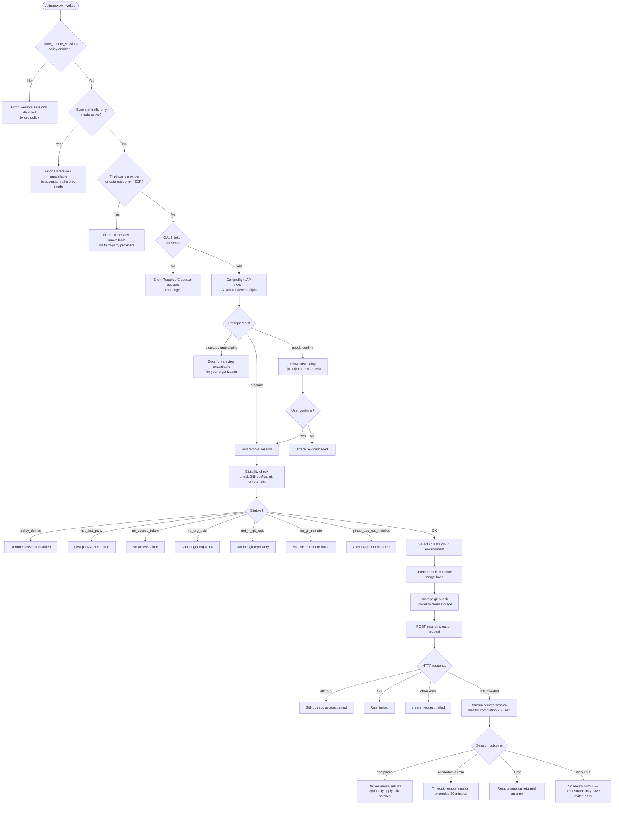

# `/ultrareview`

> Analysis basis: CC v2.1.168 bundle.js (AST extraction + Claude interpretation)
> Minimum version: v2.1.168

---

## Overview

`/ultrareview` starts a cloud-hosted AI agent that autonomously finds and verifies bugs in the current Git branch. The command runs entirely in Claude Code on the web (a "Teleport" remote session), packages the local repository as a Git bundle, uploads it to Anthropic's cloud infrastructure, launches a remote session, and streams results back to the local CLI. Estimated cost is approximately $10–$20 USD and runtime is approximately 10–20 minutes.

---

## Registration

| Field | Value |
|---|---|
| type | `local-jsx` |
| name | `ultrareview` |
| description | `"Start a cloud agent that finds and verifies bugs in your branch ( ... , ... USD) · Runs in Claude Code on the web. See ..."` |
| loc_byte | `12260023` |
| loc_byte_end | `12260293` |
| loc_line | `8645` |
| module_id | `kHK` |
| load_inline | `true` |
| arbor_handler.name | `jhf` |
| arbor_handler.fqn | `claude-2.1.168::jhf` |
| arbor_handler.kind | `AsyncFunction` |
| arbor_handler.resolution_path | `module_id` |
| arbor_handler.n_hits | `1` |

Analysis basis: CC v2.1.168 bundle.js:+12260023

The handler `jhf` was resolved by following `module_id → kHK → moduleExports → jhf`. Because `load_inline: true` is set, the registration uses the inline `load: () => Promise.resolve({call: jhf})` shape rather than a separate module boundary.

---

## Input Branching

The command has more than three distinct execution branches (policy gate, auth gate, provider gate, preflight API gate, cost confirmation, and remote execution path), so a Mermaid flowchart is used.



---

## Behavioral Spec

### 1. Policy and Provider Gate

Analysis basis: CC v2.1.168 bundle.js:+12257678, +12257681, +12257713, +12257715

```
function policyAndProviderGate(appState):
    if not appState.settings["allow_remote_sessions"]:
        emit error "Remote sessions are disabled by your organization's policy."
        return BLOCKED

    networkMode = getNetworkMode(appState)
    if networkMode == "essential-traffic-only":
        emit error "Ultrareview runs in Claude Code on the web and is unavailable when essential-traffic-only mode is active."
        return BLOCKED

    provider = getCurrentProvider(appState)
    if isDataResidencyOrZdr(provider):           # "zdr" / "data-residency" / "data_residency"
        emit error "Ultrareview runs in Claude Code on the web and is unavailable on third-party providers."
        return BLOCKED

    oauthToken = getOAuthToken(appState)
    if not oauthToken:
        emit error "Ultrareview requires a Claude.ai account. Run /login to authenticate."
        record telemetry "no-auth" / "no_oauth_token"
        return BLOCKED

    return PASS
```

The policy key checked at the outermost gate is the literal string `"allow_remote_sessions"` (bundle.js:+12257681). The essential-traffic-only sentinel string is `"essential-traffic-only"` (bundle.js:+12218510). Third-party / data-residency rejection uses sentinel `"zdr"` (bundle.js:+12218654) and `"data_residency"` (bundle.js:+12218783).

### 2. Preflight API Call

Analysis basis: CC v2.1.168 bundle.js:+12218416, +12219037, +12223047, +12223451

```
async function callPreflight(httpClient, authHeaders):
    response = await httpClient.get("/v1/ultrareview/preflight",
                                    headers=authHeaders,
                                    include="teleport-org")
    emit telemetry "api_ultrareview_preflight"

    if response schema does not match expected shape:
        emit telemetry field "schema_mismatch"
        return BLOCKED

    if response.status == "blocked" or "server":
        emit error "Ultrareview is unavailable for your organization."
        return BLOCKED

    if response.status == "needs-confirm":
        return NEEDS_CONFIRM       # triggers cost dialog

    if response.status == "proceed":
        return PROCEED

    if request failed:
        emit telemetry field "request_failed"
        return BLOCKED
```

The endpoint literal is `"/v1/ultrareview/preflight"` (bundle.js:+12218416). The `"teleport-org"` header is sent alongside the request (bundle.js:+12218450).

### 3. Cost Confirmation Dialog

Analysis basis: CC v2.1.168 bundle.js:+12217706, +12217798, +12258350

```
function showCostDialog(preflightData):
    emit telemetry "tengu_review_overage_dialog_shown"
    display to user:
        estimated cost: "$10–$20"
        estimated time: "~10–20 min"
        prompt for confirmation

    if user confirms:
        return CONFIRMED
    else:
        return CANCELLED        # emits "Ultrareview cancelled."
```

The cost range string `"$10-$20"` (bundle.js:+12217706) and duration string `"~10–20 min"` (bundle.js:+12217798) are hardcoded literals presented in the dialog.

### 4. Remote Eligibility Check (Background)

Analysis basis: CC v2.1.168 bundle.js:+9143178, +9143248, +9143365, +9143559, +9143715, +9143808, +9143904

```
async function checkRemoteEligibility(appState, gitInfo):
    emit telemetry "bg_remote_eligibility_check"

    if policy denies remote sessions:
        return { eligible: false, reason: "policy_denied" }

    if provider is not first-party Anthropic:
        return { eligible: false, reason: "not_first_party" }

    accessToken = getAccessToken(appState)
    if not accessToken:
        return { eligible: false, reason: "no_access_token" }

    orgUuid = getOrgUuid(appState)
    if not orgUuid:
        return { eligible: false, reason: "no_org_uuid" }

    if not isInsideGitWorkTree():
        return { eligible: false, reason: "not_in_git_repo" }

    remoteUrl = getGitRemoteOriginUrl()
    if not remoteUrl:
        return { eligible: false, reason: "no_git_remote" }

    githubAppInstalled = checkGithubAppInstalled(accessToken, orgUuid)
    if not githubAppInstalled:
        return { eligible: false, reason: "github_app_not_installed" }

    return { eligible: true }
```

Git-repo detection runs `git rev-parse --is-inside-work-tree` (bundle.js:+9020713). The remote URL is obtained via `git config --get remote.origin.url` (bundle.js:+1109930). Credentials embedded in the URL are redacted using the `"://***@"` replacement pattern (bundle.js:+1112935). If no remote URL is found, the error string `"No git remote URL found"` is produced (bundle.js:+1110059).

### 5. Git Bundle Packaging and Upload

Analysis basis: CC v2.1.168 bundle.js:+9054527, +9054820, +9051443, +9051969

```
async function packageAndUploadBundle(repoPath):
    emit telemetry "teleport_git_bundle_upload"

    if not isInsideGitWorkTree():
        fail with "Not in a git repository" / reason "empty_repo"

    objectCount = runGit("count-objects", "-v")
    bundleMaxBytes = 5_000_000        # 5 MB ceiling
    emit telemetry "tengu_ccr_bundle_max_bytes"

    if repoSize > bundleMaxBytes:
        return { ok: false, reason: "too_large" }

    stashRef = runGit("stash", "create")
    # creates refs/seed/stash and refs/seed/root

    bundleFile = writeBundleFile("ccr-seed.bundle")
    if seed bundle feature active:
        emit telemetry "tengu_ccr_bundle_seed_enabled"
        upload bundleFile as "_source_seed.bundle"

    uploadResult = uploadToCloudStorage(bundleFile)
    if uploadResult.status != 200:
        return { ok: false, reason: "upload_failed" }

    cleanup temp files
    return { ok: true, mode: "head" | "fallback_head" | "squashed" | "fallback_squashed" }
```

The max bundle size ceiling is 5,000,000 bytes (bundle.js:+9051969). The stash reference names `"refs/seed/stash"` (bundle.js:+9054628) and `"refs/seed/root"` (bundle.js:+9054646) are inserted as Git refs prior to bundle creation. The bundle filename pattern is `"ccr-seed" + ".bundle"` (bundle.js:+9055823, +9055834).

### 6. Cloud Environment Selection / Creation

Analysis basis: CC v2.1.168 bundle.js:+9018478, +9019398, +9073078, +9073991

```
async function selectOrCreateCloudEnvironment(orgUuid, accessToken):
    emit telemetry "teleport_environments_list"

    environments = await listEnvironments(orgUuid, accessToken, timeout=15000ms)

    if no environments found:
        defaultEnv = await createDefaultEnvironment(orgUuid, accessToken)
        if creation fails:
            warn user: "Could not create a cloud environment. Set one up at https://claude.ai/code/onboarding?magic=env-setup"
            emit field "env_create" failed
            return { ok: false, reason: "no_default_env" }
        emit telemetry "teleport_default_environment_create"
        log "[teleportToRemote] Auto-created default cloud env"

    selectedEnv = pickEnvironment(environments)
    if selectedEnv is null:
        return { ok: false, reason: "no_environments" }

    return { ok: true, environment: selectedEnv }
```

The environment list request has a timeout of 15,000 ms (bundle.js:+9019113). The default auto-created environment is described as `"Default"` with trusted network access running Python 3.11 and Node 20 under `/home/user` (bundle.js:+9019843, +9019919, +9019981, +9019998, +9020012, +9020027).

### 7. Branch Detection and Merge-Base Computation

Analysis basis: CC v2.1.168 bundle.js:+9074616, +12221788, +12222295

```
function detectBranchAndMergeBase(repoPath):
    log "[teleport] phase: branch-detect"

    currentBranch = runGit("branch", "--abbrev-ref", "HEAD")
    defaultBranch = resolveDefaultBranch()   # tries symbolic-ref refs/remotes/origin/HEAD,
                                              # falls back to "main", then "master"

    mergeBase = runGit("merge-base", defaultBranch, currentBranch)

    diffStats = runGit("diff", "--shortstat", mergeBase)
    return { currentBranch, defaultBranch, mergeBase, diffStats }
```

Default branch resolution tries `git symbolic-ref --short refs/remotes/origin/HEAD` (bundle.js:+1121146), then checks for `"main"` (bundle.js:+1121259) and `"master"` (bundle.js:+1121266) as fallbacks.

### 8. Session Creation POST

Analysis basis: CC v2.1.168 bundle.js:+9072070, +9072160, +9072228, +9077800

```
async function postSessionCreation(payload, headers):
    log "[teleport] phase: POST-sent"

    response = await httpClient.post(sessionEndpoint, payload, headers={
        "anthropic-version": "2023-06-01",
        "anthropic-beta": "ccr-byoc-2025-07-29",
        "x-organization-uuid": orgUuid,
        ...
    })

    if response.status == 201:
        sessionId = response.body.id
        if not sessionId:
            fail with "Server returned a malformed session response (no session id)"
                  reason "malformed_response"
        return { ok: true, sessionId }

    if response.status in [401, 403]:
        fail with reason "github_repo_access_denied"

    if response.status == 429:
        fail with rate-limit error

    fail with reason "create_request_failed"
```

The beta header string is `"ccr-byoc-2025-07-29"` (bundle.js:+9070801). The expected success status code is `201` (bundle.js:+9072160).

### 9. Remote Session Streaming and Result Delivery

Analysis basis: CC v2.1.168 bundle.js:+9150016, +9151704, +9152894, +9154346, +9154383

```
async function streamRemoteSession(sessionId, options):
    emit telemetry "remote_agent"
    sessionStartTime = Date.now()
    maxDuration = 1_800_000        # 30 minutes in ms

    loop:
        event = await pollSessionEvents(sessionId)

        if event.type == "hook_progress":
            forward progress messages to local UI

        if event.type == "hook_response":
            process tool responses

        if event.type == "SessionStart":
            mark session as running

        if event.type == "result":
            findings = extractFindings(event)
            if options.fix:
                applyFindingsToWorkingTree(findings)  # --fix flag
            emit telemetry "tengu_review_remote_launched"
            return { ok: true, findings }

        if (Date.now() - sessionStartTime) > maxDuration:
            fail "remote session exceeded 30 minutes"

        if session.status == "completed" and no result message:
            fail "no review output — orchestrator may have exited early"

        if session.status indicates error:
            fail "remote session returned an error"

    cleanup: unlink temp files
```

Session states observed: `"pending"`, `"running"`, `"starting"`, `"idle"`, `"archived"`, `"completed"`, `"remote-workflow"` (various bundle.js bytes in the +9150000–9154000 range). The maximum wait is 1,800,000 ms = 30 minutes (bundle.js:+9151704).

### 10. --fix Flag Handling

Analysis basis: CC v2.1.168 bundle.js:+12257416

When the user invokes `/ultrareview` with the `--fix` argument, the handler records an intent that instructs: when findings arrive from the remote agent, apply them as patches to the local working tree. This is surfaced as an appended instruction to the remote agent's prompt context (literal fragment `"The user passed --fix: when the findings arrive, apply them..."` at bundle.js:+12257416).

### 11. Overage and Spend Guard

Analysis basis: CC v2.1.168 bundle.js:+12258013

```
function checkOverageGuard(appState):
    emit telemetry "tengu_review_overage_blocked"
    if user's account has spending limits that would block execution:
        redirect user to "/admin-settings/" page
        return BLOCKED
    return PASS
```

The admin-settings redirect path literal is `"/admin-settings/"` (bundle.js:+12258135).

### 12. Title Generation for Background Task

Analysis basis: CC v2.1.168 bundle.js:+9057880, +9058178

```
async function generateTaskTitle(description, model):
    emit telemetry "teleport_generate_title"
    prompt = buildPrompt(template="claude/task", description=description)
    response = await callModel(prompt, schema="json_schema", field="title")
    # title capped at 75 characters (bundle.js:+9057874)
    return response.title.slice(0, 75)
```

The branch name template string used in the task branch is `"claude/task"` (bundle.js:+9057880).

---

## State & Side Effects

| Item | Detail |
|---|---|
| Telemetry: `tengu_feature_sad` | Emitted when a feature eligibility check fails (bundle.js:+1011093) |
| Telemetry: `tengu_feature_ok` | Emitted when a feature eligibility check passes (bundle.js:+1010950) |
| Telemetry: `tengu_review_remote_precondition_failed` | Emitted when a pre-condition (auth, policy, provider) blocks execution (bundle.js:+12220079) |
| Telemetry: `tengu_review_bughunter_config` | Emitted with configuration details at session init (bundle.js:+12217589) |
| Telemetry: `tengu_review_overage_blocked` | Emitted when spend guard blocks execution (bundle.js:+12258013) |
| Telemetry: `tengu_review_overage_dialog_shown` | Emitted when the cost confirmation dialog is displayed (bundle.js:+12258350) |
| Telemetry: `tengu_ccr_bundle_seed_enabled` | Emitted when seed-bundle feature is active (bundle.js:+9143651) |
| Telemetry: `tengu_ccr_bundle_upload` | Emitted during git bundle upload phase (bundle.js:+9054820) |
| Telemetry: `tengu_ccr_bundle_max_bytes` | Emitted with repo size check result (bundle.js:+9051443) |
| Telemetry: `tengu_teleport_bundle_mode` | Emitted to record which bundle mode was chosen (bundle.js:+9071205) |
| Telemetry: `tengu_ccr_session_link` | Emitted with the session URL link (bundle.js:+9064753) |
| Telemetry: `tengu_teleport_source_decision` | Emitted recording the chosen source (git/bundle/none) (bundle.js:+9076662) |
| Telemetry: `tengu_review_remote_teleport_failed` | Emitted when the Teleport remote session fails to launch (bundle.js:+12225935) |
| Telemetry: `tengu_review_remote_launched` | Emitted on successful session launch (bundle.js:+12226458) |
| Git side effects | Creates temporary refs `refs/seed/stash` and `refs/seed/root`; writes and later deletes temp bundle files (`ccr-seed.bundle`, `_source_seed.bundle`) |
| File system | Uses `fs.appendFile`, `fs.mkdir`, `fs.rename`, `fs.unlink` for log rotation and bundle staging (bundle.js:+205407–205603) |
| MCP state | Reads MCP server registry (`cDA`, `xbH`) to attach connected MCP context to the remote session |
| appState changes | Reads `allow_remote_sessions` policy; reads `allow_product_feedback`; may write session metadata |
| Network | POST to `/v1/ultrareview/preflight`; POST to session creation endpoint; optional streaming poll loop |
| Sound | None found in depth-2 traversal |
| Hook registration | Registers `NPA` signal handler via `j9` → `NPA.register` (bundle.js:+60369) |
| Session timeout | Enforces 30-minute ceiling (1,800,000 ms) on remote session wait (bundle.js:+9151704) |
| Bootstrap fetch | Issues a bootstrap fetch tagged `"[Bootstrap] Fetching"` with timeout 5,000 ms (bundle.js:+15797658, +15797859) |

---

## Version History

| Version | Change |
|---|---|
| v2.1.168 | Initial analysis |

---

## Common Mistakes

1. **Running outside a Git repository**: The command aborts with `"Not in a git repository"` if the working directory is not inside a Git work tree. Initialize a repo with `git init` and make at least one commit before invoking `/ultrareview`.
2. **No GitHub remote configured**: Even with a valid Git repo, the command requires a GitHub remote (`git remote add origin REPO_URL`). A local-only repo will fail with `"no_git_remote"`.
3. **GitHub App not installed**: The Anthropic GitHub App must be installed on the target organization/repository. If missing, the session will be rejected with `"github_app_not_installed"`. Install via `https://claude.ai/code`.
4. **Using API key authentication instead of OAuth**: `/ultrareview` requires a Claude.ai account OAuth token; Anthropic API-key-only authentication is insufficient. Run `/login` to authenticate.
5. **Third-party or data-residency provider**: The feature is unavailable when routing through non-Anthropic providers, ZDR configurations, or data-residency deployments.
6. **Essential-traffic-only network mode**: In locked-down network environments with essential-traffic-only mode active, the command is disabled entirely.
7. **Repository too large**: Repositories whose packed object store exceeds 5,000,000 bytes will be rejected at the bundle-upload phase with `"too_large"`. Consider using a shallower clone or splitting the repository.
8. **Org policy blocking remote sessions**: An organization administrator may disable remote sessions via the `allow_remote_sessions` policy toggle; contact your admin to enable it.

---

## Appendix — Identifier Mapping

> For bundle debugging only. Identifiers change across versions.

| Identifier | Role |
|---|---|
| `jhf` | Main async handler for `/ultrareview` (Arbor-resolved entry point) |
| `X9` | Remote eligibility/policy check orchestrator |
| `Df9` | Sub-eligibility dispatcher |
| `sIH` | Provider/auth gate checker |
| `cC` | Account plan / subscription type evaluator |
| `LP6` | File-read + encoding utility (reads UTF-8 config files) |
| `b7H` | Feature-flag / plan-membership checker |
| `$q` | Telemetry dispatch helper |
| `dRA` | Telemetry event recorder |
| `_6` | String coercion / conversion utility |
| `ILH` | String identity / passthrough helper |
| `H` | Bootstrap fetch / HTTP initializer |
| `v` | HTTP request dispatcher (debug-level logging) |
| `snK` | Request header builder |
| `IPA` | Endpoint resolver |
| `RH` | JSON serializer for request bodies |
| `G4` | User-agent string builder |
| `K0A` | Platform map iterator |
| `EUH` | Output writer (stream flusher) |
| `nWA` | Low-level stream write wrapper |
| `_iK` | Log-file append / rotation manager |
| `npH` | Async batch writer with timeout/debounce |
| `YKH` | Log-path resolver |
| `d6` | Directory path utility |
| `B76` | Log rotation handler |
| `$0A` | Log file path joiner |
| `ll8` | Log file stat + rename + unlink utility |
| `HiK` | Log-file mkdir + appendFile orchestrator |
| `j9` | Signal handler registrar |
| `Y3` | Response body parser |
| `mj_` | Query-string / header-line parser |
| `lHH` | Cache-map lookup (has-check) |
| `uj` | String replacer utility |
| `H9` | Git command runner (git-output processor) |
| `m6H` | Git output multi-field extractor |
| `Q0` | Git stdout normalizer |
| `aqH` | Git error classifier |
| `qB` | Git log / diff output parser |
| `s9` | Model/provider string normalizer |
| `Y2` | Model-ID canonicalizer |
| `h4H` | Provider inclusion checker |
| `CI` | Model capability resolver (lM + N5 pair) |
| `DdH` | Default model resolver |
| `bT` | Model string builder |
| `lP1` | Model alias resolver |
| `lM` | API provider mapper |
| `NH8` | Plan inclusion checker |
| `wdH` | String conversion for provider key |
| `FJ` | Git invocation wrapper |
| `_G` | Composite model+provider builder |
| `o6` | JSX element factory helper |
| `l` | React / JSX base renderer |
| `J6` | React element creator |
| `hm6` | Core JSX runtime |
| `OHK` | Preflight response classifier (`fix` / `comment` / `/code-review ultra`) |
| `CC8` | HTTP response body processor / trimmer |
| `L` | Active-connection set manager |
| `f` | Connection lifecycle manager (open/close) |
| `SV` | String escape / sanitizer |
| `K` | Column formatter (padEnd) |
| `M` | MCP server state manager (top-level) |
| `xbH` | MCP connection builder (stdio/sse/http/ws-ide) |
| `PF8` | MCP connection result applicator |
| `$` | MCP connection tracker |
| `cDA` | MCP server reconnect / refresh orchestrator |
| `H4A` | Preflight + git-info collector for ultrareview |
| `IZ8` | Git work-tree checker (rev-parse wrapper) |
| `u6` | Async context store accessor |
| `pc6` | AsyncLocalStorage `.getStore()` wrapper |
| `W_` | Timer/promise utility |
| `C_` | Git command executor (low-level) |
| `YZH` | Git process spawner |
| `D` | Process-exit / abort orchestrator |
| `QE4` | Error-code stringifier |
| `O$` | Git stderr collector |
| `V8` | EISDIR error classifier |
| `hH` | Error formatter + logger |
| `tR` | Remote-URL fetcher + cache (`git config --get remote.origin.url`) |
| `Ed` | Remote-URL cache loader |
| `El6` | Cache map `.get` for remote URL |
| `uFH` | Credential-redactor (replaces `://***@`) |
| `q6H` | Remote-URL parser (HTTPS/SSH) |
| `PuA` | HTTPS URL decomposer |
| `d1` | SSH URL decomposer |
| `nYq` | Git object-count + size estimator |
| `lYq` | Git count-objects runner |
| `cYq` | Bundle-size gate enforcer |
| `D6` | Session / environment dispatcher |
| `R8` | Git command runner variant |
| `jI` | Default-branch resolver via symbolic-ref |
| `V6_` | Default-branch cache getter |
| `Nw` | Current-branch resolver (`git branch --abbrev-ref HEAD`) |
| `E6_` | Current-branch cache getter |
| `O` | Stopped-session state checker |
| `b8` | Background-session sentinel |
| `Hc_` | diff --shortstat parser (extracts changed-line counts) |
| `KHK` | Config size/cost estimator |
| `ixH` | Session configuration builder |
| `_4A` | Preflight flow controller + retry dispatcher |
| `fHK` | Preflight HTTP call + response router |
| `U6` | JSON.parse wrapper |
| `sKA` | Essential-traffic-only mode detector |
| `SH` | JSX status-message renderer |
| `rxH` | Retry / re-attempt invoker |
| `Z_6` | Subscription type resolver |
| `YZ` | Subscription type enum accessor |
| `lDH` | Subscription category mapper |
| `kL` | Plan-type lookup |
| `GY` | Account plan evaluator |
| `C6` | Session/environment state tracker |
| `GA` | Plan + subscription cross-checker |
| `DC` | Array type guard |
| `Ph` | User role / plan guard |
| `Aq` | Role-to-plan mapper |
| `s7_` | Role string constants |
| `a7_` | Plan string constants |
| `Ee` | Bug-hunter config emitter (telemetry) |
| `whf` | Main remote-session launcher (teleportToRemote orchestrator) |
| `A4A` | Session creation + streaming manager |
| `e2H` | Session environment selection helper |
| `yDq` | Remote eligibility checker (background) |
| `E` | Eligibility result accumulator |
| `$MH` | Environment ID constant (`env_011111...`) |
| `qHK` | Session config builder variant |
| `pn` | Full teleportToRemote implementation |
| `aL` | API provider first-party checker |
| `B3` | Branch name generator |
| `zi_` | Permission-mode event sender |
| `Yu` | Session error classifier |
| `F1` | OAuth endpoint validator |
| `gj` | Anthropic HTTP client factory |
| `Li_` | Git bundle packager + uploader |
| `R6` | Promise/timer utility |
| `P6` | JSX progress renderer |
| `rYq` | Session UUID generator (randomUUID) |
| `bv6` | Request body assembler |
| `iYq` | Session link JSX renderer |
| `NZ8` | Notification / status updater |
| `Tt` | Environment list fetcher |
| `Q86` | Default environment creator |
| `GH` | String coercion wrapper |
| `cr7` | Task title generator (LLM call) |
| `ph` | GitHub App installation checker |
| `qCH` | GitHub App status HTTP checker |
| `a` | MCP connection event handler |
| `AA` | Error string extractor |
| `vz` | Cancellation detector |
| `rO` | Request-abort handler |
| `JCH` | Remote agent session streaming loop |
| `Fk` | Random-bytes token generator |
| `R86` | Browser/web session opener |
| `a2` | Session timestamp tracker |
| `Vo7` | Session status string builder |
| `CDq` | Session event poller + state machine |
| `HWH` | Session result delivery handler |
| `OD` | Result applicator (--fix patch applier) |
| `Dhf` | Findings map renderer |
| `eKA` | Cancellation JSX renderer ("Ultrareview cancelled.") |