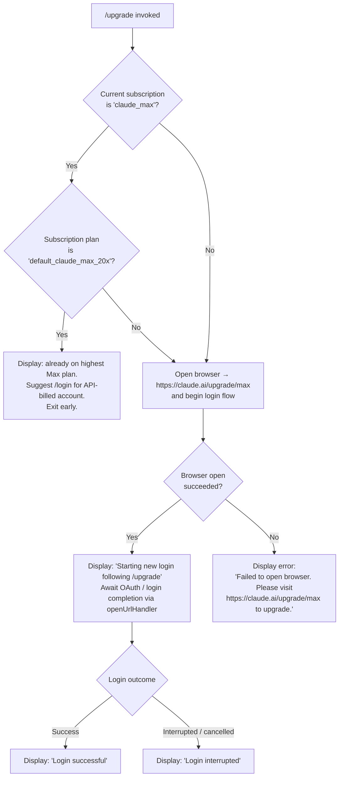

# `/upgrade`

> Analysis basis: CC v2.1.168 bundle.js (AST extraction + Claude interpretation)
> Minimum version: v2.1.168

---

## Overview

The `/upgrade` command guides users from their current Claude subscription to the Max tier, which provides higher rate limits and greater access to Opus models. When invoked, it checks the user's current subscription state and either opens the upgrade URL in a browser (`https://claude.ai/upgrade/max`) or initiates a fresh login flow if a new account link is needed. If the user is already on the highest Max plan, the command exits early with an informational message.

---

## Registration

| Field | Value |
|---|---|
| type | `local-jsx` |
| name | `upgrade` |
| description | `Upgrade to Max for higher rate limits and more Opus` |
| loc_byte | `12738242` |
| loc_byte_end | `12738489` |
| loc_line | `9094` |
| module_id | `I7A` |
| load_inline | `true` |
| arbor_handler.name | `fC6` |
| arbor_handler.fqn | `claude-2.1.168::fC6` |
| arbor_handler.kind | `AsyncFunction` |
| arbor_handler.resolution_path | `module_id` |
| arbor_handler.n_hits | `0` |

Analysis basis: CC v2.1.168 bundle.js:+12738242

---

## Input Branching

The command has four distinct execution paths based on subscription state and login outcome, so a flowchart is appropriate.



Analysis basis: CC v2.1.168 bundle.js:+12737373, +12737398, +12737618, +12737771, +12737843, +12737962, +12737981, +12738035

---

## Behavioral Spec

### Top-level handler (`upgradeCommandHandler`)

The main handler is the `AsyncFunction` identified as `fC6` (resolved via `module_id → I7A`).

```
async function upgradeCommandHandler(context):

    // 1. Resolve current account / subscription info
    accountInfo = await resolveAccountProfile(context)   // GA → GY

    subscriptionType = accountInfo.subscriptionType      // literal: "claude_max"
    subscriptionPlan  = accountInfo.subscriptionPlan     // literal: "default_claude_max_20x"

    // 2. Early-exit guard: already on the ceiling tier
    if subscriptionType == "claude_max"
        and subscriptionPlan == "default_claude_max_20x":
        displayMessage(
            "You are already on the highest Max subscription plan. "
            "For additional usage, run /login to switch to an API "
            "usage-billed account."
        )
        return

    // 3. Attempt to open the upgrade URL in the system browser
    opened = openUrlInBrowser("https://claude.ai/upgrade/max")   // CK

    if not opened:
        displayError(
            "Failed to open browser. Please visit "
            "https://claude.ai/upgrade/max to upgrade."
        )
        return

    // 4. Notify the user that a login flow is starting
    displayMessage(
        "Starting new login following /upgrade. "
        "Exit with Ctrl-C to use existing account."
    )

    // 5. Kick off OAuth / login flow with a timeout guard
    setTimeout(loginTimeoutGuard, ...)          // fC6 → setTimeout

    loginResult = await performLogin(context)   // SYH

    // 6. Render JSX result component
    component = createElement(UpgradeResultComponent, ...)   // v7A.createElement

    // 7. Handle API-key change callback if credentials rotated
    handleApiKeyChange(context.onChangeAPIKey)   // fC6 → _.onChangeAPIKey

    // 8. Report outcome
    if loginResult.success:
        displayMessage("Login successful")
    else:
        displayMessage("Login interrupted")

    // 9. Flush any pending log entries
    flushLogBuffer(context)   // hH
```

Analysis basis: CC v2.1.168 bundle.js:+12737287, +12737459, +12737603, +12737768, +12737804, +12737939, +12737958, +12738014

---

### Account profile resolution (`resolveAccountProfile`)

Calls the account-state helper (`GA`) which in turn calls the full profile resolver (`GY`). The profile resolver is responsible for:

1. Determining the authentication mode — checking for `ANTHROPIC_API_KEY`, `user_oauth`, `profile-implicit`, or cloud-provider credentials (Bedrock / Vertex / Foundry / Anthropic AWS / Mantle).
2. Selecting the appropriate credential source (`Bj`, `aL`, `GO`, `nw6`).
3. Returning a normalized profile object that includes `subscriptionType` and `subscriptionPlan`.

Authentication sources recognized (literals found in traversal):

| Source key | Description |
|---|---|
| `user_oauth` | Standard Anthropic OAuth token |
| `profile-implicit` | Implicit profile (no explicit selection) |
| `ANTHROPIC_API_KEY` | Direct API key via environment variable |
| `apiKeyHelper` | Helper script for API key injection |
| `bedrock` | AWS Bedrock provider |
| `foundry` | Foundry provider |
| `anthropicAws` | Anthropic-managed AWS |
| `mantle` | Mantle provider |
| `vertex` | Google Vertex AI |
| `firstParty` | Direct first-party API |
| `claude-desktop-3p` | Claude Desktop third-party integration |

If none of the required credentials are present, an error is raised: `"ANTHROPIC_API_KEY, ANTHROPIC_AUTH_TOKEN, CLAUDE_CODE_OAUTH_TOKEN, or WIF env vars (ANTHROPIC_FEDERATION_RULE_ID + ANTHROPIC_ORGANIZATION_ID) required"` (bundle.js:+3004652).

Analysis basis: CC v2.1.168 bundle.js:+3022515, +3002515, +3001155, +3001228, +3004183, +3004652

---

### OAuth login flow (`performLogin`)

The login helper `SYH` orchestrates the OAuth exchange:

```
async function performLogin(context):

    // Build OAuth endpoint URL
    oauthUrl = buildOAuthUrl(context.env)   // F1
    // Validates against approved endpoints; custom URL checked via
    // CLAUDE_CODE_CUSTOM_OAUTH_URL — must be approved or raises:
    // "CLAUDE_CODE_CUSTOM_OAUTH_URL is not an approved endpoint."

    // Fetch current OAuth profile with 10 000 ms timeout
    profileResult = await httpGet(
        oauthUrl,
        headers: {"Content-Type": "application/json"},
        timeout: 10000
    )   // SYH → qA.get

    // Telemetry on success / failure
    if profileResult.ok:
        emit("oauth_profile_fetch")
    else:
        emit("oauth_profile_token_failed")

    // Proceed with token exchange
    tokenResult = await exchangeToken(profileResult)   // SYH → SH / o6

    // Render incremental UI updates
    renderLoginUI(tokenResult)   // SYH → rO / v

    // Write credentials to store
    persistCredentials(tokenResult)   // SYH → hH

    return tokenResult
```

Environment-specific OAuth base URLs observed (literals in traversal, used in non-production builds):

- `http://localhost:8000` (bundle.js:+853198)
- `http://localhost:4000` (bundle.js:+853285)
- `http://localhost:3000` (bundle.js:+853375)
- `http://localhost:8205` (bundle.js:+853958)
- Production environment: `"prod"` (bundle.js:+852924)
- Staging environment: `"staging"` (bundle.js:+854103)

OAuth client ID (local dev): `22422756-60c9-4084-8eb7-27705fd5cf9a` (bundle.js:+853872)

Analysis basis: CC v2.1.168 bundle.js:+2107648, +2107702, +2107749, +2107764, +2107792, +2107808, +2107875

---

### Browser open helper (`openUrlInBrowser`)

The URL launcher `CK` delegates to platform-specific commands:

```
function openUrlInBrowser(url):
    // Validate scheme
    if not url.startsWith("http:") and not url.startsWith("https:"):
        raise Error("Invalid URL scheme")   // _j7

    platform = process.platform

    if platform == "darwin":
        spawn("open", [url])
    elif platform == "win32":
        spawn("rundll32", ["url,OpenURL", url])
    else:
        spawn("xdg-open", [url])   // Linux / other

    return success
```

Analysis basis: CC v2.1.168 bundle.js:+6814762, +6814784, +6815071, +6815087, +6815171, +6815183, +6815245, +6815252

---

### Credential persistence (`persistCredentials` / `flushLogBuffer`)

`hH` manages writing OAuth tokens and flushing diagnostic log entries. It:

1. Appends new credential records to the credential store (`DG4` → `Rc6.push` / `Rc6.shift`).
2. Pushes entries to the pending flush queue (`PFH.push`).
3. On error, calls `pr.logError`.

The file-system layer (`_iK`) handles:
- Atomic log rotation (rename + unlink via `ll8`).
- Directory creation (`HiK` → `ny.mkdir`).
- Append-only writes (`ny.appendFile`).
- Buffer byte-length checks before writes (`Buffer.byteLength`).

Analysis basis: CC v2.1.168 bundle.js:+1016312, +1016654, +1016672, +1016712, +206160, +205895

---

## State & Side Effects

| Item | Detail |
|---|---|
| Telemetry | `tengu_feature_ok` (bundle.js:+1010950), `tengu_feature_sad` (bundle.js:+1011093) — fired via the login feature wrapper around OAuth steps |
| OAuth events | `oauth_profile_fetch` (bundle.js:+2107808) on successful profile fetch; `oauth_profile_token_failed` (bundle.js:+2107875) on failure |
| Bootstrap events | `api_bootstrap_fetch` (bundle.js:+15797980) with `parse_failed` sub-tag; emitted during account-state resolution |
| Browser side effect | Spawns platform OS command to open `https://claude.ai/upgrade/max` |
| Credential store | OAuth token written / updated in persistent store via `hH` → `DG4` |
| Log files | Append-only log rotation executed; old `.txt` suffix files renamed/unlinked (bundle.js:+205511) |
| API key callback | `_.onChangeAPIKey` called if credentials change after login (bundle.js:+12737939) |
| `appState` changes | Login state updated; subscription fields (`claude_max`, `default_claude_max_20x`) refreshed in account profile |
| Timer | `setTimeout` guard registered during login flow (bundle.js:+12737603) |
| Sound | <!-- TODO: not found in depth-2 traversal; needs --depth 4 --> |
| Hook registration | `NPA.register` called via `j9` during file-system bootstrap (bundle.js:+60369) |

---

## Version History

| Version | Change |
|---|---|
| v2.1.168 | Initial analysis |

---

## Common Mistakes

1. **Invoking `/upgrade` when already on the ceiling tier.** If the subscription is `claude_max` with plan `default_claude_max_20x`, the command exits immediately with a message suggesting `/login` instead. The upgrade URL is never opened in this case.
2. **Browser not available in headless/SSH environments.** The command relies on `open` / `xdg-open` / `rundll32` being present. In environments without a display or browser, the command will fall through to the "Failed to open browser" error message and take no further action.
3. **Interrupting the login flow.** If the OAuth flow is cancelled (Ctrl-C), the command reports "Login interrupted" and does **not** update credentials. The existing session remains unchanged.
4. **Using a non-approved custom OAuth URL.** Setting `CLAUDE_CODE_CUSTOM_OAUTH_URL` to an unapproved endpoint causes the login helper to throw `"CLAUDE_CODE_CUSTOM_OAUTH_URL is not an approved endpoint."` before any network request is made.
5. **Missing required credentials for profile resolution.** If none of the recognized auth environment variables are set, account-state resolution fails with a clear error listing all accepted variables (`ANTHROPIC_API_KEY`, `ANTHROPIC_AUTH_TOKEN`, `CLAUDE_CODE_OAUTH_TOKEN`, WIF vars).

---

## Appendix — Identifier Mapping

> For bundle debugging only. Identifiers change across versions.

| Identifier | Role |
|---|---|
| `fC6` | Main upgrade command handler (`AsyncFunction`, entry point) |
| `GA` | Account-state accessor (calls profile resolver) |
| `GY` | Full account profile resolver (auth mode detection) |
| `O4` | Config/settings reader |
| `_6` | String/value normalizer utility |
| `Bj` | OAuth credential-source selector |
| `et6` | OAuth token reader sub-helper |
| `qlH` | Credential-string formatter |
| `sU` | OAuth token file-descriptor handler (`CLAUDE_CODE_OAUTH_TOKEN_FILE_DESCRIPTOR`) |
| `AN` | Flag-settings resolver |
| `DC` | Array-type credential checker |
| `aL` | Profile-implicit credential resolver |
| `MA` | Provider-type mapper (bedrock / vertex / etc.) |
| `pX` | Profile selector utility |
| `GO` | API key / environment credential resolver |
| `cw6` | API key helper sub-resolver |
| `BpH` | VS Code integration detector (`claude-vscode`) |
| `eO6` | API key file-descriptor handler (`CLAUDE_CODE_API_KEY_FILE_DESCRIPTOR`) |
| `C6` | Timestamp / session-record builder |
| `wC` | Credential slice/truncation helper |
| `nw6` | Non-OAuth credential formatter |
| `SYH` | OAuth login orchestrator (profile fetch + token exchange) |
| `F1` | OAuth endpoint URL builder |
| `jIA` | Environment name resolver |
| `HM4` | Endpoint URL template filler |
| `SH` | Token exchange step A (success path) |
| `l` | Low-level HTTP/fetch utility |
| `J6` | Response parser |
| `hm6` | HTTP error classifier |
| `o6` | Token exchange step B (alternate path) |
| `rO` | Login UI renderer |
| `v` | Terminal output / display writer |
| `snK` | Terminal write scheduler |
| `IPA` | TTY output flusher |
| `H` | Bootstrap fetch orchestrator |
| `Y3` | User-agent string builder |
| `mj_` | URL path parser/splitter |
| `lHH` | Feature-flag set checker |
| `uj` | URL string sanitizer |
| `H9` | HTTP response handler |
| `RH` | JSON-stringify wrapper |
| `G4` | Path redaction utility |
| `K0A` | Path-segment mapper |
| `q` | File unlink utility |
| `A` | Filename case-normalizer |
| `EUH` | Stream write helper |
| `nWA` | Buffered write flusher |
| `_iK` | File-system I/O manager (atomic log rotation + append) |
| `npH` | Async write queue / debouncer |
| `YKH` | Log line formatter |
| `d6` | Session ID generator |
| `B76` | EISDIR-safe file writer |
| `$0A` | Log file path builder |
| `ll8` | Log rotation handler (rename / unlink) |
| `HiK` | Append-file worker (mkdir + appendFile) |
| `j9` | Crash-handler / signal registrar (`NPA.register`) |
| `hH` | Credential store writer + log queue flusher |
| `AA` | Error-to-string converter |
| `$q` | Credential record serializer |
| `dRA` | Credential string formatter |
| `DG4` | Credential ring-buffer manager (shift + push) |
| `CK` | Platform browser URL opener |
| `_j7` | URL scheme validator |
| `nY` | Process/platform detector |
| `R8` | Full login session runner |
| `C_` | Login core (YZH orchestration + shutdown) |
| `YZH` | OAuth PKCE / token flow state machine |
| `D` | Forced shutdown / process-exit handler |
| `QE4` | String coercion for error messages |
| `O$` | Login result formatter |
| `V8` | File-write safety wrapper |
| `u6` | Async-local-storage context accessor |
| `pc6` | Store getter wrapper |
| `W_` | Timer/tick utility |

---

Note: index built via Arbor fallback; some signals (telemetry, literals) may be missing — see arbor-fallback.js.