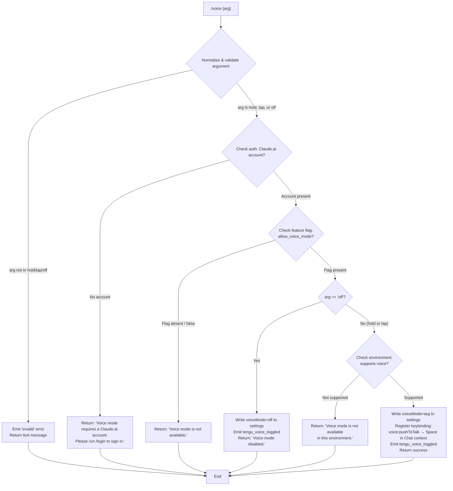

# `/voice`

> Analysis basis: CC v2.1.168 bundle.js (AST extraction + Claude interpretation)
> Minimum version: v2.1.168

---

## Overview

The `/voice` command toggles voice mode in Claude Code, allowing users to activate push-to-talk (`hold`), tap-to-talk (`tap`), or disable voice input (`off`). The command validates authentication and feature availability before persisting the mode selection to settings, and registers a keybinding (`Space` in the `Chat` context) when voice mode is enabled.

---

## Registration

| Field | Value |
|---|---|
| type | `local` |
| name | `voice` |
| description | `Toggle voice mode` |
| argumentHint | `[hold\|tap\|off]` |
| supportsNonInteractive | `false` |
| isHidden | `null` |
| module_id | `P5K` |
| load_inline | `true` |
| loc_byte | `13008328` |
| loc_byte_end | `13008570` |
| loc_line | `9627` |
| arbor_handler.name | `YFf` |
| arbor_handler.fqn | `claude-2.1.168::YFf` |
| arbor_handler.kind | `AsyncFunction` |
| arbor_handler.resolution_path | `module_id` |
| arbor_handler.n_hits | `1` |

Analysis basis: CC v2.1.168 bundle.js:+13008328

---

## Input Branching

The command has 5+ distinct branches depending on authentication state, feature flag, argument value, and environment availability — a Mermaid flowchart is used.



Analysis basis: CC v2.1.168 bundle.js:+13005730 (literals: `hold`, `tap`, `off`, `invalid`), +13005854 (auth error message), +13005953 (unavailable message), +13006379 (disabled message), +13006623 (environment unavailable message)

---

## Behavioral Spec

### 1. Argument Normalization and Validation

The handler function (arbor: `YFf`) begins by trimming whitespace from the raw argument string.

```
function normalizeVoiceArg(rawArg):
    trimmed = rawArg.trim()
    if trimmed not in ["hold", "tap", "off"]:
        return { valid: false, reason: "invalid" }
    return { valid: true, mode: trimmed }
```

Valid mode values are the three string literals `"hold"`, `"tap"`, and `"off"`, found at bundle.js:+13005730, +13005742, +13005753. The string `"invalid"` is used internally to label the rejection case (bundle.js:+13005774).

Analysis basis: CC v2.1.168 bundle.js:+13006074 (H.trim call on argument)

---

### 2. Authentication Check

Before proceeding, the handler invokes `checkVoiceAuthorizationState` (identified as `uq6` → `px8` → `X9`). This checks whether the user has a Claude.ai-linked account. The check queries a feature set that includes `"allow_voice_mode"` (bundle.js:+12995990).

```
function checkVoiceAuthorizationState(appState):
    accountInfo = getAccountInfo(appState)
    if accountInfo is null or not linked:
        return { authorized: false, reason: "no_account" }
    featureFlags = getFeatureFlags(accountInfo)
    if "allow_voice_mode" not in featureFlags:
        return { authorized: false, reason: "flag_absent" }
    return { authorized: true }
```

- If no account: message `"Voice mode requires a Claude.ai account. Please run /login to sign in."` (bundle.js:+13005854)
- If feature flag absent: message `"Voice mode is not available."` (bundle.js:+13005953)

Analysis basis: CC v2.1.168 bundle.js:+13005813 (`uq6` call), +12995987 (`px8` → `X9`), +12995990 (`allow_voice_mode` literal)

---

### 3. Settings Persistence

Settings are read and written through `loadSettingsFromDisk` (identifier: `gU`, via `l_`) and `writeSettings` (identifier: `o_`). The settings layer resolves paths including `~/.claude/settings.json` and project-local variants (bundle.js:+1272961, +1272971).

```
function persistVoiceMode(mode):
    currentSettings = loadSettingsFromDisk()
    currentSettings.voiceMode = mode
    result = writeSettings(currentSettings)
    if result is error:
        return { ok: false, message: "Failed to update settings. Check your settings file for syntax errors." }
    return { ok: true }
```

Error message on write failure: `"Failed to update settings. Check your settings file for syntax errors."` (bundle.js:+13006241).

Analysis basis: CC v2.1.168 bundle.js:+13005991 (`l_` call for settings load), +13006143 (`o_` call for settings write)

---

### 4. Environment Availability Check

When the requested mode is `hold` or `tap` (not `off`), an environment suitability check is performed. This appears to verify platform/runtime capabilities — microphone access is mentioned via the string `"System Settings → Privacy & Security → Microphone"` (bundle.js:+13007130). If the environment cannot support voice capture, the command returns early.

```
function checkVoiceEnvironment(appState):
    if not platformSupportsVoiceCapture(appState):
        return { available: false }
    microphonePermission = checkMicrophonePermission()
    if microphonePermission == "denied":
        return { available: false, hint: "System Settings → Privacy & Security → Microphone" }
    return { available: true }
```

Message when environment is unsupported: `"Voice mode is not available in this environment."` (bundle.js:+13006623).

Analysis basis: CC v2.1.168 bundle.js:+13006548 (`mC6` call), +13007130 (microphone hint literal)

---

### 5. Keybinding Registration

When voice mode is enabled (`hold` or `tap`) and the environment check passes, the handler registers a push-to-talk keybinding via `registerKeybinding` (identifier: `OP`, called at bundle.js:+13007589). The action `"voice:pushToTalk"` is mapped to the `Space` key in the `Chat` context.

```
function registerVoiceKeybinding():
    binding = {
        context: "Chat",
        key: "Space",
        action: "voice:pushToTalk"
    }
    registerKeybinding(binding)
```

String literals: `"voice:pushToTalk"` (bundle.js:+13007592), `"Chat"` (bundle.js:+13007611), `"Space"` (bundle.js:+13007618).

Analysis basis: CC v2.1.168 bundle.js:+13007589 (`OP` call), +13007592, +13007611, +13007618

---

### 6. Telemetry Emission

After successfully changing voice mode state, the handler emits `tengu_voice_toggled` (bundle.js:+13006324). This fires for both enabling and disabling voice mode.

```
function emitVoiceToggleTelemetry(mode, previousMode):
    emit("tengu_voice_toggled", { mode: mode, previous: previousMode })
```

Analysis basis: CC v2.1.168 bundle.js:+13006324

---

### 7. MCP Configuration Refresh (Side Effect)

The call graph shows `YFf` reaches `M` (bundle.js:+13006898), which invokes `xbH` — the MCP server connection orchestrator. After a voice mode change, MCP server configurations may be reloaded or refreshed as part of a broader application state synchronization cycle.

Analysis basis: CC v2.1.168 bundle.js:+13006898 (`M` call), +15879305 (`xbH`)

---

## State & Side Effects

| Item | Detail |
|---|---|
| Telemetry | `tengu_voice_toggled` (bundle.js:+13006324) — emitted on every successful mode change |
| Telemetry (indirect) | `tengu_feature_ok` (+1010950), `tengu_feature_bad` (+1011012), `tengu_feature_sad` (+1011093) — from settings subsystem |
| Settings write | Persists `voiceMode` field to `~/.claude/settings.json` or project settings |
| Keybinding registration | Registers `voice:pushToTalk → Space` in `Chat` context when enabling voice |
| Feature flag check | Reads `allow_voice_mode` flag from account/session data |
| MCP state | Potential MCP config refresh cycle triggered as side effect |
| appState changes | Voice mode preference stored; affects subsequent UI rendering of voice controls |
| Sound | None observed in traversal |
| Microphone hint | `"System Settings → Privacy & Security → Microphone"` shown when permission is missing |

---

## Version History

| Version | Change |
|---|---|
| v2.1.168 | Initial analysis |

---

## Common Mistakes

1. **Omitting the argument entirely**: The command requires one of `hold`, `tap`, or `off`. Calling `/voice` with no argument or an unrecognized argument (e.g., `/voice enable`) triggers the `"invalid"` branch and returns an error without changing state.
2. **Running without a Claude.ai account**: Voice mode is gated behind account authentication. Users who have not run `/login` will see the account-required error and no setting will be written.
3. **Environment limitations**: On platforms lacking microphone support (e.g., headless servers, remote SSH sessions without forwarding), `/voice hold` or `/voice tap` will fail at the environment check. Use `/voice off` to explicitly disable if the saved setting becomes stale after a platform change.
4. **Settings file syntax errors**: If the user has manually edited their `settings.json` and introduced a JSON syntax error, the write-back step will fail. The command surface this with a specific error message but does not attempt to auto-repair the file.
5. **Expecting immediate audio capture**: The command only configures the mode and registers the keybinding; actual audio capture begins only when the bound key (`Space` in `Chat`) is subsequently pressed.

---

## Appendix — Identifier Mapping

> For bundle debugging only. Identifiers change across versions.

| Identifier | Role |
|---|---|
| `YFf` | Main handler for `/voice` command (AsyncFunction, arbor-resolved) |
| `uq6` | Voice authorization state checker (auth + feature flag gate) |
| `mx8` | Inner auth/feature resolution helper |
| `GY` | Authentication state accessor |
| `O4` | Auth token/session getter |
| `Bj` | OAuth/profile resolution helper |
| `aL` | First-party auth checker |
| `pX` | Platform/environment helper |
| `GO` | API key and auth environment resolver |
| `nw6` | Feature flag query wrapper |
| `qlH` | Feature flag set accessor |
| `VZ` | Settings reader for auth context |
| `RC6` | Auth cache reader |
| `px8` | Voice feature flag lookup |
| `X9` | Feature flag presence checker (enterprise/team/allow_voice_mode) |
| `Df9` | Feature set initializer |
| `cC` | Feature config loader |
| `sIH` | Feature settings applicator |
| `l_` | Settings-from-disk loader entry point |
| `gU` | Core settings load orchestrator |
| `aE` | Settings load event emitter |
| `b9` | Performance/memory usage tracker during settings load |
| `A__` | Settings resolution and merge function |
| `C8` | File append/log writer |
| `H36` | Flag settings merger |
| `rpA` | Policy settings resolver |
| `NzH` | Settings path/name resolver |
| `Id` | Settings identity/hash function |
| `lpA` | SDK inline settings loader |
| `kd` | Settings subsystem dispatcher |
| `W_` | Utility: platform/tty checker |
| `_36` | WSL/environment resolver |
| `CC6` | Settings write precondition checker |
| `zFf` | Argument parser/normalizer for voice mode |
| `H` | HTTP/fetch bootstrap helper |
| `v` | HTTP request builder |
| `snK` | HTTP header builder |
| `RH` | JSON stringify wrapper |
| `G4` | URL/path manipulation helper |
| `EUH` | User-agent string builder |
| `_iK` | File read/write dispatcher |
| `mj_` | String/header parser |
| `lHH` | Language/locale checker |
| `uj` | String replacement utility |
| `H9` | Model name resolver |
| `m6H` | Model alias table |
| `s9` | Model string normalizer |
| `FJ` | Model resolution dispatcher |
| `o6` | Telemetry feature event emitter |
| `l` | Low-level telemetry send |
| `J6` | Telemetry payload builder |
| `o_` | Settings writer |
| `eO` | Settings path resolver |
| `___` | Settings merge utility |
| `oP` | Settings file path resolver |
| `Br` | File reader with encoding detection |
| `g$` | Real path resolver |
| `Uc6` | File read error handler |
| `h8` | ENOENT/error classifier |
| `V8` | Error code extractor |
| `e6_` | Settings cache setter |
| `IZH` | Settings invalidation handler |
| `Nn6` | Settings directory path builder |
| `O$6` | Atomic file writer |
| `LY` | Cache clear helper |
| `hl6` | Git-ignore-aware file checker |
| `u6` | Async store context getter |
| `pc6` | AsyncLocalStorage accessor |
| `u6_` | Data directory resolver |
| `yl6` | Git check-ignore runner |
| `C_` | Git binary locator |
| `GZ4` | Path tilde expander and git exclude resolver |
| `yuA` | Git ignore parser |
| `qu` | Settings directory join helper |
| `SH` | Success telemetry helper (feature_ok) |
| `CH` | Error telemetry helper (feature_bad/sad) |
| `hH` | Error formatter and logger |
| `AA` | Error normalizer |
| `_6` | String coercion utility |
| `DG4` | Error queue manager |
| `M` | MCP server config orchestrator |
| `xbH` | MCP connection batch processor |
| `sl` | MCP server slot resolver |
| `qT6` | MCP server type dispatcher |
| `bs` | MCP server connector |
| `al` | MCP SDK adapter |
| `cD8` | MCP connection error formatter |
| `AT6` | MCP transport config handler |
| `kk` | MCP server key hasher |
| `qz` | Config hash builder |
| `hhq` | MCP tool schema hasher |
| `NHA` | MCP capability reader |
| `tXH` | MCP hash/fingerprint builder |
| `UD8` | MCP tool schema extractor |
| `BD8` | MCP connection descriptor builder |
| `EP` | MCP endpoint hash |
| `mD8` | MCP connection state initializer |
| `z4` | UUID/random ID generator |
| `M8` | MCP debug logger |
| `wk8` | MCP stdio/sse transport manager |
| `Y7f` | MCP server spawn helper |
| `vd` | MCP server lifecycle handler |
| `X9H` | MCP claudeai-proxy connector |
| `P9H` | MCP port negotiator |
| `W9H` | MCP OAuth server handler |
| `dA6` | MCP pending connection tracker |
| `D` | Process exit handler |
| `Jk8` | MCP needs-auth cache reader |
| `an` | MCP reconnect orchestrator |
| `Au` | MCP connection state accessor |
| `Y` | MCP supervisor write helper |
| `v7` | MCP error logger |
| `GH` | String coercion (error display) |
| `D7f` | MCP disconnect handler |
| `z7f` | SSH environment checker |
| `jk8` | MCP tool call dispatcher |
| `QA6` | MCP keyed connection getter |
| `cA6` | MCP pending connection getter |
| `phq` | MCP cache reader (needs-auth) |
| `V9` | AsyncLocalStorage MCP context getter |
| `ck8` | MCP cache file path builder |
| `Ze_` | MCP connection result finalizer |
| `j` | Process map iterator |
| `S` | Background session manager |
| `tN` | MCP skills tracker |
| `D6` | MCP skills/tool counter |
| `hx_` | MCP config schema validator |
| `X8` | Config save helper |
| `k` | File watcher entry |
| `P6` | Log message builder |
| `R` | Output writer |
| `bhq` | Async mapper utility |
| `AF` | Async iterable mapper |
| `L16` | Max connections integer parser |
| `lk8` | Timeout integer parser |
| `PF8` | MCP connection result applier |
| `bbH` | MCP update diff helper |
| `Ay` | MCP cleanup orchestrator |
| `q16` | MCP slot cleanup helper |
| `$` | MCP client map accessor |
| `DLK` | Daemon status writer |
| `Yo` | Daemon status builder |
| `YC6` | Daemon status file path builder |
| `cDA` | MCP full reconnect loop |
| `nD8` | MCP suppression checker |
| `r8` | Subprocess retry helper |
| `OP` | Keybinding registrar |
| `G78` | Keybinding config reader |
| `hIH` | Keybinding file loader and parser |
| `FT_` | Keybinding default table |
| `cB` | Keybinding context mapper |
| `X7H` | Keybinding config file path builder |
| `U6` | JSON parse wrapper |
| `X78` | Keybinding array validator |
| `w78` | Keybinding entry expander |
| `B99` | Keybinding load success reporter |
| `UT_` | Keybinding duplicate detector |
| `BT_` | Keybinding block processor |
| `T78` | Keybinding platform/OS filter |
| `lT_` | Keybinding per-platform resolver |
| `cT_` | Keybinding normalized key mapper |
| `R99` | Keybinding final map builder |
| `FxL` | Keybinding entry formatter |
| `SpH` | Language/locale checker for keybindings |
| `C6` | Config file reader/watcher |
| `nP_` | Config path normalizer |
| `LwH` | Config file loader (JSON parse + backup) |
| `Hu` | UTF-8 BOM stripper |
| `No1` | Config backup file finder |
| `tP_` | Config backup path builder |
| `w` | Daemon worker process manager |
| `lx8` | Low-memory background session dispatcher |
| `eX6` | Background session config reader |
| `Q` | Subprocess kill/retire manager |
| `pwA` | Daemon socket claim sender |
| `dwA` | Daemon worker entry lifecycle manager |
| `hVL` | Config file watcher |
| `co` | Config change coalescer |
| `j9` | Native module registrar |

Note: index built via Arbor fallback; some signals (telemetry, literals) may be missing — see arbor-fallback.js.