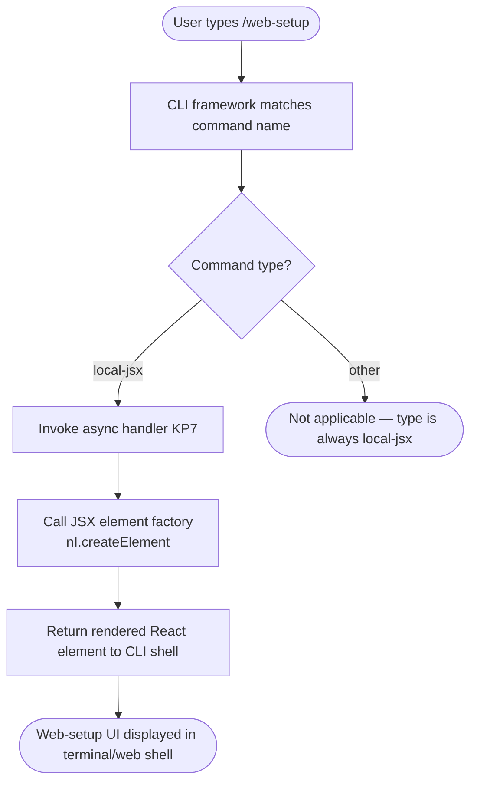

# `/web-setup`

> Analysis basis: CC v2.1.132 bundle.js (AST extraction + Claude interpretation)
> Minimum version: v2.1.132

---

## Overview

`/web-setup` is a local-jsx slash command that guides the user through setting up Claude Code in a web environment. Its core mechanism renders a JSX UI component that prompts the user to connect a GitHub account as a prerequisite for web-based operation. The command's handler is an async function that returns a React element tree rather than dispatching a text prompt to the agent.

---

## Registration

| Field | Value |
|---|---|
| type | `local-jsx` |
| name | `web-setup` |
| description | `Setup Claude Code on the web (requires connecting your GitHub account)` |
| isHidden | `null` (not hidden; appears in the slash-command menu) |
| module_id | `iwq` |
| load_inline | `true` |
| handler | `KP7` (async function; resolved via `module_id` path) |
| loc_byte span | `+11619873` – `+11620254` |
| `loc_byte_end` | `11620254` |
| `arbor_handler.name` | `KP7` |
| `arbor_handler.kind` | `AsyncFunction` |
| `arbor_handler.resolution_path` | `module_id` |
| `arbor_handler.fqn` | `claude-2.1.132::KP7` |
| `arbor_handler.n_hits` | `1` |

Analysis basis: CC v2.1.132 bundle.js:+11619873

---

## Input Branching

The command type is `local-jsx`, meaning the CLI framework calls the handler directly and renders whatever React element it returns. No user-supplied argument string is parsed. The sole branching present at depth ≤ 2 is the call from the handler into the JSX element factory.



Analysis basis: CC v2.1.132 bundle.js:+11619649 (call edge `KP7` → `nI.createElement`)

---

## Behavioral Spec

### Handler: Render Web-Setup UI Component

The handler is an `AsyncFunction` (`KP7`) resolved from module `iwq`. When invoked, it constructs and returns a JSX element (via the React-compatible element factory) that presents the web-setup onboarding flow to the user. Because the command type is `local-jsx`, the CLI shell is responsible for mounting and displaying the returned element; the handler itself does not write to stdout or dispatch a prompt to the language-model agent.

```
async function webSetupHandler(context):
    # Build and return a JSX element describing the web-setup UI.
    # The element is created via the React element factory.
    element = createElement(WebSetupComponent, context.props)
    return element
    # The CLI shell receives this element and renders it in the
    # active pane (terminal emulator or web shell).
```

Analysis basis: CC v2.1.132 bundle.js:+11619649

#### Key behavioural properties

- **No text prompt dispatched.** Because the type is `local-jsx`, no natural-language prompt is sent to the Claude model. The command is entirely UI-driven.
- **GitHub account connection required.** The description string explicitly states that connecting a GitHub account is a prerequisite. The UI component is expected to surface this requirement and provide the connection flow.
- **Async handler.** The handler is declared `async`, meaning it may perform awaited I/O (e.g. checking existing GitHub auth state) before returning the element. The depth-2 call graph does not reveal further async dependencies beyond the `createElement` call observed at `+11619649`.

<!-- TODO: internal logic of WebSetupComponent (e.g., OAuth flow steps, error states, success redirect) not found in depth-2 traversal; needs --depth 4 -->

---

## State & Side Effects

| Item | Detail |
|---|---|
| Telemetry | None detected at depth ≤ 2 (`telemetry: []`) |
| Hook registration | <!-- TODO: not found in depth-2 traversal; needs --depth 4 --> |
| appState changes | <!-- TODO: not found in depth-2 traversal; needs --depth 4 --> |
| GitHub OAuth side effect | Likely initiates or checks GitHub account connection (inferred from description); specific OAuth calls not visible at depth ≤ 2 |
| Sound | <!-- TODO: not found in depth-2 traversal; needs --depth 4 --> |
| Rendered output | Returns a React element tree to the CLI shell for display; no direct stdout writes from the handler |

---

## Version History

| Version | Change |
|---|---|
| v2.1.132 | Initial analysis |

---

## Common Mistakes

1. **Invoking `/web-setup` in a standard terminal-only environment without a web shell.** The command targets a web context; behaviour in a purely local terminal session without web-shell infrastructure is undefined by the data available at depth ≤ 2.
2. **Expecting a model-generated response.** Because the type is `local-jsx`, the command renders UI directly and does not send a prompt to the Claude model. Users should not expect a conversational reply.
3. **Skipping GitHub account connection.** The description explicitly calls out GitHub account connection as a requirement. Attempting to proceed through the setup flow without a connected GitHub account will likely stall or error at a step not visible in the current depth-2 traversal.
4. **Confusing `/web-setup` with a project-scaffold command.** Despite the name, this command is an onboarding/auth setup flow for the web environment, not a command that scaffolds web application files or directories.

---

## Appendix — Identifier Mapping

> For bundle debugging only. Identifiers change across versions.

| Identifier | Role |
|---|---|
| `KP7` | Async handler function for `/web-setup`; entry point resolved from module `iwq` via `module_id` resolution path (CC v2.1.132 bundle.js:+11619649) |