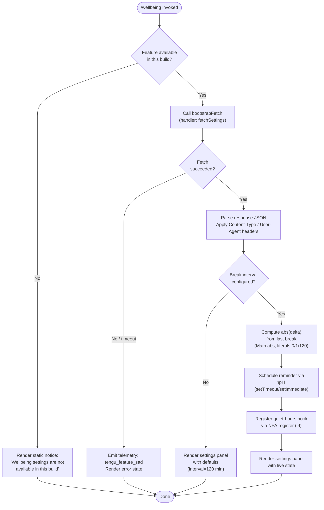

# `/wellbeing`

> Analysis basis: CC v2.1.168 bundle.js (AST extraction + Claude interpretation)
> Minimum version: v2.1.168

---

## Overview

`/wellbeing` (also reachable as `/breaks`, `/break-reminder`, or `/downtime`) is a local-JSX command that surfaces a UI panel for configuring optional break reminders and quiet-hours nudges. In builds where the feature is not compiled in, the handler immediately short-circuits and renders a static unavailability notice rather than the settings panel. The command is marked `immediate: true`, meaning it renders inline without dispatching an agent turn.

---

## Registration

| Field | Value |
|---|---|
| type | `local-jsx` |
| name | `wellbeing` |
| description | Configure optional break reminders and quiet-hours nudges |
| aliases | `breaks`, `break-reminder`, `downtime` |
| immediate | `true` |
| module_id | `U4K` |
| load_inline | `true` |
| loc_byte | `12764648` |
| loc_byte_end | `12764901` |
| loc_line | `9103` |
| arbor_handler.name | `ymf` |
| arbor_handler.fqn | `claude-2.1.168::ymf` |
| arbor_handler.kind | `AsyncFunction` |
| arbor_handler.resolution_path | `module_id` |
| arbor_handler.n_hits | `0` |

Analysis basis: CC v2.1.168 bundle.js:+12764648

---

## Input Branching

The handler has three distinct paths: feature unavailable in this build, settings retrieval/display, and timed break-interval arithmetic. A Mermaid flowchart is used.



Analysis basis: CC v2.1.168 bundle.js:+12763997 (handler entry `ymf`), +12763999 (unavailability literal), +12763732 (`Math.abs` for interval arithmetic), +12763682 (literal `120`)

---

## Behavioral Spec

### 1. Feature-Gate Check

When the command is invoked, the handler (`ymf`) immediately tests whether the wellbeing feature is compiled into the running build.

```
async function wellbeingHandler(context):
    if not featureIsAvailable():
        renderStaticText("Wellbeing settings are not available in this build")
        return
    // continue to settings flow
```

The unavailability string `"Wellbeing settings are not available in this build"` is hardcoded in the bundle.

Analysis basis: CC v2.1.168 bundle.js:+12763999

---

### 2. Bootstrap Fetch

When the feature is available, the handler delegates to `bootstrapFetch` (obfuscated: `H`), which performs an HTTP GET to retrieve remote wellbeing configuration.

```
async function bootstrapFetch(url, options):
    log("[Bootstrap] Fetching", url)
    response = await fetch(url, {
        headers: {
            "Content-Type": "application/json",
            "User-Agent": userAgentString
        },
        timeout: 5000
    })
    if not response.ok:
        emitTelemetry("api_bootstrap_fetch", { result: "parse_failed" })
        return null
    log("[Bootstrap] Fetch ok")
    return parseJSON(response)
```

- Timeout: 5000 ms (Analysis basis: CC v2.1.168 bundle.js:+15797859)
- Log prefix `"[Bootstrap] Fetching"` (Analysis basis: CC v2.1.168 bundle.js:+15797658)
- `"Content-Type": "application/json"` header (Analysis basis: CC v2.1.168 bundle.js:+15797743, +15797758)
- `"User-Agent"` header (Analysis basis: CC v2.1.168 bundle.js:+15797777)

---

### 3. Break-Interval Arithmetic

Once settings are available, the handler computes how much time has elapsed since the last break using an absolute-value calculation.

```
function computeBreakDelta(lastBreakTimestamp, now):
    rawDelta = now - lastBreakTimestamp    // may be negative on clock skew
    absDelta = Math.abs(rawDelta)
    if absDelta == 0:
        state = BREAK_JUST_TAKEN          // literal 0
    elif absDelta <= 1:
        state = BREAK_VERY_RECENT         // literal 1
    else:
        state = BREAK_OVERDUE             // default interval 120 minutes
    return state
```

- Literal `0` used as zero-elapsed sentinel (Analysis basis: CC v2.1.168 bundle.js:+12763846)
- Literal `1` used as near-zero sentinel (Analysis basis: CC v2.1.168 bundle.js:+12763858)
- Default reminder interval: **120 minutes** (Analysis basis: CC v2.1.168 bundle.js:+12763682)

---

### 4. Reminder Scheduler

The scheduler helper (`npH`) manages a setTimeout/setImmediate loop to fire break reminders at the configured interval.

```
function scheduleReminder(intervalMinutes, reminderQueues, onFire):
    clearTimeout(existingTimer)
    combined = joinQueues(reminderQueues)   // $.join, L.join, J.join
    if shouldFireImmediately(combined):
        setImmediate(() -> onFire(combined))
        queues.push(IMMEDIATE_MARKER)       // $.push
    else:
        timer = setTimeout(() -> {
            onFire(combined)
            queues.push(SCHEDULED_MARKER)   // $.push, L.push
            notifyListeners()               // D, w, Y callbacks
        }, intervalMinutes * 60 * 1000)
```

Analysis basis: CC v2.1.168 bundle.js:+59783 (`clearTimeout`), +59824 (`H`), +59947 (`setTimeout`), +60040 (`setImmediate`), +59982 (`$.push`)

---

### 5. Quiet-Hours Hook Registration

After scheduling reminders, the handler registers a quiet-hours hook via the hook-registration subsystem.

```
function registerQuietHoursHook(config):
    NPA.register({
        event: "quiet_hours_check",
        handler: quietHoursEvaluator,
        config: config
    })
```

Analysis basis: CC v2.1.168 bundle.js:+60369 (`NPA.register` via `j9`)

---

### 6. Persistent-Settings Write Path

User changes to wellbeing settings are persisted through the log/file-write subsystem (`_iK` → `HiK`).

```
async function persistSettings(settingsObj, targetPath):
    dir = path.dirname(targetPath)
    await fs.mkdir(dir, { recursive: true })
    encoded = Buffer.from(JSON.stringify(settingsObj))
    byteLen = Buffer.byteLength(encoded)
    await rotateLogs(targetPath)           // ll8: stat → rename → unlink
    await fs.appendFile(targetPath, encoded)
    trimToSizeLimit(targetPath, byteLen)   // O0A
```

- `.txt` extension used for rotated log segments (Analysis basis: CC v2.1.168 bundle.js:+205511)
- Rotation keeps last **4** segments (literal `4`, Analysis basis: CC v2.1.168 bundle.js:+205533)
- EISDIR error is caught and silently swallowed during rotation (Analysis basis: CC v2.1.168 bundle.js:+175692)

---

### 7. Feature-Sad Telemetry Path

If the settings fetch or panel initialization fails, the `tengu_feature_sad` event is emitted via the generic feature-failure reporter (`o6` → `l`).

```
function reportFeatureFailure(featureName, errorDetail):
    emitTelemetry("tengu_feature_sad", {
        feature: featureName,
        error: errorDetail
    })
```

Analysis basis: CC v2.1.168 bundle.js:+1011093

---

## State & Side Effects

| Item | Detail |
|---|---|
| Telemetry | `tengu_feature_sad` (emitted on fetch/init failure, bundle.js:+1011093) |
| Hook registration | `NPA.register` called to register quiet-hours evaluator hook (bundle.js:+60369) |
| Timer registration | `setTimeout` / `setImmediate` scheduled for break reminder fires (bundle.js:+59947, +60040) |
| Timer teardown | `clearTimeout` called on existing timer before rescheduling (bundle.js:+59783) |
| File system writes | Settings persisted via `fs.appendFile` with `fs.mkdir` (recursive) guard (bundle.js:+205836, +205895) |
| Log rotation | Old `.txt` segments renamed then unlinked; max 4 segments retained (bundle.js:+205563, +205533) |
| appState changes | None directly observed in depth-2 traversal |
| Sound | <!-- TODO: not found in depth-2 traversal; needs --depth 4 --> |

---

## Version History

| Version | Change |
|---|---|
| v2.1.168 | Initial analysis |

---

## Common Mistakes

1. **Using `/wellbeing` in CI or stripped builds** — The command will silently render the unavailability notice (`"Wellbeing settings are not available in this build"`) without any error exit code, which can confuse automated callers expecting a settings object.
2. **Expecting the aliases to behave differently** — `/breaks`, `/break-reminder`, and `/downtime` are pure name aliases; they invoke exactly the same handler (`ymf`) with identical behavior.
3. **Assuming the default interval is user-editable at CLI invocation time** — The 120-minute default is a hardcoded bundle literal; it can only be changed through the settings panel UI rendered by this command, not via command-line arguments.
4. **Ignoring the 5-second fetch timeout** — The bootstrap fetch will silently fail after 5000 ms in slow network environments, emitting `tengu_feature_sad` rather than surfacing a user-visible timeout error.
5. **Treating `immediate: true` as "no side effects"** — Despite not dispatching an agent turn, this command registers timers and hooks (`NPA.register`, `setTimeout`) that persist for the lifetime of the session.

---

## Appendix — Identifier Mapping

> For bundle debugging only. Identifiers change across versions.

| Identifier | Role |
|---|---|
| `kmf` | Module wrapper / export initializer for wellbeing module |
| `Imf` | Break-delta arithmetic helper (calls `Math.abs`) |
| `ymf` | Main wellbeing command handler (AsyncFunction, Arbor-resolved entry point) |
| `H` | Bootstrap fetch orchestrator |
| `v` | HTTP request builder / header assembler |
| `snK` | Response parser / content-type negotiator |
| `IPA` | Sub-parser delegating to `edK` / `HcK` |
| `RH` | JSON serializer (calls `JSON.stringify`) |
| `G4` | Path manipulation utility (extension extraction, lastIndexOf/slice) |
| `K0A` | Array-map helper over path segments |
| `EUH` | File-write dispatcher (calls `nWA`) |
| `nWA` | Low-level write wrapper (calls `H.write`) |
| `_iK` | Settings persistence coordinator |
| `npH` | Break-reminder scheduler (setTimeout / setImmediate loop) |
| `YKH` | Reminder-output formatter (joins queues, calls `t8`, `R6`) |
| `d6` | Directory resolver helper |
| `B76` | EISDIR-safe stat wrapper (calls `V8`) |
| `$0A` | Path joiner helper |
| `ll8` | Log rotation helper (stat → endsWith → rename → unlink) |
| `HiK` | Append-and-rotate writer (mkdir → appendFile → rotate) |
| `j9` | Quiet-hours hook registration shim (calls `NPA.register`) |
| `Y3` | Version / build metadata accessor |
| `mj_` | Query-string / argument splitter (split / trim / indexOf / slice) |
| `lHH` | Feature-flag set membership checker (calls `o74.has`) |
| `uj` | String sanitizer (calls `H.replace`) |
| `H9` | Top-level input processor (composes `m6H`, `s9`, `FJ`) |
| `m6H` | Token normalizer (calls `Q0`, `aqH`, `yA`, `qB`) |
| `qB` | Model-string classifier (anthropic-prefix detection, model tier mapping) |
| `s9` | Model-name resolver (trim / toLowerCase / tier lookup) |
| `Y2` | Canonical model-ID builder (calls `R4H`) |
| `h4H` | Model-tier inclusion checker (calls `y4H.includes`) |
| `CI` | Sonnet-family resolver (calls `lM`, `N5`) |
| `DdH` | Haiku-family resolver (calls `N5`) |
| `bT` | Opus-family resolver (calls `lM`, `N5`, `MA`) |
| `lP1` | "Best" alias resolver (delegates to `bT`) |
| `lM` | Provider-routing resolver (calls `MA`) |
| `NH8` | Allowed-model-list checker (calls `AKL.includes`) |
| `wdH` | Unknown-model fallback handler (calls `_6`) |
| `FJ` | Full model-string pipeline runner (calls `s9`, `_G`) |
| `_G` | Model-object assembler (composes tier, provider, display fields) |
| `o6` | Feature-failure reporter (emits `tengu_feature_sad`, calls `l`, `J6`) |
| `l` | Generic telemetry emitter |
| `J6` | Error-context builder (calls `hm6`) |
| `hm6` | Low-level error formatter |

---

Note: index built via Arbor fallback; some signals (telemetry, literals) may be missing — see arbor-fallback.js.