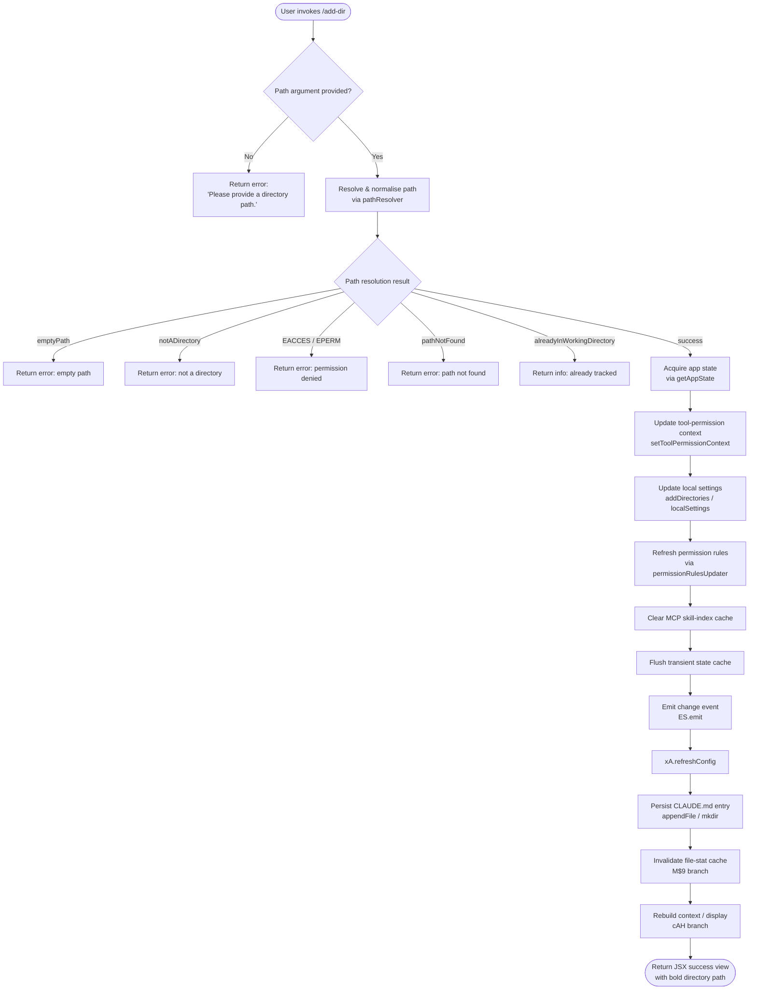

# `/add-dir`

> Analysis basis: CC v2.1.169 bundle.js (AST extraction + Claude interpretation)
> Minimum version: v2.1.169

---

## Overview

`/add-dir` adds a new working directory to the current Claude Code session. It accepts a filesystem path argument, validates and resolves it, updates the session's tool-permission context and local settings, then refreshes the configuration and MCP skill-index so the new directory is immediately available for file operations.

---

## Registration

| Field | Value |
|---|---|
| type | `local-jsx` |
| name | `add-dir` |
| description | `Add a new working directory` |
| argumentHint | `<path>` |
| module_id | `bFq` |
| load_inline | `true` |
| loc_byte | `11053015` |
| loc_byte_end | `11053163` |
| loc_line | `7283` |
| arbor_handler.name | `fWf` |
| arbor_handler.fqn | `claude-2.1.169::fWf` |
| arbor_handler.kind | `AsyncFunction` |
| arbor_handler.resolution_path | `module_id` |
| arbor_handler.n_hits | `0` |

Analysis basis: CC v2.1.169 bundle.js:+11053015

---

## Input Branching

The command produces 6+ distinct outcome branches based on path validation, filesystem state, and session constraints, so a Mermaid flowchart is used.



Analysis basis: CC v2.1.169 bundle.js:+11051749 – +11052571

---

## Behavioral Spec

### 1. Entry Point — `addDirHandler` (`fWf`)

The async handler is resolved from module `bFq` via the `load_inline` pattern. It is the root of the entire `/add-dir` execution tree.

```
async function addDirHandler(commandArgs, sessionContext):
    rawPath = commandArgs.trim()

    // --- Phase 1: path resolution ---
    resolveResult = resolveAndValidatePath(rawPath, sessionContext)
    if resolveResult is error:
        return renderErrorView(resolveResult.reason, resolveResult.message)

    // --- Phase 2: app-state acquisition ---
    appState = getAppState(sessionContext)
    workingDirs = findLastWorkingDirectoryEntry(appState)

    // --- Phase 3: permission-context update ---
    setToolPermissionContext(appState, "addDirectories", resolveResult.resolvedPath)

    // --- Phase 4: local settings patch ---
    updatedSettings = applyLocalSettings(appState, "localSettings", resolveResult.resolvedPath)
    refreshPermissionRules(updatedSettings)   // via permissionRulesUpdater (YO)

    // --- Phase 5: cache / index invalidation ---
    clearSkillIndexCache()                    // fp → H.clearSkillIndexCache
    flushTransientStateCache()                // ZS → jR8.clear
    invalidateFileStatEntries()               // M$9 branch

    // --- Phase 6: side effects ---
    ES.emit("addDirectories", resolveResult.resolvedPath)
    xA.refreshConfig()

    // --- Phase 7: CLAUDE.md persistence ---
    persistToClaudeMd(resolveResult.resolvedPath)   // p9A

    // --- Phase 8: context rebuild & render ---
    newContext = rebuildContextView(appState)        // cAH
    return renderSuccessView(resolveResult.resolvedPath, newContext)
```

Analysis basis: CC v2.1.169 bundle.js:+11051749

---

### 2. Path Resolution — `pathResolver` (`arH`)

Validates and resolves the raw path string provided by the user. All error codes found in literals are mapped to user-facing messages.

```
function resolveAndValidatePath(rawPath, sessionContext):
    if rawPath is empty:
        return Error { reason: "emptyPath",
                       message: "Please provide a directory path." }

    // Expand home-directory shorthand
    if rawPath starts with "~/":
        rawPath = join(homedir(), rawPath.slice(2))

    // Handle Windows-style paths if applicable (platform check)
    normalised = path.normalize(rawPath)

    // Resolve relative paths against CWD
    if not path.isAbsolute(normalised):
        normalised = path.resolve(normalised)

    // Null-byte guard
    if normalised contains null bytes:
        return Error { reason: "invalid",
                       message: "Path contains null bytes" }

    // Filesystem stat
    try:
        stat = IL9.stat(normalised)
    catch ENOENT:
        return Error { reason: "pathNotFound" }
    catch EACCES | EPERM:
        return Error { reason: "EACCES" / "EPERM" }

    if not stat.isDirectory():
        return Error { reason: "notADirectory" }

    // Check deduplication against existing working directories
    // (normalise /var/ → /tmp substitution for macOS symlinks)
    normalisedFinal = normaliseVarTmpPath(normalised)
    if normalisedFinal already in workingDirectories:
        return Error { reason: "alreadyInWorkingDirectory" }

    return Success { resolvedPath: normalisedFinal }
```

Analysis basis: CC v2.1.169 bundle.js:+3862795 (arH), +1056480 (k1/pathResolver), +3862874 (notADirectory), +3863019 (pathNotFound), +3863144 (alreadyInWorkingDirectory), +3863220 (success)

---

### 3. Permission-Rules Update — `permissionRulesUpdater` (`YO`)

After the path is resolved, tool-permission rules are rebuilt to include the new directory.

```
function refreshPermissionRules(localSettings):
    // Evaluate "setMode" instructions; reject bypassPermissions if disableBypassPermissionsMode
    for instruction in localSettings.permissionInstructions:
        if instruction.type == "setMode" and instruction.value == "bypassPermissions":
            if disableBypassPermissionsMode or not launchedInBypassMode:
                log("Ignoring permission update: setMode 'bypassPermissions' rejected …")
                continue

    // Rebuild allow / alwaysAllowRules / deny / alwaysDenyRules / alwaysAskRules
    mergedRules = merge(
        existing.addRules,
        existing.replaceRules,
        existing.removeRules,
        newDirectory.allow,
        newDirectory.deny
    )

    // Persist removeDirectories cleanup
    pruneRemovedDirectories(mergedRules)
    return mergedRules
```

Analysis basis: CC v2.1.169 bundle.js:+5066739 (YO), +5066741 (bypassPermissions rejection message), +5067017 (addRules), +5067365 (replaceRules), +5068022 (removeRules), +5068406 (removeDirectories)

---

### 4. CLAUDE.md Persistence — `claudeMdWriter` (`p9A`)

The new directory path is recorded in the project's `CLAUDE.md` file (or the user-level equivalent).

```
async function persistToClaudeMd(resolvedPath):
    // Determine target file: production vs test environment
    env = getEnvironment()   // "production" | "test"
    targetFile = path.join(J$, resolvedPath, "CLAUDE.md")

    // Normalize unicode (NFC)
    normPath = SO.normalize(resolvedPath, "NFC")

    // Resolve real path (symlink-safe)
    realPath = uK.realpath(normPath)

    // Read existing content (utf8); create dirs if missing (mode 448 octal / 0o700)
    try:
        existing = uK.readFile(targetFile, "utf8")
    catch ENOENT:
        uK.mkdir(path.dirname(targetFile), { recursive: true, mode: 448 })
        existing = ""

    // Append directory entry (mode 384 octal / 0o600 for new file)
    uK.appendFile(targetFile, buildEntry(resolvedPath))
```

Analysis basis: CC v2.1.169 bundle.js:+13330121 (p9A), +13330157 (uK.realpath), +13330344 (uK.readFile), +13330440 (uK.mkdir), +13330521 (uK.appendFile), +13330482 (mode 448), +13330549 (mode 384), +180046 (SO.normalize NFC)

---

### 5. File-Stat Cache Invalidation — `fileStatInvalidator` (`M$9`)

Ensures the new directory's contents are not served from a stale cache.

```
function invalidateFileStatEntries(resolvedPath):
    // Delete any cached stat for the added path
    deleteFromStatCache(resolvedPath)      // zj → vfH.delete

    // Re-stat files under the new root and update cache
    for file in enumerateNewDir(resolvedPath):   // jq
        try:
            stat = HW.stat(file)
            updateStatCache(file, stat)           // vfH.set
        catch:
            removeFromPendingSet(file)            // PjH.delete
            removeFromStatCache(file)             // vfH.delete

    // If background state is transient, clear entirely
    if isTransientState():                        // telemetry: tengu_bg_state_read_transient
        vfH.clear()

    // Commit updated index
    commitIndex(resolvedPath)                     // If → HO
```

Analysis basis: CC v2.1.169 bundle.js:+4185721 (M$9/zj), +4185739 (jq), +4182205 (vfH.delete), +4182344 (HW.stat), +4183160 (vfH.set), +4183377 (vfH.clear), +4185904 (If)

---

### 6. Context Rebuild & Render — `contextAndViewBuilder` (`cAH`)

After all mutations, the UI context is rebuilt from the updated settings and the success JSX is composed.

```
function rebuildContextAndRender(appState, resolvedPath):
    // Reload settings layers: policySettings, userSettings, projectSettings
    policyCtx  = loadSettingsLayer("policySettings")   // y8 → Ho6
    userCtx    = loadSettingsLayer("userSettings")
    projectCtx = loadSettingsLayer("projectSettings")

    // Build merged context (AW9)
    mergedContext = buildMergedContext(policyCtx, userCtx, projectCtx)

    // Filter tools visible from new directory
    filteredTools = mergedContext.tools.filter(t => isAccessible(t, resolvedPath))

    // Compose JSX output
    //   - Bold line: resolved directory path       (J6.bold @ +11052047)
    //   - Dim hint:  "· /permissions to manage"    (J6.dim  @ +11052333)
    //   - On error:  "Did not add a working directory." (+11052476)
    //   - On unknown error: "Unknown error"         (+11052232)

    if error:
        return JSX ErrorView("Did not add a working directory.")
    return JSX SuccessView(bold(resolvedPath), dim("· /permissions to manage"))
```

Analysis basis: CC v2.1.169 bundle.js:+11052029 (cAH), +5068873 (yR_), +5068815 (userSettings), +5068835 (projectSettings), +5064889 (policySettings), +11052047 (J6.bold), +11052333 (J6.dim), +11052340 ("· /permissions to manage"), +11052476 ("Did not add…"), +11052232 ("Unknown error")

---

### 7. `--add-dir` CLI Flag Mirroring

The literal `"--add-dir"` (bundle.js:+11051999) indicates the same directory-addition logic is reachable via a CLI flag as well as the slash command. Both paths converge on the same handler (`fWf`).

---

## State & Side Effects

| Item | Detail |
|---|---|
| Telemetry — `tengu_feature_ok` | Fired on successful feature execution (bundle.js:+1013926) |
| Telemetry — `tengu_feature_sad` | Fired on feature execution producing a sad/no-op outcome (bundle.js:+1014069) |
| Telemetry — `tengu_feature_bad` | Fired on feature execution error (bundle.js:+1013988) |
| Telemetry — `tengu_disable_bypass_permissions_mode` | Fired when a `bypassPermissions` setMode is rejected (bundle.js:+4227303) |
| Telemetry — `tengu_bg_state_read_transient` | Fired when background state is detected as transient during cache invalidation (bundle.js:+4182694) |
| Telemetry — `tengu_daemon_config_reload` | Fired when daemon config is reloaded after directory addition (bundle.js:+16521994) |
| `setToolPermissionContext` | Updates in-memory permission context to include the new directory path (bundle.js:+11051859) |
| `ES.emit` event | Emits an `addDirectories` change event to all listeners (bundle.js:+11051959) |
| `xA.refreshConfig` | Triggers a full config refresh cycle (bundle.js:+11051969) |
| `jR8.clear` (transient state flush) | Clears the transient session-state cache (bundle.js:+10708354) |
| `H.clearSkillIndexCache` | Invalidates the MCP skill-index so newly accessible tools are re-indexed (bundle.js:+13315774) |
| File: CLAUDE.md | Appended (or created) with the new directory entry; parent directory created with mode `0o700` (448), file written with mode `0o600` (384) |
| File-stat cache (`vfH`) | Invalidated for the new directory; fully cleared if transient state is detected |
| `localSettings` | Patched in-memory with `addDirectories` entry |
| Permission rules | `alwaysAllowRules`, `alwaysDenyRules`, `alwaysAskRules` rebuilt via `YO` |
| MCP connections | Not restarted; existing connections preserved; MCP manager (`M`) re-queries accessible directories |

---

## Version History

| Version | Change |
|---|---|
| v2.1.169 | Initial analysis |

---

## Common Mistakes

1. **Providing a file path instead of a directory path** — The handler calls `stat` and checks `isDirectory()`; passing a file path returns a `notADirectory` error and the directory is not added.
2. **Providing a path that is already in the working directory list** — The deduplication check (after macOS `/var/` → `/tmp` normalisation) returns `alreadyInWorkingDirectory` silently; no duplicate is added but there is no confirmation either.
3. **Providing a path without execute permission** — `EACCES` or `EPERM` from `stat` produces a permission-denied error. The session must have read+execute rights on the target directory.
4. **Expecting the command to work without an argument** — Omitting the `<path>` argument returns "Please provide a directory path." (bundle.js:+3863305) and performs no state change.
5. **Assuming `bypassPermissions` mode is automatically granted** — If `disableBypassPermissionsMode` is set or the session was not launched in `bypassPermissions` mode, any permission rule requesting that mode is silently dropped (bundle.js:+5066741).
6. **Using a tilde-only path (`~`) without a trailing slash** — The home-directory expansion requires the `~/` prefix form; a bare `~` may not be expanded correctly on all platforms.

---

## Appendix — Identifier Mapping

> For bundle debugging only. Identifiers change across versions.

| Identifier | Role |
|---|---|
| `fWf` | Main handler for `/add-dir` (`addDirHandler`); async entry point |
| `u_` | App-state accessor helper (`getAppStateHelper`) |
| `N` | General notification / logging utility |
| `ItK` | Inner notification formatter |
| `CH` | JSON serialisation helper |
| `R4` | String path-segment formatter |
| `rBH` | Locale/escape helper (`lEA` caller) |
| `StK` | Buffer-length / chunked content helper |
| `w2_` | String split-and-trim utility |
| `u6H` | Set membership checker (`vO4.has` wrapper) |
| `n3` | String replacement helper |
| `M9` | Model-name normaliser |
| `Cc` | Model-name component classifier |
| `c9` | Model-name slug builder |
| `eD` | Model-name entity decorator |
| `o6` | Feature-flag evaluator |
| `K6` | Feature-flag inner resolver |
| `US8` | Allowed-tools list builder |
| `BS8` | Disallowed-tools list builder |
| `Jb` | Bypass-permissions mode disabler |
| `D6` | Permission-mode state machine |
| `VL8` | Permission-mode cache updater |
| `y6` | Permission-mode event recorder |
| `YO` | Permission-rules updater (addRules / replaceRules / removeRules) |
| `U5` | Path escape/replaceAll helper |
| `Yh4` | Backslash escaper for paths |
| `pT` | Permission context accessor |
| `Y` | MCP supervisor / transport manager |
| `ITH` | MCP ENOENT / config-error handler |
| `C9` | Async-local store reader |
| `E8` | Error-code extractor |
| `N$A` | Error normaliser |
| `EH` | String error coercer |
| `BOK` | MCP tool column-width calculator |
| `T` | MCP transport stop wrapper |
| `OZ6` | Transport stop primitive |
| `M76` | Transport lifecycle manager |
| `E` | MCP connection config updater |
| `G` | MCP connection lifecycle handler |
| `hH` | MCP hook executor |
| `wA` | Error string builder |
| `edK` | Heartbeat scheduler |
| `W_H` | Heartbeat interval handler |
| `V` | MCP client start wrapper |
| `zZH` | Session-context helper |
| `jV` | Skill-index refresh orchestrator |
| `fp` | Skill-index cache clearer |
| `ZR8` | Skill-index sub-refresher A |
| `jpq` | Skill-index sub-refresher B |
| `_uH` | Skill-index loader |
| `BS6` | Skill-index persistent-cache reader |
| `pS6` | Skill-index cache-miss handler |
| `m3H` | Secondary cache refresh helper |
| `TR8` | Tertiary cache refresh helper |
| `ZS` | Transient-state cache flusher (`jR8.clear`) |
| `p9A` | CLAUDE.md persistence writer |
| `B$H` | Environment/config resolver |
| `_6` | String coercion primitive |
| `rDK` | Config key resolver |
| `ex` | Config value extractor |
| `tvH` | Config theme/colour helper |
| `tW` | Theme walker |
| `hM` | Theme selector |
| `SO` | Unicode NFC normaliser |
| `k8` | Error-code classifier |
| `rR` | Path existence checker (xZ caller) |
| `xZ` | Filesystem existence primitive |
| `G_` | Path existence / glob helper |
| `M$9` | File-stat cache invalidator |
| `zj` | Stat-cache single-entry deleter |
| `jq` | Stat-cache bulk updater |
| `Bf` | Stat-cache error classifier |
| `F6` | JSON.parse wrapper |
| `If` | Stat-index commit writer |
| `HO` | Atomic file writer (randomBytes + rename) |
| `wz` | Stat-cache watcher guard |
| `cAH` | Context rebuild and JSX view composer |
| `yR_` | Settings-layer pre-loader |
| `AW9` | Merged-context builder |
| `dG6` | Policy-settings loader |
| `y8` | Settings-layer reader |
| `V97` | Settings-merge accumulator |
| `V$` | Settings-entry validator |
| `c3` | Real-path resolver for settings |
| `l6` | Filesystem lstat helper |
| `G2` | Directory entry expander |
| `I97` | Settings-layer index builder |
| `W3` | Settings-path formatter |
| `wh4` | Settings-path prefix handler |
| `rT` | Object.hasOwn wrapper |
| `Jh4` | Settings substring extractor |
| `Dh4` | Settings path replaceAll helper |
| `M` | MCP manager / connection registry |
| `mSH` | MCP server connection orchestrator |
| `cd8` | MCP connection result applier |
| `$` | MCP state selector |
| `dXA` | MCP directory-aware connection builder |
| `t_` | Settings-file writer (CLAUDE.md / gitignore) |
| `W9_` | Gitignore rule builder |
| `YB` | Settings file I/O orchestrator |
| `y1_` | Settings write timestamp recorder |
| `_vH` | Settings file pre-write validator |
| `WO6` | Atomic file write helper (lstat + rename) |
| `yO` | Settings in-memory cache clearer |
| `Or6` | Settings file appender / creator |
| `ku` | `.claude/settings.json` path builder |
| `SH` | Settings-write ok reporter |
| `bH` | Settings-write bad reporter |
| `DB` | Settings disk-load dispatcher |
| `arH` | Path resolution and validation entry (`resolveAndValidatePath`) |
| `k1` | Core path resolver (home-expand, normalise, stat) |
| `C6` | Async-local context reader |
| `Wi6` | Store getter |
| `Zs` | Path existence gate |
| `fV` | macOS /var/→/tmp path normaliser |
| `YC6` | Platform-specific path rule builder |
| `cz` | Path lowercaser |
| `d6H` | Path deduplication helper |
| `srH` | Success/error JSX view renderer |