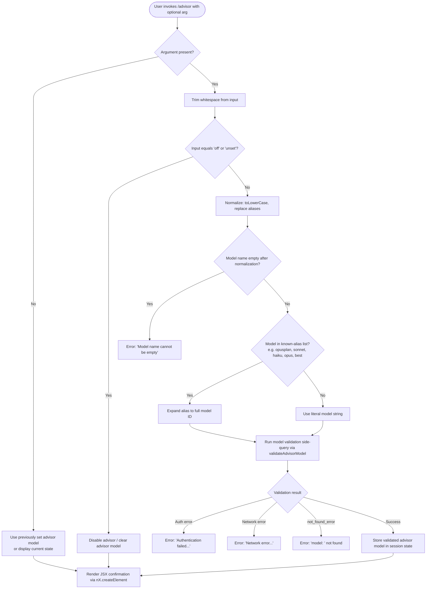

# `/advisor`

> Analysis basis: CC v2.1.169 bundle.js (AST extraction + Claude interpretation)
> Minimum version: v2.1.169

---

## Overview

The `/advisor` command allows the active Claude session to consult a stronger (or alternative) model at key decision points during an ongoing task. It configures a "side query" advisor pattern: when invoked, a secondary model is selected and validated, then queries are dispatched to it asynchronously alongside the main conversation. This enables the primary agent to delegate hard sub-problems to a more capable model without replacing the main model.

---

## Registration

| Field | Value |
|---|---|
| type | `local-jsx` |
| name | `advisor` |
| description | `Let Claude consult a stronger model at key moments` |
| loc_byte | `12791521` |
| loc_byte_end | `12791762` |
| loc_line | `9127` |
| argumentHint | `null` |
| isHidden | `null` |
| module_id | `gfK` |
| load_inline | `true` |
| arbor_handler.name | `Sgf` |
| arbor_handler.fqn | `claude-2.1.169::Sgf` |
| arbor_handler.kind | `AsyncFunction` |
| arbor_handler.resolution_path | `module_id` |
| arbor_handler.n_hits | `1` |

Analysis basis: CC v2.1.169 bundle.js:+12791521

---

## Input Branching

The command has four or more distinct branches based on the user-supplied model string and the current advisor state, making a Mermaid flowchart the appropriate representation.



Analysis basis: CC v2.1.169 bundle.js:+12791521, +12790977, +12791013, +12791053, +12791064, +12783192, +12783229, +12783928, +12784030, +12784149

---

## Behavioral Spec

### Top-Level Handler: `advisorCommandHandler` (`Sgf`)

The handler is an `AsyncFunction` resolved via `module_id → gfK` by the Arbor symbol graph.

```
async function advisorCommandHandler(commandInput, appContext):
    rawArg = commandInput.trim()                      // +12790977

    if rawArg equals "off" or rawArg equals "unset":  // +12791053, +12791064
        disableAdvisor(appContext)
        return renderAdvisorStatus(appContext)

    normalizedModel = resolveModelAlias(rawArg)       // calls c9 / normalizeModelName

    if normalizedModel is empty:
        throw Error("Model name cannot be empty")     // +12783229

    validationResult = await validateAdvisorModel(normalizedModel, appContext)  // calls im8

    if validationResult.error:
        return renderError(validationResult.error)

    storeAdvisorModel(appContext, normalizedModel)    // writes to session/app state
    return renderAdvisorStatus(appContext)            // nX.createElement  +12791013
```

Analysis basis: CC v2.1.169 bundle.js:+12790977, +12791013, +12791131, +12791145, +12791171

---

### Sub-feature: Model Alias Resolution (`normalizeModelName`, `c9`)

Accepts raw user input and maps well-known short aliases to canonical model IDs, with a safety normalization pass.

```
function normalizeModelName(rawInput):
    trimmed = rawInput.trim()                          // +2252078
    lower   = trimmed.toLowerCase()                    // +2252089

    // Replace internal alias tokens
    if lower includes "[1m]":                          // +2252200
        lower = lower.replace("[1m]", ...)

    // Expand named aliases
    switch lower:
        case "opusplan":  return expand("opusplan")   // +2252174
        case "sonnet":    return expand("sonnet")      // +2252215
        case "haiku":     return expand("haiku")       // +2252254
        case "opus":      return expand("opus")        // +2252293
        case "best":      return expand("best")        // +2252330

    // Strip disallowed character sequences via regex replace  // +2252117, +2252420
    return sanitized(lower)
```

Analysis basis: CC v2.1.169 bundle.js:+2252078, +2252089, +2252107, +2252117, +2252174, +2252200, +2252215, +2252254, +2252293, +2252330

---

### Sub-feature: Advisor Model Validation (`validateAdvisorModel`, `im8`)

Fires a lightweight "model_validation" side query against the configured API endpoint to confirm the requested model is accessible before committing the advisor choice.

```
async function validateAdvisorModel(modelName, appContext):
    trimmedName = modelName.trim()                           // +12783192

    if trimmedName is empty:
        throw Error("Model name cannot be empty")            // +12783229

    lower = trimmedName.toLowerCase()                        // +12783352

    // Check exclusion list (GLH)
    if GLH_exclusionList.includes(lower):                    // +12783371, +12783473
        return { error: "model not allowed" }

    // Cache check: mfK map
    if modelValidationCache.has(lower):                      // +12783473
        return modelValidationCache.get(lower)

    // Build minimal validation request tagged "model_validation"  // +12783568
    request = buildSideQueryRequest({
        model: trimmedName,
        tag:   "model_validation",
        messages: [{ role: "user", content: "Hi" }],         // +12783637
        cacheControl: "ephemeral"                             // +12783662
    })

    // Dispatch via the side-query pipeline (qp)             // +12783518
    try:
        result = await dispatchSideQuery(request, appContext)
        // Build advisor model entry via Ggf/Tgf              // +12783722, +12783777
        entry = buildAdvisorEntry(result, modelName)
        // Normalise alias variants (opus-4-8..sonnet-4-5)    // +12784450..+12784875
        entry = normaliseKnownAliases(entry)
        modelValidationCache.set(lower, entry)               // +12783681
        return entry
    catch AuthError:
        return { error: "Authentication failed. Please check your API credentials." }  // +12783928
    catch NetworkError:
        return { error: "Network error. Please check your internet connection." }      // +12784030
    catch APIError where error.type == "not_found_error":                              // +12784149
        return { error: "model: " + modelName }              // +12784168, +12784231
```

Analysis basis: CC v2.1.169 bundle.js:+12783192, +12783229, +12783352, +12783371, +12783473, +12783518, +12783568, +12783637, +12783662, +12783681, +12783722, +12783777, +12783928, +12784030, +12784149, +12784231

---

### Sub-feature: Side Query Dispatch (`dispatchSideQuery`, `qp`)

Central async pipeline that sends advisor/validation queries to the API and returns structured results. Called by `validateAdvisorModel`; re-uses the general `side_query` mechanism.

```
async function dispatchSideQuery(request, appContext):
    // Tag request as "side_query"                             // +13634594
    request.tag = "side_query"

    // Locate matching message context via ptf                 // +13634748
    contextMessages = findRelevantMessages(request)

    // Compute content hash via rzA (sha256, hex)              // +13634757, +13581921, +13581936
    contentHash = sha256hex(request.content)

    // Apply context-window limit via Math.min                 // +13635404
    trimmedContext = trimToContextLimit(contextMessages)

    // Build API payload (K_8 / buildRequestPayload)           // +13635129
    payload = buildRequestPayload({
        model:    request.model,
        messages: trimmedContext,
        tag:      "side_query"
    })

    // Dispatch through QB (main API call function)            // +13634562
    response = await makeAPICall(payload, appContext)

    // Record performance metrics                              // +13636011, +13636147
    recordTiming(performance.now(), Date.now())

    // Apply cache-control if configured                       // +13636670
    applyCacheControl(response)

    return response
```

Known alias constants handled in the validation normalizer:

| Alias variant | Canonical form |
|---|---|
| `"opus-4-8"` / `"opus_4_8"` | resolved internally (bundle.js:+12784498, +12784522) |
| `"opus-4-7"` / `"opus_4_7"` | resolved internally (bundle.js:+12784567, +12784591) |
| `"opus-4-6"` / `"opus_4_6"` | resolved internally (bundle.js:+12784636, +12784660) |
| `"opus-4-5"` / `"opus_4_5"` | resolved internally (bundle.js:+12784705, +12784729) |
| `"sonnet-4-6"` / `"sonnet_4_6"` | resolved internally (bundle.js:+12784774, +12784800) |
| `"sonnet-4-5"` / `"sonnet_4_5"` | resolved internally (bundle.js:+12784849, +12784875) |

Analysis basis: CC v2.1.169 bundle.js:+13634562, +13634594, +13634643, +13634748, +13635129, +13636011, +13636147, +13636670

---

### Sub-feature: Output Rendering (`advisorStatusRender`, `H` / `oV6`)

After a successful model set or disable, the handler renders a JSX component describing the current advisor configuration.

```
function renderAdvisorStatus(appContext):
    currentAdvisor = appContext.advisorModel

    // Lowercase+include check via oV6                         // +12791219, +7289128, +7289151
    displayName = formatModelName(currentAdvisor)

    // Join display segments                                    // +12791288
    segments = buildDisplaySegments(displayName)
    return nX.createElement(AdvisorStatusComponent, { segments })  // +12791013
```

Analysis basis: CC v2.1.169 bundle.js:+12791013, +12791171, +12791219, +12791288

---

## State & Side Effects

| Item | Detail |
|---|---|
| Telemetry — `tengu_api_success` | Fired on successful API call return in side-query pipeline (bundle.js:+13636175) |
| Telemetry — `tengu_prompt_cache_1h_config` | Fired when 1-hour prompt-cache configuration is applied to the advisor request (bundle.js:+13588326) |
| Telemetry — `tengu_lone_surrogate_sanitized` | Fired when surrogate characters are found and sanitized in side-query content (bundle.js:+13635924) |
| Telemetry — `tengu_feature_sad` | Fired on certain feature-level failure paths reached via `o6 → d` (bundle.js:+1014069) |
| Telemetry — `tengu_daemon_yield` | Fired when daemon yields to foreground process (background worker path, bundle.js:+16526217) |
| Telemetry — `tengu_bg_retire_pinned_low_mem` | Fired during low-memory background worker retirement (bundle.js:+16511127) |
| Telemetry — `tengu_bg_prewarm_per_sweep` | Fired per background-worker prewarm sweep (bundle.js:+16511248) |
| Model validation cache | Validation results are stored in the `mfK` Map to avoid redundant API calls (bundle.js:+12783473, +12783681) |
| appState — advisor model | Successful validation writes the resolved model name into session/app state for future use by the primary agent |
| Side-query request header | Requests are tagged with `"side_query"` (bundle.js:+13634594) and include session/agent identity headers |
| Network — API call | `fetch` (via `MlH`) to `https://api.anthropic.com` (bundle.js:+2306148), with `AbortSignal.timeout` of 10 000 ms (bundle.js:+2306251, +2306271) |
| Prompt cache | Cache control set to `"ephemeral"` for validation probes (bundle.js:+12783662); `"1h"` cache variant also available (bundle.js:+13635446) |
| Sound | <!-- TODO: not found in depth-2 traversal; needs --depth 4 --> |

---

## Version History

| Version | Change |
|---|---|
| v2.1.169 | Initial analysis |

---

## Common Mistakes

1. **Passing an unsupported model name**: If the model identifier is not recognized by the API, the validation side-query returns a `not_found_error` and the advisor is not activated. Verify the exact model ID against the alias table above.
2. **Forgetting to disable before switching**: The advisor state persists for the session. Run `/advisor off` or `/advisor unset` (bundle.js:+12791053, +12791064) before changing to a different advisor model to avoid residual state.
3. **Using shorthand aliases that resolve ambiguously**: Aliases such as `"best"`, `"sonnet"`, or `"opus"` are expanded at runtime (bundle.js:+2252293, +2252215, +2252330). The expanded model may differ across CC versions; supply full model IDs (e.g. `claude-opus-4-5`) for reproducible behavior.
4. **API credentials not configured**: The validation probe uses the same credential chain as the main session. If `ANTHROPIC_API_KEY` (bundle.js:+3008134) or OAuth is missing, validation will return an authentication failure and the advisor will not be set.
5. **Invoking inside a non-interactive / background subprocess**: The command renders JSX output; in headless or piped-output contexts this may produce unexpected raw markup rather than formatted text.

---

## Appendix — Identifier Mapping

> For bundle debugging only. Identifiers change across versions.

| Identifier | Role |
|---|---|
| `Sgf` | Top-level `/advisor` command handler (AsyncFunction) |
| `im8` | Advisor model validator — fires validation side-query, caches result |
| `Ggf` | Advisor entry builder — constructs advisor model object from validation response |
| `Tgf` | Known-alias normaliser — maps opus/sonnet variant strings to canonical IDs |
| `oV6` | Model name display formatter — lowercase + inclusion check for render |
| `c9` | Model name alias resolver / normalizer (trim, toLowerCase, alias expansion) |
| `qp` | Side-query dispatch pipeline — main async API call orchestrator |
| `QB` | Core API call function — handles auth headers, OAuth, retry, streaming |
| `im8` | (see above) |
| `mSH` | MCP server connection manager — enumerate/connect configured servers |
| `cd8` | MCP connection result applier — applies connection state updates |
| `dXA` | MCP client configuration enumerator |
| `PRH` | Request payload builder for side queries |
| `K_8` | API request payload assembler (model, messages, context) |
| `MlH` | HTTP fetch wrapper — calls Anthropic API with timeout and auth |
| `sDH` | WIF token exchange / credential resolver for non-key auth |
| `Vt6` | Proxy auth helper executor |
| `$ZL` | SSE / event-stream response handler |
| `EY` | API response chunk processor |
| `wZH` | Model ID prefix checker (startsWith scan against known prefixes) |
| `_ZL` | Stream state manager |
| `IY` | API request header builder (x-app, session IDs, agent IDs) |
| `_j` | OAuth / credential selection logic |
| `HZL` | OAuth token refresh helper |
| `yIH` | Context message builder for side queries |
| `i1` | Inference-profile model string handler |
| `Rh` | Model family resolver (e.g. claude-3-* routing) |
| `N2_` | Model capability lookup |
| `kIH` | HIPAA-mode model filter |
| `wK8` | Temperature and sampling parameter injector |
| `b2` | Message content mapper |
| `sPH` | Side-query message payload finalizer |
| `iB` | Random request-ID generator |
| `FL` | Request finalizer |
| `oEA` | Context pruner (removes excess turns from context window) |
| `Ug6` | Context rewriter (normalizes content arrays) |
| `fh` | Deep-clone utility (structuredClone wrapper) |
| `rzA` | SHA-256 content hasher for cache keying |
| `CW6` | Prompt-cache annotation applier |
| `ll` | Agent-type context resolver |
| `HrL` | Agent identifier string parser (agent:builtin:, agent:custom:, agent:) |
| `au` | Thread-context classifier (repl_main_thread check) |
| `hH` | Error/log event emitter |
| `G1` | Telemetry counter helper |
| `c76` | Low-level event recording primitive |
| `sOH` | API success metrics recorder |
| `Wf6` | Cache-control header writer |
| `d_` | Object deep-differ / entry extractor |
| `N68` | Tool-input serializer (JSON.stringify wrapper) |
| `QcH` | Content block formatter |
| `AE` | Message role formatter |
| `dG1` | Turn assembler |
| `zM` | Token counter / content-length tracker |
| `YA` | String-to-token estimator |
| `F5` | Content block array builder |
| `fLL` | Text block constructor |
| `pD1` | Tool-result block constructor |
| `v68` | Image / media block handler |
| `Mk` | Multi-block message assembler |
| `__8` | Disallowed-sequence checker |
| `dcH` | Character sanitizer |
| `Cc` | Message validation helper |
| `eD` | Role-normalizer |
| `M9` | Conversation turn builder |
| `n3` | Content string replacer |
| `u6H` | Seen-model-ID set membership check |
| `w2_` | Query-string / header parser |
| `ZLH` | Unicode normalization helper |
| `_6` | String coercion utility |
| `u2` | Text encoding helper |
| `TLH` | Model-tier inclusion checker |
| `StK` | File-context loader (dirname, byteLength, buffer) |
| `R4` | Redacted-content handler |
| `rBH` | Model log-entry builder |
| `N` | Context/message formatter (debug, toUpperCase, trim) |
| `ItK` | Verbose debug logger |
| `sBH` | Structured log emitter |
| `CH` | JSON serializer wrapper |
| `P$` | Bootstrap response parser |
| `H` | Bootstrap / HTTP fetch context object |
| `M` | MCP server registry / client map |
| `mw8` | MCP tool descriptor builder |
| `q` | Abort-controller / signal queue |
| `$1` | CLI error exit handler |
| `L` | Pending-request tracker (add/delete/finally) |
| `A` | Generic string/array utility (trim, map, toLowerCase) |
| `f` | Process / stream handle |
| `K` | Column padding / display row builder |
| `D6` | Token-usage accounting |
| `E` | Math clamp utility (max/min) |
| `O0` | OAuth token acquirer |
| `aDH` | Request timing wrapper |
| `qi8` | Timestamp recorder |
| `dj6` | Header lowercase normalizer |
| `FwH` | SDK error console logger |
| `qK8` | Model + session context assembler |
| `Ic` | Response validator |
| `Xk1` | Streaming chunk accumulator |
| `gp1` | Azure Cognitive Services credential helper |
| `h` | Background-worker sweep / lifecycle manager |
| `R` | Output stream writer |
| `NIH` | Parallel request limiter |
| `_K8` | Request pre-processor |
| `AK8` | Request post-processor |
| `T` | Token store accessor |
| `X` | Request timeout wrapper |
| `W` | Active-request registry |
| `zRH` | TeammateMailbox message-reader |
| `ptf` | Message-context finder (find by role/type) |
| `SK` | String padding / formatting utility |
| `A_8` | Agent store accessor (rG1.getStore) |
| `lO_` | Session context loader |
| `QL8` | YA-based token estimator variant |
| `yA` | Request mode selector (IY/kC/D9) |
| `ui8` | Cache-hit detector |
| `mi8` | Context-window suffix checker |
| `Rv` | Model routing helper (N2_, kIH) |
| `yjK` | Tool-call serializer |