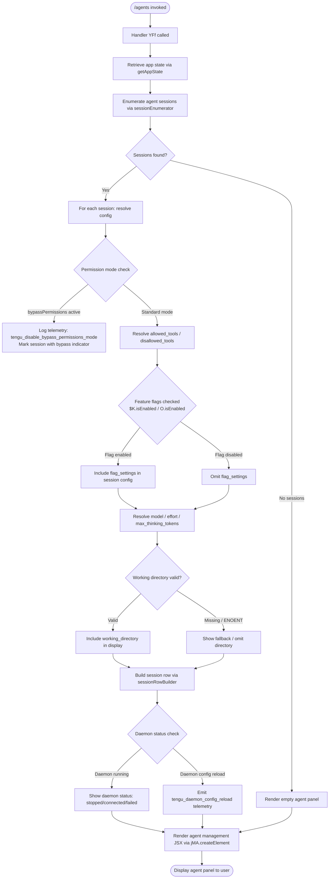

# `/agents`

> Analysis basis: CC v2.1.169 bundle.js (AST extraction + Claude interpretation)
> Minimum version: v2.1.169

---

## Overview

The `/agents` command provides a management interface for agent configurations within Claude Code. It renders a JSX-based UI component (type `local-jsx`) that allows users to inspect, configure, and control agent sessions, including their tool permissions, model settings, working directories, and daemon lifecycle. The command's async handler (`YFf`) coordinates app-state retrieval, session enumeration, permission checks, and daemon control operations to build the interactive management panel.

---

## Registration

| Field | Value |
|---|---|
| type | `local-jsx` |
| name | `agents` |
| description | `Manage agent configurations` |
| module_id | `w7K` |
| load_inline | `true` |
| loc_byte | `12724737` |
| loc_byte_end | `12724862` |
| loc_line | `9104` |
| arbor_handler.name | `YFf` |
| arbor_handler.fqn | `claude-2.1.169::YFf` |
| arbor_handler.kind | `AsyncFunction` |
| arbor_handler.resolution_path | `module_id` |
| arbor_handler.n_hits | `0` |

Analysis basis: CC v2.1.169 bundle.js:+12724737

---

## Input Branching

The command exhibits several distinct branches based on agent session state, permission mode, feature flags, and daemon status. A Mermaid flowchart is used to represent this branching.



---

## Behavioral Spec

### Top-Level Handler

The primary entry point is the async function `agentsCommandHandler` (bundle identifier `YFf`).

```
async function agentsCommandHandler(context):
    appState = await getAppState(context)                 // via appStateAccessor (u_)
    sessionList = enumerateAgentSessions(appState)        // via sessionListBuilder (lN)
    uiElement = createJSXElement(sessionList, appState)   // via jMA.createElement
    return uiElement
```

Analysis basis: CC v2.1.169 bundle.js:+12724588, +12724596, +12724609

---

### App State Retrieval

The helper `appStateAccessor` (bundle identifier `u_`) retrieves global application state and extracts several important sub-fields for use downstream.

```
function appStateAccessor(context):
    state = H.getAppState()
    workingDirectory = state["working_directory"]    // literal key, loc +10581167
    allowedTools     = state["allowed_tools"]        // literal key, loc +10581222
    disallowedTools  = state["disallowed_tools"]     // literal key, loc +10581277
    avoidPrompts     = state["avoid_prompts"]        // literal key, loc +10581338
    permissionMode   = state["permission_mode"]      // literal key, loc +10581440
    bypassPerms      = state["bypassPermissions"]    // literal key, loc +10581471
    sessionId        = state["session"]              // literal key, loc +10581770
    effort           = state["effort"]               // literal key, loc +10581795
    model            = state["model"]                // literal key, loc +10581808
    maxThinkingTokens= state["max_thinking_tokens"]  // literal key, loc +10581820
    flagSettings     = state["flag_settings"]        // literal key, loc +10581846

    lastItem = sessionList.findLast(predicate)       // via A.findLast, loc +10581142
    // extract allowed_tools list (US8) and disallowed_tools list (BS8)
    allowedList   = resolveAllowedTools(lastItem)    // via toolsAllowedResolver (US8), loc +10581240
    disallowedList= resolveDisallowedTools(lastItem) // via toolsDisallowedResolver (BS8), loc +10581298

    return { workingDirectory, allowedList, disallowedList, permissionMode,
             bypassPerms, sessionId, effort, model, maxThinkingTokens, flagSettings }
```

Analysis basis: CC v2.1.169 bundle.js:+10581062, +10581142, +10581240, +10581298

---

### Session List Builder

The function `sessionListBuilder` (bundle identifier `lN`) assembles the full list of agent session entries to be rendered.

```
function sessionListBuilder(appState):
    sessions = []

    // Collect agent configuration entries
    for each agentConfig in agentConfigCollection(appState):   // cG, loc +10069766
        entry = buildAgentConfigEntry(agentConfig)             // includes D6 agent dispatcher
        sessions.push(entry)                                   // Y.push, loc +10069838

    // Attach session row renderers
    sessionRowConfig = buildSessionRowConfig(appState)         // k6A, loc +10069853
    permissionsEntry = buildPermissionsEntry(appState)         // RP, loc +10069867
    toolFilterEntry  = buildToolFilterEntry(appState)          // e9H, loc +10069889
    modelEntry       = buildModelEntry(appState)               // y6A, loc +10069904
    effortEntry      = buildEffortEntry(appState)              // n4, loc +10069916

    // Aggregate into display list
    displayList = []
    displayList.push(sessionRowConfig)
    displayList.push(permissionsEntry)
    displayList.push(toolFilterEntry)
    displayList.push(modelEntry)
    displayList.push(effortEntry)
                                                               // z.push, loc +10069976

    // Additional items: feature flag checks
    hasActiveSession = A.has(sessionSet)                       // loc +10070092
    hasSomeFeature   = K.some(featureList)                    // loc +10070120
    featureEnabled   = featureFlag.isEnabled()                 // $K.isEnabled, loc +10070143

    filteredList = K.filter(displayList, predicate)           // loc +10070219
    hasCachedItem   = caH.has(cacheKey)                       // loc +10070234
    mappedList      = K.map(filteredList, transform)          // loc +10070262
    anotherEnabled  = O.isEnabled()                           // loc +10070273

    // Include quick-pick entries based on model string
    quickPickEntry  = buildQuickPick(appState)                 // QP, loc +10070315
    includesCheck   = $.includes(modelString)                  // loc +10070360

    return mappedList
```

Analysis basis: CC v2.1.169 bundle.js:+10069766–+10070360

---

### Agent Config Entry Builder

The function `agentConfigEntryBuilder` (bundle identifier `cG`) constructs a per-agent configuration entry.

```
function agentConfigEntryBuilder(agentConfig):
    agentId   = resolveAgentId(agentConfig)      // id, loc +4860242
    nameStr   = resolveAgentName(agentConfig)    // SK (string coercion), loc +4860259
    pathStr   = resolveAgentPath(agentConfig)    // _6 (path builder), loc +4860304

    // Determine agent context type: "cli" or "remote"
    if agentConfig.type == "cli":                // literal, loc +4860394
        contextType = "cli"
        telemetry.emit("tengu_slate_harbor")     // loc +4860424
    else if agentConfig.type == "remote":        // literal, loc +4860405
        contextType = "remote"

    dispatcher = buildAgentDispatcher(agentId)   // D6, loc +4860421
    return { agentId, nameStr, pathStr, contextType, dispatcher }
```

Analysis basis: CC v2.1.169 bundle.js:+4860242, +4860259, +4860304, +4860394, +4860405, +4860421

---

### Permission Mode & Bypass Permissions Handler

The function `bypassPermissionsHandler` (bundle identifier `Jb`) enforces and logs permission mode transitions.

```
function bypassPermissionsHandler(appState):
    dispatcher = buildAgentDispatcher(appState)    // D6, loc +4227300

    if permissionMode == "disable":                // literal, loc +4227404
        telemetry.emit("tengu_disable_bypass_permissions_mode")  // loc +4227303
        setPermissionMode("disable")

    featureResult = FA(appState)                   // FA, loc +4227350
    return featureResult
```

Analysis basis: CC v2.1.169 bundle.js:+4227300, +4227303, +4227404

---

### Tool Filter Entry Builder

The function `toolFilterEntryBuilder` (bundle identifier `e9H`) filters available tools for agent sessions.

```
function toolFilterEntryBuilder(appState):
    // Filter tool list
    filtered = H.filter(toolList, tool => isToolAllowed(tool))    // loc +10069068
    toolGroups = getToolGroups(filtered)                           // GS6, loc +10069083

    // GS6 internally calls:
    //   zQ  -> flatMaps $C8 for deny rules        (loc +10986859, literal "deny" loc +10986936)
    //   J9A -> builds tool narrowing entries      (loc +10987755)
    //     cliArg      source type (loc +10987676)
    //     toolsNarrowing source type (loc +10987697)
    //   AFq -> additional filter aggregation      (loc +10987779)

    // blocked tools get special marker
    if tool.status == "blocked":                   // literal, loc +10069129
        markAsBlocked(tool)

    return { filteredTools: filtered, toolGroups }
```

Analysis basis: CC v2.1.169 bundle.js:+10069068, +10069083, +10069129

---

### Model Entry Builder

The function `modelEntryBuilder` (bundle identifier `y6A`) constructs the model selection entry for a session.

```
function modelEntryBuilder(appState):
    modelConfig = buildModelConfig(appState)      // kb, loc +10069667
    // kb resolves:
    //   r6  -> base model reference  (loc +4856465)
    //   _6  -> path/string builder   (loc +4856489)
    //   SK  -> string coercion       (loc +4856498)
    //   I4H -> model display helper  (loc +4856534)
    //   D6  -> agent dispatcher      (loc +4856563)
    //   telemetry: "tengu_cobalt_ridge" (loc +4856566)
    //   platform: "windows"          (loc +4856472)

    platformRules = resolvePlatformRules(appState)   // _16, loc +10069691
    sessionAction  = buildSessionAction(appState)    // x_, loc +10069697

    return { modelConfig, platformRules, sessionAction }
```

Analysis basis: CC v2.1.169 bundle.js:+10069667, +10069691, +10069697

---

### Effort Entry Builder

The function `effortEntryBuilder` (bundle identifier `n4`) constructs the effort-level entry for a session.

```
function effortEntryBuilder(appState):
    baseRef       = resolveBaseRef(appState)    // r6, loc +4856608
    displayHelper = resolveDisplayHelper()      // I4H, loc +4856641
    return { effort: appState.effort, baseRef, displayHelper }
```

Analysis basis: CC v2.1.169 bundle.js:+4856608, +4856641

---

### Daemon Control & Lifecycle

Several functions in the call graph handle daemon session control, including stop, restart, and status reporting.

```
function daemonSessionController(action):
    // Stop a background session
    if action == "daemon_stop":                   // literal, loc +16543477
        result = stopDaemon()                     // SH, loc +16543474
        if result.error:
            telemetry.emit("daemon_stop_failed")  // literal, loc +16543514
    
    // Background session identified
    if session.label == "background session":     // literal, loc +16543429
        markAsBackground(session)

    // Daemon control telemetry
    telemetry.emit("tengu_daemon_control")        // loc +16543552
    
    // Session stopping state
    if session.status == "stopped":              // literal, loc +16543386
        showStoppedIndicator(session)

function daemonStatusMonitor(session):
    // Connection states for supervisor sessions
    switch session.connectionStatus:
        case "connected":                         // literal, loc +16351296
            showConnected(session)
        case "failed":                            // literal, loc +16351477
            showError("Connection failed")        // literal, loc +16351495
        default:
            showPending(session)

    // Config reload event
    telemetry.emit("tengu_daemon_config_reload")  // loc +16521994
```

Analysis basis: CC v2.1.169 bundle.js:+16543477, +16543514, +16543552, +16543386, +16351296, +16351477, +16521994

---

### Agent Dispatcher

The function `agentDispatcher` (bundle identifier `D6`) manages the registration and lookup of running agent instances using internal Set and Map structures.

```
function agentDispatcher(agentId, config):
    // Resolve agent type handles
    primaryHandle   = resolveHandle(config)       // HP6, loc +3250805
    secondaryHandle = resolveAltHandle(config)    // _P6, loc +3250842
    timeout         = resolveTimeout(config)      // tu -> su, loc +3250877

    if qJH.has(agentId):                          // set membership check, loc +3250894
        return qJH.get(agentId)

    // De-duplicate via zG_ set
    instance = deduplicateInstance(agentId)       // VL8, loc +3250905
    //   VL8: zG_.has / zG_.add for de-dup guard
    //        qJH.get for cached instance
    //        $G_ / JG_ for instance creation

    tX6.add(agentId)                              // track active agents, loc +3250917

    if sB.has(agentId):                           // loc +3250931
        existing = sB.get(agentId)               // loc +3250948
        return existing

    // Create new agent lifecycle record
    lifecycle = buildAgentLifecycle(agentId)      // y6, loc +3250968
    //   y6: l6 base lifecycle, VG config, NG_ notifier, y7H health,
    //       Date.now timestamp (loc +3271096), jhL cleanup

    return lifecycle
```

Analysis basis: CC v2.1.169 bundle.js:+3250805, +3250842, +3250877, +3250894, +3250905, +3250917, +3250948, +3250968

---

### Permissions Entry Builder

The function `permissionsEntryBuilder` (bundle identifier `RP`) constructs the permissions configuration entry.

```
function permissionsEntryBuilder(appState):
    pathEntry    = buildPathEntry(appState)       // U38, loc +4213143
    //   U38: _6 path builder, bZ base config accessor

    permConfig   = buildPermConfig(appState)      // x$9, loc +4213162
    //   x$9 -> b9:
    //     C$9 base permission config
    //     miL.has / piL.has feature set checks
    //     Db  default config
    //     kq  quota check
    //     G7H permission group helper
    //     yyH permission helper
    //     q.includes string check
    //     "allow_product_feedback" literal (loc +4212133)
    //     "allow_workflows" literal (loc +4213470)
    //     "pro" tier literal (loc +4213916)
    //     telemetry: "tengu_workflows_enabled" (loc +4213671)

    workflowEntry = buildWorkflowEntry(appState)  // zI_ -> BiL, loc +4213206
    //   BiL: _6, D6, SK, Oq resolvers
    //        telemetry: "tengu_workflows_enabled"

    unitEntry    = buildUnitEntry(appState)       // UiL, loc +4213234
    //   UiL: bZ base config accessor

    return { pathEntry, permConfig, workflowEntry, unitEntry }
```

Analysis basis: CC v2.1.169 bundle.js:+4213143, +4213162, +4213206, +4213234

---

### Quick-Pick / Model String Builder

The function `quickPickBuilder` (bundle identifier `QP`) builds quick-selection entries for model choice.

```
function quickPickBuilder(modelString):
    pathEntry  = buildPathEntry(modelString)     // _6, loc +6863410
    nameEntry  = buildDisplayName(modelString)   // dn8, loc +6863433
    // Resolves to "local-agent" type            // literal, loc +6863492
    return { pathEntry, nameEntry, type: "local-agent" }
```

Analysis basis: CC v2.1.169 bundle.js:+6863410, +6863433, +6863492

---

### Agent Teams / Flag-Based Routing

The function `agentTeamsResolver` (bundle identifier `Kq`) handles `--agent-teams` CLI argument routing.

```
function agentTeamsResolver(config):
    pathEntry   = buildPathEntry(config)         // _6, loc +6891932
    teamDisplay = buildTeamDisplay(config)       // XG7, loc +6891987
    dispatcher  = buildAgentDispatcher(config)   // D6, loc +6892006

    // --agent-teams CLI argument
    if config.source == "--agent-teams":         // literal, loc +6891897
        telemetry.emit("tengu_amber_flint")      // loc +6892009
        routeToAgentTeam(config)

    return { pathEntry, teamDisplay, dispatcher }
```

Analysis basis: CC v2.1.169 bundle.js:+6891897, +6891932, +6891987, +6892006, +6892009

---

### Provider / Model Name Normalizer

The function `modelNameNormalizer` (bundle identifier `c9`) normalizes model name strings for display and matching.

```
function modelNameNormalizer(rawModelName):
    trimmed = rawModelName.trim()                // loc +2252078
    lower   = trimmed.toLowerCase()             // loc +2252089

    // Normalize known aliases
    if lower.includes("opusplan"):  return "opusplan"  // literal, loc +2252174
    if lower.includes("[1m]"):      return "[1m]"       // literal, loc +2252200
    if lower.includes("sonnet"):    return "sonnet"     // literal, loc +2252215
    if lower.includes("haiku"):     return "haiku"      // literal, loc +2252254
    if lower.includes("opus"):      return "opus"       // literal, loc +2252293
    if lower.includes("best"):      return "best"       // literal, loc +2252330

    // Apply replacement / cleanup passes
    normalized = applyReplacements(lower)        // A.replace, TLH, Mk, QcH, AE, dG1, zM, __8, dcH
    return normalized
```

Analysis basis: CC v2.1.169 bundle.js:+2252078, +2252089, +2252174, +2252200, +2252215, +2252254, +2252293, +2252330

---

### Provider Selection

The function `providerSelector` (bundle identifier `wN`) selects the API provider for an agent session.

```
function providerSelector(appState):
    providerConfig = resolveProviderConfig(appState)   // pS_
    //   pS_: standard / tst / tst-auto tier literals
    //     "standard" (loc +4976941), "tst" (loc +4977020), "tst-auto" (loc +4977070)
    //     kIH, mS_, VA7, _6, SK helpers

    providerBase   = resolveBaseProvider(appState)     // N (string-format normalizer)

    // Named providers
    if provider == "bedrock":      // loc +2105194
        useBedrockProvider()
    elif provider == "foundry":    // loc +2105244
        useFoundryProvider()
    elif provider == "anthropicAws": // loc +2105300
        useAnthropicAwsProvider()
    elif provider == "mantle":     // loc +2105354
        useMantleProvider()
    elif provider == "vertex":     // loc +2105402
        useVertexProvider()
        // Vertex: tool-search beta header disabled unless ENABLE_TOOL_SEARCH=true set
        // Message: "[ToolSearch:optimistic] disabled: Vertex AI does not accept..."
        //           (literal, loc +4977954)
    else:
        defaultEndpoint = "api.anthropic.com"  // literal, loc +2106194

    featureResult = $f(appState)
    return { providerConfig, providerBase, featureResult }
```

Analysis basis: CC v2.1.169 bundle.js:+4977418, +4976941, +4977020, +4977070, +2105194, +2105244, +2105300, +2105354, +2105402, +2106194, +4977954

---

### Bootstrap Fetch (Supervisor Config)

The supervisor-related module `H` calls a bootstrap fetch for remote configuration data.

```
async function bootstrapFetch(url):
    log("[Bootstrap] Fetching", url)         // literal, loc +16097956
    
    response = await fetch(url, {
        headers: {
            "Content-Type": "application/json",  // literals, loc +16098041, +16098056
            "User-Agent": userAgentString        // literal, loc +16098075
        },
        timeout: 5000                            // literal, loc +16098157
    })

    parsed = parseResponseBody(response)      // w2_, MA.get, P$
    
    if parse fails:
        telemetry.emit("api_bootstrap_fetch", { result: "parse_failed" })
        // literals: loc +16098278, +16098300
        return null

    log("[Bootstrap] Fetch ok")              // literal, loc +16098330
    telemetry.emit("api_bootstrap_fetch", { result: "ok" })
    return parsed
```

Analysis basis: CC v2.1.169 bundle.js:+16097954, +16097956, +16098041, +16098056, +16098075, +16098157, +16098278, +16098300, +16098330

---

### Daemon Shutdown Sequence

The process shutdown handler `daemonShutdownSequence` (bundle identifier `PU`) ensures orderly teardown.

```
async function daemonShutdownSequence():
    result = await Promise.race([
        Promise.all(shutdownTasks),            // loc +16538565
        timeoutPromise(500)                    // 500ms timeout literal, loc +16538595
    ])                                          // Promise.race, loc +16538551

    // Shutdown each V7H instance
    for each server in activeServers:
        await server.shutdown()               // V7H.shutdown, loc +3243296

    // Clear pending timers
    clearTimeout(pendingTimer)                // R7H, loc +16538584
    xG_ cleanup

    // Handle abort
    if state == "aborted":                    // literal, loc +2304013
        triggerAbort()                        // "abort" literal, loc +2304091

    process.exit(0)                           // loc +16538634
```

Analysis basis: CC v2.1.169 bundle.js:+16538551, +16538565, +16538578, +16538584, +16538592, +16538595, +16538634

---

## State & Side Effects

| Item | Detail |
|---|---|
| Telemetry: `tengu_feature_sad` | Emitted on feature check failure (loc +1014069) |
| Telemetry: `tengu_disable_bypass_permissions_mode` | Emitted when bypass-permissions mode is disabled (loc +4227303) |
| Telemetry: `tengu_slate_harbor` | Emitted on CLI-type agent config resolution (loc +4860424) |
| Telemetry: `tengu_daemon_config_reload` | Emitted when daemon config is reloaded (loc +16521994) |
| Telemetry: `tengu_workflows_enabled` | Emitted when workflow feature is enabled for session (loc +4213671) |
| Telemetry: `tengu_cobalt_ridge` | Emitted during model config resolution (loc +4856566) |
| Telemetry: `tengu_feature_ok` | Emitted on successful feature check (loc +1013926) |
| Telemetry: `tengu_feature_bad` | Emitted on bad feature state (loc +1013988) |
| Telemetry: `tengu_daemon_control` | Emitted on daemon lifecycle control actions (loc +16543552) |
| Telemetry: `tengu_amber_flint` | Emitted when `--agent-teams` routing is triggered (loc +6892009) |
| App state reads | `working_directory`, `allowed_tools`, `disallowed_tools`, `avoid_prompts`, `permission_mode`, `bypassPermissions`, `session`, `effort`, `model`, `max_thinking_tokens`, `flag_settings` |
| App state writes | Permission mode updates, daemon lifecycle state transitions |
| Daemon lifecycle | Stop (`daemon_stop`), config reload, supervisor session start/stop |
| Session tracking | Active agents tracked via internal Set (`tX6`) and Map (`sB`) structures |
| Hook registration | Heartbeat handler registered via `edK` → `W_H` (loc +16520435, literal `"heartbeat"` loc +16520422) |
| Sound | <!-- TODO: not found in depth-2 traversal; needs --depth 4 --> |
| UUID generation | New agent instances generate UUIDs via `LG_.randomUUID` (loc +3243450) |
| Process exit | Orderly shutdown calls `process.exit` (loc +16538634) |
| Supervisor type | Registered under key `"supervisor"` (literal, loc +16521201) |
| Bootstrap fetch timeout | 5000 ms (loc +16098157) |
| Shutdown race timeout | 500 ms (loc +16538595) |
| Buffer limit | `Buffer.byteLength` used in session config serialization (loc +208611); chunk limits 1000 (loc +208722) and 100 (loc +208741) found in context |
| Debug logging | `"debug"` log level used in session dispatch path (loc +208891) |

---

## Version History

| Version | Change |
|---|---|
| v2.1.169 | Initial analysis |

---

## Common Mistakes

1. **Expecting a text prompt response**: `/agents` is type `local-jsx`, not `prompt`. It renders an interactive UI panel rather than returning a text response from the model. Do not expect it to behave like `/help` or `/model`.
2. **Assuming daemon control is instantaneous**: The daemon shutdown sequence races against a 500 ms timeout (bundle.js:+16538595). If the daemon does not stop within that window the process may exit before full cleanup.
3. **Misinterpreting `bypassPermissions` vs `permission_mode`**: These are separate state keys. `bypassPermissions` being set does not automatically set `permission_mode` to `"disable"`; the handler checks them independently (locs +10581440, +10581471).
4. **Not recognising `--agent-teams` as a special routing path**: The `--agent-teams` CLI argument activates a distinct code path (`Kq`/`agentTeamsResolver`) with its own telemetry (`tengu_amber_flint`). Agent team configurations are handled separately from single-agent configurations.
5. **Vertex AI tool-search header**: When a Vertex AI provider is selected, the tool-search beta header is automatically disabled unless `ENABLE_TOOL_SEARCH=true` is set in the environment (loc +4977954). This can cause unexpected tool availability differences.
6. **Model name aliasing**: Model strings are normalized before matching (trimmed, lower-cased, alias-substituted). Passing raw model identifiers that differ from the canonical aliases (`sonnet`, `haiku`, `opus`, `best`, `opusplan`) may not resolve as expected.

---

## Appendix — Identifier Mapping

> For bundle debugging only. Identifiers change across versions.

| Identifier | Role |
|---|---|
| `YFf` | Top-level async handler for `/agents` command (agentsCommandHandler) |
| `u_` | App state accessor (appStateAccessor) |
| `lN` | Session list builder (sessionListBuilder) |
| `cG` | Agent config entry builder (agentConfigEntryBuilder) |
| `N` | String/format normalizer / debug logger |
| `ItK` | Debug log formatter |
| `CH` | JSON.stringify wrapper (jsonSerializer) |
| `R4` | String truncator / path shortener |
| `rBH` | Log emitter helper |
| `StK` | Session config serializer |
| `w2_` | Response body parser (bootstrapResponseParser) |
| `u6H` | Feature set membership checker |
| `n3` | String replacement helper |
| `M9` | Model resolution orchestrator |
| `Cc` | Model tier resolver |
| `c9` | Model name normalizer |
| `eD` | Extended model resolver |
| `o6` | Feature check wrapper |
| `K6` | Feature state evaluator |
| `US8` | Allowed-tools list resolver |
| `BS8` | Disallowed-tools list resolver |
| `Jb` | Bypass-permissions handler |
| `D6` | Agent dispatcher / lifecycle manager |
| `HP6` | Primary agent handle resolver |
| `_P6` | Secondary agent handle resolver |
| `tu` | Timeout resolver |
| `VL8` | Instance de-duplicator |
| `y6` | Agent lifecycle record builder |
| `ITH` | Session row renderer (JSX) |
| `C9` | Store accessor (dSL.getStore wrapper) |
| `N$A` | Row config helper |
| `EH` | String coercion helper |
| `BOK` | Column width calculator (Math.max over keys) |
| `T` | Spinner/progress indicator (stop method) |
| `OZ6` | Spinner stop helper |
| `M76` | Spinner update helper |
| `E` | Display scroller / viewport manager |
| `G` | MCP server connection manager |
| `edK` | Heartbeat registrar |
| `W_H` | Heartbeat handler |
| `k6A` | Session row config builder |
| `x_` | Module export initializer |
| `YB6` | Bound export helper |
| `RP` | Permissions entry builder (permissionsEntryBuilder) |
| `U38` | Path entry builder |
| `bZ` | Base config accessor |
| `x$9` | Permission config orchestrator |
| `b9` | Permission rules resolver |
| `zI_` | Workflow entry orchestrator |
| `BiL` | Workflow entry builder |
| `UiL` | Unit entry builder |
| `e9H` | Tool filter entry builder (toolFilterEntryBuilder) |
| `GS6` | Tool group resolver |
| `zQ` | Deny-rule flat-mapper |
| `J9A` | Tool narrowing entry builder |
| `AFq` | Filter aggregator |
| `y6A` | Model entry builder (modelEntryBuilder) |
| `kb` | Model config builder |
| `n4` | Effort entry builder (effortEntryBuilder) |
| `SH` | Daemon stop action handler |
| `bH` | Daemon stop failure handler |
| `rh` | Daemon control event emitter |
| `su` | Lifecycle context builder |
| `aIH` | Instance health checker |
| `MG_` | Agent instance creator (UUID, event emit) |
| `PU` | Daemon shutdown sequence (daemonShutdownSequence) |
| `v7H` | V7H server shutdown caller |
| `R7H` | Timer clear helper |
| `a8` | Timeout promise factory |
| `eg` | Agent management UI orchestrator |
| `QP` | Quick-pick / local-agent entry builder |
| `dn8` | Display name builder |
| `PJ` | String key resolver |
| `H96` | UI section header builder |
| `Kq` | Agent teams resolver (agentTeamsResolver) |
| `XG7` | Team display builder |
| `ZMf` | Action builder (first variant) |
| `VMf` | Action builder (second variant) |
| `wN` | Provider selector (providerSelector) |
| `pS_` | Provider config resolver |
| `YA` | Provider base path resolver |
| `$f` | Feature result finalizer |
| `v4` | Feature version checker |
| `O` | Feature flag object (isEnabled method) |
| `S8` | Feature flag store |
| `$` | Model string collection (includes check) |
| `D3K` | Daemon status JSON reader |
| `Oa` | Status file path resolver |
| `tx6` | Status file path joiner |
| `SK` | String coercion utility |
| `_6` | Path/string builder utility |
| `id` | Agent ID resolver |
| `L1` | Tool list normalizer |

---

Note: index built via Arbor fallback; some signals (telemetry, literals) may be missing — see arbor-fallback.js.