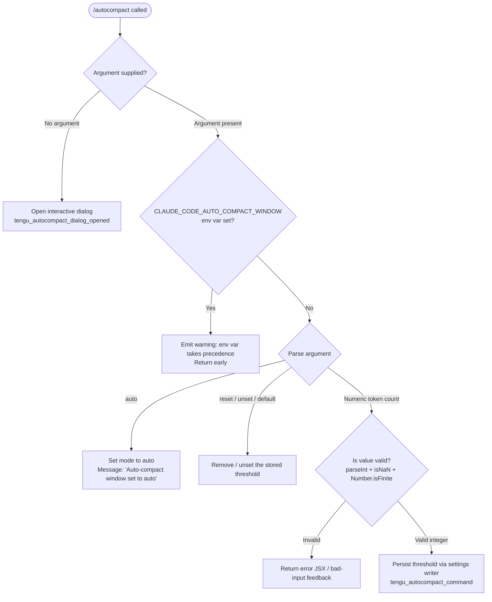

# `/autocompact`

> Analysis basis: CC v2.1.169 bundle.js (AST extraction + Claude interpretation)
> Minimum version: v2.1.169

---

## Overview

`/autocompact` controls when Claude Code automatically summarizes (compacts) the conversation context. The user may pass a token threshold, the special keyword `auto`, or one of the reset keywords (`reset`/`unset`/`default`) to configure or clear the auto-compact window. When invoked with no argument the command opens an interactive dialog.

---

## Registration

| Field | Value |
|---|---|
| type | `local-jsx` |
| name | `autocompact` |
| description | `Set how full the context gets before auto-summarizing` |
| argumentHint | `[auto\|<tokens>]` |
| isHidden | `false` |
| module_id | `qdq` |
| load_inline | `true` |
| loc_byte | `11172917` |
| loc_byte_end | `11173181` |
| loc_line | `7472` |
| arbor_handler.name | `MGf` |
| arbor_handler.fqn | `claude-2.1.169::MGf` |
| arbor_handler.kind | `AsyncFunction` |
| arbor_handler.resolution_path | `module_id` |
| arbor_handler.n_hits | `1` |

Analysis basis: CC v2.1.169 bundle.js:+11172917

---

## Input Branching

Five distinct paths exist depending on the argument supplied, warranting a Mermaid flowchart.



Analysis basis: CC v2.1.169 bundle.js:+11167317 (handler `RC6`), +11172599 (entry `MGf`)

---

## Behavioral Spec

### 1. Entry point — `autocompactCommandHandler` (`MGf`)

```
async function autocompactCommandHandler(context):
    emit telemetry("tengu_autocompact_dialog_opened")   // when dialog path taken
    call settingsReader(context)                         // reads H / model info
    call renderResult(context)                           // M6 → JSX via B$.createElement
    delegate to autocompactCore(context)                 // RC6
```

Analysis basis: CC v2.1.169 bundle.js:+11172599

### 2. Core argument dispatcher — `autocompactCore` (`RC6`)

```
async function autocompactCore(rawArg):
    trimmed = rawArg.trim()                              // RC6 → H.trim :+11167453

    // Guard: env var override
    if env("CLAUDE_CODE_AUTO_COMPACT_WINDOW") is set:
        return warning("CLAUDE_CODE_AUTO_COMPACT_WINDOW is set and takes precedence…")
        // literal :+11167351

    // Parse percentage / token value
    parsed = parseAutoCompactValue(trimmed)              // bAA :+11167525

    // Normalise reset aliases
    if trimmed in ["reset", "unset", "default"]:        // literals :+11167482-11167508
        return clearAutoCompactSetting()

    if parsed.mode == "auto":                            // literal :+10605549
        persistSetting("auto")
        return "Auto-compact window set to auto"         // literal :+11168174

    if parsed is a valid token count:
        persistSetting(parsed.tokens)
        emit telemetry("tengu_autocompact_command")      // :+11167956
        applyFlagSettings()                              // :+11167893
        return successJSX(parsed.tokens)                 // HK → iK :+11168158

    // Fallback: show interactive dialog
    return openDialog()                                  // "dialog" literal :+11172679
```

Analysis basis: CC v2.1.169 bundle.js:+11167317

### 3. Value parser — `parseAutoCompactValue` (`bAA`)

```
function parseAutoCompactValue(input):
    s = input.trim()                                     // :+10605519

    if s.endsWith("%"):                                  // :+10605578
        raw = parseFloat(s)                              // :+10605596
        if Number.isFinite(raw):
            return { mode: "percent", value: Math.round(raw) }  // :+10605763

    // Integer token path
    raw = parseInt(s, 10)                                // :+10605670  radix implied
    // minimum granularity: 1000 tokens                  // literal :+10605654
    // minimum percentage:  100                          // literal :+10605690
    if Number.isFinite(raw):
        return { mode: "tokens", value: raw }            // :+10605716

    if s == "auto":
        return { mode: "auto" }

    return { mode: "invalid" }
```

Analysis basis: CC v2.1.169 bundle.js:+10605519

### 4. Auto-compact threshold resolver — `autoCompactThresholdResolver` (`ni`)

```
function autoCompactThresholdResolver(sessionState):
    // Priority order (highest to lowest):
    //  1. CLAUDE_CODE_AUTO_COMPACT_WINDOW env var     :+10606123
    //  2. Experiment flag                              :+10606472
    //  3. User/project settings                        :+10606385
    //  4. "model-default" fallback                     :+10606559

    envVal = process.env["CLAUDE_CODE_AUTO_COMPACT_WINDOW"]  // :+10606123
    if envVal is set:
        parsed = parseViaWE(envVal)                      // wE :+10606054
        source = "env"                                   // :+10606315
        return clamp(parsed, Math.max, Math.min)         // :+10606241 / :+10606281

    if experimentFlag set (ZJf.has):                     // :+10606496
        ...

    settingsVal = readFromSettings()                     // Y2 :+10606059
    if settingsVal valid:
        source = "settings"                              // :+10606385
        return clamp(settingsVal)

    return { threshold: "model-default", source: "model-default" }  // :+10606559
```

Analysis basis: CC v2.1.169 bundle.js:+10606046

### 5. Env-var token parser — `envVarTokenParser` (`wE`)

```
function envVarTokenParser(raw):
    base = parseInt(raw, 10)                             // :+2991600
    if isNaN(base):
        // radix 10 check, cap at 0                     // :+2991652 / :+2991672
        return 0
    // upper bound: 1 000 000 tokens                    // :+2991699
    if base > 1000000: base = 1000000
    // Dispatch to sub-parsers depending on model tier
    firstPartyResult  = parseFirstParty(base)            // u2  :+2991686
    claudeV3Result    = parseClaudeV3(base)              // kB  :+2991730
    otherModelResult  = parseOtherModel(base)            // N8H :+2991750
    customResult      = parseCustomWindow(base)          // fK8 :+2991774
    return best(firstPartyResult, claudeV3Result, otherModelResult, customResult)
```

Analysis basis: CC v2.1.169 bundle.js:+2991600

### 6. Model-tier sub-parsers

#### `parseFirstParty` (`u2`)
Resolves against the first-party provider table (`ZLH`). Returns token limit for `"firstParty"` accounts.
Analysis basis: CC v2.1.169 bundle.js:+2990946

#### `parseClaudeV3` (`kB`)
Checks whether the model name includes the prefix `"claude-3-"` (literal :+2991223). Handles provider tags `"firstParty"`, `"anthropicAws"`, `"mantle"` (literals :+2991111–2991155). Falls back to `Rh` / `ZY` for limit resolution.
Analysis basis: CC v2.1.169 bundle.js:+2991182

#### `parseOtherModel` (`N8H`)
Handles models outside the claude-3 series. Calls `$f` for limit lookup.
Analysis basis: CC v2.1.169 bundle.js:+2991004

#### `parseCustomWindow` (`fK8`)
Accepts an explicit integer window; validates with `Number.isFinite` (:+2992021) and calls `y6` to persist.
Analysis basis: CC v2.1.169 bundle.js:+2991832

### 7. Settings persistence — `autoCompactSettingWriter` (`luq`)

```
function autoCompactSettingWriter(value, source):
    autoCompactFlag = readAutoCompactEnabled()           // eE → d4 "autoCompactEnabled" :+10608394
    currentConfig   = loadCurrentConfig()                // F_ :+10605881
    write via settingsDispatcher(D6, value)              // D6 :+10605931
    // D6 calls HP6, _P6, tu, VL8, tX6.add, sB.has/get, y6
    emit telemetry("tengu_amber_redwood2")               // :+10605934
```

Analysis basis: CC v2.1.169 bundle.js:+10606403

### 8. Settings file writer — `settingsFileWriter` (`t_`)

Reads the layered settings stack (`policySettings`, `flagSettings`, `userSettings`, `projectSettings`, `localSettings` — literals :+1286576–1268588), resolves the correct `.claude/settings.json` or `settings.local.json` path (:+1268769–1268841), and atomically writes via `WO6` (write + fsync + rename). Also manages gitignore global rules (`gitignore_global_rule` :+1287488) and emits `write_ineffective` (:+1287629) when the write would be shadowed by a higher-priority layer.

Analysis basis: CC v2.1.169 bundle.js:+1286638

### 9. Context-window status formatter — `formatAutoCompactStatus` (`FAH`)

```
function formatAutoCompactStatus(threshold):
    n = parseInt(threshold, 10)                          // :+4971665
    if isNaN(n): return { status: "invalid" }            // :+4971683 / literal :+4971725
    formatted = n.toLocaleString("en-US", {notation:"compact"})
    // :+4971796 → N → StK
    if capped: return { status: "capped" }               // literal :+4971855
    return { status: "valid" }                           // literal :+4971650
```

Analysis basis: CC v2.1.169 bundle.js:+4971665

---

## State & Side Effects

| Item | Detail |
|---|---|
| Telemetry — `tengu_autocompact_dialog_opened` | Fired when the command opens the interactive dialog (no arg path). bundle.js:+11172634 |
| Telemetry — `tengu_autocompact_command` | Fired after a numeric or `auto` threshold is successfully persisted. bundle.js:+11167956 |
| Telemetry — `tengu_amber_redwood2` | Fired inside the settings-writer on each compact-window update. bundle.js:+10605934 |
| Telemetry — `tengu_feature_ok` | General success path within the feature hook system. bundle.js:+1013926 |
| Telemetry — `tengu_feature_sad` | Feature hook sad path. bundle.js:+1014069 |
| Telemetry — `tengu_feature_bad` | Feature hook bad path. bundle.js:+1013988 |
| Settings write | Persists `autoCompactEnabled` and threshold to `.claude/settings.json` or `settings.local.json` via atomic write (`WO6`). |
| Settings read | Loads layered settings via `G9_` / `DB` at command start; logs `settings_load_started` / `settings_load_completed`. |
| `apply_flag_settings` | Applied after a successful set operation (literal :+11167893). |
| Env-var guard | If `CLAUDE_CODE_AUTO_COMPACT_WINDOW` is set, `/autocompact` emits a warning and returns without writing settings (literal :+11167351). |
| JSX dialog | Opened via `B$.createElement` with `"dialog"` kind when no argument is supplied (literal :+11172679). |
| Cache invalidation | `yO` clears `aB6` and `Cl8` caches on settings write. bundle.js:+26839 |

---

## Version History

| Version | Change |
|---|---|
| v2.1.169 | Initial analysis |

---

## Common Mistakes

1. **Setting the threshold while `CLAUDE_CODE_AUTO_COMPACT_WINDOW` is set** — the command will refuse to write and display a precedence warning. Unset the environment variable first.
2. **Passing a non-integer string** — values that fail `parseInt` + `Number.isFinite` validation are treated as invalid and will not be saved; use a plain integer (e.g. `150000`) or the keyword `auto`.
3. **Expecting immediate effect on the current context window** — the setting is persisted to disk and takes effect on the next session or context reset.
4. **Confusing `reset`, `unset`, and `default`** — all three aliases clear the stored threshold and revert to the model-default behaviour; there is no functional difference between them.
5. **Using a percentage value without the `%` suffix** — the parser detects the percentage path only via `endsWith("%")`; omitting the suffix causes the value to be interpreted as a raw token count instead.

---

## Appendix — Identifier Mapping

> For bundle debugging only. Identifiers change across versions.

| Identifier | Role |
|---|---|
| `MGf` | `autocompactCommandHandler` — async entry point for `/autocompact` |
| `RC6` | `autocompactCore` — argument dispatcher and main logic |
| `ni` | `autoCompactThresholdResolver` — priority-ordered threshold resolver |
| `i1` | `modelNameNormalizer` — normalises model name strings |
| `N68` | `modelEntryLookup` — looks up model entries via `Object.entries` |
| `TP` | `modelNameMatcher` — toLowerCase / includes / replace on model names |
| `H` | `bootstrapFetcher` — makes bootstrap API fetch with User-Agent / Content-Type headers |
| `Bi8` | `applicationInferenceProfileChecker` — checks for inference-profile flag |
| `n3` | `modelNameReplacer` — replaces substrings in model names |
| `wE` | `envVarTokenParser` — parses `CLAUDE_CODE_AUTO_COMPACT_WINDOW` value |
| `u2` | `parseFirstParty` — first-party provider token limit resolver |
| `kB` | `parseClaudeV3` — claude-3-* model token limit resolver |
| `N8H` | `parseOtherModel` — non-claude-3 model token limit resolver |
| `fK8` | `parseCustomWindow` — explicit integer window validator/persister |
| `Y2` | `readSettingsAutoCompact` — reads autocompact threshold from settings layer |
| `FAH` | `formatAutoCompactStatus` — formats threshold with locale compact notation |
| `N` | `localeCompactFormatter` — applies `en-US` compact number format |
| `luq` | `autoCompactSettingWriter` — writes auto-compact setting |
| `eE` | `readAutoCompactEnabled` — reads `autoCompactEnabled` flag |
| `F_` | `loadCurrentAutoCompactConfig` — loads current compact config object |
| `D6` | `settingsDispatcher` — dispatches setting updates to the correct store |
| `bAA` | `parseAutoCompactValue` — parses `auto`, percent, or integer from user input |
| `t_` | `settingsFileWriter` — layered settings file read/write with atomic replace |
| `V$` | `settingsPathResolver` — resolves settings file paths |
| `EYH` | `settingsJoinPath` — joins `.claude/settings.json` path segments |
| `YB` | `settingsLayerFactory` — constructs settings layer objects |
| `l6` | `claudeConfigDir` — returns `.claude` config directory path |
| `W9_` | `settingsFileLoader` — loads settings from disk into layers |
| `RgA` | `settingsKeyReader` — reads individual keys from settings objects |
| `zB` | `projectSettingsReader` — reads project-level settings |
| `ygA` | `inlineSDKSettingsReader` — reads SDK inline settings |
| `G2` | `userSettingsReader` — reads user-level settings |
| `uo` | `fileContentReader` — reads file content with slice/replaceAll |
| `k8` | `settingsErrorHandler` — handles ENOENT and other settings errors |
| `E8` | `enoentHandler` — specific ENOENT error handler |
| `y1_` | `settingsTimestampUpdater` — updates `jr6` map with `Date.now` |
| `_vH` | `settingsPostWriteHook` — post-write hook calling `er6` / `YB` |
| `er6` | `settingsPathNormalizer` — resolves and normalises settings paths via `iI` |
| `WO6` | `atomicFileWriter` — atomic write: open, writeFileSync, fsync, rename, unlink |
| `q` | `fsModule` — filesystem module proxy |
| `O` | `statModule` — stat / lstat module proxy |
| `f` | `fdModule` — file-descriptor utilities |
| `CH` | `jsonStringifier` — wraps `JSON.stringify` |
| `yO` | `settingsCacheClearer` — clears `aB6` and `Cl8` caches |
| `Or6` | `gitIgnoreSettingsWriter` — writes gitignore-related settings entries |
| `C6` | `gitIgnoreBaseResolver` — resolves base for gitignore checking |
| `z1_` | `gitALResolver` — resolves `AL` for git operations |
| `A` | `stringLowerCaseUtil` — toLowerCase utility |
| `$r6` | `gitCheckIgnoreRunner` — runs `git check-ignore --` |
| `qy4` | `gitExcludesFileResolver` — resolves `core.excludesfile` global git config |
| `yBA` | `gitLsFilesRunner` — runs `git ls-files --error-unmatch` |
| `hBA` | `gitIgnoreAppender` — appends entries to gitignore file |
| `ku` | `claudeSettingsPathJoiner` — joins `.claude/settings.json` path |
| `G_` | `xZWrapper` — wraps `xZ` utility |
| `xZ` | `globalFlagAccessor` — accesses global flag state |
| `SH` | `featureOkEmitter` — emits `tengu_feature_ok` via `d` / `K6` |
| `d` | `telemetryEmitter` — base telemetry event emitter |
| `K6` | `telemetryQueue` — queues events via `c76` |
| `o6` | `featureSadEmitter` — emits `tengu_feature_sad` |
| `bH` | `featureBadEmitter` — emits `tengu_feature_bad` |
| `DB` | `loadSettingsFromDisk` — top-level disk settings loader (logs `loadSettingsFromDisk_start/end`) |
| `bZ` | `settingsPreLoadHook` — pre-load hook |
| `t9` | `memoryUsageTracker` — tracks `process.memoryUsage` via `PZA` set |
| `G9_` | `settingsLoadCoordinator` — coordinates full settings load, logs `settings_load_started/completed` |
| `sB6` | `settingsPostLoadHook` — post-load hook |
| `hH` | `errorLogger` — logs errors via `bo.logError` + `cgH.push` |
| `wA` | `errorWrapper` — wraps `Error` / `String` |
| `_6` | `stringCoercer` — coerces values via `String()` |
| `kq` | `essentialTrafficLogger` — logs `essential-traffic` category |
| `av4` | `rollingLogBuffer` — manages `Di6` shift/push rolling buffer |
| `d_` | `configLookupHelper` — calls `DB` for config lookup |
| `M6` | `jsxRenderer` — renders JSX result via `c76` |
| `c76` | `jsxFactory` — low-level JSX element factory |
| `HK` | `numberFormatter` — formats numbers with locale `.0` suffix |
| `iK` | `btKWrapper` — wraps `btK` number formatter |
| `btK` | `compactNumberCore` — core compact number formatting (`en-US`, `compact`) |