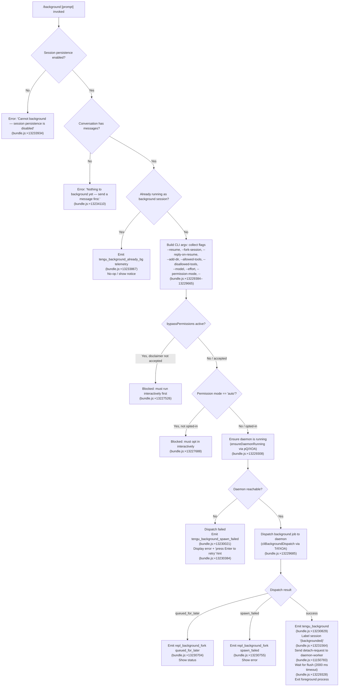

# `/background`

> Analysis basis: CC v2.1.169 bundle.js (AST extraction + Claude interpretation)
> Minimum version: v2.1.169

---

## Overview

`/background` (alias: `/bg`) detaches the current interactive REPL session from the terminal and hands it off to the Claude Code background daemon, freeing the terminal for other use. The command forks a background job via the daemon dispatch pipeline, writes the necessary resume flags, and exits the foreground process. An optional prompt argument can be queued to run once the session is resumed.

---

## Registration

| Field | Value |
|---|---|
| type | `local-jsx` |
| name | `background` |
| description | `Send this session to the background and free the terminal` |
| argumentHint | `[prompt]` |
| aliases | `["bg"]` |
| immediate | `null` |
| module_id | `sYK` |
| load_inline | `true` |
| loc_byte | `13234575` |
| loc_byte_end | `13234815` |
| loc_line | `9760` |
| arbor_handler.name | `Rrf` |
| arbor_handler.fqn | `claude-2.1.169::Rrf` |
| arbor_handler.kind | `AsyncFunction` |
| arbor_handler.resolution_path | `module_id` |
| arbor_handler.n_hits | `0` |

Analysis basis: CC v2.1.169 bundle.js:+13234575

---

## Input Branching

The handler has 4+ distinct branches depending on session state and the presence of a prompt argument; a Mermaid flowchart is used.



---

## Behavioral Spec

### Guard checks

```
async function backgroundCommandHandler(input, context):
    // Guard: persistence must be enabled
    if not sessionPersistenceEnabled(context):
        return errorMessage("Cannot background — session persistence is disabled, ...")
        // bundle.js:+13233934

    // Guard: conversation must have at least one message
    if conversationIsEmpty(context):
        return errorMessage("Nothing to background yet — send a message first.")
        // bundle.js:+13234110

    // Guard: already a background session
    if isAlreadyBackgroundSession(context):
        emitTelemetry("tengu_background_already_bg")   // bundle.js:+13233867
        return  // no-op

    // Guard: bypassPermissions requires prior interactive acceptance
    if bypassPermissionsActive(context) and not disclaimerAccepted():
        return errorMessage("--bg with bypassPermissions requires ...")
        // bundle.js:+13227526

    // Guard: auto permission mode requires prior opt-in
    if permissionMode == "auto" and not autoModeOptedIn():
        return errorMessage("--bg with auto mode requires opting in first. ...")
        // bundle.js:+13227688
```

Analysis basis: CC v2.1.169 bundle.js:+13233853, +13234071, +13234110

### Argument vector construction

The handler collects the current session's flags into a fresh `argv` array so the background job can be launched with equivalent configuration.

```
function buildBackgroundArgv(context, userPrompt):
    argv = []

    // Session identity
    argv.append("--resume", sessionId)          // bundle.js:+13229384
    argv.append("--fork-session")               // bundle.js:+13229397

    // Optional queued prompt
    if userPrompt is not empty:
        argv.append("--reply-on-resume", userPrompt)  // bundle.js:+13229439

    // Working directories
    for each dir in addedDirs:
        argv.append("--add-dir", dir)           // bundle.js:+13229491

    // Tool lists
    argv.append("--allowed-tools", ...)         // bundle.js:+13229526
    argv.append("--disallowed-tools", ...)      // bundle.js:+13229567

    // Model / effort / permissions
    argv.append("--model", model)               // bundle.js:+13229598
    argv.append("--effort", effort)             // bundle.js:+13229620
    argv.append("--permission-mode", mode)      // bundle.js:+13229637

    argv.append("--")                           // bundle.js:+13229665
    return argv
```

Analysis basis: CC v2.1.169 bundle.js:+13229384–13229665

### Daemon startup

```
async function ensureDaemonRunning(context):
    // Calls internal daemon-ensure pipeline (pQ → XOA → kb8/RD)
    // Prompts user "Install as a service now?" if not yet installed
    //   bundle.js:+13174217
    // Falls back to transient spawn if service not configured
    // Emits telemetry: tengu_bg_daemon_cold_start_ask, tengu_bg_daemon_spawn_failed
    //   bundle.js:+13167644, +13168163
    // Raises on timeout (flush timeout 2000 ms, bundle.js:+13229328)
```

Analysis basis: CC v2.1.169 bundle.js:+13229308, +13229320–13229333

### Dispatch and detach

```
async function dispatchAndDetach(argv, context):
    result = await cliBackgroundDispatch(argv)
    // dispatch pipeline: Gr → Trf → XOA → RD/kb8
    // bundle.js:+13229685

    if result.status == "queued_for_later":
        emitTelemetry("repl_background_fork", {outcome: "queued_for_later"})
        // bundle.js:+13230704
        showStatus(result)
        return

    if result.status == "spawn_failed":
        emitTelemetry("repl_background_fork", {outcome: "spawn_failed"})
        // bundle.js:+13230755
        showError(result)
        return

    // Success path
    emitTelemetry("tengu_background")           // bundle.js:+13230829
    labelSession("(backgrounded)")              // bundle.js:+13231564

    // Detach: send "detach-request" message to daemon-worker socket
    sendDetachRequest(context.daemonSocket)     // literal "detach-request", bundle.js:+11150783

    // Wait for output flush (up to 2000 ms)
    await flushWithTimeout(2000)                // bundle.js:+13229328, +13229333

    // Render JSX confirmation, then exit the foreground process
    renderBackgroundedUI(context)               // U$H.createElement call, bundle.js:+13234180
    process.exit(0)
```

Analysis basis: CC v2.1.169 bundle.js:+13229685, +13230681, +13230829, +11150783

### Error-retry UI

When dispatch fails, the terminal is kept open and the handler displays a message inviting the user to press Enter to retry (literal: `"couldn't start in the background — press Enter to retry"`, bundle.js:+13230384). The retry re-enters the dispatch path without repeating guard checks.

Analysis basis: CC v2.1.169 bundle.js:+13230384

---

## State & Side Effects

| Item | Detail |
|---|---|
| Telemetry | `tengu_background_already_bg` (bundle.js:+13233867); `tengu_background` (bundle.js:+13230829); `tengu_background_spawn_failed` (bundle.js:+13230021); `repl_background_fork` with outcome tag `queued_for_later` / `spawn_failed` (bundle.js:+13230704, +13230755); daemon startup telemetry: `tengu_bg_daemon_cold_start_ask`, `tengu_bg_daemon_spawn_failed`, `tengu_bg_dispatch`, `tengu_bg_dispatch_fallback` |
| Daemon socket | Writes a `detach-request` message to the daemon-worker control socket (bundle.js:+11150783) |
| Session label | Appends the string `"(backgrounded)"` to the session display name (bundle.js:+13231564) |
| Process exit | Calls `process.exit` on the foreground CLI process after rendering the confirmation JSX (bundle.js:+13234180) |
| Flush timeout | 2 000 ms hard flush timeout before exit (bundle.js:+13229328) |
| appState changes | Session transitions to `"background session"` state in daemon (literal, bundle.js:+16543429) |
| Sound | None observed in depth-2 traversal |

---

## Version History

| Version | Change |
|---|---|
| v2.1.169 | Initial analysis |

---

## Common Mistakes

1. **Running `/background` before sending any message.** The command requires at least one conversational turn; otherwise it refuses with "Nothing to background yet — send a message first." (bundle.js:+13234110).
2. **Using `--dangerously-skip-permissions` without prior interactive acceptance.** `/background` checks that the bypassPermissions disclaimer was accepted in a prior interactive session; it cannot be accepted for the first time via a background command (bundle.js:+13227526).
3. **Using `--permission-mode auto` without prior opt-in.** The same interactive-first requirement applies to auto mode (bundle.js:+13227688).
4. **Expecting an immediate terminal return when the daemon is cold.** If the daemon is not running, the command first attempts to start or install it, which may prompt the user and take several seconds before the session is actually detached.
5. **Assuming `/bg` and `/background` behave differently.** `bg` is a registered alias; both names invoke exactly the same handler (registration `aliases: ["bg"]`, bundle.js:+13234575).

---

## Appendix — Identifier Mapping

> For bundle debugging only. Identifiers change across versions.

| Identifier | Role |
|---|---|
| `Rrf` | Main async handler for `/background` (arbor_handler) |
| `vU8` | Background dispatch orchestrator (builds argv, calls daemon) |
| `Gr` | CLI background dispatch entry point (calls Trf) |
| `Trf` | Background job launch / session fork logic |
| `XOA` | Daemon ensure-running + dispatch execution |
| `pQ` | Daemon ensure-running core |
| `Su6` | Daemon startup / install interaction |
| `hrf` | Permission / mode gate checks (bypassPermissions, auto mode) |
| `NU8` | Background command UI renderer (JSX, status messages) |
| `n3H` | Detach-request sender to daemon-worker socket |
| `B$H` | Environment/context builder for background context |
| `tvH` | Session context accessor |
| `w9` | Daemon-worker IPC helper |
| `BL` | Flush-with-timeout utility (2000 ms) |
| `NOA` | Daemon readiness check / signal registration |
| `_Z` | Abort/cleanup path on daemon unavailability |
| `tEH` | Added-directories collector for argv |
| `GjH` | Config/file watcher utilities |
| `dO` | Compact-boundary helper |
| `vK6` | Session rename / fork dispatcher |
| `XRf` | Session fork and rename execution |
| `rG` | API query runner for fork |
| `Qk8` | App-state read/write during fork |
| `tS` | Query pipeline orchestrator |
| `kjK` | Core query/turn execution loop |
| `UmH` | Query message assembly and dispatch |
| `eS8` | Message serialisation and hashing |
| `mSH` | MCP server connection manager |
| `cd8` | MCP connection result applier |
| `dXA` | MCP server refresh / reconnect |
| `Lj5` | Daemon control-socket protocol handler |
| `Kj5` | Attach stall / respawn logic |
| `bdK` | Attach retry and backoff |
| `hH` | Error logger (MCP/system) |
| `D6` | Telemetry event emitter |
| `EH` | String coercion utility |
| `CH` | JSON stringify helper |
| `K6` | Telemetry feature-event emitter |
| `SH` | Feature-ok telemetry emitter |
| `bH` | Feature-bad telemetry emitter |
| `o6` | Feature-sad telemetry emitter |
| `g8` | Generic helper / accessor |
| `E8` | Error factory |
| `_6` | String coercion (primitive) |
| `PG` | Context-store accessor |
| `xZ` | AsyncLocalStorage store |
| `G_` | Context-store getter |
| `C6` | AsyncLocalStorage run wrapper |
| `Wi6` | Store lookup helper |
| `y6` | Config loader / file-watcher |
| `y7H` | Config read/parse (sync) |
| `jhL` | Config file watcher |
| `PC` | Settings merger |
| `y8` | Settings source resolver |
| `Pl` | Permission set slice helper |
| `e$A` | Prefix-starts-with check |
| `Srf` | Blocked-tools set checker |
| `nYK` | Resume flag parser |
| `EU8` | Disallowed-tools arg builder |
| `XjH` | Allowed-tools arg builder |
| `iYK` | Session-id arg parser |
| `xYK` | Argv map transformer |
| `yrf` | Argv starts-with filter |
| `fAH` | File-path arg formatter |
| `gH6` | Spawn-failed display helper |
| `T2H` | Retry-prompt UI helper |
| `oR` | Status display helper |
| `Zrf` | Daemon stop helper |
| `G_H` | Daemon amber-anchor emitter |
| `I7H` | Amber-anchor core |
| `w6H` | Error display helper |
| `mw8` | MCP tool-permission set checker |
| `zeH` | MCP server cleanup helper |
| `UE` | MCP server slot cleanup |
| `uSH` | MCP reconnect scheduler |
| `uu_` | MCP auth-token handler |
| `sw8` | MCP OAuth flow handler |
| `tw8` | MCP OAuth callback handler |
| `yF9` | MCP reconnect decision |
| `vF9` | MCP server name formatter |
| `DeH` | Integer-parse helper (radix 10) |
| `aJ8` | Integer-parse helper (radix 10, variant) |
| `OZ6` | MCP status aggregator |
| `yn` | MCP server config normaliser |
| `VV` | MCP capability builder |
| `TF9` | MCP tool-list fetcher |
| `jD8` | MCP tool-info builder |
| `DD8` | MCP resource builder |
| `O8` | MCP debug logger |
| `u7` | MCP error logger |
| `EN` | MCP skills telemetry emitter |
| `Vu_` | MCP tool include/exclude checker |
| `J` | Process kill helper (SIGTERM) |
| `N` | HTTP bootstrap fetcher |
| `ItK` | API request builder |
| `R4` | Header redaction helper |
| `rBH` | lEA encoding helper |
| `StK` | API response handler |
| `D3K` | Session metrics recorder |
| `IAA` | Telemetry rename emitter |
| `Pf6` | Telemetry payload builder |
| `CS` | Token/auth string sanitiser |
| `a9H` | Signal registration helper |
| `pp` | Subagent exit handler |
| `ER6` | MJf tombstone checker |
| `Puq` | Tombstone dispatch helper |
| `o5H` | Stream event filter |
| `$Jf` | Forked agent d/K6 telemetry |
| `x8` | UUID + payload builder |
| `f6K` | Whitespace trim helper |
| `wC` | Trim utility |
| `_u8` | Argv array join/slice helper |
| `T4` | Query pipeline config |
| `RE` | Message normaliser |
| `oJf` | Content-block mapper |
| `suq` | Serialisation helper |
| `lAA` | Fallback request builder |
| `m2` | Auth-context builder |
| `YA` | Provider selector |
| `cO_` | API key type detector |
| `M9` | Client credential builder |
| `QcH` | F5 config helper |
| `PE` | Query post-processor |
| `w4` | Filter helper |
| `HC8` | Compact-boundary extractor |
| `Zj` | Compact-boundary marker |
| `wz` | File-watcher permission gate |
| `QF` | Array.isArray wrapper |
| `oR8` | Some-predicate helper |
| `mS` | Pi wrapper |
| `pi` | Array-of-arrays checker |
| `MqH` | Starts-with string helper |
| `f$` | Feature-flag gate (I6/o4) |
| `I6` | xZ context accessor |
| `wQ` | Feature-flag gate variant |
| `RQq` | Daemon task message builder |
| `GS8` | Daemon socket message serialiser |
| `li` | Fe.write / CH output helper |
| `GqH` | Queue/drain helper |
| `rDK` | Environment key reader |
| `ex` | Exception wrapper |
| `tW` | Session-context getter |
| `hM` | SG session-context accessor |
| `SG` | tO_ AsyncLocalStorage getter |

---

Note: index built via Arbor fallback; some signals (telemetry, literals) may be missing — see arbor-fallback.js.