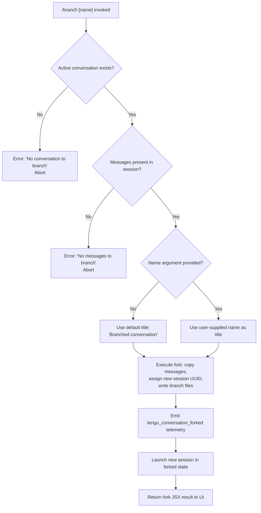

# `/branch`

> Analysis basis: CC v2.1.169 bundle.js (AST extraction + Claude interpretation)
> Minimum version: v2.1.169

---

## Overview

The `/branch` command creates a divergent copy of the current conversation at the current point in history. It forks the session's message log into a new independent conversation with an optional user-supplied name, leaving the original session intact. The new branch is launched as a separate Claude Code session using the same working directory and accumulated context up to the branch point.

---

## Registration

| Field | Value |
|---|---|
| type | `local-jsx` |
| name | `branch` |
| description | `Create a branch of the current conversation at this point` |
| argumentHint | `[name]` |
| module_id | `d9A` |
| load_inline | `true` |
| loc_byte | `12637205` |
| loc_byte_end | `12637382` |
| loc_line | `8991` |
| arbor_handler.name | `vWf` |
| arbor_handler.fqn | `claude-2.1.169::vWf` |
| arbor_handler.kind | `AsyncFunction` |
| arbor_handler.resolution_path | `module_id` |
| arbor_handler.n_hits | `0` |

Analysis basis: CC v2.1.169 bundle.js:+12637205

---

## Input Branching

The command has four distinct code paths depending on session state and whether a name argument was provided:



Analysis basis: CC v2.1.169 bundle.js:+11074690 (no-conversation guard), +11075809 (no-messages guard), +11074243 (default title literal), +11077038 (telemetry emit)

---

## Behavioral Spec

### Top-level Handler (`vWf`)

The async handler `vWf` is the primary entry point resolved via `module_id → d9A`.

```
async function branchCommandHandler(args, context):
    sessionTitle = args.name ?? "Branched conversation"

    // Guard: require an existing conversation
    if not context.hasActiveConversation():
        display error("No conversation to branch")
        return

    // Delegate to branch session orchestrator
    result = await branchSessionOrchestrator(sessionTitle, context)
    return result
```

Analysis basis: CC v2.1.169 bundle.js:+11077823 (`vWf` → `Mgq` call edge), +11074243 (default title), +11074690 (guard string)

---

### Branch Session Orchestrator (`Mgq`)

`Mgq` is the core function that performs the actual fork. It coordinates UUID generation, message copying, file I/O, and subprocess launch.

```
async function branchSessionOrchestrator(title, context):
    // Resolve current project config and session path
    configPath = resolveProjectConfig(context)        // I6, f$
    currentMessages = getCurrentMessages(context)     // fgq

    // Guard: require at least one message
    if currentMessages is empty:
        display error("No messages to branch")
        return

    // Find branch point in message list
    branchPoint = findBranchPoint(currentMessages)    // $.find, Lgq

    // Sanitize branch name for filesystem use
    safeName = sanitizeBranchName(title)              // Lgq + A.replace, VWf

    // Generate new session identifier
    newSessionId = crypto.randomUUID()                // Agq.randomUUID (inside fgq)

    // Create branch directory and copy conversation data
    await writeBranchFiles(newSessionId, safeName, branchPoint, configPath)
    // └── fgq: mkdir, createReadStream (utf8, 448-byte buffer),
    //          createWriteStream (384-byte buffer), readline.createInterface,
    //          message serialization (content-replacement marker, text/role fields)

    // Rename session with custom-title metadata
    await setSessionTitle(newSessionId, title)        // DR → custom-title

    // Emit fork telemetry
    emit("tengu_conversation_forked")                 // loc_byte:+11077038

    // Record fork type as "fork"
    forkType = "fork"                                 // literal at +11077559

    // Notify agent-name metadata
    await setAgentName(newSessionId, context)         // C3H → agent-name

    // Determine mode: "auto" unless overridden
    launchMode = "auto"                               // literal at +11076992

    // Launch the forked session subprocess
    await launchForkedSession(newSessionId, forkType, launchMode)

    return forkResultJSX
```

Analysis basis: CC v2.1.169 bundle.js:+11076734 (`Mgq` → `I6`), +11076842 (`Mgq` → `fgq`), +11076901 (`Mgq` → `Lgq`), +11076974 (`Mgq` → `VWf`), +11077005 (`Mgq` → `DR`), +11077023 (`Mgq` → `C3H`), +11077036 (`Mgq` → `d`), +11077125 (`Mgq` → `q9`)

---

### Branch Name Sanitizer (`Lgq` + `VWf`)

The raw argument string is sanitised before use as a filesystem path component.

```
function sanitizeBranchName(rawName):
    // Find matching segment via _.find
    segment = find matching component in known branch list  // Lgq → _.find (+11074295)
    // Apply regex replacement to escape special characters
    cleaned = rawName.replace(specialCharsPattern, escapedForm)  // Lgq → A.replace (+11074373)

    // Additional pass: parse existing branch indices
    // VWf: strip numeric prefix via Ov (H.replace, +196604)
    //      collect existing indices into Set K
    //      parse index with parseInt (+11076612)
    //      check uniqueness via K.has (+11076659)
    return cleaned
```

Analysis basis: CC v2.1.169 bundle.js:+11074295, +11074373, +11076512, +11076606, +11076612, +11076659

---

### Conversation File Writer (`fgq`)

`fgq` handles the low-level I/O of copying the existing conversation transcript into the new branch directory.

```
async function writeConversationToNewBranch(newSessionId, messages, configPath):
    // Compute destination path; ensure parent directories exist
    destDir = computeBranchDir(newSessionId, configPath)  // I6, x$, G_
    await fs.mkdir(destDir, { recursive: true })          // JC8.mkdir (+11074544)

    // Stream source file (buffer size 448 bytes, encoding utf8)
    readStream = fs.createReadStream(sourcePath, { encoding: "utf8", highWaterMark: 448 })
    // (+11074593, +11074626)

    // Set up readline interface over the stream
    rl = readline.createInterface({ input: readStream })  // qgq.createInterface (+11074833)

    // Write destination (buffer size 384 bytes)
    writeStream = fs.createWriteStream(destPath, { highWaterMark: 384 })  // (+11074739, +11074785)

    // Process each line: map through message normaliser (H.map → N)
    forEachLine in rl:
        normalized = normalizeMessageLine(line)  // H → N (+11074888)
        // N handles: role serialization (user/assistant/attachment/system),
        //            content-replacement markers, JSON stringification
        writeStream.write(normalized)

    // Signal end of write and await stream finish
    writeStream.end()                             // O.end (+11076205)
    await stream.finished(writeStream)            // Kgq.finished (+11076219)

    // Cleanup on error: destroy read stream, unlink partial dest file
    on error:
        readStream.destroy()                      // O.destroy (+11074935)
        await fs.unlink(destPath)                 // JC8.unlink (+11074953)
        throw error
```

Analysis basis: CC v2.1.169 bundle.js:+11074482 (randomUUID), +11074544 (mkdir), +11074593 (createReadStream), +11074626 (utf8), +11074739 (createWriteStream), +11074833 (createInterface), +11074888 (H.map), +11076205 (O.end), +11076219 (Kgq.finished)

---

### Session Title Writer (`DR`)

After the branch files are written, the session's metadata is updated with the custom title derived from the user's `[name]` argument.

```
async function setSessionTitle(sessionId, title):
    // Compute project config path
    configPath = getProjectConfigPath(sessionId)  // sN, Q$H
    // Write "custom-title" metadata key
    await appendToConfigFile(configPath, { "custom-title": title })
    // Q$H: l6, CH, A.appendFileSync (+13359841), A.mkdirSync (+13359880)
    emit("tengu_session_renamed")  // +13360886
```

Analysis basis: CC v2.1.169 bundle.js:+13360773 (`DR` → `sN`), +13360782 (`DR` → `Q$H`), +13360794 (literal `"custom-title"`), +13360886 (telemetry)

---

### Agent Name Setter (`C3H`)

```
async function setAgentName(sessionId, context):
    configPath = getProjectConfigPath(sessionId)  // sN, Q$H
    // Write "agent-name" metadata key
    await appendToConfigFile(configPath, { "agent-name": context.agentName })
    // (+13363816 literal "agent-name")
    emit("tengu_agent_name_set")  // +13363914
```

Analysis basis: CC v2.1.169 bundle.js:+13363795 (`C3H` → `sN`), +13363804 (`C3H` → `Q$H`), +13363816 (literal `"agent-name"`), +13363914 (telemetry)

---

### Message Line Normaliser (`N`, called via `H.map`)

Each line from the source conversation file is passed through the normaliser before writing to the branch.

```
function normalizeMessageLine(line, context):
    // Detect role: user / assistant / attachment / system
    role = detectRole(line)  // sBH, ItK

    // If line contains a content-replacement marker, handle substitution
    if line includes content-replacement:
        apply replacement logic  // R4, CH

    // Trim whitespace; uppercase certain fields
    cleaned = line.trim().toUpperCase(relevant parts)

    // Serialize to JSON for output
    return JSON.stringify(cleaned)  // CH → JSON.stringify (+187585)
```

Analysis basis: CC v2.1.169 bundle.js:+208915 (`N` → `sBH`), +208933 (`N` → `ItK`), +208955 (`N` → `H.includes`), +209017 (`N` → `_.toUpperCase`), +187585 (`CH` → `JSON.stringify`), +11075170 (literal `"content-replacement"`)

---

## State & Side Effects

| Item | Detail |
|---|---|
| Telemetry: `tengu_conversation_forked` | Fired once per successful branch operation (bundle.js:+11077038) |
| Telemetry: `tengu_session_renamed` | Fired when custom-title metadata is written to the new branch's config (bundle.js:+13360886) |
| Telemetry: `tengu_agent_name_set` | Fired when agent-name metadata is written to the new branch (bundle.js:+13363914) |
| Telemetry: `tengu_feature_ok` / `tengu_feature_sad` / `tengu_feature_bad` | General feature outcome events reachable from the call graph (bundle.js:+1013926, +1014069, +1013988) |
| Telemetry: `tengu_worktree_detection` | Git worktree probe fired during branch point resolution (bundle.js:+9201820) |
| Filesystem: branch directory | New directory created under the project config path; populated with a copy of the conversation transcript up to the branch point |
| Filesystem: metadata files | `custom-title` and `agent-name` appended to the new session's config via `appendFileSync` |
| appState changes | New session entry added; fork type recorded as `"fork"` (bundle.js:+11077559) |
| Subprocess launch | A new Claude Code session subprocess is spawned for the forked conversation via `FQ.spawn` (bundle.js:+16508252), managed through the background-session infrastructure (`gPA`, `w`) |
| Stream lifecycle | `readline` interface and read/write streams are created then explicitly destroyed/finished; partial files are unlinked on error |
| Sound | <!-- TODO: not found in depth-2 traversal; needs --depth 4 --> |

---

## Version History

| Version | Change |
|---|---|
| v2.1.169 | Initial analysis |

---

## Common Mistakes

1. **Invoking `/branch` with no active conversation**: If no session messages exist, the command hard-fails with `"No conversation to branch"` (bundle.js:+11074690) rather than creating an empty branch. Start a conversation first.
2. **Invoking `/branch` when the message list is empty**: Even with an active session, if no messages have been exchanged the command will abort with `"No messages to branch"` (bundle.js:+11075809). At least one user or assistant turn must exist.
3. **Duplicate branch names**: The sanitiser (`VWf`) detects existing numeric indices and avoids collisions. Supplying a name identical to an existing branch results in an auto-incremented suffix, not an overwrite — do not rely on a specific name being used verbatim when conflicts exist.
4. **Expecting synchronous completion**: The handler is an `AsyncFunction` (`arbor_handler.kind: AsyncFunction`). UI frameworks wrapping the command must await the result; premature disposal before stream finish (`Kgq.finished`) leaves orphan files.
5. **Platform assumptions**: The `"windows"` literal (bundle.js:+16513830) and the `MU8` macOS-specific path (bundle.js:+13177179) in the background-session layer indicate platform-specific code paths for the spawned session; behaviour around session PID management may differ on Windows vs macOS/Linux.

---

## Appendix — Identifier Mapping

> For bundle debugging only. Identifiers change across versions.

| Identifier | Role |
|---|---|
| `vWf` | Top-level async branch command handler (arbor_handler) |
| `Mgq` | Branch session orchestrator (core fork logic) |
| `fgq` | Conversation file writer (stream-based I/O) |
| `Lgq` | Branch name finder / sanitiser (_.find + A.replace) |
| `VWf` | Branch index deduplicator (parseInt + Set tracking) |
| `DR` | Session title writer (custom-title metadata) |
| `C3H` | Agent name setter (agent-name metadata) |
| `Q$H` | Config file appender (appendFileSync, mkdirSync) |
| `sN` | Project config path resolver |
| `I6` | Config/path utility (called from multiple sites) |
| `f$` | Session file locator (I6 + o4) |
| `o4` | Session storage accessor (Z9 registration) |
| `ti` | Worktree detection and git branch resolver (H3H, OwK) |
| `H3H` | Git worktree list parser (worktree list --porcelain) |
| `OwK` | Directory-tree file collector for context |
| `KpH` | Buffer allocation helper for message serialisation |
| `N` | Message line normaliser (role detection, JSON stringify) |
| `ItK` | Role field parser (RI, fZA, vGA) |
| `CH` | JSON serialiser wrapper (JSON.stringify) |
| `R4` | Content-replacement handler (qZA, H.replace, A.lastIndexOf) |
| `StK` | Transcript log writer (file append, rotation, Buffer.byteLength) |
| `htK` | Log rotate / append worker (Mh.mkdir, Mh.appendFile, Vo8) |
| `Vo8` | Log file rotate-by-rename helper (Mh.stat, Mh.rename, Mh.unlink) |
| `MZA` | Log path builder (P6H.join, I6) |
| `n56` | Log error handler (E8) |
| `Z9` | Exit handler registrar (ZGA.register) |
| `w` | Background session manager (spawn, claim, kill) |
| `gPA` | Session lifecycle orchestrator (state machine: done/killed/failed/crashed/active/idle) |
| `uPA` | IPC claim sender (FQ.claim, socket connect/write) |
| `MYA` | Session state file writer (gQ.mkdir, gQ.writeFile, JSON.stringify) |
| `jq` | Session roster reader (HW.stat, HW.readFile, vfH cache) |
| `oK` | Session directory path resolver (Oj.join, VE) |
| `XjH` | File-change watcher / filter (startsWith, indexOf, VfH, k38) |
| `If` | Session init file writer (HO, Oj.join, CH, zj) |
| `lq6` | Async dispatch with timeout (Liq.then, Date.now, jvf) |
| `Kb6` | Session roster entry builder (D$.join, Ab6) |
| `A$H` | Session metadata path builder (D$.join, qmH) |
| `KZ` | Session state path builder with split (r6, D$.join, qmH, H.split) |
| `PQ` | Session state reader (r6, eKA, D$.join, dq6) |
| `qb6` | Session directory entry builder (D$.join, Ab6) |
| `LO` | Active-session detector (ov) |
| `D3K` | Daemon status file writer (Oa, Date.now, C9, tx6, CH) |
| `tx6` | Daemon status path builder (Y3K.join, A_) |
| `G` | MCP/SDK connection manager (M76, yS, ZN, Promise.all, Un, iF) |
| `b` | Background agent runner (DhH, Y, N, uaH, vj9, mAH) |
| `DhH` | Agent config file reader (l6, _.readFile, afH, j9, hH) |
| `uaH` | Agent workspace initialiser (aO8.mkdir, sO8.join, aO8.writeFile) |
| `mAH` | Agent message loader (Y6H, DhH, q.filter, uaH) |
| `vj9` | Agent message filter (H.filter, xaH) |
| `nmK` | Tool-call formatter (H.map, zN, Math.max, q.join) |
| `Y` | Session output processor (ITH, q.write, BOK, T.stop, edK, V.start) |
| `S` | Session input processor (AcK, J3, N, hH, Zj5, Y.write) |
| `P` | IPC socket frame reader (Buffer.concat, X.indexOf, Lj5, EH) |
| `X` | Socket timeout manager (M, q.setTimeout) |
| `z` | Daemon stop handler (SH, bH, rh, PU) |
| `D` | Forced-shutdown executor (Bj, process.exit, z.abort) |
| `J` | Session kill-all helper (A.values, S.kill) |
| `hH` | Telemetry event batcher (wA, _6, kq, av4, cgH.push, bo.logError) |
| `kq` | Telemetry queue flusher (duA) |
| `av4` | Telemetry ring-buffer manager (Di6.shift, Di6.push) |
| `wA` | Telemetry payload serialiser (Error, String) |
| `M9` | Model string parser (Cc, c9, eD) |
| `Cc` | Model family classifier (tY, pU, FA, CC) |
| `CC` | Model alias resolver (FA, A.map, K.startsWith, N68, gcH, B5L, TLH, c9) |
| `c9` | Model string normaliser (trim, toLowerCase, u2, TLH, Mk, QcH, AE, dG1, zM) |
| `eD` | Model descriptor builder (c9, hG) |
| `hG` | Model object constructor (yA, h8H, cDH, ccH, AE, x2, zM, YA, F5, Mk) |
| `MU8` | macOS memory probe (r6, D6) |
| `D6` | Memory-pressure dispatcher (HP6, _P6, tu, qJH, VL8, tX6, sB) |
| `JW6` | Pins file reader (HW.readFile, HI_, F6, ViL) |
| `ViL` | Pinned-directories recursive reader (HW.readdir, Promise.all, HW.readFile) |
| `NH6` | Permission gate enforcer (PF_, bV6, oh, N) |
| `eg` | Tool-call retry/retire orchestrator (n4, QP, PJ, _6, H96, Kq, ZMf) |
| `Q` | Tool-call settler (NH6, eg) |
| `Ov` | Special-char escape helper for branch name (H.replace + `\\$&`) |
| `q9` | String index/slice utility (H.indexOf, H.slice) |
| `uc` | Conversation state persister (nD6, Date.now) |
| `nD6` | Conversation JSON read-write helper (NLH.join, ph.readFile, ph.writeFile, CH, N, EH) |
| `a8` | Timeout/retry wrapper (K, Error, setTimeout, clearTimeout, L.unref) |
| `Bf` | Error code extractor (E8) |
| `EH` | Error string serialiser (String) |
| `QV` | IPC frame builder (Buffer.from, CH, Buffer.allocUnsafe, A.writeUInt32BE) |
| `oJ5` | IPC claim frame builder (FQ.buildClaimFrame) |
| `aJ5` | IPC claim sender with retry (Date.now, Error, sJ5, E8, a8) |
| `w2_` | Header string splitter (_.split, q.trim, q.indexOf, q.slice) |
| `u6H` | Header allow-list checker (vO4.has) |
| `n3` | Header name normaliser (H.replace) |
| `o6` | Bootstrap fetch helper (d, K6) |
| `K6` | Error-reporter helper (c76) |
| `bH` | Soft-error reporter (d, K6) |
| `SH` | Fatal-error reporter (d, K6) |
| `_6` | String coercion utility (String) |
| `Lgq` | Branch-name segment finder and replacer |
| `Agq` | `crypto` module alias (randomUUID) |
| `JC8` | `fs` module alias used in fgq (mkdir, unlink) |
| `wC8` | `fs` module alias for streams (createReadStream, createWriteStream) |
| `qgq` | `readline` module alias (createInterface) |
| `Kgq` | `stream` module alias (finished) |
| `Q9A` | EventEmitter alias used for stream "open" event (once) |

---

Note: index built via Arbor fallback; some signals (telemetry, literals) may be missing — see arbor-fallback.js.