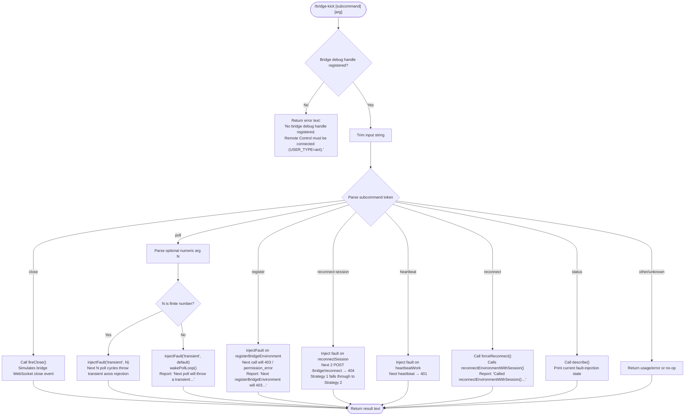

# `/bridge-kick`

> Analysis basis: CC v2.1.169 bundle.js (AST extraction + Claude interpretation)
> Minimum version: v2.1.169

---

## Overview

`/bridge-kick` is a developer/QA diagnostic command that injects synthetic failures into the Remote Control bridge layer, enabling controlled recovery testing without requiring a real network outage. It accepts a subcommand string (and optionally a numeric argument) to select among several fault injection scenarios — including transient poll errors, registration failures, reconnect-strategy exhaustion, heartbeat faults, and forced reconnects. The command is only available when a bridge debug handle is registered, which requires a `USER_TYPE=ant` (internal Anthropic) Remote Control session.

---

## Registration

| Field | Value |
|---|---|
| type | `local` |
| name | `bridge-kick` |
| description | `Inject Remote Control failures for recovery testing` |
| supportsNonInteractive | `false` |
| load_inline | `true` |
| load_ident | `UFf` |
| loc_byte | `12749876` |
| loc_byte_end | `12750055` |
| loc_line | `9124` |
| arbor_handler.name | `UFf` |
| arbor_handler.fqn | `claude-2.1.169::UFf` |
| arbor_handler.kind | `AsyncFunction` |
| arbor_handler.resolution_path | `load_ident` |
| arbor_handler.n_hits | `0` |

Analysis basis: CC v2.1.169 bundle.js:+12749876

The handler was inlined via a `load:()=>Promise.resolve({call: UFf})` shape; there is no separate `module_id`. The Arbor resolver confirmed the handler as `UFf` via the `load_ident` resolution path.

---

## Input Branching

The command dispatches across **seven or more distinct fault-injection branches** based on the trimmed subcommand token (and, in some branches, a secondary numeric argument). A Mermaid flowchart is required.



Analysis basis: CC v2.1.169 bundle.js:+12747635 – +12749789

---

## Behavioral Spec

### Guard: Bridge Debug Handle Check

Before any fault injection logic runs, the handler checks whether a bridge debug handle is currently registered.

```
async function bridgeKickHandler(context):
    rawInput = context.userInput
    debugHandle = lookupBridgeDebugHandle()       // i7K
    if debugHandle is null or undefined:
        return {
            type: "text",
            content: "No bridge debug handle registered. Remote Control must be connected (USER_TYPE=ant)."
        }
    subcommand = rawInput.trim()
    return dispatchSubcommand(debugHandle, subcommand)
```

Analysis basis: CC v2.1.169 bundle.js:+12747635 (call to `i7K`), +12747659 (literal `"text"`), +12747672 (error string literal)

---

### Subcommand: `close`

Fires a synthetic WebSocket close event on the bridge connection.

```
function handleClose(debugHandle):
    debugHandle.fireClose()
    return confirmationText("Bridge close event fired.")
```

Analysis basis: CC v2.1.169 bundle.js:+12747807 (literal `"close"`), +12747924 (call to `_.fireClose`)

---

### Subcommand: `poll` (transient fault injection)

Injects a transient failure into the next poll cycle. An optional numeric argument specifies how many poll cycles should fail.

```
function handlePoll(debugHandle, argString):
    n = Number(argString)
    if Number.isFinite(n):
        debugHandle.injectFault("transient", n)
        return confirmationText("Next " + n + " polls will throw transient error.")
    else:
        debugHandle.injectFault("transient", /* default count */)
        debugHandle.wakePollLoop()
        return confirmationText("Next poll will throw a transient (axios rejection). Poll loop woken.")
```

Analysis basis: CC v2.1.169 bundle.js:+12747822 (`Number`), +12747836 (`Number.isFinite`), +12748038 (literal `"poll"`), +12748053 (literal `"transient"`), +12748094 (literal `"pollForWork"`), +12748132 (literal `503`), +12748146 (call to `_.wakePollLoop`), +12748182 (confirmation string)

---

### Subcommand: `register` (registration fault injection)

Queues a 403/permission_error on the next `registerBridgeEnvironment` call. This simulates a permission failure during environment registration after a close/reconnect cycle.

```
function handleRegister(debugHandle):
    debugHandle.injectFault("registerBridgeEnvironment", {
        httpStatus: 403,
        errorType: "permission_error"
    })
    return confirmationText("Next registerBridgeEnvironment will 403. Trigger with close/reconnect.")
```

Analysis basis: CC v2.1.169 bundle.js:+12748626 (literal `"register"`), +12748682 (literal `"registerBridgeEnvironment"`), +12748730 (literal `403`), +12748744 (literal `"permission_error"`), +12748792 (confirmation string)

---

### Subcommand: `reconnect-session` (reconnect strategy exhaustion)

Injects 404 failures into the next two `POST /bridge/reconnect` calls, forcing the reconnect logic to fall through from Strategy 1 to Strategy 2.

```
function handleReconnectSession(debugHandle):
    debugHandle.injectFault("reconnectSession", {
        httpStatus: 404,
        errorType: "not_found_error",
        count: 2
    })
    return confirmationText("Next 2 POST /bridge/reconnect calls will 404. doReconnect Strategy 1 falls through to Strategy 2.")
```

Analysis basis: CC v2.1.169 bundle.js:+12749101 (literal `"reconnect-session"`), +12749150 (literal `"reconnectSession"`), +12748382 (literal `404`), +12748386 (literal `"not_found_error"`), +12749250 (confirmation string)

---

### Subcommand: `heartbeat` (heartbeat fault injection)

Injects a 401 authentication error on the next heartbeat work item, simulating a session expiry during the heartbeat cycle.

```
function handleHeartbeat(debugHandle):
    debugHandle.injectFault("heartbeatWork", {
        httpStatus: 401,
        errorType: "authentication_error"
    })
    return confirmationText("Next heartbeat will 401.")
```

Analysis basis: CC v2.1.169 bundle.js:+12749355 (literal `"heartbeat"`), +12749385 (literal `401`), +12748404 (literal `"authentication_error"`), +12749418 (literal `"heartbeatWork"`)

---

### Subcommand: `reconnect` (force reconnect)

Immediately triggers a forced reconnect by calling `forceReconnect()` on the debug handle, which internally invokes `reconnectEnvironmentWithSession()`. The user is directed to watch `debug.log` for progress.

```
function handleReconnect(debugHandle):
    debugHandle.forceReconnect()
    return confirmationText("Called reconnectEnvironmentWithSession(). Watch debug.log.")
```

Analysis basis: CC v2.1.169 bundle.js:+12749632 (literal `"reconnect"`), +12749651 (call to `_.forceReconnect`), +12749689 (confirmation string)

---

### Subcommand: `status`

Calls the debug handle's `describe()` method to report current fault injection queue state without injecting any new faults.

```
function handleStatus(debugHandle):
    description = debugHandle.describe()
    return confirmationText(description)
```

Analysis basis: CC v2.1.169 bundle.js:+12749755 (literal `"status"`), +12749789 (call to `_.describe`)

---

### Supporting Infrastructure: Log Writer (`StK`)

Several call-graph paths reach a log-writing subsystem (`StK`) that manages rotating append-only log files. This is used to record fault injection events to disk.

```
function writeToLog(content, options):
    logDir     = path.dirname(logFilePath)
    targetPath = path.join(logDir, logFileName)
    ensureDir(logDir)                          // htK → Mh.mkdir
    appendToFile(targetPath, content)          // htK → Mh.appendFile
    byteSize   = Buffer.byteLength(content)
    if byteSize exceeds rotation threshold:
        rotateLogs(targetPath)                 // Vo8 → Mh.rename / Mh.unlink
    registerShutdownHook(flushLogs)            // Z9 → ZGA.register
```

Analysis basis: CC v2.1.169 bundle.js:+208403 (`StK`), +208157 (`Mh.mkdir`), +208216 (`Mh.appendFile`), +208611 (`Buffer.byteLength`), +208644 (`$ZA`), +208766 (`Z9`), +62328 (`ZGA.register`)

---

### Supporting Infrastructure: Bootstrap Fetch (`H`)

The `H` function in the call graph represents a bootstrap network fetch used during handler module initialisation (not per-invocation). It fetches remote configuration via HTTP, sets `Content-Type: application/json` and `User-Agent` headers, and has a 5000 ms timeout.

```
function bootstrapFetch(url):
    response = fetch(url, {
        headers: {
            "Content-Type": "application/json",
            "User-Agent": <cc-user-agent>
        },
        timeout: 5000
    })
    if parse fails:
        emit telemetry("api_bootstrap_fetch", { result: "parse_failed" })
        return null
    return parsedConfig
```

Analysis basis: CC v2.1.169 bundle.js:+16097956 (literal `"[Bootstrap] Fetching"`), +16098041 (literal `"Content-Type"`), +16098056 (literal `"application/json"`), +16098075 (literal `"User-Agent"`), +16098157 (literal `5000`), +16098278 (literal `"api_bootstrap_fetch"`), +16098300 (literal `"parse_failed"`), +16098330 (literal `"[Bootstrap] Fetch ok"`)

---

## State & Side Effects

| Item | Detail |
|---|---|
| Telemetry | `tengu_feature_sad` — fired on feature-related error path (bundle.js:+1014069) |
| Fault queue mutations | Each subcommand (except `status`) enqueues a synthetic failure into the bridge debug handle's internal fault queue; mutations persist until consumed by the next matching bridge operation |
| `fireClose()` side effect | Triggers the bridge WebSocket close event handler immediately; may initiate the reconnect state machine |
| `forceReconnect()` side effect | Calls `reconnectEnvironmentWithSession()` immediately, advancing the connection state machine |
| `wakePollLoop()` side effect | Signals the poll loop to wake early and consume the injected fault |
| Log file I/O | Fault events are written to a rotating append-only log file via the `StK`/`htK` subsystem; log rotation uses `Mh.rename` and `Mh.unlink` |
| Shutdown hook | A flush callback is registered via `ZGA.register` (bundle.js:+62328) to ensure log buffers are flushed on process exit |
| Hook registration | `ZGA.register` used for process-exit log flush |
| appState changes | No direct `appState` mutations observed in depth-2 traversal |
| Sound | None observed |
| Guard constraint | Command returns an error message and does not proceed if no bridge debug handle is registered (requires `USER_TYPE=ant` with active Remote Control) |

---

## Version History

| Version | Change |
|---|---|
| v2.1.169 | Initial analysis |

---

## Common Mistakes

1. **Running outside an `ant`-type Remote Control session.** The command silently fails with an error message if no bridge debug handle is registered. The session must be established with `USER_TYPE=ant` before invoking `/bridge-kick`.
2. **Providing a non-numeric argument to `poll`.** If the argument after `poll` cannot be parsed as a finite number, the handler falls back to a single-fault injection with `wakePollLoop()`. Pass a valid integer to control the number of failing poll cycles.
3. **Expecting `reconnect-session` to trigger immediately.** The fault is queued; it fires on the *next* `POST /bridge/reconnect` calls (up to 2), not immediately. A close/reconnect cycle must follow to exercise the fault.
4. **Confusing `reconnect` and `reconnect-session`.** The `reconnect` subcommand forces an immediate `forceReconnect()` call; `reconnect-session` only queues a 404 fault for the next reconnect HTTP calls. These exercise different parts of the reconnect state machine.
5. **Forgetting to check `status` after injecting.** Use `/bridge-kick status` to confirm the fault queue state before triggering the condition under test.
6. **Using this command in production or non-`ant` builds.** This command is a developer/QA tool; fault injection against a live session causes real disruption to the Remote Control connection.

---

## Appendix — Identifier Mapping

> For bundle debugging only. Identifiers change across versions.

| Identifier | Role |
|---|---|
| `UFf` | Main handler — `bridgeKickHandler` async function |
| `i7K` | Bridge debug handle lookup — `lookupBridgeDebugHandle` |
| `H` | Bootstrap fetch / module initialisation function |
| `N` | Log-write orchestration / argument dispatch helper |
| `ItK` | Log entry formatter |
| `vGA` | Log level router |
| `CH` | JSON serialiser wrapper (calls `JSON.stringify`) |
| `R4` | String redaction / argument sanitiser |
| `qZA` | Token mapper (calls `.map` on `ZtK`) |
| `rBH` | File write dispatcher |
| `lEA` | Raw file writer (calls `H.write`) |
| `StK` | Rotating log-file writer — `writeToLog` |
| `TBH` | Batched write scheduler (uses `setTimeout`/`setImmediate`) |
| `_4H` | Log path builder |
| `MZA` | Log directory/file path joiner |
| `Vo8` | Log rotation handler (rename + unlink) |
| `htK` | Log append worker (mkdir + appendFile) |
| `n56` | EISDIR error handler |
| `Z9` | Shutdown hook registrar |
| `w2_` | String token splitter |
| `u6H` | Set membership checker (`vO4.has`) |
| `n3` | String replacement helper |
| `M9` | Model string parser |
| `Cc` | Model configuration builder |
| `CC` | Model alias resolver |
| `c9` | Model name normaliser |
| `u2` | Locale/string utility (`ZLH`) |
| `TLH` | Model family classifier |
| `Mk` | Model capability mapper |
| `QcH` | Model feature flag resolver |
| `AE` | Model provider resolver |
| `dG1` | Model provider delegation |
| `zM` | AWS/gateway backend selector |
| `__8` | Model inclusion list checker (`Q5L.includes`) |
| `dcH` | Model exclusion handler (`_6`) |
| `eD` | Extended model descriptor builder |
| `hG` | Full model metadata assembler |
| `o6` | Feature-sad error reporter (emits `tengu_feature_sad`) |
| `d` | Feature error detail builder |
| `K6` | Error context constructor |
| `c76` | Base error class |
| `P$` | User-agent string builder |
| `w2_` | Query-string / token splitter |
| `$ZA` | Log size threshold checker |
| `sBH` | Log sink selector |

---

Note: index built via Arbor fallback; some signals (telemetry, literals) may be missing — see arbor-fallback.js.