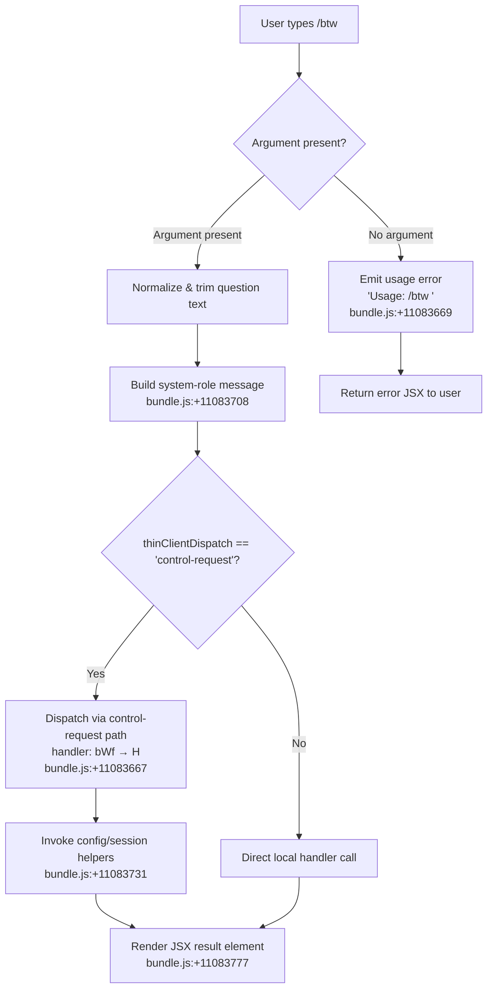

# `/btw`

> Analysis basis: CC v2.1.169 bundle.js (AST extraction + Claude interpretation)
> Minimum version: v2.1.169

---

## Overview

`/btw` ("by the way") lets the user inject a quick side question into a Claude Code session without disrupting the primary conversation thread. The command validates its argument, injects a `system`-role message carrying the question, and dispatches the request to the daemon via the `control-request` thin-client path. It renders a JSX element as its immediate response.

---

## Registration

| Field | Value |
|---|---|
| type | `local-jsx` |
| name | `btw` |
| description | Ask a quick side question without interrupting the main conversation |
| argumentHint | `<question>` |
| immediate | `true` |
| thinClientDispatch | `control-request` |
| module_id | `zgq` |
| load_inline | `true` |
| loc_byte | `11084076` |
| loc_byte_end | `11084315` |
| loc_line | `7319` |
| arbor_handler.name | `bWf` |
| arbor_handler.fqn | `claude-2.1.169::bWf` |
| arbor_handler.kind | `AsyncFunction` |
| arbor_handler.resolution_path | `module_id` |
| arbor_handler.n_hits | `0` |

Analysis basis: CC v2.1.169 bundle.js:+11084076

---

## Input Branching

Three distinct paths are identifiable: missing argument, valid argument dispatched normally, and a system-message injection variant. A Mermaid flowchart is used.



---

## Behavioral Spec

### 1. Argument Validation

```
async function handleBtw(context, rawArgument):
    if rawArgument is empty or whitespace-only:
        return renderErrorElement("Usage: /btw <your question>")
    question = rawArgument.trim()
    return dispatchQuestion(context, question)
```

Analysis basis: CC v2.1.169 bundle.js:+11083667, +11083669

### 2. System-Role Message Construction

The handler wraps the trimmed question inside a `system`-typed message object before dispatch. The role literal `"system"` is embedded directly in the handler.

```
function buildSystemMessage(question):
    return {
        role: "system",     // literal: bundle.js:+11083708
        content: question
    }
```

Analysis basis: CC v2.1.169 bundle.js:+11083708

### 3. Control-Request Dispatch (`bWf` → `H`)

Because `thinClientDispatch` is `"control-request"`, the handler does not run the full agent pipeline inline. Instead it delegates to the bootstrap fetch helper (`H`), which:

1. Logs `"[Bootstrap] Fetching"` (bundle.js:+16097956).
2. Attaches `Content-Type: application/json` and `User-Agent` headers (bundle.js:+16098041, +16098075).
3. Awaits the response with a 5 000 ms timeout (bundle.js:+16098157).
4. On parse failure emits telemetry event `api_bootstrap_fetch` / `parse_failed` (bundle.js:+16098278, +16098300).
5. On success logs `"[Bootstrap] Fetch ok"` (bundle.js:+16098330).

```
async function bootstrapFetch(url, payload):
    log("[Bootstrap] Fetching")
    headers = {
        "Content-Type": "application/json",
        "User-Agent": resolveUserAgent()
    }
    response = await fetchWithTimeout(url, headers, payload, timeout=5000)
    if response cannot be parsed:
        emitTelemetry("api_bootstrap_fetch", {reason: "parse_failed"})
        throw parseError
    log("[Bootstrap] Fetch ok")
    return response
```

Analysis basis: CC v2.1.169 bundle.js:+16097954, +16098157

### 4. Session & Config Helpers (`X8` / `UL8`)

After dispatch succeeds, the handler calls the session-context helper (`X8`) which internally invokes the config-file manager (`UL8`). Key behaviors:

- Acquires a config lock; if acquisition takes too long it emits telemetry `tengu_config_lock_contention` and logs `"Lock acquisition took longer than expected – another Claude instance may be running"` (bundle.js:+3272225, +3272314).
- Reads config with `utf-8` encoding (bundle.js:+3274341).
- If auth data would be lost on write, emits `tengu_config_auth_loss_prevented` and refuses the write (bundle.js:+3272793).
- Backs up config files under a `backups` subdirectory (bundle.js:+3273826).
- Lock timeout: 60 000 ms (bundle.js:+3272995).
- Backup rotation keeps up to 5 files (bundle.js:+3273244).
- Config file permissions set to mode `0o600` (decimal 384, bundle.js:+3273526).

```
async function sessionContextHelper(sessionId, options):
    configPath = resolveConfigPath()
    acquireLock(configPath, timeout=60000)   // emits telgu_config_lock_contention on delay
    raw = readFileSync(configPath, "utf-8")
    config = parseJSON(raw)
    if authWouldBeLost(config, cachedConfig):
        emitTelemetry("tengu_config_auth_loss_prevented")
        return  // refuse write
    applyChanges(config, options)
    writeAtomic(configPath, config, mode=0o600)
    releaseLock()
```

Analysis basis: CC v2.1.169 bundle.js:+3269128, +3272225, +3272314, +3272793, +3272995, +3273244, +3273526

### 5. JSX Result Rendering

After dispatch completes, `bWf` calls `y4.createElement` to produce a JSX node that is returned to the CLI renderer. This is the "immediate" response the user sees.

```
function renderBtwResult(dispatchResult):
    return createElement(BtwResultComponent, { result: dispatchResult })
```

Analysis basis: CC v2.1.169 bundle.js:+11083777

### 6. Argument Text Parsing (`w2_`)

The raw command-line text is pre-processed before the question is extracted:

```
function parseCommandLine(raw):
    parts  = raw.split(separator)
    first  = parts[0].trim()
    idx    = first.indexOf(delimiter)
    if idx >= 0:
        return first.slice(idx + 1)
    return ""
```

Analysis basis: CC v2.1.169 bundle.js:+2984790, +2984829, +2984853, +2984893

### 7. Model-Alias Resolution (`c9` / `M9`)

The downstream message path resolves model aliases. Known alias strings discovered in the call graph include `"opusplan"`, `"sonnet"`, `"haiku"`, `"opus"`, and `"best"` (bundle.js:+2252174, +2252215, +2252254, +2252293, +2252330). Provider-type strings `"anthropicAws"`, `"gateway"`, `"mantle"`, and `"firstParty"` are also present (bundle.js:+2105867, +2105887, +2249023, +2248333).

```
function resolveModelAlias(alias, providerType):
    normalized = alias.trim().toLowerCase()
    switch normalized:
        case "opusplan": return opusPlanModel
        case "sonnet":   return sonnetModel
        case "haiku":    return haikuModel
        case "opus":     return opusModel
        case "best":     return bestAvailableModel(providerType)
        default:         return normalized
```

Analysis basis: CC v2.1.169 bundle.js:+2248110, +2252078

---

## State & Side Effects

| Item | Detail |
|---|---|
| Telemetry — `tengu_feature_sad` | Emitted on a feature-level failure path (bundle.js:+1014069) |
| Telemetry — `tengu_config_lock_contention` | Config lock held longer than expected (bundle.js:+3272314) |
| Telemetry — `tengu_config_stale_write` | Stale config write detected (bundle.js:+3272450) |
| Telemetry — `tengu_config_parse_error` | Config JSON failed to parse (bundle.js:+3274889) |
| Telemetry — `tengu_config_auth_loss_prevented` | Refused write that would erase auth (bundle.js:+3272793) |
| Telemetry — `tengu_bg_dispatch_sigkill_escalate` | Background daemon SIGKILL escalation (bundle.js:+16506490) |
| Telemetry — `tengu_bg_dispatch_low_mem` | Daemon dispatch aborted due to low memory (bundle.js:+16507091) |
| Telemetry — `tengu_bg_spare_enable` | Spare background session enabled (bundle.js:+16507795) |
| Telemetry — `tengu_bg_spare_claim` | Spare session claimed for dispatch (bundle.js:+16507923) |
| Telemetry — `tengu_bg_spare_claim_fail` | Spare session claim failed (bundle.js:+16508189) |
| Telemetry — `tengu_bg_proto_mismatch` | Daemon protocol version mismatch (bundle.js:+16493328) |
| Telemetry — `tengu_bg_dispatch_stale_drop` | Stale dispatch dropped (bundle.js:+16494695) |
| Telemetry — `tengu_bg_attach_legacy_autorespawn` | Legacy job auto-respawn on attach (bundle.js:+16497216) |
| Telemetry — `tengu_bg_attach` | Background session attach event (bundle.js:+16498374) |
| Telemetry — `tengu_bg_attach_stall_gave_up` | Attach gave up after stall (bundle.js:+16499292) |
| Telemetry — `tengu_bg_attach_stall_respawn` | Attach triggered respawn after stall (bundle.js:+16499562) |
| Telemetry — `tengu_bg_attach_kick` | Session kicked due to duplicate attach (bundle.js:+16500512) |
| Config file write | Atomic write with lock, mode `0o600`, backup rotation (max 5 copies) |
| Session state | Dispatches via daemon `control-request`; may spawn/respawn background worker |
| Hook registration | `Z9` calls `ZGA.register` (bundle.js:+62328) — registers a cleanup/hook on session lifecycle |
| Sound | None detected |
| JSX render | Immediate JSX element rendered after dispatch (bundle.js:+11083777) |

---

## Version History

| Version | Change |
|---|---|
| v2.1.169 | Initial analysis |

---

## Common Mistakes

1. **Omitting the argument** — `/btw` with no text triggers the usage error `"Usage: /btw <your question>"` immediately; no API call is made.
2. **Expecting conversation context injection** — the command sends a `system`-role message, not a `user`-role one; the model may handle it differently from a normal user turn.
3. **Assuming synchronous execution** — the handler is `AsyncFunction`; callers relying on a synchronous return value will get a pending Promise instead.
4. **Running while another Claude instance holds the config lock** — a second instance may delay the command by up to 60 000 ms before emitting `tengu_config_lock_contention`.
5. **Confusing `/btw` with a full `/ask`** — `immediate: true` and `thinClientDispatch: "control-request"` mean this command bypasses the normal streaming agent pipeline; it is intentionally lightweight.

---

## Appendix — Identifier Mapping

> For bundle debugging only. Identifiers change across versions.

| Identifier | Role |
|---|---|
| `bWf` | Main handler for `/btw` (AsyncFunction, Arbor-resolved via module_id `zgq`) |
| `H` | Bootstrap fetch / control-request dispatcher |
| `N` | Core message-build / send helper |
| `ItK` | Message-type preparation helper |
| `vGA` | Sub-helper inside `ItK` (calls `yoK`, `hoK`) |
| `CH` | JSON serialization utility (`JSON.stringify` wrapper) |
| `R4` | Text-redaction / sanitization helper (injects `"[REDACTED]"`) |
| `qZA` | Array-map utility used by `R4` |
| `rBH` | Write-to-stream helper |
| `lEA` | Low-level stream write wrapper |
| `StK` | Session/transcript logging orchestrator |
| `TBH` | Debounced-write scheduler (uses `setTimeout`, `setImmediate`, `clearTimeout`) |
| `_4H` | Log-entry formatter (joins paths, calls `A_`, `I6`) |
| `n56` | Error-code helper (calls `E8`) |
| `MZA` | Path-join utility for log files |
| `Vo8` | File-stat / rename / unlink helper (`.txt` extension, rotate at size 4) |
| `htK` | Append-file writer with mkdir and rotation |
| `Z9` | Hook/cleanup registrar (`ZGA.register`) |
| `P$` | Pre-flight check helper |
| `w2_` | Command-line argument parser (split / trim / indexOf / slice) |
| `u6H` | Feature-flag / capability map lookup (`vO4.has`) |
| `n3` | String replacement utility |
| `M9` | Model resolution entry point |
| `Cc` | Model-config builder (calls `tY`, `pU`, `FA`, `CC`) |
| `CC` | Model-string parser (trims, checks `"anthropic."` prefix) |
| `c9` | Alias normalizer (lowercase, replace, check `[1m]`/`opusplan`/`sonnet` etc.) |
| `u2` | Sub-normalizer used by `c9` (calls `ZLH`) |
| `TLH` | Provider-list inclusion checker (`GLH.includes`) |
| `Mk` | Model-object constructor (calls `zM`, `F5`) |
| `QcH` | Secondary model constructor |
| `AE` | Model variant builder (calls `zM`, `F5`, `YA`) |
| `dG1` | Delegates to `AE` |
| `zM` | Model-base helper (calls `YA`) |
| `__8` | Allowlist checker (`Q5L.includes`) |
| `dcH` | Disallow-list checker (`_6`) |
| `eD` | Extended model resolver (calls `c9`, `hG`) |
| `hG` | Full model-object assembler (calls `yA`, `h8H`, `cDH`, `ccH`, `AE`, `x2`, `zM`, `YA`, `F5`, `Mk`) |
| `o6` | Feature-sad reporter (emits `tengu_feature_sad`, calls `d`, `K6`) |
| `d` | Low-level error/event emitter |
| `K6` | Error formatter (calls `c76`) |
| `c76` | Base error-construction helper |
| `X8` | Session context / config orchestrator |
| `UL8` | Config file read/write manager (lock, backup, atomic write) |
| `L` | File-system set / finalizer (add, delete, finally) |
| `f` | Resource-close pair (A.close, q.close) |
| `hT1` | Config-object merger (`Object.assign`, calls `Tz_`) |
| `Tz_` | Config transform helper (calls `yT1`) |
| `E8` | Error-code classifier |
| `y7H` | Config-read engine (readFileSync, parse, backup, mkdir, copy) |
| `F6` | JSON parse wrapper |
| `Vu` | String prefix stripper (`startsWith` / `slice`) |
| `ke1` | Backup-directory traversal helper |
| `yG_` | Path join + `A_` helper |
| `w` | Background daemon process manager |
| `ViH` | Validation / integrity helper |
| `P` | IPC buffer reader (Buffer.concat, indexOf, off, setTimeout, subarray) |
| `X` | Stream timeout wrapper |
| `J` | Process-kill controller (`A.values`, `S.kill`) |
| `Df` | Stream-end + CH helper |
| `Lj5` | Daemon message dispatcher / multiplexer (large handler) |
| `EH` | String coercion helper |
| `E` | Slice + Math.max/min helper |
| `G` | SDK connection manager (M76, yS, ZN, Promise.all, Un, iF, hH, wA) |
| `WO6` | Atomic symlink-safe file writer (lstat, rename, writeFileSync, fchmodSync, fsyncSync) |
| `O` | Background-session descriptor (`S8`) |
| `k8` | Error-rethrow helper (calls `E8`) |
| `OJH` | Object-inspection helper |
| `Ie1` | Object.entries iterator |
| `MP6` | Timestamp helper (`Date.now`) |
| `pL8` | Persistent-state writer (MP6, VG, l6, fw.dirname, sj, CH, WO6, N) |

---

Note: index built via Arbor fallback; some signals (telemetry, literals) may be missing — see arbor-fallback.js.