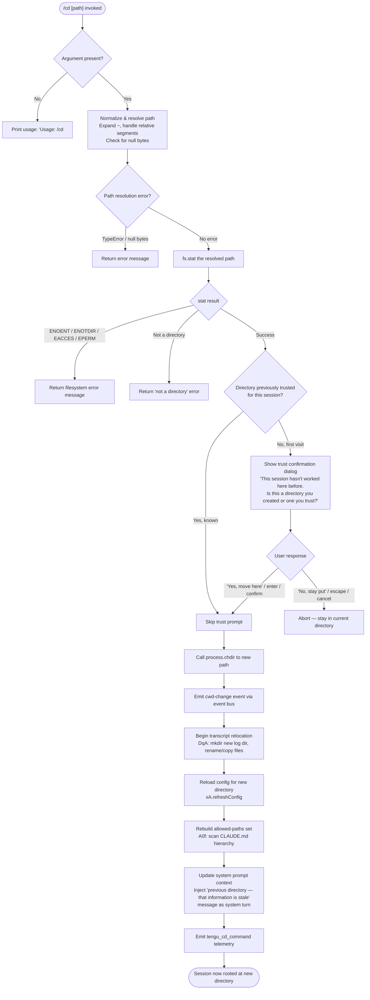

# `/cd`

> Analysis basis: CC v2.1.169 bundle.js (AST extraction + Claude interpretation)
> Minimum version: v2.1.169

---

## Overview

The `/cd` command moves the active Claude Code session to a new working directory. It resolves the supplied path (including `~` expansion and relative segments), validates the target is a real, accessible directory, optionally prompts the user to confirm a trust decision for first-time directories, and then atomically relocates the session's working directory, transcript storage, and associated configuration context.

---

## Registration

| Field | Value |
|---|---|
| type | `local-jsx` |
| name | `cd` |
| description | Move this session to a new working directory |
| argumentHint | `<path>` |
| module_id | `Bgq` |
| load_inline | `true` |
| loc_byte | `11116354` |
| loc_byte_end | `11116514` |
| loc_line | `7340` |
| arbor_handler.name | `L0f` |
| arbor_handler.fqn | `claude-2.1.169::L0f` |
| arbor_handler.kind | `AsyncFunction` |
| arbor_handler.resolution_path | `module_id` |
| arbor_handler.n_hits | `0` |

Analysis basis: CC v2.1.169 bundle.js:+11116354

---

## Input Branching

The command exhibits five or more distinct branches (no argument supplied, path resolution failure, filesystem errors, first-time-directory trust gate, and successful relocation), so a Mermaid flowchart is used.



Analysis basis: CC v2.1.169 bundle.js:+11114841 (handler entry `L0f`), +11114802 (usage string), +11115092 (error codes), +11113396 (`process.chdir`), +11113438 (`DqA` transcript relocation), +11113693 (`refreshConfig`), +11113714 (telemetry)

---

## Behavioral Spec

### 1. Handler Entry and Argument Validation

```
async function cdCommandHandler(args, context):
    if args is empty or blank:
        display "Usage: /cd <path>"
        return

    rawPath = args.trim()
    resolvedPath = resolvePath(rawPath, context)   // calls pathNormalize (k1)
    // throws TypeError if path contains null bytes
    // expands "~/" prefix using os.homedir()
    // handles Windows "~\" prefix
    // calls path.normalize (NFC on macOS), then path.resolve / path.isAbsolute
```

Analysis basis: CC v2.1.169 bundle.js:+11114802 (usage literal), +1056526 (`TypeError`), +1056733 ("Path contains null bytes"), +1056830 (`os.homedir`), +1056861 (`~/`), +1056990 (`path.isAbsolute`), +1057044 (`path.resolve`)

---

### 2. Path Resolution (`pathNormalize` — `k1`)

```
function pathNormalize(rawPath, currentWorkingDir):
    if rawPath contains null bytes:
        throw TypeError("Path contains null bytes")

    normalized = path.normalize(rawPath)   // NFC normalization on relevant platforms
    if normalized starts with "~/":
        normalized = path.join(os.homedir(), normalized.slice(2))
    else if platform is "windows" and normalized matches Windows home prefix:
        // handle "~\" expansion
        normalized = path.join(os.homedir(), normalized.slice(2))

    if path.isAbsolute(normalized):
        return path.resolve(normalized)
    else:
        return path.resolve(currentWorkingDir, normalized)
```

Analysis basis: CC v2.1.169 bundle.js:+1056480 (`C6` context store), +1056767 (`H.trim`), +1056792 (`BI.normalize`), +1056877 (`BI.join`), +1056923 (`r6` platform check), +1056941 (`q.match`), +1057044 (`BI.resolve`)

---

### 3. Filesystem Validation

```
async function validateDirectory(resolvedPath):
    try:
        stats = await fs.stat(resolvedPath)
    catch error:
        if error.code in ["ENOENT", "ENOTDIR", "EACCES", "EPERM"]:
            return { ok: false, reason: error.code }
        throw error

    realPath = await fs.realpath(resolvedPath)   // resolves symlinks
    parentDir = path.dirname(realPath)
    boldName  = chalk.bold(path.basename(realPath))

    if not stats.isDirectory():
        return { ok: false, reason: "notADirectory" }

    return { ok: true, realPath, parentDir }
```

Analysis basis: CC v2.1.169 bundle.js:+11114893 (`GC8.stat`), +11115092 (`E8` error handler), +11115105–11115148 (ENOENT / ENOTDIR / EACCES / EPERM literals), +11114930 (`J6.bold`), +11114985 (`wC6.dirname`), +11115309 (`GC8.realpath`)

---

### 4. Trust Gate for First-Time Directories

```
async function checkDirectoryTrust(realPath, sessionTrustedDirs):
    if sessionTrustedDirs.has(realPath):
        return "trusted"

    // Show interactive JSX dialog (local-jsx type)
    response = await showConfirmDialog({
        title:   "Claude Code",
        message: "This session hasn't worked here before. Is this a directory you created or one you trust?",
        detail:  "… will be able to read, edit, and execute files here.",
        securityLink: "https://code.claude.com/docs/en/security",
        confirmLabel: "Yes, move here",
        cancelLabel:  "No, stay put",
        keyBindings: {
            enter:  "confirm",
            escape: "cancel"
        }
    })

    if response in ["cancel", "escape"]:
        return "rejected"

    sessionTrustedDirs.add(realPath)
    return "trusted"
```

Analysis basis: CC v2.1.169 bundle.js:+11111923 ("This session hasn"), +11111947 ("t worked here before…"), +11112056 ("Claude Code"), +11112074 ("ll be able to read…"), +11112292 (security URL), +11112446 ("Yes, move here"), +11112475 ("No, stay put"), +11112715 ("enter"), +11112730 ("confirm"), +11112777 ("escape"), +11112793 ("cancel"), +11112928 ("Moving to a new directory:")

---

### 5. Directory Change and Event Emission (`q0f`)

```
async function performDirectoryChange(resolvedPath, context):
    process.chdir(resolvedPath)                // Node built-in — actually changes CWD
    emitCwdChangeEvent(resolvedPath)            // uZ → Of6 → Ul8.emit
    updatePathStore(resolvedPath)               // rz → path store update via o__

    // Emit telemetry
    telemetry.track("tengu_cd_command")

    // Refresh configuration for the new directory
    await xA.refreshConfig()

    // Rebuild allowed-path set and CLAUDE.md hierarchy (A0f)
    newAllowedPaths = buildAllowedPaths(resolvedPath)

    // Inject stale-directory notice into conversation as a system turn
    injectSystemMessage(
        "previous directory — that information is stale. All tool calls and …"
    )
```

Analysis basis: CC v2.1.169 bundle.js:+11113396 (`process.chdir`), +11113413 (`rz` path store), +11113419 (`uZ` event emit), +11113693 (`xA.refreshConfig`), +11113714 (`tengu_cd_command`), +11113749 (`A0f`), +11113908 (stale-directory literal), +11115692 ("system" turn type), +11115729 (`N` system message injector)

---

### 6. Transcript Relocation (`DqA`)

```
async function relocateTranscript(oldDir, newDir):
    newLogDir = computeLogPath(newDir)           // I6 → xZ
    session.beginTranscriptRelocation()
    await session.flush()

    await fs.mkdir(newLogDir, { mode: 0o700 })  // 448 decimal = 0o700 octal
    await moveOrCopyFiles(oldDir, newLogDir)     // mDK: rename → fallback copy+rm
    session.endTranscriptRelocation()

    // Handle edge cases for file rename across devices (EXDEV)
    // and busy files (EBUSY), empty directories (ENOTEMPTY)
```

Analysis basis: CC v2.1.169 bundle.js:+13346407 (`I6`), +13346546 (`beginTranscriptRelocation`), +13346586 (`flush`), +13346602 (`uK.mkdir`), +13346632 (`448` permission literal), +13346648 (`mDK`), +13346864 (`endTranscriptRelocation`), +13346977 (EEXIST), +13347004 (EBUSY), +13347017 (ENOTEMPTY), +13347118 (EXDEV)

---

### 7. Allowed-Paths Rebuild (`A0f`)

```
function rebuildAllowedPaths(newWorkingDir):
    rootParts = path.parse(newWorkingDir)
    dirs      = []

    // Walk from newWorkingDir up to filesystem root
    current = newWorkingDir
    while current != path.dirname(current):
        dirs.push(current)
        current = path.dirname(current)
    dirs.reverse()

    allowedSet = new Set()
    for dir of dirs:
        scanForClaudeMd(dir, allowedSet)       // PG6: looks for CLAUDE.md, .claude/
        collectFileEntries(dir, allowedSet)    // XG6: reads D6 (disable bypass permissions)

    return allowedSet
```

Analysis basis: CC v2.1.169 bundle.js:+11113189 (`NX`), +11113235 (`wC6.parse`), +11113265 (`wC6.dirname`), +11113302 (`A.reverse`), +11113330 (`PG6`), +11113349 (`XG6`), +4962343 ("CLAUDE.md"), +4962410 (".claude"), +4962511 ("CLAUDE.local.md")

---

### 8. Context-Store Updates (`mgq` — display/prompt context)

```
function updatePromptContext(newWorkingDir, context):
    prettifiedPath = prettifyPath(newWorkingDir)   // Mv: ~ substitution
    pathSegments   = splitPath(prettifiedPath)      // WC8: handle leading /
    allowedPaths   = getPatternSet(context)         // H0f: zqA glob compiler
    commandBlocks  = buildCommandBlocks(context)    // zQ: deny rule flatMap
    ruleResults    = evaluateRules(pathSegments)    // Q3H: bbH cache lookup
```

Analysis basis: CC v2.1.169 bundle.js:+11110011 (`L1`), +11110018 (`Mv`), +11110078 (`WC8`), +11110112 (`$.some`), +11110124 (`H0f`), +11110149 (`zQ`), +11110240 (`K`), +11110300 (`Q3H`), +11110689 (".."), +11110708 ("../")

---

## State & Side Effects

| Item | Detail |
|---|---|
| Telemetry | `tengu_cd_command` (bundle.js:+11113714); `tengu_shell_set_cwd` (bundle.js:+6883136); `tengu_feature_sad` (bundle.js:+1014069); `tengu_disable_bypass_permissions_mode` (bundle.js:+4227303); `tengu_claude_rules_md_permission_error` (bundle.js:+4961521); `tengu_paper_halyard` (bundle.js:+4964259); `tengu_config_lock_contention` (bundle.js:+3272314); `tengu_config_stale_write` (bundle.js:+3272450); `tengu_config_parse_error` (bundle.js:+3274889); `tengu_config_auth_loss_prevented` (bundle.js:+3272793) |
| `process.chdir` | Called synchronously with the resolved real path (bundle.js:+11113396) |
| CWD event | `Ul8.emit` fires a CWD-change event after `process.chdir` (bundle.js:+43390) |
| Transcript relocation | New log directory created (`mkdir 0o700`); existing transcript files moved/copied via `mDK` (bundle.js:+13346602) |
| Config reload | `xA.refreshConfig()` re-reads `CLAUDE.md` hierarchy, project settings, and flag settings for the new directory (bundle.js:+11113693) |
| Allowed-paths set | Rebuilt by `A0f` scanning CLAUDE.md, CLAUDE.local.md, and `.claude/` from root to new CWD (bundle.js:+11113749) |
| System message injection | A system-role turn noting that previous-directory context is stale is inserted into the conversation (bundle.js:+11113908, +11115692) |
| Trust store | First-time directory trust decisions are persisted into the session trust set; bypass-permissions mode may be disabled if active (bundle.js:+4227303) |
| Config lock | A file lock (60 000 ms timeout) is acquired before writing config; contention is telemetered as `tengu_config_lock_contention` (bundle.js:+3272314, +3272995) |
| Sound | None observed in depth-2 traversal |

---

## Version History

| Version | Change |
|---|---|
| v2.1.169 | Initial analysis |

---

## Common Mistakes

1. **Omitting the path argument** — `/cd` with no argument prints `Usage: /cd <path>` and does nothing. Always supply a path, e.g. `/cd ~/projects/myapp`.
2. **Using a file path instead of a directory path** — the command validates that the target is a directory via `fs.stat`; passing a regular file returns an error.
3. **Expecting instant context update** — the command injects a system message warning that prior conversation context refers to the *old* directory. Tool calls made immediately after `/cd` use the new CWD, but the model's in-context knowledge of file layouts from before the switch is marked stale.
4. **Dismissing the trust dialog without reading it** — choosing "No, stay put" silently aborts the move. The session remains in the original directory with no error message.
5. **Paths with null bytes** — any path containing a null byte (`\0`) is rejected with a `TypeError` before any filesystem access occurs (bundle.js:+1056733).
6. **Assuming relative paths are resolved from shell CWD** — relative paths are resolved against the *session's current working directory*, not the shell's `$PWD` at the time Claude Code was launched, which may differ after a prior `/cd`.
7. **Expecting MCP server state to follow** — the transcript and config are relocated, but MCP server connections (managed by `mSH`/`dXA`) are not automatically restarted to reflect the new directory.

---

## Appendix — Identifier Mapping

> For bundle debugging only. Identifiers change across versions.

| Identifier | Role |
|---|---|
| `L0f` | Main `/cd` command handler (AsyncFunction, Arbor-resolved) |
| `H` | Bootstrap/fetch utility (called at depth-1 for context retrieval) |
| `N` | Shared utility: system message injector / turn builder |
| `ItK` | Input argument tokenizer |
| `vGA` | Argument value extractor |
| `CH` | JSON serialization helper |
| `R4` | Path string formatter (truncation / display) |
| `qZA` | Path segment mapper |
| `rBH` | Log write wrapper |
| `lEA` | Low-level log file writer |
| `StK` | Conversation-log manager / persistence coordinator |
| `TBH` | Debounced flush scheduler (uses `clearTimeout`/`setTimeout`/`setImmediate`) |
| `_4H` | Log segment builder |
| `l6` | Logger / debug emitter |
| `n56` | Log metadata encoder |
| `MZA` | Log path joiner |
| `Vo8` | Log file rotate/rename helper (uses `Mh.stat`, `Mh.rename`, `Mh.unlink`) |
| `htK` | Log append handler (mkdir + appendFile) |
| `Z9` | Hook registration entry point (`ZGA.register`) |
| `P$` | HTTP response parser |
| `w2_` | Query-string / header splitter |
| `u6H` | Set membership checker for feature flags |
| `n3` | String replacement normalizer |
| `M9` | Model-name resolution entry point |
| `Cc` | Model alias dispatcher |
| `CC` | Model string canonicalizer |
| `c9` | Model shorthand expander (opusplan/sonnet/haiku/opus/best) |
| `u2` | Model-name locale normalizer (`ZLH`) |
| `TLH` | Model allow-list checker (`GLH.includes`) |
| `Mk` | Model metadata resolver (`zM`, `F5`) |
| `QcH` | Model capability query (`F5`) |
| `AE` | Model alias entry (`zM`, `F5`, `YA`) |
| `dG1` | Model alias chain follower |
| `zM` | Model registry lookup (`YA`) |
| `__8` | Model inclusion checker (`Q5L.includes`) |
| `dcH` | Model detail fetcher (`_6`) |
| `eD` | Model resolution with error fallback |
| `hG` | Full model metadata assembler |
| `o6` | Feature-flag sad-path handler (`tengu_feature_sad`) |
| `d` | Feature flag store getter |
| `K6` | Feature flag value reader |
| `c76` | Feature flag low-level accessor |
| `k1` | Path normalization and resolution function |
| `C6` | Async-local-storage context reader |
| `Wi6` | Context store getter (`Pi6.getStore`) |
| `Td` | Context store fallback provider |
| `G_` | Global context accessor (`xZ`) |
| `xZ` | Root context object |
| `SO` | String NFC-normalize wrapper |
| `E8` | Error code classifier |
| `mgq` | Prompt/display context builder for new directory |
| `L1` | Base context record constructor |
| `Mv` | Path prettifier (~ substitution, symlink traversal) |
| `H5` | Symlink stat helper |
| `KD` | Symlink resolve helper |
| `M` | MCP client manager (get/update/apply) |
| `mSH` | MCP server connection initializer |
| `cd8` | MCP connection result applier |
| `L` | Pending-promise tracker |
| `$` | Settings accessor |
| `dXA` | MCP client collection updater |
| `H4H` | Deep symlink resolver with loop detection |
| `D` | Process exit / abort handler |
| `c3` | Realpath resolver helper |
| `WC8` | Path-string leading-segment stripper |
| `H0f` | Allow-pattern set builder (glob to regex) |
| `zqA` | Glob pattern compiler |
| `K` | String padEnd formatter |
| `uaf` | Path trust evaluator (k1 + G_) |
| `YC6` | Permission rule resolver (`r6`, `Pv`) |
| `_0f` | Outside-allowed-pattern result emitter |
| `zQ` | Deny-rule flat-map collector |
| `W3` | Rule entry parser (`wh4`, `Jh4`, `Dh4`) |
| `wh4` | Rule property extractor |
| `rT` | `Object.hasOwn` wrapper |
| `Jh4` | Rule condition field accessor |
| `Dh4` | Rule condition string replacer |
| `Q3H` | Cached rule evaluator |
| `HFq` | Rule cache key builder |
| `bbH` | Rule cache read/write (`DXq`) |
| `Jy6` | Rule cache hit handler |
| `Xy6` | Rule text normalizer (trim, startsWith, indexOf) |
| `ua_` | Rule cache miss handler |
| `u_` | App-state working-directory extractor |
| `US8` | Working-directory state setter (type A) |
| `BS8` | Working-directory state setter (type B) |
| `Jb` | Bypass-permissions mode disabler (`tengu_disable_bypass_permissions_mode`) |
| `D6` | Permission tracking entry (tX6 set, sB map) |
| `HP6` | Permission history push |
| `_P6` | Permission history pop |
| `tu` | Permission state transition |
| `VL8` | Permission dedup guard (zG_ set) |
| `y6` | Permission timestamp recorder (`Date.now`, `jhL`) |
| `K0f` | New-directory confirmation dialog renderer (JSX) |
| `U5` | Dialog text formatter |
| `Yh4` | Dialog string replacer |
| `wGH` | Dialog data connector (`dBA`) |
| `dBA` | Dialog data provider |
| `q0f` | Core directory-switch executor (`process.chdir` + downstream) |
| `rz` | Path store updater (`cj8.isAbsolute`, `cj8.resolve`, `k8`, `o__`) |
| `k8` | Error wrapper / re-thrower |
| `o__` | Context-store path writer (`Pi6.getStore`, `SO`, `f6H`) |
| `f6H` | Context-store field setter (`Of6`) |
| `uZ` | CWD-change event emitter (`Of6`, `Ul8.emit`) |
| `Of6` | Path normalization + store write |
| `DqA` | Transcript relocation orchestrator |
| `I6` | Log-path derivation function |
| `o4` | Hook dispatcher (`Z9`) |
| `B$H` | Environment tag reader (`_6`, `rDK`, `ex`, `tvH`) |
| `_6` | String coercion wrapper |
| `rDK` | Environment variable reader |
| `ex` | Build-tag checker |
| `tvH` | Timestamp formatter (`tW`, `hM`) |
| `BJ` | Event bus dispatcher (`DGA`, `YGA`) |
| `DGA` | Synchronous event dispatcher |
| `YGA` | Async event emitter (`eB6.emit`) |
| `mDK` | File move/copy worker (rename → EXDEV fallback to copy+rm) |
| `HwK` | Recursive directory copy (mkdir + readdir loop) |
| `hH` | Network traffic classifier (`essential-traffic`) |
| `wA` | Error message formatter |
| `kq` | Traffic queue manager (`duA`) |
| `av4` | Queue ring-buffer manager (`Di6.shift`, `Di6.push`) |
| `o0` | Post-move cleanup hook |
| `A0f` | Allowed-paths set rebuilder (CLAUDE.md hierarchy walker) |
| `Z2` | Path normalizer for allowed-paths (`m5.normalize`, `r6`) |
| `PG6` | CLAUDE.md directory scanner (`bO`, `ym`, `JXH`, `wG6`) |
| `bO` | Base config loader (`Tv`) |
| `ym` | CLAUDE.md file reader with stat/realpath |
| `JXH` | Recursive directory entry collector |
| `wG6` | Gitignore-aware path filter |
| `XG6` | Disable-bypass-permissions file collector |
| `eR8` | HTML entity escaper (replaces `&`, `<`, `>`, `&#13;`, `&#10;`) |
| `e0` | Post-move UI refresh trigger |
| `zJH` | Conversation-turn system-message injector (`y6`, `_c`, `fw.resolve`) |
| `_c` | Path normalizer for conversation store |
| `fP6` | Session-state updater after directory change |
| `X8` | Global config save (lock + write) |
| `UL8` | Config file writer with lock (backup rotation, 60 000 ms timeout) |
| `hT1` | Config object merger (`Object.assign`) |
| `y7H` | Config file reader (utf-8, readFileSync, statSync) |
| `ViH` | Config validator |
| `yG_` | Config backup path builder |
| `V` | Byte-length/slice utility |
| `P` | TCP/socket stream reader |
| `E` | Math clamp utility |
| `WO6` | Atomic file write with rename (random temp name, fchmod, fsync) |
| `f` | Socket close helper |
| `OJH` | Config diff checker |
| `Ie1` | Config entry enumerator |
| `MP6` | Config timestamp recorder |
| `pL8` | Config partial writer (WO6-backed) |
| `Ugq` | React memo-cache sentinel holder (`Symbol.for("react.memo_cache_sentinel")`) |