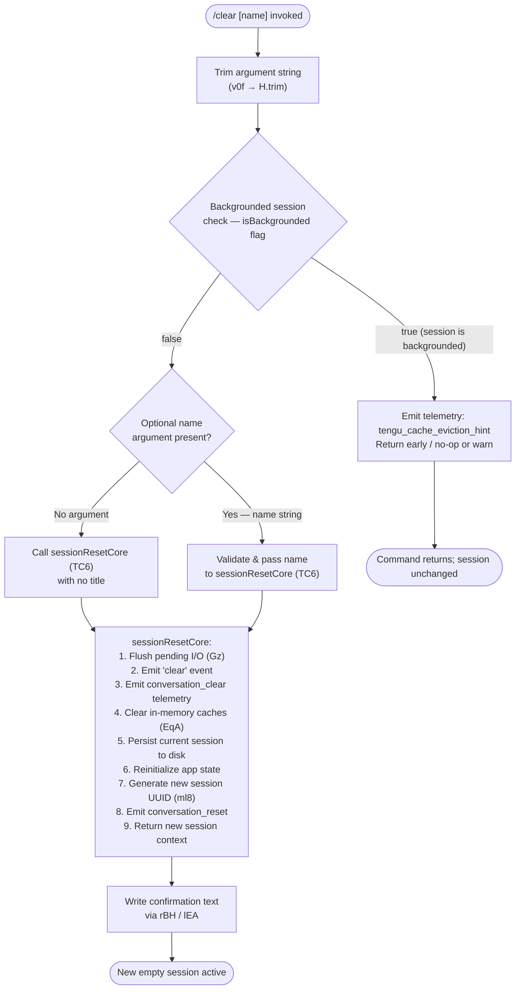

# `/clear`

> Analysis basis: CC v2.1.169 bundle.js (AST extraction + Claude interpretation)
> Minimum version: v2.1.169

---

## Overview

`/clear` starts a fresh conversation session with an empty context window, discarding in-memory conversation history while preserving the previous session on disk so it can be resumed later with `/resume`. It also accepts an optional `[name]` argument to label the new session. The command supports non-interactive (scripted) execution and dispatches a `post-text` action in thin-client environments.

---

## Registration

| Field | Value |
|---|---|
| type | `local` |
| name | `clear` |
| description | `Start a new session with empty context; previous session stays on disk (resumable with /resume)` |
| argumentHint | `[name]` |
| supportsNonInteractive | `true` |
| thinClientDispatch | `post-text` |
| aliases | `reset`, `new` |
| module_id | `AQq` |
| load_inline | `true` |
| loc_byte | `11132561` |
| loc_byte_end | `11132852` |
| arbor_handler.name | `v0f` |
| arbor_handler.fqn | `claude-2.1.169::v0f` |
| arbor_handler.kind | `AsyncFunction` |
| arbor_handler.resolution_path | `module_id` |
| arbor_handler.n_hits | `0` |

Analysis basis: CC v2.1.169 bundle.js:+11132561

---

## Input Branching

The command flow has four distinct paths: no argument (simple reset), named session, backgrounded-session guard, and non-interactive thin-client dispatch. A flowchart is used because there are 3+ branches.



Analysis basis: CC v2.1.169 bundle.js:+11132387 (v0f entry), +11130478 ("clear" literal), +11130673 ("isBackgrounded" literal), +11130604 ("conversation_clear" literal)

---

## Behavioral Spec

### Top-level Handler — `sessionClearHandler` (`v0f`)

```
async function sessionClearHandler(commandInput, appContext):
    rawArg = commandInput.trim()           // H.trim @ +11132387

    // Delegate to sessionResetDispatch which reads app state
    result = await sessionResetDispatch(rawArg, appContext)  // TC6 @ +11132423

    // Write confirmation message to output stream
    writeOutputLine(result)                // rBH/lEA path @ +209062
    return result
```

Analysis basis: CC v2.1.169 bundle.js:+11132387, +11132423

---

### Argument Normalisation — `argumentNormalizer` (`N` reachable via `H`)

```
function argumentNormalizer(rawArg):
    trimmed = rawArg.trim()
    if trimmed includes known debug prefix:
        logDebug(trimmed)                  // "debug" literal @ +208891
    upper = trimmed.toUpperCase()          // _.toUpperCase @ +209017
    sanitized = redactSensitive(upper)     // R4, "[REDACTED]" literal @ +200573
    return sanitized
```

Analysis basis: CC v2.1.169 bundle.js:+208891, +209017, +200573

---

### Core Session Reset — `sessionResetCore` (`TC6`)

This is the main orchestrator. It performs the following steps sequentially:

```
async function sessionResetCore(sessionName, appContext):

    // 1. Parse optional terminal width hint
    termWidth = parseTerminalWidth(appContext)   // ZC6 @ +11130462
    termWidth = clamp(Math.max, Math.min, termWidth)

    // 2. Flush pending buffered output / abort in-flight tasks
    flushAndAbort(appContext)                    // BuH @ +11130474

    // 3. Record AbortSignal with timeout for the reset operation
    signal = AbortSignal.timeout(resetTimeout)  // @ +11130522

    // 4. Emit "clear" marker to rendering layer
    emit("clear")                               // "clear" literal @ +11130478

    // 5. Fire conversation_clear telemetry
    recordTelemetry("conversation_clear")       // "conversation_clear" @ +11130604

    // 6. Check isBackgrounded guard
    if appContext.isBackgrounded:               // "isBackgrounded" @ +11130673
        emit tengu_cache_eviction_hint          // @ +11130566
        return earlyResult

    // 7. Invalidate all in-memory caches via cacheInvalidator (EqA)
    await cacheInvalidator(appContext)          // EqA @ +11130868

    // 8. Reinitialize working-directory resolver
    reinitWorkdir(appContext)                   // rz @ +11130877

    // 9. Clear in-process state collections
    clearCollections(appContext)                // _.clear @ +11130886

    // 10. Flush pending hook queue
    flushHookQueue(appContext)                  // Gz @ +11131287

    // 11. Generate a new random session UUID
    newSessionId = crypto.randomUUID()          // egq.randomUUID @ +11131727

    // 12. Reinitialize MCP session manager
    reinitMcpManager(appContext)                // ml8 @ +11131745

    // 13. Emit conversation_reset event
    emitConversationReset(newSessionId)         // "conversation_reset" @ +11131688

    // 14. Rebuild rendering context (coordinator / normal modes)
    rebuildRenderer(appContext)                 // "coordinator"/"normal" @ +11132080/+11132094

    // 15. Apply optional session name label
    if sessionName is not empty:
        applySessionName(sessionName, appContext)

    return newSessionContext(newSessionId)
```

Analysis basis: CC v2.1.169 bundle.js:+11130462, +11130474, +11130522, +11130478, +11130604, +11130673, +11130566, +11130868, +11130877, +11130886, +11131287, +11131727, +11131745, +11131688, +11132080

---

### Cache Invalidator — `cacheInvalidator` (`EqA`)

Iterates over a fixed set of registered cache stores and clears each one:

```
async function cacheInvalidator(appContext):
    // Per-subsystem cache clears (depth-2 targets)
    clearSkillIndexCache(appContext)        // fp → H.clearSkillIndexCache @ +13315774
    clearSessionStore(appContext)           // Z29 → FF.clear @ +5027560
    clearSubagentRegistry(appContext)       // pe / Qh8 @ +10423772
    clearCompactStore()                     // pp9 → RE6.clear, Lm_.clear @ +6540119/+6540131
    clearHookCallbackStore()               // JG6 @ +11129476
    clearNotificationQueue()               // NPq @ +11129721
    clearMcpState()                        // EOq @ +11129730
    clearInstructionCache()                // L1_ @ +11129739
    clearPluginCache()                     // an9 @ +11129754
    clearPermissionStore()                 // oA_ @ +11129767
    clearConversationStore()               // cSq → BS6 @ +11129773
    clearContextFilters()                  // cF9 @ +11129779
    await Promise.resolve()                // @ +11129785
    runPostClearCallbacks(appContext)       // Sa_ @ +11129815
```

Analysis basis: CC v2.1.169 bundle.js:+11129422 (XqA entry), +13315774, +5027560, +11129721, +11129730

---

### Working-Directory Resolver Reinit — `workdirReinit` (`rz`)

```
function workdirReinit(path):
    if not path.isAbsolute(path):
        path = path.resolve(path)          // cj8.resolve @ +6883001
    validatePath(path)                     // l6, k8 @ +6883016/+6883071
    if invalid:
        throw Error(message)               // @ +6883083
    contextStore = asyncLocalStorage.getStore()   // o__ @ +6883123
    normalizedPath = SO(path)              // H.normalize @ +180046
    return normalizedPath
```

Analysis basis: CC v2.1.169 bundle.js:+6882981, +6883001, +6883016, +6883071, +6883083, +6883123

---

### Hook Queue Flush — `hookQueueFlusher` (`Gz`)

```
function hookQueueFlusher(appContext):
    // Track active hook promise with qB8
    trackActiveHook(appContext)            // qB8.add, qB8.delete @ +13416937/+13416962
    pendingHook = pendingHookStore.get()   // _B8.get @ +13418353
    if pendingHook exists:
        pendingHook.flush()                // _.flush @ +13418375
        pendingHookStore.delete()          // _B8.delete @ +13418385
```

Analysis basis: CC v2.1.169 bundle.js:+13418332, +13418353, +13418375, +13418385

---

### Output Writer — `outputWriter` (`rBH` / `lEA`)

```
function outputWriter(message):
    // Writes confirmation text to the output sink
    lEA.write(message)                     // H.write @ +195622
```

Analysis basis: CC v2.1.169 bundle.js:+195686, +195622

---

### Session Persistence Helper — `sessionPersistAndRotate` (`StK`)

Called prior to clearing to ensure the outgoing session is durably written to disk:

```
async function sessionPersistAndRotate(sessionState, appContext):
    parentDir = path.dirname(sessionFilePath)   // P6H.dirname @ +208436
    await mkdir(parentDir)                      // htK → Mh.mkdir @ +208157
    byteLen = Buffer.byteLength(serialized)     // @ +208611

    // Rotate file if it ends with ".txt"        // ".txt" literal @ +207832
    if filePath.endsWith(".txt"):
        newPath = filePath.slice(0, -4)         // Vo8 → H.slice @ +207843
        await fs.rename(filePath, newPath)      // Vo8 → Mh.rename @ +207884

    // Append session data
    await fs.appendFile(sessionPath, data)      // htK → Mh.appendFile @ +208216

    // Register with signal handler
    registerSignalHandler(sessionPath)          // Z9 → ZGA.register @ +62328
```

Analysis basis: CC v2.1.169 bundle.js:+208436, +208157, +208216, +207832, +207843, +207884, +62328

---

## State & Side Effects

| Item | Detail |
|---|---|
| Telemetry — `tengu_cache_eviction_hint` | Fired when the command is invoked inside a backgrounded session (bundle.js:+11130566) |
| Telemetry — `tengu_repl_hook_finished` | Fired after hook queue is drained during reset (bundle.js:+13481511) |
| Telemetry — `tengu_run_hook` | Fired for each hook executed during the reset lifecycle (bundle.js:+13497743) |
| Telemetry — `tengu_hook_plugin_metrics` | Fired when plugin hooks report metrics (bundle.js:+13476038) |
| Telemetry — `tengu_session_renamed` | Fired if the optional session name argument is applied (bundle.js:+13360886) |
| Telemetry — `tengu_shell_set_cwd` | Fired when working directory is re-resolved (bundle.js:+6883136) |
| Event emitted — `conversation_clear` | String constant emitted to rendering layer immediately on `/clear` (bundle.js:+11130604) |
| Event emitted — `conversation_reset` | Emitted after new session UUID is generated, carries new session ID (bundle.js:+11131688) |
| appState changes | All in-memory conversation history is dropped; new session UUID assigned via `crypto.randomUUID()` (bundle.js:+11131727); skill index, subagent registry, hook stores, MCP state, permission store, and context filters are all cleared |
| Hook registration | `Z9 → ZGA.register` re-registers the new session file path with the OS signal handler (bundle.js:+62328) |
| Disk side-effect | Previous session is serialized and persisted to disk before the context is cleared; existing `.txt`-suffixed files are renamed (bundle.js:+207832, +207884) |
| Sound | None detected in depth-2 traversal |
| Aliases | `/reset` and `/new` are registered aliases that invoke the same handler |

---

## Version History

| Version | Change |
|---|---|
| v2.1.169 | Initial analysis |

---

## Common Mistakes

1. **Expecting conversation history to be deleted**: `/clear` only drops the in-memory context window. The previous session is intentionally written to disk and is recoverable with `/resume`. Treating `/clear` as a permanent delete will cause confusion.
2. **Confusing `/clear` with `/reset` or `/new`**: All three aliases map to the same handler (`v0f`). There is no behavioral difference between them; choose whichever is most readable.
3. **Invoking `/clear` in a backgrounded session**: When `isBackgrounded` is `true`, the command returns early after emitting `tengu_cache_eviction_hint` without resetting the session. Interactive and non-interactive callers should be aware that the reset is a no-op in this context.
4. **Assuming the optional name argument is validated strictly**: The name is trimmed and uppercased but undergoes only lightweight sanitization (redaction of sensitive patterns). It is not length-capped at the command layer; overly long names will propagate to the session persistence layer.
5. **Using `/clear` to abort long-running tool calls**: The command flushes the hook queue (`Gz`) and calls `BuH` to flush in-flight I/O, but it does not guarantee that all background subagents are immediately terminated. Use explicit cancellation mechanisms for that purpose.

---

## Appendix — Identifier Mapping

> For bundle debugging only. Identifiers change across versions.

| Identifier | Role |
|---|---|
| `v0f` | Top-level async handler for `/clear` (`sessionClearHandler`) |
| `TC6` | Core session reset orchestrator (`sessionResetCore`) |
| `EqA` | Cache invalidator — clears all in-memory subsystem caches |
| `ZC6` | Terminal width parser / clamp utility |
| `BuH` | In-flight I/O flusher / pre-reset buffer drainer |
| `StK` | Session persistence and file-rotation helper |
| `Vo8` | File stat / rename / unlink helper for session rotation |
| `htK` | Mkdir + appendFile writer bound during session persist |
| `MZA` | Path-join helper for session storage paths |
| `_4H` | Session path builder |
| `n56` | Error-code classifier (`EISDIR` check) |
| `Z9` | OS signal handler registration for session file |
| `rBH` | Output line writer (confirmation message) |
| `lEA` | Low-level write-to-stream helper |
| `N` | Argument normalizer / sanitizer pipeline |
| `R4` | Sensitive-value redactor (`[REDACTED]` replacement) |
| `qZA` | Token mapper used by redactor |
| `ItK` | Sub-pipeline within argument normalizer |
| `vGA` | Hook invocation helper inside argument pipeline |
| `CH` | JSON serializer wrapper |
| `EqA` | Cache invalidator (see above) |
| `XqA` | Entry point for cache invalidation sequence |
| `jV` | Skill-index cache clear coordinator |
| `fp` | Skill-index clear helper (`H.clearSkillIndexCache`) |
| `Z29` | Conversation store clearer (`FF.clear`) |
| `RhH` | Session file writer invoked from conversation store clear |
| `pe` | Subagent registry clearer |
| `Qh8` | Subagent handle cleanup helper |
| `pp9` | Compact-store clearer (`RE6.clear`, `Lm_.clear`) |
| `NPq` | Notification-queue clearer (`QbH.clear`, `ws_.clear`) |
| `EOq` | MCP state clearer (`S_6.clear`, `Jk6.clear`) |
| `L1_` | Instruction cache clearer (`$QH.clear`) |
| `an9` | Plugin cache clearer (`xX8.clear`) |
| `oA_` | Permission store clearer (`MQH.clear`) |
| `cSq` | Conversation store clearer (via `BS6`) |
| `BS6` | Backing store accessor for conversation cache |
| `cF9` | Context-filter clearer (`kt.clear`, `bPH.clear`) |
| `ZS` | Hook result store clearer (`jR8.clear`) |
| `JG6` | Hook callback registry clearer |
| `rz` | Working-directory resolver / reinitializer |
| `o__` | AsyncLocalStorage context reader |
| `SO` | Path normalizer (`H.normalize`) |
| `f6H` | Context-store path helper |
| `Gz` | Hook queue flusher |
| `qB8` | Active-hook tracker (add/delete around flush) |
| `ml8` | New session UUID generator + MCP reinitializer |
| `DGA` | Session UUID generation helper |
| `YGA` | Session-start event emitter (`eB6.emit`) |
| `gF` | Plugin hook loader / executor |
| `mG6` | Agent conversation runner |
| `rP` | Full agent session runner (deep call target) |
| `$G` | Single-turn conversation dispatcher |
| `GB8` | Tool execution engine |
| `H7` | Conversation message builder |
| `BuH` | Pre-reset flush coordinator |
| `DR` | Debug / transcript log writer |
| `Q$H` | Sync append-file log helper |
| `Fp` | Worktree state emitter |
| `PqH` | Isolation-latch writer |
| `fwK` | Append-file helper for isolation latch |
| `dxH` | Symlink/unlink helper for task worktrees |
| `XzA` | Worktree directory creator |
| `ueH` | Worktree path helper |
| `L$` | Worktree listing helper |
| `yA6` | Worktree file opener |
| `CM` | Conversation context builder |
| `EC6` | Conversation event emitter |
| `ei` | Agent event emitter |
| `ceH` | Cleanup error handler (`Nc9`) |
| `_Qq` | Internal state flag writer (`_zH`) |
| `f$` | Tool context builder |
| `o4` | Output-event emitter |
| `G_` | Node-process write helper |
| `VhH` | State visibility helper |
| `eG` | Iteration helper inside reset |
| `ZJ` | Post-reset journal writer |
| `A3` | App-state snapshot helper |
| `Rq` | Retry / recovery helper |
| `x_` | Module bootstrap helper |
| `G` | MCP server connection manager |
| `M` | MCP client roster manager |
| `dXA` | MCP slot diff applicator |
| `mSH` | MCP server startup coordinator |
| `cd8` | MCP update applier |
| `w` | Daemon process manager / background session runner |
| `gPA` | Background session lifecycle manager |
| `uPA` | Daemon socket claim helper |
| `D` | Forced-shutdown coordinator |
| `mw8` | MCP reconnect helper (referenced inside `dXA`) |
| `c1` | Conversation turn UUID generator |
| `IF` | Telemetry event emitter with timestamp |
| `SH` | Session handle initializer |
| `bH` | Session handle builder |
| `vVH` | Session key resolver (`Ki6`) |
| `hH` | Hook dispatcher |
| `kN` | Abort-controller timeout helper |
| `WB8` | Hook output JSON parser |
| `VJK` | Hook output prefix handler |
| `ZzA` | HTTP hook executor |
| `VzA` | Async hook result collector |
| `YqH` | Hook env-var injector |
| `jB8` | Hook batch runner |
| `IN` | Hook input serializer |
| `Z1H` | Hook status-message emitter |
| `dSH` | Post-hook cleanup helper |
| `yzA` | Plugin event dispatcher |
| `kzA` | Third-party hook filter |
| `kJK` | Hook-kind resolver |
| `vJK` | Hook verbosity filter |
| `d$H` | Hook input builder |
| `rC` | Policy-settings reader |
| `pbH` | Pre-flight check helper |

Note: index built via Arbor fallback; some signals (telemetry, literals) may be missing — see arbor-fallback.js.