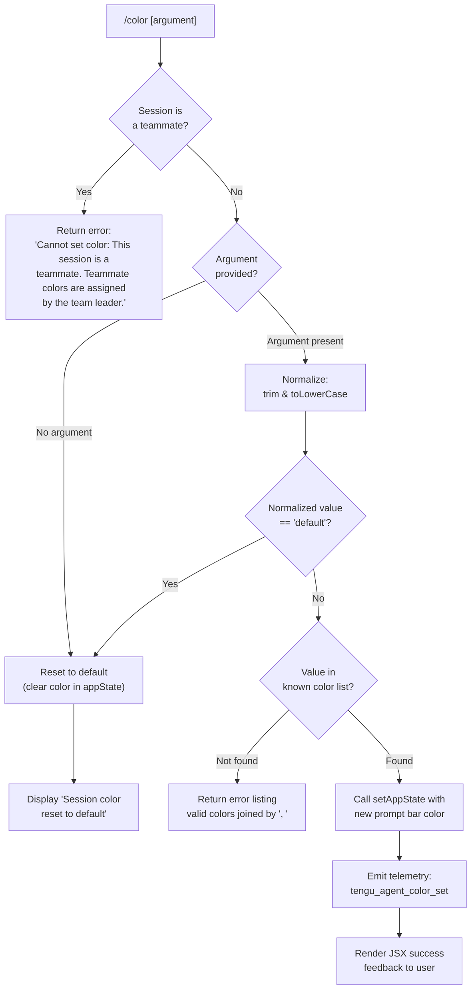

# `/color`

> Analysis basis: CC v2.1.169 bundle.js (AST extraction + Claude interpretation)
> Minimum version: v2.1.169

---

## Overview

The `/color` command allows a user to set or reset the prompt bar color for the current Claude Code session. It accepts an optional color name argument, validates it against a list of known color values, and writes the chosen color into application state; when no argument is supplied (or `"default"` is given), the color is reset to the default. The command is blocked entirely when the current session is operating as a "teammate" role, where colors are managed by the team leader.

---

## Registration

| Field | Value |
|---|---|
| type | `local-jsx` |
| name | `color` |
| description | Set the prompt bar color for this session |
| loc_byte | `11134442` |
| loc_byte_end | `11134659` |
| loc_line | `7342` |
| argumentHint | `null` |
| immediate | `true` |
| module_id | `fQq` |
| load_inline | `true` |
| arbor_handler.name | `k0f` |
| arbor_handler.fqn | `claude-2.1.169::k0f` |
| arbor_handler.kind | `AsyncFunction` |
| arbor_handler.resolution_path | `module_id` |
| arbor_handler.n_hits | `0` |

Analysis basis: CC v2.1.169 bundle.js:+11134442

---

## Input Branching

Four distinct branches exist: teammate guard, explicit reset to default, unknown color rejection, and successful color application. A Mermaid flowchart is used.



Analysis basis: CC v2.1.169 bundle.js:+11133281, +11133292, +11133458, +11133476, +11133500, +11133522, +11133604, +11133651, +11133662, +11133881

---

## Behavioral Spec

### Entry Point — Handler (`k0f`)

The Arbor-resolved handler `k0f` is an `AsyncFunction` reached via `module_id` resolution (`fQq`). It serves as the top-level entry for the `/color` command. It immediately delegates to two helpers: a session-role guard and the main color-setting routine.

```
async function colorCommandHandler(session, argument):
    isTeammate = checkSessionRole(session)      // hM → SG → tO_.getStore
    if isTeammate:
        return errorResult("Cannot set color: This session is a teammate. ...")
    return colorSetRoutine(session, argument)   // kC8
```

Analysis basis: CC v2.1.169 bundle.js:+11133212, +11133220

---

### Session Role Guard

Before any color logic runs, the handler queries the current session store to determine whether this session is acting in a "teammate" capacity. If so, a static error message is returned immediately and no state mutation occurs.

Error message (citation fragment): `"Cannot set color: This session is a teammate…"` (full text at bundle.js:+11133292).

```
function checkSessionRole(session):
    store = getSessionStore()     // hM → SG → tO_.getStore (loc +2258965)
    return store.isTeammate
```

Analysis basis: CC v2.1.169 bundle.js:+11133281, +11133292, +2260147, +2258965

---

### Main Color-Setting Routine (`kC8`)

This is the core logic function. It performs input normalization, list membership validation, state mutation, telemetry emission, and JSX result construction.

```
async function colorSetRoutine(session, rawArgument):

    // 1. Normalize input
    normalized = rawArgument.trim().toLowerCase()   // loc +11133458

    // 2. Handle explicit or implicit reset to default
    if normalized == "" or normalized == "default":  // loc +11133620
        setAppState({ promptBarColor: undefined })   // loc +11133662
        return successText("Session color reset to default")  // loc +11133881

    // 3. Validate against the known color list
    knownColors = getKnownColorList()   // I0f — populated list of valid color names
    if not knownColors.includes(normalized):        // loc +11133476
        validList = knownColors.join(", ")          // loc +11133522, literal ", " at +11133530
        return errorText("Unknown color. Valid colors: " + validList)

    // 4. Pick a random display variant if needed
    //    (Math.floor + Math.random used for color variant selection)
    //    loc +11133421, +11133432

    // 5. Apply the color — write into appState
    setAppState({ promptBarColor: normalized })     // loc +11133662

    // 6. Emit telemetry
    emitTelemetry("tengu_agent_color_set")          // loc +13364089

    // 7. Log via structured logger (VC6)
    logAgentColor("agent-color", session)           // loc +13364005, +13363984

    // 8. Render JSX result and return
    result = buildColorResultJSX(normalized, ...)   // y0f at +11133872
    return result
```

Analysis basis: CC v2.1.169 bundle.js:+11133421, +11133432, +11133458, +11133476, +11133500, +11133522, +11133530, +11133604, +11133620, +11133651, +11133662, +11133681, +11133881

---

### Known Color List Validation (`I0f` and `VO`)

Two arrays are referenced during validation: one appears to be the primary membership check (`I0f.includes` at +11133476) and a second (`VO.includes` at +11133500, `VO.join` at +11133522) is used to produce the human-readable list for error messages. The exact contents of these arrays are <!-- TODO: not found in depth-2 traversal; needs --depth 4 --> but the join separator is `", "` (bundle.js:+11133530).

Analysis basis: CC v2.1.169 bundle.js:+11133476, +11133500, +11133522, +11133530

---

### Default Color Representation (`I6` / `CM`)

When the normalized input equals `"default"` (literal at bundle.js:+11133620), the command routes through a default-color helper (`I6` at +11133604) and a color-rendering utility (`CM` at +11133611) that composes a display value. `CM` internally calls sub-helpers for rendering (`rR`, `x$`, `G_`) and joins color component strings via `yXH.join`.

```
function resolveDefaultColor():
    base = getDefaultColorToken()   // I6 → xZ
    rendered = buildColorDisplay(base)   // CM → rR, x$, G_, yXH.join, I6
    return rendered
```

Analysis basis: CC v2.1.169 bundle.js:+11133604, +11133611, +5043518, +5043524, +5043527, +5043540, +5043554, +42051, +43146, +43222

---

### Available Color Keys Helper (`NC8`)

A helper (`NC8`) constructs or retrieves the set of valid color key names by calling `Object.keys` on the color definitions map.

```
function getAvailableColorKeys(colorMap):
    return Object.keys(colorMap)   // loc +11132985
```

Analysis basis: CC v2.1.169 bundle.js:+11133681, +11132985

---

### Structured Logging (`VC6`)

The logging subsystem (`VC6`) is invoked after a successful color change. It:
1. Calls `sN` to format a structured log entry tagged `"agent-color"` (literal at +13364005).
2. Calls `Q$H` to append the entry to a log file, creating the directory if it does not exist (`A.mkdirSync`, `A.appendFileSync`).
3. Calls `o4` → `Z9` to register the write with a background-state tracker.
4. Emits the `tengu_agent_color_set` telemetry event.

```
function logColorChange(eventLabel, sessionContext):
    entry = formatLogEntry(eventLabel, sessionContext)   // sN
    appendToLogFile(entry)                               // Q$H
    registerBackgroundWrite()                            // o4 → Z9
    emit("tengu_agent_color_set")                        // loc +13364089
```

Analysis basis: CC v2.1.169 bundle.js:+11133651, +13363984, +13363993, +13364005, +13364050, +13364055, +13364087, +13364089

---

### JSX Result Builder (`y0f`)

After a successful color application, a JSX component is constructed to render confirmation feedback in the terminal UI.

```
async function buildColorResultJSX(color, session):
    base = buildBaseElement(color)      // o0 at +11133965
    styled = applyColorStyle(base)      // Se at +11134006
    if noFurtherWork:
        return Promise.resolve(styled)  // loc +11134011
    enhanced = attachColorWidget(styled)  // c0H at +11134041
    queued = enqueueRender(enhanced)      // q at +11134093
    timed = withTimeout(queued)           // t9H at +11134111
    return timed
```

Analysis basis: CC v2.1.169 bundle.js:+11133814, +11133819, +11133872, +11133965, +11134006, +11134011, +11134041, +11134093, +11134111

---

### Background State & File Cache (`h38`, `jq`, `wz`)

The command indirectly touches a file-based background state subsystem when persisting color changes. Key behaviors observed in the call graph:

- `h38` orchestrates cache reads/writes; calls `oK` (path resolution), `jq` (async file reader with stat checks), `zj` (cache invalidation), `If` (atomic file writer via random-bytes temp file), `k8` (error code checker), `wz` (write helper).
- `jq` reads from disk using `HW.readFile` with `"utf-8"` encoding (literal at +4182908), parses JSON (`F6` → `JSON.parse`), maintains an in-memory cache (`vfH`), and emits `tengu_bg_state_read_transient` telemetry on cache misses.
- `If` performs atomic writes: generates 4 random bytes for a temp filename (hex-encoded, literals at +2292752, +2292764), writes with `"utf8"` encoding (+2292811), renames atomically.

```
async function readBackgroundState(key):
    path = resolvePath(key)           // oK
    cached = fileCache.get(path)      // vfH.get
    if cached and not stale:
        return cached
    emit("tengu_bg_state_read_transient")   // loc +4182694
    raw = await fs.readFile(path, "utf-8")
    parsed = JSON.parse(raw)          // F6
    fileCache.set(path, parsed)       // vfH.set
    return parsed
```

Analysis basis: CC v2.1.169 bundle.js:+4184750, +4184764, +4184809, +4184867, +4184945, +4184951, +4182694, +4182894, +4182908, +4182999, +4183160, +2292736, +2292752, +2292764, +2292811

---

## State & Side Effects

| Item | Detail |
|---|---|
| Telemetry | `tengu_agent_color_set` (bundle.js:+13364089) — fired on every successful color change |
| Telemetry | `tengu_bg_state_read_transient` (bundle.js:+4182694) — fired on background-state cache miss during persistence path |
| appState changes | `setAppState` called with updated prompt bar color field (bundle.js:+11133662); on reset, the color field is cleared to undefined |
| appState read | `getAppState` called to retrieve current state before mutation (bundle.js:+11133705) |
| Log file write | `appendFileSync` + `mkdirSync` used to persist the color-change event under the `"agent-color"` log category (bundle.js:+13359841, +13359880, +13364005) |
| Atomic file write | Temp file created with 4 hex random bytes, then renamed into place (bundle.js:+2292736, +2292837) |
| In-memory file cache | `vfH` (Map) updated; entries deleted on invalidation via `zj` (bundle.js:+4182205) |
| Hook registration | `Z9` → `ZGA.register` called to register background state write (bundle.js:+62328) |
| Sound | None detected in depth-2 traversal |
| Teammate guard | Command exits early with a static error string; no state is mutated (bundle.js:+11133292) |

---

## Version History

| Version | Change |
|---|---|
| v2.1.169 | Initial analysis |

---

## Common Mistakes

1. **Passing an unsupported color name** — The argument is validated against an internal list. An unrecognized color will produce an error that lists all valid options joined by `", "`. Consult that list before scripting the command.
2. **Expecting color changes in teammate sessions** — When the session role is `teammate`, the command is completely blocked. Color assignment in that role is exclusively controlled by the team leader; no workaround exists via `/color`.
3. **Assuming the argument is case-sensitive** — The input is normalized to lowercase before comparison (`A.toLowerCase` at bundle.js:+11133458), so casing of the argument does not matter.
4. **Omitting the argument to set a specific color** — Invoking `/color` without any argument (or with `"default"`) resets the color to the default rather than opening an interactive picker. There is no interactive mode; a named color value must be supplied to change it.
5. **Confusing immediate execution with deferred execution** — The registration sets `immediate: true`, meaning the command fires without requiring a confirmation step. Be deliberate when invoking it.

---

## Appendix — Identifier Mapping

> For bundle debugging only. Identifiers change across versions.

| Identifier | Role |
|---|---|
| `k0f` | Top-level async command handler for `/color` (Arbor-resolved entry point) |
| `kC8` | Main color-setting routine; performs normalization, validation, state write, telemetry |
| `hM` | Session role checker; queries session store for teammate status |
| `SG` | Session store accessor; wraps `tO_.getStore` |
| `NC8` | Available color keys helper; calls `Object.keys` on color definitions map |
| `I6` | Default color token resolver |
| `CM` | Color display builder; composes rendered color from components |
| `rR` | Color sub-renderer called by `CM` |
| `G_` | Color sub-renderer called by `CM` |
| `VC6` | Structured logging orchestrator for color-change events |
| `sN` | Log entry formatter; produces structured log object |
| `Vy` | Helper called by `sN` during log formatting |
| `Q$H` | Log file writer; handles `appendFileSync`, `mkdirSync`, directory creation |
| `l6` | Helper used by `Q$H` during file append |
| `CH` | JSON serializer wrapper (`JSON.stringify`) |
| `o4` | Background write registration dispatcher |
| `Z9` | Background write registrar; calls `ZGA.register` |
| `d` | Shared utility called by `VC6` and `jq` |
| `_` | App-state accessor object (provides `setAppState`, `getAppState`) |
| `h38` | Background file-state manager; orchestrates cache and disk operations |
| `oK` | Path resolver for background state files |
| `VE` | Sub-path resolver used by `oK` |
| `A_` | Path helper used by `VE` |
| `jq` | Async file reader with in-memory cache (`vfH`) and stat-based staleness check |
| `k8` | Error code checker (e.g. `ENOENT`) |
| `E8` | Low-level error utility |
| `zj` | Cache invalidation helper; deletes entries from `vfH` |
| `If` | Atomic file writer; uses random temp filename, then renames |
| `HO` | Low-level atomic write primitive; generates random bytes, writes, renames |
| `wz` | Write coordination helper; checks `IZH` set before writing |
| `EH` | String coercion wrapper used by `wz` |
| `hH` | Background write queue manager |
| `wA` | Error normalization utility |
| `_6` | String cast utility |
| `kq` | Queue drain helper used by `hH` |
| `av4` | Queue rotation helper (`Di6.shift` / `Di6.push`) |
| `N` | File write executor; handles encoding, path resolution, error dispatch |
| `ItK` | Write sub-executor; calls `RI`, `fZA`, `vGA` |
| `H` | Bootstrap fetch helper; `[Bootstrap] Fetching` log prefix |
| `R4` | String/path manipulation utility used by `N` |
| `rBH` | Log record helper used by `N` |
| `StK` | File write scheduler with byte-length tracking and retry |
| `Bf` | Fallback error handler used by `jq` |
| `F6` | JSON parse wrapper (`JSON.parse`) |
| `Yj` | Basename + identifier utility |
| `Z_6` | Utility called alongside `Yj` in `kC8` |
| `y0f` | JSX result builder for successful color-change feedback |
| `o0` | Base element constructor used by `y0f` |
| `Se` | Color style applicator used by `y0f` |
| `t9H` | Timeout wrapper used by `y0f` |
| `x$` | Color component helper used by `CM` and `sN` |

---

Note: index built via Arbor fallback; some signals (telemetry, literals) may be missing — see arbor-fallback.js.