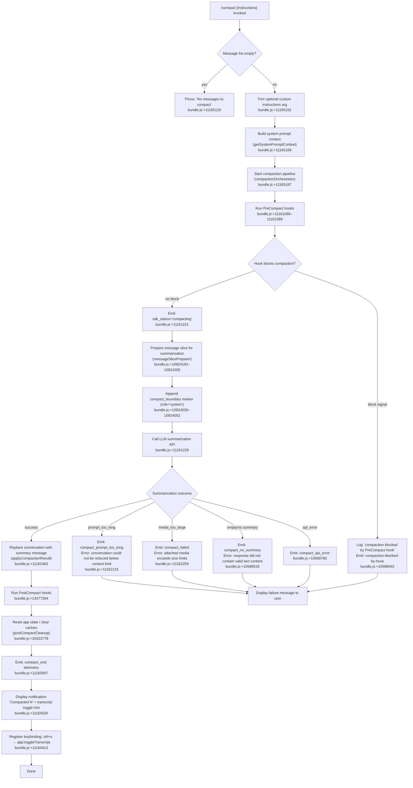

# `/compact`

> Analysis basis: CC v2.1.169 bundle.js (AST extraction + Claude interpretation)
> Minimum version: v2.1.169

---

## Overview

`/compact` frees context window space by generating an AI summary of the current conversation and replacing all prior messages with a single compacted summary message. It accepts an optional argument for custom summarization instructions, runs `PreCompact` and `PostCompact` hooks, updates application state, emits telemetry, and—on success—displays a notification with a transcript toggle keybinding.

---

## Registration

| Field | Value |
|---|---|
| type | `local` |
| name | `compact` |
| description | `Free up context by summarizing the conversation so far` |
| argumentHint | `<optional custom summarization instructions>` |
| supportsNonInteractive | `true` |
| thinClientDispatch | `post-text` |
| module_id | `tQq` |
| load_inline | `true` |
| loc_byte | `11166058` |
| loc_byte_end | `11166358` |
| loc_line | `7471` |
| arbor_handler.name | `e0f` |
| arbor_handler.fqn | `claude-2.1.169::e0f` |
| arbor_handler.kind | `AsyncFunction` |
| arbor_handler.resolution_path | `module_id` |
| arbor_handler.n_hits | `0` |

Analysis basis: CC v2.1.169 bundle.js:+11166058

---

## Input Branching

The handler has 5+ distinct branches (empty message list guard, user cancellation, PreCompact hook block, summarization failure modes, PostCompact success path), so a Mermaid flowchart is required.



---

## Behavioral Spec

### 1. Handler Entry and Guard (`e0f`)

The main handler (resolved as `e0f` via `module_id` → `tQq` chain) is an `AsyncFunction`.

```
async function compactCommandHandler(args, context):
    instructions = args.trim()           // bundle.js:+11165152
    if context.messages is empty:
        throw Error("No messages to compact")   // bundle.js:+11165114,+11165120
    systemPromptCtx = buildSystemPromptContext(context)  // Qi → bundle.js:+11165169
    return await runCompactionOrchestrator(context, instructions, systemPromptCtx)
                                        // HGf → bundle.js:+11165187
```

Analysis basis: CC v2.1.169 bundle.js:+11165089

---

### 2. System Prompt Context Builder (`Qi`)

Assembles the current session's system prompt context for use in the summarization request.

```
function buildSystemPromptContext(context):
    flags = resolveFeatureFlags(context)   // F_ → bundle.js:+10605794
    return constructSystemPromptBlock(flags, context)  // D6 → bundle.js:+10605816
```

Analysis basis: CC v2.1.169 bundle.js:+11165169

---

### 3. Compaction Orchestrator (`HGf`)

Coordinates the full compact lifecycle: hooks, summarization, state mutation, and UI notification.

```
async function compactionOrchestrator(context, instructions, systemPromptCtx):
    startTime = performance.now()           // bundle.js:+11161172

    // Phase 1 – Assemble messages for API
    [messages, systemPrompts] = await Promise.all([
        collectMessages(context),           // di → bundle.js:+11161236
        buildSystemPromptPayload(context),  // sQq → bundle.js:+11161311
    ])

    // Phase 2 – Validate message count
    if messages is insufficient:
        emit("compact_not_enough_messages") // bundle.js:+10587031
        return

    // Phase 3 – Run PreCompact hooks
    emit progress("hooks_start")            // bundle.js:+11161066
    hookResult = await runHooks("PreCompact", context)  // bundle.js:+11161089
    if hookResult.blocks:
        emit("compaction-blocked-by-hook")  // bundle.js:+10586042
        return

    // Phase 4 – Request summarization
    emit sdk_status("compacting")           // bundle.js:+11161151
    emit("compact_start")                   // bundle.js:+11161595
    summaryText = await requestSummarization(
        messages, systemPrompts, instructions, context
    )                                       // _Gf → bundle.js:+11161626

    if summaryText is error:
        handle failure (see §4)
        return

    // Phase 5 – Apply compaction result and clean up
    applyCompactionToState(context, summaryText)  // pe → bundle.js:+11162516
    resetUiState(context)                          // khH → bundle.js:+11162541
    runPostCompactActions(context, summaryText)    // aQq → bundle.js:+11162743

    // Phase 6 – Success notification
    displayCompactedNotification(summaryText)      // bundle.js:+11164520
    registerTranscriptToggle()                     // bundle.js:+11164413
    emit("compact_end")                            // bundle.js:+11163007
```

Analysis basis: CC v2.1.169 bundle.js:+11161172

---

### 4. Summarization Request Pipeline (`_Gf`)

Calls the LLM with the assembled message slice; handles retries and failure classification.

```
async function requestSummarization(messages, systemPrompts, instructions, context):
    startTime = performance.now()           // bundle.js:+11163388

    // Compute message slice boundary
    boundaryIndex = findCompactBoundary(messages)  // T_A → bundle.js:+11163751
    if boundaryIndex is null:
        emit("boundary_uuid_missing")       // bundle.js:+11163831

    // Apply cache-prefix optimisation
    emit("compact_cache_prefix")            // bundle.js:+10587669
    slicedMessages = sliceMessagesForSummary(messages, boundaryIndex)

    // Issue API call
    response = await callSummarizationAPI(slicedMessages, systemPrompts, instructions)
                                            // fW → bundle.js:+11164332

    // Classify outcome
    switch response.status:
        case "prompt_too_long":
            emit("compact_prompt_too_long") // bundle.js:+10588105
            return Failure("Compaction failed · conversation could not be reduced below the context limit")
                                            // bundle.js:+11162133
        case "media_too_large":
            return Failure("Compaction failed · attached media exceeds size limits")
                                            // bundle.js:+11162255
        case "no_summary":
            emit("compact_no_summary")      // bundle.js:+10588489
            return Failure("Failed to generate conversation summary - response did not contain valid text content")
                                            // bundle.js:+10588518
        case "api_error":
            emit("compact_api_error")       // bundle.js:+10588785
            return Failure(response.message)
        default:
            emit("compact")                 // bundle.js:+10590084
            return Success(response.summaryText)
```

Analysis basis: CC v2.1.169 bundle.js:+11163388

---

### 5. Message Slice Preparer (`dO` / `HC8`)

Identifies the compaction boundary marker, slices the message array, and injects the `compact_boundary` system marker.

```
function prepareMessageSlice(messages):
    boundaryMsg = findMessageByType(messages, "compact_boundary")  // HC8 → bundle.js:+10924182
    // compact_boundary role is "system", type literal "compact_boundary"
    // bundle.js:+10924030,+10924052
    sliced = messages.slice(boundaryIndex + 1)  // bundle.js:+10924205
    // Numeric literals 1 and 0 used as slice offset guards
    // bundle.js:+10924106,+10924111
    return sliced
```

Analysis basis: CC v2.1.169 bundle.js:+10924106

---

### 6. Post-Compact State Reset (`pe`)

After summarization succeeds, multiple state subsystems are cleared.

```
function postCompactCleanup(context):
    resetPendingRequests(context)           // Qh8 → bundle.js:+10423772
    clearHookExecutionCache()               // mh8,pp9 → bundle.js:+10423867,+10423873
    resetAutonomousLoopState()              // bundle.js:+10423905
    clearMcpState(context)                  // COq,TWH → bundle.js:+10423879,+10423885
    clearPendingGlobals()                   // gD → bundle.js:+10423955
    resetSessionBoundary()                  // Z_A → bundle.js:+10424061
```

Analysis basis: CC v2.1.169 bundle.js:+10423762

---

### 7. Compact Notification Display (`aQq`)

Renders the post-compact success UI.

```
function displayCompactSuccessNotification(summaryText):
    modelLabel = resolveModelDisplayLabel(context)  // NRH → bundle.js:+11164365
    statusLine = renderStatusLine(summaryText)      // SP → bundle.js:+11164378
    notificationText = "Compacted " + truncatedSummary  // bundle.js:+11164520
    registerKeyBinding(
        scope = "Global",
        key   = "ctrl+o",
        action = "app:toggleTranscript"
    )                                              // bundle.js:+11164381,+11164413
    displayDimmedHint(notificationText)            // J6.dim → bundle.js:+11164513
```

Analysis basis: CC v2.1.169 bundle.js:+11162743

---

### 8. Summarization API Caller (`fW` / `Hjf`)

Builds and dispatches the API request with the summarization instruction payload.

```
async function callSummarizationAPI(messageSlice, systemPrompts, customInstructions):
    // Normalise messages for the API
    normalised = normaliseMessagesForApi(messageSlice)  // Hjf → bundle.js:+10636616
    // Message role constants used: "assistant", "user", "api_system", "attachment"
    // bundle.js:+10636665,+10636687,+10636704,+10636783

    // Issue streaming request; compaction agent may only produce text
    // Tool use during compaction is denied: "Tool use is not allowed during compaction"
    // bundle.js:+10597665
    response = await streamingApiRequest(normalised, systemPrompts, customInstructions)
                                                         // oAA → bundle.js:+10636817
    return response
```

Analysis basis: CC v2.1.169 bundle.js:+10636616

---

## State & Side Effects

| Item | Detail |
|---|---|
| Telemetry: compact lifecycle | `tengu_compact` (bundle.js:+10590084), `tengu_compact_failed` (bundle.js:+10601389), `tengu_compact_cache_prefix` (bundle.js:+10587669), `tengu_compact_cache_sharing_success` (bundle.js:+10598542), `tengu_compact_cache_sharing_fallback` (bundle.js:+10599172) |
| Telemetry: compact errors | `tengu_compact_ptl_retry` (bundle.js:+10588145) — prompt-too-long retry |
| Telemetry: pre/post compact hooks | `tengu_precomputed_compact_consumed` (bundle.js:+10422536), `tengu_precomputed_compact_discarded` (bundle.js:+10423159), `tengu_post_compact_file_restore_success` (bundle.js:+10601875), `tengu_post_compact_file_restore_error` (bundle.js:+10601917) |
| Telemetry: reactive compact | `tengu_reactive_compact_succeeded` (bundle.js:+10430202), `tengu_reactive_compact_failed` (bundle.js:+10427741), `tengu_reactive_compact_attempt` (bundle.js:+5062717) |
| Telemetry: state tracking | `tengu_sepia_moth` (bundle.js:+10416157), `tengu_amber_redwood3` (bundle.js:+10605819) |
| Hook registration | Fires `PreCompact` hook before summarization; fires `PostCompact` hook after state replacement. A `PreCompact` hook returning a block signal prevents compaction entirely (`compaction-blocked-by-hook`, bundle.js:+10586042). |
| appState changes | Conversation messages are replaced with a single compaction summary message. `compact_boundary` marker (role `system`) is inserted/consumed. Cached pending requests, autonomous loop state, MCP state, and hook execution caches are all cleared. UI state is reset via `kG6.setState` (bundle.js:+5007872). |
| Keybinding side-effect | `ctrl+o` → `app:toggleTranscript` registered in `Global` scope on success (bundle.js:+11164413). |
| Tool use blocked during compaction | Any tool-use request while compaction is active is denied with `"Tool use is not allowed during compaction"` (bundle.js:+10597665). |
| Sound | <!-- TODO: not found in depth-2 traversal; needs --depth 4 --> |
| `compact_boundary` message marker | Injected with `role: "system"`, type `"compact_boundary"` (bundle.js:+10924030, +10924052). Numbers `1` and `0` used as boundary offset guards (bundle.js:+10924106, +10924111). |
| OTEL / tracing | Span `claude_code.compaction` emitted (bundle.js:+10586893). Span type `"claude_code.compaction"` emitted via `mE6` tracer (bundle.js:+10586893). |
| Cancellation | User cancellation produces `"Compaction canceled."` message (bundle.js:+11165660). |

---

## Version History

| Version | Change |
|---|---|
| v2.1.169 | Initial analysis |

---

## Common Mistakes

1. **Invoking `/compact` when there are no messages.** The handler immediately throws `"No messages to compact"` (bundle.js:+11165120). Ensure at least one message exists before calling the command.
2. **Expecting tool calls to succeed mid-compaction.** Tool use is unconditionally blocked with a `"deny"` decision and error string `"Tool use is not allowed during compaction"` (bundle.js:+10597665) during the summarization phase.
3. **Assuming PreCompact hooks cannot block compaction.** A `PreCompact` hook that returns a `block` signal will abort compaction silently from the user perspective; check hook exit status if compaction appears to do nothing.
4. **Relying on conversation history after `/compact`.** All prior messages are replaced by the summary; any context not captured in the summary is permanently lost from the live context.
5. **Providing custom instructions that reference absolute paths.** The argument is trimmed (bundle.js:+11165152) but passed verbatim; overly specific path instructions may confuse the summarisation model.
6. **Expecting `/compact` to work identically in non-interactive (SDK/CI) mode.** The `thinClientDispatch` field is `"post-text"` and `supportsNonInteractive` is `true`, so the command is available, but the keybinding and notification side-effects are silently skipped in non-REPL contexts.

---

## Appendix — Identifier Mapping

> For bundle debugging only. Identifiers change across versions.

| Identifier | Role |
|---|---|
| `e0f` | Main command handler (`compactCommandHandler`) — AsyncFunction |
| `dO` | Message boundary locator / slice helper |
| `HC8` | Find `compact_boundary` message in list |
| `Zj` | Utility used by boundary finder |
| `HGf` | Compaction orchestrator (manages full lifecycle) |
| `fW` | Summarization API request dispatcher |
| `Hjf` | Message normaliser for API payload |
| `KXH` | Token/model capability checker |
| `oAA` | Streaming API call executor |
| `Qi` | System-prompt context builder |
| `F_` | Feature-flag resolver |
| `D6` | System-prompt block constructor |
| `_Gf` | Summarization request pipeline (boundary + cache + retry) |
| `G_A` | AbortController / cancellation gate |
| `C96` | Compaction cache prefix handler |
| `Bh8` | Pre-computed compact consumer |
| `T_A` | Compact boundary index finder |
| `gh8` | Compaction progress reporter |
| `lh8` | Full compaction turn runner |
| `sQq` | System-prompt payload builder |
| `oE` | System-prompt assembly coordinator |
| `u_` | App-state reader for last summary |
| `Up` | Model + system-prompt builder |
| `QS8` | Message normalisation step |
| `yAA` | Message post-processor |
| `pe` | Post-compact state reset |
| `Qh8` | Pending-requests reset |
| `mh8` | Hook execution cache clearer |
| `pp9` | RE6/Lm_ caches clearer |
| `COq` | MCP state clearer |
| `TWH` | Additional state clearer |
| `gD` | Global pending state clearer |
| `Z_A` | Session boundary reset |
| `khH` | UI state reset (`kG6.setState`) |
| `aQq` | Post-compact notification renderer |
| `NRH` | Model display label resolver |
| `SP` | Status line renderer |
| `di` | Message collector for API |
| `$G` | Hook runner for lifecycle events |
| `muq` | Full compaction turn coordinator |
| `L16` | Top-level compaction flow controller |
| `rG` | Stream event / turn result handler |
| `Qk8` | App-state setter after compact |
| `buq` | Message slice builder with budget |
| `DsH` | Model size checker |
| `M5H` | Array-type / assistant-message validator |
| `xV6` | Token count extractor from API response |
| `NR_` | Message role normaliser |
| `JJf` | Tool-result filter |
| `jJf` | Message mapper for compaction |
| `kAA` | Recursive content normaliser |
| `Ruq` | Surrogate-pair char-code helper |
| `o16` | Compaction context builder (tools + model) |
| `lAA` | Fallback request preparer |
| `kjK` | Core API query engine |
| `vR6` | Tool search mode decision helper |
| `nJf` | Tool-search deferred query handler |
| `pS_` | Tool-search mode selector |
| `_t` | MIME / content-type classifier |
| `lxH` | Tool-use list membership checker |
| `cz8` | Reactive compact loop |
| `G97` | Reactive summarisation inner engine |
| `UG6` | Reactive compact boundary builder |
| `gz8` | Summary tag extractor (`<summary>`) |
| `Qz8` | Summary extraction wrapper |
| `g8` | Redacted-thinking stripper |
| `N_A` | Reactive compact attempt coordinator |
| `Sm` | Output text sanitiser (paths, PII, etc.) |
| `RA7` | Home-dir path redactor |
| `rA7`, `gA7`, `dA7`, `pA7`, `bA7`, `lA7`, `cA7`, `iA7` | Various text redaction helpers |
| `mE6` | OTEL span emitter for compaction |
| `IS` | Active-span getter |
| `uAA` | Post-compact UI updater helper |
| `ySH` | Status setter (`H.setStatus`) |
| `hH` | Hook output error logger |
| `bH` | Hook dispatcher helper |
| `vVH` | Hook validity checker |
| `SH` | Hook result handler |
| `IF` | Rate-limit event emitter |
| `EH` | Error stringifier |
| `kN` | AbortController + timeout manager |
| `jB8` | Hook input builder |
| `WB8` | Hook output parser |
| `YqH` | Hook metadata extractor |
| `ZzA` | HTTP hook executor |
| `VJK` | Hook output validator |
| `GB8` | Command-hook spawner |
| `yzA` | Hook type router |
| `d$H` | Hook context builder |
| `rC` | Policy-settings reader |
| `dXA` | MCP connection updater |
| `mSH` | MCP server connector |
| `cd8` | MCP connection result applier |
| `pyH` | OTEL resource attribute builder |
| `m4` | OTEL event emitter |
| `SjH` | Telemetry metric reporter |
| `uN7` | Model label lookup |
| `gwH` | Context-window size resolver |
| `FAH` | Max-output-tokens parser |
| `$5H` | Context-window + output-token wrapper |
| `WV` | Last-message finder |
| `c1` | UUID / timestamp message ID builder |
| `gF` | Hook loader for session start |
| `Q0H` | Turn output builder |
| `I_A` | Tool-result accumulator |
| `NuH` | First-party tool filter |
| `DDf` | Context building orchestrator |
| `ih8` | MCP tool-result injector |
| `sh8` | App-state value reader for context |
| `rh8` | Plan-context injector |
| `ah8` | Summary context builder |
| `oh8` | Tool invocation context builder |
| `Z3H` | Context-window tracker initialiser |
| `DuH` | Tool deduplication and ordering |
| `wuH` | Context-window push helper |
| `Tz8` | Message token counter |
| `RE` | Full message-to-API normaliser |
| `SA7` | Per-message token tracker |
| `jM` | Token count rounder |
| `Ez8` | Round-up token estimator |
| `vE` | Effort-level builder |
| `M$` | App-state accessor |
| `C96` | Cache-prefix compaction consumer |
| `Xj` | Tool list resolver |
| `gAH` | Tool availability checker |
| `DG6` | Header object builder |
| `VhH` | Vendor-header helper |
| `Dn` | DNS / network helper |
| `hG6` | Header finaliser |
| `RhH` | Cache-to-disk writer |
| `oS6` | Random UUID generator wrapper |
| `HqH` | Tool-result collector |
| `lJf` | Array-type assertion |
| `cJf` | Content-block validator |
| `rIH` | Agent type prefix checker |
| `au` | `startsWith` guard helper |
| `ts` | Tool schema accessor |
| `OP9` | Tool resolver |
| `x96` | Context-tool executor |
| `o4` | Z9 wrapper |
| `y29` | Compact abort reporter |
| `bX8` | Background-session tool-permission check |
| `i1` | Locale / flag string resolver |
| `W` | Iterator / generator wrapper |
| `zRH` | TeammateMailbox read-mark handler |
| `Y` | Supervisor renderer |
| `ITH` | Render-output formatter |
| `BOK` | Column-width calculator |
| `T` | Spinner stop/start |
| `E` | Config-driven layout engine |
| `edK` | Heartbeat config applier |
| `V` | Alternate renderer start |
| `QF` | Array-isArray API-shape guard |
| `buq` | Message budget slicer |
| `YsH` | Push-to-slice helper |
| `DsH` | Model-size error classifier |
| `M5H` | Assistant-message presence check |
| `xV6` | Token-count matcher |
| `Fk` | Tool-name prefix guard |
| `CM` | Context-mode builder |
| `rR` | xZ wrapper |
| `G_` | xZ wrapper (alternate) |
| `cG` | CLI/remote context builder |
| `SK` | String coercion helper |
| `_6` | String wrapper |
| `o06` | REPL context accessor |
| `BG6` | Background-session context builder |
| `W97` | URL / regex sanitiser |
| `es` | Tool schema getter |
| `uuq` | Compaction-error display handler |
| `kX` | Queue shift/push helper |
| `UT` | Unknown type fallback |
| `p97` | pR_ cache get/set helper |
| `uE6` | Unknown compaction-error emitter |
| `ySH` | Status-bar updater |
| `uAA` | Post-compact context updater |
| `PG` | xZ permission guard |
| `Ko` | Error-notification helper |
| `b9K` | Stream enqueue helper |
| `R` | Write-to-stream wrapper |
| `x` | Rate-limit event enqueuer |
| `k` | Misc flag key |

Note: index built via Arbor fallback; some signals (telemetry, literals) may be missing — see arbor-fallback.js.