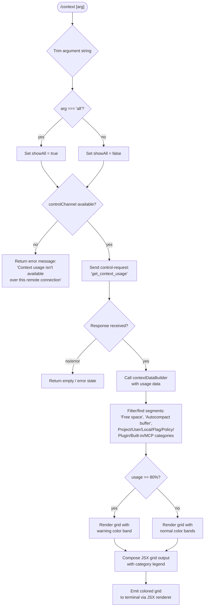

# `/context`

> Analysis basis: CC v2.1.169 bundle.js (AST extraction + Claude interpretation)
> Minimum version: v2.1.169

---

## Overview

The `/context` command visualizes the current context window usage as a colored grid, breaking down token consumption by category (system prompt, tools, memory files, messages, etc.). It accepts an optional `all` argument to show the full expanded breakdown, and dispatches its work through the control-request channel to the local agent rendering subsystem.

---

## Registration

| Field | Value |
|---|---|
| type | `local-jsx` |
| name | `context` |
| description | `Visualize current context usage as a colored grid` |
| argumentHint | `[all]` |
| thinClientDispatch | `control-request` |
| module_id | `slq` |
| load_inline | `true` |
| loc_byte | `11577434` |
| loc_byte_end | `11577660` |
| loc_line | `7527` |
| arbor_handler.name | `$Vf` |
| arbor_handler.fqn | `claude-2.1.169::$Vf` |
| arbor_handler.kind | `AsyncFunction` |
| arbor_handler.resolution_path | `module_id` |
| arbor_handler.n_hits | `0` |

Analysis basis: CC v2.1.169 bundle.js:+11577434

---

## Input Branching

The command has 4+ distinct branches based on the argument value, connection type, and context data availability.



Analysis basis: CC v2.1.169 bundle.js:+11576028 (handler entry), +11576059 (`"all"` literal), +11576112 (remote error string), +11576194 (`sendControlRequest`), +11576570 (80% threshold)

---

## Behavioral Spec

### 1. Argument Parsing

```
async function contextCommandHandler(rawArg, appState):
    arg = rawArg.trim()                          // +11576034
    showAll = (arg === "all")                    // +11576059, +11576067

    controlChannel = getControlChannel(appState) // +11576082, +11576085
    if controlChannel is absent or unavailable:
        return errorText(
            "Context usage isn't available over this remote connection"
        )                                        // +11576112
```

Analysis basis: CC v2.1.169 bundle.js:+11576034, +11576059, +11576082, +11576112

---

### 2. Control-Request Dispatch

The handler sends a `get_context_usage` control request over the active control channel rather than computing context sizes locally. This means the command is a thin client: all accounting happens in the agent process.

```
function dispatchContextUsageRequest(controlChannel, showAll):
    payload = buildControlRequestPayload(
        type = "get_context_usage",          // +11576224
        flags = { showAll }
    )
    response = await controlChannel.sendControlRequest(payload)
                                             // +11576194
    return response
```

Analysis basis: CC v2.1.169 bundle.js:+11576224, +11576194

---

### 3. Context Data Builder (`contextDataBuilder` / `lC6`)

After the response arrives, a data-builder function processes the raw token counts into displayable segments. It filters and finds named segments including:

- `"Free space"` — remaining unused tokens (bundle.js:+11574166)
- `"Autocompact buffer"` — reserved compaction headroom (bundle.js:+11574189)
- Named setting layers: `"Project"` / `"projectSettings"`, `"User"` / `"userSettings"`, `"Local"` / `"localSettings"`, `"Flag"`, `"Policy"`, `"Plugin"` / `"plugin"`, `"Built-in"` / `"built-in"` (bundle.js:+11575115–11575340)
- MCP segment: `"MCP"` / `"mcp"` (bundle.js:+11576224 region)

```
function contextDataBuilder(usageResponse, showAll):
    segments = usageResponse.segments
    freeSpace   = segments.filter(s => s.label === "Free space")
    autoCompact = segments.filter(s => s.label === "Autocompact buffer")
    settingLayers = [
        "Project", "User", "Local", "Flag",
        "Policy", "Plugin", "Built-in", "MCP"
    ]
    displaySegments = buildDisplaySegments(segments, settingLayers, showAll)

    // Format percentage labels with locale "en-US", style "compact"
    // using Math.round, appending ".0" suffix for whole numbers  // +214747
    // Thresholds: warn label "< 20" when free% < 20              // +214786
    //             critical band when free% < 10                   // +214819

    return { displaySegments, totalTokens, freePercent }
```

Analysis basis: CC v2.1.169 bundle.js:+11574131, +11574449, +11575115, +11575367, +11575786, +214747, +214777, +214786, +214819

---

### 4. Percentage Formatter (`T6H`)

The segment percentage formatter rounds values with `Math.round` and appends the locale-formatted compact string. It calls the same helper (`HK` / `iK` / `btK`) used for token-count formatting.

```
function formatTokenPercent(tokenCount, totalTokens):
    raw = (tokenCount / totalTokens) * 100
    rounded = Math.round(raw)                    // +214806
    label = rounded.toLocaleString("en-US",
                { notation: "compact" })         // +216759, +216777
    if label ends with ".0":                     // +214747
        label = label without ".0" suffix
    return label + "%"
```

Analysis basis: CC v2.1.169 bundle.js:+214803, +214806, +216759, +216777

---

### 5. Grid Rendering (`MVf` → `dO`)

The JSX render function assembles the colored grid. It slices the compact-boundary marker out of the display data and renders each category band as a colored cell proportional to its token share. The `80` constant marks the threshold above which a warning color is applied to the overall usage indicator.

```
function renderContextGrid(displaySegments, freePercent, showAll):
    compactBoundaryOffset = getCompactBoundarySlice(displaySegments)
                                                 // "compact_boundary" +10924052
    grid = []
    for segment in displaySegments:
        color = pickColor(segment.label, freePercent)
        if freePercent < 80:                     // threshold +11576570
            // use warning palette
        cell = renderCell(segment, color, compactBoundaryOffset)
        grid.push(cell)

    // Render legend rows:
    // "System prompt" / "promptBorder"          // +10620576, +10620607
    // "System tools" / "inactive"               // +10620654, +10620684
    // "MCP tools" / cyan                        // +10620717, +10620744
    // "MCP tools (deferred)"                    // +10620792
    // "System tools (deferred)"                 // +10620877
    // "Custom agents"                           // +10620965
    // "Memory files" / "claude"                 // +10621031, +10621061
    // "Skills" / "warning"                      // +10621092, +10621116
    // "Messages" / purple                       // +10621613, +10621639

    return <JSXGrid rows={grid} legend={legend} />
```

Analysis basis: CC v2.1.169 bundle.js:+11575990, +10924052, +11576570, +10620576–10621639

---

### 6. Fullscreen / Flicker Guard (`WCL` → `D6`)

Before rendering, the command checks whether fullscreen mode is active and which terminal environment is detected, to avoid rendering artifacts:

- If `tmux -CC` (iTerm2 integration) is detected: fullscreen is disabled with message `"fullscreen disabled: tmux -CC (iTerm2 integration mode) detected · set CLAUDE_CODE_NO_FLICKER=1 to override"` (bundle.js:+3456437)
- If Windows over SSH (ConPTY) is detected: `"fullscreen disabled: Windows over SSH (ConPTY re-rendering) detected · set CLAUDE_CODE_NO_FLICKER=1 to override"` (bundle.js:+3456623)

Terminal detection inspects the `TERM_PROGRAM` environment variable for `"iTerm.app"` (+3455429), `"screen"` (+3455497), `"tmux"` (+3455522), and the platform for `"windows"` (+3455991).

Analysis basis: CC v2.1.169 bundle.js:+3456437, +3456623, +3455429, +3455991, +3456771, +3456797

---

### 7. System Prompt Composition (via `lS8` → `oE`)

The `/context` command shares the same context-preparation pipeline as normal turns. The full system-prompt builder (`oE`) assembles context items including environment info, memory files, MCP tool descriptions, and feature flags before the token counts are measured. The context command reads the already-computed totals from the live state rather than re-running this pipeline.

```
// Abbreviated — not re-run by /context itself; shown for reference
function buildSystemPrompt(appState):
    envInfo     = buildEnvInfo(appState)         // nsf / isf paths
    memoryFiles = loadMemoryFiles(appState)      // IP6
    mcpTools    = buildMcpToolList(appState)     // WR8
    features    = resolveFeatureFlags(appState)  // various sf-suffixed fns
    return combinePromptSections(
        envInfo, memoryFiles, mcpTools, features
    )
```

Analysis basis: CC v2.1.169 bundle.js:+13560259 (`oE` entry), +13560396, +13560805

---

## State & Side Effects

| Item | Detail |
|---|---|
| Telemetry | No `tengu_*` events fire directly inside the `/context` handler itself at depth ≤ 2. Nearby infrastructure emits `tengu_amber_redwood2` (+10605934), `tengu_amber_redwood3` (+10605819), `tengu_sparrow_ledger` (+13560127) during system-prompt construction, but these are not triggered by `/context` alone. |
| Control-request | Sends `"get_context_usage"` request over the `controlChannel` (bundle.js:+11576224). No side-effects on agent state. |
| appState changes | Read-only — the command does not mutate conversation history, settings, or memory. |
| JSX render | Produces a colored terminal grid via the `local-jsx` render path; output is written to the terminal UI, not to the conversation transcript. |
| Sound | None. |
| Hook registration | None registered by this command. |

---

## Version History

| Version | Change |
|---|---|
| v2.1.169 | Initial analysis |

---

## Common Mistakes

1. **Running `/context` over a remote/thin connection** — the command requires an active `controlChannel`. When the channel is absent (e.g., pure remote pipe mode), the command returns `"Context usage isn't available over this remote connection"` and displays no grid.
2. **Expecting live token re-computation** — `/context` reads pre-computed token accounting from the agent; it does not re-tokenize the conversation on demand. Counts reflect the state at the time of the last turn.
3. **Omitting `all` for full breakdown** — without the `all` argument, some sub-categories may be collapsed. Pass `/context all` to see the expanded per-segment view.
4. **Interpreting the 80% threshold as a hard limit** — the `80` value (bundle.js:+11576570) only changes the warning color band in the grid. It does not trigger compaction or any other automated action.
5. **Confusing segment label names** — the labels `"Free space"` and `"Autocompact buffer"` are distinct: the former is genuinely unused capacity, the latter is headroom reserved for the auto-compact mechanism.

---

## Appendix — Identifier Mapping

> For bundle debugging only. Identifiers change across versions.

| Identifier | Role |
|---|---|
| `$Vf` | Main async handler for `/context` command (Arbor-resolved) |
| `lC6` | Context data builder — filters and structures token segments |
| `T6H` | Token percentage formatter (Math.round + locale compact) |
| `HK` | Token count formatter helper |
| `iK` | Inner token formatting utility |
| `btK` | Token count formatting primitive |
| `XQH` | Segment label lookup / mapping helper |
| `MVf` | Grid render coordinator — calls compact-boundary slicer |
| `dO` | Compact-boundary slice helper (uses `"compact_boundary"` literal) |
| `HC8` | Compact-boundary offset calculator |
| `Zj` | Inner boundary helper |
| `E1` | Fullscreen / terminal environment resolver |
| `WCL` | Fullscreen render wrapper (checks flicker conditions) |
| `D6` | Core render-pipeline dispatcher used by fullscreen path |
| `PCL` | Terminal program detection (iTerm.app / screen / tmux) |
| `XCL` | `TERM_PROGRAM` startsWith checker |
| `HE_` | Windows/ConPTY detection helper |
| `N` | Logging / debug-message emitter (string `"debug"`) |
| `ta` | Terminal capability query helper |
| `UL` | Control-channel accessor |
| `$ZH` | Inner control-channel store lookup |
| `FI` | Control-channel availability checker |
| `U86` | JSX event-stream handler for control responses |
| `wF` | JSX write helper |
| `qv_` | JSX createElement wrapper |
| `Ws` | JSX wrapper / context layout component |
| `akH` | JSX grid cell assembler |
| `EH` | String coercion utility |
| `lS8` | Full system-prompt / context-item assembly pipeline |
| `oE` | System prompt builder (environment + memory + MCP + features) |
| `sZ` | Model selection / provider mapping helper |
| `Cc` | Model-string parser |
| `CC` | Model metadata resolver |
| `eE` | Auto-compact enabled flag reader |
| `d4` | Legacy global config accessor |
| `ni` | Auto-compact window resolver (env / settings / experiment) |
| `luq` | Auto-compact window builder |
| `bAA` | Token-size string parser (parseFloat / parseInt / Math.round) |
| `oE` | (see above — system prompt builder) |
| `IP6` | Memory file loader and prompt builder |
| `WR8` | MCP tool description collector |
| `nsf` | Environment info (dynamic) builder |
| `isf` | Environment info (static) builder |
| `lzA` | OS info collector (`$pH.version/release/type`) |
| `czA` | Shell detection helper |
| `gsf` | Feature-flag / GrowthBook segment builder |
| `ysf` | Heron-brook feature segment builder |
| `hsf` | Amber-sextant feature segment builder |
| `bsf` | System compression-reminder segment builder |
| `xsf` | Verified-vs-assumed feature segment builder |
| `cJK` | Brief-mode checker |
| `nj6` | Pewter-owl tool feature helper |
| `vsf` | Code-style instruction segment builder |
| `Nsf` | Confirmation-required instruction builder |
| `tsf` | Brief-enabled toggle checker |
| `_tf` | Focus / task-continuity feature builder |
| `kiH` | Task-continuity appState reader |
| `dO` | (see above — compact-boundary slice helper) |
| `rBH` | Write-to-log helper |
| `lEA` | Log file write primitive |
| `StK` | Conversation transcript persistence manager |
| `TBH` | Debounced write scheduler (clearTimeout / setTimeout / setImmediate) |
| `_4H` | Transcript path builder |
| `Z9` | Signal/hook registration helper (`ZGA.register`) |
| `DB` | Settings loader (disk) |
| `G9_` | Settings fetch / parse pipeline |
| `YB` | Settings merge / layering helper |
| `Up` | System prompt injector (main-thread) |
| `M` | MCP server manager / reconnection orchestrator |
| `mSH` | MCP server connection handler |
| `cd8` | MCP connection result applier |
| `dXA` | MCP client registry update helper |
| `SJf` | Conversation file context builder |
| `hJf` | File-context match / slice helper |
| `iS8` | Per-file context item builder |
| `mH9` | Memory + file context combiner |
| `FJK` | Context-tag extractor |
| `e96` | Token-count request executor |
| `ohH` | Built-in tool token counter |
| `iuq` | MCP tool token counter |
| `hH` | Error logging helper |
| `RJf` | Conversation history token counter |
| `v_H` | History entry type checker |
| `q4` | CLAUDE.md content classifier |
| `CJf` | Full context assembly pipeline (main) |
| `o0H` | File attachment token aggregator |
| `rS8` | Tool descriptor token measurer |
| `bJf` | Background / deferred context builder |
| `Gh_` | Context availability checker |
| `uAH` | MCP brief filter helper |
| `nuq` | Context registry lookup |
| `rK` | Context cache / registry accessor |
| `FJf` | Token accounting accumulator |
| `pJf` | Token subtotal formatter |
| `UJf` | Token-use entry formatter |
| `BJf` | Token grand-total formatter |
| `RE` | Conversation message normalizer |
| `vPf` | Message content flattener |
| `SPf` | System-prompt block builder |
| `hPf` | Content-type dispatcher (text/document/image) |
| `RPf` | Array-content validator |
| `oAA` | Full API message assembler |
| `nPf` | Prompt-injection segment joiner |
| `CPf` | Message compaction helper |
| `Fy6` | Thinking-block filter |
| `_2f` | Trailing-thinking-block stripper |
| `By6` | Empty-assistant-content fixer |
| `A2f` | Whitespace-only assistant filter |
| `xPf` | Tool-use reorder helper |
| `ABq` | Message array normalizer |
| `KBq` | Tool-result appender |
| `yPf` | Every-block validator |
| `xJf` | Context-window display item builder |
| `Th_` | Context item availability guard |
| `p2` | Context item name resolver |
| `c9` | Model-aware context string formatter |
| `uS6` | Context display size calculator |
| `W8A` | Display width helper |
| `OqH` | Context window capacity resolver |
| `$5H` | Max-output-token resolver (`CLAUDE_CODE_MAX_OUTPUT_TOKENS`) |
| `gwH` | Token window size lookup |
| `saH` | Usage statistics helper |
| `gAH` | Usage stats cache checker |
| `Qi` | Context free-space calculator |
| `pH` | React/Ink render root component |
| `nH` | Main conversation render component |
| `Ri` | Message list builder |
| `pmH` | Multi-agent message sorter |
| `II` | Coordinator-mode guard |
| `xt` | Token-usage annotation injector |
| `oH` | Output-history filter |
| `ZF6` | Render state updater |
| `QaH` | Render cache helper |
| `BH` | Session state map |
| `GH` | Session state entry builder |
| `wQ` | Output queue helper |
| `I6` | Ink/React render primitive |
| `c1` | Session UUID generator |
| `mw8` | MCP slot config matcher (used in `dXA`) |

---

Note: index built via Arbor fallback; some signals (telemetry, literals) may be missing — see arbor-fallback.js.