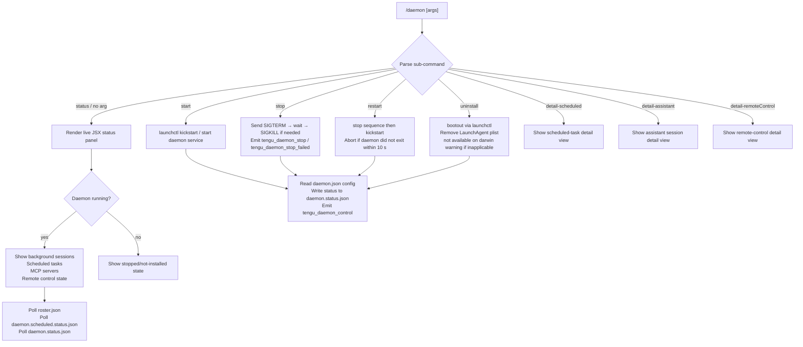

# `/daemon`

> Analysis basis: CC v2.1.169 bundle.js (AST extraction + Claude interpretation)
> Minimum version: v2.1.169

---

## Overview

`/daemon` manages the Claude Code background daemon process and its associated background services. It provides a unified control surface for inspecting, starting, stopping, restarting, and uninstalling the daemon, as well as monitoring background sessions, scheduled tasks, MCP server connections, and remote-control state. The command renders a live JSX UI that reflects daemon health and accepts sub-commands for lifecycle management.

---

## Registration

| Field | Value |
|---|---|
| type | `local-jsx` |
| name | `daemon` |
| description | `Manage background services and routines` |
| immediate | `true` |
| module_id | `R$A` |
| load_inline | `true` |
| loc_byte | `13119631` |
| loc_byte_end | `13119799` |
| loc_line | `9663` |
| arbor_handler.name | `vnf` |
| arbor_handler.fqn | `claude-2.1.169::vnf` |
| arbor_handler.kind | `AsyncFunction` |
| arbor_handler.resolution_path | `module_id` |
| arbor_handler.n_hits | `0` |

Analysis basis: CC v2.1.169 bundle.js:+13119631

---

## Input Branching

The command dispatches across five or more distinct sub-command paths plus several detail/view states, satisfying the 3+ branch threshold for a Mermaid flowchart.



Analysis basis: CC v2.1.169 bundle.js:+13108394 (handler `vnf`), +13109023 (uninstall literal), +11618778–11618854 (start/stop/restart/kickstart literals), +13109212 (detail-scheduled), +13109370 (detail-assistant), +13109491 (detail-remoteControl)

---

## Behavioral Spec

### Top-level handler — `daemonCommandHandler` (`vnf`)

The Arbor-resolved main entry point is `vnf` (AsyncFunction, resolved via `module_id`). It fans out work in parallel using `Promise.all`, then delegates to three major sub-systems before returning the JSX render result.

```
async function daemonCommandHandler(context):
    await Promise.all([
        loadDaemonStatusData(context),       // h$A
        resolveAssistantContext(context),    // I$A
        buildModelPickerState(context)       // qzK
    ])
    return renderDaemonUI(context)
```

Analysis basis: CC v2.1.169 bundle.js:+13108381

---

### Daemon status loader — `loadDaemonStatusData` (`h$A`)

Reads multiple status files in parallel, then resolves running-process information for each tracked daemon type.

```
async function loadDaemonStatusData(context):
    [scheduledStatus, mainStatus] = await Promise.all([
        readScheduledDaemonStatus(),   // sOK
        readRosterFile()               // cOK
    ])
    await Promise.resolve()

    // Resolve per-process status
    mainDaemonStatus    = await resolveMainDaemonStatus(context)   // J3K
    scheduledStatus2    = await resolveScheduledDaemonStatus()     // g$K
    rosterData          = await readAndParseRosterFile()           // WQ
    launchctlStatus     = await queryLaunchctlStatus()             // qr

    keys = Object.keys(...)
    return aggregatedStatus
```

Analysis basis: CC v2.1.169 bundle.js:+13107902

---

### Roster file reader — `readAndParseRosterFile` (`WQ`)

Reads `roster.json` from the Claude data directory, validates schema, timestamps the read with `Date.now()`, and handles rotation via `Kiq` (rename + re-read). Emits `tengu_bg_roster_parse_failed` on JSON parse or schema errors.

```
async function readAndParseRosterFile():
    path = buildRosterPath()           // _$H → joins D$ path + "roster.json"
    raw  = await fs.readFile(path)
    parsed = JSON.parse(raw)           // F6 helper

    if schema_invalid(parsed):         // Jvf checks Array.isArray / Object.keys
        emit("tengu_bg_roster_parse_failed")
        throw Error(...)

    // Check if rotation needed (Kiq)
    if needs_rotation(parsed):
        await fs.rename(path, rotatedPath)
        ...

    return parsed
```

Constant: roster file name `"roster.json"` (bundle.js:+11622777)

Analysis basis: CC v2.1.169 bundle.js:+11626602, +11626692

---

### Main daemon process status — `resolveMainDaemonStatus` (`J3K`)

Reads `daemon.status.json` from the data directory, sends `process.kill(pid, 0)` (signal 0) to probe liveness, and emits `U2` (a notification helper) on state changes.

```
async function resolveMainDaemonStatus(context):
    storagePath = buildDaemonStatusPath()   // tx6 → "daemon.status.json"
    stored = await readStatusFile(storagePath)

    if stored.pid exists:
        alive = probeProcess(stored.pid)    // process.kill(pid, 0)
        if not alive:
            return { state: "stopped" }

    notify(stored)                          // U2
    return stored
```

Constant: status file name `"daemon.status.json"` (bundle.js:+12902901)

Analysis basis: CC v2.1.169 bundle.js:+12903187, +12903384

---

### Scheduled daemon status — `resolveScheduledDaemonStatus` (`g$K`)

Mirrors `resolveMainDaemonStatus` but targets the scheduled-task daemon. Reads `daemon.scheduled.status.json`, probes PID liveness, notifies on change.

Constant: `"daemon.scheduled.status.json"` (bundle.js:+12994869)

Analysis basis: CC v2.1.169 bundle.js:+12995076, +12995275

---

### launchctl status probe — `queryLaunchctlStatus` (`qr`)

On macOS, executes `launchctl print <service-domain>` with a 5000 ms timeout to determine whether the LaunchAgent is registered and running. Uses `nnq` to obtain the current user's UID via `process.getuid()`.

```
async function queryLaunchctlStatus():
    if platform != "darwin":
        return null
    uid  = process.getuid()               // nnq
    args = ["print", "gui/<uid>/daemon"]  // b8
    result = await spawnWithTimeout("launchctl", args, 5000)
    return parseServiceState(result)
```

Constants: `"launchctl"` (bundle.js:+11619868), `"print"` (bundle.js:+11619881), timeout `5000` ms (bundle.js:+11619915)

Analysis basis: CC v2.1.169 bundle.js:+11619865, +11616722

---

### Daemon lifecycle control — `manageDaemonService` (`HG`)

Handles start / stop / restart / bootout lifecycle commands by calling `sC6` (reads the PID file from the LaunchAgents plist), sending `process.kill` to the existing process, and invoking `nKA` to parse multi-line output of `launchctl`.

```
async function manageDaemonService(action):
    pidInfo = await readServicePidFile()   // sC6 → HU.readFile + hGH + k8 + e9

    if action in ["stop", "restart"]:
        process.kill(pid, "SIGTERM")
        if not exited within timeout:
            log("daemon did not exit within 10s of SIGTERM; restart aborted")
            return

    if action in ["start", "restart", "kickstart"]:
        lines = await readLaunchctlOutput()  // nKA → _.split + A.slice
        notify(lines)                        // U2

    return result
```

Constants: LaunchAgent path components `"Library"` / `"LaunchAgents"` (bundle.js:+11616653, +11616663), signal literal `0` for probe (bundle.js:+11616475), process label `"claude daemon"` (bundle.js:+11615764)

Analysis basis: CC v2.1.169 bundle.js:+11615845, +11615873, +11615923

---

### Daemon uninstall — `uninstallDaemon` (`Bq6`)

Called when sub-command is `"uninstall"`. Constructs the LaunchAgent plist path from `os.homedir()`, calls `launchctl bootout`, and then removes the plist file with `IqH.unlink`. On non-macOS, surfaces the error `"service uninstall not available on darwin"` (bundle.js:+11618558).

```
async function uninstallDaemon():
    plistPath = path.join(os.homedir(), "Library", "LaunchAgents", "daemon.plist")
    await exec("launchctl", ["bootout", domainTarget])
    await fs.unlink(plistPath)
```

Constants: `"bootout"` (bundle.js:+11618426), `"uninstall"` (bundle.js:+13109023)

Analysis basis: CC v2.1.169 bundle.js:+11618398, +11618466

---

### Daemon start/stop/restart service actions — `manageLaunchctlActions` (`sKA`)

Handles start and restart actions (separate from the bootout path). Uses `Eb8` (launchctl query) and `b8` (spawn helper). For restart: waits up to 50 × 200 ms = 10 s for the old process to exit before issuing `kickstart`.

```
async function manageLaunchctlActions(action):
    if action == "start":
        await launchctlKickstart()
    elif action == "stop":
        await launchctlStop()
    elif action == "restart":
        stopped = await waitForExit(retries=50, delay=200ms)
        if not stopped:
            log("daemon did not exit within 10s of SIGTERM; restart aborted before kickstart")
            return
        await launchctlKickstart()
```

Constants: `50` retries (bundle.js:+11619082), `"kickstart"` (bundle.js:+11618789), `"start"` (bundle.js:+11618778), `"stop"` (bundle.js:+11618814), `"restart"` (bundle.js:+11618854), timeout message (bundle.js:+11619111)

Analysis basis: CC v2.1.169 bundle.js:+11618672

---

### Background session dispatcher — `bgSessionDispatcher` (`w`)

Core loop that manages background (bg) worker sessions. Reads the active session map, checks free memory via `os.freemem()`, probes sessions with `SIGKILL` escalation if needed, and maintains a spare session pool for fast task pickup.

```
function bgSessionDispatcher():
    sessions = A.get(...)              // active session map
    mem      = os.freemem()

    if mem < LOW_MEM_THRESHOLD:
        emit("tengu_bg_dispatch_low_mem")
        MU8(...)                       // platform low-mem check (macos)

    for session in A.values():
        retireIfSettled(session)       // Q.retireIfSettled

    // Spare pool management
    if spareEnabled:
        emit("tengu_bg_spare_enable")
        claim = await uPA(...)         // send-claim to spare session
        if claim failed:
            emit("tengu_bg_spare_claim_fail")
        else:
            emit("tengu_bg_spare_claim")

    // SIGKILL escalation
    if session needs kill:
        emit("tengu_bg_dispatch_sigkill_escalate")
        process.kill(pid, "SIGKILL")

    emit("tengu_daemon_bg_session_create")
```

Constants: `"SIGKILL"` (bundle.js:+16506538), `"spare"` (bundle.js:+16507282), `"exec"` (bundle.js:+16507405), `30` / `15` (timing thresholds, bundle.js:+16506445, +16506456)

Analysis basis: CC v2.1.169 bundle.js:+16506372, +16506490, +16506806, +16507091, +16507795, +16507885

---

### MCP server manager — `mcpServerManager` (`mSH`)

Manages the full lifecycle of Model Context Protocol server connections. Iterates all configured MCP servers, handles transport types (`stdio`, `sse`, `http`, `sse-ide`, `ws-ide`, `claudeai-proxy`), maintains connection/reconnection state, and drives OAuth flows when `needs-auth` is returned.

```
async function mcpServerManager(serverMap):
    for [name, config] of Object.entries(serverMap):
        if config.state == "disabled":
            continue

        switch config.transport:
            case "stdio":   connectStdio(config)
            case "sse":     connectSSE(config)
            case "http":    connectHTTP(config)
            case "sse-ide": connectSSEIde(config)
            case "ws-ide":  connectWSIde(config)
            default:        log error

        if result == "needs-auth":
            if cachedNeedsAuth(name):
                log("Skipping connection (cached needs-auth)")
                continue
            startOAuthFlow(name, config)   // K1H

        if result == "connected":
            emit("mcp_reconnect")
            clearFailureCache(name)
```

Constants: transport type strings (bundle.js:+6687781, +6687880, +6687916, +6688188), `"needs-auth"` (bundle.js:+6688440), `"disabled"` (bundle.js:+6687679), cache file `"mcp-needs-auth-cache.json"` (bundle.js:+6679648), skip message (bundle.js:+6688636)

Analysis basis: CC v2.1.169 bundle.js:+6687581, +6688292, +6688374

---

### MCP OAuth flow — `mcpOAuthFlowHandler` (`K1H`)

Drives OAuth 2.0 authorization for MCP servers requiring authentication. Spins up a local HTTP server on `127.0.0.1` with a `/callback` endpoint, opens the authorization URL, waits up to 300,000 ms for the user to complete the flow, and exchanges the code for tokens.

```
async function mcpOAuthFlowHandler(server, config):
    emit("tengu_mcp_oauth_flow_start")

    port   = findAvailablePort()
    server = http.createServer()              // $m9.createServer
    server.listen(port, "127.0.0.1")
    server.unref()

    authUrl = buildAuthURL(config, port)      // redirect_uri = "http://localhost:<port>/callback"
    setTimeout(authTimeout, 300000)           // 5 minute timeout

    result = await Promise.race([
        waitForCallback(server),
        waitForManualURL(),
        authTimeoutPromise
    ])

    if result.type == "AUTHORIZED":
        tokens = await exchangeCode(result.code)
        emit("tengu_mcp_oauth_flow_success")
        return tokens

    if result.type == "timeout":
        emit("tengu_mcp_oauth_flow_error", { reason: "timeout" })
        throw Error("Authentication timeout")

    // Other error states: state_mismatch, provider_denied, port_unavailable, etc.
    emit("tengu_mcp_oauth_flow_error", { reason: ... })
```

Constants: callback path `"/callback"` (bundle.js:+6463678), bind address `"127.0.0.1"` (bundle.js:+6465136), timeout `300000` ms (bundle.js:+6465233), HTTP status codes 200/400/404 (bundle.js:+6464056, +6463816, +6464513), state mismatch message (bundle.js:+6463022), CSRF literal `"OAuth state mismatch - possible CSRF attack"` (bundle.js:+6463022)

Analysis basis: CC v2.1.169 bundle.js:+6460744, +6461607, +6465125, +6465174

---

### Scheduled task reader — `readScheduledTaskStatus` (`sOK`)

Reads scheduled task configuration from the data directory via `E46`, which in turn calls `x3A` to read a UTF-8 file, `JSON.parse` the content, and validate that the result is an array. Filters tasks with state `"scheduled"`.

```
async function readScheduledTaskStatus():
    tasks = await Promise.all([
        loadScheduledTasks(),    // E46 → x3A → fs.readFile (utf8) + JSON.parse
        loadTaskHistory()        // hH
    ])
    return tasks.filter(t => t.state == "scheduled")
```

Constant: `"scheduled"` filter value (bundle.js:+12996374), encoding `"utf8"` (bundle.js:+12903697)

Analysis basis: CC v2.1.169 bundle.js:+13102604, +13102617

---

### Daemon UI renderer — `renderDaemonUI` (`Cnf`)

The JSX render function. Composes the status display from aggregated data and renders via the Ink `M.render()` call. Handles sub-command routing to detail views and unmounts (`M.unmount`) when the command exits.

```
function renderDaemonUI(state):
    view = determineView(state.subCommand):
        "detail-scheduled"    → ScheduledDetailView
        "detail-assistant"    → AssistantDetailView
        "detail-remoteControl"→ RemoteControlDetailView
        default               → MainStatusView

    element = buildJSXTree(view, {
        daemonStatus:    state.daemonStatus,
        rosterData:      state.rosterData,
        mcpServers:      state.mcpServers,
        scheduledTasks:  state.scheduledTasks,
        K:               columnWidthMap,    // padEnd with "  " separator
        H:               headerData,
        _:               itemList
    })

    instance = M.render(element)
    return instance
```

Constants: detail view names (bundle.js:+13109212, +13109370, +13109491), label strings `"Scheduled"` (bundle.js:+13110139), `"Remote Control"` (bundle.js:+13110460), `"Claude daemon"` (bundle.js:+13110745), column separator `"  "` (bundle.js:+16531382)

Analysis basis: CC v2.1.169 bundle.js:+13118587, +13119004, +13119218

---

### Assistant context resolver — `resolveAssistantContext` (`I$A`)

Resolves the assistant-role context used by daemon sessions. Reads `os.homedir()`, stats the config path, validates it is not `ENOENT`, and returns a context object tagged `"assistant"`.

```
async function resolveAssistantContext(context):
    home    = os.homedir()
    cfgPath = path.join(home, ...)
    try:
        await fs.stat(cfgPath)
    catch err:
        if err.code == "ENOENT":
            return null
    return buildAssistantContext(context)   // EH helper
```

Constants: `"assistant"` role tag (bundle.js:+13092285), `"ENOENT"` (bundle.js:+13090680)

Analysis basis: CC v2.1.169 bundle.js:+13092225, +13092264, +13092308

---

### Roster entry dispatcher — `bgWorkerLoop` (`gPA`)

Manages the set of background worker sessions registered in `roster.json`. For each roster entry, checks session state (`idle`, `working`, `blocked`, `crashed`, `bg`, `resuming`, `done`, `killed`), routes cleanup or claiming logic, and manages the session lifecycle files.

```
async function bgWorkerLoop(rosterEntries):
    for entry of rosterEntries:
        switch entry.state:
            case "idle":      considerClaiming(entry)
            case "working":   monitorProgress(entry)
            case "blocked":   reportBlocked(entry)
            case "crashed":   cleanupCrashed(entry)
            case "done":      retireEntry(entry)
            case "killed":    removeEntry(entry)
            case "resuming":  awaitResume(entry)
            case "bg":        yieldToBg(entry)

    pruneStaleFiles(...)     // $Y.rm, $Y.unlink
    updateRoster(...)        // qb6, A$H, KZ, PQ → D$.join paths
```

Constants: state strings `"idle"` (bundle.js:+16513585), `"working"` (bundle.js:+16512981), `"blocked"` (bundle.js:+16512874), `"crashed"` (bundle.js:+16512820), `"bg"` (bundle.js:+16513145), `"done"` (bundle.js:+16512636), `"killed"` (bundle.js:+16512654), `"resuming"` (bundle.js:+16514470)

Analysis basis: CC v2.1.169 bundle.js:+16512500, +16513487, +16513777

---

### Daemon config reload — `daemonConfigReloader` (`Y`)

Watches for config changes and propagates them to running daemon services. Calls `ITH` to validate the new config, writes the update, and emits `tengu_daemon_config_reload`. Manages supervisor start/stop lifecycle around config transitions.

```
function daemonConfigReloader(newConfig):
    write(newConfig)                   // q.write
    emit("tengu_daemon_config_reload")
    supervisor = "supervisor"          // literal tag

    if configChanged:
        E.stop()
        E.updateConfig(newConfig)
        E.start()
        V.start()
```

Constant: `"supervisor"` tag (bundle.js:+16521201)

Analysis basis: CC v2.1.169 bundle.js:+16521176, +16521994

---

### Daemon yield — `daemonYield` (`R`)

Called when a background session detects a foreground/service daemon taking over. Emits `tengu_daemon_yield`, writes a yield marker, and signals workers to pause.

```
function daemonYield(reason):
    write("transient")                 // Y.write with "transient" state
    log("yielding to a foreground/service daemon — bg workers will be re-adopted")
    emit("tengu_daemon_yield")
```

Constants: `"transient"` (bundle.js:+16526082), yield message (bundle.js:+16526135)

Analysis basis: CC v2.1.169 bundle.js:+16526114, +16526217

---

## State & Side Effects

| Item | Detail |
|---|---|
| Telemetry — daemon lifecycle | `tengu_daemon_control` (bundle.js:+16543552), `tengu_daemon_config_reload` (+16521994), `tengu_daemon_yield` (+16526217) |
| Telemetry — daemon stop | `tengu_daemon_stop` (literal at +16543477), `tengu_daemon_stop_failed` (+16543514) |
| Telemetry — background sessions | `tengu_bg_roster_parse_failed` (+11626692), `tengu_bg_dispatch_sigkill_escalate` (+16506490), `tengu_bg_session_create` (literal `"daemon_bg_session_create"` +16506806), `tengu_scheduled_task_missed` (+16006395) |
| Telemetry — spare pool | `tengu_bg_spare_enable` (+16507795), `tengu_bg_spare_claim` (+16507923), `tengu_bg_spare_claim_fail` (+16508189), `tengu_bg_sendclaim_failed` (+16485530) |
| Telemetry — memory | `tengu_bg_low_mem_mb` (+13177206), `tengu_bg_dispatch_low_mem` (+16507091) |
| Telemetry — MCP OAuth | `tengu_mcp_oauth_flow_start` (+6460878), `tengu_mcp_oauth_flow_success` (+6465659), `tengu_mcp_oauth_flow_error` (+6467044) |
| Telemetry — MCP reconnect | `tengu_mcp_reconnect` (literal `"mcp_reconnect"` +6686379), `tengu_mcp_reconnect_not_connected` (+6686395), `tengu_mcp_reconnect_needs_auth_discovery` (+6686707), `tengu_mcp_reconnect_failed` (+6687092) |
| Telemetry — MCP skills | `tengu_mcp_skills` (+6566426) |
| Telemetry — iron gate | `tengu_iron_gate_closed` (+7234998) |
| Telemetry — features | `tengu_feature_ok` (+1013926), `tengu_feature_sad` (+1014069), `tengu_feature_bad` (+1013988) |
| Telemetry — config | `tengu_config_auth_loss_prevented` (+3269463), `tengu_skill_file_changed` (+14374647) |
| Telemetry — bg state | `tengu_bg_state_read_transient` (+4182694) |
| File reads | `roster.json`, `daemon.status.json`, `daemon.scheduled.status.json`, `mcp-needs-auth-cache.json`, LaunchAgent plist, `pins.json` |
| File writes/renames | Roster rotation via `fs.rename`; OAuth callback server writes; MYA writes session JSON (448/384 byte budget, +13668127/+13668178) |
| Process signals | `process.kill(pid, 0)` for liveness probe; `SIGTERM` for graceful stop; `SIGKILL` for escalation |
| HTTP server (OAuth) | Bound to `127.0.0.1:<dynamic-port>`, `/callback` endpoint, auto-unreffed; 300 s timeout |
| appState changes | Daemon status, roster map, MCP server map, scheduled-task list updated reactively through Ink render loop |
| LaunchAgent management | `launchctl kickstart`, `launchctl print`, `launchctl bootout`; plist in `~/Library/LaunchAgents/` |
| Hook registration | `ZGA.register` called via `Z9` (log writer hook); chokidar file watcher for skill files (`M6` / chokidar literal +14374685) |
| Sound | None observed in depth-2 traversal |

---

## Version History

| Version | Change |
|---|---|
| v2.1.169 | Initial analysis |

---

## Common Mistakes

1. **Running `/daemon uninstall` on non-macOS**: The implementation surfaces `"service uninstall not available on darwin"` — this message is misleading; the guard actually prevents running on non-darwin platforms. The command is macOS-only for LaunchAgent lifecycle operations.
2. **Expecting instant restart**: The restart path waits up to 10 seconds (50 × 200 ms polling) for the old process to exit before issuing `kickstart`. If the daemon is hung, the restart will abort rather than force-kill.
3. **OAuth flow on remote SSH sessions**: The OAuth callback server binds to `127.0.0.1` which is unreachable from a remote browser. The implementation includes a `complete_authentication` fallback path where the user can paste the full callback URL manually (bundle.js:+6491633, +6491776).
4. **Stale `needs-auth` cache**: MCP servers whose auth fails are cached in `mcp-needs-auth-cache.json` and skipped for approximately 15 minutes. Editing the plugin config is the documented way to force an immediate retry (bundle.js:+6688636).
5. **`/daemon` vs `claude daemon` CLI**: The `/daemon` slash command is the interactive REPL form; it renders a live Ink UI. The `claude daemon` CLI sub-command (literal `"claude daemon"` at bundle.js:+11615764) is the process label used in launchctl and is distinct from the slash command invocation path.

---

## Appendix — Identifier Mapping

> For bundle debugging only. Identifiers change across versions.

| Identifier | Role |
|---|---|
| `vnf` | Main daemon command handler (AsyncFunction, Arbor-resolved) |
| `Cnf` | Daemon UI render function (JSX, calls M.render / M.unmount) |
| `h$A` | Daemon status loader (parallel fetch of all status files) |
| `sOK` | Scheduled task status reader |
| `E46` | Scheduled task file loader (reads task list JSON) |
| `x3A` | Generic UTF-8 JSON file reader (readFile + JSON.parse + Array.isArray) |
| `M$A` | Task list array validator |
| `hH` | Task history / log entry helper |
| `wA` | Error/string coercion utility |
| `_6` | String coercion helper |
| `kq` | Essential-traffic queue helper |
| `av4` | Queue shift/push helper |
| `HG` | LaunchAgent service lifecycle manager (start/stop/kill) |
| `sC6` | PID file reader for LaunchAgent |
| `nKA` | launchctl output line parser (split + slice) |
| `U2` | Status notification helper |
| `cOK` | Roster data resolver |
| `ITH` | Config/context validation helper |
| `C9` | Async storage context getter (dSL.getStore) |
| `E8` | Error constructor/wrapper |
| `N$A` | Context builder (uses v$A) |
| `EH` | String/error formatter |
| `K` | Column-width map (padEnd with "  ") |
| `Xx` | Path join helper (iKA.join + A_) |
| `J3K` | Main daemon status file resolver (daemon.status.json) |
| `tx6` | daemon.status.json path builder |
| `g$K` | Scheduled daemon status resolver (daemon.scheduled.status.json) |
| `F$K` | daemon.scheduled.status.json path builder |
| `WQ` | roster.json reader + rotation handler |
| `F6` | JSON.parse wrapper |
| `_$H` | Roster path builder (D$.join + H$H) |
| `H$H` | Base data-dir path builder |
| `k8` | Error code extractor |
| `A4A` | Date.now timestamp helper |
| `Bf` | Error type checker |
| `Kiq` | Roster rotation helper (fs.rename + re-read) |
| `Jvf` | Roster schema validator (Array.isArray + Object.keys) |
| `qr` | launchctl status query dispatcher |
| `b8` | Process spawn helper |
| `U_` | Background worker spawner |
| `C6` | Session context builder |
| `Eb8` | launchctl binary wrapper |
| `nnq` | UID resolver (process.getuid) |
| `I$A` | Assistant context resolver |
| `G_` | UI renderer initializer |
| `mi6` | Config path resolver |
| `N` | Log/output emitter |
| `ItK` | Log record builder |
| `vGA` | Log colorizer |
| `H` | Bootstrap fetch + header builder |
| `w2_` | URL query string parser |
| `u6H` | Auth cache set membership check |
| `n3` | String replace helper |
| `M9` | Text formatter (Cc + c9 + eD) |
| `o6` | Output line emitter |
| `CH` | JSON.stringify wrapper |
| `R4` | Log prefix formatter |
| `qZA` | Log line mapper |
| `rBH` | Write-to-output helper |
| `lEA` | Raw H.write wrapper |
| `StK` | Buffered log writer (appends to file, rotates) |
| `TBH` | Log debounce/flush timer |
| `_4H` | Log path builder |
| `n56` | Error code E8 wrapper |
| `MZA` | Log file path helper |
| `Vo8` | Log file rotation handler (stat + rename + unlink) |
| `htK` | Log append + rotate bound handler |
| `Z9` | Log hook registrar (ZGA.register) |
| `M` | Ink render manager |
| `mSH` | MCP server manager (full connection lifecycle) |
| `yn` | MCP config iterator |
| `XE6` | MCP server slot connector |
| `Tt` | MCP server connection handler |
| `sF` | SDK-type MCP server handler |
| `yw8` | MCP error colorizer (red/yellow) |
| `JE6` | SSE/HTTP MCP server handler |
| `VV` | MCP slot version validator |
| `kY` | MCP slot key builder |
| `g8` | Generic filter/map helper |
| `TF9` | MCP server config hasher |
| `jp_` | MCP context fetcher |
| `PPH` | MCP config hash builder (sha256) |
| `JD8` | MCP server metadata extractor |
| `jD8` | MCP server diff checker |
| `BP` | MCP content hash builder |
| `DD8` | MCP server deduplication helper |
| `O8` | MCP debug logger |
| `sw8` | MCP stdio/SSE connection runner |
| `Mc` | MCP client factory |
| `iAH` | claudeai-proxy connector |
| `K1H` | MCP OAuth flow handler |
| `gtH` | MCP connection pending-set manager |
| `D` | Forced-shutdown / process.exit helper |
| `ew8` | MCP context+path fetcher |
| `Cn` | MCP reconnection handler |
| `Nu` | MCP notification queue |
| `Y` | Daemon config reloader / supervisor controller |
| `u7` | MCP error logger |
| `iJ7` | SSH/URL connection type detector |
| `tw8` | MCP transport wrapper (stdio side) |
| `FtH` | Pending connection map getter |
| `QtH` | Pending disconnect map getter |
| `L` | Async task tracking set |
| `yF9` | MCP state update broadcaster |
| `oJ8` | MCP needs-auth cache path builder |
| `uu_` | MCP tool result emitter |
| `J` | Session kill queue |
| `S` | Background session actor |
| `EN` | MCP skills telemetry emitter |
| `D6` | MCP skills event builder |
| `Vu_` | MCP auth inclusion checker |
| `X8` | Global config reader/writer |
| `y` | Chokidar file watcher setup |
| `M6` | Chokidar watcher factory |
| `R` | Daemon yield writer |
| `vF9` | Async iterator/stream mapper |
| `NF` | Async iterator protocol handler |
| `DeH` | parseInt decimal helper |
| `aJ8` | parseInt hex helper |
| `cd8` | MCP connection result applier |
| `uSH` | MCP update hash verifier |
| `UE` | MCP cleanup + reconnect orchestrator |
| `zeH` | MCP server config change detector |
| `$` | Background session process manager |
| `D3K` | Background session startup record |
| `Oa` | Timestamp builder |
| `dXA` | MCP server slot reconciler |
| `mw8` | MCP server active/pending membership checker |
| `a8` | Retry-with-timeout helper |
| `O` | Aborted-session cleanup helper |
| `qzK` | Model picker state builder |
| `Qdq` | Model list constructor |
| `xC6` | Model list item builder |
| `_Tf` | Model capability flags assembler |
| `y6` | Model metadata resolver |
| `ydq` | Model gateway/variant builder |
| `Cc` | Model display formatter |
| `pU` | Model pricing/tier formatter |
| `Sq6` | Model filter helper |
| `HTf` | Model header builder |
| `zM` | Model provider resolver |
| `AE` | Model alias expander |
| `Fdq` | Opus model descriptor builder |
| `gdq` | Opus 1M context descriptor builder |
| `ATf` | Sonnet/Haiku model descriptor builder |
| `S$A` | Daemon command JSX component (React function component) |
| `N1` | Clock context consumer |
| `f` | Active connection close manager |
| `K4` | Ink useTheme/useInput hook wrapper |
| `z` | Ink render + lifecycle controller |
| `SH` | Foreground display helper |
| `K6` | Color/style token getter |
| `bH` | Background display helper |
| `rh` | Background session spawner |
| `su` | Session lock helper |
| `aIH` | IH session init helper |
| `MG_` | Session UUID generator + emitter |
| `PU` | Graceful shutdown orchestrator (Promise.race + process.exit) |
| `v7H` | Shutdown signal sender |
| `R7H` | Shutdown timeout canceller |
| `W` | Teammate mailbox reader |
| `zRH` | Mailbox mark-as-read handler |
| `$RH` | Mailbox file path builder |
| `A5` | Mailbox entry formatter |
| `jH6` | Mailbox message text sanitizer |
| `KzH` | Mailbox directory path builder |
| `zz` | Config merge helper |
| `Tz_` | Config deep-assign helper |
| `t5H` | Mailbox reader with lock |
| `PH6` | Mailbox has-messages checker |
| `j` | Ink input event dispatcher |
| `w` | Background session dispatcher / main worker loop |
| `b` | Background session record manager |
| `DhH` | Session state file reader |
| `uaH` | Session state file writer |
| `vj9` | Session filter helper |
| `P` | SSH/socket stream handler |
| `X` | Socket connection timeout manager |
| `c` | Session cleanup pair (sC6 + Qnq) |
| `nmK` | Session status message formatter |
| `mAH` | Session state updater |
| `MU8` | macOS memory check helper |
| `JW6` | pins.json reader |
| `HI_` | pins.json path builder |
| `ViL` | Pinned-directory recursive reader |
| `Q` | Session retire-if-settled helper |
| `NH6` | Iron-gate checker |
| `eg` | Permission classification engine |
| `uPA` | Send-claim to spare session |
| `MYA` | Session JSON writer (mkdir + writeFile) |
| `aJ5` | Send-claim timeout/retry handler |
| `oJ5` | Claim frame builder |
| `QV` | Binary claim frame serializer |
| `gPA` | Background worker roster loop |
| `oK` | Worker socket path builder |
| `jq` | Roster entry file stat + read |
| `LO` | Active session state helper |
| `XjH` | Roster entry path parser |
| `If` | Session info file reader |
| `lq6` | Roster log watcher |
| `Kb6` | Roster base-path builder |
| `A$H` | Roster state path builder |
| `KZ` | Roster split-path builder |
| `PQ` | Roster primary-path builder |
| `qb6` | Roster root-path builder |
| `Bq6` | Daemon uninstall handler |
| `aKA` | LaunchAgent plist path builder |
| `_b6` | Daemon service action dispatcher |
| `sKA` | launchctl start/stop/restart handler |
| `E` | Background task rate limiter (Math.max/min) |
| `G` | Background session connection handler |
| `M76` | Session metrics collector |
| `T` | Session state transition handler |
| `V` | Session event emitter |