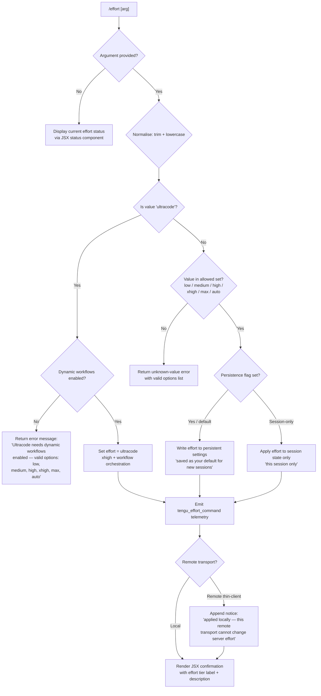

# `/effort`

> Analysis basis: CC v2.1.169 bundle.js (AST extraction + Claude interpretation)
> Minimum version: v2.1.169

---

## Overview

The `/effort` command lets the user set the reasoning and resource effort level that Claude Code applies to model inference for the current session or persistently. It accepts a named tier (`low`, `medium`, `high`, `xhigh`, `max`, `ultracode`, or `auto`) and translates that selection into the appropriate internal model-budget and workflow flags, displaying the new state via an inline JSX component.

---

## Registration

| Field | Value |
|---|---|
| type | `local-jsx` |
| name | `effort` |
| description | Set effort level for model usage |
| argumentHint | `[low\|medium\|high\|xhigh\|max\|ultracode\|auto] \| [low\|medium\|high\|xhigh\|max\|auto]` |
| immediate | `null` |
| thinClientDispatch | `control-request` |
| module_id | `SMK` |
| load_inline | `true` |
| loc_byte | `12885231` |
| loc_byte_end | `12885562` |
| loc_line | `9150` |
| arbor_handler.name | `Pdf` |
| arbor_handler.fqn | `claude-2.1.169::Pdf` |
| arbor_handler.kind | `AsyncFunction` |
| arbor_handler.resolution_path | `module_id` |
| arbor_handler.n_hits | `2` |

Analysis basis: CC v2.1.169 bundle.js:+12885231

---

## Input Branching

Eight distinct terminal paths exist (no argument / each of the seven named tiers, plus the `ultracode`-blocked path), so a Mermaid flowchart is used.



Analysis basis: CC v2.1.169 bundle.js:+12872384, +12872663, +12873249, +12872192, +12872236, +12871246

---

## Behavioral Spec

### 1. Entry point — handler `Pdf`

The Arbor-resolved handler is `Pdf` (AsyncFunction, `claude-2.1.169::Pdf`).

```
async function handleEffortCommand(context, args):
    rawArg = args.trim()

    if rawArg is empty:
        return renderCurrentEffortStatus(context)   // "current" + "status" display path

    normalised = rawArg.toLowerCase()

    if normalised == "ultracode":
        return handleUltracodeRequest(context)

    if normalised not in ALLOWED_TIERS:
        return renderError("Unknown effort value; valid: low, medium, high, xhigh, max, auto")

    return applyEffortTier(context, normalised)
```

Analysis basis: CC v2.1.169 bundle.js:+12883423, +12883440, +12883442

---

### 2. Allowed tier constants

| Tier keyword | Description string |
|---|---|
| `low` | Quick, straightforward implementation with minimal overhead |
| `medium` | Balanced approach with standard implementation and testing |
| `high` | Comprehensive implementation with extensive testing and documentation |
| `xhigh` | <!-- TODO: not found in depth-2 traversal; needs --depth 4 --> |
| `max` | Maximum capability with deepest reasoning |
| `ultracode` | xhigh + dynamic workflow orchestration (session only) |
| `auto` | Use the default effort level for your model |

Analysis basis: CC v2.1.169 bundle.js:+4217513, +4217525, +4217591, +4217606, +4217684, +4217848, +12876219

---

### 3. Ultracode gate check

```
function handleUltracodeRequest(context):
    workflowsFlag = readFeatureFlag("allow_workflows", context)

    if not workflowsFlag:
        return errorMessage(
            "Ultracode needs dynamic workflows enabled (see /config). " +
            "Valid options are: low, medium, high, xhigh, max, auto"
        )

    setEffortInSession(context, "ultracode")
    emitTelemetry("tengu_effort_command")
    return renderConfirmation(context, "ultracode",
        "xhigh + dynamic workflow orchestration; this session only")
```

The `ultracode` tier is always **session-only**; it cannot be saved as a persistent default.
Analysis basis: CC v2.1.169 bundle.js:+12873249, +4213470, +12872409

---

### 4. Effort persistence logic

```
function applyEffortTier(context, tier):
    persistenceMode = determinePersistenceMode(context)
    // persistenceMode: "persistent" | "session-only"

    if persistenceMode == "persistent":
        writeEffortToUserSettings(tier)          // settings.json under .claude/
        suffix = " (saved as your default for new sessions)"
    else:
        writeEffortToSessionState(tier)
        suffix = " (this session only)"

    emitTelemetry("tengu_effort_command")

    if isRemoteTransport(context):
        suffix += " (applied locally — this remote transport can't change server effort)"

    return renderConfirmation(context, tier, suffix)
```

Analysis basis: CC v2.1.169 bundle.js:+12872192, +12872236, +12871246

---

### 5. Model-string compatibility check

Before committing the new effort tier, the handler inspects the currently configured model identifier against a hard-coded allowlist to decide which effort features are available. The model strings observed in the allowlist are:

- `claude-3-` prefix family (bundle.js:+4214063)
- `claude-opus-4-0` (bundle.js:+4214081)
- `claude-opus-4-1` (bundle.js:+4214104)
- `claude-sonnet-4-0` (bundle.js:+4214127)
- `claude-sonnet-4-5` (bundle.js:+4214152)
- `claude-haiku-4-5` (bundle.js:+4214177)
- `claude-opus-4-5` (bundle.js:+4214542)
- `claude-opus-4-6` (bundle.js:+4214319)
- `claude-opus-4-7` (bundle.js:+4214296)
- `claude-opus-4-8` (bundle.js:+4214273)
- `claude-sonnet-4-6` (bundle.js:+4214342)

The `xhigh_effort` capability key (bundle.js:+4214792) and `max_effort` capability key (bundle.js:+4214415) gate the `xhigh` and `max` tiers respectively.

```
function checkModelCapabilities(modelId, tier):
    caps = resolveModelCapabilities(modelId)

    if tier == "xhigh" and not caps.has("xhigh_effort"):
        return capabilityError("xhigh not supported by current model")

    if tier == "max" and not caps.has("max_effort"):
        return capabilityError("max not supported by current model")

    return OK
```

Analysis basis: CC v2.1.169 bundle.js:+4214792, +4214415

---

### 6. Status display (no-argument path)

When invoked with no argument the command renders a JSX view showing:

- The **current** effort level label (literal key `"current"` at bundle.js:+12883463)
- A **status** summary block (literal key `"status"` at bundle.js:+12883478)
- For `ultracode`, the extended description: `"Current effort level: ultracode (xhigh + dynamic workflow orchestration; this session only)"` (bundle.js:+12872409)

The JSX is produced via `IA.createElement` (bundle.js:+12883494).

---

### 7. Ultracode animated visual (`xQ`, `IMK`)

The `ultracode` confirmation path triggers a decorative animated component that uses polar-coordinate math:

```
function renderUltracodeAnimation(frameIndex, particleList):
    for each particle in particleList:
        distance = sqrt(particle.x^2 + particle.y^2)          // yMK
        angle    = cos(frameIndex * SPEED_FACTOR) * MAX_ANGLE  // hMK
        col      = round(min(angle, MAX_COL))
        // position mapped to terminal cell grid

    // ZMK slices particle array with H.map + H.slice
    // IMK drives frame counter; constants: 3 columns, 17 rows, 4 speed,
    //   8.5 radius, 18 wave-count (bundle.js:+12875907–+12876182)
```

Named colour theme: `"violet-ripple"` (bundle.js:+12875967). Frame positions use integer steps `5`, `7`, `9` (bundle.js:+12878054, +12878074, +12878333).

Analysis basis: CC v2.1.169 bundle.js:+12875890, +12877522, +12877623

---

### 8. Settings persistence pathway

The effort value is written through the standard settings stack:

```
function writeEffortToUserSettings(tier):
    // resolves path: ~/.claude/settings.json  (bundle.js:+1268769, +1268779)
    currentSettings = loadSettingsFromDisk()    // DB / t_ chain
    currentSettings["effort"] = tier
    atomicWriteSettings(currentSettings)        // WO6 atomic-write with temp file + rename
```

The settings module emits `loadSettingsFromDisk_start` and `loadSettingsFromDisk_end` internal markers (bundle.js:+1284673, +1284729). An auth-loss guard prevents writes that would silently drop authentication data (telemetry: `tengu_config_auth_loss_prevented`, bundle.js:+3269463).

Analysis basis: CC v2.1.169 bundle.js:+1287222, +1268769

---

## State & Side Effects

| Item | Detail |
|---|---|
| Telemetry | `tengu_effort_command` (bundle.js:+12872840) — emitted on every successful tier change |
| Telemetry | `tengu_workflows_enabled` (bundle.js:+4213671) — emitted when workflow-flag state is read during ultracode gate check |
| Telemetry | `tengu_slate_finch` (bundle.js:+4217971) — emitted from the effort-tier resolution path |
| Telemetry | `tengu_feature_ok` / `tengu_feature_sad` / `tengu_feature_bad` (bundle.js:+1013926, +1014069, +1013988) — feature-flag read outcomes |
| Telemetry | `tengu_config_auth_loss_prevented` (bundle.js:+3269463) — settings write guard |
| Settings write | `~/.claude/settings.json` updated with `"effort"` key when persistence mode is active |
| Session state | `effort` field in in-memory app state updated immediately for all paths |
| JSX render | Inline JSX component returned to the REPL renderer; no separate hook registration |
| thinClientDispatch | `control-request` — the command is dispatched via the control channel in thin-client / remote transport mode |
| Sound | None detected |

---

## Version History

| Version | Change |
|---|---|
| v2.1.169 | Initial analysis |

---

## Common Mistakes

1. **Passing `ultracode` without dynamic workflows**: The command will reject it with an explicit error message directing the user to `/config`; `ultracode` is never silently downgraded to `xhigh`.
2. **Expecting `ultracode` to persist**: The `ultracode` tier is always session-only and cannot be saved as the default for new sessions. Use `xhigh` if persistence is needed.
3. **Using `ultracode` on a remote transport**: The tier is set locally in the client; the remote inference endpoint is not notified, and the CLI will append a notice to that effect.
4. **Specifying a tier unsupported by the active model**: `xhigh` and `max` are gated by model capability keys; attempting to set them on an incompatible model will return a capability error rather than silently reducing effort.
5. **Omitting the argument to change the level**: `/effort` with no argument is a **read-only status display**, not a toggle. An argument is required to change the current tier.
6. **Case sensitivity**: The argument is normalised to lowercase before matching, so `High`, `HIGH`, and `high` are equivalent.

---

## Appendix — Identifier Mapping

> For bundle debugging only. Identifiers change across versions.

| Identifier | Role |
|---|---|
| `Pdf` | Main async handler for `/effort` (Arbor-resolved entry point) |
| `jp8` | Top-level command wiring / dispatch function |
| `xs` | Effort command core orchestrator |
| `RP` | Model capability resolver |
| `U38` | Effort-string normaliser |
| `_6` | String coercion utility |
| `bZ` | Boolean/flag accessor |
| `x$9` | Allowed-models list builder |
| `b9` | Feature-flag/capability check function |
| `zI_` | Workflow-flag reader |
| `BiL` | Workflows-enabled branch handler |
| `UiL` | Session-only effort applicator |
| `bs` | Effort tier descriptor table |
| `CP` | Model-string compatibility tester |
| `i1` | Model-ID parser / normaliser |
| `A` | Model string (variable holding current model ID) |
| `Rh` | Persistence write helper |
| `ZY` | Settings-update dispatcher |
| `CyH` | Effort tier option structure builder |
| `_` | Tier keyword string (variable) |
| `y6` | Timestamp / session-metadata recorder |
| `Q38` | Model lookup for effort capability |
| `RyH` | Remote-transport notice appender |
| `Xm` | Integer parser with NaN guard |
| `hyH` | `xhigh_effort` capability branch handler |
| `IjH` | `max_effort` capability branch handler |
| `UL` | Settings loader |
| `$ZH` | Settings object accessor |
| `av` | Effort option array assembler |
| `yfH` | Tier validation predicate |
| `SyH` | Tier membership checker (includes check against allowed-tiers set) |
| `$AH` | String-conversion wrapper for tier label |
| `wI_` | Effort write-to-settings coordinator |
| `FiL` | Settings field setter for effort |
| `VLH` | Effort persistence commit function |
| `Oq` | App-state event emitter |
| `IY` | API client / model-config accessor |
| `D6` | Settings read-write core |
| `HP6` | Settings file path resolver |
| `_P6` | Settings schema validator |
| `tu` | Settings deserialiser |
| `su` | Settings raw-JSON parser |
| `VL8` | Cached settings reader |
| `$G_` | Growthbook experiment event emitter |
| `JG_` | Settings change notifier |
| `hMK` | Cosine-based angle calculator (ultracode animation) |
| `yMK` | Distance calculator using sqrt (ultracode animation) |
| `IMK` | Animation frame driver (ultracode visual) |
| `Pm` | Effort display renderer (combines RP + IjH) |
| `ZMK` | Particle array slicer (ultracode animation) |
| `H` | Network bootstrap / model list fetcher |
| `N` | HTTP fetch wrapper with auth headers |
| `ItK` | Response parser |
| `CH` | JSON serialiser |
| `R4` | URL / path formatter |
| `rBH` | Response error handler |
| `StK` | File-based bootstrap loader |
| `P$` | User-agent string builder |
| `w2_` | Query-string parser |
| `q` | Raw data buffer / stream variable |
| `u6H` | Feature-flag membership check |
| `n3` | String replacement utility |
| `M9` | Model alias resolver |
| `Cc` | Model-tier classifier |
| `c9` | Model-string canonicaliser |
| `eD` | Model alias expansion |
| `o6` | Feature-flag read function |
| `d` | Feature-flag store accessor |
| `K6` | Flag-value getter |
| `Jp8` | Effort status component (current-level display) |
| `Xp8` | Effort selection component (tier-change flow) |
| `oQf` | Effort command renderer (no-arg path) |
| `E3A` | Remote-transport notice builder |
| `tj` | Settings-load trigger |
| `IW6` | Effort command renderer (with-arg path) |
| `vjH` | Tier label formatter |
| `t_` | Settings persistence engine |
| `V$` | Config directory locator |
| `l6` | Path join utility |
| `W9_` | Settings file writer |
| `YB` | Settings object builder |
| `G2` | Home-directory resolver |
| `k8` | ENOENT error handler |
| `y1_` | Timestamp recorder for settings writes |
| `_vH` | Settings write-back helper |
| `WO6` | Atomic file writer (temp + rename) |
| `yO` | Cache clear on settings write |
| `Or6` | Settings append/write coordinator |
| `ku` | Settings path builder (`.claude/settings.json`) |
| `G_` | Platform path utility |
| `SH` | Feature-flag set function |
| `bH` | Feature-flag unset function |
| `DB` | Settings-from-disk loader |
| `hH` | Hook / subscriber notifier |
| `wb` | Effort confirmation JSX builder |
| `X8` | Global config save function |
| `M6` | Config key constant holder |
| `c76` | Base config constants |
| `aQf` | Ultracode-blocked effort renderer |
| `xoH` | Argument trim + validate helper |
| `rQf` | Main effort-change renderer |
| `xQ` | Ultracode animation particle renderer |
| `O` | Particle array (ultracode animation) |
| `S8` | Stopped-session guard |

---

Note: index built via Arbor fallback; some signals (telemetry, literals) may be missing — see arbor-fallback.js.