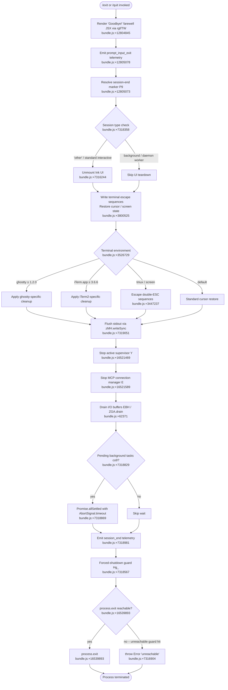

# `/exit`

> Analysis basis: CC v2.1.169 bundle.js (AST extraction + Claude interpretation)
> Minimum version: v2.1.169

---

## Overview

`/exit` (also available as `/quit`) is a local-jsx slash command that terminates the Claude Code CLI session. When invoked, it performs an orderly shutdown sequence: it emits a "Goodbye!" farewell message, triggers session-end telemetry, tears down MCP connections and active supervisors, flushes pending I/O, and finally calls `process.exit`. The command executes immediately (`immediate: true`) without sending a prompt to the AI model.

---

## Registration

| Field | Value |
|---|---|
| type | `local-jsx` |
| name | `exit` |
| description | `null` |
| aliases | `["quit"]` |
| immediate | `true` |
| module_id | `L5K` |
| load_inline | `true` |
| loc_byte | `12805641` |
| loc_byte_end | `12805837` |
| loc_line | `9130` |
| arbor_handler.name | `ogf` |
| arbor_handler.fqn | `claude-2.1.169::ogf` |
| arbor_handler.kind | `AsyncFunction` |
| arbor_handler.resolution_path | `module_id` |
| arbor_handler.n_hits | `1` |

Analysis basis: CC v2.1.169 bundle.js:+12805641

---

## Input Branching

The exit flow has more than three distinct execution phases and conditional branches (session-type checks, terminal environment detection, MCP/supervisor teardown, process-exit path), so a Mermaid flowchart is used.



---

## Behavioral Spec

### 1. Handler Entry — `exitCommandHandler` (bundle ident: `ogf`)

The async function `ogf` is the resolved handler for `/exit`.

Analysis basis: CC v2.1.169 bundle.js:+12804890

```
async function exitCommandHandler(context):
    sessionContext  = getSessionContext(context)       // w9 → nDH
    appState        = getAppState(context)             // H → MA.get
    displayFarewell()                                  // rgf → TW renders "Goodbye!"
    scheduledTaskManager = getScheduledTaskManager()  // hC8
    sessionEndPromise = initiateShutdown(appState)    // P9
    await sessionEndPromise
```

### 2. Farewell Rendering — `farewellComponent` (bundle ident: `rgf` / `TW`)

Renders the string literal `"Goodbye!"` as a JSX element via `lMA.createElement`.

Analysis basis: CC v2.1.169 bundle.js:+12804845, +12804967

```
function farewellComponent():
    return createElement(TextComponent, { text: "Goodbye!" })
```

The string constant `"Goodbye!"` is confirmed at bundle.js:+12804854.

### 3. Shutdown Orchestrator — `shutdownOrchestrator` (bundle ident: `P9`)

This is the central shutdown sequence function. It coordinates all teardown steps in order.

Analysis basis: CC v2.1.169 bundle.js:+7318487

```
async function shutdownOrchestrator(appState, sessionType):
    await Promise.resolve()                        // yield to event loop
    startTimeout = setTimeout(forceExitGuard, MAX_SHUTDOWN_TIMEOUT)
                                                   // MAX value derived via Math.max, bundle.js:+7318575

    // Phase 1 – UI teardown
    terminalRestorer = restoreTerminalState()      // pRH, v58
    terminalRestorer.unmountInkUI()                // H.unmount, bundle.js:+7316244
    writeTerminalEscapes()                         // v58 → Xs.writeSync, bundle.js:+3800371
    applyTerminalVendorCleanup()                   // mkH: ghostty, iTerm2 detection

    // Phase 2 – escape-sequence normalization
    normalizeEscapeSequences()                     // X0: tmux/screen double-ESC, bundle.js:+3447237
    flushOutput(zMH_writeSync)                     // bundle.js:+7319051

    // Phase 3 – supervisor / MCP stop
    supervisor = appState.getSupervisor()          // Y, bundle.js:+16521469
    supervisor.stop()
    mcpManager = appState.getMcpManager()          // E, bundle.js:+16521589
    mcpManager.stop()
    drainIOBuffers(EBH)                            // ZGA.drain, bundle.js:+62371

    // Phase 4 – pending tasks
    pendingTasks = collectPendingTasks(co9)        // Promise.allSettled + Array.from
    signal = AbortSignal.timeout(ABORT_TIMEOUT)    // bundle.js:+7318869
    await Promise.race([
        Promise.allSettled(pendingTasks),
        signal
    ])                                             // bundle.js:+7318704

    // Phase 5 – telemetry flush
    emitTelemetry("session_end", sessionMetrics)  // bundle.js:+7318981
    writeCacheEvictionHint()                       // tengu_cache_eviction_hint, bundle.js:+7318943

    // Phase 6 – final exit
    clearTimeout(startTimeout)
    forceExitGuard.clearTimeout()                 // Hg_, bundle.js:+7318781
    process.exit(0)                               // D → process.exit, bundle.js:+16539893
```

Timeout constant 3500 ms found at bundle.js:+7318591 (used for the unref timer `E2H.unref`).
Fallback timeout 2000 ms found at bundle.js:+7318769.

### 4. Terminal State Restorer — `terminalStateRestorer` (bundle ident: `pRH`)

Handles Ink UI unmount and writes cursor-restoration sequences.

Analysis basis: CC v2.1.169 bundle.js:+7316166

```
function terminalStateRestorer(dlMap, outputStream):
    outputStream.writeSync(CURSOR_SAVE_ESCAPE)    // "\x1b7", bundle.js:+3800525
    inkInstance = dlMap.get(INK_KEY)
    inkInstance.unmount()                         // bundle.js:+7316244
    outputStream.writeSync(CURSOR_RESTORE_ESCAPE) // "\x1b8", bundle.js:+3800536
    applyVendorCleanup(Hb, v58)
```

### 5. Terminal Vendor Cleanup — `vendorTerminalCleanup` (bundle ident: `mkH`)

Detects terminal emulator and applies version-gated workarounds.

Analysis basis: CC v2.1.169 bundle.js:+11143980 (entry via `mT` → `xZ`)

```
function vendorTerminalCleanup(termEnv):
    termName = detectTerminal()
    if termName == "ghostty" and version >= "1.2.0":   // bundle.js:+3526729, +3526759
        applyGhosttyFix()
    else if termName == "iTerm.app" and version >= "3.6.6":  // bundle.js:+3526798, +3526830
        applyITermFix()
    else:
        applyDefaultRestore()
```

### 6. Escape-Sequence Normalizer — `escapeSequenceNormalizer` (bundle ident: `X0`)

Handles multiplexer double-escape issues.

Analysis basis: CC v2.1.169 bundle.js:+3447224

```
function escapeSequenceNormalizer(output, termEnv):
    if termEnv.includes("tmux"):              // bundle.js:+3447237
        output.replaceAll("\x1b\x1b", ...)   // bundle.js:+3447283
    else if termEnv.includes("screen"):       // bundle.js:+3447310
        output.replaceAll(...)
```

### 7. Force-Exit Guard — `forceExitGuard` (bundle ident: `Hg_`)

A safety net that fires if the normal shutdown path stalls.

Analysis basis: CC v2.1.169 bundle.js:+7316750

```
function forceExitGuard(dlMap):
    clearTimeout(shutdownTimer)
    inkInstance = dlMap.get(INK_KEY)          // bundle.js:+7316783
    try:
        process.exit(0)                       // bundle.js:+7316831
    catch:
        process.kill(process.pid, "SIGTERM")  // bundle.js:+7316856
        throw Error("unreachable")            // bundle.js:+7316904
```

### 8. Session-End Telemetry — `sessionEndTelemetry` (bundle ident: `bP8`)

Collects and emits session statistics before process termination.

Analysis basis: CC v2.1.169 bundle.js:+7317986

```
async function sessionEndTelemetry(sessionContext, appState):
    metrics = computeSessionMetrics(Co9)      // Date.now, Math.max, Math.round
    metrics = Object.assign(metrics, extras)
    emitTelemetryEvent("session_end", metrics)
    emitTelemetryEvent("tengu_cache_eviction_hint", cacheHints)
    emitTelemetryEvent("tengu_scroll_summary", scrollStats)
```

### 9. Scheduled-Task Drain — `scheduledTaskDrain` (bundle ident: `hC8`)

Ensures any in-flight scheduled tasks are accounted for during shutdown.

Analysis basis: CC v2.1.169 bundle.js:+11143985

```
function scheduledTaskDrain(taskQueue, widthCalculator):
    for task in taskQueue:                    // H.push, bundle.js:+11143985
        parsed = parseScheduledTask(Q0f, task)
    remainingWidth = computeRemainingWidth(wq, x1, A8)
    // uses Bun.stringWidth for grapheme-aware measurement, bundle.js:+211704
```

Literal `"scheduled task"` confirmed at bundle.js:+11143999.
Literal `"grapheme"` for width segmentation at bundle.js:+210436.

### 10. Background / Daemon Session Handling — `daemonSessionHandler` (bundle ident: `w9` → `nDH`)

When the session type is `"bg"`, `"daemon"`, or `"daemon-worker"`, the UI unmount path is bypassed.

Analysis basis: CC v2.1.169 bundle.js:+2261602

```
function daemonSessionHandler(sessionType):
    if sessionType in ["bg", "daemon", "daemon-worker"]:  // bundle.js:+2261602, +2261612, +2261626
        skipUiTeardown = true
    return skipUiTeardown
```

---

## State & Side Effects

| Item | Detail |
|---|---|
| Telemetry — `prompt_input_exit` | Emitted immediately when `/exit` is typed, before any teardown. bundle.js:+12805078 |
| Telemetry — `session_end` | Emitted during `bP8` with session duration and usage metrics. bundle.js:+7318981 |
| Telemetry — `tengu_scroll_summary` | Scroll statistics emitted as part of session-end batch. bundle.js:+7318000 |
| Telemetry — `tengu_cache_eviction_hint` | Cache eviction metadata flushed before exit. bundle.js:+7318943 |
| Telemetry — `tengu_feature_sad` | Feature-sad signal emitted via `o6` → `d`. bundle.js:+1014069 |
| Telemetry — `tengu_amber_creek` | Layout/rendering metric emitted via `D6`. bundle.js:+3456954 |
| Telemetry — `tengu_pewter_brook` | Rendering metric emitted alongside `tengu_amber_creek`. bundle.js:+3456862 |
| Telemetry — `tengu_startup_perf` | Startup profiling report emitted during shutdown flush. bundle.js:+219930 |
| Telemetry — `tengu_bg_dispatch_sigkill_escalate` | Emitted if a background process required SIGKILL escalation. bundle.js:+16506490 |
| Telemetry — `tengu_bg_dispatch_low_mem` | Emitted if low-memory condition was detected in background dispatch. bundle.js:+16507091 |
| Telemetry — `tengu_bg_spare_enable` | Emitted when a spare background session was enabled. bundle.js:+16507795 |
| Telemetry — `tengu_bg_spare_claim` | Emitted when spare session successfully claimed. bundle.js:+16507923 |
| Telemetry — `tengu_bg_spare_claim_fail` | Emitted when spare session claim failed. bundle.js:+16508189 |
| Telemetry — `tengu_daemon_config_reload` | Emitted if daemon config was reloaded during session. bundle.js:+16521994 |
| Ink UI unmount | `H.unmount()` called on the active Ink render tree. bundle.js:+7316244 |
| stdout flush | `zMH.writeSync` called twice (pre- and post-teardown). bundle.js:+7316166, +7319051 |
| Terminal cursor state | Cursor-save (`\x1b7`) and cursor-restore (`\x1b8`) ANSI sequences written. bundle.js:+3800525, +3800536 |
| Supervisor stop | `supervisor.stop()` called on the active session supervisor `Y`. bundle.js:+16521469 |
| MCP connection manager stop | `mcpManager.stop()` called on `E`. bundle.js:+16521589 |
| I/O drain | `ZGA.drain()` called via `EBH`. bundle.js:+62371 |
| Hook registration drain | `Z9` → `ZGA.register` path ensures hook queues are flushed. bundle.js:+62328 |
| Pending tasks wait | `Promise.allSettled` with `AbortSignal.timeout` waits for background tasks. bundle.js:+7318829, +7318869 |
| Shutdown timeout | Unref timer of 3500 ms (`E2H.unref`). bundle.js:+7318591, +7318600 |
| Fallback timeout | 2000 ms fallback timeout. bundle.js:+7318769 |
| process.exit | `process.exit(0)` via `D`. bundle.js:+16539893 |
| Force-exit fallback | `process.kill(pid, "SIGTERM")` if `process.exit` does not terminate. bundle.js:+7316856 |
| appState changes | Session state marked as closed (`"closed"` literal, bundle.js:+16506352). Supervisor and MCP manager stopped. |
| Sound | <!-- TODO: not found in depth-2 traversal; needs --depth 4 --> |

---

## Version History

| Version | Change |
|---|---|
| v2.1.169 | Initial analysis |

---

## Common Mistakes

1. **Expecting `/exit` to cancel a running agent turn gracefully** — because `immediate: true` is set, the command fires before any prompt is sent to the model. If an agent turn is in progress, the shutdown sequence runs regardless; any in-flight API requests will be abandoned when the process exits.

2. **Using `/quit` expecting different behavior** — `/quit` is a registered alias for `/exit` and resolves to the identical handler `ogf`. There is no behavioral difference.

3. **Relying on `process.exit` being instantaneous** — the handler is `async` and awaits multiple teardown phases including `Promise.allSettled` with an `AbortSignal.timeout`. The process will not exit immediately if background tasks or pending I/O are present; allow up to the unref timeout (~3500 ms) for clean shutdown.

4. **Assuming background/daemon sessions follow the same teardown path** — when the session type is `"bg"`, `"daemon"`, or `"daemon-worker"`, the Ink UI unmount and cursor-restore paths are skipped. Telemetry and process.exit still execute normally.

5. **Expecting the cursor/screen state to be perfectly restored on all terminals** — vendor-specific workarounds exist only for ghostty ≥ 1.2.0 and iTerm.app ≥ 3.6.6. Other terminals use the default ANSI sequence path, which may behave differently inside tmux or screen due to the double-ESC normalization logic.

---

## Appendix — Identifier Mapping

> For bundle debugging only. Identifiers change across versions.

| Identifier | Role |
|---|---|
| `ogf` | Main handler for `/exit` command (AsyncFunction) |
| `w9` | Session-type resolver (delegates to `nDH`) |
| `nDH` | Session-type extraction implementation |
| `H` | Bootstrap fetch / app-state access helper (multi-role utility) |
| `N` | Command argument parser / normalizer |
| `ItK` | Argument validation helper |
| `vGA` | Sub-argument parser (calls `yoK`, `hoK`) |
| `CH` | JSON.stringify wrapper |
| `R4` | Command string tokenizer / path extractor |
| `qZA` | Token map helper (`ZtK.map`) |
| `rBH` | Writer helper (calls `lEA`) |
| `lEA` | Low-level output writer (`H.write`) |
| `StK` | Session / transcript persistence orchestrator |
| `TBH` | Debounced write scheduler (setTimeout/clearTimeout/setImmediate) |
| `_4H` | Path builder for transcript files |
| `n56` | Error classifier (`E8`, checks for `"EISDIR"`) |
| `MZA` | Transcript path resolver (`P6H.join`, `I6`) |
| `Vo8` | Transcript file rotator (`Mh.stat`, `Mh.rename`, `Mh.unlink`) |
| `htK` | Transcript append writer (`Mh.mkdir`, `Mh.appendFile`) |
| `Z9` | Hook queue registrar (`ZGA.register`) |
| `P$` | App-state property accessor |
| `w2_` | Argument string splitter/trimmer |
| `u6H` | Permission/capability set checker (`vO4.has`) |
| `n3` | String replacement utility |
| `M9` | Model-name resolution dispatcher (calls `Cc`, `c9`, `eD`) |
| `Cc` | Model alias resolver (calls `tY`, `pU`, `FA`, `CC`) |
| `CC` | Full model-name constructor (applies prefix `"anthropic."`) |
| `c9` | Model-shortname normalizer (handles `"opusplan"`, `"sonnet"`, `"haiku"`, `"opus"`, `"best"`) |
| `u2` | Provider selection helper (`ZLH`) |
| `TLH` | Supported-model-list inclusion checker (`GLH.includes`) |
| `Mk` | Model-tier mapper (`zM`, `F5`) |
| `QcH` | Model-capability checker (`F5`) |
| `AE` | Model-alias expander (`zM`, `F5`, `YA`) |
| `dG1` | Model delegation wrapper (`AE`) |
| `zM` | Provider-type resolver (`YA`; handles `"anthropicAws"`, `"gateway"`) |
| `__8` | Model-exclusion checker (`Q5L.includes`) |
| `dcH` | Model-deprecation handler (`_6`) |
| `eD` | Extended model dispatch (calls `c9`, `hG`) |
| `hG` | Full model-resolution pipeline |
| `o6` | Feature-sad event emitter (`d`, `K6`) |
| `d` | Core telemetry dispatcher |
| `K6` | Telemetry event formatter (`c76`) |
| `c76` | Telemetry serializer |
| `n3H` | Detach-request / background-task dispatcher (emits `"detach-request"`) |
| `Y_8` | Detach helper |
| `RQq` | Task scheduler (calls `GS8`, `S8`) |
| `GS8` | Scheduled-task executor |
| `S8` | Task state manager |
| `li` | Low-level IPC writer (`Fe.write`, `CH`) |
| `GqH` | Task-queue cleanup helper |
| `xM` | Context extraction helper |
| `hC8` | Scheduled-task drain (calls `mT`, `Q0f`, `wq`) |
| `mT` | Terminal width probe (`xZ`) |
| `xZ` | Terminal dimension reader |
| `Q0f` | Task-parse orchestrator (calls `zN`, `pk`, `CaH`, `v9`) |
| `zN` | Cron-expression parser (minute/hour/day fields) |
| `K` | Column formatter (`L.map`, `f.padEnd`) |
| `w` | Background-session lifecycle manager |
| `L` | Promise lifecycle tracker (`q.add`, `q.delete`, `f.finally`) |
| `J` | Session kill helper (`A.values`, `S.kill`) |
| `D` | Forced-shutdown executor (`Bj`, `process.exit`, `z.abort`) |
| `$` | Data channel wrapper (`D3K`) |
| `j` | Date/time scheduler (`w`) |
| `pk` | Cron-token parser (calls `p67`) |
| `p67` | Cron-field set builder (`H.split`, `L.match`, `parseInt`, `K.add`) |
| `CaH` | Cron next-occurrence calculator (date arithmetic) |
| `O` | Background-session state object (`S8`) |
| `f` | Connection/stream lifecycle wrapper (`A.close`, `q.close`) |
| `v9` | Duration formatter (`Math.floor`, `Math.round`) |
| `wq` | String width calculator (calls `A8`, `x1`) |
| `A8` | Grapheme-aware width measurer (`Bun.stringWidth`) |
| `x1` | Unicode segment width helper (`A8`, `LD`) |
| `LD` | Unicode lookup-data accessor |
| `rgf` | Farewell JSX component renderer (renders `"Goodbye!"` via `TW`) |
| `TW` | Text component wrapper |
| `P9` | Shutdown orchestrator (main async exit sequence) |
| `pRH` | Terminal-state restorer (Ink unmount, cursor save/restore) |
| `Hb` | Ink instance registry accessor |
| `v58` | Terminal escape writer (`Xs.writeSync`, `mkH`, `ykH`, `X0`) |
| `mkH` | Vendor terminal cleanup (ghostty / iTerm2 detection) |
| `ykH` | Auxiliary terminal teardown helper |
| `X0` | Escape-sequence normalizer for tmux/screen |
| `J3` | Output stream reference |
| `eF_` | Shell-history path writer (`tW`, `ex`, `I6`, `Yv6`, `f$`) |
| `tW` | Working-directory resolver |
| `ex` | History entry formatter |
| `I6` | Filesystem existence checker (`xZ`) |
| `Yv6` | Shell RC file updater (`rR`, `x$`, `G_`, `q.statSync`) |
| `rR` | Shell RC append helper |
| `G_` | Shell RC path builder |
| `f$` | Shell integration finalizer (`I6`, `o4`) |
| `o4` | Hook registration finisher (`Z9`) |
| `xo9` | Dim-text formatter |
| `Hg_` | Force-exit guard (clearTimeout, `process.exit`, `process.kill`) |
| `EBH` | I/O drain trigger (`ZGA.drain`) |
| `Y` | Session-supervisor controller (stop/start/updateConfig) |
| `ITH` | Stats collector (`C9`, `E8`, `N$A`, `EH`) |
| `C9` | AsyncLocalStorage store reader (`dSL.getStore`) |
| `E8` | Error classifier |
| `N$A` | Stat accumulator (`v$A`) |
| `EH` | String coercion wrapper |
| `BOK` | Object-width layout calculator (`Object.keys`, `Math.max`, `iD`) |
| `T` | Sub-supervisor handle (`OZ6`, `M76`) |
| `OZ6` | Supervisor stop implementation |
| `M76` | Supervisor event emitter |
| `E` | MCP connection manager (`G`, `Math.max`, `Math.min`) |
| `G` | MCP transport lifecycle (`M76`, `yS`, `ZN`, `Promise.all`, `Un`, `iF`, `hH`, `wA`) |
| `edK` | Heartbeat scheduler (`W_H`) |
| `W_H` | Heartbeat tick implementation |
| `V` | Progress/spinner controller |
| `co9` | Background-task collector (`Promise.allSettled`, `Array.from`) |
| `zM6` | Startup-perf flush (`xo8`, `ZZA`) |
| `xo8` | Perf-mark recorder (`kZA`, `d`) |
| `kZA` | Performance metrics aggregator (`Ku`, `Object.entries`, `Math.round`) |
| `ZZA` | Startup-report writer (`NZA`, `JzH`, `WZA`, `Ku`, `IZA`, `kZA`) |
| `NZA` | Report destination path builder |
| `JzH` | Synchronous file writer (`eKH.openSync`, `.writeFileSync`, `.fsyncSync`, `.closeSync`) |
| `WZA` | Profiling checkpoint formatter (`Ku`, `A.push`, `og6`, `zo`) |
| `Ku` | `perf_hooks` dynamic require wrapper |
| `IZA` | Alternate report path builder |
| `bP8` | Session-end telemetry collector (`Co9`, `E1`) |
| `bo9` | Session token-usage summarizer |
| `Co9` | Session-metrics calculator (`Date.now`, `Math.max`, `Math.round`, `Object.assign`) |
| `So9` | Supplemental metrics builder |
| `E1` | Local-agent context reader (`u6H`, `_E_`, `ta`, `N`, `HE_`, `d_`, `WCL`, `D6`) |
| `_E_` | Context-flag extractor (`_6`) |
| `ta` | Platform-capability checker (`PCL`) |
| `HE_` | OS-type classifier (`r6`, `Boolean`; handles `"windows"`) |
| `d_` | Database context reader (`DB`) |
| `WCL` | Config-context wrapper (`D6`) |
| `D6` | App-config provider (`HP6`, `_P6`, `tu`, `VL8`, `tX6.add`, `sB`) |
| `Xf6` | Exit-code selector |
| `M6` | Module reference resolver (`c76`) |
| `BRH` | Pending-render flusher (`Promise.resolve`, `RP8`, `H`) |
| `RP8` | Final render flush helper |