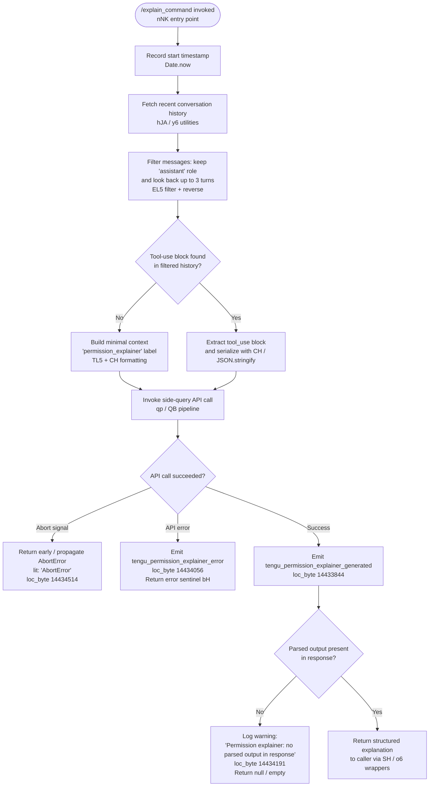

# `/explain_command`

> Analysis basis: CC v2.1.169 bundle.js (AST extraction + Claude interpretation)
> Minimum version: v2.1.169

---

## Overview

`/explain_command` is an internal tool-type command that, given a tool name and a pending tool-use block from the conversation history, invokes a dedicated "permission explainer" sub-agent to generate a human-readable explanation of what that tool call will do and why it may require elevated permissions. The command is consumed programmatically (not typed interactively by the user) and its output is surfaced in the permission-approval UI. It is registered as type `tool` and is handled by the async function `permissionExplainerHandler` (bundle ident `nNK`).

---

## Registration

| Field | Value |
|---|---|
| type | `tool` |
| name | `explain_command` |
| description | `null` |
| loc_byte | `14433361` |
| loc_byte_end | `14433397` |
| loc_line | `11365` |
| arbor_handler.name | `nNK` |
| arbor_handler.fqn | `claude-2.1.169::nNK` |
| arbor_handler.kind | `AsyncFunction` |
| arbor_handler.resolution_path | `direct` |
| arbor_handler.n_hits | `1` |

Analysis basis: CC v2.1.169 bundle.js:+14433361

---

## Input Branching

The handler exhibits four or more distinct branches depending on whether a valid tool-use block is present, whether the LLM response contains a parsed explanation, and whether an abort or API error occurs. A Mermaid flowchart is used.



---

## Behavioral Spec

### 1. Handler Entry and Timestamp Recording

```
async function permissionExplainerHandler(toolInput, context):
    startTime = Date.now()                          // loc_byte 14433080
    conversationContext = fetchConversationContext(context)  // hJA
    ...
```

The handler is an `AsyncFunction` resolved directly inside the registration object byte range. `Date.now()` is called immediately on entry to enable duration telemetry later.

Analysis basis: CC v2.1.169 bundle.js:+14433056, +14433080

---

### 2. Conversation History Retrieval

```
function fetchConversationContext(context):           // hJA → y6
    rawMessages = loadConversationStore(context)      // y6 / configLoader
    return rawMessages
```

`hJA` delegates to `y6`, which reads from the in-memory conversation store (backed by `configLoader` utilities `y7H`, `l6`, `NG_`). The config access guard throws `"Config accessed before allowed."` (literal, loc_byte 3274258) if called before the store is ready.

Analysis basis: CC v2.1.169 bundle.js:+14432932, +3271006

---

### 3. Message Filtering and Context Construction

```
function buildExplainerContext(messages):             // EL5
    assistantMessages = messages
        .filter(m => m.role === "assistant")          // lit "assistant" loc_byte 14432660
        .reverse()                                    // A.reverse
        .slice(0, 3)                                  // look-back limit 3, loc_byte 14432680

    truncatedText = truncateToLimit(assistantMessages, 1000)  // lit 1000 loc_byte 14432625
    ellipsis = "..."                                  // lit loc_byte 14432856

    // Identify tool_use blocks
    toolUseBlocks = assistantMessages
        .flatMap(m => m.content)
        .filter(c => c.type === "tool_use")           // lit "tool_use" loc_byte 14433574

    return { assistantMessages, toolUseBlocks, truncatedText }
```

Up to 3 most-recent assistant turns are examined (number literal `3`, loc_byte 14432680). Text content is truncated at 1 000 characters (literal `1000`, loc_byte 14432625) with an ellipsis sentinel. Content blocks typed `"tool_use"` are extracted for forwarding to the explainer model.

Analysis basis: CC v2.1.169 bundle.js:+14432637, +14432705, +14432660, +14432680, +14432625, +14432856, +14433574

---

### 4. Explainer Label and Serialization

```
function buildExplainerPayload(toolName, toolUseBlock):  // TL5 + CH
    label = formatLabel(toolName, 2)                 // lit 2 loc_byte 14432581
    serialized = JSON.stringify(toolUseBlock)         // CH → JSON.stringify loc_byte 187585
    return { label, serialized }
```

`TL5` formats the tool name with a numeric qualifier (literal `2`, loc_byte 14432581). `CH` wraps `JSON.stringify` for safe serialization of the tool-use block. The label `"permission_explainer"` (literal, loc_byte 14433419) is injected as the sub-query context identifier.

Analysis basis: CC v2.1.169 bundle.js:+14433101, +14432571, +14432597, +14433419

---

### 5. Side-Query API Invocation

```
async function invokePermissionExplainerModel(payload, context):  // qp
    requestType = "side_query"                      // lit loc_byte 13634594
    response = await runAPIRequest(payload, {
        queryType: requestType,
        model: resolveModel(context),               // M9 model resolver
        ...authHeaders,                             // QB pipeline
    })
    return response
```

`qp` is the side-query dispatcher (literal `"side_query"`, loc_byte 13634594). It builds full API request headers through the `QB` pipeline (session ID, remote container ID, client-app headers, OAuth token checks, proxy auth, WIF credentials, streaming watchdog). The model is resolved by `M9` (supports aliases: `opusplan`, `sonnet`, `haiku`, `opus`, `best`, loc_bytes 2252174–2252330).

Analysis basis: CC v2.1.169 bundle.js:+14433266, +14433279, +13634562

---

### 6. Response Parsing and Output

```
function parseExplainerResponse(apiResponse):        // nNK post-call section
    if apiResponse contains parsed output:
        emit telemetry("tengu_permission_explainer_generated")  // loc_byte 14433844
        labeledResult = formatResult(apiResponse)    // N + CH
        return labeledResult                         // SH / o6 wrappers
    else:
        log warning("Permission explainer: no parsed output in response")
                                                     // lit loc_byte 14434191
        emit telemetry("tengu_permission_explainer_error")      // loc_byte 14434056
        return null
```

After the API call completes, the handler checks whether a non-empty parsed explanation was returned. Absence of parsed output triggers a warning log and the `tengu_permission_explainer_error` event. A successful parse triggers `tengu_permission_explainer_generated` and the structured explanation is returned to the permission-approval UI layer.

Analysis basis: CC v2.1.169 bundle.js:+14433844, +14434056, +14434191, +14433652, +14433686, +14433843

---

### 7. Error Handling

```
function handleExplainerErrors(error):
    if error.name === "AbortError":                  // lit loc_byte 14434514
        propagate(error)                             // early return
    else:
        emit telemetry("tengu_permission_explainer_error")  // loc_byte 14434056
        label = "api_error"                          // lit loc_byte 14434585
        return errorSentinel(error, label)           // bH wrapper
```

`AbortError` is re-thrown without telemetry. All other API errors are caught, tagged with `"api_error"` (literal, loc_byte 14434585), emitted as `tengu_permission_explainer_error`, and wrapped via `bH`.

Analysis basis: CC v2.1.169 bundle.js:+14434514, +14434585, +14434550, +14434395

---

### 8. MCP Tool Name Classification (used during response parsing)

```
function classifyToolName(toolName):                 // r9
    if toolName starts with "mcp__":                 // lit loc_byte 3222714
        return "mcp_tool"                            // lit loc_byte 3222733
    if toolName starts with "agent:builtin:":
        return builtinAgent(toolName)
    return "builtin"
```

`r9` is called during result construction to annotate whether the tool being explained is an MCP tool (prefix `"mcp__"`) or a native built-in. This metadata appears in the explanation payload.

Analysis basis: CC v2.1.169 bundle.js:+14433894, +3222645, +3222692, +3222701, +3222714, +3222733

---

## State & Side Effects

| Item | Detail |
|---|---|
| Telemetry — success | `tengu_permission_explainer_generated` (loc_byte 14433844) |
| Telemetry — failure | `tengu_permission_explainer_error` (loc_byte 14434056) |
| Telemetry — OAuth (transitive) | `tengu_oauth_token_refresh_*` family (loc_bytes 3026097–3028140) |
| Telemetry — stream watchdog (transitive) | `tengu_byte_watchdog_fired_late` (loc_byte 2986483), `tengu_stream_watchdog_default_on` (loc_byte 2987201) |
| Telemetry — config (transitive) | `tengu_config_parse_error` (loc_byte 3274889), `tengu_config_auth_loss_prevented` (loc_byte 3269463) |
| Hook registration | `Z9` → `ZGA.register` (loc_byte 62328): file-watch hook registered during conversation-store init |
| appState changes | None identified at depth ≤ 2 |
| Sound | None identified |
| Side-query API call | Fires one `"side_query"` typed API request via `qp` / `QB`; uses standard Anthropic auth and streaming pipeline |
| Config read | Reads global/local config via `y7H` / `y6`; guarded by access-order assertion |
| File I/O (transitive) | Config backup logic in `y7H` uses `q.readFileSync`, `q.copyFileSync`, `q.mkdirSync`, `q.readdirStringSync` (loc_bytes 3274314–3275397) |

---

## Version History

| Version | Change |
|---|---|
| v2.1.169 | Initial analysis |

---

## Common Mistakes

1. **Calling the command outside the permission-approval flow.** `/explain_command` is registered as type `tool`, not `prompt`. It is invoked programmatically when the agent requests a tool that requires user approval; invoking it directly in a REPL session will produce no visible output and may produce an empty result because no matching `tool_use` block exists in recent history.

2. **Expecting a description string.** The `description` field is `null` in the registration (loc_byte 14433361). Do not rely on description-based command discovery for this command.

3. **Assuming synchronous execution.** The handler (`nNK`) is an `AsyncFunction` that awaits a full side-query API round-trip. Callers must `await` its result; dropping the promise silently discards the explanation.

4. **Ignoring the `AbortError` propagation contract.** The handler re-throws `AbortError` without wrapping it. Any caller that catches errors generically and swallows `AbortError` will break the cancellation chain for in-progress permission dialogs.

5. **Sending stale history.** The filter walks back only 3 assistant turns (literal `3`, loc_byte 14432680). If the relevant `tool_use` block is older than 3 assistant messages, it will not be found and the explainer will receive insufficient context, returning `null` or a low-quality explanation.

---

## Appendix — Identifier Mapping

> For bundle debugging only. Identifiers change across versions.

| Identifier | Role |
|---|---|
| `nNK` | Main handler (`permissionExplainerHandler`) — AsyncFunction, resolved direct |
| `hJA` | Conversation-context fetcher |
| `y6` | Conversation-store accessor (config-backed) |
| `l6` | Config low-level loader |
| `NG_` | Config store resolver |
| `y7H` | Config file reader / backup writer |
| `F6` | JSON parse wrapper |
| `Vu` | String prefix-strip utility |
| `E8` | Error code extractor |
| `ke1` | Directory-listing helper for config backups |
| `N` | Logger / debug emitter |
| `d` | General error/result wrapper |
| `yG_` | Backup-directory path builder |
| `w` | Daemon background-session manager |
| `jhL` | Conversation file-watcher initializer |
| `tB` | File-watch event handler |
| `Z9` | Hook registrar (ZGA.register) |
| `TL5` | Tool-name label formatter |
| `CH` | JSON.stringify wrapper |
| `EL5` | Message filter / truncation builder |
| `H` | Fetch bootstrap utility |
| `w2_` | Header line parser |
| `u6H` | MIME-type set checker |
| `n3` | String replace normalizer |
| `M9` | Model alias resolver |
| `Cc` | Model family classifier |
| `c9` | Model string normalizer (lowercase, alias map) |
| `eD` | Extended model alias resolver |
| `o6` | Result-box builder |
| `K6` | Constant/sentinel registry |
| `A` | Case-lowering sort helper |
| `f` | Stream close/open manager |
| `L` | Promise set tracker |
| `fo` | Unicode surrogate-pair slicer |
| `qp` | Side-query dispatcher |
| `QB` | API request builder and executor |
| `JD` | AsyncLocalStorage store getter (session) |
| `w9` | App-type resolver |
| `nDH` | App-type constants (bg, daemon, cli) |
| `Sa` | Auth-store accessor |
| `A_8` | Auth AsyncLocalStorage getter |
| `I6` | OAuth token endpoint builder |
| `xZ` | OAuth URL constants |
| `iO_` | URL-encode helper |
| `_6` | String/null coercion helper |
| `t$` | Streaming API call executor |
| `x2_` | OAuth token refresh logic |
| `oG1` | Boolean coercion wrapper |
| `IY` | Auth-profile selector |
| `i7` | Auth profile builder |
| `_j` | OAuth profile resolver |
| `oL` | Provider name resolver |
| `LP` | Auth credential loader |
| `AO` | API auth orchestrator |
| `AX6` | Auth-type prefix builder |
| `UnH` | Auth-type string formatter |
| `W$` | Shared config reader |
| `HZL` | Streaming response wrapper |
| `SnH` | Stream chunk processor |
| `F_` | Feature-flag accessor |
| `Vt6` | Proxy-auth helper executor |
| `IvH` | Auth config reader |
| `Nq1` | Auth config schema validator |
| `wo4` | Integer parse + NaN guard |
| `Sh` | Proxy URL builder |
| `V2` | gVH proxy credential helper |
| `$ZL` | HTTP request sender with retry |
| `YA` | Provider base-URL resolver |
| `xF1` | Request schema validator |
| `M` | Session-map manager |
| `tOH` | Request timeout setter |
| `OE1` | Request-path builder (via y6) |
| `X2_` | Alternate request-path builder |
| `OZL` | Response header inspector |
| `uF1` | URL builder |
| `bF1` | Request-body serializer |
| `LZL` | Token-budget / rate-limit calculator |
| `fZL` | Stream watchdog / idle-timeout enforcer |
| `ZY` | Provider-type discriminator |
| `HD6` | Provider-record builder |
| `KLL` | Provider-prefix checker |
| `V68` | Provider enum normalizer |
| `EY` | Proxy-config builder |
| `SK` | String coercion utility |
| `Vc` | URL parser |
| `pQH` | Proxy credential loader |
| `Iq1` | Proxy exclusion checker |
| `c7_` | IP/hostname proxy bypass checker |
| `i7_` | Proxy env-var reader |
| `MZL` | Request-factory combiner |
| `RF1` | Request-builder dispatcher |
| `_ZL` | API endpoint resolver |
| `qK8` | Model/endpoint pair builder |
| `yI` | Endpoint config reader |
| `VBH` | Endpoint validation helper |
| `wZH` | Known-model prefix finder |
| `n1` | OAuth URL allowlist validator |
| `aDH` | Gateway JWT refresher |
| `Ki8` | JWT expiry checker |
| `pML` | Token-exchange HTTP caller |
| `PF6` | Gateway-refresh error handler |
| `qi8` | Timestamp utility (Date.now wrapper) |
| `dj6` | Response header key-normalizer |
| `FwH` | SDK error logger |
| `R` | Terminal output writer |
| `Y` | Render/UI supervisor |
| `h` | Background worker sweep scheduler |
| `y` | Chokidar file-watcher state |
| `l` | Clock/grace-period manager |
| `Ru6` | Memory headroom reporter |
| `zYK` | Memory threshold calculator |
| `JW6` | CLAUDE.md / skill-file loader |
| `hH` | Hook dispatcher |
| `F` | Active-session set |
| `g8` | Generic underscore utility |
| `c` | Connection retire helper |
| `$U8` | Memory-limit helper |
| `D6` | Logging / debug dispatcher |
| `n` | Voice recording finalizer |
| `k` | Request matcher |
| `E` | Model-context size calculator |
| `G` | MCP connection manager |
| `O0` | Auth orchestrator wrapper |
| `sDH` | WIF credentials resolver |
| `MlH` | WIF token-exchange HTTP caller |
| `SH` | Success-result builder |
| `bH` | Error-result builder |
| `iML` | WIF error classifier |
| `T` | Token provider |
| `OZ6` | Token store |
| `M76` | MCP transport factory |
| `X` | HTTP session manager |
| `yIH` | Model-string pre-processor |
| `i1` | Model name normalizer |
| `N68` | Model header builder |
| `TP` | Model-string transformer |
| `Bi8` | Model version checker |
| `Rh` | Provider fallback resolver |
| `W` | Known-model list |
| `zRH` | Teammate mailbox reader |
| `$RH` | Mailbox file reader |
| `zz` | Config-assign merge helper |
| `t5H` | Mailbox message parser |
| `$` | D3K cache |
| `PH6` | Mailbox path helper |
| `C9` | DSL store getter |
| `ptf` | History search helper |
| `rzA` | SHA-256 hash builder |
| `K_8` | User-context builder |
| `lO_` | Local context accessor |
| `QL8` | Context-window calculator |
| `PRH` | Request pre-processor (prompt cache, model flags) |
| `yA` | Auth+model combiner |
| `kC` | Tool-type array checker |
| `ui8` | Cache-control header builder |
| `mi8` | Cache-control eligibility checker |
| `Rv` | HIPAA / compliance flag resolver |
| `N2_` | Compliance config reader |
| `kIH` | Compliance flag formatter |
| `bO_` | Compliance inclusion checker |
| `yjK` | Message sanitizer |
| `wK8` | Temperature/sampling config builder |
| `b2` | Message role mapper |
| `sPH` | Subagent sandbox builder |
| `iB` | Sandbox temp-dir creator |
| `X8` | Sandbox init orchestrator |
| `FL` | Subagent auth/context combiner |
| `oEA` | Assistant message content accumulator |
| `mg6` | Content-block validator |
| `fh` | Deep-clone (structuredClone) wrapper |
| `Ug6` | User message content accumulator |
| `rEA` | Content-block text replacer |
| `sOH` | Performance timing helper |
| `G1` | c76 telemetry emitter |
| `c76` | Core telemetry sink |
| `CW6` | Agent-routing dispatcher |
| `$O9` | Agent-lookup table |
| `_rL` | Agent-registry checker |
| `BoH` | Built-in agent loader |
| `NI` | c76-based built-in emitter |
| `RW6` | Agent-hash router |
| `i38` | Agent-ID hash builder |
| `ll` | Agent-prefix classifier |
| `HrL` | Agent-path parser |
| `r38` | Path-segment extractor |
| `u0_` | Path index/slice utility |
| `au` | Agent-prefix prefix-check helper |
| `Wf6` | Post-call cleanup handler |
| `r9` | Tool-name type classifier (MCP vs built-in) |
| `M6` | c76 metric emitter variant |
| `EH` | Error string coercer |