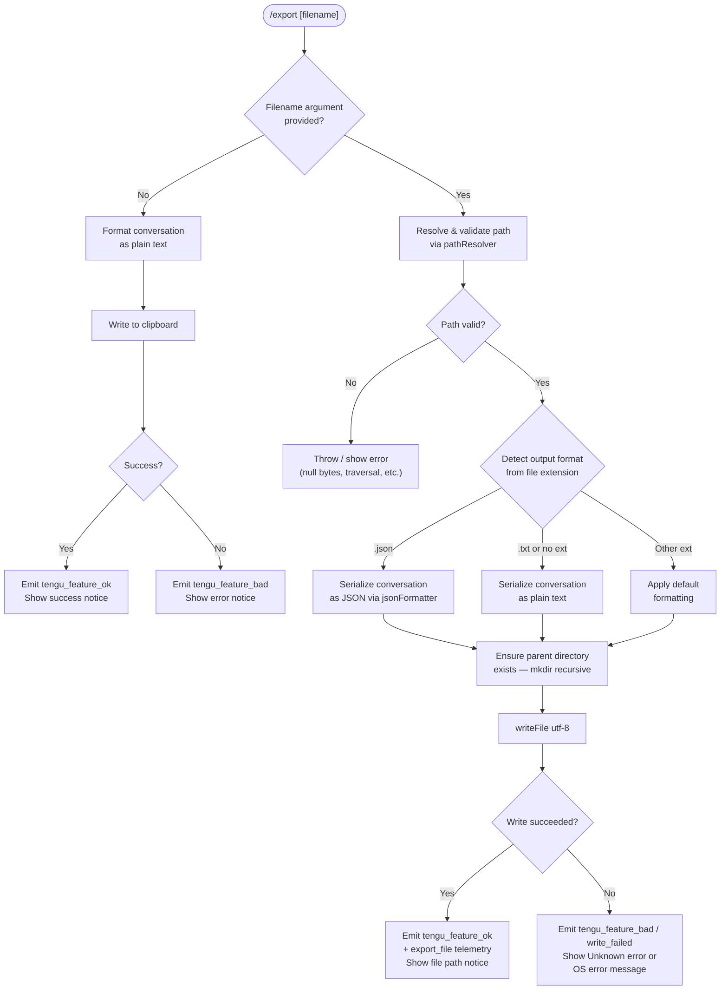

# `/export`

> Analysis basis: CC v2.1.169 bundle.js (AST extraction + Claude interpretation)
> Minimum version: v2.1.169

---

## Overview

The `/export` slash command serializes the current conversation session to either a file on disk or the system clipboard. It accepts an optional filename argument; when a filename is provided the conversation content is written to that path, and when omitted the content is placed on the clipboard. The command supports multiple output formats (plain text and JSON at minimum) determined by the file extension or a default selection.

---

## Registration

| Field | Value |
|---|---|
| type | `local-jsx` |
| name | `export` |
| description | Export the current conversation to a file or clipboard |
| argumentHint | `[filename]` |
| module_id | `V5K` |
| load_inline | `true` |
| loc_byte | `12821985` |
| loc_byte_end | `12822181` |
| loc_line | `9133` |
| arbor_handler.name | `zQf` |
| arbor_handler.fqn | `claude-2.1.169::zQf` |
| arbor_handler.kind | `AsyncFunction` |
| arbor_handler.resolution_path | `module_id` |
| arbor_handler.n_hits | `0` |

Analysis basis: CC v2.1.169 bundle.js:+12821985

---

## Input Branching

The command has 4+ distinct paths depending on whether a filename argument is given, what extension it carries, and whether the write succeeds or fails. A Mermaid flowchart is used.



Analysis basis: CC v2.1.169 bundle.js:+12821417 (handler entry `zQf`), +12821457 (file-write path `Lp8`), +12821466 (clipboard path `SH`), +12821529 (error path `bH`)

---

## Behavioral Spec

### 1. Handler Entry — `exportCommandHandler` (`zQf`)

The Arbor-resolved async handler `zQf` is the true entry point (resolution path: `module_id` → `V5K`).

```
async function exportCommandHandler(commandInput, appContext):
    rawContent = buildConversationText(commandInput)   // OQf / fp8
    trimmedArg  = rawContent.trim()                    // bundle.js:+12821426

    if trimmedArg is non-empty:
        resolvedPath = resolveAndValidatePath(trimmedArg)  // Lp8 / qQf / k1
        writeConversationToFile(resolvedPath, formattedContent)
    else:
        writeConversationToClipboard(formattedContent)     // SH

    if success:
        emitFeatureOk()      // tengu_feature_ok
    else:
        emitFeatureBad()     // tengu_feature_bad / write_failed
```

Analysis basis: CC v2.1.169 bundle.js:+12821417

---

### 2. Conversation Serialization — `buildConversationText` (`OQf` / `fp8` / `MQf`)

Iterates the internal message list and converts each entry to a string. Role labels (`"user"` / `"assistant"`) are prepended per turn. ANSI escape codes are stripped via `ansiStripper` (`x4` → `Bun.stripANSI`). Only text-typed content blocks are included; non-text blocks are skipped or summarized. The resulting strings are joined and returned.

```
function buildConversationText(messages):
    lines = []
    for message in messages:
        if message.role == "user":
            prefix = "user"            // bundle.js:+12820920
        else:
            prefix = "assistant"       // bundle.js:+12819544
        for block in message.content:
            if block.type == "text":   // bundle.js:+12821077
                cleaned = stripANSI(block.text)
                lines.push(prefix + ": " + cleaned)
    return lines.join("\n")
```

Message truncation: up to 50 messages are considered (limit 50, constant at bundle.js:+12821138); a substring of length 49 chars may be taken for previews (bundle.js:+12821157).

Analysis basis: CC v2.1.169 bundle.js:+12821361 (`fp8`), +12820389 (`MQf`), +12820414 (`x4`)

---

### 3. Format Detection — `detectOutputFormat` (`qQf`)

Uses the `path.extname` API (`Kp8.extname`) to read the file extension from the resolved path. When the extension matches `".json"`, the conversation is serialized via `jsonFormatter` (`CH` → `JSON.stringify`). When the extension is `".txt"` or absent, plain text is used. The string `"export"` and `"prompt"` literals (bundle.js:+12820093, +12820109) indicate format-type constants used internally during format selection.

```
function detectOutputFormat(resolvedPath):
    ext = path.extname(resolvedPath).toLowerCase()
    if ext == ".json":
        return jsonSerialize(conversation)   // JSON.stringify path
    else:
        return plainTextSerialize(conversation)
```

Analysis basis: CC v2.1.169 bundle.js:+12816801 (`qQf`), +12816841 (`k1`), +187585 (`CH` / `JSON.stringify`)

---

### 4. Path Resolution and Validation — `resolveAndValidatePath` (`k1`)

This is a multi-step path sanitizer used before any file write.

```
function resolveAndValidatePath(rawPath):
    if rawPath contains null bytes:
        throw Error("Path contains null bytes")   // bundle.js:+1056733

    normalized = path.normalize(rawPath)           // NFC normalization, bundle.js:+180058

    if normalized starts with "~/":                // bundle.js:+1056861
        normalized = os.homedir() + normalized.slice(1)

    if platform == "windows":                      // bundle.js:+1056930
        apply Windows-specific path handling

    if path.isAbsolute(normalized):
        return path.resolve(normalized)
    else:
        return path.resolve(cwd, normalized)
```

Validation errors surface to the user as inline error notices. The `TypeError` and `Error` constructors are called directly for invalid inputs (bundle.js:+1056526, +1056727).

Analysis basis: CC v2.1.169 bundle.js:+1056480 (`k1`), +1056733, +180046 (`SO`)

---

### 5. File Write — `writeConversationToFile` (`Lp8`)

```
async function writeConversationToFile(resolvedPath, content):
    parentDir = path.dirname(resolvedPath)          // bundle.js:+12816907
    await fs.mkdir(parentDir, { recursive: true })  // bundle.js:+12816897
    await fs.writeFile(resolvedPath, content, "utf-8")  // bundle.js:+12816944
    // encoding constant "utf-8" at bundle.js:+12816972
```

After the write, `export_file` telemetry is emitted (bundle.js:+12821469). On failure, `write_failed` is reported (bundle.js:+12821546) and an `"Unknown error"` fallback string is displayed if no OS error message is available (bundle.js:+12821627).

Analysis basis: CC v2.1.169 bundle.js:+12816877 (`Lp8`), +12821469, +12821546

---

### 6. Clipboard Write — `writeConversationToClipboard` (`SH`)

When no filename argument is supplied, the serialized conversation text is written to the system clipboard using the internal clipboard utility (`K6` → `c76`). Success and failure are signalled via `tengu_feature_ok` and `tengu_feature_bad` respectively.

```
function writeConversationToClipboard(content):
    try:
        clipboardWrite(content)     // K6 / c76
        emitTelemetry("tengu_feature_ok")
        showNotice("Copied to clipboard")
    catch error:
        emitTelemetry("tengu_feature_sad")  // bundle.js:+1014069
        showError(error.message)
```

Analysis basis: CC v2.1.169 bundle.js:+12821466 (`SH`), +1013924, +1013959

---

### 7. Timestamp Generation — `generateTimestamp` (`$Qf`)

When generating a default export filename (no argument provided but a file target is internally constructed), a timestamp is formatted from the current `Date` object using year, month, day, hours, minutes, and seconds components — each padded to fixed width via `String()` coercion.

```
function generateTimestamp(date):
    year    = String(date.getFullYear())   // bundle.js:+12820625
    month   = pad(date.getMonth() + 1)     // bundle.js:+12820650
    day     = pad(date.getDate())          // bundle.js:+12820691
    hours   = pad(date.getHours())         // bundle.js:+12820729
    minutes = pad(date.getMinutes())       // bundle.js:+12820768
    seconds = pad(date.getSeconds())       // bundle.js:+12820809
    return year + month + day + "_" + hours + minutes + seconds
```

Analysis basis: CC v2.1.169 bundle.js:+12821682 (`$Qf`)

---

### 8. Atomic File Write Helper — `atomicFileWriter` (`StK` / `htK` / `Vo8`)

For file writes that may race with other processes, an atomic rename strategy is employed:

```
async function atomicFileWriter(targetPath, content):
    tmpPath = targetPath + ".tmp"          // extension ".txt" noted at bundle.js:+207832
    byteLen = Buffer.byteLength(content)   // bundle.js:+208611
    await fs.mkdir(parentDir, recursive)   // htK: bundle.js:+208157
    await fs.appendFile(tmpPath, content)  // bundle.js:+208216
    stat = await fs.stat(tmpPath)          // Vo8: bundle.js:+207728
    if stat ok:
        await fs.rename(tmpPath, targetPath) // bundle.js:+207884
    else:
        await fs.unlink(tmpPath)             // bundle.js:+207924
```

A cleanup hook is registered via `Z9` → `ZGA.register` (bundle.js:+62328) to handle abrupt termination. The `"EISDIR"` error code (bundle.js:+178013) is caught and handled distinctly when the target path is a directory.

Analysis basis: CC v2.1.169 bundle.js:+208403 (`StK`), +208157 (`htK`), +207728 (`Vo8`)

---

## State & Side Effects

| Item | Detail |
|---|---|
| Telemetry — `tengu_feature_ok` | Emitted on successful clipboard or file write (bundle.js:+1013926) |
| Telemetry — `tengu_feature_bad` | Emitted on write failure / clipboard error (bundle.js:+1013988) |
| Telemetry — `tengu_feature_sad` | Emitted on clipboard-specific error path (bundle.js:+1014069) |
| Telemetry — `export_file` | Emitted with file path metadata after a successful file write (bundle.js:+12821469) |
| Telemetry — `write_failed` | Emitted when the file write operation throws (bundle.js:+12821546) |
| Hook registration | Cleanup/abort hook registered via `ZGA.register` to remove temp files on process exit (bundle.js:+62328) |
| File system | Parent directories created recursively (`fs.mkdir recursive`); file written atomically via temp-rename pattern |
| Clipboard | System clipboard modified when no filename argument is given |
| appState changes | No direct appState mutation observed in depth-2 traversal; UI notice rendered as JSX via `P9H.createElement` path (bundle.js:+8266786) |
| Sound | <!-- TODO: not found in depth-2 traversal; needs --depth 4 --> |
| Encoding | All file writes use UTF-8 (bundle.js:+12816972) |
| Buffer size tracking | `Buffer.byteLength` called on content before and after write for size accounting (bundle.js:+208611, +208309) |

---

## Version History

| Version | Change |
|---|---|
| v2.1.169 | Initial analysis |

---

## Common Mistakes

1. **Omitting the file extension** — without a `.json` or `.txt` extension, the command falls through to a default format that may not match the user's expectations. Explicitly specifying `.json` or `.txt` gives predictable output.
2. **Providing a directory path as the filename** — the path validator will encounter `EISDIR` and the write will fail. Always provide a full file path including filename.
3. **Using a path with null bytes** — the path sanitizer (`k1`) rejects such paths immediately with an error. Null bytes cannot appear in export paths.
4. **Assuming clipboard is always available** — in headless or remote environments the clipboard write (`K6` / `c76`) may fail silently or with a `tengu_feature_sad` event. Prefer an explicit filename argument in CI or non-interactive contexts.
5. **Expecting all message types to be exported** — only `"text"`-typed content blocks are included in the serialization. Tool use results, images, and other non-text blocks may be omitted or summarized.
6. **Relative paths resolving unexpectedly** — relative paths are resolved against the current working directory at the time of command execution, not against any project root or git root. Use absolute paths or `~/` prefixed paths for predictability.

---

## Appendix — Identifier Mapping

> For bundle debugging only. Identifiers change across versions.

| Identifier | Role |
|---|---|
| `zQf` | Main async export command handler (Arbor-resolved, `fqn: claude-2.1.169::zQf`) |
| `OQf` | Intermediate serialization dispatcher called from handler |
| `fp8` | Conversation-to-text builder; assembles lines from message list |
| `MQf` | Inner message formatter; handles per-message role labeling |
| `LQf` | Auxiliary formatting helper called from inner formatter |
| `fQf` | Array type-check helper for content block validation |
| `Lp8` | Async file write orchestrator (mkdir + writeFile) |
| `qQf` | Output format detector using `path.extname` |
| `k1` | Path resolution and sanitization utility |
| `$Qf` | Timestamp string generator from `Date` components |
| `E5K` | Message list accessor / slicer with trim logic |
| `Z5K` | Format normalizer using `toLowerCase` |
| `StK` | Atomic file write coordinator |
| `htK` | Atomic write worker (mkdir + appendFile + rename) |
| `Vo8` | File stat checker used in atomic rename flow |
| `MZA` | Path join helper used during atomic write |
| `n56` | EISDIR error handler for directory-target writes |
| `_4H` | Write completion handler; joins output segments |
| `TBH` | Buffered / debounced output writer with timeout management |
| `Z9` | Process-exit cleanup hook registrar |
| `SH` | Clipboard write path (success route) |
| `bH` | Clipboard write path (error / failure route) |
| `CH` | JSON serializer wrapper around `JSON.stringify` |
| `R4` | Filename construction / manipulation utility |
| `qZA` | Message mapping helper used in filename building |
| `rBH` | File write dispatcher delegating to `lEA` |
| `lEA` | Low-level write invoker |
| `N` | Core export orchestrator coordinating format and destination |
| `ItK` | Internal content preparation step |
| `vGA` | Sub-step calling clipboard or OS hooks |
| `yoK` | Clipboard integration utility (called from `vGA`) |
| `hoK` | Clipboard integration utility (called from `vGA`) |
| `x4` | ANSI escape-code stripper (`Bun.stripANSI`) |
| `O` | Session state reader used in message context |
| `mL` | Message lookup helper |
| `q9` | String index/slice helper for message extraction |
| `Dg` | Plan-mode / agent context resolver |
| `U86` | Event listener and JSX element creator for UI notices |
| `w2_` | Argument string splitter and trimmer |
| `u6H` | Feature-flag / capability check |
| `n3` | String replacement utility |
| `M9` | Model name / provider resolution entry |
| `Cc` | Model selection dispatcher |
| `CC` | Model name parser and normalizer |
| `c9` | Model identifier canonicalizer |
| `u2` | Model alias resolver |
| `TLH` | Provider list inclusion checker |
| `Mk` | Model family matcher (opusplan / sonnet paths) |
| `QcH` | Model family matcher (haiku path) |
| `AE` | First-party model resolver |
| `dG1` | Model delegation helper |
| `zM` | AWS / anthropicAws model resolver |
| `__8` | Model list inclusion check |
| `dcH` | Model-specific feature flag accessor |
| `eD` | Compound model resolution entry point |
| `hG` | Full model context assembler |
| `o6` | Feature telemetry emitter (wraps `d` / `K6`) |
| `d` | Core telemetry dispatch (ok path, `tengu_feature_ok`) |
| `K6` | Telemetry dispatch with event routing |
| `c76` | Low-level telemetry event sender |
| `SO` | Path NFC normalizer |
| `C6` | Filesystem utility initializer |
| `P$` | App context or session state accessor |
| `$h` | Internal helper called during format dispatch |
| `sBH` | Side-effect helper in content preparation |
| `RI` | Shared resource / reader utility |
| `fZA` | Content extraction helper |
| `_M6` | Segment builder in write completion handler |
| `A_` | Output segment accumulator |
| `I6` | Path join utility (alias for `P6H.join`) |
| `l6` | File system abstraction accessor |
| `$ZA` | Post-write notification helper |
| `Qg6` | Promise chain entry for write confirmation |

---

Note: index built via Arbor fallback; some signals (telemetry, literals) may be missing — see arbor-fallback.js.