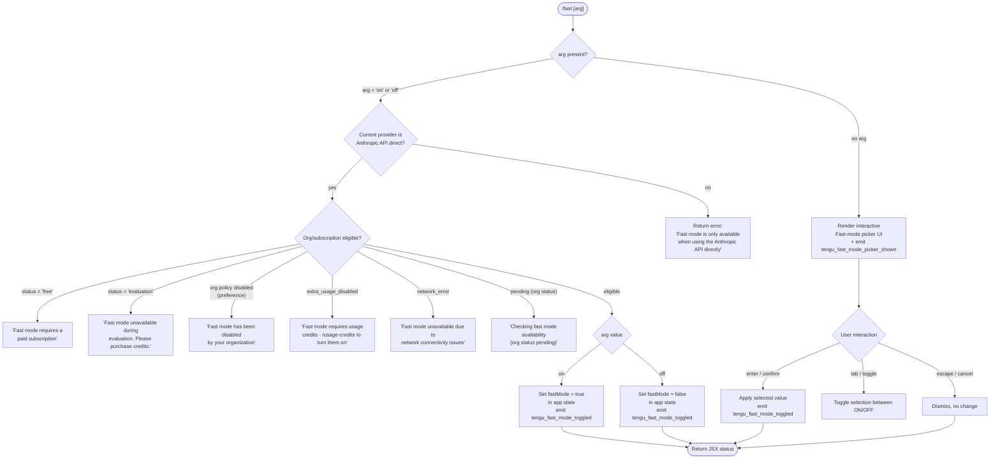

# `/fast`

> Analysis basis: CC v2.1.169 bundle.js (AST extraction + Claude interpretation)
> Minimum version: v2.1.169

---

## Overview

The `/fast` command toggles **Fast mode** (a research-preview inference capability) on or off in the active Claude Code session. It accepts an optional `on` or `off` argument; when no argument is given the command renders an interactive picker UI that shows current mode status, quota information, and a confirmation dialog. The command validates eligibility against the current API provider and subscription tier before applying any state change.

---

## Registration

| Field | Value |
|---|---|
| type | `local-jsx` |
| name | `fast` |
| description | `Toggle fast mode ( ... )` |
| argumentHint | `[on\|off]` |
| thinClientDispatch | `control-request` |
| immediate | `null` |
| isHidden | `null` |
| module_id | `mKK` |
| load_inline | `true` |
| loc_byte | `12579789` |
| loc_byte_end | `12580061` |
| arbor_handler.name | `RUf` |
| arbor_handler.fqn | `claude-2.1.169::RUf` |
| arbor_handler.kind | `AsyncFunction` |
| arbor_handler.resolution_path | `module_id` |
| arbor_handler.n_hits | `3` |

Analysis basis: CC v2.1.169 bundle.js:+12579789

---

## Input Branching

The command has five or more distinct runtime paths depending on argument value, API provider, subscription status, and org policy. A Mermaid flowchart is used.



Analysis basis: CC v2.1.169 bundle.js:+12578824, +12578836, +12578838, +12578886, +12578958, +12579047

---

## Behavioral Spec

### Handler Entry Point (`RUf`)

The top-level async handler (resolved via `module_id → mKK`, Arbor name `RUf`) is invoked with the raw argument string and current application state.

```
async function fastCommandHandler(args, appState):
    prefetchFastModeStatus()          // side-effect: warms availability cache
    parsedArg = normalizeArgument(args)   // "on"/"off"/null

    if parsedArg is null:
        emitTelemetry("tengu_fast_mode_picker_shown")
        return renderPickerUI(appState)

    eligibilityResult = checkFastModeEligibility(appState)
    if eligibilityResult.blocked:
        return renderErrorMessage(eligibilityResult.reason)

    applyFastModeToggle(parsedArg === "on", appState)
    emitTelemetry("tengu_fast_mode_toggled")
    return renderStatusJSX(appState)
```

Analysis basis: CC v2.1.169 bundle.js:+12578824

---

### Eligibility Check (`Z8H`)

Before any toggle is applied, the handler validates several conditions in sequence. The gate function (`Z8H`) inspects the current provider and org subscription state.

```
function checkFastModeEligibility(appState):
    provider = getActiveProvider(appState)

    // Provider gate — only direct Anthropic API is allowed
    if provider not in ["anthropic-api", "oauth", "api-key"]:
        if provider == "agent-sdk":
            return blocked("Fast mode unavailable: Fast mode is not available in the Agent SDK")
        return blocked("Fast mode is only available when using the Anthropic API directly")

    // Check org/subscription status (calls into fast-mode availability fetch)
    status = getFastModeOrgStatus(appState)

    switch status:
        case "free":
            return blocked("Fast mode requires a paid subscription")
        case "evaluation":
            return blocked("Fast mode unavailable during evaluation. Please purchase credits.")
        case "preference" (org disabled):
            return blocked("Fast mode has been disabled by your organization")
        case "extra_usage_disabled":
            return blocked("Fast mode requires usage credits · /usage-credits to turn them on")
        case "network_error":
            return blocked("Fast mode unavailable due to network connectivity issues")
        case "pending":
            return blocked("Checking fast mode availability (org status pending)")
        default:
            return eligible
```

Analysis basis: CC v2.1.169 bundle.js:+12578838, +2237216, +2237284, +2237481, +2237551, +2237643, +2236735, +2236776, +2236867, +2236951, +2237048, +2237806

---

### Availability Prefetch (`FcH`)

A prefetch sub-routine runs eagerly when the handler is invoked to warm the availability cache used by the eligibility check. It is skipped if a fetch completed recently.

```
async function prefetchFastModeAvailability(appState):
    if recentlyFetched():
        log("Skipping fast mode prefetch, fetched recently")
        return

    if inFlightPromise exists:
        log("Fast mode prefetch in progress, returning in-flight promise")
        return inFlightPromise

    auth = getActiveAuth(appState)
    if auth is null:
        log("No auth available")
        emitTelemetry("tengu_org_penguin_mode_fetch_failed")
        return

    try:
        result = await fetchFastModeStatus(auth)
        cacheResult(result)
    catch error:
        if isAxiosError(error) and status in [401, 403]:
            handleOAuthError(error)
        else:
            emitTelemetry("tengu_org_penguin_mode_fetch_failed")
            cacheResult({status: "network_error"})
```

Analysis basis: CC v2.1.169 bundle.js:+12578886, +2240991, +2241238, +2241414, +2241507

---

### Interactive Picker UI (`ym8` / `hm8`)

When no explicit argument is given, the command renders a React JSX picker component. The picker displays Fast mode status, quota/rate-limit information, and an interactive confirmation widget.

```
function renderFastModePicker(appState):
    fastModeState = readFastModeFromAppState(appState)
    // fastModeState.status in: "active", "cooldown", "overloaded", "pending", ...

    display:
        title: " Fast mode (research preview)"
        currentValue: "ON " | "OFF"

        if status == "overloaded":
            show warning: "Fast mode overloaded and is temporarily unavailable"

        if rateLimitHit:
            show: "You've hit your fast limit · resets in <countdown>"
            // countdown uses v9 time formatter with constants:
            //   86400000 ms/day, 3600000 ms/hour, 60 s/min

        show link: "https://code.claude.com/docs/en/fast-mode"

    keyBindings:
        "escape" / "cancel"      → dismiss picker, keep current state
        "tab"    / "toggle"      → cycle selection ON↔OFF
        "enter"  / "confirm"     → apply selected value

    onConfirm(selectedValue):
        if selectedValue == currentValue:
            log("Kept Fast mode OFF")   // no-op branch
        else:
            applyFastModeToggle(selectedValue, appState)
            emitTelemetry("tengu_fast_mode_toggled")
```

Analysis basis: CC v2.1.169 bundle.js:+12578958, +12577085, +12577792, +12577861, +12577867, +12578033, +12578087, +12578116, +12578307, +12576480, +12577278, +12577294, +12577357, +12577370, +12577408, +12577423

---

### Fast Mode State Application (`km8` / flag-settings path)

Toggling is applied through a flag-settings subsystem that also handles related options such as `autoCompactWindow`, `briefTranscript`, and `isBriefOnly`.

```
function applyFastModeToggle(enabled: boolean, appState):
    flagKey = "fastMode"
    applyFlagSettings(flagKey, enabled, appState)
    // applyFlagSettings also propagates sibling flags:
    //   cacheBreakerPhrase, autoCompactWindow, briefTranscript,
    //   isBriefOnly, model

    // Cooldown logic: if previously in cooldown and timer expired:
    if enabled and cooldownExpired(appState):
        log("Fast mode cooldown expired, re-enabling fast mode")
        clearCooldown(appState)

    updateAppState({fastMode: enabled})
```

Analysis basis: CC v2.1.169 bundle.js:+12574859, +12574489, +12574005, +12574146, +12574283, +12574394, +12574572, +2238428, +2238481

---

### Provider Guard — Bedrock/Vertex/Agent SDK Blocking

Fast mode is unavailable on any non-direct-Anthropic provider. The literal strings present in the bundle enumerate the known non-eligible providers.

```
INELIGIBLE_PROVIDERS = [
    "bedrock", "foundry", "anthropicAws",
    "mantle", "vertex", "firstParty", "gateway"
]

function isDirectAnthropicAPI(provider):
    return provider not in INELIGIBLE_PROVIDERS
```

Blocked providers receive the message: `"Fast mode is only available when using the Anthropic API directly"` (bundle.js:+2237216).

Additionally, the Agent SDK path produces its own specific message: `"Fast mode is not available in the Agent SDK"` (bundle.js:+2237551).

Analysis basis: CC v2.1.169 bundle.js:+2105194, +2105244, +2105300, +2105354, +2105402, +2237481

---

### Cooldown / Rate-limit Display

When the user has exhausted their Fast mode quota, the picker shows a countdown timer derived from a reset timestamp in the appState. The `v9` formatter divides elapsed milliseconds by day/hour/minute constants.

```
function formatResetCountdown(resetTimestampMs):
    remaining = resetTimestampMs - Date.now()
    if remaining <= 0: return "0s"
    days    = floor(remaining / 86400000)
    hours   = floor((remaining % 86400000) / 3600000)
    minutes = floor((remaining % 3600000) / 60000)
    seconds = floor((remaining % 60000) / 1000)
    return buildHumanString(days, hours, minutes, seconds)
```

Analysis basis: CC v2.1.169 bundle.js:+12578087, +12578116, +213803, +213837, +213910

---

## State & Side Effects

| Item | Detail |
|---|---|
| Telemetry | `tengu_fast_mode_toggled` (on every confirmed toggle); `tengu_fast_mode_picker_shown` (when picker is displayed without explicit arg); `tengu_org_penguin_mode_fetch_failed` (on prefetch network failure); `tengu_penguins_off` (when fast mode availability returns disabled); `tengu_feature_ok` / `tengu_feature_bad` / `tengu_feature_sad` (feature gate events in eligibility check) |
| appState changes | `fastMode` boolean flag updated; sibling flags (`autoCompactWindow`, `briefTranscript`, `isBriefOnly`, `cacheBreakerPhrase`, `model`) may be updated via `apply_flag_settings` path |
| Fast-mode availability cache | Prefetch result is cached; subsequent eligibility checks are served from cache. Network errors write `{status: "network_error"}` to cache. |
| Cooldown state | If a `cooldown` entry exists in app state and its timer has expired, it is cleared on toggle-on |
| Sound | None observed in depth-2 traversal |
| Hook registration | `Z9` calls `ZGA.register` (hook registration utility) during the settings-write sub-path (bundle.js:+62328) |
| Auth dependency | Requires valid OAuth or API key auth; absence causes prefetch to abort with `"No auth available"` |

---

## Version History

| Version | Change |
|---|---|
| v2.1.169 | Initial analysis |

---

## Common Mistakes

1. **Using `/fast` on a non-Anthropic provider** (Bedrock, Vertex, etc.) — the command will immediately return an error. Fast mode is only available when Claude Code is connected directly to the Anthropic API.
2. **Expecting `/fast` to work on a free-tier account** — a paid subscription is required. The command blocks with `"Fast mode requires a paid subscription"`.
3. **Omitting the `on`/`off` argument expecting a silent toggle** — without an argument the command opens an interactive picker UI; non-interactive scripts should pass an explicit `on` or `off` argument.
4. **Assuming instant availability after payment** — if the org status is `"pending"`, the command enters a checking state and does not enable Fast mode until the org status resolves.
5. **Ignoring the cooldown state** — after hitting the Fast mode rate limit the picker displays a reset countdown. Attempting to re-enable before the cooldown expires will show the limit message, not activate Fast mode.
6. **Running in Agent SDK context** — Fast mode is explicitly blocked in the Agent SDK and returns a distinct error message separate from the general provider block.

---

## Appendix — Identifier Mapping

> For bundle debugging only. Identifiers change across versions.

| Identifier | Role |
|---|---|
| `RUf` | Top-level async handler for `/fast` command (Arbor-resolved entry point) |
| `Z8H` | Fast-mode eligibility checker / provider-gate function |
| `FcH` | Fast-mode availability prefetch orchestrator |
| `ym8` | Interactive picker JSX renderer (outer) |
| `hm8` | Interactive picker JSX renderer (inner / stateful component) |
| `km8` | Flag-settings application helper |
| `YTH` | Flag-settings type coercion (String/Number/Boolean) |
| `BcH` | Token/highlight sub-component used in picker |
| `mO_` | App state mutation emitter (emits `SG1` event on fast mode change) |
| `FDH` | Flag-settings dispatcher |
| `zTH` | Theme/prompt-border context reader for picker UI |
| `d4` | Legacy-global-config migration helper |
| `A4` | Argument parsing / string normalisation utility |
| `YA` | Provider-type normalisation utility |
| `_6` | Low-level string utility |
| `N` | Logging / debug output writer |
| `H` | HTTP bootstrap / fetch wrapper |
| `ItK` | Request-body builder for API calls |
| `vGA` | Token-classification helper |
| `CH` | `JSON.stringify` wrapper |
| `R4` | Redaction utility (replaces sensitive values with `[REDACTED]`) |
| `rBH` | Log-file write helper |
| `lEA` | Low-level write-to-handle utility |
| `StK` | Settings-file write orchestrator |
| `TBH` | Debounce / batched-write scheduler |
| `_4H` | Config-path construction helper |
| `n56` | EISDIR error handler for file ops |
| `MZA` | Path-join for config files |
| `Vo8` | File rename-with-backup utility |
| `htK` | Async append-file writer |
| `Z9` | Hook-registration caller (`ZGA.register`) |
| `w2_` | Query-string / URL parser |
| `u6H` | Feature-flag set membership check |
| `n3` | String replacement helper |
| `M9` | Model-string parser entry point |
| `Cc` | Model-category resolver |
| `CC` | Model-family classifier |
| `c9` | Model-alias normaliser |
| `u2` | Locale-aware string utility |
| `TLH` | Model-allowlist checker |
| `Mk` | Model-tier matcher (opusplan / sonnet / haiku / opus) |
| `QcH` | Fast-model tier matcher |
| `AE` | Model shortname resolver |
| `dG1` | Model alias expander |
| `zM` | Model canonical-name builder |
| `__8` | Allowlist membership tester |
| `dcH` | String-to-identifier converter |
| `eD` | Model-descriptor builder |
| `hG` | Model-object constructor |
| `o6` | Feature detection helper |
| `d` | Core utility / formatting helper |
| `K6` | Platform-specific capability resolver |
| `c76` | Base constants object |
| `D6` | Growthbook / experiment-flag evaluation |
| `tu` | Experiment runner |
| `su` | Growthbook SDK wrapper |
| `VL8` | Experiment deduplication guard |
| `$G_` | Growthbook event emitter |
| `JG_` | Experiment assignment tracker |
| `y6` | Config file loader (reads from disk) |
| `y7H` | Config file reader with backup/rotation |
| `jhL` | File-watch subscription manager |
| `y8` | Settings loader orchestrator |
| `Ho6` | Settings cache lookup |
| `o0A` | Settings cache get/has wrapper |
| `W9_` | Policy-settings reader |
| `a0A` | Settings cache setter |
| `YB` | Settings merger / layered-config builder |
| `G_` | Environment variable reader |
| `Oz6` | WSL detection helper |
| `F_` | Client identifier (checks `claude-vscode`) |
| `wBH` | Client-type classifier |
| `tx` | Session type reader |
| `t88` | Workspace-root resolver |
| `k5L` | Additional context loader |
| `UO_` | Auth+workspace context builder |
| `kq` | Traffic-category classifier (`essential-traffic`, `no-telemetry`, `default`) |
| `duA` | Traffic-category string resolver |
| `O0` | API request executor |
| `AO` | Anthropic API client constructor |
| `i7` | HTTP request builder |
| `Cv` | Response handler |
| `HX6` | Header builder |
| `LP` | Request-log helper |
| `$D6` | File-descriptor API-key reader |
| `_j` | Profile-based auth resolver |
| `oL` | Provider-type mapper |
| `hC` | Response slicer |
| `HE` | Array/include membership checker |
| `S5L` | Beta-header builder |
| `n1` | Environment-URL resolver |
| `IB` | OAuth-401 recovery orchestrator |
| `QZL` | OAuth token refresh logic |
| `Ca` | Keychain token reader |
| `unH` | Token-freshness checker |
| `bH` | Disk-token reader (file descriptor path) |
| `EB` | File-descriptor reader |
| `V4` | Token introspection |
| `tr` | Refresh-token exchange |
| `bf6` | Token storage writer |
| `hH` | MCP debug logger |
| `gZL` | Token rotation helper |
| `Dg1` | Retry-delay calculator |
| `t$` | Exit-cleanup helper |
| `t_` | Full session initialiser / settings reconciler |
| `V$` | Settings file loader |
| `EYH` | User-settings file path builder |
| `G2` | Project settings reader |
| `uo` | File reader with encoding |
| `k8` | Error-code classifier |
| `E8` | EISDIR / filesystem error handler |
| `y1_` | Timestamp recorder |
| `_vH` | Settings-path resolver |
| `er6` | Config-directory path builder |
| `WO6` | Atomic file writer (symlink-safe) |
| `O` | Background-session sentinel |
| `f` | Stream/fd wrapper |
| `yO` | Cache-clear helper |
| `Or6` | Gitignore-aware file writer |
| `C6` | Git-check-ignore runner |
| `z1_` | Git allow-list resolver |
| `$r6` | Git executable finder |
| `qy4` | Path tilde-expander |
| `yBA` | Gitignore rule writer |
| `hBA` | Gitignore entry formatter |
| `ku` | `.claude` directory path helper |
| `DB` | Settings-load lifecycle logger |
| `bZ` | Load-start marker |
| `t9` | Memory-usage sampler |
| `G9_` | Settings-load completion logger |
| `sB6` | Settings-load metric emitter |
| `X8` | Global config save orchestrator |
| `UL8` | Config-file writer with lock + backup |
| `L` | Pending-write set manager |
| `hT1` | Config object merger |
| `ViH` | Config validation helper |
| `yG_` | Backup-directory path builder |
| `V` | Config version checker |
| `P` | Stream protocol parser |
| `E` | Range math utility |
| `OJH` | Config-lock acquisition helper |
| `Ie1` | Config-entries iterator |
| `MP6` | Lock-contention timer |
| `pL8` | Per-field config writer |
| `K` | Pad/format string helper |
| `ym8` | Picker outer renderer (see above) |
| `km8` | Flag-settings applier (see above) |
| `FDH` | Flag-settings dispatcher (see above) |
| `tj` | Terminal UI layout helper |
| `UL` | `$ZH` layout component wrapper |
| `BcH` | Token display sub-component |
| `x2` | Token-type classifier |
| `YTH` | Flag type coercer |
| `l3` | Model-include checker |
| `zTH` | Theme context reader |
| `Hm` | UI color/theme resolver |
| `uP6` | HCL color parser |
| `C78` | Theme-name validator |
| `qF` | Foreground-color extractor |
| `A89` | Fallback color provider |
| `d4` | Legacy-config migration helper |
| `Tv` | Active-sessions tracker |
| `hA` | Prompt-border color resolver |
| `NJH` | ANSI color-code renderer |
| `Jl` | Ink/Chalk style composer |
| `NB` | Newline / spacer component |
| `i1` | Model-display label builder |
| `N68` | Settings-entries flattener |
| `d_` | Settings loader (calls `DB`) |
| `TP` | Token-model label formatter |
| `Bi8` | Model-badge renderer |
| `RC` | Number formatter (integer / toFixed) |
| `FG1` | Integer-or-decimal formatter |
| `ivH` | Inline-status display builder |
| `hm8` | Picker inner stateful component |
| `j6` | App-state context reader |
| `Ov_` | App-state context validator |
| `JA` | App-state subscriber |
| `mO_` | App-state change emitter |
| `M6` | Base constant (`c76`) accessor |
| `$` | Global daemon status reader |
| `D3K` | Daemon-status file loader |
| `Oa` | Status-string normaliser |
| `vLH` | Status-text trimmer |
| `C9` | AsyncLocalStorage context reader |
| `tx6` | Daemon-status path builder |
| `SA` | MCP connection manager React component |
| `Yw` | MCP context reader |
| `M` | MCP server state map |
| `mSH` | MCP server connection orchestrator |
| `yn` | MCP tool registration helper |
| `VV` | MCP capability negotiator |
| `g8` | Generic identity helper |
| `OZ6` | MCP orphan-slot cleaner |
| `TF9` | MCP tool-call executor |
| `jD8` | MCP response decoder |
| `DD8` | MCP token counter |
| `O8` | MCP debug logger |
| `sw8` | MCP OAuth-flow handler |
| `tw8` | MCP OAuth callback handler |
| `yF9` | MCP connection attempt |
| `uu_` | MCP tool-result builder |
| `J` | Active-process set |
| `EN` | MCP skills telemetry emitter |
| `Vu_` | MCP connection filter |
| `y` | File-watcher registry |
| `u7` | MCP error logger |
| `EH` | String coercion helper |
| `vF9` | MCP numeric-field formatter |
| `DeH` | MCP port parseInt helper |
| `aJ8` | MCP timeout parseInt helper |
| `cd8` | MCP connection-result applicator |
| `uSH` | MCP connection-state updater |
| `UE` | MCP cleanup orchestrator |
| `dXA` | MCP server-map diff/reconciler |
| `mw8` | MCP tool-exclusion checker |
| `a8` | Abort-controller / timeout helper |
| `zeH` | MCP PPH status helper |
| `v9` | Time-duration formatter (ms → human string) |

---

Note: index built via Arbor fallback; some signals (telemetry, literals) may be missing — see arbor-fallback.js.