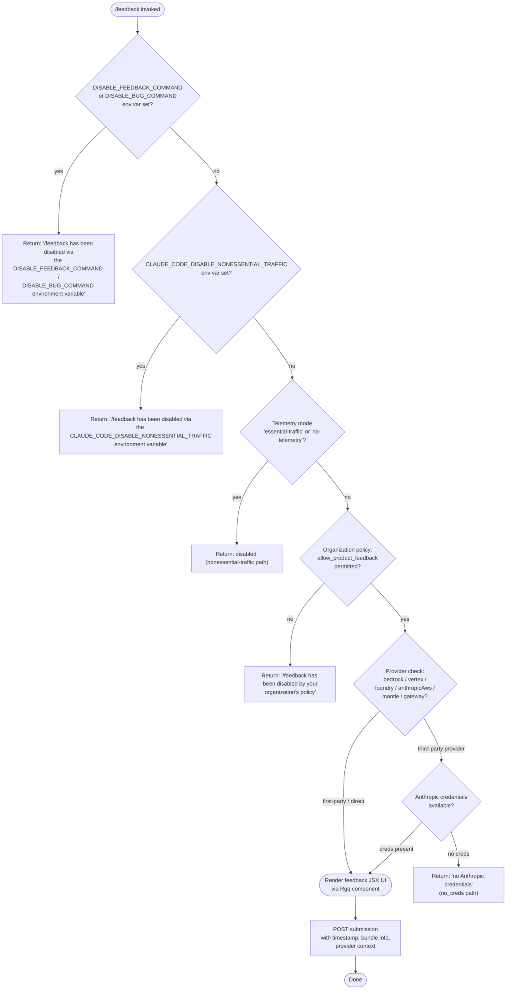

# `/feedback`

> Analysis basis: CC v2.1.169 bundle.js (AST extraction + Claude interpretation)
> Minimum version: v2.1.169

---

## Overview

The `/feedback` command (also accessible as `/share` and `/bug`) provides a user-facing interface for submitting feedback, reporting bugs, or sharing conversation content with Anthropic. Before opening the feedback UI it performs a series of environment, policy, and credential checks and will emit a disabled message if any blocking condition is met. The handler is the async function `tWf`, resolved via the `module_id` path through module `Cgq`.

---

## Registration

| Field | Value |
|---|---|
| type | `local-jsx` |
| name | `feedback` |
| description | `Submit feedback, report a bug, or share your conversation` |
| argumentHint | `[report]` |
| aliases | `share`, `bug` |
| module_id | `Cgq` |
| load_inline | `true` |
| loc_byte | `11109753` |
| loc_byte_end | `11109976` |
| loc_line | `7338` |
| arbor_handler.name | `tWf` |
| arbor_handler.fqn | `claude-2.1.169::tWf` |
| arbor_handler.kind | `AsyncFunction` |
| arbor_handler.resolution_path | `module_id` |
| arbor_handler.n_hits | `0` |

Analysis basis: CC v2.1.169 bundle.js:+11109753

---

## Input Branching

Six or more distinct guard branches precede any UI rendering; a Mermaid flowchart is required.



Analysis basis: CC v2.1.169 bundle.js:+11087628, +11087787, +11087905, +11088069, +11088676

---

## Behavioral Spec

### 1. Top-level async handler (`tWf`)

The Arbor-resolved handler is `tWf` (AsyncFunction, `claude-2.1.169::tWf`). It delegates immediately to the JSX component factory `Rgq` and its companion initialiser `Sgq`.

```
async function feedbackHandler(commandContext):
    timestampMs = Date.now()                  // Sgq records invocation time
    guardResult = runDisableGuards(commandContext)
    if guardResult.disabled:
        return renderDisabledMessage(guardResult.reason)
    providerLabel = resolveProviderLabel(commandContext)
    credCheck    = checkAnthropicCredentials(commandContext)
    if credCheck.noCreds:
        return renderDisabledMessage("no Anthropic credentials")
    return renderFeedbackComponent(timestampMs, providerLabel)
```

Analysis basis: CC v2.1.169 bundle.js:+11109584, +11109123

---

### 2. Environment-variable disable guards (`uuH`)

`uuH` is the guard function that evaluates environment variables and telemetry mode in sequence before any other check.

```
function checkEnvDisableGuards(env, telemetryMode):

    // Guard 1 — explicit feedback disable
    if env.DISABLE_FEEDBACK_COMMAND is set:
        return disabled("/feedback has been disabled via the " +
                        "DISABLE_FEEDBACK_COMMAND environment variable")

    // Guard 2 — explicit bug-command disable
    if env.DISABLE_BUG_COMMAND is set:
        return disabled("/feedback has been disabled via the " +
                        "DISABLE_BUG_COMMAND environment variable")

    // Guard 3 — nonessential traffic kill-switch
    if env.CLAUDE_CODE_DISABLE_NONESSENTIAL_TRAFFIC is set:
        return disabled("/feedback has been disabled via the " +
                        "CLAUDE_CODE_DISABLE_NONESSENTIAL_TRAFFIC " +
                        "environment variable")

    // Guard 4 — telemetry-mode check
    if telemetryMode in ["essential-traffic", "no-telemetry"]:
        return disabled(...)      // nonessential-traffic branch via kq/duA/_6

    return allowed()
```

Telemetry-mode constants `"essential-traffic"` and `"no-telemetry"` are literal strings in the bundle.
Analysis basis: CC v2.1.169 bundle.js:+11087628, +11087646, +11087787, +11087905, +1017999, +1018058

---

### 3. Organization-policy gate (`b9` / `yyH`)

After environment guards pass, the handler checks the organization's policy membership.

```
function checkOrgPolicy(policySet, orgTier):
    // Enterprise and team tiers carry per-org policy sets
    if orgTier in ["enterprise", "team"]:
        if policySet does NOT include "allow_product_feedback":
            return disabled("/feedback has been disabled by " +
                            "your organization's policy")
    return allowed()
```

The `allow_product_feedback` policy string is the discriminating literal.
Analysis basis: CC v2.1.169 bundle.js:+4212133, +11088069, +4211832, +4211867

---

### 4. Provider identification (`uuH` → provider label resolution)

Depending on which provider backend is active, a human-readable label is attached to the feedback submission. The provider map is:

| Internal value | Display label |
|---|---|
| `bedrock` | `Amazon Bedrock` |
| `vertex` | `Vertex AI` |
| `foundry` | `Microsoft Foundry` |
| `anthropicAws` | `Claude Platform on AWS` |
| `mantle` | `Amazon Bedrock (Mantle)` |
| `gateway` | `an API gateway` |
| `firstParty` / direct | *(no provider override)* |

Analysis basis: CC v2.1.169 bundle.js:+11088201, +11088276, +11088347, +11088431, +11088514, +11088599

---

### 5. Credential check for third-party providers (`nB`)

When a third-party provider is in use, Anthropic credentials are required for the feedback endpoint.

```
function checkCredentialsForFeedback(provider, credentialStore):
    if provider is third-party:
        // nB delegates to Hl (OAuth check) and yA (API-key check)
        hasOAuth  = oAuthTokenAvailable(credentialStore)
        hasApiKey = apiKeyAvailable(credentialStore)
        if NOT (hasOAuth OR hasApiKey):
            return { ok: false, reason: "no_creds",
                     message: "no Anthropic credentials" }
    return { ok: true }
```

The literal `"no_creds"` is the telemetry/display token for this path.
Analysis basis: CC v2.1.169 bundle.js:+11088676, +11088693, +3045729, +3045813

---

### 6. JSX feedback component (`Rgq` / `Sgq`)

If all guards pass, the async handler constructs and returns a JSX element.

```
function renderFeedbackComponent(startTimestampMs, providerLabel):
    metadata = {
        bundle:    "bundle",          // literal key
        provider:  providerLabel,
        timestamp: startTimestampMs,
        timeout:   30000,             // ms — hard-coded submission timeout
    }
    element = createElement(FeedbackUI, metadata)
    return element
```

The submission timeout is 30 000 ms (hard-coded literal).
Analysis basis: CC v2.1.169 bundle.js:+11109142, +11109345, +11109366, +11088169, +11088184

---

### 7. Feedback POST dispatch (`N` / `H` bootstrap fetch)

Submission uses a bootstrap fetch path with the following fixed parameters:

```
function submitFeedbackPost(payload, authHeaders):
    headers = {
        "Content-Type": "application/json",
        "User-Agent":   buildUserAgent(),    // includes version "2.1.169"
    }
    response = fetch(feedbackEndpoint, {
        method:  "post",
        headers: headers,
        body:    JSON.stringify(payload),
        timeout: 5000,                       // bootstrap fetch timeout (ms)
    })
    if response fails to parse:
        log("parse_failed", "api_bootstrap_fetch")
    else:
        log("[Bootstrap] Fetch ok")
    return response
```

Bootstrap fetch timeout: 5 000 ms. Submission HTTP method: `"post"`.
Analysis basis: CC v2.1.169 bundle.js:+11088733, +16098041, +16098056, +16098075, +16098157, +16098278, +16098300, +16098330

---

### 8. Telemetry on invocation

```
function onCommandInvoked(eventContext):
    emit("tengu_feature_sad", eventContext)   // feature-use signal
```

Analysis basis: CC v2.1.169 bundle.js:+1014069

---

## State & Side Effects

| Item | Detail |
|---|---|
| Telemetry | `tengu_feature_sad` (bundle.js:+1014069) |
| Disable env vars | `DISABLE_FEEDBACK_COMMAND`, `DISABLE_BUG_COMMAND`, `CLAUDE_CODE_DISABLE_NONESSENTIAL_TRAFFIC` |
| Org-policy check | Reads `allow_product_feedback` from policy set; blocks on enterprise/team tiers when absent |
| Provider label | Resolved from active provider and embedded in submission payload |
| Credential check | OAuth token or API key required when running on a third-party provider |
| Submission timeout | 30 000 ms for the feedback POST (bundle.js:+11109142) |
| Bootstrap fetch timeout | 5 000 ms (bundle.js:+16098157) |
| HTTP method | `POST` (bundle.js:+11088733) |
| JSX rendering | `$qA.createElement` called to construct the feedback UI (bundle.js:+11109366) |
| Timestamp recording | `Date.now()` captured at invocation start via `Sgq` (bundle.js:+11109123) |
| API endpoint domain | `api.anthropic.com` (used in credential/bootstrap context, bundle.js:+2106194) |
| Visibility token | `"public"` literal present in registration scope (bundle.js:+11109559) |

---

## Version History

| Version | Change |
|---|---|
| v2.1.169 | Initial analysis |

---

## Common Mistakes

1. **Invoking `/feedback` in a nonessential-traffic-restricted environment** — if `CLAUDE_CODE_DISABLE_NONESSENTIAL_TRAFFIC` is set or the telemetry mode is `"essential-traffic"` / `"no-telemetry"`, the command is silently disabled; no UI appears.
2. **Expecting feedback to work on third-party providers without Anthropic credentials** — on Bedrock, Vertex, Foundry, Mantle, and gateway backends the command requires a valid OAuth token or API key pointing at Anthropic; missing credentials produce the `no_creds` error.
3. **Forgetting the aliases** — `/bug` and `/share` are fully equivalent entry points; team documentation referencing only `/feedback` may leave users unaware of the shorter aliases.
4. **Assuming org policy is irrelevant on enterprise plans** — `allow_product_feedback` must be explicitly permitted in the policy set; enterprise and team tiers will block feedback submission when this policy is absent.
5. **Confusing the two timeouts** — the bootstrap fetch uses a 5 000 ms timeout while the feedback POST itself uses a 30 000 ms timeout; network diagnostics should distinguish these two layers.

---

## Appendix — Identifier Mapping

> For bundle debugging only. Identifiers change across versions.

| Identifier | Role |
|---|---|
| `tWf` | Top-level async feedback handler (Arbor-resolved entry point) |
| `Rgq` | JSX feedback component factory (renders the feedback UI element) |
| `Sgq` | Invocation-time timestamp recorder (`Date.now()`) |
| `uuH` | Environment-variable and telemetry-mode disable guard |
| `kq` | Telemetry-mode resolver (reads `essential-traffic` / `no-telemetry`) |
| `duA` | Telemetry-mode helper delegating to `_6` |
| `_6` | Low-level string/value utility |
| `b9` | Organization-policy gate evaluator |
| `C$9` | Policy set accessor |
| `yyH` | Policy membership check (calls `Db`, `VW6`, `kfH`) |
| `Db` | Core policy-check dispatcher |
| `YA` | General-purpose value resolver used across multiple checks |
| `$f` | Subsidiary policy helper |
| `AO` | Authentication/credential assembly function |
| `_j` | Auth-token resolution function |
| `G7H` | Policy string formatter |
| `nB` | Credential-availability check for third-party providers |
| `Hl` | OAuth token availability checker |
| `oL` | Token retrieval utility |
| `yA` | API-key availability checker |
| `IY` | Auth credential orchestrator |
| `kC` | Array-based inclusion check utility |
| `O0` | Cloud-gateway credential helper |
| `H` | Bootstrap fetch orchestrator (outer) |
| `N` | Inner bootstrap fetch executor |
| `ItK` | Fetch initialiser |
| `vGA` | Platform/env detection helper |
| `CH` | JSON serialization helper (`JSON.stringify`) |
| `R4` | URL / path manipulation utility |
| `qZA` | URL mapping helper |
| `rBH` | Write/stream helper |
| `lEA` | Low-level write utility |
| `StK` | Logging / transcript append pipeline |
| `TBH` | Debounced flush scheduler |
| `_4H` | Log-path builder |
| `n56` | Filesystem error handler (EISDIR guard) |
| `MZA` | Log-file path resolver |
| `Vo8` | Log-file rotation handler |
| `htK` | Log-file append worker |
| `Z9` | Signal / hook registrar |
| `w2_` | Input string parser / splitter |
| `u6H` | Set-membership gate |
| `n3` | String replacement utility |
| `M9` | Model-name parser |
| `Cc` | Model-name dispatcher |
| `CC` | Model-name normaliser |
| `c9` | Model-alias resolver |
| `u2` | Locale / string helper |
| `TLH` | Model-tier inclusion checker |
| `Mk` | Model-family classifier |
| `QcH` | Model-family sub-classifier |
| `AE` | Model-type resolver |
| `dG1` | Model-type delegator |
| `zM` | Value-normalisation utility |
| `__8` | Inclusion-list guard |
| `dcH` | String formatter delegating to `_6` |
| `eD` | Extended model-descriptor builder |
| `hG` | Model descriptor composer |
| `o6` | Keyboard / event utility |
| `d` | Low-level event primitive |
| `K6` | Event helper (`c76`) |
| `c76` | Base event constant |
| `P$` | Request header builder |
| `w2_` | Query-string parser |
| `$1` | Process-exit / error handler |
| `q` | Data-channel / IPC utility |

---

*Note: index built via Arbor fallback; some signals (telemetry, literals) may be missing — see arbor-fallback.js.*