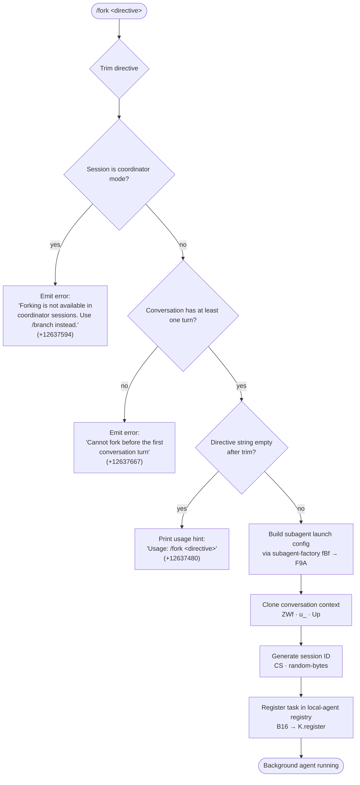

# `/fork`

> Analysis basis: CC v2.1.169 bundle.js (AST extraction + Claude interpretation)
> Minimum version: v2.1.169

---

## Overview

`/fork` spawns a new background subagent that inherits the full conversation history of the current session, then dispatches that agent to pursue a user-supplied directive independently. It performs session-state validation before launch and delegates the heavy-lifting to the `F9A` (subagent-factory) subsystem, which clones the conversation context, generates a stable session ID, and registers the child agent with the task registry.

---

## Registration

| Field | Value |
|---|---|
| type | `local-jsx` |
| name | `fork` |
| description | `Spawn a background agent that inherits the full conversation` |
| argumentHint | `<directive>` |
| module_id | `m4K` |
| load_inline | `true` |
| loc_byte | `12637897` |
| loc_byte_end | `12638100` |
| loc_line | `8991` |
| arbor_handler.name | `fBf` |
| arbor_handler.fqn | `claude-2.1.169::fBf` |
| arbor_handler.kind | `AsyncFunction` |
| arbor_handler.resolution_path | `module_id` |
| arbor_handler.n_hits | `0` |

Analysis basis: CC v2.1.169 bundle.js:+12637897

---

## Input Branching

Four distinct branches are detectable from the handler literals and callGraph, so a flowchart is used.



Analysis basis: CC v2.1.169 bundle.js:+12637456, +12637478, +12637548, +12637589, +12637594, +12637667

---

## Behavioral Spec

### 1 — Handler entry (`fBf`)

```
async function forkCommandHandler(context, rawInput):
    directive = rawInput.trim()                         // +12637456

    if sessionIsCoordinatorMode(context):               // +12637548 (F9A guard)
        displayError("Forking is not available in coordinator sessions…")
        return

    if conversationTurnCount(context) == 0:             // +12637548 (F9A guard)
        displayError("Cannot fork before the first conversation turn")
        return

    if directive == "":
        printUsage("Usage: /fork <directive>")          // +12637480
        return

    launchSubagentWithDirective(context, directive)     // calls F9A
```

Analysis basis: CC v2.1.169 bundle.js:+12637456, +12637480, +12637548

---

### 2 — Subagent factory (`F9A`)

```
async function subagentFactory(context, directive):
    // Validate and emit telemetry
    if promptMissing(directive):
        emit("subagent_fork_prompt_missing")            // +11071889

    // Build conversation clone
    conversationSnapshot = cloneConversationContext(context)  // ZWf
    replContexts = getReplContexts(context)             // +11071978

    // Slice history to last 50 / 49 messages               // +11072123, +11072136
    trimmedHistory = conversationSnapshot.slice(-50)

    // Generate a stable hex session ID (8 random bytes)    // +7142693, +7142705
    sessionId = randomBytes(8).toString("hex")              // CS → +7142677

    // Build subagent options
    options = {
        type: "fork",                                   // +11071938
        mode: "resume",                                 // +11072057
        directive: directive,
        sessionId: sessionId,
        timestamp: Date.now(),                          // +11072180
    }

    // Launch via agent-run loop
    agentRunLoop = buildAgentRunLoop(options)           // bH6

    // Register with local-agent task registry
    registry.register({
        type: "local_agent",                            // +10276609
        status: "running",                              // +10276654
        kind: "general-purpose",                        // +10276728
    })                                                  // B16 → K.register +10276920

    return agentHandle
```

Analysis basis: CC v2.1.169 bundle.js:+11071732, +11071744, +11071851, +11072073, +11072105, +11072153, +11072180, +11072193

---

### 3 — Conversation-context cloner (`ZWf`)

```
function cloneConversationContext(context):
    appState = context.getAppState()                    // +11073422
    messages = Array.from(appState.messages)            // +11073522

    // Inherit subagent options from parent session
    subagentOptions = buildSubagentOptions(appState)    // u_ +11073533

    // Collect system-prompt sections
    systemPrompt = context.getSystemPrompt()            // Up +9751001

    // Resolve full prompt via prompt-assembly pipeline
    fullPrompt = assembleSystemPrompt(subagentOptions)  // oE +11073584

    return { messages, systemPrompt: fullPrompt, subagentOptions }
```

Analysis basis: CC v2.1.169 bundle.js:+11073422, +11073522, +11073533, +11073584, +11073637

---

### 4 — Subagent options builder (`u_`)

```
function buildSubagentOptions(appState):
    lastMessage = appState.messages.findLast(isAssistantMessage)  // +10581142
    opts = {
        working_directory: appState.workingDirectory,   // +10581167
        allowed_tools:     appState.allowedTools,       // +10581222
        disallowed_tools:  appState.disallowedTools,    // +10581277
        avoid_prompts:     appState.avoidPrompts,       // +10581338
        permission_mode:   appState.permissionMode,     // +10581440
        bypassPermissions: appState.bypassPermissions,  // +10581471
        session:           appState.session,            // +10581770
        effort:            appState.effort,             // +10581795
        model:             appState.model,              // +10581808
        max_thinking_tokens: appState.maxThinkingTokens,// +10581820
        flag_settings:     appState.flagSettings,       // +10581846
    }
    return opts
```

Analysis basis: CC v2.1.169 bundle.js:+10581062, +10581167, +10581222, +10581277, +10581338, +10581440, +10581471, +10581770, +10581795, +10581808, +10581820, +10581846

---

### 5 — Agent run-loop entry (`bH6`)

The agent run-loop is the largest subsystem reachable at depth 2. Key behavioral constants:

- Default run timeout: **600 000 ms** (10 min) Analysis basis: CC v2.1.169 bundle.js:+7259569
- Stall watchdog interval: **10 s** Analysis basis: CC v2.1.169 bundle.js:+7259564
- Emits `watchdog_stall` telemetry on stall Analysis basis: CC v2.1.169 bundle.js:+7260055
- Emits `subagent_complete` on clean exit Analysis basis: CC v2.1.169 bundle.js:+7260697
- Emits `subagent_stall_timeout` on timeout Analysis basis: CC v2.1.169 bundle.js:+7260717
- Tool-classifier output width cap: **80 chars** Analysis basis: CC v2.1.169 bundle.js:+7263109
- Query progress ratio step: **0.1** Analysis basis: CC v2.1.169 bundle.js:+7260899

```
async function agentRunLoop(options, signal):
    startTime = Date.now()
    while not signal.aborted:
        turn = await runOneTurn(options)                // pp → nwf
        emitTelemetry("api_metrics", turn.metrics)
        if turn.stopReason == "end_turn":
            emitTelemetry("subagent_complete")
            break
        if elapsedTime() > 600_000:
            emitTelemetry("subagent_stall_timeout")
            signal.abort()
            break
    finalizeAndReport(options)
```

Analysis basis: CC v2.1.169 bundle.js:+7259503, +7259565, +7260697, +7260717

---

### 6 — Coordinator-mode guard and fork-context reference

The literal `"fork-context-ref"` (Analysis basis: CC v2.1.169 bundle.js:+13345241) appears inside the agent-context lookup path (`$HA → o4`), indicating the parent session stores a reference token used by the child to locate its inherited context snapshot.

The literal `"subagent_fork_coordinator_mode"` (Analysis basis: CC v2.1.169 bundle.js:+11071765) is emitted when the command is attempted inside a coordinator session, before the user-visible error fires.

---

## State & Side Effects

| Item | Detail |
|---|---|
| Telemetry: subagent_fork_prompt_missing | Fired when directive is empty before launch (+11071889) |
| Telemetry: subagent_launch | Fired on successful subagent construction (+11071747) |
| Telemetry: subagent_fork_coordinator_mode | Fired when forking is blocked in coordinator session (+11071765) |
| Telemetry: subagent_complete | Fired when the forked agent exits cleanly (+7260697) |
| Telemetry: subagent_stall_timeout | Fired when watchdog timeout elapses (+7260717) |
| Telemetry: tengu_async_agent_stall_timeout | Secondary stall telemetry (+7260460) |
| Telemetry: tengu_forked_agent_default_turns_exceeded | Fired when turn limit is exceeded inside the forked agent (+10579936) |
| Telemetry: tengu_agent_summary_skipped | Fired if the forked agent skips context summary (+9749539) |
| Telemetry: api_metrics | Per-turn API usage metrics (+7261118) |
| Telemetry: tengu_quartz_heron | Fired from coordinator-mode check path (+7266898) |
| Task registry | Child agent registered as `local_agent` / `general-purpose` / `running` via `K.register` (+10276920) |
| appState changes | Fork writes a `fork-context-ref` entry into the context store (+13345241); child inherits `working_directory`, `allowed_tools`, `disallowed_tools`, `avoid_prompts`, `permission_mode`, `bypassPermissions`, `session`, `effort`, `model`, `max_thinking_tokens`, `flag_settings` |
| File I/O | Child agent receives a symlinked `.jsonl` transcript directory (`kHH.symlink` +13419311); `dxH` also manages `.meta.json` (+13328319) |
| Hook registration | `Z9 → ZGA.register` (+62328) registers signal/cleanup hooks for the child process; `B16` also calls `K.register` for progress hooks (+10276920) |
| Sound | None found in depth-2 traversal |

---

## Version History

| Version | Change |
|---|---|
| v2.1.169 | Initial analysis |

---

## Common Mistakes

1. **Running `/fork` in a coordinator session** — The command explicitly blocks forking when `subagent_fork_coordinator_mode` is detected and prints "Forking is not available in coordinator sessions. Use /branch instead." Use `/branch` in that context instead.
2. **Running `/fork` before any conversation turn** — The guard "Cannot fork before the first conversation turn" fires if no prior assistant message exists. Send at least one message to the session before forking.
3. **Omitting the directive** — Without an argument (or after trimming to empty), only the usage hint `Usage: /fork <directive>` is printed; no agent is spawned.
4. **Expecting synchronous output** — The forked agent runs in the background; output is delivered asynchronously through the task-registry notification pipeline, not inline in the current conversation.
5. **Assuming permission escalation** — The child inherits `permission_mode` and `bypassPermissions` from the parent verbatim. Forking does not grant additional permissions.

---

## Appendix — Identifier Mapping

> For bundle debugging only. Identifiers change across versions.

| Identifier | Role |
|---|---|
| `fBf` | Top-level `/fork` command handler (AsyncFunction) |
| `F9A` | Subagent factory — builds and launches the forked agent |
| `ZWf` | Conversation-context cloner — snapshots parent session state |
| `u_` | Subagent options builder — extracts inherited config from appState |
| `Up` | System-prompt resolver for the child session |
| `oE` | Full prompt-assembly pipeline (system prompt sections, memory, env) |
| `iS` | Agent-session initialiser — bootstraps the child REPL context |
| `bH6` | Agent run-loop — drives the forked agent's turn cycle |
| `pp` | Single-turn executor (wraps `nwf`) |
| `nwf` | Core query function — calls the model API and processes results |
| `rG` | Streaming event processor inside the run-loop |
| `mV6` | Agent progress tracker / state reconciler |
| `B16` | Task-registry integration — registers / updates the local-agent record |
| `dxH` | Transcript-directory manager (symlink, `.meta.json`, `.jsonl`) |
| `CS` | Session-ID generator (random hex string) |
| `Hgq` | Directive trim helper called at handler entry |
| `rP` | Hook executor — runs SubagentStart / SubagentStop hooks |
| `lh6` | SubagentStart event dispatcher |
| `H7` | Notification / hook event handler |
| `Rt` | Context / model-selection helper |
| `sZ` | Model-provider routing logic |
| `c9` | Model name normaliser / alias resolver |
| `M9` | Model-config builder |
| `Cc` | Provider capability check |
| `xt` | Tool-list assembler for child session |
| `vF_` | Tool-filter (removes disallowed tools from child) |
| `ck8` | MCP tool / skill manager for forked agent |
| `Qk8` | App-state updater during fork initialisation |
| `cG` | Tool-context builder |
| `QP` | Permission-mode resolver |
| `D6` | Logging / debug-output helper |
| `SH` | Display/render helper |
| `bH` | Display notification builder |
| `hH` | Error logger |
| `EH` | String-coercion utility |
| `I6` | Promise / async utility |
| `_6` | String utility (String coercion wrapper) |
| `K6` | Notification renderer |
| `M6` | UI message constructor |
| `G1` | UI element constructor (c76 wrapper) |
| `d` | Low-level display / write primitive |
| `x8` | UUID generator (Iy.randomUUID wrapper) |
| `c1` | Conversation-item constructor |
| `KMH` | Coordinator-mode detector (fires `tengu_quartz_heron`) |
| `g29` | ER_ session-map setter |
| `Q29` | ER_ session-map deleter |
| `E29` | Session-state cleanup on fork teardown |
| `fHA` | jR8 cache-entry remover |
| `ISH` | jJ8 / zm_ cache-entry remover |
| `Z9` | Signal-handler / cleanup hook registrar (ZGA.register) |
| `vW` | Transcript timestamp writer |
| `XV` | Path resolver for subagent directories |
| `XzA` | Directory creator for subagent transcript |
| `L$` | JSONL-path builder |
| `qB8` | kwK active-set manager |
| `yA6` | File-handle opener for transcript |
| `Gz` | Transcript flush + delete helper |
| `RH6` | Run-loop state updater |
| `v1H` | Speculation abortcontroller manager |
| `UV6` | appState updater (A.update path) |
| `XVq` | appState updater ($6H / IH6 path) |
| `j2H` | appState updater (Gz path) |
| `MP8` | appState updater (SH path) |
| `J2H` | Turn-result processor (KuH) |
| `KuH` | Tool-result classifier / policy checker |
| `qP8` | End-of-turn handler (status, telemetry, handoff) |
| `fP8` | Output-style / token handler |
| `bV6` | Auto-mode classifier |
| `$P8` | Message boundary finder |
| `LP8` | qMH / IH6 dispatcher |
| `IH6` | Task-progress emitter |
| `GRH` | w4 (text-filter) invoker |
| `ERH` | rK (tool-result cache) invoker |
| `mLf` | Agent-summary helper |
| `Vy8` | REPL context push helper |
| `i7f` | tool_use message-type checker |
| `r7f` | tool_result message-type checker |
| `n7f` | code-block filter |
| `o7f` | error-block filter |
| `pvq` | Content-block predicate |
| `Jb` | Disable-bypass-permissions telemetry helper |
| `bc` | AsyncLocalStorage run wrapper |
| `JD` | AsyncLocalStorage getStore wrapper |
| `xc` | tO_ store accessor |
| `SG` | tO_ getStore wrapper |
| `Z3H` | Locale / language helper |
| `wN` | Standard locale resolver |
| `_t` | Locale string normaliser |
| `lxH` | Tool-search flag checker |
| `dAA` | Deferred-tools pool manager |
| `bX8` | Object-entry tool-list builder |
| `y6` | Config-file loader |
| `Qk8` | Main appState snapshot + update during fork init |
| `WXH` | appState field extractor |
| `Wm9` | appState write helper |
| `pS8` | Session-options sanitiser |
| `sR` | MCP server-list resolver |
| `bR6` | MCP filter helper |
| `Vi` | MCP allow-list manager |
| `uAH` | Tool filter by MCP server |
| `vd` | Tool-visibility helper |
| `tmq` | jR8 rate-limit manager |
| `wE` | Context-window token counter |
| `Y2` | Skill-listing helper |
| `Wh_` | Tool-weight / priority calculator |
| `EbH` | Exponential-backoff helper |
| `p2` | Permission predicate (c9 + i1) |
| `xT` | Trace-ID helper |
| `PG` | xZ (trace) wrapper |
| `K6H` | REPL context ID |
| `$HA` | Fork-context-ref resolver (o4) |
| `a9H` | NuH / o4 delegator |
| `NuH` | History filter (BU8 / sU8 / Paf) |
| `p16` | Transcript `.jsonl` / `.meta.json` writer |
| `nDK` | XV path resolver |
| `V3H` | Full agent-session constructor (H7, rP, XV, rP) |
| `MJK` | Subagent-type serialiser |
| `$JK` | Subagent-type display helper |
| `dN` | Subagent event-type resolver |
| `FH` | D6 delegator for fork errors |
| `Dn` | w29 wrappper |
| `RhH` | Session-file writer (hz8.writeFile) |
| `E29` | FF cache cleanup on session end |
| `PU9` | OpenTelemetry span end / kPH cleanup |
| `ySH` | H.setStatus span helper |
| `hPH` | R5H.enterWith span helper |
| `XU9` | Tracing span creator (claude_code.subagent.spawn) |
| `IS` | R5H.active tracing accessor |
| `hSH` | pyH span helper |
| `TN` | Trace node helper |
| `yPH` | kPH.set + R5H.enterWith span initialiser |
| `Zw` | LC6 agent-context registry |
| `ZPf` | LC6 getter |
| `VPf` | LC6 + qC6 + x8 agent-context creator |
| `lk8` | K + q agent-context index |
| `u16` | vS6 skill-cache manager |
| `xe` | Skill string trimmer |
| `JVq` | oP / LuH metrics getter |
| `pH` | nH + Nq agent-progress renderer |
| `nH` | Full turn-render pipeline |
| `o5H` | Tool-filter push helper |
| `Dv7` | H.find tool-lookup |
| `CLf` | Cleanup / teardown registrar |
| `rn9` | Resource-cleanup helper |
| `tn9` | Tool-event broadcaster |
| `a5H` | Tool-event update + clearTimeout |
| `eG` | Tool-event dispatcher |
| `e06` | Post-run cleanup |
| `L2H` | Final state flush |
| `Q8` | Built-in command registry (getPromptForCommand) |
| `KK6` | Built-in command name validator |
| `M$H` | Command prompt builder (full) |
| `AH` | Command prompt dispatcher |
| `MH` | Command timer handler |
| `un` | H7 / $G notification dispatcher |
| `kX` | F_ / UT / p97 prompt-queue manager |
| `jH` | MCP elicitation handler |
| `OH` | Process-exit guard |
| `BE6` | gE6 / u7 elicitation form builder |
| `FE6` | QE6 / un / u7 elicitation response handler |
| `EQK` | q title/displayName/description extractor |
| `W3` | wh4 / rT / Jh4 path-segment parser |
| `dZ` | H.split / K.join path normaliser |
| `Kz6` | Mc path resolver |
| `z` | SH / bH / rh / PU daemon-stop handler |
| `O` | S8 abort-signal wrapper |
| `c` | sC6 / Qnq retire-if-settled checker |
| `D` | Bj / process.exit / z.abort forced-shutdown |
| `T` | OZ6 / M76 agent-pool stop handler |
| `G` | M76 / yS / ZN / Un / iF agent-pool manager |
| `E` | G / Math.max / Math.min priority calculator |
| `Y` | ITH / q.write / BOK / edK session-display handler |
| `ITH` | C9 / E8 / N$A session-render worker |
| `BOK` | Object.keys / Math.max / iD session-layout helper |
| `edK` | W_H heartbeat emitter |
| `h` | Agent-sweep / memory-retirement driver |
| `l` | Agent-pool clock / retry scheduler |
| `Ru6` | MU8 / OYK.freemem memory checker |
| `zYK` | D6 memory-log helper |
| `JW6` | HW.readFile skill-file reader |
| `n` | Full voice / subagent session lifecycle |
| `R` | Y.write / d output writer |
| `y` | N / d / M6 / R CLI output helper |
| `w` | Full background-daemon process manager |
| `J` | A.values / S.kill spare-process killer |
| `x` | b9K / R.enqueue / YG.randomUUID stream writer |
| `b9K` | Stream enqueue helper |
| `W` | zRH wake-up helper |
| `P` | Buffer.concat / Lj5 / EH IPC-frame parser |
| `Q` | NH6 / eg turn-result collector |
| `NH6` | PF_ / bV6 / oh / N gate-result processor |
| `eg` | n4 / QP / PJ agent-result emitter |
| `f` | A.close / q.close stream-close helper |
| `q` | $1 data-frame dispatcher |
| `$1` | smH / ij / process.exit fatal-error handler |
| `A` | f.toLowerCase stream normaliser |
| `H` | N / MA.get / P$ bootstrap fetch handler |
| `N` | sBH / ItK / CH agent-bootstrap router |
| `rBH` | lEA writer |
| `lEA` | H.write low-level log writer |
| `StK` | TBH / _4H / RI transcript-rotation manager |
| `TBH` | clearTimeout / setTimeout / setImmediate buffered-write scheduler |
| `_4H` | _M6 / P6H.join / A_ / I6 path-join helper |
| `n56` | E8 (EISDIR) error checker |
| `MZA` | P6H.join / I6 path resolver |
| `Vo8` | Mh.stat / Mh.rename / Mh.unlink file-rotation helper |
| `htK` | Mh.mkdir / Mh.appendFile transcript appender |
| `Z9` | ZGA.register signal-handler registrar |
| `w2_` | _.split / q.trim / q.indexOf / q.slice query-string parser |
| `u6H` | vO4.has feature-flag checker |
| `n3` | H.replace message-content sanitiser |
| `M9` | Cc / c9 / eD model-config builder |
| `Cc` | tY / pU / FA / CC provider capability resolver |
| `tY` | provider type extractor |
| `pU` | provider URL extractor |
| `CC` | FA / A.map / N68 / QG1 full provider-config builder |
| `c9` | H.trim / _.toLowerCase / u2 / TLH / Mk model-alias normaliser |
| `u2` | ZLH token-budget helper |
| `TLH` | GLH.includes model-family checker |
| `Mk` | zM / F5 model-tier selector |
| `QcH` | F5 quota checker |
| `AE` | zM / F5 / YA model-endpoint builder |
| `dG1` | AE delegator |
| `zM` | YA model-map lookup |
| `__8` | Q5L.includes model-exclusion checker |
| `dcH` | _6 model-disable helper |
| `eD` | c9 / hG model-config finaliser |
| `hG` | yA / h8H / cDH / ccH / AE / x2 / zM / YA / F5 / Mk full-model resolver |
| `YA` | _6 model canonical-name resolver |
| `V68` | H.toLowerCase / Object.values / q.toLowerCase model-alias map |
| `Z68` | qLL / _.startsWith ARN / path detector |
| `qLL` | H.startsWith / H.lastIndexOf / H.substring ARN parser |
| `XcH` | Z68 / H.replace / $3_ model-ID cleaner |
| `$3_` | H.startsWith prefix stricter |
| `Ai9` | i1 / H.toLowerCase / A.includes model-include checker |
| `_i9` | i1 / kB / x2 / u2 model-exclude checker |
| `kB` | ZLH / i1 / _.includes / Rh / ZY model-capability gate |
| `x2` | ZLH / VLH / YA / yA / Oq extended-capability checker |
| `i1` | N68 / TP / H.includes / Bi8 / n3 model-include predicate |
| `QB_` | session resume helper |
| `bc` | lG1.run async-context runner |
| `JD` | lG1.getStore async-context reader |
| `xc` | SG tO_ context accessor |
| `SG` | tO_.getStore store reader |
| `LW` | _6 / tW / Mq low-level output stream |
| `tW` | stream-write helper |
| `Mq` | stream-flush helper |
| `C8A` | LuH / Date.now metrics stamp |
| `t7` | H.replaceAll entity-decode helper |
| `GRH` | w4 text-filter invoker |
| `TRH` | (<!-- TODO: not found in depth-2 traversal; needs --depth 4 -->) |
| `KP8` | (<!-- TODO: not found in depth-2 traversal; needs --depth 4 -->) |
| `mLf` | agent-summary skip helper |
| `Jb` | D6 / FA bypass-permission telemetry |
| `Hgq` | H.trim directive pre-processor |
| `AzH` | (<!-- TODO: not found in depth-2 traversal; needs --depth 4 -->) |
| `MHA` | (<!-- TODO: not found in depth-2 traversal; needs --depth 4 -->) |
| `e06` | post-run state flush |
| `L2H` | final transcript flush |
| `Jw` | (<!-- TODO: not found in depth-2 traversal; needs --depth 4 -->) |
| `GD` | (<!-- TODO: not found in depth-2 traversal; needs --depth 4 -->) |
| `wJ` | (<!-- TODO: not found in depth-2 traversal; needs --depth 4 -->) |
| `VbH` | (<!-- TODO: not found in depth-2 traversal; needs --depth 4 -->) |
| `Jj` | (<!-- TODO: not found in depth-2 traversal; needs --depth 4 -->) |
| `X4` | xZ trace wrapper |
| `xZ` | low-level trace sink |
| `oOH` | (<!-- TODO: not found in depth-2 traversal; needs --depth 4 -->) |
| `Nq` | (<!-- TODO: not found in depth-2 traversal; needs --depth 4 -->) |
| `Zj` | (<!-- TODO: not found in depth-2 traversal; needs --depth 4 -->) |
| `CLf` | teardown registrar |
| `rn9` | resource-cleanup helper |
| `P$` | bootstrap-fetch dispatcher |