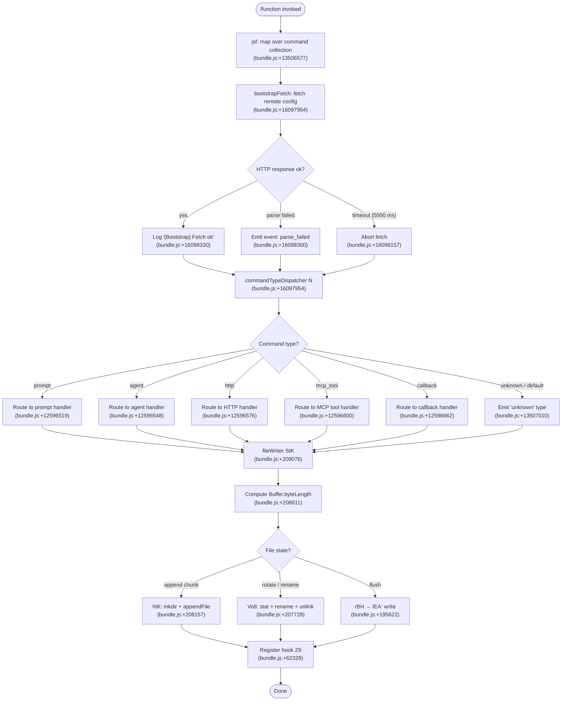

# `/function`

> Analysis basis: CC v2.1.169 bundle.js (AST extraction + Claude interpretation)
> Minimum version: v2.1.169

---

## Overview

The `/function` command is a `function`-type slash command registered in Claude Code CLI. Based on call-graph evidence, it maps over a collection of available sub-command definitions and dispatches to a bootstrap-fetching pipeline combined with a structured command-type dispatcher that routes input across prompt, agent, http, mcp_tool, callback, and other command categories. Its core mechanism is to enumerate registered command entries, resolve the appropriate handler for each command type, and orchestrate file I/O, telemetry, and session state side effects.

---

## Registration

| Field | Value |
|---|---|
| type | `function` |
| name | `function` |
| description | `null` |
| loc_byte | `13506896` |
| loc_byte_end | `13506929` |
| loc_line | `10758` |
| arbor_handler.name | `jsf` |
| arbor_handler.fqn | `claude-2.1.169::jsf` |
| arbor_handler.kind | `Function` |
| arbor_handler.resolution_path | `direct` |
| arbor_handler.n_hits | `1` |

Analysis basis: CC v2.1.169 bundle.js:+13506896

---

## Input Branching

The call graph reveals at least six distinct command-type branches (prompt, agent, http, mcp_tool, callback, unknown) plus internal branching within the bootstrap fetch and file-write subsystems. A Mermaid flowchart is used.



---

## Behavioral Spec

### 1. Handler Entry — `jsf` (commandFunctionHandler)

The top-level handler `jsf` iterates over a collection `H` via `.map`, invoking the per-entry processing pipeline for each command item. A secondary call to `E$H` (commandExtraSetup) is made at the end of the same scope.

```
function commandFunctionHandler(commandCollection):
    results = commandCollection.map(entry =>
        processCommandEntry(entry)
    )
    commandExtraSetup(results)
    return results
```

Analysis basis: CC v2.1.169 bundle.js:+13506577, +13506648

---

### 2. Bootstrap Fetch — `bootstrapFetcher` (H → N)

When the handler needs remote configuration it triggers a bootstrap fetch pipeline. The fetch sets `Content-Type: application/json` and a `User-Agent` header, logs `"[Bootstrap] Fetching"`, and enforces a 5000 ms timeout. On success it logs `"[Bootstrap] Fetch ok"`. On JSON parse failure it records event `"parse_failed"` under the telemetry event `"api_bootstrap_fetch"`.

```
async function bootstrapFetcher(url):
    log("[Bootstrap] Fetching")
    response = await fetchWithTimeout(url, {
        headers: {
            "Content-Type": "application/json",
            "User-Agent":   <agent-string>
        },
        timeout: 5000          // ms  (bundle.js:+16098157)
    })
    cachedValue = cache.get(url)   // MA.get  (bundle.js:+16097992)
    if parseSuccess(response):
        log("[Bootstrap] Fetch ok")
        return response
    else:
        recordEvent("api_bootstrap_fetch", { result: "parse_failed" })
        return cachedValue or null
```

Analysis basis: CC v2.1.169 bundle.js:+16097954, +16097956, +16098041, +16098056, +16098075, +16098157, +16098278, +16098300, +16098330

---

### 3. Command Type Dispatcher — `commandTypeDispatcher` (N)

`N` inspects a command entry and routes it to the appropriate sub-handler based on the `type` field. The recognised type literals are `"prompt"`, `"agent"`, `"http"`, `"mcp_tool"`, and `"callback"`. Unrecognised types fall through to `"unknown"`.

Before routing, `N` calls:
- `sBH` — sanitise/validate the entry  (bundle.js:+208915)
- `ItK` — resolve input arguments  (bundle.js:+208933)
- `H.includes` — membership check on the collection (bundle.js:+208955)
- `CH` — serialise a sub-object via `JSON.stringify` (bundle.js:+208973)
- `_.toUpperCase` — normalise a string field (bundle.js:+209017)
- `R4` — build a resolved path/name string (bundle.js:+209037)
- `H.trim` — strip whitespace from a field (bundle.js:+209040)
- `$h` — apply a secondary transformation (bundle.js:+209056)
- `rBH` — initiate file flush (bundle.js:+209062)
- `StK` — drive the file-writer pipeline (bundle.js:+209076)

```
function commandTypeDispatcher(entry, collection):
    sanitised = sanitiseEntry(entry)               // sBH
    args      = resolveInputArgs(sanitised)        // ItK
    inColl    = collection.includes(entry.name)    // H.includes
    serialised= serialiseSubObject(args)           // CH → JSON.stringify
    normName  = args.type.toUpperCase()
    resolved  = buildResolvedName(entry)           // R4
    trimmed   = resolved.trim()                    // H.trim
    transformed = applyTransform(trimmed)          // $h

    flushWriter(transformed)                       // rBH → lEA → H.write
    fileWriterPipeline(transformed, resolved)      // StK

    switch entry.type:
        case "prompt":   return promptHandler(entry)
        case "agent":    return agentHandler(entry)
        case "http":     return httpHandler(entry)
        case "mcp_tool": return mcpToolHandler(entry)
        case "callback": return callbackHandler(entry)
        default:         return { type: "unknown" }
```

Analysis basis: CC v2.1.169 bundle.js:+208915, +208933, +208955, +208973, +209017, +209037, +209040, +209056, +209062, +209076, +13507010, +12596519, +12596548, +12596576, +12596600, +12596662

---

### 4. Input Argument Resolver — `inputArgResolver` (ItK)

`ItK` resolves and validates raw input arguments, delegating to `RI` for a primary resolution step, then `fZA` and `vGA` for further normalisation. `vGA` in turn calls `yoK` and `hoK` for two independent transformations. The literal `1` is used as a sentinel/index offset.

```
function inputArgResolver(rawInput):
    primary   = resolveRaw(rawInput)        // RI  (bundle.js:+207495)
    secondary = normaliseField(primary)     // fZA (bundle.js:+207609)
    final     = applyDualTransform(secondary, offset=1)  // vGA (bundle.js:+207622)
        // vGA calls:
        //   transformA(final)  // yoK (bundle.js:+63461)
        //   transformB(final)  // hoK (bundle.js:+63475)
    return final
```

Analysis basis: CC v2.1.169 bundle.js:+207495, +207609, +207622, +63461, +63475

---

### 5. Resolved-Name Builder — `resolvedNameBuilder` (R4)

Constructs a resolved name string from the command entry. It applies a path-component mapping via `qZA` (which maps over `ZtK`), performs a `.replace` to substitute a `"[REDACTED]"` placeholder (bundle.js:+200573), calls `.at(2)` on an array (bundle.js:+200631), performs `lastIndexOf` on a lowercase string `A`, and slices the result. The constant `2` is used as an array index (bundle.js:+200602).

```
function resolvedNameBuilder(entry):
    components = mapPathComponents(entry.parts)    // qZA → ZtK.map
    name       = components.join(".")
        .replace(<pattern>, "[REDACTED]")          // bundle.js:+200573
    segment    = components.at(2)                  // bundle.js:+200631
    base       = lowercasedString.lastIndexOf(segment)  // A.lastIndexOf
    return lowercasedString.slice(base)            // A.slice (bundle.js:+200683)
```

Analysis basis: CC v2.1.169 bundle.js:+200494, +200521, +200573, +200602, +200631, +200657, +200683

---

### 6. File-Writer Pipeline — `fileWriterPipeline` (StK)

This is the primary persistence mechanism. It orchestrates buffered, append-based file writing with rotation and hook registration.

Key constants observed:
- Debounce delay: 1000 ms (bundle.js:+61630)
- Batch size limit: 100 (bundle.js:+61651)
- Buffer size limit: 1024 (bundle.js:+16413011)
- Path-component limit: 40 (bundle.js:+16533353)
- Rotation suffix: `.txt` (bundle.js:+207832)
- Rotation slice offset: 4 characters (bundle.js:+207854)

```
async function fileWriterPipeline(content, resolvedPath):
    dir     = path.dirname(resolvedPath)           // P6H.dirname
    ensured = ensureDir(dir)                       // RI / l6
    checked = checkEisdir(dir)                     // n56 → E8; error code "EISDIR"
    dest    = buildDestPath(dir, content)          // MZA → P6H.join + I6

    // Rotation check (Vo8):
    stat = await fs.stat(dest)                     // Mh.stat
    if dest.endsWith(".txt"):                      // bundle.js:+207832
        rotated = dest.slice(0, -4)                // strip last 4 chars
        await fs.rename(dest, rotated)             // Mh.rename
        await cleanup(rotated)                     // k8
        await fs.unlink(dest)                      // Mh.unlink

    byteLen = Buffer.byteLength(content)           // bundle.js:+208611
    budget  = computeBudget(byteLen)               // $ZA

    // Async write chain:
    writePromise = previousWritePromise.then(
        appendWriter.bind(context)                 // htK.bind
    )

    // htK: append sub-pipeline
    async function appendWriter(ctx):
        await fs.mkdir(dir, { recursive: true })   // Mh.mkdir
        await fs.appendFile(dest, content)         // Mh.appendFile
        checked2 = checkEisdir(dest)               // n56
        dest2    = buildDestPath(dir, content)     // MZA
        rotateIfNeeded(dest2)                      // Vo8
        byteLen2 = Buffer.byteLength(content)      // htK internal
        budget2  = computeBudget(byteLen2)         // $ZA

    // Debounced batch scheduler (TBH via StK → Z9):
    scheduledFlush = debouncedScheduler(
        delay=1000,
        batchLimit=100,
        onFlush=writeChunk
    )
    registerHook(scheduledFlush)                   // Z9 → ZGA.register
```

Analysis basis: CC v2.1.169 bundle.js:+208403, +208428, +208436, +208466, +208481, +208556, +208573, +208605, +208611, +208644, +208661, +208670, +208766, +61630, +61651, +61742, +61783, +61814, +61816, +61860, +61881, +61906, +61941, +61999, +62039, +62090, +62112, +62134, +62157, +62328, +178005, +178013, +207728, +207821, +207832, +207843, +207854, +207884, +207912, +207924, +208088, +208102, +208157, +208216, +208248, +208265, +208303, +208309, +208342, +16413011, +16533353

---

### 7. Flush Writer — `flushWriter` (rBH → lEA)

A synchronous or near-synchronous flush path that writes data directly via `H.write`.

```
function flushWriter(data):
    encoded = encodeData(data)    // lEA preparation
    H.write(encoded)              // bundle.js:+195622
```

Analysis basis: CC v2.1.169 bundle.js:+195686, +195622

---

### 8. Model / Provider Resolver — `modelResolver` (M9 → Cc → c9)

Resolves the model identifier for the command invocation. It normalises the model string to lower case, then checks it against known model families:

| Alias checked | Resolved family |
|---|---|
| `"opusplan"` | Opus-plan tier (bundle.js:+2252174) |
| `"[1m]"` prefix | Sonnet-class mapping (bundle.js:+2252200) |
| `"sonnet"` | Sonnet (bundle.js:+2252215) |
| `"haiku"` | Haiku (bundle.js:+2252254) |
| `"opus"` | Opus (bundle.js:+2252293) |
| `"best"` | Best-available alias (bundle.js:+2252330) |

Provider type strings observed: `"firstParty"` (bundle.js:+2248333), `"anthropicAws"` (bundle.js:+2105867), `"gateway"` (bundle.js:+2105887), `"mantle"` (bundle.js:+2249023).

A prefix check for `"anthropic."` is performed before model-family matching (bundle.js:+2246054).

```
function modelResolver(rawModelId):
    trimmed  = rawModelId.trim().toLowerCase()       // c9 (bundle.js:+2252078)
    provider = resolveProvider(trimmed)              // u2 → ZLH
    replaced = trimmed.replace(<pattern>, "")        // A.replace

    if   trimmed contains "opusplan":  return modelSpec("opus-plan", provider)
    elif trimmed starts with "[1m]":   return modelSpec("sonnet-class", provider)
    elif trimmed contains "sonnet":    return modelSpec("sonnet", provider)
    elif trimmed contains "haiku":     return modelSpec("haiku", provider)
    elif trimmed contains "opus":      return modelSpec("opus", provider)
    elif trimmed == "best":            return modelSpec("best-available", provider)
    else:                              return modelSpec(trimmed, provider)
```

Analysis basis: CC v2.1.169 bundle.js:+2248110, +2252078, +2252089, +2252107, +2252117, +2252153, +2252174, +2252192, +2252200, +2252215, +2252254, +2252269, +2252293, +2252307, +2252330, +2252344, +2252362, +2252368, +2252376, +2252420, +2246054, +2248333, +2105867, +2105887, +2249023

---

### 9. Bootstrap Fetch Telemetry & Error Reporting — `bootstrapEventReporter` (o6)

When the bootstrap fetch (H pipeline) finishes, `o6` emits telemetry. On a sad/error path, `tengu_feature_sad` is fired (bundle.js:+1014069). The reporter delegates to `d` for the event payload and `K6 → c76` for issue-URL construction: `"report the issue at https://github.com/anthropics/claude-code/issues"` (bundle.js:+3799).

```
function bootstrapEventReporter(fetchResult):
    if isErrorState(fetchResult):
        payload = buildErrorPayload(fetchResult)   // d (bundle.js:+1014067)
        emit("tengu_feature_sad", payload)         // bundle.js:+1014069
        issueUrl = buildIssueUrl()                 // K6 → c76 (bundle.js:+3628)
        // URL: https://github.com/anthropics/claude-code/issues
    return fetchResult
```

Analysis basis: CC v2.1.169 bundle.js:+1014067, +1014069, +1014108, +3628, +3799

---

### 10. Argument Splitter — `argSplitter` (w2_)

Parses a raw argument string into structured parts.

```
function argSplitter(rawArg):
    parts  = rawArg.split(<delimiter>)        // _.split  (bundle.js:+2984790)
    head   = parts[0].trim()                  // q.trim   (bundle.js:+2984829)
    sepIdx = head.indexOf(<separator>)        // q.indexOf (bundle.js:+2984853)
    tail   = head.slice(sepIdx + 1)           // q.slice  (bundle.js:+2984893)
    return { head, tail, parts }
```

Analysis basis: CC v2.1.169 bundle.js:+2984790, +2984829, +2984853, +2984893

---

### 11. Reserved-Set Checker — `reservedSetChecker` (u6H)

Checks whether a resolved name is in a reserved set using a `Map` or `Set` `.has()` call.

```
function reservedSetChecker(name):
    return reservedSet.has(name)    // vO4.has (bundle.js:+846702)
```

Analysis basis: CC v2.1.169 bundle.js:+846702

---

## State & Side Effects

| Item | Detail |
|---|---|
| Telemetry | `tengu_feature_sad` — emitted on bootstrap fetch error (bundle.js:+1014069) |
| Telemetry | `api_bootstrap_fetch` with property `parse_failed` — emitted on JSON parse failure (bundle.js:+16098278, +16098300) |
| Hook registration | `Z9 → ZGA.register` — registers a debounced flush hook after each file-writer cycle (bundle.js:+62328) |
| File I/O | `fs.mkdir`, `fs.appendFile`, `fs.rename`, `fs.unlink`, `fs.stat` via `Mh` — persistent log/output file management |
| Debounce timer | `clearTimeout` / `setTimeout` / `setImmediate` used in `TBH`; delay 1000 ms, batch limit 100 (bundle.js:+61630, +61651) |
| Buffer accounting | `Buffer.byteLength` called in both `StK` and `htK` to track write budget (bundle.js:+208611, +208309) |
| appState changes | Cache lookup via `MA.get` on bootstrap result (bundle.js:+16097992); reserved-set membership tracked via `vO4.has` (bundle.js:+846702) |
| Sound | <!-- TODO: not found in depth-2 traversal; needs --depth 4 --> |
| Build metadata | Version `2.1.169`, build timestamp `2026-06-08T03:22:12Z`, commit `eb44edf196b8a320135d5a27a3cfba37773ce0cd` (bundle.js:+3972, +4061, +4092) |

---

## Version History

| Version | Change |
|---|---|
| v2.1.169 | Initial analysis |

---

## Common Mistakes

1. **Assuming `description` is set** — the registration `description` field is `null` for this command. Any UI that renders a description will display nothing or a fallback.
2. **Ignoring the 5000 ms bootstrap timeout** — callers that depend on fresh remote config should account for the hard abort at 5000 ms; stale cache values may be returned silently.
3. **Overlooking `.txt` rotation** — the file-writer pipeline silently renames files ending in `.txt` (stripping the last 4 characters) before appending; downstream readers expecting stable filenames will be surprised.
4. **Confusing `"unknown"` type with an error** — command entries whose `type` field does not match any of the five recognised literals (`prompt`, `agent`, `http`, `mcp_tool`, `callback`) are dispatched to the `"unknown"` branch without throwing; this is a silent no-op routing path.
5. **Treating `[REDACTED]` as a placeholder in output** — the string literal `"[REDACTED]"` (bundle.js:+200573) is a hard-coded replacement token in `resolvedNameBuilder`, not a documentation artefact; it will appear verbatim in resolved names when the relevant pattern matches.
6. **Assuming a single model string** — the model resolver handles at least six different alias families plus provider-type strings; passing a raw API model ID without normalisation may bypass alias matching.

---

## Appendix — Identifier Mapping

> For bundle debugging only. Identifiers change across versions.

| Identifier | Role |
|---|---|
| `jsf` | Top-level command function handler (arbor_handler; resolution: direct) |
| `H` | Command collection / bootstrap fetch orchestrator |
| `N` | Command type dispatcher |
| `ItK` | Input argument resolver |
| `vGA` | Dual-transform applicator |
| `CH` | Sub-object serialiser (delegates to JSON.stringify) |
| `R4` | Resolved-name builder |
| `qZA` | Path-component mapper |
| `q` | Array/string operand in name builder and arg splitter |
| `A` | Lowercase string operand in name builder and model resolver |
| `rBH` | Flush-writer initiator |
| `lEA` | Low-level write encoder |
| `StK` | File-writer pipeline orchestrator |
| `TBH` | Debounced batch scheduler |
| `_4H` | Path-assembly helper within file-writer |
| `l6` | Directory-ensure helper |
| `n56` | EISDIR error checker |
| `MZA` | Destination-path builder |
| `Vo8` | File rotation handler (stat / rename / unlink) |
| `htK` | Append-writer sub-pipeline |
| `Z9` | Hook registrar |
| `P$` | Bootstrap secondary processor |
| `w2_` | Argument splitter |
| `u6H` | Reserved-set membership checker |
| `n3` | String replace normaliser |
| `M9` | Model resolver entry point |
| `Cc` | Model resolution sub-dispatcher |
| `tY` | Model resolution helper A |
| `pU` | Model resolution helper B |
| `CC` | Model string parser (trim / startsWith / includes logic) |
| `c9` | Core model-alias matcher |
| `u2` | Provider resolver |
| `TLH` | Provider-type inclusion checker |
| `Mk` | Model spec builder (opusplan / sonnet path) |
| `QcH` | Model spec builder (haiku path) |
| `AE` | Model spec builder (firstParty path) |
| `dG1` | Model spec builder (delegating to AE) |
| `zM` | Provider-type resolver (anthropicAws / gateway) |
| `__8` | Reserved-model-ID set checker |
| `dcH` | Model fallback handler |
| `eD` | Extended model dispatcher |
| `hG` | Composite model + provider handler |
| `o6` | Bootstrap event reporter / telemetry emitter |
| `d` | Error payload builder |
| `K6` | Issue-URL constructor |
| `c76` | Base URL / issue-URL string provider |
| `E$H` | Command extra setup (called after map in jsf) |

---

Note: index built via Arbor fallback; some signals (telemetry, literals) may be missing — see arbor-fallback.js.