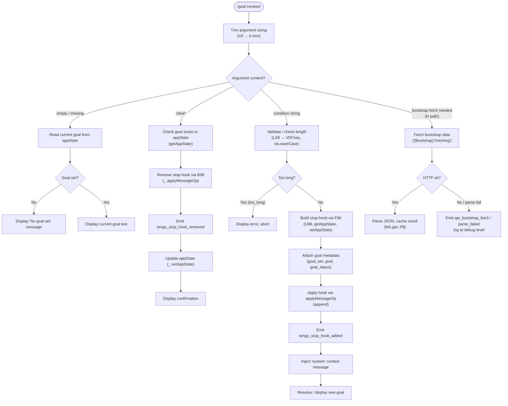

# `/goal`

> Analysis basis: CC v2.1.169 bundle.js (AST extraction + Claude interpretation)
> Minimum version: v2.1.169

---

## Overview

The `/goal` command lets the user set a natural-language condition that Claude evaluates before deciding whether to stop a running task. When invoked with a condition string, the agent injects a system-level stop-hook that checks the goal; invoking it with `clear` removes any previously registered goal. The command operates synchronously on the application state and emits telemetry for both registration and removal paths.

---

## Registration

| Field | Value |
|---|---|
| type | `local-jsx` |
| name | `goal` |
| description | `Set a goal Claude checks before stopping` |
| argumentHint | `[<condition> \| clear]` |
| immediate | `true` |
| module_id | `kzK` |
| load_inline | `true` |
| loc_byte | `13138446` |
| loc_byte_end | `13138632` |
| loc_line | `9675` |
| arbor_handler.name | `Xif` |
| arbor_handler.fqn | `claude-2.1.169::Xif` |
| arbor_handler.kind | `AsyncFunction` |
| arbor_handler.resolution_path | `module_id` |
| arbor_handler.n_hits | `0` |

Analysis basis: CC v2.1.169 bundle.js:+13138446

---

## Input Branching

Four distinct execution paths exist depending on argument content and internal state, so a flowchart is used.



Analysis basis: CC v2.1.169 bundle.js:+13137041 (trim), +13137147 (skip/clear branch), +13137200 (No goal set), +13137244 (system inject), +13137286 (goal_set), +13137297 (too_long), +10453263 (stop-hook removed), +10452891 (stop-hook added)

---

## Behavioral Spec

### 1. Entry Point — `handleGoalCommand` (bundle ident: `Xif`)

```
async function handleGoalCommand(context):
    rawArg = context.args.trim()                   // A.trim  +13137041

    if rawArg is empty:
        return displayCurrentGoal(context)

    if rawArg.toLowerCase() == "clear":            // LS8 lowercaseCheck +13137161
        return removeGoal(context)

    validationResult = validateGoalString(rawArg)  // LS8 +13137161
    if validationResult == "too_long":             // literal +13137297
        displayError("goal too long")
        return

    goal = rawArg
    applyGoalHook(context, goal)                   // F96 +13137175
    injectSystemContext(context, goal)             // "system" literal +13137244
    emitTelemetry("tengu_stop_hook_added")         // +10452891
    displayGoalConfirmation(goal)
```

Analysis basis: CC v2.1.169 bundle.js:+13137041

---

### 2. Goal Validation — `validateGoalArg` (bundle ident: `LS8`)

```
function validateGoalArg(arg):
    knownValues = VDf.has(arg)                     // VDf.has +10451803
    normalized  = arg.toLowerCase()               // H.toLowerCase +10451811

    if normalized == "skip":                       // literal +13137147
        return "skip"

    if byteLength(arg) exceeds threshold:
        return "too_long"                          // literal +13137297

    return "ok"
```

Analysis basis: CC v2.1.169 bundle.js:+10451803, +13137147, +13137297

---

### 3. Apply Stop-Hook — `applyGoalHook` (bundle ident: `F96`)

```
async function applyGoalHook(context, goalText):
    buildHookEntry(context)                        // U96 +10453004
    appState = context.getAppState()              // H.getAppState +10453008

    hookRecord = {
        type:     "goal",                          // literal +10453297
        status:   "goal_status",                  // literal +10453426
        label:    "goal_set",                     // literal (set path)
        op:       "append",                       // literal +10453229
        kind:     "attachment"                    // literal +10453339
    }

    id = generateUUID()                           // pbq → xbq.randomUUID +10453357
    hookRecord.id = id

    context.setAppState(updatedState)             // H.setAppState +10453137
    context.applyMessageOp(hookRecord)            // H.applyMessageOp +10453206
    emitTelemetry("tengu_stop_hook_added")        // +10452891
    renderHookUI(context)                         // M6 → c76 +10453294
```

Analysis basis: CC v2.1.169 bundle.js:+10453004, +10453137, +10453206, +10453248, +10453357

---

### 4. Remove Stop-Hook — `removeGoalHook` (bundle ident: `B96`)

```
async function removeGoalHook(context):
    resolveHookEntries(context)                   // x_A +10452505
    currentHooks = context.getAppState()          // _.getAppState +10452590
    timestamp = Date.now()                        // +10452754
    computeTokenCost(context)                     // gD → outputTokens +10452779

    context.setAppState(updatedState)             // _.setAppState +10452792
    context.applyMessageOp({ op: "remove" })      // _.applyMessageOp +10452834
    id = generateUUID()                           // pbq +10452876
    emitTelemetry("tengu_stop_hook_removed")      // d → tengu_feature_sad/ok +10452889
    renderResult(context)                         // M6 +10452942
    displayStopMessage(context)                   // SH +10452955
```

Analysis basis: CC v2.1.169 bundle.js:+10452505, +10452590, +10452754, +10452792, +10452834, +10452876

---

### 5. Display Current Goal — `displayCurrentGoal` (no-arg path)

```
function displayCurrentGoal(context):
    current = context.getAppState().goal

    if current is null or undefined:
        print "No goal set"                       // literal +13137200
        return

    print current
```

Analysis basis: CC v2.1.169 bundle.js:+13137200

---

### 6. Bootstrap Fetch — `bootstrapFetch` (bundle ident: `H`, sub-path `N`)

The handler can trigger a lazy API bootstrap when the app state lacks required configuration:

```
async function bootstrapFetch(url):
    log.debug("[Bootstrap] Fetching", url)        // literal +16097956, "debug" +208891
    response = await fetch(url, {
        headers: {
            "Content-Type":  "application/json", // +16098041, +16098056
            "User-Agent":    <agentString>        // +16098075
        },
        timeout: 5000                             // +16098157
    })

    if not response.ok:
        emitTelemetry("api_bootstrap_fetch")      // +16098278 ("parse_failed" sub-case +16098300)
        return null

    data = await response.json()
    log.debug("[Bootstrap] Fetch ok")             // +16098330
    cache(data)                                   // MA.get +16097992
    return data
```

Analysis basis: CC v2.1.169 bundle.js:+16097956, +16098041, +16098157, +16098278

---

### 7. Stop-Hook Gate Checks (`hooks_gate` / `trust_gate`)

Before actually registering a stop-hook the implementation performs two gate checks:

```
function checkHookGates(context):
    if not hooksGateAllowed(context):             // "hooks_gate" literal +10452401
        return false
    if not trustGateAllowed(context):             // "trust_gate" literal +10452455
        return false
    return true
```

Analysis basis: CC v2.1.169 bundle.js:+10452401, +10452455

---

### 8. Session Termination Path (called on fatal CLI error, not normal goal flow)

```
function onCliError(reason):
    emitTelemetry("cli_error")                   // literal +13208381
    closeStreamA()                               // A.close +16518551
    closeStreamQ()                               // q.close +16518561
    process.exit(1)                              // +13208394, exit code 1 +13208407
```

Analysis basis: CC v2.1.169 bundle.js:+13208371, +13208381, +13208394, +13208407

---

## State & Side Effects

| Item | Detail |
|---|---|
| Telemetry — `tengu_stop_hook_added` | Emitted when a new goal stop-hook is successfully registered (bundle.js:+10452891) |
| Telemetry — `tengu_stop_hook_removed` | Emitted when a goal stop-hook is removed via `/goal clear` (bundle.js:+10453263) |
| Telemetry — `tengu_feature_ok` | Emitted on successful feature-path completion through the `SH`/`d` call chain (bundle.js:+1013926) |
| Telemetry — `tengu_feature_sad` | Emitted when the feature encounters an error path (bundle.js:+1014069) |
| Telemetry — `api_bootstrap_fetch` | Emitted if bootstrap JSON fetch or parse fails (bundle.js:+16098278) |
| Hook registration | Adds or removes a stop-hook entry in appState via `applyMessageOp` with op `"append"` or remove; hook carries `goal`, `goal_set`, `goal_status` metadata |
| appState changes | `getAppState` / `setAppState` called on both set and clear paths; hook record contains a freshly generated UUID |
| System message injection | On goal-set path a `"system"` context message is injected into the conversation (literal +13137244) |
| Stream teardown | On CLI error, both stream `A` and stream `q` are closed before `process.exit(1)` |
| Sound | <!-- TODO: not found in depth-2 traversal; needs --depth 4 --> |

---

## Version History

| Version | Change |
|---|---|
| v2.1.169 | Initial analysis |

---

## Common Mistakes

1. **Passing a very long condition string** — the command rejects the argument with a `too_long` error (literal at bundle.js:+13137297) before any hook is registered. Keep goal conditions concise.
2. **Expecting `/goal clear` to be case-insensitive at the argument level** — the `LS8` validator explicitly calls `.toLowerCase()` (bundle.js:+10451811) before comparison, so `CLEAR` and `Clear` are accepted, but passing extra whitespace without trimming may cause unexpected routing.
3. **Assuming the goal persists across sessions** — the goal is stored in transient appState, not in a persistent settings file; restarting Claude Code removes any registered goal.
4. **Calling `/goal` without a running session** — the `hooks_gate` and `trust_gate` checks (bundle.js:+10452401, +10452455) may block hook registration if the session trust context has not been established.
5. **Confusing `/goal` with CLAUDE.md instructions** — `/goal` installs a runtime stop-hook checked before each stop decision; it does not modify the persistent system prompt or project-level configuration files.

---

## Appendix — Identifier Mapping

> For bundle debugging only. Identifiers change across versions.

| Identifier | Role |
|---|---|
| `Xif` | Main handler for `/goal` command (`handleGoalCommand`); AsyncFunction resolved via module_id path |
| `A` | Argument string variable / trim target in entry handler |
| `f` | Stream or resource handle; involved in close/finally teardown |
| `q` | Secondary stream or queue; closed on error path |
| `$1` | CLI-error dispatch function; calls `smH`, `ij`, `process.exit` |
| `L` | Async task tracker; manages `q.add`, `q.delete`, `f.finally` |
| `H` | Bootstrap fetch function / outer HTTP helper |
| `N` | Inner bootstrap fetch implementation; performs debug logging and JSON parse |
| `ItK` | Sub-module within bootstrap path; calls `RI`, `fZA`, `vGA` |
| `vGA` | Locale/environment helper; calls `yoK`, `hoK` |
| `CH` | JSON serialisation helper; wraps `JSON.stringify` |
| `R4` | String/token truncation utility; uses `lastIndexOf`, `slice`, `replace` |
| `qZA` | Token-map builder; calls `ZtK.map` |
| `rBH` | Output/write helper; delegates to `lEA` |
| `lEA` | Low-level write wrapper; calls `H.write` |
| `StK` | File/log persistence layer; orchestrates mkdir, appendFile, rename, unlink |
| `TBH` | Debounce/flush scheduler; uses `setTimeout`, `setImmediate`, `clearTimeout` |
| `_4H` | Path-join + write helper; calls `_M6`, `P6H.join`, `A_`, `I6` |
| `l6` | Helper within `StK`; role not fully resolved at depth 2 |
| `n56` | Directory-error handler; checks `EISDIR` |
| `MZA` | Path-join utility; calls `P6H.join`, `I6` |
| `Vo8` | File rotation helper; stat, endsWith `.txt`, slice, rename, unlink |
| `htK` | Async file-append handler; mkdir + appendFile + rotation |
| `Z9` | Hook/handler registration trampoline; calls `ZGA.register` |
| `P$` | Bootstrap cache accessor |
| `w2_` | String-splitting / index-parsing utility |
| `u6H` | Feature-flag check; `vO4.has` |
| `n3` | String replace utility |
| `M9` | Model/provider resolution entry; calls `Cc`, `c9`, `eD` |
| `Cc` | Model-string parser; calls `tY`, `pU`, `FA`, `CC` |
| `tY` | Sub-component of model parsing |
| `pU` | Sub-component of model parsing |
| `CC` | Model-alias normaliser; handles `anthropic.` prefix, trim, startsWith |
| `c9` | Model identifier canonicaliser; resolves aliases like `opusplan`, `sonnet`, `haiku`, `opus`, `best` |
| `u2` | Helper within canonicaliser; calls `ZLH` |
| `TLH` | Allowed-model-list checker; calls `GLH.includes` |
| `Mk` | Provider builder; calls `zM`, `F5` |
| `QcH` | Provider variant builder; calls `F5` |
| `AE` | First-party provider constructor; `zM`, `F5`, `YA`, `"firstParty"` |
| `dG1` | Provider delegate; calls `AE` |
| `zM` | Provider base builder; calls `YA` |
| `__8` | Model inclusion check; `Q5L.includes` |
| `dcH` | Model exclusion check; calls `_6` |
| `eD` | Extended model resolver; calls `c9`, `hG` |
| `hG` | Full model-record assembler; combines provider, type, alias fields |
| `o6` | Feature/capability reporter; emits `tengu_feature_sad`/`tengu_feature_ok` |
| `d` | Core feature-event emitter |
| `K6` | Event helper; calls `c76` |
| `c76` | Low-level event dispatch |
| `LS8` | Goal argument validator; checks known values via `VDf.has`, lowercases |
| `F96` | Stop-hook application function (`applyGoalHook`); set path |
| `I6` | Generic async I/O helper; calls `xZ` |
| `xZ` | Lowest-level I/O primitive |
| `U96` | Hook-entry builder; called by both `F96` and `B96` |
| `aWH` | Hook-map setter; `K.set`, `fPq` |
| `K` | Hook map / display formatter; `L.map`, `f.padEnd` |
| `fPq` | Hook display renderer; `H.map` |
| `pbq` | UUID generator wrapper; calls `xbq.randomUUID` |
| `M6` | UI render helper; calls `c76` |
| `B96` | Stop-hook removal function (`removeGoalHook`); clear path |
| `x_A` | Hook resolution helper; calls `rC`, `N_H`, `F_`, `Nf` |
| `rC` | Policy/hook resolver; calls `y8` |
| `y8` | Settings loader; calls `Ho6`, `YB` |
| `N_H` | Alternative hook resolver; calls `y8`, `FA` |
| `F_` | Sub-resolver within `x_A` |
| `Nf` | Hook-path resolver; calls `zhL` |
| `zhL` | Path construction helper; `_6`, `XBH`, `w9`, `y6`, `YJH`, `_c`, `C6`, `fw.resolve`, `".."` |
| `gD` | Token-cost calculator; `KBH`, `Object.values`, `"outputTokens"` |
| `SH` | Stop-display helper; calls `d`, `K6` |
| `fS8` | Final cleanup / teardown called at end of `Xif` handler |

---

Note: index built via Arbor fallback; some signals (telemetry, literals) may be missing — see arbor-fallback.js.