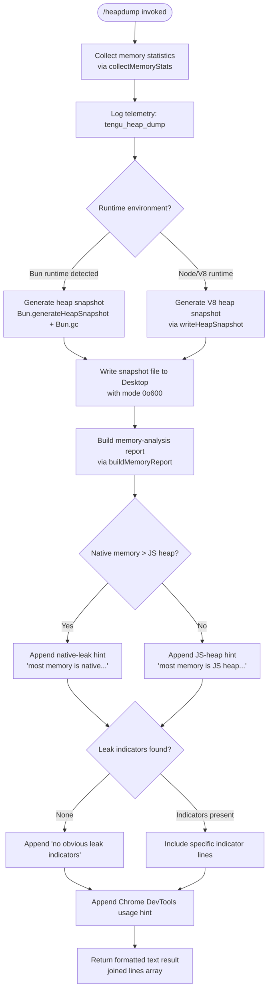

# `/heapdump`

> Analysis basis: CC v2.1.169 bundle.js (AST extraction + Claude interpretation)
> Minimum version: v2.1.169

---

## Overview

`/heapdump` is a hidden diagnostic command that captures the current JavaScript heap state to a `.heapsnapshot` file on the user's Desktop, alongside a structured memory-statistics report. It is intended for internal debugging of Claude Code's own process memory; it is not advertised in standard help output. The command also performs a forced garbage collection (via `Bun.gc`) before writing the snapshot so that the captured data reflects live-retained objects rather than GC-eligible garbage.

---

## Registration

| Field | Value |
|---|---|
| type | `local` |
| name | `heapdump` |
| description | `Dump the JS heap to ~/Desktop` |
| supportsNonInteractive | `true` |
| isHidden | `true` |
| module_id | `F7K` |
| load_inline | `true` |
| loc_byte | `12739367` |
| loc_byte_end | `12739795` |
| loc_line | `9113` |
| arbor_handler.name | `CFf` |
| arbor_handler.fqn | `claude-2.1.169::CFf` |
| arbor_handler.kind | `AsyncFunction` |
| arbor_handler.resolution_path | `module_id` |
| arbor_handler.n_hits | `0` |

Analysis basis: CC v2.1.169 bundle.js:+12739367

---

## Input Branching

The command has three distinct major phases with several internal branches, so a Mermaid flowchart is used.



Analysis basis: CC v2.1.169 bundle.js:+12738236 (handler `CFf`), +12737437 (snapshot writer `RFf`), +12738355 (report builder `bFf`)

---

## Behavioral Spec

### 1. Top-Level Handler (`CFf`)

The handler is an `AsyncFunction` resolved via `module_id` path (module `F7K`).

```
async function heapdumpHandler(context):
    stats = await collectMemoryStats()          // TMA → U7K
    snapshotPath = await writeHeapSnapshot()    // TMA → RFf
    report = buildMemoryReport(stats, snapshotPath)  // bFf
    lines = []
    lines.push("Open the .heapsnapshot in Chrome DevTools → Memory → Load to inspect retainers.")
    // ^^ literal at bundle.js:+12738392
    lines.push(...report)
    return { type: "text", content: lines.join("\n") }
    // "text" literal at bundle.js:+12738268
```

Analysis basis: CC v2.1.169 bundle.js:+12738236

---

### 2. Memory Statistics Collection (`TMA` / `U7K`)

`TMA` is the orchestrator that calls `U7K` (the low-level stats gatherer) and then formats results for the report.

```
async function orchestrateMemoryCollection():
    rawStats = await gatherRawMemoryStats()   // U7K
    // Uptime trigger mode: "manual", offset 0
    // literals at bundle.js:+12736874, +12736885
    formattedReport = formatMemoryReport(rawStats)
    return formattedReport
```

```
async function gatherRawMemoryStats():
    result = {}
    result.memoryUsage       = process.memoryUsage()        // +12734399
    result.heapStats         = v8/bun.getHeapStatistics()   // +12734423  (cm8 = v8/bun module)
    result.resourceUsage     = process.resourceUsage()      // +12734449
    result.uptime            = process.uptime()             // +12734475
    result.heapSpaceStats    = v8/bun.getHeapSpaceStatistics() // +12734500
    result.activeHandles     = process._getActiveHandles()  // +12734542
    result.activeRequests    = process._getActiveRequests() // +12734579

    // Read open file descriptors on Linux
    fdList = await fs.readdir("/proc/self/fd")              // +12734642
    // Read smaps_rollup for native RSS on Linux
    smapsContent = await fs.readFile("/proc/self/smaps_rollup", "utf8")  // +12734705, +12734731

    // Load bun:jsc module if available                      // +12734790
    jscModule = tryRequire("bun:jsc")

    // Thresholds:
    //   FD age limit:    3600 seconds   (bundle.js:+12734931)
    //   FD size limit:   1048576 bytes  (bundle.js:+12734936)

    // Format numbers with toFixed for display               // +12735292
    // Run path resolution helper I6 / xZ                   // +12735445

    // macOS-specific branch:
    if platform == "macos":                                  // +12736023
        // Convert values using factor 1024                 // +12736033
        applyMacOSMemoryConversion(result)

    return result
```

Analysis basis: CC v2.1.169 bundle.js:+12736898 (`TMA→I6`), +12736911 (`TMA→U7K`)

---

### 3. Heap Snapshot Writer (`RFf`)

This function handles the actual snapshot generation. It branches on runtime.

```
async function writeHeapSnapshot(outputPath):
    emit telemetry: tengu_heap_dump              // +12737488

    if Bun runtime available:
        snapshot = Bun.generateHeapSnapshot("v8", "arraybuffer")
        // "v8" literal at +12737961, "arraybuffer" literal at +12737966
        Bun.gc(/* force = */ true)               // +12737993
        fs.writeFileSync(outputPath, snapshot)   // +12737916
    else:
        // Node.js / V8 path
        v8.writeHeapSnapshot(outputPath)

    return outputPath
```

> File permissions for the written snapshot: `0o600` (octal 384 decimal).
> File permission constant: 384 (bundle.js:+12737381)

Analysis basis: CC v2.1.169 bundle.js:+12737437

---

### 4. Output Path Resolution (`gmA`)

The Desktop path is resolved cross-platform.

```
function resolveDesktopPath():
    home = os.homedir()                          // KA_.homedir at +1064692
    path = pathModule.join(home, "Desktop")      // "Desktop" literal at +1064738

    // WSL / Windows fallback
    if path starts with "/mnt/c/Users":          // literal at +1064960
        // Skip "Public", "Default", "Default User", "All Users" accounts
        //   literals at +1065004, +1065023, +1065043, +1065068
        applyWindowsUserFilter(path)

    return resolvedDesktopPath
```

Analysis basis: CC v2.1.169 bundle.js:+12737194 (`TMA→gmA`), +1064685

---

### 5. Memory Report Builder (`bFf`)

Constructs the human-readable analysis appended to the output.

```
function buildMemoryReport(stats, snapshotPath):
    lines = []
    maxMemory = Math.max(stats.heapUsed, stats.nativeRss)    // +12738611

    if stats.nativeRss > stats.heapUsed:
        lines.push("— most memory is native (NOT in the .heapsnapshot)")
        // literal at +12738739
    else:
        lines.push("— most memory is JS heap (inspect the .heapsnapshot)")
        // literal at +12738679

    leakIndicators = detectLeakIndicators(stats)             // M46

    if leakIndicators is empty:
        lines.push("  (no obvious leak indicators)")         // literal at +12738876
    else:
        lines.push(...leakIndicators)

    // Threshold check: native memory > heap signals native addon leak
    if stats.nativeRss > stats.heapUsed:
        lines.push("Native memory > heap - leak may be in native addons (node-pty, sharp, etc.)")
        // literal at +12735169

    // Pad label column width using Math.max for alignment    // +12738611
    // Column padding constant: 8                            // +12739011
    // Size threshold: 1 GB = 1073741824 bytes               // +12739285

    if noLeakIndicators:
        lines.push("No obvious leak indicators. Check heap snapshot for retained objects.")
        // literal at +12736288

    return lines
```

Analysis basis: CC v2.1.169 bundle.js:+12738355 (`CFf→bFf`), +12738923 (`bFf→M46`)

---

### 6. File Write Orchestration (`TMA` — file output stage)

After statistics are gathered and the snapshot file written, the orchestrator writes a companion JSON statistics file.

```
async function writeStatsFile(stats, desktopPath):
    outputFile = pathModule.join(desktopPath, filename)      // GMA.join at +12737303
    serialized  = serialize(stats)                           // CH → JSON.stringify at +12737362
    await fs.writeFile(outputFile, serialized)               // f46.writeFile at +12737346
    // mode: 0o600 (384)                                     // +12737381
```

Analysis basis: CC v2.1.169 bundle.js:+12737303, +12737346, +12737362

---

### 7. Error Handling (`wA`, `hH`)

```
function handleCommandError(err):
    message = String(err)                       // wA: Error + String at +177366, +177372
    logError(message)                           // hH → bo.logError at +1019718
    // Appends error to circular log buffer     // av4 at +1019660
    return errorResultObject
```

Analysis basis: CC v2.1.169 bundle.js:+12737657 (`TMA→wA`), +12737744 (`TMA→hH`)

---

## State & Side Effects

| Item | Detail |
|---|---|
| Telemetry | `tengu_heap_dump` (bundle.js:+12737488) — fired once per invocation inside the snapshot writer |
| Telemetry (indirect, bg-daemon path) | `tengu_bg_proto_mismatch` (+16493328), `tengu_bg_dispatch_stale_drop` (+16494695), `tengu_bg_attach_legacy_autorespawn` (+16497216), `tengu_bg_attach` (+16498374), `tengu_bg_attach_stall_gave_up` (+16499292), `tengu_bg_attach_stall_respawn` (+16499562), `tengu_bg_attach_kick` (+16500512) — from shared daemon-protocol layer, not heapdump-specific |
| Telemetry (feature) | `tengu_feature_sad` (+1014069) — general feature-error path |
| File output | `.heapsnapshot` file written to `~/Desktop` with permissions `0o600` |
| File output | JSON memory-statistics file written to `~/Desktop` with permissions `0o600` |
| Forced GC | `Bun.gc(true)` called before snapshot (Bun runtime only); reduces snapshot noise |
| process introspection | Reads `/proc/self/fd` and `/proc/self/smaps_rollup` on Linux for native-memory accounting |
| `appState` changes | None observed in depth-2 traversal |
| Hook registration | `Z9 → ZGA.register` at +62328 (within `StK` logging subsystem; not heapdump-specific) |
| Sound | None |

---

## Version History

| Version | Change |
|---|---|
| v2.1.169 | Initial analysis |

---

## Common Mistakes

1. **Expecting the command in help output** — `/heapdump` is registered with `isHidden: true`; it does not appear in `/help` or tab-completion lists. Type the command explicitly.
2. **Running on a non-Desktop OS path** — The output path is resolved to `~/Desktop`. On headless Linux servers this directory typically does not exist, and the `fs.writeFile` call will fail; create the directory manually first.
3. **Mistaking the stats file for the snapshot** — Two files are written: a `.heapsnapshot` (loadable in Chrome DevTools) and a companion JSON stats file. Only the `.heapsnapshot` can be opened in the Chrome Memory profiler.
4. **Ignoring the "native memory" warning** — When the report prints the native-memory hint, the `.heapsnapshot` will not show the relevant allocations; the leak is in a native addon (e.g., `node-pty`, `sharp`). Use OS-level tools (`heaptrack`, `valgrind`) instead.
5. **Expecting the command to work outside the Bun or Node.js V8 runtimes** — The snapshot generation path branches on runtime availability; on unsupported runtimes the command may produce no snapshot file.
6. **File permission surprises** — Output files are written with mode `0o600` (owner read/write only). This is intentional to protect potentially sensitive heap data.

---

## Appendix — Identifier Mapping

> For bundle debugging only. Identifiers change across versions.

| Identifier | Role |
|---|---|
| `CFf` | Top-level heapdump async handler (arbor_handler; entry point) |
| `TMA` | Memory-collection and file-write orchestrator |
| `U7K` | Low-level memory statistics gatherer (process/v8/fs calls) |
| `RFf` | Heap snapshot file writer (Bun or V8 branch) |
| `bFf` | Memory report text builder |
| `M46` | Leak indicator detector (called by report builder) |
| `gmA` | Desktop path resolver (cross-platform, WSL-aware) |
| `I6` | Path / filesystem utility helper |
| `xZ` | Filesystem sub-utility called by `I6` |
| `W` | Shared utility (called by stats gatherer) |
| `zRH` | TeammateMailbox message-marking helper (indirect, shared) |
| `N` | Logger / output formatter |
| `ItK` | Logger sub-component |
| `vGA` | Logger transport helper |
| `CH` | JSON serializer wrapper |
| `R4` | String manipulation helper |
| `qZA` | Header/map builder called by `R4` |
| `StK` | File-append / log-file writer |
| `TBH` | Buffered log flusher (setTimeout-based) |
| `_4H` | Log-line formatter |
| `n56` | Directory-is-file error handler |
| `MZA` | Log-path constructor |
| `Vo8` | Log-file rotation helper |
| `htK` | Log-file append/rotate executor |
| `Z9` | Log-session registrar |
| `gmA` | Desktop path resolver (also listed above) |
| `hH` | Error logger / circular-buffer appender |
| `wA` | Error-to-string converter |
| `_6` | String coercion helper |
| `kq` | Log-record builder |
| `duA` | Log-record sub-builder |
| `av4` | Circular error-buffer manager |
| `K` | Pad/format column widths |
| `L` | Promise-tracking set manager |
| `f` | Tracked-promise closer |
| `d` | Generic deferred/promise helper |
| `J3` | Unknown — reached from `TMA`; not resolved in depth-2 traversal |
| `P$` | Bootstrap fetch helper (indirect) |
| `w2_` | URL / header string parser |
| `u6H` | Disallowed-host checker |
| `n3` | Header-value sanitizer |
| `M9` | Content-type parser |
| `o6` | Feature-flag / sad-path reporter |
| `lEA` | Low-level write helper |
| `rBH` | Write-with-retry wrapper |
| `H` | Bootstrap HTTP fetch function |
| `Df` | Stream-end helper |
| `Lj5` | Background-daemon protocol handler |
| `EH` | String-conversion helper |
| `P` | Daemon IPC framing / send-receive |
| `X` | Daemon connection helper |
| `J` | Daemon process kill helper |
| `l6` | Async/filesystem utility (shared) |

---

Note: index built via Arbor fallback; some signals (telemetry, literals) may be missing — see arbor-fallback.js.