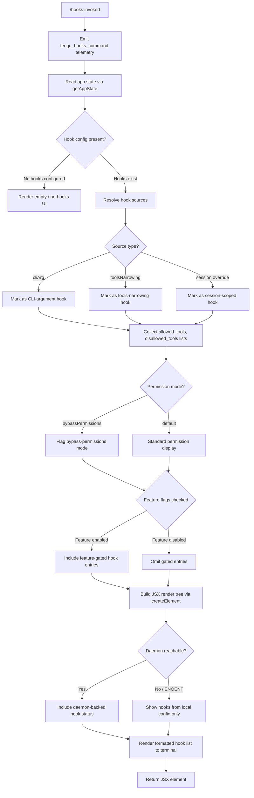

# `/hooks`

> Analysis basis: CC v2.1.169 bundle.js (AST extraction + Claude interpretation)
> Minimum version: v2.1.169

---

## Overview

The `/hooks` command displays the current hook configurations that govern how Claude Code responds to tool lifecycle events (such as pre-tool, post-tool, and notification triggers). It reads the active application state and renders a structured, read-only view of all configured hooks — including their source (CLI argument, settings file, or session override), scope, and enabled/disabled status — directly in the terminal UI without modifying any state.

---

## Registration

| Field | Value |
|---|---|
| type | `local-jsx` |
| name | `hooks` |
| description | `View hook configurations for tool events` |
| immediate | `true` |
| module_id | `Z4K` |
| load_inline | `true` |
| loc_byte | `12627495` |
| loc_byte_end | `12627645` |
| loc_line | `8991` |
| arbor_handler.name | `sUf` |
| arbor_handler.fqn | `claude-2.1.169::sUf` |
| arbor_handler.kind | `AsyncFunction` |
| arbor_handler.resolution_path | `module_id` |
| arbor_handler.n_hits | `0` |

Analysis basis: CC v2.1.169 bundle.js:+12627495

---

## Input Branching

The command has several distinct branches depending on the state of hook configurations, feature flags, and daemon connectivity. A Mermaid flowchart is used.



---

## Behavioral Spec

### Entry Point — Main Handler (`sUf`)

The primary handler is the async function `sUf` (resolved via `module_id` → `Z4K`).

```
async function hooksCommandHandler(context):
    emit telemetry("tengu_hooks_command")          // bundle.js:+12627295
    appState = await getAppState(context)           // bundle.js:+12627327
    hookEntries = resolveHookDisplay(appState)      // bundle.js:+12627335
    element = createElement(HooksView, hookEntries) // bundle.js:+12627365
    return element
```

Analysis basis: CC v2.1.169 bundle.js:+12627293

---

### App State Resolution (`u_`)

The `getAppState` accessor (reached via `u_`) extracts several named fields from the current session state:

```
function getAppState(context):
    state = H.getAppState(context)                  // bundle.js:+10581062
    workingDir  = state["working_directory"]        // bundle.js:+10581167
    allowedTools = state["allowed_tools"]           // bundle.js:+10581222
    disallowedTools = state["disallowed_tools"]     // bundle.js:+10581277
    avoidPrompts = state["avoid_prompts"]           // bundle.js:+10581338
    permissionMode = state["permission_mode"]       // bundle.js:+10581440
    bypassPermissions = state["bypassPermissions"]  // bundle.js:+10581471
    sessionInfo = state["session"]                  // bundle.js:+10581770
    effort = state["effort"]                        // bundle.js:+10581795
    modelName = state["model"]                      // bundle.js:+10581808
    maxThinkingTokens = state["max_thinking_tokens"]// bundle.js:+10581820
    flagSettings = state["flag_settings"]           // bundle.js:+10581846
    return assembled state snapshot
```

Analysis basis: CC v2.1.169 bundle.js:+10581062

---

### Hook Source Classification (`e9H` / `GS6`)

Hook entries are filtered and classified by their declared source type:

```
function classifyHookSources(rawHooks):
    filtered = rawHooks.filter(isValidHookEntry)    // bundle.js:+10069068
    for each hook in filtered:
        source = resolveHookSource(hook)            // bundle.js:+10069083
        if source == "cliArg":                      // bundle.js:+10987676
            hook.sourceLabel = "CLI argument"
        elif source == "toolsNarrowing":            // bundle.js:+10987697
            hook.sourceLabel = "tools narrowing"
        elif hook.status == "blocked":              // bundle.js:+10069129
            hook.sourceLabel = "blocked"
        elif hook.verdict == "deny":                // bundle.js:+10986936
            hook.sourceLabel = "deny"
        else:
            hook.sourceLabel = "settings"
    return classified hooks
```

Analysis basis: CC v2.1.169 bundle.js:+10069068

---

### Hook Display Rendering (`lN`)

The rendering function aggregates all hook data into a structure suitable for JSX output:

```
function buildHookDisplay(appState):
    displayItems = []

    // Render individual tool-event hooks
    for each hookConfig in appState.hooks:
        entry = renderHookEntry(hookConfig)         // bundle.js:+10069766
        displayItems.push(entry)                    // bundle.js:+10069838

    // Resolve permission state display
    permState = resolvePermissions(appState)        // bundle.js:+10069867

    // Resolve hook event subscriptions
    hookEvents = resolveHookEvents(appState)        // bundle.js:+10069889

    // Resolve session-level overrides
    sessionOverrides = resolveSessionOverrides(appState) // bundle.js:+10069904

    // Resolve additional named hook entries
    namedEntries = resolveNamedEntries(appState)    // bundle.js:+10069916

    displayItems.push(...namedEntries)              // bundle.js:+10069976

    // Gather extra context items
    contextItem = buildContextEntry(appState)       // bundle.js:+10070074

    // Check feature flags
    featureFlagEnabled = $K.isEnabled(...)          // bundle.js:+10070143
    if featureFlagEnabled:
        flaggedItems = appState.hooks
            .filter(isFeatureFlagHook)              // bundle.js:+10070219
            .map(renderFlaggedHook)                 // bundle.js:+10070262

    // Check O feature flag
    oFlagEnabled = O.isEnabled(...)                 // bundle.js:+10070273

    // Check include-list membership
    inIncludeList = $.includes(...)                 // bundle.js:+10070360

    return displayItems
```

Analysis basis: CC v2.1.169 bundle.js:+10069766

---

### Individual Hook Entry Rendering (`cG`)

Each hook entry is rendered using identity, scope, and daemon state:

```
function renderHookEntry(hook):
    hookId = id(hook)                               // bundle.js:+4860242
    label  = SK(hook)                               // bundle.js:+4860259
    scope  = _6(hook)                               // bundle.js:+4860304
    // Emit feature-flag telemetry for scope type
    if scope == "cli":                              // bundle.js:+4860394
        emit("tengu_slate_harbor")
    elif scope == "remote":                         // bundle.js:+4860405
        emit("tengu_slate_harbor")
    daemonStatus = D6(hook)                         // bundle.js:+4860421
    return { hookId, label, scope, daemonStatus }
```

Analysis basis: CC v2.1.169 bundle.js:+4860242

---

### Permission / Bypass-Permissions Mode (`Jb`)

When `bypassPermissions` is active in the app state, a special path fires:

```
function handlePermissionMode(appState):
    if appState.permissionMode == "bypassPermissions":
        emit("tengu_disable_bypass_permissions_mode") // bundle.js:+4227303
        D6(appState)                                  // bundle.js:+4227300
        FA(appState, "disable")                       // bundle.js:+4227350, literal "disable":+4227404
```

Analysis basis: CC v2.1.169 bundle.js:+4227300

---

### Daemon Status Integration (`D6` / `VL8`)

Hook display can incorporate daemon process state:

```
function resolveDaemonStatus(hook):
    init HP6, _P6 structs                          // bundle.js:+3250805, +3250842
    tu(hook)                                       // bundle.js:+3250877
    if qJH.has(hook.id):                           // bundle.js:+3250894
        cached = VL8(hook)                         // bundle.js:+3250905
        // VL8 checks zG_ set, reads from qJH map, adds to zG_, emits sub-event
        return cached
    tX6.add(hook.id)                               // bundle.js:+3250917
    if sB.has(hook.id):                            // bundle.js:+3250931
        existing = sB.get(hook.id)                 // bundle.js:+3250948
        y6(existing)                               // bundle.js:+3250968
    return resolved status
```

Analysis basis: CC v2.1.169 bundle.js:+3250805

---

### Hook Source Resolution (`N` / `ItK`)

The hook-source resolver normalises hook definitions into display records:

```
function resolveHookSource(rawHook):
    if rawHook.level == "debug":                   // bundle.js:+208891
        specialHandler = ItK(rawHook)              // bundle.js:+208933
        // ItK calls RI, fZA, vGA internally
    isIncluded = H.includes(rawHook.type)          // bundle.js:+208955
    formatted  = CH(rawHook)                       // bundle.js:+208973
    // CH calls JSON.stringify internally           // bundle.js:+187585
    upper      = _.toUpperCase(rawHook.name)       // bundle.js:+209017
    truncated  = R4(upper)                         // bundle.js:+209037
    trimmed    = H.trim(upper)                     // bundle.js:+209040
    label      = $h(trimmed)                       // bundle.js:+209056
    sanitised  = rBH(label)                        // bundle.js:+209062
    // rBH calls lEA                               // bundle.js:+195686
    scoped     = StK(sanitised)                    // bundle.js:+209076
    return scoped
```

Analysis basis: CC v2.1.169 bundle.js:+208915

---

### Bootstrap / Remote Config Fetch (`H` module)

When hook configuration requires remote data, a bootstrap fetch is issued:

```
function bootstrapFetch(url):
    log("[Bootstrap] Fetching", url)               // literal:+16097956
    response = MA.get(url, {                       // bundle.js:+16097992
        headers: {
            "Content-Type": "application/json",    // literal:+16098041, +16098056
            "User-Agent": ...                      // literal:+16098075
        },
        timeout: 5000                              // literal:+16098157
    })
    if parse fails:
        emit("api_bootstrap_fetch", "parse_failed")// literals:+16098278, +16098300
    else:
        log("[Bootstrap] Fetch ok")                // literal:+16098330
    return parsed data
```

Analysis basis: CC v2.1.169 bundle.js:+16097954

---

### Daemon Control Display (`z` / `SH` / `bH` / `rh` / `PU`)

The `/hooks` command also surfaces daemon control state for context:

```
function renderDaemonControlSection():
    // Stop success path
    SH → emits "daemon_stop"                       // literal:+16543477
    // Stop failure path
    bH → emits "daemon_stop_failed"                // literal:+16543514
    // Daemon control event
    rh → emits "tengu_daemon_control"              // bundle.js:+16543552
    // firstParty hooks flagged
    aIH → type "firstParty"                        // literal:+16543915
    // Race / shutdown path
    PU → Promise.race / Promise.all                // bundle.js:+16538551, +16538565
    PU → process.exit on timeout                   // bundle.js:+16538634
    // Timeout constant: 500 ms                    // literal:+16538595
```

Analysis basis: CC v2.1.169 bundle.js:+16543474

---

## State & Side Effects

| Item | Detail |
|---|---|
| Telemetry — primary | `tengu_hooks_command` (bundle.js:+12627295) — fired on every `/hooks` invocation |
| Telemetry — feature sad | `tengu_feature_sad` (bundle.js:+1014069) — fired when a feature check returns a negative/sad result |
| Telemetry — feature ok | `tengu_feature_ok` (bundle.js:+1013926) — fired when a feature check passes |
| Telemetry — feature bad | `tengu_feature_bad` (bundle.js:+1013988) — fired when a feature check encounters an error |
| Telemetry — bypass permissions | `tengu_disable_bypass_permissions_mode` (bundle.js:+4227303) — fired when bypass-permissions mode is detected active |
| Telemetry — slate harbor | `tengu_slate_harbor` (bundle.js:+4860424) — fired during hook-entry scope resolution |
| Telemetry — daemon config reload | `tengu_daemon_config_reload` (bundle.js:+16521994) — fired when daemon config is refreshed during display |
| Telemetry — workflows enabled | `tengu_workflows_enabled` (bundle.js:+4213671) — fired when the workflows feature flag is enabled |
| Telemetry — cobalt ridge | `tengu_cobalt_ridge` (bundle.js:+4856566) — fired during platform-specific hook path (Windows branch noted at literal:+4856472) |
| Telemetry — daemon control | `tengu_daemon_control` (bundle.js:+16543552) — fired on daemon control sub-operations |
| Telemetry — amber flint | `tengu_amber_flint` (bundle.js:+6892009) — fired during agent-teams hook path |
| Hook registration | Read-only display; no new hooks are registered by this command |
| appState changes | None — `/hooks` is a read-only inspection command; `immediate: true` means it runs without a full agent turn |
| Sound | None detected in depth-2 traversal |
| Daemon interaction | Reads `daemon.status.json` (literal:+12902901) via `D3K` for live status; falls back gracefully on `ENOENT` (literal:+13090680) |
| Filesystem | May read hook script files via `StK` path which calls `Buffer.byteLength` (bundle.js:+208611) and `P6H.dirname` (bundle.js:+208436) |

---

## Version History

| Version | Change |
|---|---|
| v2.1.169 | Initial analysis |

---

## Common Mistakes

1. **Expecting `/hooks` to modify hook state** — This command is strictly read-only (`immediate: true`). To add or change hooks, edit the Claude Code settings file or pass CLI arguments; `/hooks` only displays what is currently configured.
2. **Confusing hook source labels** — Hooks sourced from `cliArg` vs `toolsNarrowing` vs session overrides are displayed with distinct labels. A hook that appears "blocked" is not the same as one set to "deny"; these are separate source-classification branches.
3. **Assuming daemon connectivity is required** — The command gracefully handles `ENOENT` from `daemon.status.json`. If the daemon is not running, local configuration hooks are still shown; only daemon-backed status fields will be absent.
4. **Expecting feature-gated hooks to appear for all users** — Certain hook entries are rendered only when internal feature flags (checked via `$K.isEnabled` and `O.isEnabled`) are active. These entries will not appear in standard deployments.
5. **Misreading the `bypassPermissions` display** — When `bypassPermissions` mode is active, the command emits a dedicated telemetry event and the display includes a specific permission-mode indicator. This does not mean `/hooks` is performing any permission change.

---

## Appendix — Identifier Mapping

> For bundle debugging only. Identifiers change across versions.

| Identifier | Role |
|---|---|
| `sUf` | Main async handler for `/hooks` command (AsyncFunction, module Z4K) |
| `d` | Telemetry dispatch helper |
| `u_` | App-state accessor (`getAppState` wrapper) |
| `H` | General utility / state container object |
| `N` | Hook-source resolver / normaliser |
| `ItK` | Debug-level hook handler |
| `CH` | Hook formatter (calls `JSON.stringify`) |
| `R4` | String truncation / path abbreviation utility |
| `rBH` | Label sanitiser (calls `lEA`) |
| `StK` | Scoped hook resolver (reads file system, calls `Buffer.byteLength`) |
| `P$` | App-state sub-field accessor |
| `w2_` | String parsing utility (split / trim / indexOf / slice) |
| `q` | Generic data node / stream object |
| `u6H` | Set-membership check helper (`vO4.has`) |
| `n3` | String replace utility |
| `M9` | Model-name resolution dispatcher |
| `Cc` | Model-name parser (dispatches `tY`, `pU`, `FA`, `CC`) |
| `c9` | Model-name normaliser (lowercase, replace, trim) |
| `eD` | Extended model descriptor builder |
| `o6` | Feature-flag evaluation entry point |
| `K6` | Feature-flag core evaluator |
| `A` | Array-like result accumulator |
| `f` | Stream / connection object |
| `L` | Pending-operation set manager |
| `US8` | Allowed-tools list builder |
| `BS8` | Disallowed-tools list builder |
| `L1` | Tool-list construction helper |
| `Jb` | Permission-mode handler (bypass-permissions path) |
| `D6` | Daemon status resolver |
| `HP6` | Daemon status init struct A |
| `_P6` | Daemon status init struct B |
| `tu` | Daemon status pre-check |
| `VL8` | Cached daemon status lookup (uses `zG_` set, `qJH` map) |
| `y6` | Daemon event emitter with timestamp (`Date.now`) |
| `lN` | Hook display builder (aggregates all display items) |
| `cG` | Individual hook entry renderer |
| `id` | Hook identity extractor |
| `SK` | Hook label formatter |
| `_6` | Hook scope extractor |
| `Y` | Supervisor/output stream manager |
| `ITH` | Terminal output writer (handles `ENOENT`) |
| `C9` | AsyncLocalStorage store accessor |
| `E8` | Output encoding helper |
| `N$A` | Output formatting helper |
| `EH` | String coercion for output |
| `K` | Column-width / padding calculator |
| `BOK` | Table layout builder (`Math.max`) |
| `T` | Spinner / progress indicator |
| `OZ6` | Spinner stop variant A |
| `M76` | Spinner stop variant B |
| `E` | Display bounds manager (`Math.max`, `Math.min`) |
| `G` | Connection state machine (`connected`, `failed`) |
| `edK` | Heartbeat handler |
| `W_H` | Heartbeat implementation |
| `V` | Secondary display element |
| `k6A` | Hook-event subscription builder |
| `x_` | Module-export registrar (`__esModule` flag setter) |
| `YB6` | Bound callback factory |
| `RP` | Permissions display builder |
| `U38` | Permission entry renderer A |
| `bZ` | Permission entry renderer B |
| `x$9` | Permission check dispatcher |
| `b9` | Permission rule evaluator (`allow_product_feedback`) |
| `zI_` | Workflow permission resolver (`allow_workflows`) |
| `BiL` | Workflow permission entry builder |
| `UiL` | Permission entry renderer C |
| `e9H` | Hook-source filter and classifier |
| `GS6` | Hook-source resolution coordinator |
| `zQ` | Flat-map hook sources (`$C8.flatMap`) |
| `J9A` | Individual hook-source resolver (`Kz6`, `Lz6`, `WYH`, `f9_`, `dZ`) |
| `AFq` | Hook-source aggregator |
| `y6A` | Session-override hook resolver |
| `kb` | Session hook entry builder |
| `n4` | Named hook entry resolver |
| `z` | Daemon control display section builder |
| `SH` | Daemon-stop-success renderer |
| `bH` | Daemon-stop-failure renderer |
| `rh` | Daemon control event emitter |
| `su` | Daemon sub-process status reader |
| `aIH` | First-party hook tagger |
| `MG_` | Daemon message generator (uses `LG_.randomUUID`) |
| `PU` | Shutdown race / timeout handler (`process.exit`) |
| `v7H` | Daemon shutdown initiator |
| `R7H` | Timeout cleanup (`clearTimeout`) |
| `a8` | Promise timeout wrapper (`setTimeout`, `clearTimeout`) |
| `eg` | Extended hook display coordinator |
| `QP` | Path-qualified hook entry builder |
| `dn8` | Path utility for hook entries |
| `PJ` | Hook parameter formatter |
| `H96` | Hook header renderer |
| `Kq` | Agent-teams hook builder (`--agent-teams` flag) |
| `XG7` | Agent-teams configuration accessor |
| `ZMf` | Hook variant renderer A |
| `VMf` | Hook variant renderer B |
| `wN` | Provider-aware hook renderer |
| `pS_` | Provider mode resolver (`standard`, `tst`, `tst-auto`) |
| `YA` | Cloud-provider hook renderer (`bedrock`, `foundry`, etc.) |
| `$f` | Fallback hook renderer |
| `v4` | Feature-flag existence check |
| `O` | Secondary feature-flag evaluator |
| `S8` | Feature-flag state store |
| `$` | Include-list container |
| `D3K` | Daemon status JSON reader (`daemon.status.json`) |
| `Oa` | Status JSON parser |
| `tx6` | Status file path builder |

---

Note: index built via Arbor fallback; some signals (telemetry, literals) may be missing — see arbor-fallback.js.