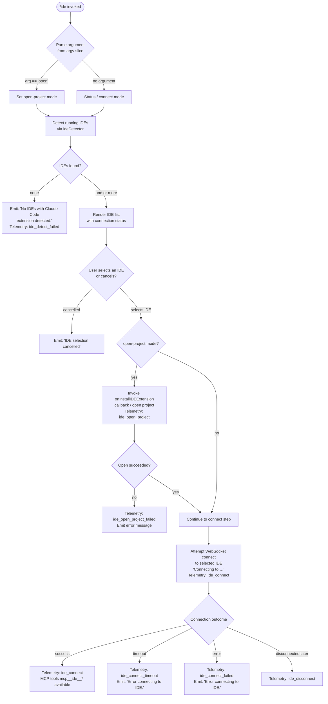

# `/ide`

> Analysis basis: CC v2.1.169 bundle.js (AST extraction + Claude interpretation)
> Minimum version: v2.1.169

---

## Overview

The `/ide` command manages IDE integrations for Claude Code by detecting running IDEs that have the Claude Code extension installed, optionally opening the current project in a selected IDE, and establishing a live MCP-over-WebSocket connection to that IDE. It renders a JSX status panel showing detected IDEs, their connection states, and actions the user can take.

---

## Registration

| Field | Value |
|---|---|
| type | `local-jsx` |
| name | `ide` |
| description | `Manage IDE integrations and show status` |
| argumentHint | `[open]` |
| module_id | `Brq` |
| load_inline | `true` |
| loc_byte | `11703415` |
| loc_byte_end | `11703571` |
| loc_line | `7585` |
| arbor_handler.name | `gNf` |
| arbor_handler.fqn | `claude-2.1.169::gNf` |
| arbor_handler.kind | `AsyncFunction` |
| arbor_handler.resolution_path | `module_id` |
| arbor_handler.n_hits | `0` |

Analysis basis: CC v2.1.169 bundle.js:+11703415

---

## Input Branching

The command has five or more distinct execution branches depending on the subcommand argument, the number of IDEs detected, the user's selection, and whether the connection succeeds. A Mermaid flowchart is used.



Analysis basis: CC v2.1.169 bundle.js:+11699531, +11699639, +11699748, +11699886, +11700084, +11701634, +11701721, +11701828, +11702327

---

## Behavioral Spec

### 1. Entry Point — Handler `gNf`

The Arbor-resolved handler `gNf` is an `AsyncFunction` reached via the `module_id → Brq` resolution path.

```
async function ideCommandHandler(appState, args):
    emit telemetry("tengu_ext_ide_command")          // +11699533
    subcommand = args[0]                              // argv slice +11699531

    if subcommand == "open":
        openProjectMode = true
    else:
        openProjectMode = false

    ideList = await detectRunningIDEs()               // calls ideDetector (YJ8)
    if ideList is empty:
        display("No IDEs with Claude Code extension detected.")  // +11699748
        return

    selectedIDE = await promptUserToSelectIDE(ideList)
    if selectedIDE is null:
        display("IDE selection cancelled")            // +11702797
        return

    if openProjectMode:
        result = await openProjectInIDE(selectedIDE) // calls eu_ / fX7
        if result.failed:
            telemetry("ide_open_project_failed")      // +11700191
            display(errorMessage)
            return
        telemetry("ide_open_project", {type: worktreeOrProject})  // +11700084,+11700118,+11700129

    await connectToIDE(selectedIDE)
```

Analysis basis: CC v2.1.169 bundle.js:+11699531–+11700724

---

### 2. IDE Detection — `ideDetector` (maps to `YJ8`)

```
async function detectRunningIDEs(currentWorkingDir):
    // Parallel scan: per-user config directories + running-process heuristic
    candidates = await Promise.all([
        scanIDEInstallDirectories(),   // zJ8 — filesystem walks
        detectFromRunningProcesses(),  // aj7 → rO_ — process table scan
    ])

    results = []
    for each candidate in flatten(candidates):
        port = parseInt(candidate.portHint)
        if port is valid:
            normalized = normalizePath(candidate.path)  // GN.resolve +6525253
            if platform == "win32":
                normalized = applyWindowsPathFixes(normalized)  // K.replace +6525453
            results.push(normalized)

    // Filter out WSL system users from Windows paths
    filtered = results.filter(not in ["/mnt/c/Users/Public", "Default", "Default User", "All Users"])
    // +6523020, +6523039, +6523059, +6523084

    return filtered
```

Analysis basis: CC v2.1.169 bundle.js:+6524835–+6526232

---

### 3. Running-Process IDE Scan — `processScanner` (maps to `rO_`)

```
function scanRunningProcessesForIDEs():
    // On Linux: shell out to ps aux with grep pattern  +6529560
    // Pattern covers: code, cursor, windsurf, devin-desktop, IntelliJ family, fleet, etc.
    rawOutput = execSync("ps aux | grep -E \"code|cursor|windsurf|...\" | grep -v grep")

    lines = rawOutput.split("\n")
    for each line:
        if matches JetBrains pattern:  // +6521285
            record JetBrains entry
        elif matches VSCode/Cursor/Windsurf pattern:
            record VS-Code-family entry
        elif matches Devin Desktop:    // "Devin Desktop" +6527980
            record Devin entry

    return entries
```

Recognized IDE name tokens (from literals): `windsurf` (+6527660), `devin` (+6527684), `cursor` (+6527724), `insiders` (+6527764), `vscode` (+6527789), `vs code` (+6527811), `visual studio code` (+6527834), `vscodium` (+6527868), `code - oss` (+6527892), `codium` (+6528111), `jetbrains` (+6521285).

Analysis basis: CC v2.1.169 bundle.js:+6529534–+6529988

---

### 4. IDE Name Normalization — `ideNameNormalizer` (maps to `DJ8`)

```
function normalizeIDEName(rawName):
    lower = rawName.toLowerCase()            // +6528073
    basename = path.basename(rawName)        // +6528165
    if lower includes "codium":   return "vscodium"
    if lower includes "cursor":   return "cursor"
    if lower includes "windsurf": return "windsurf"
    if lower includes "devin":    return "devin"
    if lower includes "insiders": return "insiders"
    // fallback: return capitalized form "IDE"  // +6530399
    return "IDE"
```

Analysis basis: CC v2.1.169 bundle.js:+6528073–+6528226

---

### 5. Connection Phase — `ideConnector` (maps to `Urq` React component + `b8`)

The connection phase is rendered as a live JSX component (`Urq`) that manages React state.

```
function IDEConnectionPanel(props):
    [status, setStatus] = useState("pending")     // +11701417, "pending" +11701590
    ideRef = useRef()
    mcpClientRef = useRef()

    useEffect():
        // Attempt socket connection to selected IDE
        display("Connecting to <ideName>")          // "Connecting to " +11702664
        client = await connectMCPOverWebSocket(idePort)   // b8 → gVH (MCP client factory)

        on success:
            setStatus("connected")
            telemetry("ide_connect")                // +11701634
            // MCP tools prefixed "mcp__ide__" become available  // +11702224

        on timeout:
            setStatus("failed")
            telemetry("ide_connect_timeout")        // +11701828
            display("Error connecting to IDE.")     // +11701946

        on error:
            setStatus("failed")
            telemetry("ide_connect_failed")         // +11701721
            display("Error connecting to IDE.")

        on disconnect after success:
            telemetry("ide_disconnect")             // +11702327

    useCallback(handleIDESelection, [...deps])
    // Filters MCP tools with prefix "mcp__ide__"  // J.startsWith +11702431

    render IDEStatusPanel with:
        - list of detected IDEs (L.filter +11701079)
        - current connection status
        - "restart your IDE" hint when relevant     // +11700749
        - WS URL shown as "ws:..." prefix           // +11702444
```

Analysis basis: CC v2.1.169 bundle.js:+11701417–+11702585

---

### 6. MCP Client Factory — `mcpClientFactory` (maps to `gVH`)

```
async function createMCPClient(connectionParams):
    // Validates connection type: "sse-ide" | "ws-ide"  // +6687880, +6687916
    client = await openSocketConnection(params)
    if connection fails immediately:
        return Promise.reject(connectionError)      // +1094355
    register client with lifecycle hooks            // HUA.bind, _UA.bind +1094583,+1094622
    return client
```

Analysis basis: CC v2.1.169 bundle.js:+1094189–+1095221

---

### 7. Open-Project Sub-path — `openProjectInIDE` (maps to `eu_` → `fX7`)

```
async function openProjectInIDE(ideHandle, projectPath):
    // Resolve the project root path (normalize NFC)  // "NFC" +11703014
    entries = Object.entries(ideHandle.capabilities)  // fX7 +6528964
    // Check if IDE supports "open project" capability
    if not supported:
        return {success: false, reason: "unsupported"}

    result = await ide.openFolder(projectPath)
    telemetry("ide_open_project", {
        type: isWorktree ? "worktree" : "project"   // +11700118, +11700129
    })
    return result
```

Analysis basis: CC v2.1.169 bundle.js:+6528638–+6529988, +11700084–+11700191

---

### 8. Display Helpers — `ideListFormatter` (maps to `y4A`)

```
function formatIDEList(ideNames, maxDisplay):
    // maxDisplay derived from Math.floor calculation  // +11702977
    // Normalizes paths with NFC  // +11703002
    // Joins first N names with ", "  // +11703171
    // Appends ", …" if list was truncated  // +11703185
    // Numeric constants: 100 (+11702873), 0 (+11702892), 3 (+11702946)
    return formattedString
```

Analysis basis: CC v2.1.169 bundle.js:+11702873–+11703185

---

## State & Side Effects

| Item | Detail |
|---|---|
| Telemetry: `tengu_ext_ide_command` | Fired immediately on command entry (bundle.js:+11699533) |
| Telemetry: `ide_detect` | Fired after successful IDE detection run (literal +6526190) |
| Telemetry: `ide_detect_failed` | Fired when no IDEs are found (literal +6526254) |
| Telemetry: `ide_open_project` | Fired on successful IDE project open (literal +11700084) |
| Telemetry: `ide_open_project_failed` | Fired on IDE project open failure (literal +11700191) |
| Telemetry: `ide_connect` | Fired on successful MCP connection to IDE (literal +11701634) |
| Telemetry: `ide_connect_failed` | Fired on connection error (literal +11701721) |
| Telemetry: `ide_connect_timeout` | Fired when connect times out (literal +11701828) |
| Telemetry: `ide_disconnect` | Fired when IDE disconnects after a successful session (literal +11702327) |
| MCP tool registration | On connection success, tools prefixed `mcp__ide__` are registered (+11702224) |
| appState changes | `onInstallIDEExtension` callback invoked when extension install is triggered (+11700658) |
| React state | `Urq` component manages `useState` for status: `"pending"` → `"connected"` / `"failed"` |
| Process scan side effect | On Linux, spawns `sh -c "ps aux | grep …"` subprocess (+6529560, +2257056, +2257062) |
| File system | Reads IDE config directories; resolves real paths via `jp9.realpath` (+6523381) |

---

## Version History

| Version | Change |
|---|---|
| v2.1.169 | Initial analysis |

---

## Common Mistakes

1. **Running `/ide open` outside a project directory**: The command resolves the project root from the current working directory. Running it from a non-project path may silently open an empty folder in the IDE rather than the intended workspace.
2. **Expecting instant MCP tool availability**: After `/ide` connects, the `mcp__ide__*` tools are registered asynchronously. Issuing tool calls immediately after the "connected" status appears may still fail if the IDE side hasn't finished handshaking.
3. **WSL path confusion**: The IDE detector explicitly excludes Windows system users (`Public`, `Default`, `Default User`, `All Users`) when scanning `/mnt/c/Users/*`. A custom user home path under `/mnt/c/Users/` that resembles one of these names could be misfiltered.
4. **Multiple IDEs of the same type**: If two instances of the same IDE are running, both will appear in the selection list. Selecting the wrong one produces a connection to the unintended IDE window without an error message — the connection will succeed but tools will target the wrong window.
5. **`/ide` without the extension installed**: The command reports "No IDEs with Claude Code extension detected." even if the IDE is running, because detection relies on a socket/port advertised by the extension, not on process name alone.

---

## Appendix — Identifier Mapping

> For bundle debugging only. Identifiers change across versions.

| Identifier | Role |
|---|---|
| `gNf` | Main async handler for `/ide` command (Arbor-resolved, `module_id: Brq`) |
| `y4A` | IDE list display formatter (truncates and joins IDE name list) |
| `YJ8` | IDE detector — top-level orchestrator (parallel filesystem + process scan) |
| `zJ8` | IDE detector — filesystem directory walker |
| `tj7` | IDE detector — per-directory stat and symlink resolver |
| `aj7` | IDE detector — running-process scan dispatcher |
| `rO_` | Running-process IDE scan (parses `ps aux` output) |
| `DJ8` | IDE name normalizer (maps process/path names to canonical IDE tokens) |
| `Zp9` | IDE inclusion check (checks if name is in known IDE list) |
| `eu_` | Open-project-in-IDE orchestrator |
| `fX7` | Open-project capability checker and executor |
| `V2` | MCP client constructor (wraps `gVH`) |
| `gVH` | Low-level MCP client factory (socket lifecycle, auth, capability negotiation) |
| `b8` | IDE MCP session wrapper (calls `U_` for session, `C6` for config) |
| `U_` | Generic MCP session bootstrap |
| `Urq` | React JSX component rendering IDE connection panel |
| `j6` | App-state store hook (reads current app state via `useSyncExternalStore`) |
| `JA` | Variant app-state hook |
| `U7` | UI context hook (wraps `ffH.useContext`) |
| `xM` | Argument pre-processor / context reader called early in `gNf` |
| `C6` | Configuration accessor (also used by IDE command for workspace config) |
| `Wi6` | Async store getter (`Pi6.getStore`) |
| `G_` | Utility for resolving workspace root (`xZ`) |
| `OJ8` | IDE status display sub-component rendered inside `gNf` |
| `Vp9` | Path replacement utility for Windows-style IDE paths |
| `y0` | IDE basename extractor / display name formatter |
| `Wp9` | Process-kill utility used during IDE adoption (`process.kill`) |
| `mSH` | MCP server manager (starts/stops IDE-facing MCP connections) |
| `dXA` | MCP connection applier (reconciles config changes, calls `mSH` and `cd8`) |
| `cd8` | Applies a single MCP connection result to app state |
| `mw8` | MCP connection status filter (checks `EJ7` and `yu_` sets) |
| `M` | Top-level MCP manager (`mSH` + `cd8` orchestration) |
| `yn` | MCP server entry processor |
| `VV` | MCP slot key/value builder |
| `sw8` | MCP stdio/SSE connector |
| `tw8` | MCP WebSocket (ws-ide) connector |
| `yF9` | MCP post-connection handler |
| `uu_` | MCP error/status logger |
| `vF9` | MCP failure reporter |
| `EN` | MCP skills telemetry emitter (`tengu_mcp_skills`) |
| `D6` | Daemon process/session manager (used by background session subsystem) |
| `w` | Daemon client (manages background session spawn/claim/kill) |
| `uPA` | Daemon socket claim handler |
| `gPA` | Session lifecycle manager (roster, pins, file watching) |
| `jq` | Pin file reader/writer |
| `lq6` | Roster file watcher |
| `WQ` | Roster file parser |
| `Lj5` | Daemon protocol message dispatcher |
| `b` | Background session supervisor |
| `Y` | Session instance manager (start/stop/update) |
| `EH` | Error-to-string converter |
| `k8` | Filesystem error classifier |
| `E8` | Low-level error code extractor |
| `hH` | Log entry appender / error logger |
| `N` | Network/HTTP fetch wrapper (bootstrap fetcher) |
| `H` | Top-level bootstrap / fetch initiator |
| `CH` | JSON serializer wrapper |
| `_6` | String coercion utility |
| `SH` | Telemetry: `tengu_feature_ok` emitter |
| `bH` | Telemetry: `tengu_feature_bad` emitter |
| `d` | Telemetry: `tengu_feature_sad` emitter |
| `Z9` | Signal/hook registration (`ZGA.register`) |
| `StK` | Log/output streaming writer |
| `TBH` | Debounced batch output flusher |
| `_4H` | Output path join/write helper |
| `htK` | Append-file log writer |
| `Vo8` | Log file rotation helper |
| `MZA` | Log directory path builder |
| `rBH` | Output write dispatcher (`lEA`) |
| `lEA` | Low-level stream write (`H.write`) |
| `nmK` | Scheduled-task missed-event formatter |
| `zN` | Cron-expression parser |
| `mAH` | Scheduled task runner |
| `Y6H` | Task has-run check |