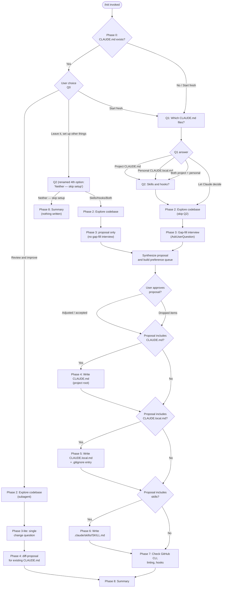

# `/init`

> Analysis basis: CC v2.1.169 bundle.js (AST extraction + Claude interpretation)
> Minimum version: v2.1.169

---

## Overview

The `/init` command bootstraps project configuration for Claude Code by guiding the user through a structured, multi-phase interview and then generating one or more of: a project-level `CLAUDE.md`, a personal `CLAUDE.local.md`, `.claude/skills/<name>/SKILL.md` skill files, and lifecycle hooks in `.claude/settings.json` or `.claude/settings.local.json`. It operates as a `prompt`-type command, meaning it constructs and sends a large instruction document to the agent via `getPromptForCommand`; the agent then drives all subsequent interaction and file-writing autonomously within that session.

---

## Registration

| Field | Value |
|---|---|
| type | `prompt` |
| name | `init` |
| description | `Initialize new CLAUDE.md file(s) and optional skills/hooks with codebase documentation \| Initialize a new CLAUDE.md file with codebase documentation` |
| loc_byte | `11726754` |
| loc_byte_end | `11727147` |
| loc_line | `7827` |
| handler_method | `getPromptForCommand` |
| handler_method_start | `11727070` |
| handler_method_end | `11727146` |
| prompt_body.length | `22519` characters total |
| prompt_body.trace | `conditional; identifier→lNf (var template, 20920 chars); identifier→cNf (var template, 1592 chars)` |
| arbor_handler.name | `getPromptForCommand` |
| arbor_handler.fqn | `claude-2.1.169::getPromptForCommand` |
| arbor_handler.kind | `Method` |
| arbor_handler.resolution_path | `direct` |
| arbor_handler.n_hits | `2` |

Analysis basis: CC v2.1.169 bundle.js:+11726754

---

## Input Branching

The command exhibits more than three distinct execution paths depending on the presence of an existing `CLAUDE.md` and the user's successive questionnaire answers. A Mermaid flowchart is used below.



Analysis basis: CC v2.1.169 bundle.js:+11726754 (prompt body routing logic)

---

## Behavioral Spec

### Phase 0 — Existence Check

```
function checkExistingClaudeMd():
    result = readFile("./CLAUDE.md")  // only project root counts
    return result.exists              // do NOT explore the directory tree
```

The agent executes a simple `cat ./CLAUDE.md` before asking any questions. The result gates which question path is taken in Phase 1.

Analysis basis: CC v2.1.169 bundle.js:+11726754

---

### Phase 1 — User Questionnaire

The agent prints a primer paragraph explaining CLAUDE.md files, Skills, and Hooks to first-time users before presenting questions.

```
function phase1_questionnaire(claudeMdExists):
    printPrimer()   // always shown as normal assistant text

    if claudeMdExists:
        answer0 = askUserQuestion(Q0_EXISTS_OPTIONS)
        // options: "Review and improve it" | "Leave it, set up other things" | "Start fresh (replace it)"
        route according to answer0
    else:
        answer1 = askUserQuestion(Q1_WHICH_FILES)
        // options: "Project CLAUDE.md" | "Personal CLAUDE.local.md"
        //          | "Both project + personal" | "Let Claude decide"
        if answer1 != "Let Claude decide":
            answer2 = askUserQuestion(Q2_SKILLS_AND_HOOKS)
            // options: "Skills + hooks" | "Skills only" | "Hooks only"
            //          | "Neither, just CLAUDE.md"
            // Q2 is a hint, not a filter
```

**Key constraint:** Q1 and Q2 must be issued as separate `AskUserQuestion` calls; they must not be combined in a single invocation. "Let Claude decide" skips Q2 entirely.

Analysis basis: CC v2.1.169 bundle.js:+11726754

---

### Phase 2 — Codebase Exploration (Subagent)

```
function phase2_explore():
    launch subagent to read:
        manifestFiles   = [package.json, Cargo.toml, pyproject.toml, go.mod, pom.xml, ...]
        docFiles        = [README, Makefile, CI config]
        aiRuleFiles     = [CLAUDE.md, .claude/rules/*, AGENTS.md,
                           .cursor/rules, .cursorrules,
                           .github/copilot-instructions.md,
                           .devin/rules/*, .windsurf/rules/*,
                           .windsurfrules, .clinerules, .mcp.json]

    detect:
        buildTestLintCommands   // especially non-standard ones
        languagesAndFrameworks
        projectStructure        // monorepo vs. single vs. multi-module
        codeStyleDifferences    // only rules differing from language defaults
        envVarsAndGotchas
        existingSkillsAndRules  // .claude/skills/, .claude/rules/
        formatterConfig         // prettier, biome, ruff, black, gofmt, rustfmt, ...
        gitWorktrees            // run `git worktree list` if personal file is requested

    record gaps = items that cannot be determined from code alone
    // gaps become interview questions in Phase 3
```

Analysis basis: CC v2.1.169 bundle.js:+11726754

---

### Phase 3 — Gap-Fill Interview and Proposal

```
function phase3_gapFill(q1Answer, gaps, phase2Findings):

    // "Review and improve" path: single change question only
    if reviewAndImprovePath:
        answer = askUserQuestion("Has anything changed about how the team works?",
                                 ["No, nothing's changed", "Yes — let me describe"])
        if answer == "Yes":
            collect freeTextDescription
        proceed to Phase 4 diff-proposal

    // Standard path
    if q1Answer in [PROJECT, BOTH, LET_CLAUDE_DECIDE]:
        askAbout(codebasePractices from gaps)
        // never mark options as "recommended"

    if q1Answer in [PERSONAL, BOTH]:
        askAbout(userRole, codebaseFamiliarity, sandboxURLs,
                 worktreeTopology if multipleWorktrees,
                 communicationPreferences)
        // never mark options as "recommended"

    proposal = synthesize(phase2Findings, gapAnswers)
    // classify each artifact: Hook | Skill | CLAUDE.md note

    printProposal(proposal)  // as plain assistant text, one bullet per item
    userResponse = askUserQuestion("Does this look right?",
                                   ["Looks good — proceed", "Drop the hook",
                                    "Drop the skill", ...])
    // tool auto-adds "Other" option

    preferenceQueue = buildQueue(acceptedProposal)
    // queue entries: {type, description, targetFile, phase2Details}
    return preferenceQueue
```

The proposal always lists CLAUDE.md file bullets first, then skills/hooks/notes. If the user's Q2 hint conflicts with what the codebase supports, the agent notes the deviation in one line and proposes the better-fitting artifacts anyway.

Analysis basis: CC v2.1.169 bundle.js:+11726754

---

### Phase 4 — Write CLAUDE.md

```
function phase4_writeClaudeMd(reviewAndImprovePath, preferenceQueue, phase2Findings):

    if reviewAndImprovePath:
        existing = readFile("./CLAUDE.md")
        diffs = compare(existing, phase2Findings, phase3LiteAnswer)
        printDiffs()   // each diff has a one-line reason
        confirm = askUserQuestion("Apply these edits?",
                                  ["Apply all", "Let me pick which", "Skip — leave it as is"])
        if confirm != "Skip":
            applySelectedDiffs()
        return

    // Standard path — every line must pass: "Would removing this cause mistakes?"
    content = compose(
        header: "# CLAUDE.md\n\nThis file provides guidance to Claude Code...",
        include: [nonStandardBuildTestLintCommands,
                  codeStyleDiffsFromDefaults,
                  testingQuirks,
                  repoEtiquette,
                  requiredEnvVars,
                  nonObviousGotchas,
                  importantAiToolConfigParts],
        exclude: [fileByFileStructure,
                  standardLanguageConventions,
                  genericAdvice,
                  longApiDocs,  // use @path/to/import syntax instead
                  frequentlyChangingInfo,
                  longTutorials,
                  commandsObviousFromManifest],
        notes: consumeNoteEntries(preferenceQueue, target="CLAUDE.md")
    )

    writeFile("./CLAUDE.md", content)

    // Suggest .claude/rules/ split for multi-concern projects
    // Offer sub-directory CLAUDE.md files for monorepos
```

Analysis basis: CC v2.1.169 bundle.js:+11726754

---

### Phase 5 — Write CLAUDE.local.md

```
function phase5_writeClaudeLocalMd(preferenceQueue, phase2Findings):

    if fileExists("./CLAUDE.local.md"):
        existing = readFile("./CLAUDE.local.md")
        proposeAdditions(existing)   // do NOT silently overwrite

    worktreeTopology = phase2Findings.worktreeTopology
    if worktreeTopology == SIBLING_OR_EXTERNAL:
        // write real content to home dir; stub file imports it
        writeFile("~/.claude/<project-name>-instructions.md", personalContent)
        writeFile("./CLAUDE.local.md", "@~/.claude/<project-name>-instructions.md")
        // NEVER put this import in the project CLAUDE.md
    else:
        content = compose(
            userRole,
            codebaseFamiliarity,
            personalSandboxURLs,
            personalWorkflowPreferences,
            notes: consumeNoteEntries(preferenceQueue, target="CLAUDE.local.md")
        )
        writeFile("./CLAUDE.local.md", content)

    addToGitignore("CLAUDE.local.md")
```

Analysis basis: CC v2.1.169 bundle.js:+11726754

---

### Phase 6 — Create Skills

```
function phase6_createSkills(preferenceQueue):

    // Consume queued skill entries first
    for each skillEntry in preferenceQueue where type == "skill":
        name = deriveNameFromPreference(skillEntry)
        body = composSkillBody(skillEntry.description, phase2Findings)
        if mapsToBundledSkill(skillEntry):
            notifyUser("bundled skill still exists; this one is additive")
        if underspecified(skillEntry):
            askFollowUp(skillEntry)
        skillMd = formatSkillFrontmatter(name, body)
        writeFile(".claude/skills/" + name + "/SKILL.md", skillMd)

    // Then suggest additional skills from phase2 findings
    for each discoveredWorkflow in phase2Findings.repeatableWorkflows:
        suggestSkill(name, purpose, whyItFitsThisRepo)

    // SKILL.md front-matter shape:
    // ---
    // name: <skill-name>
    // description: <what it does and when to use it>
    // ---
    // <Instructions for Claude>
    //
    // Add `disable-model-invocation: true` for side-effectful skills
    // Use $ARGUMENTS to accept runtime input
```

The agent checks `.claude/skills/` for existing skills and only proposes new, complementary ones; it never overwrites existing skill files.

Analysis basis: CC v2.1.169 bundle.js:+11726754

---

### Phase 7 — Additional Optimizations

```
function phase7_optimizations(preferenceQueue, phase2Findings, q1Answer):

    // GitHub CLI check
    ghPath = runCommand("which gh")  // or "where gh" on Windows
    if ghPath == null and projectUsesGitHub():
        askUserQuestion("Install GitHub CLI?", ["Yes", "No"])

    // Linting check
    if not phase2Findings.hasLintConfig:
        askUserQuestion("Set up linting?", ["Yes", "No"])

    // Hooks from preference queue
    hookEntries = preferenceQueue.filter(type == "hook")
    if hookEntries.empty and phase2Findings.formatterFound:
        offerFormatOnEditHook()   // fallback

    targetFile = selectHookTargetFile(q1Answer)
    // project → .claude/settings.json
    // personal → .claude/settings.local.json
    // "both" → ask once for all hooks

    for each hookEntry in hookEntries:
        event, matcher = mapPreferenceToEventMatcher(hookEntry)
        // "after every edit"         → PostToolUse, Write|Edit
        // "when Claude finishes"     → Stop
        // "before running bash"      → PreToolUse, Bash
        // "before committing" (literal git-commit gate) →
        //     NOT a hooks.json hook; route to .git/hooks/pre-commit / husky

        // Load hook reference ONCE per /init run:
        invokeTool("skill", {skill: "update-config",
                             args: "[hooks-only] " + oneLineSummary})

        // Follow "Constructing a Hook" flow:
        // dedup → construct → pipe-test raw → wrap → write JSON
        // → jq -e validate → live-proof → cleanup → handoff
        constructAndWriteHook(hookEntry, event, matcher, targetFile)

    // Act on each "yes" answer before proceeding
```

Analysis basis: CC v2.1.169 bundle.js:+11726754

---

### Phase 8 — Summary and Next Steps

```
function phase8_summary(writtenArtifacts, phase2Findings):

    printRecap(writtenArtifacts)   // which files, key points in each
    remindUser("/init can be run again anytime to re-scan")

    todoList = []

    if frontendFrameworkDetected(phase2Findings):
        todoList.append("/plugin install frontend-design@claude-plugins-official")
        todoList.append("/plugin install playwright@claude-plugins-official")

    if phase7GapsRejected:
        todoList.append(rejectedGitHubCLIItem)
        todoList.append(rejectedLintingItem)

    if testsSpareOrMissing(phase2Findings):
        todoList.append("Set up a test framework")

    // Always include these two:
    todoList.append("/plugin install skill-creator@claude-plugins-official")
    todoList.append("Browse official plugins with /plugin")

    printTodoList(sorted by impact descending, todoList)
```

Analysis basis: CC v2.1.169 bundle.js:+11726754

---

### Prompt Body Conditional Dispatch

The `getPromptForCommand` method does not return a static string. The bundle trace shows the body is resolved conditionally:

```
function getPromptForCommand(context):
    // Two template variables are referenced:
    //   primaryTemplate   (approx. 20,920 chars) — full 8-phase guided setup
    //   fallbackTemplate  (approx.  1,592 chars) — legacy minimal CLAUDE.md creation
    //
    // The method selects between them based on a runtime condition
    // (the exact condition predicate is not visible at depth-2 traversal).

    if condition:
        return primaryTemplate    // full interactive 8-phase flow
    else:
        return fallbackTemplate   // shorter "create CLAUDE.md" prompt

    // Return value type is always "text" (literal at bundle.js:+11727118)
```

The fallback template (1,592 chars) corresponds to the legacy instructions appended at the end of the full prompt body — it instructs the agent to analyze the codebase and produce a minimal `CLAUDE.md` with commands, architecture notes, and an appropriate file prefix, without the structured phase interview.

Analysis basis: CC v2.1.169 bundle.js:+11727070 (`handler_method_start`); prompt_body.trace conditional branch

---

### Onboarding Completion Signal

After the handler resolves the prompt text, the call graph shows a call to the project-completion telemetry helper (`WoH` → `SH`). This emits the `onboarding_project_complete` event (literal at bundle.js:+4042975) and writes the `CLAUDE.md` target path constant (`"CLAUDE.md"` at bundle.js:+4042463) and workspace string (`"workspace"` at bundle.js:+4042501) into state. A run-guide UI tip string — `"Run /init to create a CLAUDE.md file with instructions for Claude"` (bundle.js:+4042638) — is also registered under the key `"claudemd"` (bundle.js:+4042622), used to surface a first-run nudge when no `CLAUDE.md` exists.

Analysis basis: CC v2.1.169 bundle.js:+4042975

---

### Config Read/Write (Invoked by Handler Chain)

The handler chain invokes config persistence helpers (`UL8`, `qj`, `pL8`) which enforce several safety guards:

```
function saveConfigWithLock(configPath, newData):
    // Acquire lock; warn if acquisition exceeds 100 ms
    // (literal: "Lock acquisition took longer than expected..."
    //  bundle.js:+3272225; threshold: 100 ms at bundle.js:+3272219)

    reRead = readConfigFromDisk(configPath)

    if reRead.missingAuth and cache.hasAuth:
        // Refuse write; emit tengu_config_auth_loss_prevented
        // (literal: "saveConfigWithLock: re-read config is missing auth..."
        //  bundle.js:+3272641)
        return

    if staleness detected:
        emit("tengu_config_stale_write")

    writeAtomic(configPath, newData)
    // Uses temp file + rename via WO6 (atomic write helper)
    // Keeps up to 5 rolling backups (literal at bundle.js:+3273244)
    // Backup files named with ".backup." prefix (bundle.js:+3273111)
    // Backup directory: "backups" subdirectory (bundle.js:+3273826)

function readConfig(configPath):
    // Encoding: "utf-8" (bundle.js:+3274341)
    // On ENOENT: return empty/default config
    // On parse error: emit("tengu_config_parse_error") (bundle.js:+3274889)
    // Guard: throws if config accessed before initialization is allowed
    //   message: "Config accessed before allowed." (bundle.js:+3274258)
```

Lock contention is tracked via `tengu_config_lock_contention` (bundle.js:+3272314). The 60,000 ms (60 s) constant at bundle.js:+3272995 represents the maximum lock-wait timeout.

Analysis basis: CC v2.1.169 bundle.js:+3272086 through +3272995

---

## State & Side Effects

| Item | Detail |
|---|---|
| Telemetry: `tengu_config_parse_error` | Fired when the config JSON cannot be parsed during read (bundle.js:+3274889) |
| Telemetry: `tengu_config_lock_contention` | Fired when lock acquisition is slow (threshold: 100 ms; bundle.js:+3272314) |
| Telemetry: `tengu_config_stale_write` | Fired when a stale config write is detected (bundle.js:+3272450) |
| Telemetry: `tengu_config_auth_loss_prevented` | Fired when a write is refused because re-read config is missing auth (bundle.js:+3272793) |
| Telemetry: `tengu_feature_sad` | Fired on feature-flag negative path (bundle.js:+1014069) |
| Telemetry: `tengu_feature_ok` | Fired on feature-flag positive path (bundle.js:+1013926) |
| Telemetry: `tengu_slate_harbor_experiment` | Fired during A/B experiment evaluation in `dNf` handler branch (bundle.js:+11703645) |
| Telemetry: `onboarding_project_complete` | Fired after `/init` handler completes (bundle.js:+4042975) |
| Files written | `./CLAUDE.md`, `./CLAUDE.local.md`, `.claude/skills/<name>/SKILL.md`, `.claude/settings.json`, `.claude/settings.local.json` (conditional on user choices) |
| `.gitignore` modification | `CLAUDE.local.md` is added to `.gitignore` when Phase 5 runs |
| Config backups | Up to 5 rolling backups stored in the `backups/` subdirectory with `.backup.` filename prefix (bundle.js:+3273111, +3273244, +3273826) |
| Lock file | A filesystem lock is acquired before any config write; max wait 60,000 ms (bundle.js:+3272995) |
| Experiment / A/B state | `dNf` reads from `sB` (set/map) and `VL8` / `$G_` helpers; emits `growthbook_experiment` event (bundle.js:+3244573) |
| Run-guide nudge | Registers `"claudemd"` tip string in UI state (bundle.js:+4042622, +4042638) |
| Hook registration | Hooks written to `.claude/settings.json` or `.claude/settings.local.json`; validated with `jq -e` and live-proofed |
| Sound | None observed in traversal |

---

## Version History

| Version | Change |
|---|---|
| v2.1.169 | Initial analysis — full 8-phase interactive setup flow with conditional dispatch between primary (20,920-char) and fallback (1,592-char) prompt templates |

---

## Common Mistakes

1. **Combining Q1 and Q2 into a single `AskUserQuestion` call.** The prompt explicitly forbids this; Q2 must only be issued after the Q1 answer is received because "Let Claude decide" skips Q2 entirely.
2. **Exploring the directory tree before Phase 0.** The check must be a single `cat ./CLAUDE.md` on the project root; full tree exploration is reserved for Phase 2.
3. **Quoting the preference queue as a filter.** Q2 is a *hint*. The agent should propose artifacts that fit the codebase and note any deviation from the user's Q2 hint rather than silently omitting them.
4. **Silently overwriting CLAUDE.local.md.** If the file already exists the agent must read it, propose additions, and await confirmation.
5. **Putting the worktree import stub in the project CLAUDE.md.** The `@~/.claude/<project-name>-instructions.md` import must only ever appear in `CLAUDE.local.md`.
6. **Invoking the `update-config` skill multiple times per `/init` run.** The hook reference skill must be loaded exactly once; subsequent hooks within the same run reuse the loaded context.
7. **Writing a hooks.json hook for a literal `git commit` gate.** Matchers cannot filter Bash by command content; the correct artifact is a git pre-commit hook (or husky), not a `PreToolUse` hook.
8. **Including file-by-file structure, generic advice, or standard language conventions in CLAUDE.md.** Every line must pass the test: "Would removing this cause Claude to make a mistake?"

---

## Appendix — Identifier Mapping

> For bundle debugging only. Identifiers change across versions.

| Identifier | Role |
|---|---|
| `__handler_init` | Synthetic BFS entry point for the `/init` command handler |
| `WoH` | Onboarding completion orchestrator; calls file-path resolver, project-config saver, and emits completion signal |
| `kY` | File watcher + config reader coordinator |
| `y6` | Config file loader; calls filesystem read, file watcher setup, and date-stamp helpers |
| `l6` | Logging / diagnostic emit helper |
| `NG_` | Likely a normalization or null-guard utility |
| `y7H` | Config file read-and-parse core; handles ENOENT, EEXIST, UTF-8 reading, backup rotation |
| `jhL` | File watch registration helper (calls `xL8.watchFile` / `xL8.unwatchFile`) |
| `r59` | Project-config path resolver wrapper |
| `HN_` | Project root CLAUDE.md path constructor (uses `"CLAUDE.md"` literal) |
| `C6` | Path join utility wrapper |
| `mi6` | Module-level path helper |
| `qj` | Current-project config save orchestrator; calls atomic write, auth-loss guard, stale-write detection |
| `UL8` | Core config atomic write with lock, backup rotation, and auth-loss guard |
| `hT1` | Lock/metadata initialization helper |
| `N` | String normalization / platform detection utility (inspects uppercase, includes, trim) |
| `d` | Application state accessor / global app context |
| `E8` | Error classification helper |
| `ViH` | Auth-presence check helper (guards against wiping `~/.claude.json`) |
| `A` | Lowercase string normalizer |
| `CH` | JSON serializer wrapper (`JSON.stringify`) |
| `yG_` | Backup directory path constructor |
| `V` | File-entry value (used in directory-listing iteration) |
| `P` | Stream/buffer chunk assembler (Buffer.concat, subarray, timeout) |
| `E` | Slice/range math helper (Math.max, Math.min) |
| `WO6` | Atomic file write implementation (temp file → fchmod → fsync → rename) |
| `f` | Stream / file-descriptor lifecycle manager (close, open, finalize) |
| `H` | HTTP bootstrap fetch helper (Content-Type, User-Agent headers) |
| `P$` | HTTP request options builder |
| `w2_` | URL/header string parser (split, trim, indexOf, slice) |
| `u6H` | Feature-flag / allowlist membership checker |
| `n3` | String replace utility |
| `M9` | Model/capability selector (Cc, c9, eD calls) |
| `o6` | Feature-flag evaluation entry point; emits `tengu_feature_ok` / `tengu_feature_sad` |
| `OJH` | <!-- TODO: not found in depth-2 traversal; needs --depth 4 --> |
| `MP6` | Timestamp helper (wraps `Date.now`) |
| `pL8` | Per-project config save with auth-loss fallback guard |
| `SH` | Feature-flag / experiment state check that calls `d` (app state) and `K6` |
| `K6` | Core feature-flag resolver; calls `c76` |
| `c76` | Low-level feature-flag store accessor |
| `dNf` | A/B experiment dispatcher; reads experiment state via `VL8`, emits `tengu_slate_harbor_experiment` |
| `_6` | String coercion utility (wraps `String()`) |
| `D6` | Experiment variant resolver; consults `qJH`, `sB`, `tX6`, `y6` |
| `HP6` | <!-- TODO: not found in depth-2 traversal; needs --depth 4 --> |
| `_P6` | <!-- TODO: not found in depth-2 traversal; needs --depth 4 --> |
| `tu` | Experiment config reader (calls `su`) |
| `su` | Low-level experiment config accessor (calls `lC`) |
| `VL8` | Experiment variant cache lookup and set (uses `zG_`, `qJH` maps; calls `$G_`, `JG_`) |
| `$G_` | Experiment event emitter; emits `GrowthbookExperimentEvent`, calls `Ba.emit` |
| `JG_` | Experiment variant resolution logic (calls `vg1`, `d_`, `we1`, `u6H`) |

---

Note: index built via Arbor fallback; some signals (telemetry, literals) may be missing — see arbor-fallback.js.