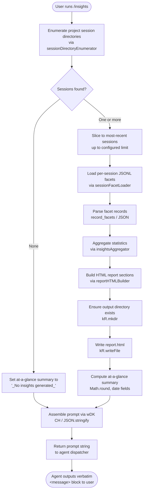

# `/insights`

> Analysis basis: CC v2.1.169 bundle.js (AST extraction + Claude interpretation)
> Minimum version: v2.1.169

---

## Overview

The `/insights` command generates a shareable HTML usage-report by scanning the local Claude Code session history stored in the facets directory, aggregating session metadata and activity into multiple analytical dimensions, writing the result to an `report.html` file, and then instructing the agent to present a ready-made confirmation message to the user along with an offer to discuss any section of the report.

---

## Registration

| Field | Value |
|---|---|
| type | `prompt` |
| name | `insights` |
| description | `Generate a report analyzing your Claude Code sessions` |
| loc_byte | `13310621` |
| loc_byte_end | `13311925` |
| loc_line | `10658` |
| handler_method | `getPromptForCommand` |
| handler_method_start | `13310795` |
| handler_method_end | `13311924` |
| prompt_body.length | `513` |
| prompt_body.trace | `call→wDK(...) (1 literals)` |
| arbor_handler.name | `getPromptForCommand` |
| arbor_handler.kind | `Method` |
| arbor_handler.resolution_path | `direct` |
| arbor_handler.fqn | `claude-2.1.169::getPromptForCommand` |
| arbor_handler.n_hits | `1` |

Analysis basis: CC v2.1.169 bundle.js:+13310621

---

## Input Branching

The handler executes a multi-stage pipeline before producing the prompt. Five or more distinct control-flow paths exist (session enumeration, per-session data loading, HTML report generation, file writing, and prompt assembly), so a Mermaid flowchart is used.



Analysis basis: CC v2.1.169 bundle.js:+13310801 (handler entry), +13297558 (session enumerator), +13298161 (facet loader), +13299095 (report builder), +13299843 (file write), +13311827 (prompt assembly)

---

## Behavioral Spec

### 1. Session Directory Enumeration

The handler first resolves the base facets directory path (sub-path `facets` under `usage-data`, itself under the Claude config root). It then reads all child entries and filters to keep only those that are directories, effectively identifying one folder per recorded project session.

```
function enumerateSessionDirectories(configRoot):
    usageDataPath = path.join(configRoot, "usage-data")
    facetsPath    = path.join(usageDataPath, "facets")
    entries       = fs.readdir(facetsPath)
    dirs          = entries.filter(entry => entry.isDirectory())
    dirs.sort(/* chronological or lexicographic */)
    return dirs
```

Analysis basis: CC v2.1.169 bundle.js:+13297166 (path join helper), +13297185 (readdir), +13297239 (filter), +13297489 (sort)

Literals referenced:
- Sub-directory name `"usage-data"` (bundle.js:+13236510)
- Sub-directory name `"facets"` (bundle.js:+13236560)
- Sub-directory name `"session-meta"` (bundle.js:+13236606)

---

### 2. Per-Session JSONL Facet Loading

For each session directory (after slicing to a bounded window — up to 50 most-recent per the `50` constant, retaining 200 items maximum in the broader result set), the loader scans files with a `.jsonl` extension, reads each file, parses every newline-delimited JSON record, and accumulates the results into a flat facet array.

```
function loadSessionFacets(sessionDirPath):
    files  = fs.readdir(sessionDirPath).filter(f => f.isFile() && hasJsonlExtension(f))
    stats  = await Promise.all(files.map(f => fs.stat(path.join(sessionDirPath, f))))
    facets = []
    for each file in files:
        raw    = fs.readdir / fs.stat result
        parsed = JSON.parse(raw)   // via jsonSafeParser
        facets.push(parsed records)
    return facets
```

Analysis basis: CC v2.1.169 bundle.js:+13386408 (readdir), +13386485 (isFile), +13386514 (`.jsonl` extension constant), +13386539 (extension test), +13386649 (Promise.all), +13386717 (stat), +13242658 (JSON parse hop)

Limits observed:
- Slice window lower bound: `50` (bundle.js:+13297577)
- Slice window upper bound: `200` (bundle.js:+13297582)
- Concurrent stat batch: governed by `Promise.all` over the file list

---

### 3. Insights Aggregation

The aggregation function (`insightsAggregator`, bundle identifier `DDK`) processes the loaded facet records across multiple analytical dimensions. It assigns records to time-of-day buckets, computes session durations, counts tool uses and errors, and builds structured data objects for each report section. Key dimensions found in literals:

- **Time-of-day buckets**: Morning (6–12), Afternoon (12–18), Evening (18–24), Night (0–6) (bundle.js:+13254576–+13254729)
- **Response-time buckets**: `2-10s`, `10-30s`, `30s-1m`, `1-2m`, `2-5m`, `5-15m`, `>15m` (bundle.js:+13253728–+13253788)
- **Tool error classification** uses a colour-coded scheme: `#dc2626` (errors), `#16a34a` (success), `#eab308` (warnings) (bundle.js:+13295109, +13295358, +13295851)
- **Session staleness threshold**: 1 800 000 ms (30 minutes) (bundle.js:+13244983)
- **Report token budget**: 4 096 characters for the HTML template context (bundle.js:+13244459)

```
function aggregateInsights(facets):
    sessionMap   = new Map()
    toolStats    = {}
    timeOfDay    = { morning: 0, afternoon: 0, evening: 0, night: 0 }
    responseBkts = initResponseTimeBuckets()
    for each facet in facets:
        classifyTimeOfDay(facet.timestamp, timeOfDay)
        updateResponseTimeBucket(facet.duration, responseBkts)
        accumulateToolUsage(facet, toolStats)
    summary = buildAtAGlanceSummary(sessionMap, toolStats)
    return { sessionMap, toolStats, timeOfDay, responseBkts, summary }
```

Analysis basis: CC v2.1.169 bundle.js:+13297711 (aggregator entry), +13298161 (facet loader call), +13298265 (HTML data builder), +13299478 (YDK statistics aggregation), +13299526 (Yof report aggregator)

---

### 4. HTML Report Generation

The report builder (`reportHTMLBuilder`, bundle identifier `Pof`) converts the aggregated data into a self-contained HTML document. It:

1. Escapes HTML entities using a helper (`&amp;`, `&lt;`, `&gt;`, `&quot;`, `&apos;`) (bundle.js:+5078877–+5079000)
2. Applies bold markup (`<strong>$1</strong>`) for emphasis (bundle.js:+13255434)
3. Renders bullet points as `• ` prefixed lines (bundle.js:+13255477)
4. Inserts `<br>` line breaks (bundle.js:+13255507)
5. Uses four chart colours: `#2563eb`, `#0891b2`, `#10b981`, `#8b5cf6` (bundle.js:+13291393–+13291846)
6. Renders empty-state placeholders such as `<p class="empty">No data</p>` and `<p class="empty">No tool errors</p>` (bundle.js:+13253219, +13295120)
7. Outputs `report.html` as the file name (bundle.js:+13299815)
8. Includes an "Add to CLAUDE.md" suggestion link inside the report (bundle.js:+13259072)
9. Maximum HTML content size: 8 192 characters (bundle.js:+13252897)

```
function buildHTMLReport(aggregated):
    html = renderHTMLTemplate(aggregated,
               chartColors   = ["#2563eb", "#0891b2", "#10b981", "#8b5cf6"],
               maxContentLen = 8192)
    html = escapeEntities(html)
    html = applyMarkupTransforms(html)   // bold, bullets, breaks
    return html
```

Analysis basis: CC v2.1.169 bundle.js:+13255362 (Pof entry), +13291371 (chart colour section), +13253079 (F$H content builder), +13255304 (Xof serialiser)

---

### 5. Report File Write

After HTML generation the handler ensures the output directory exists and writes the report. The output path is assembled from the `usage-data` base, a date-stamped sub-directory component built from the current date (year / month / day / hours / minutes / seconds), and the fixed file name `report.html`.

```
function writeReportFile(configRoot, html):
    now    = new Date()
    stamp  = formatDateStamp(now)   // YYYY/MM/DD/HH/MM/SS components
    outDir = path.join(configRoot, "usage-data", stamp)
    fs.mkdir(outDir, { recursive: true })
    fs.writeFile(path.join(outDir, "report.html"), html, "utf-8")
    return { reportUrl, htmlFilePath, facetsDir }
```

Analysis basis: CC v2.1.169 bundle.js:+13299556 (mkdir), +13299565 (Qu6 path helper), +13299647 (getFullYear), +13299668 (getMonth), +13299689 (getDate), +13299765 (path.join), +13299843 (writeFile), +13299815 (`"report.html"` constant)

---

### 6. Prompt Assembly and Agent Instruction

The `getPromptForCommand` method (resolved via Arbor as `claude-2.1.169::getPromptForCommand`, `direct` path) calls `wDK` to format the final prompt string (bundle.js:+13311827). The prompt:

1. States the user has just run `/insights`.
2. Embeds the full insights data object (JSON-serialised via `CH` / `JSON.stringify`) (bundle.js:+13311845).
3. Supplies the report URL, HTML file path, and facets directory as separate fields.
4. Provides an at-a-glance summary labelled as context **for the agent only** — the user has not yet seen any output.
5. Instructs the agent to output the text between `<message>` tags **verbatim** as its entire response, without omitting any line.
6. The `<message>` block announces that the shareable insights report is ready, provides the report location, and closes with an offer to explore sections or act on suggestions.
7. When no sessions are found the at-a-glance summary is set to the string `"_No insights generated_"` (bundle.js:+13311692), and the prompt proceeds with that value substituted.

```
function getPromptForCommand(context):
    reportData  = generateInsightsReport(context)   // DDK pipeline
    atAGlance   = reportData.summary ?? "_No insights generated_"
    promptText  = wDK(
        insightsData  = JSON.stringify(reportData),
        reportUrl     = reportData.url,
        htmlFile      = reportData.htmlFilePath,
        facetsDir     = reportData.facetsDir,
        atAGlance     = atAGlance
    )
    return promptText
```

Analysis basis: CC v2.1.169 bundle.js:+13310801 (handler entry), +13310894 (DDK call), +13311182 (Math.round usage), +13311827 (wDK prompt formatter), +13311845 (CH / JSON.stringify), +13311891 (yU8 path helper), +13311692 (`"_No insights generated_"` constant)

---

## State & Side Effects

| Item | Detail |
|---|---|
| File system reads | Reads session directories under `~/.config/claude/usage-data/facets/**/*.jsonl` |
| File system writes | Creates output directory (recursive `mkdir`) and writes `report.html` under `~/.config/claude/usage-data/<datestamp>/` |
| JSON parsing | Each `.jsonl` record is parsed individually; parse errors propagated via `jsonSafeParser` (`F6`) |
| Prompt body length | 513 characters (post-interpolation may be larger) |
| Telemetry | No `tengu_insights_*` event was found in the depth-2 traversal; nearby events listed below are from infrastructure reachable in the call graph but not directly attributed to this command |
| Nearby telemetry (infrastructure) | `tengu_mcp_skills` (bundle.js:+6566426), `tengu_transcript_phantom_parent` (bundle.js:+13372014), `tengu_chain_parent_cycle` (bundle.js:+13353528), `tengu_chain_timestamp_fallback` (bundle.js:+13353677) |
| Hook registration | None observed in depth-2 traversal |
| appState changes | None directly; report data is written to disk only |
| Sound | None observed |
| Agent output | Agent is constrained to reproduce the `<message>` block verbatim; no tool calls are expected |

---

## Version History

| Version | Change |
|---|---|
| v2.1.169 | Initial analysis |

---

## Common Mistakes

1. **Running `/insights` in a project with no recorded sessions**: The command will still complete but the at-a-glance summary will read `_No insights generated_` and the HTML report will contain empty-state placeholders (`<p class="empty">No data</p>`). This is expected behaviour, not an error.
2. **Expecting real-time or live data**: The report is generated from on-disk `.jsonl` facet files. Sessions that have not been flushed to disk yet will not appear.
3. **Large session counts causing slowness**: The aggregation pipeline caps the working set at 200 records (bundle.js:+13297582) and processes files concurrently with `Promise.all`, but very large facet directories may still introduce latency.
4. **Editing the report HTML manually**: The file is overwritten on each `/insights` invocation with a new date-stamped path, so local edits to a previous `report.html` are not affected but are also not carried forward.
5. **Assuming the agent will add commentary**: The prompt explicitly instructs the agent to output the `<message>` block verbatim. Any deviation from this is a model-level behaviour, not a feature of the command itself.
6. **Looking for the report in the project directory**: The report is written to the Claude config root under `usage-data/<datestamp>/report.html`, not to the current working directory.

---

## Appendix — Identifier Mapping

> For bundle debugging only. Identifiers change across versions.

| Identifier | Role |
|---|---|
| `__handler_insights` | Synthetic BFS entry point for the `/insights` command handler |
| `DDK` | Main insights data pipeline / session aggregation orchestrator |
| `Gof` | Session directory enumerator (reads and filters facets subdirectories) |
| `wn` | Path join helper using `"projects"` sub-path |
| `Q46` | Per-session JSONL file loader (readdir + stat + push) |
| `Jg` | File extension test (`.jsonl` regex) |
| `N` | Token / string normalisation utility (toUpperCase, trim, etc.) |
| `Mof` | Per-session metadata reader (reads session-meta JSON file) |
| `kOA` | Session metadata path resolver |
| `Qu6` | Usage-data base path resolver |
| `ODK` | Session metadata parser helper |
| `F6` | Safe JSON parser wrapper (`JSON.parse`) |
| `mSH` | MCP server state manager (reachable via `M.push`) |
| `hU8` | Facet record hydrator / state-map populator |
| `F9H` | Full session state loader (populates all per-session Maps) |
| `Daf` | Binary JSONL parser (Buffer-based low-level reader) |
| `waf` | Lightweight file reader (readSync path) |
| `pDK` | Session chain relinker |
| `Yaf` | JSONL index reader |
| `q3H` | Session chain builder |
| `Haf` | Chain timestamp validator |
| `_af` | Chain record sorter / deduplicator |
| `tof` | Chain ordering helper |
| `KwK` | Session key-value store updater |
| `lA6` | Session list mapper |
| `eOA` | Compact-summary text extractor |
| `Px6` | Prompt-text content extractor |
| `_zA` | Attachment type classifier |
| `Aaf` | Image/document attachment checker |
| `qaf` | Array content type checker |
| `QU8` | Session stat accumulator |
| `dU8` | Session value array builder |
| `hOA` | Per-facet record normaliser |
| `$DK` | Tool-use facet classifier |
| `erf` | NaN guard for numeric facet fields |
| `gu6` | MCP tool name prefix checker |
| `trf` | File extension extractor |
| `ZXH` | Diff computation helper |
| `zL` | String index helper |
| `x3` | Facet rounding helper |
| `yOA` | Facet category updater |
| `$of` | Report directory creator and file writer (mkdir + writeFile) |
| `CH` | JSON.stringify wrapper |
| `Lof` | Existing report file loader / unlinker |
| `yU8` | Output path resolver |
| `JDK` | Report JSON parser |
| `Oof` | Full report generation orchestrator (calls l16, T4, MDK, w4) |
| `Kof` | Chunked report section builder |
| `_of` | Per-chunk HTML segment generator |
| `l16` | Insight template renderer (calls eS8, x8, UmH, PG, PE) |
| `T4` | Template literal tag or string formatter |
| `eS8` | SHA1 hash + file write for template assets |
| `x8` | UUID generator for template instances |
| `UmH` | Template asset bundler |
| `PG` | Post-processing / minifier step |
| `PE` | Final HTML assembly step |
| `MDK` | Report metadata builder |
| `AE` | Application environment/config accessor |
| `w4` | Content filter (H.filter) |
| `wA` | Error-to-string converter |
| `fof` | Alternate report file writer (mkdir + writeFile) |
| `Tof` | Object.keys-based section enumerator |
| `YDK` | Statistics aggregation engine (sessions, tool use, time-of-day) |
| `g46` | Object.entries helper for stat maps |
| `q9` | String slice utility |
| `zDK` | Numeric distribution calculator (sort + percentiles) |
| `Yof` | Full report data assembler (Promise.all over sessions) |
| `fDK` | Per-session report data builder |
| `rrf` | Report format helper |
| `Pof` | HTML report section renderer |
| `zf` | HTML entity escape helper |
| `t7` | HTML entity replace-all executor |
| `kU8` | HTML section escape wrapper |
| `Xof` | HTML serialiser (CH-based) |
| `F$H` | Chart data HTML builder |
| `Jof` | Object.values / Object.entries chart helper |
| `jof` | Bar-chart row renderer |
| `wDK` | Prompt template formatter (produces the final 513-char prompt string) |
| `DDK` | (see above — main pipeline orchestrator) |
| `Bof` | JSONL record base parser |
| `xp` | Record field extractor |
| `Ug6` | Nested array flattener |
| `Zj` | Session metadata setter |
| `OZ6` | State observer / notifier |
| `TF9` | Timing/performance tracker |
| `jD8` | Duration formatter |
| `DD8` | Delta calculator |
| `O8` | MCP debug logger |
| `sw8` | OAuth tool authenticator |
| `tw8` | OAuth callback handler |
| `yF9` | Connection result handler |
| `uu_` | Connection cleanup handler |
| `EN` | MCP skill emitter |
| `Vu_` | Inclusion checker |
| `u7` | MCP error logger |
| `EH` | String coercion utility |
| `vF9` | Connection state reporter |
| `DeH` | Integer parser (parseInt, variant A) |
| `aJ8` | Integer parser (parseInt, variant B) |
| `cd8` | MCP connection result applier |
| `uSH` | MCP progress notifier |
| `UE` | MCP client cleanup orchestrator |
| `D3K` | Timestamp / request-id generator |
| `dXA` | MCP client diff applier |
| `mw8` | MCP tool capability checker |
| `a8` | Timeout/abort helper |
| `zeH` | MCP retry-state checker |
| `ITH` | JSONL line writer |
| `BOK` | JSONL column width calculator |
| `edK` | Daemon heartbeat scheduler |
| `yn` | MCP server config comparator |
| `VV` | MCP server key builder |
| `g8` | Generic sort comparator |
| `H` | Bootstrap fetch helper |
| `M` | MCP server registry updater |
| `J` | Process kill helper |
| `y` | File-watch skill tracker |
| `B` | Daemon idle-exit timer |
| `Y` | Daemon writer / session router |
| `R` | Daemon yield writer |
| `S` | Daemon supervisor writer |
| `E` | Rate limiter |
| `T` | Spinner/progress indicator |
| `V` | Active session tracker |
| `d` | Generic async task helper |
| `u` | Timer reference holder |
| `O` | Background session handle |
| `j` | Process wrapper |
| `X` | Socket timeout wrapper |
| `P` | Stream line reader |
| `W` | Readline interface wrapper |
| `z` | Abort-controller wrapper |
| `D` | Force-shutdown handler |
| `w` | Worker process lifecycle manager |
| `G` | Connection lifecycle manager |
| `Q` | Permission classifier |
| `k` | Generic string trimmer |
| `h` | Background sweep ticker |
| `_6` | String coercion (String()) |
| `C` | Write-stream timeout wrapper |
| `j9` | Error-type checker |
| `hH` | Structured error logger |
| `e` | Notification dispatcher |
| `t` | Voice recording state machine |
| `c` | Subprocess stdio bridge |
| `n` | Voice transcription state machine |
| `s` | MCP update applier (alternate path) |

---

*Note: index built via Arbor fallback; some signals (telemetry, literals) may be missing — see arbor-fallback.js.*