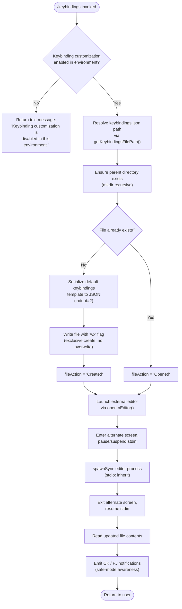

# `/keybindings`

> Analysis basis: CC v2.1.169 bundle.js (AST extraction + Claude interpretation)
> Minimum version: v2.1.169

---

## Overview

The `/keybindings` command opens the user's keyboard shortcut configuration file (`keybindings.json`) in an external editor for interactive editing. If the file does not yet exist, the command first creates it with a schema-annotated default template before launching the editor. The command is classified as `local` (non-interactive-safe) and operates entirely through filesystem and process-spawn operations.

---

## Registration

| Field | Value |
|---|---|
| type | `local` |
| name | `keybindings` |
| description | `Open your keyboard shortcuts file` |
| supportsNonInteractive | `false` |
| module_id | `arq` |
| load_inline | `true` |
| loc_byte | `11738589` |
| loc_byte_end | `11738766` |
| loc_line | `8069` |
| arbor_handler.name | `oNf` |
| arbor_handler.fqn | `claude-2.1.169::oNf` |
| arbor_handler.kind | `AsyncFunction` |
| arbor_handler.resolution_path | `module_id` |
| arbor_handler.n_hits | `0` |

Analysis basis: CC v2.1.169 bundle.js:+11738589

---

## Input Branching

The command follows more than three distinct execution paths (customization disabled guard → file existence check → file creation vs. open → editor launch → result reporting), so a Mermaid flowchart is used.



Analysis basis: CC v2.1.169 bundle.js:+11737849, +11737946, +11738014, +11738059, +11738078, +11738125, +11738172, +11738181, +11738217, +11738320

---

## Behavioral Spec

### 1. Environment Guard

```
function checkCustomizationEnabled(context):
    if keybinding_customization_disabled(context):
        return { type: "text",
                 content: "Keybinding customization is disabled in this environment." }
    else:
        proceed to resolveAndOpenFile(context)
```

If the runtime environment has keybinding customization disabled (e.g., a managed or restricted deployment), the handler short-circuits immediately and returns a plain-text error message without touching the filesystem.

Analysis basis: CC v2.1.169 bundle.js:+11737866, +11737879

---

### 2. Keybindings File Path Resolution

```
function getKeybindingsFilePath(configDir):
    return path.join(configDir, "keybindings.json")
```

The path is built by joining the resolved configuration directory with the fixed filename `"keybindings.json"`.

Analysis basis: CC v2.1.169 bundle.js:+11737946, +3887290, +3887304

---

### 3. Default File Initialization

When the target file does not already exist, the handler constructs a default keybindings JSON object and writes it. The default structure includes:
- A `$schema` field pointing to `"https://www.schemastore.org/claude-code-keybindings.json"` for editor validation.
- A documentation URL reference: `"https://code.claude.com/docs/en/keybindings"`.
- A serialized map of current keybinding entries derived by iterating the active keybinding registry (`rNf`), mapping each entry through a key-normalizer (`qyH`) that trims whitespace and normalizes `"space"` tokens.

The file is written with the `"wx"` flag (exclusive create), ensuring no race-condition overwrite of a file created between the existence check and the write.

```
function buildDefaultKeybindingsContent(registry):
    entries = registry.map(entry => normalizeKeyString(entry))
    serialized = JSON.stringify({ "$schema": SCHEMA_URL,
                                   "docs": DOCS_URL,
                                   "bindings": entries }, null, 2)
    return serialized

function writeNewKeybindingsFile(filePath, content):
    fs.mkdir(path.dirname(filePath), { recursive: true })
    fs.writeFile(filePath, content, { flag: "wx" })   // exclusive create
    return "Created"
```

Analysis basis: CC v2.1.169 bundle.js:+11737602, +11737667, +11737963, +11737973, +11738014, +11738059, +11737749

---

### 4. Editor Launch (openInEditor / TQ)

The editor-launch routine pauses the Ink UI, suspends stdin, spawns the configured editor process synchronously, then restores the terminal state:

```
function openInEditor(filePath):
    inkInstance = getInkInstance()
    if inkInstance is null:
        throw Error("Ink instance not found - cannot pause rendering")

    editorCommand = resolveEditorCommand()   // platform-aware lookup (y0)
    args = editorCommand.split(" ")
    binary = args[0]
    extraArgs = args.slice(1)

    terminal.enterAlternateScreen()
    terminal.pause()
    terminal.suspendStdin()

    result = child_process.spawnSync(binary, [...extraArgs, filePath],
                                     { stdio: "inherit" })

    terminal.exitAlternateScreen()
    terminal.resumeStdin()
    terminal.resume()

    updatedContent = fs.readFileSync(filePath)
    return updatedContent
```

The editor command resolution (`y0`) is platform-aware: it lower-cases the platform string, checks whether the process is running inside an IDE context (`"IDE"`), and routes accordingly via `ZSH` / `GN.basename` helpers.

Analysis basis: CC v2.1.169 bundle.js:+11676560, +11676608, +11676761, +11676791, +11676801, +11676840, +11676865, +11676883, +11676915, +11677185, +11677263, +11677292, +11677308, +6530399

---

### 5. Post-Editor Notification and Safe-Mode Awareness

After the editor exits, two post-processing steps fire:

```
function postEditorActions(fileAction, filePath):
    // fileAction is either "Opened" or "Created"
    notifyChange(fileAction)      // CK — emits UI notification
    handleSafeModeWarning()       // FJ — checks --safe-mode flag and
                                  //      may suggest "restart without --safe-mode"
                                  //      or "unset CLAUDE_CODE_SAFE_MODE"
```

- `CK` calls into `_6` (string coercion helper) and `xF6` to surface the action label.
- `FJ` also routes through `xF6`; it surfaces the strings `"--safe-mode"`, `"restart without --safe-mode"`, and `"unset CLAUDE_CODE_SAFE_MODE"` depending on how safe-mode was activated.

Analysis basis: CC v2.1.169 bundle.js:+11738172, +11738181, +11738217, +11738320, +64341, +64503, +64542, +64546, +64601, +64631

---

### 6. Config File I/O Infrastructure (y7H / D6 / VL8)

The underlying config subsystem (reached transitively from `jF` → `D6`) enforces several invariants:

- **Access guard**: attempting to read config before it is allowed raises `"Config accessed before allowed."` (Analysis basis: CC v2.1.169 bundle.js:+3274258)
- **Encoding**: files are read with `"utf-8"` encoding. (Analysis basis: CC v2.1.169 bundle.js:+3274341)
- **Missing file**: an `"ENOENT"` error code is caught and handled gracefully (file treated as empty/default). (Analysis basis: CC v2.1.169 bundle.js:+3274488)
- **Directory collision**: `"EEXIST"` is caught during `mkdirSync` and ignored. (Analysis basis: CC v2.1.169 bundle.js:+3275103)
- **Parse errors**: emit the `tengu_config_parse_error` telemetry event with `"error"` level. (Analysis basis: CC v2.1.169 bundle.js:+3274809, +3274889)
- **Backups**: before overwriting, the config layer calls `q.statSync`, derives a basename via `fw.basename`, creates a timestamped backup using `Date.now()` and `q.copyFileSync`, and stores backups under a sibling directory filtered by `w.startsWith`. (Analysis basis: CC v2.1.169 bundle.js:+3274849, +3275041, +3275068, +3275126, +3275161, +3275379, +3275397)

---

### 7. Keybinding Release-Flag Check

Before operating on the keybinding file, the handler consults a feature-release flag via the `tengu_keybinding_customization_release` telemetry path. This gates whether the feature is accessible at all in a given deployment.

Analysis basis: CC v2.1.169 bundle.js:+3886790

---

## State & Side Effects

| Item | Detail |
|---|---|
| Telemetry | `tengu_config_parse_error` (CC v2.1.169 bundle.js:+3274889); `tengu_keybinding_customization_release` (CC v2.1.169 bundle.js:+3886790) |
| Filesystem writes | Creates `keybindings.json` (exclusive `"wx"` flag) if absent; parent directory created recursively |
| Filesystem reads | Reads updated file contents after editor exits (`readFileSync`) |
| Config backups | Timestamped backup copy written before any config overwrite |
| Terminal state | Alternate screen entered/exited; stdin suspended/resumed around editor spawn |
| Process spawn | `child_process.spawnSync` with `stdio: "inherit"` for editor process |
| UI notifications | `CK` emits action label (`"Opened"` / `"Created"`); `FJ` emits safe-mode advisory if applicable |
| Hook registration | File-watch infrastructure (`xL8.watchFile` / `xL8.unwatchFile`) registered via `jhL` for config change callbacks; event emitted via `Ba.emit` inside `$G_` |
| appState changes | Config cache updated via `VL8` / `$G_` path; experiment event `"growthbook_experiment"` may fire on feature-flag evaluation |
| Sound | <!-- TODO: not found in depth-2 traversal; needs --depth 4 --> |

---

## Version History

| Version | Change |
|---|---|
| v2.1.169 | Initial analysis |

---

## Common Mistakes

1. **Running in a non-interactive context**: `/keybindings` has `supportsNonInteractive: false`. Invoking it in a headless or piped session will fail at the Ink-instance check because there is no terminal to pause/resume.
2. **Editing the file externally while `/keybindings` is open**: the `"wx"` exclusive-create flag only prevents double-creation on first use; concurrent external edits after the editor is launched may conflict with the post-editor read.
3. **Safe-mode deployments**: if Claude Code was launched with `--safe-mode` or `CLAUDE_CODE_SAFE_MODE` set, the post-editor notification will surface an advisory. Users must restart or unset the environment variable for keybinding changes to take full effect.
4. **Schema validation**: the written file includes a `$schema` reference to SchemaStore. Editors that do not support JSON Schema (or are offline) will not validate keybinding entries; malformed entries will silently persist until the next config parse, which fires `tengu_config_parse_error`.
5. **Restricted environments**: deployments that set the keybinding-customization disable flag will receive only the plain-text message `"Keybinding customization is disabled in this environment."` with no file interaction — this is by design, not a bug.

---

## Appendix — Identifier Mapping

> For bundle debugging only. Identifiers change across versions.

| Identifier | Role |
|---|---|
| `oNf` | Main async handler for `/keybindings` command (arbor_handler) |
| `jF` | Config accessor entry-point called from handler |
| `D6` | Core config read/write dispatcher |
| `HP6` | Config initialization helper (branch A) |
| `_P6` | Config initialization helper (branch B) |
| `tu` | Config value transformer / unwrapper |
| `su` | Config store accessor |
| `VL8` | Config cache lookup / population with dedup guard |
| `$G_` | Config cache populator; emits experiment and change events |
| `JG_` | Config change notification dispatcher |
| `y6` | File-open orchestrator (checks existence, dispatches read or watch) |
| `l6` | Config directory path resolver |
| `NG_` | Config state enumerator (status values: `unknown`, `local`, `migrated`, `native`, `installed`, `disabled`, `enabled`, `no_permissions`, `global`, `not_configured`) |
| `y7H` | Low-level config file reader with backup and ENOENT handling |
| `jhL` | File-watch registration / de-registration helper |
| `$fH` | Keybindings file path builder (joins configDir + `"keybindings.json"`) |
| `irq` | Default keybindings content serializer |
| `rNf` | Keybinding registry iterator / entry mapper |
| `qyH` | Key-string normalizer (trims whitespace, handles `"space"` token) |
| `H` | HTTP bootstrap fetch helper (also used as array/string utility in other contexts) |
| `_` | Lodash-style utility (has / includes / statSync / readFileSync) |
| `CH` | JSON serializer wrapper (`JSON.stringify`) |
| `E8` | Error-type classifier / reporter |
| `TQ` | Editor-launch orchestrator (alternate screen, spawnSync, restore) |
| `_U` | Ink instance retriever |
| `HD` | Ink instance registry lookup |
| `jNf` | Editor selection helper (delegates to `G4A`) |
| `G4A` | Editor command builder (basename + extension matching) |
| `q9` | String slice/index utility |
| `A` | Terminal control object (alternate screen, pause, resume, stdin) |
| `f` | Ink/terminal instance wrapper |
| `q` | Active Ink instances set |
| `L` | Ink lifecycle guard (add/delete/finally) |
| `y0` | Platform-aware editor command resolver |
| `CK` | Post-edit action notifier (surfaces `"Opened"` / `"Created"`) |
| `_6` | String coercion / boolean-string mapper (`"yes"`, `"on"`) |
| `xF6` | UI message emitter used by both `CK` and `FJ` |
| `FJ` | Safe-mode advisory notifier |

---

Note: index built via Arbor fallback; some signals (telemetry, literals) may be missing — see arbor-fallback.js.