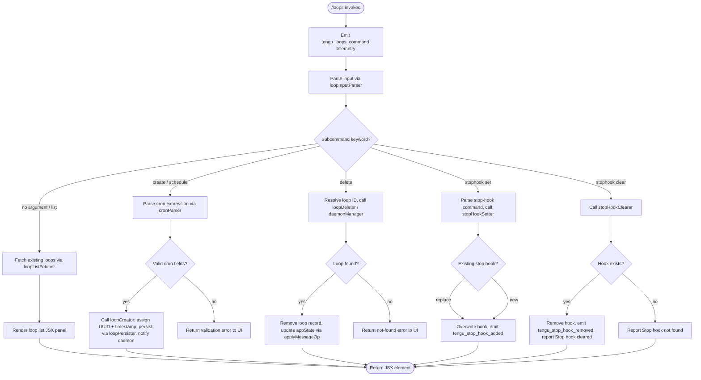

# `/loops`

> Analysis basis: CC v2.1.169 bundle.js (AST extraction + Claude interpretation)
> Minimum version: v2.1.169

---

## Overview

The `/loops` command provides a management interface for background loops (scheduled/recurring agent tasks). It allows users to list currently registered loops, create new loops with a cron-style schedule or prompt, and delete existing loops. The command renders an interactive JSX UI panel within the CLI and coordinates with the background daemon infrastructure to persist and dispatch loop configurations.

---

## Registration

| Field | Value |
|---|---|
| type | `local-jsx` |
| name | `loops` |
| description | `List, create, and delete loops` |
| loc_byte | `12637006` |
| loc_byte_end | `12637163` |
| loc_line | `8991` |
| immediate | `true` |
| module_id | `S4K` |
| load_inline | `true` |
| arbor_handler.name | `qBf` |
| arbor_handler.fqn | `claude-2.1.169::qBf` |
| arbor_handler.kind | `AsyncFunction` |
| arbor_handler.resolution_path | `module_id` |
| arbor_handler.n_hits | `0` |

Analysis basis: CC v2.1.169 bundle.js:+12637006

---

## Input Branching

The handler exhibits four or more distinct branches depending on the subcommand keyword parsed from the user's input: list (default/no arg), create, delete, and stop-hook management (set/clear). A Mermaid flowchart is used.



Analysis basis: CC v2.1.169 bundle.js:+12636009 (subcommand dispatch), +12636092 (cron parser `zN`), +12636248 (loop manager `mAH`), +12636387 (stop-hook branch `F96`), +12636513 (stop-hook address `ABf`)

---

## Behavioral Spec

### 1. Main Handler — `loopsCommandHandler` (`qBf`)

```
async function loopsCommandHandler(context):
    emit telemetry("tengu_loops_command")          // +12635963
    config  = fetchLoopConfig(context)             // pAH  +12636001
    state   = getLoopStateMap(context)             // U96  +12636009
    appState = context.getAppState()               // +12636013
    cronKey = "cron"                               // literal +12636059

    loopItems = state.map(toDisplayRow)            // A.map +12636041
    stopHookItems = appState.map(toStopHookRow)    // q.map +12636125

    subResult = dispatchSubcommand(context, {      // branches below
        loopItems, stopHookItems, config
    })

    return HMA.createElement(LoopsPanel, subResult) // +12636766
```

Analysis basis: CC v2.1.169 bundle.js:+12635961

---

### 2. Loop Configuration Fetcher — `loopConfigFetcher` (`pAH`)

```
function loopConfigFetcher(context):
    rawConfig = readLoopConfigFile(context)   // DhH  +4816357
    parsed    = transformConfig(rawConfig)    // mT   +4816393
    return parsed
```

Internally calls `fileConfigReader` (`DhH`) which reads the configuration file as UTF-8 (literal `"utf-8"` at +4814396), constructs the config path via `pathJoin` (`afH`, `sO8.join`), and parses line ranges using `lineRangeParser` (`pk`).

Analysis basis: CC v2.1.169 bundle.js:+4816357

---

### 3. Cron Expression Parser — `cronParser` (`zN`)

```
function cronParser(input):
    trimmed = input.trim()                     // +4812140
    if trimmed matches minute-pattern:         // K.match +4812281
        minuteValue = parseInt(match)          // +4812316
        // "Every minute" label literal +4812260
        return { type: "minute", value: minuteValue }
    if trimmed matches hour-pattern:           // L.match +4812551
        // "Every hour" label literal +4812477
        return { type: "hour", value: ... }
    if trimmed matches day-of-week pattern:    // $.match +4812949
        day = date.getUTCDay()                 // +4813017
        // adjust via setUTCDate / getUTCDate / setUTCHours
        return { type: "weekly", ... }
    if trimmed matches "1-5" pattern:          // literal +4813184
        return { type: "weekday", ... }
    // toString fallback
    return { type: "custom", raw: w.toString() }  // +4812514
```

The parser normalises cron fields using numeric boundary constants: 60 (+12635694), 59 (+12635728), 23 (+12635799), 31 (+12635852). Rounding helpers `Math.max`, `Math.ceil`, `Math.round` are applied during field normalisation (via `cronFieldNormaliser` `ABf`, +12636513).

Analysis basis: CC v2.1.169 bundle.js:+4812140

---

### 4. Loop Creator — `loopCreator` (`maH`)

```
async function loopCreator(prompt, cronExpr, context):
    id        = crypto.randomUUID()              // Tj9.randomUUID +4815696
    createdAt = Date.now()                       // +4815758
    record    = buildLoopRecord(id, prompt,      // fZH +4815804
                                cronExpr, createdAt)
    await persistLoop(record, context)           // DhH +4815848
    // Writes to .claude directory (+4815537) via
    // mkdir + writeFile (uaH: aO8.mkdir +4815516,
    //                        aO8.writeFile +4815613)
    stateList.push(record)                       // M.push +4815861
    notifyDaemon(record, context)                // Oa +4815942
    return record
```

The loop record is stored under the `.claude` directory (literal at +4815537). A UUID (8 random hex characters, constant `8` at +4815721) is prepended to the record filename. After persistence, the daemon is notified via the `daemonNotifier` (`Oa`).

Analysis basis: CC v2.1.169 bundle.js:+4815696

---

### 5. Loop Manager / Deleter — `loopManager` (`mAH`)

```
async function loopManager(loopId, action, context):
    baseDir   = resolveBaseDir()                 // Y6H +4816026
    allLoops  = readLoopConfigFile(context)      // DhH +4816076
    matching  = allLoops.filter(byId)            // q.filter +4816085
    if action == "delete":
        if not matching.has(loopId):             // A.has +4816100
            return notFound
        await persistLoop(remaining, context)    // uaH +4816149
        return success
```

Analysis basis: CC v2.1.169 bundle.js:+4816026

---

### 6. Stop-Hook Setter — `stopHookSetter` (`F96`)

```
async function stopHookSetter(hookCommand, context):
    appState  = context.getAppState()            // H.getAppState +10453008
    loopState = getLoopStateMap(context)         // U96 +10453004
    goalId    = generateGoalId()                 // pbq -> randomUUID +10453357
    newHook   = {
        type:  "stophook",                       // literal +12636145
        goal:  hookCommand,                      // "goal" +10453297
        id:    goalId,
        kind:  "attachment"                      // +10453339
    }
    context.setAppState(...)                     // H.setAppState +10453137
    context.applyMessageOp("append", newHook)    // H.applyMessageOp +10453206
                                                 // "append" literal +10453229
    emit telemetry("tengu_stop_hook_added")      // +10452891
    report("Stop hook set")                      // literal +12636723
    return { status: "goal_status",              // "goal_status" +10453426
             goal_set: true }                    // "goal_set" +10452533
```

Analysis basis: CC v2.1.169 bundle.js:+10452997

---

### 7. Stop-Hook Clearer — `stopHookClearer` (`ABf`)

```
function stopHookClearer(input, appState):
    match = input.match(hookPattern)             // H.match +12635549
    index = parseInt(match)                      // +12635586
    max   = Math.max(index, 0)                   // +12635671
    slot  = Math.ceil(max)                       // +12635682
    if slot not found in appState:
        report("Stop hook not found")            // literal +12636405
        return { status: "skip" }                // "skip" +12636872
    // Remove slot using pk (lineRangeParser)    // +12635919
    report("Stop hook cleared")                  // literal +12636427
    emit telemetry (via F96: tengu_stop_hook_removed)
    return { status: "cleared" }
```

Analysis basis: CC v2.1.169 bundle.js:+12635549

---

### 8. Loop State Map Builder — `loopStateBuilder` (`U96`)

```
function loopStateBuilder(context):
    stateMap = new Map()
    for entry in loopEntries:
        stateMap.set(entry.id, formatEntry(entry))  // aWH: K.set +9173497
        // fPq maps over H to build display rows     // +9173266
    stateMap.push(summaryRow)                        // A.push +10452328
    return stateMap
```

Display rows are padded to width 40 (literal at +16533353) with two-space separator (literal `"  "` at +16531382).

Analysis basis: CC v2.1.169 bundle.js:+10452204

---

### 9. Daemon Integration — background process coordination (`w`, `b`, `gPA`)

The `/loops` command interacts with the background daemon layer to start, stop, and update running loop processes. Key behaviours observed from the call graph:

- **Process spawning**: `FQ.spawn` (+16508252) is called when a new loop process needs to be started.
- **Claim protocol**: `uPA` sends a claim frame (+16485329) to the daemon socket, with a 500 ms retry timeout (literal +16486168) and SIGTERM on kill (+16485768).
- **State transitions**: Loop processes move through the states `idle`, `working`, `blocked`, `bg`, `crashed`, `done`, `killed`, `failed`, `resuming` (literals at +16513585, +16512981, +16512874, +16513145, +16512820, +16512636, +16512654, +16512673, +16514470).
- **Idle timeout**: 300,000 ms (5 minutes) idle before automatic retirement (literal +16514256).
- **SIGKILL escalation**: If a loop process does not stop after SIGTERM, a SIGKILL is sent and `tengu_bg_dispatch_sigkill_escalate` is emitted (+16506490).
- **Low-memory guard**: Free memory is checked (`QPA.freemem` +16506921); if below threshold, `tengu_bg_dispatch_low_mem` is emitted (+16507091) and dispatch is deferred.

Analysis basis: CC v2.1.169 bundle.js:+16506372, +16508252

---

## State & Side Effects

| Item | Detail |
|---|---|
| Telemetry — primary | `tengu_loops_command` (emitted on every `/loops` invocation, +12635963) |
| Telemetry — stop hook added | `tengu_stop_hook_added` (+10452891) |
| Telemetry — stop hook removed | `tengu_stop_hook_removed` (+10453263) |
| Telemetry — SIGKILL escalation | `tengu_bg_dispatch_sigkill_escalate` (+16506490) |
| Telemetry — daemon control | `tengu_daemon_control` (+16543552) |
| Telemetry — daemon config reload | `tengu_daemon_config_reload` (+16521994) |
| Telemetry — scheduled task missed | `tengu_scheduled_task_missed` (+16006395) |
| Telemetry — background session created | `tengu_daemon_bg_session_create` (literal `"daemon_bg_session_create"` +16506806) |
| Telemetry — low memory dispatch | `tengu_bg_dispatch_low_mem` (+16507091) |
| Telemetry — spare enable / claim / fail | `tengu_bg_spare_enable` (+16507795), `tengu_bg_spare_claim` (+16507923), `tengu_bg_spare_claim_fail` (+16508189) |
| Telemetry — send-claim failed | `tengu_bg_sendclaim_failed` (+16485530) |
| Telemetry — state read transient | `tengu_bg_state_read_transient` (+4182694) |
| Telemetry — MCP skills | `tengu_mcp_skills` (+6566426) |
| Telemetry — feature ok/bad/sad | `tengu_feature_ok`, `tengu_feature_bad`, `tengu_feature_sad` (+1013926, +1013988, +1014069) |
| File system writes | Loop records written under `.claude` directory (literal +4815537) via `mkdir` + `writeFile` |
| appState changes | `setAppState` and `applyMessageOp("append", ...)` called when creating/clearing stop hooks |
| Hook registration | Stop-hook attached as `"stophook"` type attachment in appState |
| Process lifecycle | Daemon processes spawned, claimed, and killed via IPC socket + SIGTERM/SIGKILL |
| Idle timeout | Background loops retired after 300,000 ms inactivity (+16514256) |
| Sound | <!-- TODO: not found in depth-2 traversal; needs --depth 4 --> |

---

## Version History

| Version | Change |
|---|---|
| v2.1.169 | Initial analysis |

---

## Common Mistakes

1. **Passing an invalid cron expression**: The cron parser (`zN`) expects specific patterns such as `"Every minute"`, `"Every hour"`, or a day-of-week / weekday range (`"1-5"`). Free-form strings that do not match any recognised pattern fall back to a `"custom"` raw type, which may not be dispatched as intended.
2. **Attempting to delete a loop by name instead of ID**: The loop deleter (`mAH`) filters by ID (UUID), not by human-readable label. Passing the loop label string will silently produce a not-found result.
3. **Clearing a stop hook that was never set**: The clearer (`ABf`) returns `"Stop hook not found"` and the `"skip"` status rather than an error, which can be confused with a successful clear in non-interactive scripts.
4. **Expecting synchronous persistence**: Loop creation (`maH`) is async; the `.claude` directory may be created on first use. If the working directory lacks write permission, the `mkdir` call in `uaH` will fail with an `EACCES`-class error (literal +178428).
5. **Confusing `/loops` with MCP server management**: The `/loops` command manages scheduled background agent loops, not MCP server connections. MCP server management is handled by separate commands.

---

## Appendix — Identifier Mapping

> For bundle debugging only. Identifiers change across versions.

| Identifier | Role |
|---|---|
| `qBf` | Main async handler for `/loops` command (`loopsCommandHandler`) |
| `d` | Generic utility / error dispatcher called at entry |
| `pAH` | Loop configuration fetcher (`loopConfigFetcher`) |
| `DhH` | File-based loop config reader (`fileConfigReader`) |
| `l6` | File path resolver helper |
| `afH` | Path join helper (wraps `sO8.join`) |
| `X4` | Config directory resolver |
| `xZ` | Base path / home-directory resolver |
| `j9` | Error code classifier |
| `E8` | Error formatter |
| `hH` | Stream/process output collector |
| `wA` | Error-to-string converter |
| `_6` | String coercion utility |
| `kq` | Traffic/queue filter (`"essential-traffic"`) |
| `av4` | Queue shift/push manager |
| `N` | HTTP bootstrap fetch handler |
| `ItK` | Fetch response processor |
| `H` | Bootstrap fetch dispatcher |
| `CH` | JSON serialiser wrapper |
| `R4` | URL/path sanitiser |
| `rBH` | Label formatter |
| `StK` | Buffer/size measurer and file uploader |
| `pk` | Line-range parser (`lineRangeParser`) |
| `p67` | Line/range tokeniser |
| `A` | Generic accumulator array / toLowerCase helper |
| `L` | Stream/event subscription manager |
| `q` | Event/data source |
| `f` | Stream lifecycle manager (close/finally) |
| `mT` | Config transform helper |
| `U96` | Loop state map builder (`loopStateBuilder`) |
| `aWH` | State map entry setter |
| `K` | Display-row map / padEnd formatter |
| `fPq` | Row mapper over loop entries |
| `I6` | Path resolver (resolves to `xZ`) |
| `zN` | Cron expression parser (`cronParser`) |
| `w` | Background process runner / daemon worker |
| `b` | Background loop dispatcher |
| `Y` | Daemon supervisor write handler |
| `Oa` | Daemon notifier (after loop creation/deletion) |
| `uaH` | Loop record persister (mkdir + writeFile under `.claude`) |
| `vj9` | Loop filter/cleanup helper |
| `P` | IPC buffer reader |
| `z` | Daemon stop controller |
| `S` | Daemon session writer |
| `X` | Timeout scheduler |
| `c` | Message queue pair |
| `nmK` | Loop status message builder |
| `mAH` | Loop manager / deleter (`loopManager`) |
| `a8` | Async retry / abort-signal handler |
| `O` | Signal handler wrapper |
| `bH` | Feature flag checker (bad path) |
| `K6` | Feature flag evaluator |
| `SH` | Feature flag checker (ok path) |
| `MU8` | Low-memory checker (macOS) |
| `D6` | Memory/system state recorder |
| `JW6` | Pinned-file configuration reader |
| `HI_` | `pins.json` path resolver |
| `F6` | JSON parse wrapper |
| `k8` | File-not-found error handler (`ENOENT`) |
| `ViL` | Loop directory scanner (readdir + readFile) |
| `Q` | Permission gate manager |
| `NH6` | Iron-gate / permission classifier |
| `eg` | Permission evaluation engine |
| `uPA` | Daemon claim sender (IPC socket) |
| `MYA` | Daemon state file writer |
| `aJ5` | Claim timeout handler |
| `oJ5` | Claim frame builder |
| `Bf` | Error event emitter |
| `EH` | String error formatter |
| `QV` | IPC frame encoder (Buffer operations) |
| `gPA` | Background session lifecycle manager |
| `oK` | Session directory path resolver |
| `jq` | Session state file reader/writer (`stateOrder`, `order`) |
| `LO` | Active-state detector |
| `XjH` | Session event filter/router |
| `If` | Session config change handler |
| `lq6` | Session result logger |
| `Kb6` | Path builder for session artefacts |
| `A$H` | Session artefact path resolver |
| `KZ` | Session path splitter |
| `PQ` | Session record path builder |
| `qb6` | Base artefact path builder |
| `D` | Forced-shutdown initiator |
| `Bj` | Shutdown sequencer |
| `F` | Disposable resource wrapper |
| `J` | Process kill iterator |
| `$` | Daemon status file reader |
| `D3K` | Daemon status JSON builder |
| `C9` | AsyncLocalStorage store accessor |
| `tx6` | Status file path builder |
| `j` | UTC date manipulation proxy |
| `F96` | Stop-hook setter (`stopHookSetter`) |
| `pbq` | UUID generator wrapper (crypto.randomUUID) |
| `M6` | Message-op type builder |
| `c76` | Core message-op constant |
| `ABf` | Stop-hook clearer / cron field normaliser (`stopHookClearer`) |
| `maH` | Loop creator (`loopCreator`) |
| `fZH` | Loop record struct builder |
| `M` | MCP server manager |
| `mSH` | MCP connection orchestrator |
| `yn` | MCP server config validator |
| `VV` | MCP tool descriptor builder |
| `g8` | MCP capability mapper |
| `OZ6` | MCP server list formatter |
| `TF9` | MCP connection initialiser |
| `jD8` | MCP session ID tracker |
| `DD8` | MCP version checker |
| `O8` | MCP debug logger |
| `sw8` | MCP OAuth flow handler |
| `tw8` | MCP OAuth callback processor |
| `yF9` | MCP connection result handler |
| `uu_` | MCP error reporter |
| `EN` | MCP skills telemetry emitter |
| `Vu_` | MCP tool inclusion checker |
| `y` | Chokidar file-watcher entry |
| `u7` | MCP error logger |
| `vF9` | MCP server config formatter |
| `DeH` | MCP integer field parser (parseInt) |
| `aJ8` | MCP port parser (parseInt) |
| `cd8` | MCP connection result applier |
| `uSH` | MCP pending-state notifier |
| `UE` | MCP cleanup handler |
| `dXA` | MCP roster update dispatcher |
| `mw8` | MCP tool-set membership checker |
| `zeH` | MCP PPH state updater |
| `B96` | Stop-hook create-and-dispatch variant |
| `x_A` | Policy/trust gate initialiser |
| `rC` | Policy settings reader |
| `y8` | Policy store accessor |
| `N_H` | Trust gate resolver |
| `F_` | Hooks gate flag |
| `Nf` | Trust gate evaluator |
| `zhL` | Path traversal guard (`".."` literal) |
| `o6` | Feature flag (sad path) |
| `gD` | Output-token budget getter |

---

Note: index built via Arbor fallback; some signals (telemetry, literals) may be missing — see arbor-fallback.js.