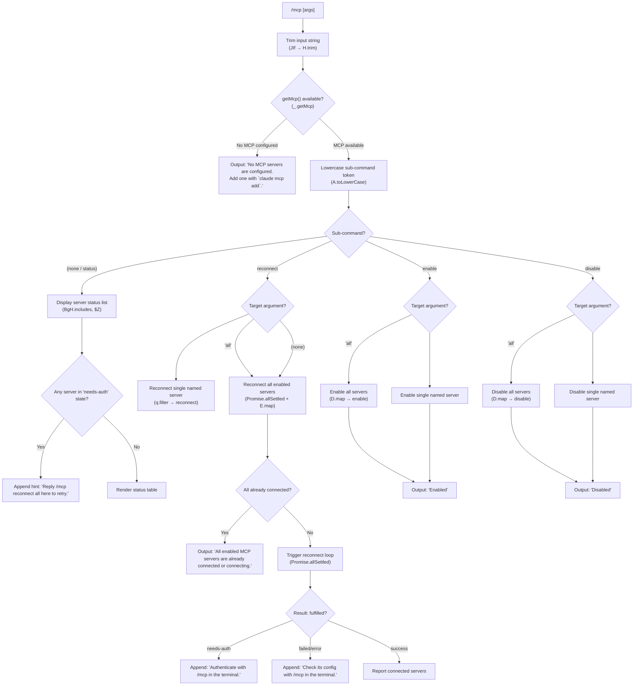

# `/mcp`

> Analysis basis: CC v2.1.169 bundle.js (AST extraction + Claude interpretation)
> Minimum version: v2.1.169

---

## Overview

The `/mcp` command provides interactive management of Model Context Protocol (MCP) servers within a Claude Code session. It allows users to inspect server connection status, reconnect failed servers, and enable or disable individual servers or all servers at once. The command is dispatched through an async handler (`JIf`) that resolves sub-commands from the trimmed argument string and drives a series of async operations against the MCP runtime.

---

## Registration

| Field | Value |
|---|---|
| type | `local` |
| name | `mcp` |
| description | `Manage MCP servers` |
| argumentHint | `[reconnect\|enable\|disable [<server>\|all]]` |
| supportsNonInteractive | `true` |
| module_id | `jaq` |
| load_inline | `true` |
| loc_byte | `12061339` |
| loc_byte_end | `12061531` |
| loc_line | `8291` |
| arbor_handler.name | `JIf` |
| arbor_handler.fqn | `claude-2.1.169::JIf` |
| arbor_handler.kind | `AsyncFunction` |
| arbor_handler.resolution_path | `module_id` |
| arbor_handler.n_hits | `0` |

Analysis basis: CC v2.1.169 bundle.js:+12061339

---

## Input Branching

Five or more distinct execution paths exist depending on the sub-command token and the target server argument, requiring a Mermaid flowchart.



Analysis basis: CC v2.1.169 bundle.js:+11808051 through +11812322

---

## Behavioral Spec

### Entry Point — Main Handler

```
async function mcpCommandHandler(rawInput, appContext):
    trimmedInput = rawInput.trim()                     // H.trim @11808051
    mcpState = appContext.getMcp()                     // _.getMcp @11808062

    if mcpState is null or empty:
        return output("No MCP servers are configured. Add one with `claude mcp add`.")
                                                       // literal @11809024

    subCommand = parseFirstToken(trimmedInput).toLowerCase()
                                                       // A.toLowerCase @11808111

    if subCommand not in ["reconnect", "enable", "disable"]:
        return displayStatusView(mcpState, trimmedInput)

    serverArg = parseSecondToken(trimmedInput)

    switch subCommand:
        case "reconnect": return handleReconnect(mcpState, serverArg, appContext)
        case "enable":    return handleEnableDisable(mcpState, serverArg, "enable", appContext)
        case "disable":   return handleEnableDisable(mcpState, serverArg, "disable", appContext)
```

Analysis basis: CC v2.1.169 bundle.js:+11808051

---

### Status Display

```
function displayStatusView(mcpState, rawInput):
    servers = mcpState.filter(server => server is relevant)
                                                       // q.filter @11808962

    if servers is empty:
        return output("No MCP servers are configured. Add one with `claude mcp add`.")

    // Check terminal readiness
    if terminal not ready (appStateCheck via rb8/Daq):
        return output("MCP controls aren't available right now — " +
                      "the terminal is still starting up or is showing another view.")
                                                       // literal @11809223

    // Emit telemetry
    emit("tengu_mcp_command_inline")                   // @11808901

    // Build status rows
    for each server in servers:
        status = one of: "connected" | "pending" | "failed" | "needs-auth" | "disabled"
                                                       // literals @11808276..11808396
        append status row to output

    // Conditionally append reconnect hint
    if any server has status "needs-auth" or "failed":
        append " Reply `/mcp reconnect all` here to retry."
                                                       // literal @11808552

    return formatted status table (output type "text")  // literal @11812322
```

Analysis basis: CC v2.1.169 bundle.js:+11808657, +11808899

---

### Reconnect Handler

```
async function handleReconnect(mcpState, serverArg, appContext):
    // Determine target set
    if serverArg == "all" or serverArg is empty:       // literal @11808758
        targets = mcpState.filter(server => server.status != "disabled")
    else:
        targets = mcpState.filter(server => server.name == serverArg)

    // Pre-flight: skip if all already in connected/connecting state
    if targets.every(server => server.status in ["connected", "pending"]):
        return output("All enabled MCP servers are already connected or connecting.")
                                                       // literal @11809965

    // Initiate reconnect for each target concurrently
    results = await Promise.allSettled(               // @11810041
        targets.map(server => reconnectSingleServer(server, appContext))
    )                                                  // E.map @11810060

    // Process outcomes
    for each result in results:
        if result.status == "fulfilled":               // literal @11810106
            check server's new status:
                "needs-auth"  → append "Authenticate with `/mcp` in the terminal."
                                                       // literal @11810251
                "failed"      → append "Check its config with `/mcp` in the terminal."
                                                       // literal @11810295
                otherwise     → record as success

    // Grammar: "isn't" vs "aren't" based on count    // literals @11810966, @11810974
    compose summary message

    return output(summaryMessage)
```

Analysis basis: CC v2.1.169 bundle.js:+11809189, +11810041

---

### Enable / Disable Handler

```
async function handleEnableDisable(mcpState, serverArg, action, appContext):
    // Determine target set
    if serverArg == "all":                             // literal @11808758
        targets = mcpState.allServers()
    else:
        targets = mcpState.filter(server => server.name == serverArg)

    // Apply action to each target
    results = await Promise.allSettled(
        targets.map(server =>
            action == "enable"                         // literal @11808788
                ? enableServer(server)
                : disableServer(server)                // literal @11808802
        )
    )

    // Report outcome
    actionLabel = action == "enable" ? "Enabled" : "Disabled"
                                                       // literals @11811413, @11811423

    append ". Run `/mcp` in the terminal to see status."
                                                       // literal @11812248

    return output(composedMessage)
```

Analysis basis: CC v2.1.169 bundle.js:+11811282, +11811413

---

### Server Needs-Approval Check

```
function checkNeedsApproval(serverEntry):
    // U4A → LmH inspects server for "needs-approval" state
    if serverEntry.approvalStatus == "needs-approval": // literal @11807460
        flag server for approval-required display
    return flaggedState
```

Analysis basis: CC v2.1.169 bundle.js:+11809388, +11807460

---

### MCP Connection State Machine (per server)

```
function reconnectSingleServer(server, appContext):
    // Drives the underlying MCP transport reconnect
    // Calls into connectionManager (G → Promise.all @16351395)
    // Transport types: "sdk" | "http" | "sse" | "dynamic"
    //                                              // literals @16351160, 16348504, 16348521, 16348566

    attempt connection via transportLayer(server.config)

    on success:
        push to connectedQueue (av4 → Di6.push @1019010)
        return {status: "connected"}

    on failure:
        logError(errorMessage)                      // bo.logError @1019718
        if error type is auth-required:
            return {status: "needs-auth"}
        else:
            return {status: "failed", message: "Connection failed"}
                                                    // literal @16351495
```

Analysis basis: CC v2.1.169 bundle.js:+16351241, +1019718

---

### IDE Environment Check

```
function isIdeEnvironment(appContext):
    // The handler checks for "ide" literal to branch display logic
    // When running inside an IDE integration, status output may differ
    if appContext.clientType == "ide":              // literal @11808102
        return true
    return false
```

Analysis basis: CC v2.1.169 bundle.js:+11808102

---

## State & Side Effects

| Item | Detail |
|---|---|
| Telemetry | `tengu_mcp_command_inline` (emitted on status display, @11808901); `tengu_feature_ok` (@1013926); `tengu_feature_bad` (@1013988); `tengu_feature_sad` (@1014069); `tengu_daemon_control` (@16543552) |
| Hook registration | `ZGA.register` called via `Z9` (@62328) — registers a shutdown/cleanup hook |
| appState changes | MCP server enable/disable state is mutated; reconnect attempts update per-server connection status fields |
| Daemon control | Daemon stop sequence triggered via `rh` / `PU` including `Promise.race`, `Promise.all`, forced shutdown path (`process.exit` @16539893, @16538634); `daemon_stop` / `daemon_stop_failed` events emitted (@16543477, @16543514) |
| File I/O | Log append via `Mh.appendFile` (@208216); log rotation via `Mh.rename` / `Mh.unlink` (@207884, @207924); directory creation via `Mh.mkdir` (@208157) |
| Timeout management | `clearTimeout` / `setTimeout` / `setImmediate` used in log-flush pipeline (`TBH`); grace period: 500 ms (@16538595) |
| Buffer limit | `Buffer.byteLength` checked at log-write path (@208611, @208309) |
| Sound | <!-- TODO: not found in depth-2 traversal; needs --depth 4 --> |

---

## Version History

| Version | Change |
|---|---|
| v2.1.169 | Initial analysis |

---

## Common Mistakes

1. **Omitting the server name for targeted reconnect/enable/disable** — without a server name or `all`, the sub-command token is treated as an unknown verb and falls through to the status display path rather than taking action.
2. **Expecting synchronous output for reconnect** — reconnect uses `Promise.allSettled`, so the command awaits all concurrent reconnection attempts before printing a summary; the terminal may appear to pause briefly for slow transports.
3. **Assuming `/mcp disable all` is persistent across sessions** — the disabled state is stored in appState/config; verify with `/mcp` that the state was persisted if the session restarts unexpectedly.
4. **Using `/mcp` from a non-interactive context expecting rich UI** — `supportsNonInteractive: true` means the command runs in CI/pipe contexts, but status output is plain text (`"text"` literal @11812322) rather than an interactive TUI widget.
5. **Confusing `needs-auth` with `failed`** — these are distinct states with distinct recovery paths. `needs-auth` requires in-terminal OAuth/token flow; `failed` typically indicates a config or network issue.

---

## Appendix — Identifier Mapping

> For bundle debugging only. Identifiers change across versions.

| Identifier | Role |
|---|---|
| `JIf` | Main async handler for `/mcp` command (entry point) |
| `H` | General-purpose utility / HTTP bootstrap fetch helper; also used for string ops (trim, includes, replace) |
| `N` | Argument parser / sub-command dispatcher for mcp handler |
| `ItK` | Server-list resolver / filter helper |
| `vGA` | Status icon/label selector (`yoK`, `hoK`) |
| `CH` | JSON serialiser wrapper (`JSON.stringify`) |
| `R4` | Token extraction / argument splitting utility |
| `qZA` | Server-map builder (`ZtK.map`) |
| `rBH` | Output writer wrapper (`lEA → H.write`) |
| `lEA` | Low-level write emitter (`H.write`) |
| `StK` | Log/append-file pipeline orchestrator |
| `TBH` | Debounced log-flush scheduler (clearTimeout/setTimeout/setImmediate) |
| `_4H` | Log-path builder (`_M6`, `P6H.join`, `A_`, `I6`) |
| `l6` | Log-level/config accessor |
| `n56` | EISDIR / directory error checker (`E8`) |
| `MZA` | Log file path resolver (`P6H.join`, `I6`) |
| `Vo8` | Log rotation handler (stat → rename → unlink) |
| `htK` | Log-append worker (mkdir → appendFile → rotate) |
| `Z9` | Shutdown hook registrar (`ZGA.register`) |
| `P$` | HTTP response parser |
| `w2_` | Query-string / argument splitter |
| `u6H` | Feature-flag / capability set checker (`vO4.has`) |
| `n3` | Text sanitiser (`H.replace`) |
| `M9` | Model-resolution orchestrator (`Cc`, `c9`, `eD`) |
| `Cc` | Model config parser (`tY`, `pU`, `FA`, `CC`) |
| `CC` | Model string tokeniser (map/trim/startsWith/includes) |
| `c9` | Model alias normaliser (lowercase, replace, alias lookup) |
| `u2` | Locale/alias map lookup (`ZLH`) |
| `TLH` | Allowed-model list checker (`GLH.includes`) |
| `Mk` | Model tier resolver (`zM`, `F5`) |
| `QcH` | Model fallback selector (`F5`) |
| `AE` | Model config builder (`zM`, `F5`, `YA`) |
| `dG1` | Model delegation wrapper (`AE`) |
| `zM` | Provider type resolver (`YA`) |
| `__8` | Model exclusion checker (`Q5L.includes`) |
| `dcH` | Model detail formatter (`_6`) |
| `eD` | Model-selection entry with fallback (`c9`, `hG`) |
| `hG` | Model validation and hydration (`yA`, `h8H`, `cDH`, `ccH`, `AE`, `x2`, `zM`, `YA`, `F5`, `Mk`) |
| `o6` | Feature telemetry emitter (`d`, `K6`) |
| `d` | Telemetry event dispatcher |
| `K6` | Telemetry transport / batch sender (`c76`) |
| `c76` | Low-level telemetry HTTP sender |
| `$Z` | MCP status formatter / renderer |
| `g8` | MCP state accessor helper (`_`) |
| `rb8` | Terminal-readiness checker |
| `Daq` | UI-view state checker |
| `U4A` | Needs-approval server filter (`LmH`) |
| `LmH` | Approval-status inspector |
| `$` | Server list / connection-results array |
| `D3K` | Daemon status file reader (`daemon.status.json`) |
| `Oa` | Status file parser (`vLH`) |
| `vLH` | Status text normaliser (`n6H`, `_.trim`) |
| `C9` | Async-local storage store getter (`dSL.getStore`) |
| `tx6` | Daemon status path builder (`Y3K.join`, `A_`) |
| `E` | Concurrent reconnect mapper (`Math.max`, `Math.min`) |
| `G` | Single-server reconnect driver (`M76`, `yS`, `ZN`, `Promise.all`, `Un`, `iF`, `hH`, `wA`) |
| `M76` | Transport factory selector |
| `hH` | Connection attempt executor (`wA`, `_6`, `kq`, `av4`, `cgH.push`, `bo.logError`) |
| `wA` | Error normaliser (`Error`, `String`) |
| `_6` | String coercion wrapper (`String`) |
| `kq` | Connection queue manager (`duA`) |
| `av4` | Ring-buffer manager for connection history (`Di6.shift`, `Di6.push`) |
| `O` | Output/render helper (`S8`) |
| `S8` | Terminal render sink |
| `D` | Forced-shutdown executor (`Bj`, `process.exit`, `z.abort`) |
| `Bj` | Pre-exit cleanup |
| `z` | Daemon lifecycle controller (`SH`, `bH`, `rh`, `PU`) |
| `SH` | Daemon stop — graceful path (`d`, `K6`) |
| `bH` | Daemon stop — error path (`d`, `K6`) |
| `rh` | Daemon stop sequence (`su`, `Ll.push`, `aIH`, `MG_`) |
| `su` | Daemon shutdown initiator (`lC`) |
| `aIH` | Stop event emitter (`ih`) |
| `MG_` | UUID-tagged stop event builder (`XL8`, `LG_.randomUUID`, `gnH`, `iB`, `H.emit`) |
| `PU` | Graceful-shutdown race (`Promise.race`, `Promise.all`, `v7H`, `R7H`, `a8`, `process.exit`) |
| `v7H` | Transport shutdown caller (`V7H.shutdown`) |
| `R7H` | Shutdown timeout clearer (`clearTimeout`, `xG_`) |
| `a8` | Timeout-with-abort helper (`K`, `Error`, `q`, `setTimeout`, `O`, `clearTimeout`, `L.unref`) |
| `w2_` | Argument string splitter / trimmer |
| `StK` | Structured log sink (path resolution + rotation + append) |

---

Note: index built via Arbor fallback; some signals (telemetry, literals) may be missing — see arbor-fallback.js.