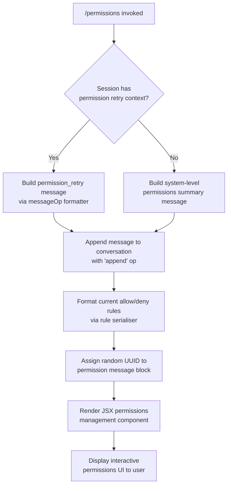

# `/permissions`

> Analysis basis: CC v2.1.169 bundle.js (AST extraction + Claude interpretation)
> Minimum version: v2.1.169

---

## Overview

The `/permissions` command (also accessible as `/allowed-tools`) provides an interactive interface for managing tool permission rules within a Claude Code session. It renders a JSX component to display and modify the allow and deny lists that govern which tools Claude is permitted to invoke. Upon invocation the handler appends a system-level message containing the current permission state and injects a `permission_retry` context message into the conversation.

---

## Registration

| Field | Value |
|---|---|
| type | `local-jsx` |
| name | `permissions` |
| description | Manage allow and deny tool permission rules |
| aliases | `["allowed-tools"]` |
| module_id | `vKK` |
| load_inline | `true` |
| loc_byte | `12571293` |
| loc_byte_end | `12571465` |
| loc_line | `8893` |
| arbor_handler.name | `ZUf` |
| arbor_handler.fqn | `claude-2.1.169::ZUf` |
| arbor_handler.kind | `AsyncFunction` |
| arbor_handler.resolution_path | `module_id` |
| arbor_handler.n_hits | `0` |

Analysis basis: CC v2.1.169 bundle.js:+12571293

---

## Input Branching

The handler has three identifiable execution paths based on the call graph and literals: (1) normal invocation that appends a system message and renders the JSX UI component, (2) a `permission_retry` flow path triggered when a retry context is detected, and (3) the internal permission-rule formatting path that serialises the current allow/deny rule sets.



---

## Behavioral Spec

### Main Handler — Permissions Command Entry Point

Analysis basis: CC v2.1.169 bundle.js:+12571111

```
async function permissionsCommandHandler(context):
    // Step 1: Render the permissions JSX component
    uiElement = createElement(PermissionsComponent, context)

    // Step 2: Build and append the permissions context message
    messageBlock = buildPermissionsMessage(context)
    applyMessageOperation(messageBlock, operation="append")
    //  "append" literal: bundle.js:+12571187
    //  "system" message role: bundle.js:+10922081
    //  "permission_retry" context key: bundle.js:+10922098

    // Step 3: Serialise current allow/deny rule sets for display
    serialisedRules = formatPermissionRules(context.toolPermissions)

    // Step 4: Assign a unique identifier to the permission message block
    blockId = generateRandomUUID()
    //  Iy.randomUUID call: bundle.js:+10922225

    return uiElement
```

### Permission Rule Formatter

Analysis basis: CC v2.1.169 bundle.js:+10922136

```
function formatPermissionRules(permissionRuleSet):
    // Join individual rule entries with ", " separator
    // ", " literal: bundle.js:+10922143
    formattedList = permissionRuleSet.join(", ")

    // Log result at "info" level
    // "info" literal: bundle.js:+10922168
    logInfo(formattedList)

    return formattedList
```

### Permission Rule Normaliser

Analysis basis: CC v2.1.169 bundle.js:+208915

```
function normalisePermissionEntry(rawEntry):
    // Log at "debug" level during normalisation
    // "debug" literal: bundle.js:+208891

    // Step 1: Validate entry index boundary (index must be >= 1)
    // boundary value 1: bundle.js:+207507
    if entryIndex < 1:
        return null

    // Step 2: Determine if the permission target is in the known-tool set
    isKnownTool = knownToolSet.includes(rawEntry)

    // Step 3: Serialise the entry for storage/comparison
    serialised = serialiseEntry(rawEntry)
    //  JSON.stringify used: bundle.js:+187585

    // Step 4: Uppercase the permission verb (ALLOW / DENY)
    verb = rawEntry.verb.toUpperCase()
    //  toUpperCase call: bundle.js:+209017

    // Step 5: Format the tool specifier
    formattedSpecifier = formatToolSpecifier(rawEntry.specifier)

    // Step 6: Trim whitespace from the final entry string
    result = buildEntryString(verb, formattedSpecifier).trim()

    return result
```

### Tool Specifier Formatter

Analysis basis: CC v2.1.169 bundle.js:+200494

```
function formatToolSpecifier(specifier):
    // Starting index is 0
    // 0 literal: bundle.js:+200499

    // Redact sensitive path components
    // "[REDACTED]" literal: bundle.js:+200573
    sanitised = specifier.replace(sensitivePattern, "[REDACTED]")

    // Split at depth 2 for tool-name extraction
    // 2 literal: bundle.js:+200602
    parts = sanitised.split(delimiter)
    lastSeparator = parts.lastIndexOf(separator)
    toolName = parts.slice(0, lastSeparator)

    return toolName
```

### Permission Rule Writer (Config File Path Resolution)

Analysis basis: CC v2.1.169 bundle.js:+208403

```
async function writePermissionRules(rules, configPath):
    // Resolve directory via path.dirname
    targetDir = path.dirname(configPath)

    // Enforce maximum byte size limits before writing
    // 1000 byte limit (bundle.js:+208722) — likely a per-entry limit
    // 100 limit (bundle.js:+208741) — likely maximum rule count
    if Buffer.byteLength(serialisedRules) > 1000:
        truncate or error

    if ruleCount > 100:
        truncate or error

    // Write rules to config file, then chain .then() callback
    writeResult = await writeConfigFile(targetDir, rules)
    await writeResult.then(postWriteCallback)

    return writeResult
```

### Bootstrap Fetch Helper (Called via Rule Resolution Chain)

Analysis basis: CC v2.1.169 bundle.js:+16097954

```
async function bootstrapFetch(url):
    // Log "[Bootstrap] Fetching" before request
    // "[Bootstrap] Fetching" literal: bundle.js:+16097956
    log(DEBUG, "[Bootstrap] Fetching", url)

    // Check in-memory cache first
    cached = cache.get(url)
    if cached:
        return cached

    // Perform HTTP GET with required headers
    response = await fetch(url, {
        headers: {
            "Content-Type": "application/json",  // bundle.js:+16098041
            "User-Agent": userAgentString          // bundle.js:+16098075
        },
        timeout: 5000                              // bundle.js:+16098157
    })

    // On success, log "[Bootstrap] Fetch ok"
    // "[Bootstrap] Fetch ok" literal: bundle.js:+16098330
    if response.ok:
        log(DEBUG, "[Bootstrap] Fetch ok")
        result = parseTokenSplits(response)        // w2_ call: bundle.js:+16098096
        cache.set(url, result)
        return result
    else:
        // Emit telemetry event for parse failure
        // "parse_failed" literal: bundle.js:+16098300
        // "api_bootstrap_fetch" event: bundle.js:+16098278
        emitTelemetry("api_bootstrap_fetch", { status: "parse_failed" })
        return null
```

### Token Split Parser

Analysis basis: CC v2.1.169 bundle.js:+2984790

```
function parseTokenSplits(rawData):
    // Split raw string on delimiter
    parts = rawData.split(delimiter)

    // Trim whitespace from each segment
    trimmed = parts.map(segment => segment.trim())

    // Find boundary index
    idx = trimmed.indexOf(boundary)

    // Extract the relevant slice
    result = trimmed.slice(idx)

    return result
```

### Model Name Normaliser (Called during Permission Context Resolution)

Analysis basis: CC v2.1.169 bundle.js:+2248110

```
function normaliseModelName(rawModelName):
    // Trim and lowercase the input
    cleaned = rawModelName.trim().toLowerCase()

    // Map known short-name aliases to canonical model identifiers
    // Known aliases detected in literals:
    //   "opusplan"  → bundle.js:+2252174
    //   "[1m]"      → bundle.js:+2252200
    //   "sonnet"    → bundle.js:+2252215
    //   "haiku"     → bundle.js:+2252254
    //   "opus"      → bundle.js:+2252293
    //   "best"      → bundle.js:+2252330
    switch cleaned:
        case "opusplan": return CANONICAL_OPUS_PLAN
        case "[1m]":     return CANONICAL_1M_CONTEXT
        case "sonnet":   return CANONICAL_SONNET
        case "haiku":    return CANONICAL_HAIKU
        case "opus":     return CANONICAL_OPUS
        case "best":     return CANONICAL_BEST
        default:         return applyFallbackNormalisation(cleaned)
```

---

## State & Side Effects

| Item | Detail |
|---|---|
| Telemetry | `tengu_feature_sad` fired on an error/unexpected-state path (bundle.js:+1014069) |
| Telemetry (bootstrap) | `api_bootstrap_fetch` with `parse_failed` status on HTTP parse failure (bundle.js:+16098278) |
| Message op | Appends a `system`-role message with `"append"` operation to the active conversation (bundle.js:+12571187, +10922081) |
| permission_retry context | Injects `"permission_retry"` key into the conversation context to signal a retry scenario (bundle.js:+10922098) |
| UUID generation | Each permission message block is assigned a fresh `crypto.randomUUID()` (bundle.js:+10922225) |
| Config file write | Permission rule changes are persisted to the project or user config file via the rule writer (bundle.js:+208403) |
| Per-entry byte limit | Maximum serialised size per permission entry: 1000 bytes (bundle.js:+208722) |
| Maximum rule count | Maximum number of simultaneous permission rules: 100 (bundle.js:+208741) |
| Bootstrap cache | Bootstrap fetch results are cached in-memory with a 5000 ms timeout (bundle.js:+16098157) |
| Data chunk size | Token-split data chunks capped at 1024 units (bundle.js:+16413011) |
| Sound | <!-- TODO: not found in depth-2 traversal; needs --depth 4 --> |
| Hook registration | <!-- TODO: not found in depth-2 traversal; needs --depth 4 --> |

---

## Version History

| Version | Change |
|---|---|
| v2.1.169 | Initial analysis |

---

## Common Mistakes

1. **Using `/allowed-tools` vs `/permissions`**: Both aliases resolve to the same handler (`ZUf`). They are fully interchangeable; neither is deprecated in this version.
2. **Assuming synchronous application of rules**: The handler is an `AsyncFunction`. Rule writes involve async file I/O via the config writer chain (bundle.js:+208661). Callers should not assume the permission state is updated synchronously after the command returns.
3. **Exceeding the rule count limit**: Only up to 100 permission rules are supported (bundle.js:+208741). Attempting to add entries beyond this limit will be silently truncated or cause an error in the rule writer.
4. **Entries exceeding the byte limit**: Each individual rule entry serialises to at most 1000 bytes (bundle.js:+208722). Overly long tool specifiers or glob patterns may be rejected.
5. **Expecting the UI to block**: Because the command renders a `local-jsx` component, the permissions UI is rendered inline in the terminal. The agent conversation continues; the JSX panel does not block further input.
6. **Sensitive path exposure**: The tool specifier formatter actively replaces sensitive path components with `[REDACTED]` (bundle.js:+200573) before displaying or logging rule entries. Do not rely on raw specifier strings being visible in logs.

---

## Appendix — Identifier Mapping

> For bundle debugging only. Identifiers change across versions.

| Identifier | Role |
|---|---|
| `ZUf` | Main async handler for `/permissions` command (Arbor-resolved, `claude-2.1.169::ZUf`) |
| `OBq` | Permission message builder / rule serialiser entrypoint |
| `H` | Bootstrap fetch + permission rule set array helper |
| `N` | Permission entry normaliser (validates, uppercases verb, trims, serialises) |
| `ItK` | Entry index boundary checker and field extractor |
| `CH` | Entry JSON serialiser (wraps `JSON.stringify`) |
| `R4` | Tool specifier formatter (redaction, splitting, slicing) |
| `rBH` | Post-normalisation rule finaliser |
| `StK` | Permission rule file writer (directory resolution, byte-length check, async write) |
| `P$` | Bootstrap fetch cache lookup helper |
| `w2_` | Token-split string parser (split / trim / indexOf / slice) |
| `q` | Token-split data container (wraps `$1` data source) |
| `u6H` | Known-tool membership checker (uses `vO4.has`) |
| `n3` | Entry string replace/sanitise helper |
| `M9` | Model name resolution router |
| `Cc` | Model canonical name resolver (delegates to `tY`, `pU`, `FA`, `CC`) |
| `c9` | Model name string normaliser (trim, lowercase, alias map, replace) |
| `eD` | Extended model name resolution (calls `c9`, then fallback `hG`) |
| `o6` | Error/unexpected-state path handler (emits `tengu_feature_sad`) |
| `d` | Telemetry emission helper (used by `o6`) |
| `K6` | Inner error dispatch helper (calls `c76`) |

---

Note: index built via Arbor fallback; some signals (telemetry, literals) may be missing — see arbor-fallback.js.