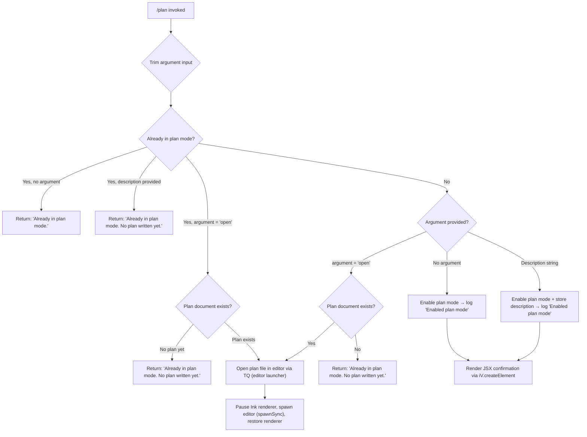

# `/plan`

> Analysis basis: CC v2.1.169 bundle.js (AST extraction + Claude interpretation)
> Minimum version: v2.1.169

---

## Overview

The `/plan` command enables **plan mode** for the current Claude Code session, or opens the existing session plan for viewing and editing. When invoked with no arguments or with the literal keyword `open`, the command opens the current plan document (if one exists) in the configured editor. When invoked with a description string, it activates plan mode and records the plan context, preventing tool-use execution until the user explicitly approves.

---

## Registration

| Field | Value |
|---|---|
| type | `local-jsx` |
| name | `plan` |
| description | Enable plan mode or view the current session plan |
| argumentHint | `[open\|<description>]` |
| module_id | `hKK` |
| load_inline | `true` |
| loc_byte | `12573107` |
| loc_byte_end | `12573306` |
| loc_line | `8893` |
| arbor_handler.name | `NUf` |
| arbor_handler.fqn | `claude-2.1.169::NUf` |
| arbor_handler.kind | `AsyncFunction` |
| arbor_handler.resolution_path | `module_id` |
| arbor_handler.n_hits | `0` |

Analysis basis: CC v2.1.169 bundle.js:+12573107

---

## Input Branching

Four distinct execution paths exist (no argument / `open` keyword / description string / already-in-plan-mode variants), so a Mermaid flowchart is used.



Analysis basis: CC v2.1.169 bundle.js:+12572409 through +12572884

---

## Behavioral Spec

### 1. Handler Entry — `planCommandHandler` (`NUf`)

```
async function planCommandHandler(args, appState):
    trimmedArg = args.trim()                      // loc +12572487
    currentlyInPlanMode = readPlanModeFlag(appState)

    if currentlyInPlanMode:
        if trimmedArg == "open":
            return openPlanInEditor(appState)
        elif trimmedArg != "":
            return "Already in plan mode. No plan written yet."  // loc +12572665
        else:
            return "Already in plan mode."                       // loc +12572445

    // Not yet in plan mode
    enablePlanMode(appState)                      // calls setMode via permissionManager (YO)
    log("Enabled plan mode")                      // loc +12572425

    if trimmedArg == "open":
        return openPlanInEditor(appState)
    elif trimmedArg != "":
        storePlanDescription(trimmedArg, appState)

    return renderJSXConfirmation(appState)         // iV.createElement loc +12572884
```

Analysis basis: CC v2.1.169 bundle.js:+12572220

---

### 2. Permission / Mode Activation — `setModeHandler` (`YO`)

```
function setModeHandler(mode, appState):
    if mode == "bypassPermissions":
        if bypassPermissionsDisabled(appState):    // loc +5066675
            log("Ignoring permission update: setMode 'bypassPermissions' rejected …")
            // loc +5066741
            return

    applyRuleUpdates(mode, appState)               // processes addRules, replaceRules, removeRules
    updateDirectories(appState)                    // addDirectories / removeDirectories
    deleteStaleEntries(appState)                   // A.delete loc +5068634
```

Analysis basis: CC v2.1.169 bundle.js:+5066739

---

### 3. Session Initialisation — `sessionBootstrap` (`HA6`)

```
function sessionBootstrap(config, appState):
    settings = buildEffectiveSettings(config)    // S9A: merges policy/flag/user/local layers
    toolList  = resolveAllowedTools(config)      // tp: reads --allowed-tools, session rules
    finalConfig = mergeConfig(settings, toolList)
    applySessionConfig(finalConfig, appState)    // N loc +11017170
    log("info", finalConfig)                     // loc +11017244
```

Analysis basis: CC v2.1.169 bundle.js:+11016946

---

### 4. Settings Layering — `buildEffectiveSettings` (`S9A`)

```
function buildEffectiveSettings(config):
    layers = [
        "policySettings",   // loc +1289450
        "flagSettings",     // loc +1289500
        "userSettings",     // loc +1289548
        "localSettings",    // loc +1289596
    ]
    merged = {}
    for layer in layers:
        merged = deepMerge(merged, config[layer])
    return merged
```

Analysis basis: CC v2.1.169 bundle.js:+11016869

---

### 5. Editor Launch — `editorLauncher` (`TQ`)

```
function editorLauncher(filePath, appState):
    inkInstance = getInkInstance(appState)       // DL.get loc +11676567
    if not inkInstance:
        throw Error("Ink instance not found - cannot pause rendering")  // loc +11676608

    editorName = resolveEditorBinary(appState)   // _U → HD/wNf loc +11675879
    stat = fs.statSync(filePath)                 // loc +11676701

    inkInstance.enterAlternateScreen()           // loc +11676761
    inkInstance.pause()                          // loc +11676791
    process.stdin.suspendStdin()                 // loc +11676801

    args = buildEditorArgs(filePath)             // L.split / f.slice loc +11676840
    result = child_process.spawnSync(            // $rq.spawnSync loc +11676883
        editorName,
        args,
        { stdio: "inherit" }                     // loc +11676915
    )

    content = fs.readFileSync(filePath)          // loc +11677185

    inkInstance.exitAlternateScreen()            // loc +11677263
    process.stdin.resumeStdin()                  // loc +11677292
    inkInstance.resume()                         // loc +11677308

    return content
```

Analysis basis: CC v2.1.169 bundle.js:+11676560

---

### 6. Plan File I/O — `planFileWriter` (`bV`) and `planFileReader` (`CV`)

```
function planFileWriter(content, appState):
    planPath = resolvePlanPath(appState)           // S0H: joins BQ path segments loc +13395329
    encoding = "utf-8"                            // loc +13395681
    writeFile(planPath, content, encoding)        // l6 loc +13395651
    if writeError:
        handleFileError(error)                    // k8 / E8 loc +13395703

function planFileReader(appState):
    planPath = resolvePlanPath(appState)
    content  = readFile(planPath)                 // CV → I6 loc +13395528
    return content
```

Analysis basis: CC v2.1.169 bundle.js:+12572616, +12572623

---

### 7. Tool-list Resolution — `resolveAllowedTools` (`tp`)

```
function resolveAllowedTools(config):
    tools = []
    for [toolName, toolDef] in Object.entries(config):    // loc +11006637
        normalised = normaliseToolEntry(toolDef)           // W3
        tools.push(normalised)                             // loc +11006716

    // Merge with cliArg --allowed-tools overrides         // loc +11004739, +11004788
    cliTools = parseCLIToolArg(config)                     // E9A
    tools = mergeToolLists(tools, cliTools)

    // Filter by session context                           // loc +11006327
    sessionTools = filterBySessionContext(tools)           // YFq

    return sessionTools
```

Analysis basis: CC v2.1.169 bundle.js:+11006637

---

### 8. Error / CLI Error Path — `cliErrorHandler` (`$1` → `smH`)

```
function cliErrorDispatcher(error):
    logToConsoleError(error)                     // smH → console.error loc +13208326
    paintRed(error.message)                      // J6.red loc +13208340
    emitTelemetryEvent("cli_error", error)       // loc +13208381
    writeErrorReport(error)                      // ij → nBH.writeFileSync loc +194899
    process.exit(1)                              // loc +13208394, exit code 1 loc +13208407
```

Analysis basis: CC v2.1.169 bundle.js:+16412968

---

### 9. JSX Render — `planConfirmationUI` (via `iV.createElement`)

```
function planConfirmationUI(appState):
    // Renders a terminal UI component confirming plan-mode activation.
    // Uses the Ink/React createElement pipeline.
    // Spawns ANSI-stripped output helper (x4 → Bun.stripANSI loc +3858630)
    // and native cursor telemetry (tengu_native_cursor loc +3830776).
    element = iV.createElement(PlanConfirmationComponent, { appState })
    return element
```

Analysis basis: CC v2.1.169 bundle.js:+12572884

---

## State & Side Effects

| Item | Detail |
|---|---|
| Telemetry | `tengu_feature_sad` (loc +1014069); `tengu_native_cursor` (loc +3830776) |
| Plan-mode flag | Session plan-mode flag toggled via `setModeHandler` (`YO`) when not already active |
| Permission rules | `alwaysAllowRules`, `alwaysDenyRules`, `alwaysAskRules` evaluated and updated (loc +5067202–5067267) |
| File write | Plan description written to plan file via `planFileWriter` (`bV`), encoding `utf-8` (loc +13395681) |
| File read | Plan file content read back via `planFileReader` (`CV`) when `open` is requested |
| Editor subprocess | `spawnSync` launched with `stdio: "inherit"` (loc +11676883, +11676915); Ink renderer paused/resumed around it |
| Ink renderer | `enterAlternateScreen` / `exitAlternateScreen`, `pause` / `resume`, `suspendStdin` / `resumeStdin` (loc +11676761–+11677308) |
| Hook registration | `ZGA.register` called within logging subsystem (`Z9`, loc +62328) |
| appState changes | Plan-mode enabled; plan description stored; permission-rule sets mutated |
| Exit on fatal error | `process.exit(1)` on CLI error path (loc +13208394) |
| ANSI stripping | Output sanitised via `Bun.stripANSI` (loc +3858630) before display |

---

## Version History

| Version | Change |
|---|---|
| v2.1.169 | Initial analysis |

---

## Common Mistakes

1. **Invoking `/plan open` before any plan exists** — The command returns `"Already in plan mode. No plan written yet."` (loc +12572665) rather than opening an editor. A plan description must be provided first via `/plan <description>`.
2. **Calling `/plan` when already in plan mode without an argument** — Returns `"Already in plan mode."` (loc +12572445) and makes no changes; it does not toggle plan mode off.
3. **Expecting `/plan` to immediately execute work** — Plan mode suppresses tool-use execution. The agent will draft a plan and wait for explicit user approval before proceeding.
4. **Editor not found** — If the resolved editor binary is absent, `spawnSync` will fail silently or throw. Ensure `$EDITOR` / `$VISUAL` is set to a valid binary before using `/plan open`.
5. **`bypassPermissions` mode interaction** — If `disableBypassPermissionsMode` is set at the policy layer, calling `/plan` in a session that was not originally launched in bypass-permissions mode will silently ignore that permission update (loc +5066741).

---

## Appendix — Identifier Mapping

> For bundle debugging only. Identifiers change across versions.

| Identifier | Role |
|---|---|
| `NUf` | Main async handler for `/plan` command (`planCommandHandler`) |
| `q` | Data-stream / event-queue helper used by error dispatcher |
| `$1` | CLI error dispatcher (routes errors to console, telemetry, file, and exit) |
| `smH` | Console-error formatter (paints red, emits `cli_error` event) |
| `ij` | Error-report file writer (`writeFileSync` + path join) |
| `QKH` | Plan-mode state accessor / flag reader |
| `K` | Column-padding / table-map utility (uses `padEnd`, `map`) |
| `L` | Queue manager with `add`, `delete`, `finally` semantics |
| `f` | Connection / stream object (`close`, `toLowerCase`, `padEnd`) |
| `A` | Generic map / set object (used for session state stores) |
| `YO` | Permission / mode setter (`setModeHandler`) |
| `N` | HTTP bootstrap / fetch helper (handles headers, Content-Type, User-Agent) |
| `ItK` | Bootstrap request builder |
| `vGA` | URL/platform helper (`yoK`, `hoK`) |
| `H` | Shared state map / global config accessor |
| `P$` | Config property accessor |
| `w2_` | String parser (split, trim, indexOf, slice) |
| `u6H` | Capability / feature-flag set checker (`vO4.has`) |
| `n3` | String replacement helper |
| `M9` | Multi-step string transformer (`Cc`, `c9`, `eD`) |
| `o6` | Telemetry event emitter (`tengu_feature_sad`) |
| `CH` | `JSON.stringify` wrapper |
| `_` | Generic utility / string input |
| `R4` | Path / string formatting helper (lastIndexOf, slice, replace) |
| `qZA` | Map-over-segments helper (`ZtK.map`) |
| `rBH` | Output write dispatcher |
| `lEA` | Low-level stream writer (`H.write`) |
| `StK` | File-append / session-log writer (mkdir, appendFile, rename, unlink) |
| `TBH` | Debounced buffered output flusher (setTimeout/setImmediate) |
| `_4H` | Log-entry formatter (`_M6`, `P6H.join`, `A_`, `I6`) |
| `l6` | File-system read utility |
| `n56` | Error-type checker (`E8`) |
| `MZA` | Path join + I/O helper |
| `Vo8` | File rename/unlink manager (stat, endsWith, slice, rename, unlink) |
| `htK` | Append-file pipeline (mkdir → appendFile → rename cycle) |
| `Z9` | Hook registrar (`ZGA.register`) |
| `U5` | String escaper / shell-safe transformer (`Yh4` → `replaceAll`) |
| `Yh4` | Character-level replaceAll escaper |
| `HA6` | Session bootstrap orchestrator |
| `S9A` | Settings merger (`buildEffectiveSettings`) |
| `yu` | Settings source reader |
| `EW` | Model compatibility checker |
| `N9A` | Feature availability resolver (`FA`) |
| `dwH` | Model-name classifier (claude-3, opus-4, sonnet-4, haiku-4 families) |
| `F9_` | Settings layer loader (`y8`) |
| `y8` | Settings hierarchy walker (`Ho6`, `YB`) |
| `tR` | Session metadata accessor |
| `c3H` | Config-entry iterator (Object.entries → `YO` → K.map) |
| `tp` | Tool-list resolver (`resolveAllowedTools`) |
| `W3` | Tool-entry normaliser (`wh4`, `rT`, `Jh4`, `Dh4`) |
| `wh4` | Tool name sanitiser |
| `rT` | `Object.hasOwn` guard |
| `Jh4` | Tool-definition field extractor |
| `Dh4` | Tool-name replaceAll normaliser |
| `E9A` | CLI-arg tool-list merger |
| `bbH` | Tool-cache accessor (`DXq.get/set`, `Jy6`, `Xy6`, `ua_`) |
| `T9A` | Tool path resolver (`MFq.relative`, `C6`) |
| `YFq` | Session-context tool filter (`d2f`, `q.get/set`, `YO`) |
| `d2f` | Session-inclusion checker (`JC.includes`) |
| `M` | Conversation/message store (`mSH`, `cd8`, `L.get/values`, `dXA`) |
| `tj` | Ink instance getter (`UL`) |
| `UL` | Ink render-root accessor (`$ZH`) |
| `$ZH` | Ink root reference |
| `sK6` | Plan-path resolver helper (`_zH`, `I6`) |
| `_zH` | Path-segment constant provider |
| `I6` | Cross-platform path builder (`xZ`) |
| `xZ` | OS path utility |
| `bV` | Plan file writer (`planFileWriter`) |
| `CV` | Plan file reader (`planFileReader`) |
| `S0H` | Plan file path constructor (`I6`, `_zH`, `q.get`, `gY`, `PG_`, `WiH`, `IL8`, `BQ.join`, `l6`, `q.set`) |
| `PG_` | Path-replacement normaliser (`H.replace`) |
| `WiH` | Path segment appender (`AP6`) |
| `IL8` | Alternate path segment appender (`AP6`) |
| `k8` | File-error handler (delegates to `E8`) |
| `E8` | Typed error factory / checker |
| `hH` | Async I/O error handler (`wA`, `_6`, `kq`, `av4`, `cgH.push`, `bo.logError`) |
| `wA` | Error/String coercion wrapper |
| `_6` | `String()` cast utility |
| `kq` | Error-queue processor (`duA`) |
| `duA` | Error-description formatter (`_6`) |
| `av4` | FIFO error buffer manager (`Di6.shift/push`) |
| `TQ` | Editor launcher (`editorLauncher`) |
| `_U` | Editor binary resolver (`HD`, `wNf`) |
| `HD` | Primary editor binary name reader |
| `jNf` | Editor-args builder (`G4A`) |
| `G4A` | File-type / extension resolver (`Fb8.basename`, `q9`, `ONf.find`) |
| `q9` | String index/slice helper |
| `y0` | Editor-type detector (toLowerCase, basename, `ZSH`; IDE detection loc +6530399) |
| `Sfq` | Terminal UI mount helper (`U86`, `x4`) |
| `U86` | Ink render initiator (`K.on`, `f.toString`, `wF`, `P9H.createElement`) |
| `wF` | React element factory wrapper (`cV_`, `qv_`, `Ws`) |
| `qv_` | `ZL9.createElement` caller |
| `Ws` | UI component builder (`_6`, `akH`, `D6`; emits `tengu_native_cursor`) |
| `x4` | ANSI-strip output handler (`Bun.stripANSI`) |

---

Note: index built via Arbor fallback; some signals (telemetry, literals) may be missing — see arbor-fallback.js.